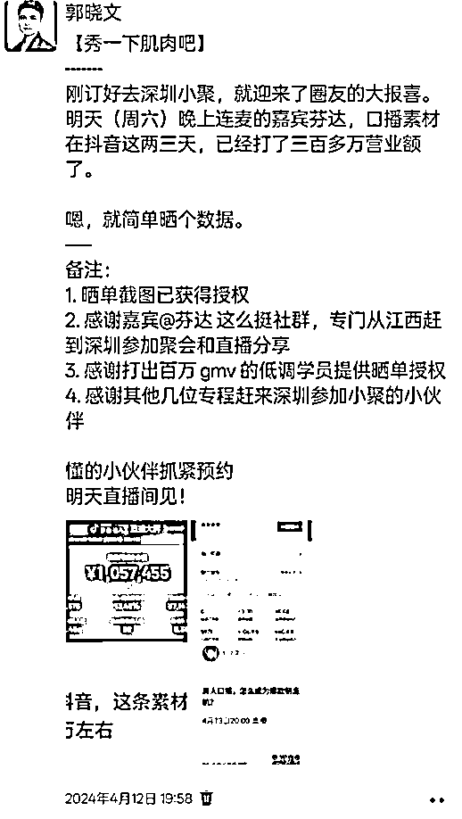

# 新手的第一堂商业课：玩弄信息差的艺术（年会演讲逐字稿）

> 来源：[https://rcn3ejfrmgzp.feishu.cn/docx/ILttdp1UAoFtzdxOR9ZcV3kFneh](https://rcn3ejfrmgzp.feishu.cn/docx/ILttdp1UAoFtzdxOR9ZcV3kFneh)

大家好，我是郭晓文，江湖人称最懂新手的男人。

很荣幸收到生财官方的邀请，到生财有术福建圈友见面会现场和大家分享。

以下是这次分享的逐字稿，希望对大家有用。

* * *

2019 年，刚进生财的时候，我还是一个职场失意，被迫创业；创业失败，不知该何去何从的纯小白。

到今天，一路起起伏伏，陆续实现了日入过千，月入过万，月入 10 万，年入百万，这些小的里程碑，或多或少，都和生财有术有关系。

也很荣幸，在这个过程中，我通过写文章、发视频、做直播等方式积极分享，也算是把最懂新手的男人这个标签给立住了，并留下了 14 篇精华帖：

精华帖：

1.  https://t.zsxq.com/0cterLU8z【新人参加见面会后必读】如何正确利用见面会获得的信息？

1.  https://t.zsxq.com/0b7J0cQoU 【保姆级教程】从零到一打造一个高质量交付的训练营

1.  https://t.zsxq.com/0bxyNOlWA 【手把手带你把一篇精华帖转化成可执行的SOP，抓住下次来临的红利】

1.  https://t.zsxq.com/03UbAyJAE【如何利用生财有术，抓住视频号带货的红利】

1.  https://t.zsxq.com/fU3F2jU 《抖音引流Tips合集：鱼钩思维+企业号专属引流方式+常见误区》

1.  https://t.zsxq.com/niQ7iIe【红包封面售卖】一周时间，搭建一个自裂变的赚钱系统

1.  https://t.zsxq.com/RRrfqJE 【操作手册】公众号1个多月时间做到几乎篇篇5w+，进阶版「manchuan」玩法

1.  https://t.zsxq.com/uZnyr7I 抖音月均播放量4个亿的短视频创作心法

1.  https://t.zsxq.com/Uzv3Nrv 抖音小程序依旧可以稳定日入过千的玩法，实操手册

1.  https://t.zsxq.com/b2FuNnq 茶叶垂直领域，抖音直播做到月营业额200w

1.  https://scys.com/articleDetail/xq_topic/411214282552288 接住红利，视频号图文来了

1.  https://scys.com/articleDetail/xq_topic/188514155422282 新手必看：分阶段的搞钱攻略

1.  https://scys.com/articleDetail/xq_topic/412254481412848 我是怎么从低谷走出来的

1.  https://scys.com/articleDetail/xq_topic/584555888418284 生财有术使用实例和锦囊

前段时间秀儿来邀请我在福建的年会上做演讲嘉宾，说实话，刚开始的时候，我是拒绝的。

因为这段时间刚好在探索一个新的方向，表达欲并不强。

但有一天晚上，我的脑海中突然产生一个念头：

「如果今天的我有机会对四年前刚进生财的，还是搞钱新手的自己说点什么，该多好啊」

于是，我打开和秀儿的聊天对话框，接下了这次年会的演讲任务

也就有了今天和在座的你，面对面的缘分和今天的演讲内容

「新手的第一堂商业课：玩弄信息差的艺术」

# 信息差，为什么是新手的第一堂商业课？

## 选择大于努力

为什么我把「信息差」的知识，定义为新手的第一堂商业课呢？

因为搞钱新手，正处于两种状态之间。

之前，是打工人。

之后，是独立搞钱人。

那么，两者之间的转变，就是我们首先要关心的。

那二者之间，最差的差别是什么呢？

来看两张图：

打工人，经常自称「牛马」。

牛马可不可怜？看起来很可怜，对吧。

但当牛马是有好处的：骑着你的老板知道哪里有你能吃到的草，他会告诉你「什么时候」「用什么姿势」「去哪里」。

这是我们独立搞钱时的状态。

看上去，很自由，对吗？

但自由的代价是，你得自己寻找觅食的地方，你要自己思考「什么时候」「用什么姿势」「去哪里」。

在你开始独立搞钱的那一刻起，你就拥有了选择战场的自由，也得自己承担选择的后果。

之前，有人帮你选。

别人帮你选的时候，虽然也拿走了大部分劳动剩余，但也会给你托底，不至于让你饿死。

现在，你得自己选。

你自己选的时候，虽然抢到的草都是自己的，但没选好的话，你可能会饿死，甚至掉入万丈深渊。

## 如何选择战场？

那，我们要怎么选择战场呢？

大家不妨把独立搞钱想象成玩游戏。

刚开局的你，手上没钱、没兵、没粮，自己的武力值也不高。

这时候，你要用什么方式起步，才能慢慢发展起来，建立属于自己的根据地呢？

你是：

*   直接上去攻打别人盘踞已久的根据地，和强者正面对抗？

*   还是打游击，寻找野生的，还没被强者占领的，可能有资源的空地，在别人反应过来之前，猥琐发育？

选择前者，你可能还没跟别人交上手，就已经被打飞了。

即使对手不打你，放任你发展，作为一个普通人，我们的资金、心力，都很难支撑我们熬到发育到有能力和强者掰手腕的一天。

选择后者，虽然说一旦自己的根据地被强大的对手发现，依然会被打飞，根据地依然会被抢走。（就是进入大部分人所说的，做不了的阶段）

但，即使是短暂的胜利，也可以给自己积累资金、资源、团队、能力、认知。

一起看三个例子。

前段时间有个很火的事件，就是生财的圈友花生，使用人工智能编程工具 cursor，花了一个小时开发出来的软件「小猫补光灯」。

具体内容可以去看花生本人发的帖子：https://t.zsxq.com/oql7k

这个 APP 短时间内就大火，pro 版本甚至登顶了苹果商店付费榜第一，花生也成了各大媒体争相报道的对象。

大家觉得，取得这样的成绩，是因为花生的编程能力多强，花生对用户的洞察多透彻，花生的资源多丰富，或者说，AI 编程的能力有多神奇吗？

感兴趣的小伙伴，不妨现在打开你手机上的应用商店搜索一下「补光」这个关键词。

你会发现：

1.  市场上已经存在大量的同质化产品

1.  一些大厂，已经做出了能够更好满足这个需求的产品

换句话说，如果你是今天入局，去做这款软件，要冲出来比登天还难。

但花生比别人都更早地发现了这块市场，这块蛋糕。

所以，即使是他当初只花了一个小时做的很简陋的版本，依然可以爆火。

即使随着各类对手入局，这款产品的盈利能力会下降非常多，甚至说这块蛋糕大概率会被别人抢走。

但，他通过这款产品，积累的资金、影响力、资源，都是实实在在的。

有了这些积累，下次他就有实力去跟别人竞争更富饶的根据地。

再举个例子：

前段时间，有个视频冲上了各大平台的热榜

【关于我用8000块在半年内赚了130万这事儿,毫无保留分享！】

当时我是在航海家群里看到了这条视频，然后就去联系了作者本人并和作者本人做了个两个小时的连麦。

简单讲一下这个故事。

故事的主人公，叫戚凯。

他是怎么用 8000 块钱起步，半年赚到 130 万的呢？

一开始，是他买了辆理想 L9，这辆理想 L9 是有车载冰箱的。

他习惯在车载冰箱放一些饮料，用来在路上解渴。

可是他在开车的时候，发现车载冰箱里面的饮料，会跟随车子的摇晃，发出哐哐哐的声音，体验非常差。

并且，他搜索了各大电商平台，也没有找到能够很好的解决他这个痛点的产品。

于是，他：

1.  在闲鱼上花 100 块钱，找了个工业设计师帮他把他对产品的想法，变成一个产品设计图

1.  然后又花了几千块钱找工厂生产模具

1.  在产品还没生产出来之前，他又花了点钱，把他的实物图，用电脑渲染出来

1.  然后直接上架到一家新的淘宝店铺，做预售

结果，这款商品刚上架，在没有花任何推广费用、还是预售的情况下，一炮而红

接下来，就是一路赚钱了。

那，为什么这个项目只赚了一百多万，而不是持续赚钱呢？

因为在接下来的半年里，不断有各种各样的竞争对手入局

有人做出同质化产品，和他卷价格战，刚开始售价接近两百的产品，被卷到只卖小几十块钱

也有人做出更优秀的产品。

结果就是，不到半年，他的那款产品就卖不动，很难产生利润了。

请问：如果你是搞钱新手，你觉得你在什么时机入局，结局会更好？

再举个例子：

你有没有感觉，很多项目操作贴明明很详细，你也很认真去做了，就是拿不到结果？

这不是写帖子的人有所保留，而是写帖子的作者，拿到结果的时候，项目的市场竞争还没那么激烈。

在这样的阶段，往往能做到「轻松赚大钱」。

但可惜的是，在那个阶段，别人知道这个项目并入局了，而你，是到项目人尽皆知，极度内卷得时候，才准备入局。

* * *

聊了那么多，我想表达的是：在需求还没被充分满足的战场战斗，打游击，会是普通人开启搞钱之路的一个不错的选择。

做个简单的总结。

e.g.

小猫补光灯，早期作者掌握了两个信息差：

1.  用 cursor 可以用极低的开发成本开发软件

1.  女生有用手机补光的需求，还没被充分满足

戚越嘞，早期掌握的信息差是：

1.  知道理想L9的体验很棒，接下来销量会暴涨

1.  感知到了车载冰箱的普遍痛点

1.  知道当下可以用极低成本，极短的周期，完成产品的开发、生产和销售

找到这类信息差，把握住这种信息差，能帮助新手更好地走出新手村，完成从零到一。

我希望，大家在听完这部分内容之后，可以对信息差这件事儿，有个正确的态度：

作为想突破阶层，突破现状的人，我们不仅不该小看信息差，蔑视信息差，我们还应该主动寻找信息差，拥抱信息差。

## 信息差的特点

接下来，我们将探讨第二个话题——信息差的特点。

我想与大家分享我的一个小小体感。

在过去的几年里，我带过很多人做过许多信息差项目。

信息差项目的一个显著特点是：在做的过程中，参与者的人脉、资源、能力和认知似乎都在不断增强。然而，绝大多数参与者的收入却在下降。

说白了：

从信息差被发现的那一刻开始，信息差就进入了被抹平的进程中，信息差带来的红利它以天为单位消失。

为什么会这样呢？

在今天，信息差带来的红利，消失的速度会远超我们成长的速度。

所以，如果我们把信息差当成一个风口，想最大程度的吃到信息差带来的红利：

1.  让自己更早发现哪里有风——这也是接下来我们要聊的，怎么寻找信息差？

1.  你要在扩大自己的受风面积——这也是接下来我们会聊的，如何抓住信息差？

1.  风吹过之后，你能留下什么？

1.  有的人，啥都没留下。

1.  有的人，留下了能力，资源、团队，影响力，还有钱

1.  有的人，留下了好高骛远的心

# 如何寻找信息差

这个问题，又分成：

1.  在哪里寻找信息差？

1.  怎么判断这是不是个信息差？

## 在哪里寻找信息差

我把可以找到信息差的地方，简单分成五个类型：

1.  公域

1.  搞钱圈子

1.  垂直行业圈子

1.  战友圈子

1.  自身体感

### 公域

公域，简单来说，就是以极低的代价，从那些和你毫无交情的人获取信息的地方。

包括但不限于：抖音、小红书、视频号等地方。

在这种地方可能有信息差吗？

会有。

但，从这种地方获取信息差，有两个问题：

1.  筛选难度高，大家都说自己有信息差，究竟谁说的是真的，你有能力分辨吗？

1.  信息差往往已经接近尾声了。说白了，公域平台的信息，你能低门槛的刷到，别人也行。一个信息差可以被大量的人、低门槛的获取，那这个信息差也被抹平得差不多了

### 搞钱圈子

这个不用多做解释，生财有术就是典型的，也是最杰出的代表。

在付费的搞钱圈子里，公域的两个缺点，都会得到很大程度的缓解：

1.  筛选难度降低。相当于你请了整个生财团队的人，对发帖的作者、发帖的内容，进行了筛选，信息更加贴近「搞钱」的主题，信息内容的真实性，也会因为同处一个圈子，有了不小的提升

1.  信息差获取门槛提高，不至于烂大街。说白了，就是用门票和价值观，筛选了能看到信息的会员的数量和质量。

以生财为例，你不仅可以通过大家分享的各类搞钱贴，发现信息差项目

还可以通过航海等产品，直接参与到一些信息差项目的实战当中。

### 垂直行业圈子

垂直行业圈子，就是以某个项目，某个行业为主题，而用各种方式建立的训练营、社群。

生财有术里面有的对应产品，其实就是定期推出的各类航海。

在垂直行业圈子里，信息差往往会越精准、越落地、越及时。

但要跨入垂直行业圈子的前提是：你得选择一个行业，开始实战了。

只有你开始实战了，这样的圈子对你才会产生价值。

否则，这里面的信息差，你也看不懂。看懂了，你也干不了。

在这边，我也呼吁一下大家积极参加航海，并且认真对待航海。

过往一年，参加过 3 次以上航海的小伙伴，可以举个手。

## 战友圈子

如果说垂直行业圈子，是开始干之后，才会有的圈子。

战友圈子，则门槛更高。战友圈，是需要你干了一段时间，积极利他之后，才会有的圈子。

21 年，我做的公众号引流项目，是我之前做搞笑号时期，帮助过的战友和我说的。

22 年，我在生财发的视频号带货的红利项目，是我之前做公众号引流项目，跟着我拿到结果的学员告诉我的。

早期，我发现信息差项目，更多靠自己挖掘。

后期，我发现的很多信息差项目，则都是各类战友分享给我的。

为什么他们愿意分享给我呢？

因为我也会积极给他们分享一些信息差，在他们需要的时候积极给他们帮助。

这种战友，最早是怎么开始积累的呢？

*   最早，我积极参与实战，在实战的过程中，经常会帮同样在实战的其他同学解决一些问题，这也让我帮到了一些人，积累了一些战友

*   后来，我一拿到好的结果，一有收获，就会在生财写帖子分享，这让我无形之中，帮到了很多人，积累了一些战友

*   再后来，我自己能拿到一些结果了，就开始通过包括做航海教练在内、做直播采访高手、写公众号文章的各种方式，把我的心得、技巧，传递给更多人，这也让我积累了一些战友

总之，就是在自己力所能及的范围内，积极输出，多帮助别人，给自己积累「福报」。

在这边，我也希望大家不仅要积极参与实战，更要积极地输出自己实战过程中的收获，在力所能及的范围内多帮别人。

相信我，这些动作，哪怕当下没有结果。

你释放出去的善意，早晚有一天会回到自己身上。

### 自身体感

以上，都是寄希望于「别人发现信息差」。

这点，则是自己发现信息差。

别人给的信息差，注定是二手信息。

前面说到了，获取信息差，「快」很关键。

而二手信息，注定不可能快。

那，要怎么获取一手信息呢？

送给大家一句话：

「春江水暖鸭先知」

春天到了，河水到底是什么时候变暖和的呢？

一直泡在水里的鸭，是最清楚的。

获取一手信息的前提是：你得在局中。

那么多的人在局中，你凭什么能第一时间获取到一些别人不知道的信息差？

这就要求你要保持敏锐，并且勇敢去探索一些未知领域。

举个例子，之前当我们所有人都挤破头做视频号带货的时候，就有小伙伴突发奇想，把我们在视频号卷的死去活来的视频，同步发到抖音上。

没想到，发出去的视频在抖音上大爆，干到了单场百万 GMV，一场直播拿到了大几十万佣金。

那个当下，大家都知道视频号很卷，但在视频号上发视频，确定是可以赚钱的，于是，大家拼命在视频号卷。

那个当下，同样的内容，在快手、抖音卷不卷，大家是没有共识的。

大部分人，都害怕自己去试了之后，发现依然很卷，白费功夫，于是，鲜有人去探索。

极少部分人，愿意去探索，愿意去试错，于是，即使探索的结果是失败了99 次，但最后一次探索到一个真的信息差，他就成了吃到信息差红利的第一波人，收益远远高于之前探索的小小成本。

再举个例子，最近大家都在做的 mini 航海——红包封面。

三年前，我做过这个项目。

那个时候，大部分人都选择在视频号上，抖音上、小红书上去发布红包封面相关的视频引流，同质化非常严重。

当时，我一边和大家在同样的渠道上卷，另一边，顺手在公众号、微店等渠道同步发布我的视频。

没想到，因为随手在公众号上发布的微信红包引流视频得到了非常大的推荐流量，一天涨粉过万，当天直接获利大几千块，过了个好年。

说这两个例子，就是希望大家在做到听话照做之后，在掌握了实战的技能之后，别只停留在听话照做这一步。

而要勇敢去探索一些无人区，用自己的体感，获取第一手的信息差。

财富，往往就藏在不确定中。

## 怎么判断信息差？

以上，我们说了 5 个可以获取信息差的渠道。

但，对大部分人来说，判断信息差，有一个更现实的问题——怎么判断是不是信息差？

信息差，说白了，就是：

「某个地方，20 分实力，竟然能赚 80 分的钱！」

这是什么？

这是 bug，这是异常值。

有心的小伙伴，以后看生财里面的项目分享贴时，可以刻意观察一下作者是怎么发现这些项目的。

你会发现，有无数项目的起点，都源于作者发现了一个「异常值」。

比如更绪发现的虚拟资料销售实战项目，是从一个放着没用的店铺，突然出了许多单开始的

又比如小猫补光灯作者，做补光灯软件的起点，是女朋友提出的一个没有被满足的需求的异常值开始的

又比如之前我做的视频号带货项目，起点也是我们的一个学员，在视频号上随手发了一条带货视频，当天赚一万多佣金的异常值开始的。

但是 ，真到实际应用的时候，问题就很多。

说白了，大部分项目摆在你面前，你都看不懂。

即使你看懂了，你也不知道正常值应该是什么样的，异常值是什么样的。

举个例子：

同样看到「补光」这个未被满足的需求，大部分人根本不会意识到，做一个满足这个需求的 APP，竟然只需要一个小时。

同样看到一条爆火的带货视频，大部分人根本不会意识到，这条视频竟然不是实拍的，而是用数字人生成的，更不知道数字人的成本和门槛有多

如果说异常值是用 20 分的实力，赚 80 分的钱。

大多数人的问题在于：

1.  既看不清实力

1.  也看不懂多赚钱

连正常值的基本认知都没有，更不用说要分辨异常值了。

那，要怎么办呢？

1.  具备一些商业常识。建议大家去看看生财思维课的：

1.  躬身入局，比如，多参与一下航海。

# 如何变现信息差

以上，我们聊完了如何发现信息差。

其中包括了五个渠道，以及判断信息差的标准。

接下来，我们聊聊，看到信息差之后，要如何变现。

这块，其实没有标准答案。

我也不想和大家聊太多的理论，直接和大家分享过去一年，视频号口播带货这波红利中，不同人抓住信息差，抓住红利的姿势。

关于这个项目，感兴趣的可以去看看

https://scys.com/view/docx/MiWJdJeOhoc8DFxpzRDc1HPsnvg

那我是怎么发现这个项目的呢？

2023 年年底，我发现我的一位学员，也是生财有术的圈友，特别忙，好像也特别赚钱。

细问之后，才发现他在做视频号口播视频连怼项目，并且短短半个月的时间里，就赚到了好几万。

我的第一反应是：这是个红利。

于是，我劝这位小伙伴开培训，来放大收益。

### 培训模式：从单兵作战，到带领一群人吃信息差

这位小伙伴当时的反应是：不然再验证一下？万一这个成功无法复制呢？

我说：

1.  红利以天为单位在消失，等完全确定这就是个红利了，红利也就消失了很多

1.  招不到学员，第一波学员的话，我来帮忙

1.  短时间内不知道怎么出一个系统的培训课的话，我来帮忙做课程

1.  如果招到生之后，发现这个项目的可复制性很差，交付效果有问题，我们就全款把学费退掉

在解决了交付体系的问题之后，我就写了一篇文章，用 999 的学费帮他招了 100 个学员。

后面，交付效果还不错 。

虽然因为一些历史原因，这个合作没有持续，但这次合作，给双方都带来了非常不错的收益。

整体来说，就是我们用培训的方式，把红利的信息差分享给更多人，并因此赚到了更多的钱。

我也想借这个合作，和大家分享：

1.  如果你赚的是红利的钱，「速度」非常非常重要

1.  要有速度的话，筛选大于培养，合作大于自己成长

### 培训+团长模式：从只赚学费钱，到从学员的收入中分钱

在知识付费领域，大部分只看到明面的钱——学费。

但，学费，其实是一次性收入。

在和这位生财有术小伙伴合作之后，根据他之前做其他项目的经验和积累的供应链资源，我们也开启了「培训+团长」的业务。

简单来说，就是我们和学员之间存在两项合作：

1.  培训合作

1.  学员出钱，学如何做项目；

1.  我们收学费，教学员做项目的技能

1.  供应链合作

1.  我们给学员提供能够提高更高佣金，结算更便捷的供应链

1.  供应链通过和我们合作，降低了 BD 达人的成本，就在总的出单佣金里，给我们让利一部分作为管道收益

说白了，就是我们教学员，赚一波学费的钱。学员出单了，我们还可以从学员的结果中，赚取一部分利润。

于是，我们也就有了更强的动力去把学员教得更好。

我也想借这个模式，和大家分享：

1.  如果你赚的是风口的钱，扩大自己的受风面积很重要

1.  扩大自己的受风面积，可以从成为别人躲不开的管道开始

在这边，我也很感谢之前合作的那位圈友。

没有他，我可能也不会那么快意识到可以做团长这个业务。

### 筛选+团长模式：不赚学费钱，进一步扩大受风面积

大家仔细看这张图，会发现，有两个重要的价值：

1.  出优质带货视频

1.  给视频做矩阵分发

出优质带货视频，需要的是做内容的人才。

而做矩阵分发，则要求具备运营能力，以及拥有号召足够多低成本分发力量资源的人才。

当时我们踩的非常大的一个坑是，两类人才，我们都想自己培养。

我们很用心地做教程，教大家怎么提高自己表现力，拍出更好地带货视频。

我们很用心地做教程，教大家怎么去运营，提高自己矩阵分发的能力。

但结果是：我们的发展非常缓慢。

因为：

1.  能力的提升，是缓慢的

1.  红利的消失，是飞快的

我们有个非常聪明的同行：

*   他不把希望寄托于自己培养口播人才，因为口播的人才，并不稀缺。

他把更多的精力，花在了和优质口播达人建立合作上，整天蹲着视频号的直播广场，看到谁的账号爆了就去私信联系，寻求合作。

*   他也不把希望寄托于自己培养打品人才，因为经历了多年的信息差项目的洗礼后，具备打品能力的个人和团队并不少

他干脆不收学费，低门槛接受大量的打品力量。

当他们手头上打品的人才越多，就会有越多的优秀的口播人才越愿意和他们合作。

而大量的优秀口播人才，又能反过来吸引更多优质的打品团队。

于是，同行在短时间内，就打出了非常高的营业额。

这，就是前面说的：

「在抓红利的时候，当你所需要的价值并不稀缺时，合作，大于培养」

### 代播/代剪模式：给淘金人卖铲子

有一句话，叫：

「淘金的人不一定能赚到钱，但给淘金人卖铲子的人肯定是赚到钱了」

当时我们在做项目的时候，就有一些小伙伴发现：直播这个环节有超级大的痛点。

*   直播特别消耗时间，消耗精力，但对直播能力要求又不高，随便找个人就能做

*   请个主播来播也不合适，因为爆单具有不确定性，爆单的时候，需要长时间直播，不爆单的时候，主播就会闲着没事儿干

淘金的过程有痛点产生，卖铲子的机会就出现了。

当时，就有几个小伙伴，打品没做起来，出镜拍视频也做不好。

但，他们在做的过程中，在圈子里感受到了「直播」的痛点，于是，就去搭建代播团队：说白了，就是找了大量的兼职主播，给打品团队做服务。

最终一步步，一年的时间里，从零起步，把代播业务，做到了今天的月 GMV 百万的水平。

对了，这个代播的创始人，也是生财有术的圈友。

### 超级个体：成为有价值且稀缺的环节

前面几个案例，讲的几乎都是个人能起步，但要做好都需要团队作战的类型。

那，个人在这种红利的时候，有没有赚钱的模式呢？

还真有。

大家可以仔细看看这张图，看哪个价值环节，是个体有希望打赢团队的。

答案是：内容创作。

在这波红利的过程中，有这么一波人，内容创作能力极强。

这个内容创作能力，指的是是「文案创作+出镜表达」的综合能力。

他们就只负责内容创作，把内容创作做到极致，剩下的环节，都有成熟的团队来找他们合作。

其中我了解的做得最好的，今年的收入应该早就在 7 位数以上了。

我也想借着这个点，和大家分享：

*   个体要打赢团队，往往需要具备软实力，或者说，一些非标的能力。比如，内容创作，文案创作

*   在稀缺且有长期价值的能力上深耕，是成为超级个体的关键

# 写在最后

总结一下今天的内容。

今天的内容，如果大家嫌长，就只带走这张图。

在你开始独立搞钱的那一刻起，你就拥有了选择战场的自由，也得自己承担选择的后果。

而要做好这个选择，寻找信息差，是一个不错的选择。

你要意识到这个自由，意识到这个责任。

今天的内容，大家可以理解为是「选择大于努力」这句话，搞钱新手的实践版。

但是！！！

我在准备今天的演讲稿的时候，也特别担心把大家从「埋头苦干」的极端，代入到「坐等信息差」「一心等捷径」的投机取巧的极端。

选择大于努力，没错。

但如果你没有努力实战，你根本无法做出好的选择。

拿「判断信息差」这部分内容来看，如果你没有实战经验，如果你没有具备一些最基本的商业知识，你一个外行，即使信息差糊你脸上，你依然会视而不见。

拿获取信息差这件事情来说：

1.  如果你没有判断信息差的能力，你压根就没办法在公域海量的信息里，筛出信息差

1.  如果你主动加搞钱社群、垂直社群，如果你加入之后没有主动学习、积极实战，你依然无法识别出信息差，更不用说抓住信息差

1.  如果你没有在努力学习、实践的同时，积极输出，主动帮助他人，你怎么会拥有战友圈？

1.  如果你没有努力参与实战，用心感受自己及身边人的痛点，你要怎么从体感里获得信息差？

所以，今天我分享的内容，是希望大家不要埋头苦干，莽撞地和对手正面对抗。

而要聪明的用力，有选择性的用力，在自己还没发育起来之前，打游击，猥琐发育。

最后，送给大家两句话：

何以生财，唯有实战

第二句话，则是发现并抓住信息差的关键：

身在局中，保持敏锐，敢为人先。

与大家共勉。