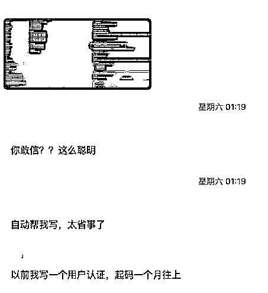

# 一行代码也不写，使用 Cursor 开发俄罗斯方块游戏

> 来源：[https://rxas35pmvn.feishu.cn/docx/BfKjd0H8NoP5WRxa1VUcP267nig](https://rxas35pmvn.feishu.cn/docx/BfKjd0H8NoP5WRxa1VUcP267nig)

之前的文章说如何使用 LocalIssues 可以进行项目开发，有一些朋友表示还没看明白，特此我做一个视频做一个说明

效果分享

*   有AI 编程群友使用这个方式，在项目开始前先写好了几十个 issues，甚至更多，然后一路继续

*   还有小白用户一路明确着可以完整的做出一个应用

对于不明白怎么使用的朋友，我把视频放上来，方便大家理解

LocalIssues 请访问 https://github.com/yinwm/LocalIssues