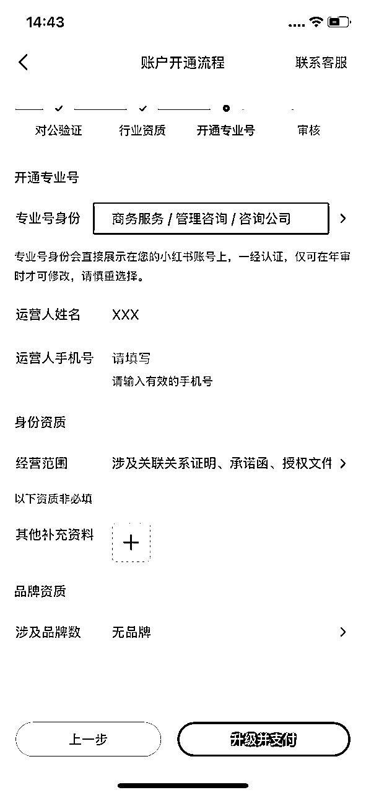
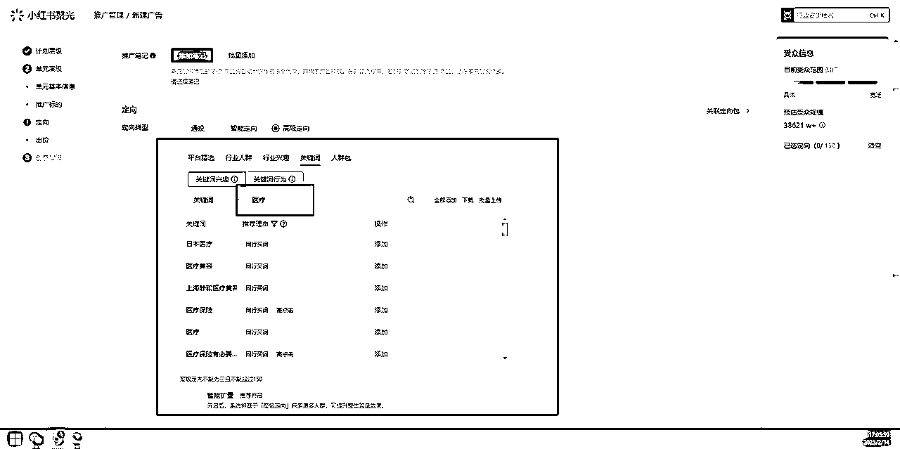

# `【小白友好】小红书聚光投放3个月从0到月利润15万+

> 来源：[https://j1ohuigiiff.feishu.cn/docx/PeNhdxzU2oVQXTxnBYucK46KnBd](https://j1ohuigiiff.feishu.cn/docx/PeNhdxzU2oVQXTxnBYucK46KnBd)

# 纸上得来终觉浅，绝知此事要躬行

# - 观星

大家好，我是观星，24年4月辞职ALL IN AI，我的标签：

*   🎖️ 退役特种兵

*   ⌨️ AI代写变现项目·聚光矩阵投流

*   🎥 AI副业IP

*   ⌨️ 提示词实战应用/定制

*   💰 AI赛道变现超6位数

*   精华帖：【胎教级教程】什么是AI提示词？为什么它对你至关重要？谁能从中受益？

*   往期复盘帖：

*   【胎教级教程】提示词0-1入门到入土，无痛编写提示词，一条价值1.2W的提示词商单拆解

*   《关于如何蛊惑（我妈）50岁阿姨通过【AI写作变现】月入5000+的》

# 引言

感谢生财有术，帮助我突破认知瓶颈，打破成长壁垒。特别感谢亦仁的领航。

生财有术不仅是一个社群，更是一个助我成长、引领我前行的灯塔。再次感谢生财有术的所有成员，你们的支持和分享让我有了今天的进步。

今天给大家说说小红书聚光投流

我接触投流也就三个月

单人单线负责投流，一开始只能堪堪跑正

第二个月利润到达3万

第三个月起5个投流号放大，月利润达15+万

从小红书投流起步到目前的成绩，说实话并不是一帆风顺。

刚开始我也走了不少弯路，比如盲目追求低价引流、过度重复爆款、没有建立数据分析体系等等。

然后商业计划书是因为我把PPT代制作研究了，分出来的一个高单价分支

链接：

正是因为踩过这些坑，我才慢慢总结出了一套完整的放量方法。

接下来我要分享的都是实打实的干货，从前期准备、账号设置、选品策略到投放技巧，每一个环节我都会毫无保留地讲透。

这些都是我花了几万学费换来的经验 - 各位看完就能少走很多弯路，直接进入正确的轨道。

特别是对于新人来说，掌握这些方法可以让你少走很多我当初走过的弯路。

让我们开始吧，我会用最清晰的思路，把每个环节都拆解得明明白白。

# 一、前期准备工作

## 01 丨必备内容

*   营业执照*1（需要咨询策划资质）

*   小红账号*1（优先有相关笔记账号）

*   资金：600+2000【用于开通专业号及聚光充值】

## 02 丨营业执照办理

没有营业执照的话去线上办理一个

## 03 丨办理个体户执照所需材料

## 1.身份证正反面照片

2.手机号 （办理海南执照 谁是法人需要提供法人自己实名办理的手机号 其他人的手机号都不行）

3.个体户取名 3 个字或者 4 个字（取 4-6 个名称备选）名称不要常见的，名称不过可以给您随机出名称

4.经营范围

5.收件地址 姓名及手机号

6.所有执照的邮费是发顺丰到付

谁是法人就必须提供谁实名办理的手机号，要不然签不了名 资料白做 切记

副卡 亲情号 虚拟号 非三大运营商手机号 海南执照都不能签名 就不用发资料给我了哈

## 04 丨资质选择（必须要有咨询策划服务）

技术服务、技术开发、技术咨询、技术交流、技术转让、技术推广；软件开发；信息系统集成服务；计算机系统服务；餐饮管理；市场调查（不含涉外调查）；广告制作；广告发布；广告设计、代理；教育咨询服务（不含涉许可审批的教育培训活动）；会议及展览服务；咨询策划服务；企业形象策划；个人商务服务；市场营销策划；企业管理咨询；摄影扩印服务；礼仪服务；组织文化艺术交流活动；影视美术道具置景服务；图文设计制作；工业工程设计服务；专业设计服务；工业设计服务；文艺创作；文化娱乐经纪人服务；旅客票务代理；国内贸易代理；国内货物运输代理；平面设计；建筑装饰材料销售；家用电器安装服务；家具安装和维修服务；普通机械设备安装服务；信息咨询服务（不含许可类信息咨询服务）；翻译服务；数据处理服务；招生辅助服务。（除依法须经批准的项目外，凭营业执照依法自主开展经营活动）许可项目：互联网信息服务；广播电视节目制作经营。（依法须经批准的项目，经相关部门批准后方可开展经营活动，具体经营项目以相关部门批准文件或许可证件为准）

# 二、账号设置

## 01 丨基础设置

账号选择：老号>新号（新号容易被认为营销号会被风控，最好选择已经发一些笔记的号）

账号基本信息设置：

头像：最好选择一个专业的头像（女生更容易成交）

昵称：以XXX策划，XXX咨询，XXX商业全案，XXX商业文案策划（如观星商业策划）

背景：正常图片即可，不要放带有微信号的内容（系统会查）

简介：采用身份+服务内容增加信任感

## 02 丨前期操作

*   多搜索相关笔记内容

*   多发几条相关的笔记内容（切记不要前期不要营销太重，先发干货内容）

*   然后置顶营销

## 03 丨专业号认证

开通推广投放：设置 > 账号与安全 > 升级专业号

以下为商业BP账号的选项

*   有 3 次审核机会，全部审核失败费用无法退回

*   每次都需要 600 元审核费

*   正常三天内审核完毕，一般一两个小时即可

# 三、聚光充值

## 01 丨聚光平台链接

https://ad.xiaohongshu.com/

## 02 丨充值方式

官方充值最低 5000，官方充多少到账多少

代理商代理充值 2000 起，可以拿返点和白名单【充 2000 到账 2200～2400，具体看代理商】

更推荐代理商充值

## 03 丨准备材料

第一步：开通专业号

（认证专业号相当于领了一张商业行为入场券，比如接品牌合作广告、 开薯店、投薯条等。不认证的话，很多功能会受限。看你个人需求。认证为专业号后， 0 粉丝门槛就可以开店。虽然粉丝量没要求，但类目是有要求的，有些类目开通薯店需要资质，比如说护肤、医疗领域等。)

1、准备好一个账号，登录 pro.xiaohongshu.com 这个网址

2、提前想好专业账号名（参考营业执照名）

3、800*800 像素尺寸的公司 LOGO 或者门店门头照片

4、营业执照

5、法人人脸识别（或者提交运营人员信息认证，二选一）

6、600 的平台认证费

第二步：投放资质认定

聚光后台 ad.xiaohongshu.com，手机号登录--推广中心--选择对应的行业资质，按照提示操作即可。

第三步：提供开户资料

提供一下小红书专业号名称，营业执照、还有一个未绑定小红书的邮箱。

专业号名称：

营业执照名称：

未绑定过的邮箱号：

注意：充值成功后需要登录刚发未绑定过的邮箱号

# 四、笔记内容

## 01 丨识别同行

带有赞助/广告内容的都是同行在推广

## 02 丨笔记封面设计

推荐稿定网版：https://www.gaoding.com/scenes/gongzhonghao

## 03 丨内容选择

寻找最近的爆款笔记进行洗稿，内容需要有人情味出现人设+痛点+解决方案+钩子

## 04 丨笔记发布

先筛选 6 个笔记并发布，在推广时可以刷一下数据引发客户咨询的冲动

找朋友或者小号在评论区咨询，问价，评论专业

# 五、选品

## 01 丨推荐平台

新红：https://xh.newrank.cn/

新红平台周卡 88 元

## 02 丨筛选热点品类

根据你擅长的领域进行选品，这里以商业计划书大盘为例

在新红可以看到某个品某个时间段的具体热度，再决定去发对应笔记

可以点击长周期查询，这样就可以看到一年里某个品热度高的时候

点击提交申请，稍等大概 1-2 分钟，就会出来数据

这里就可以根据时间线去发对应的笔记，市场热度高客资必然更多

## 03 丨品类爆款笔记筛选

搜索爆款笔记，筛选最近 1 个月的爆款去对标复刻

这里可以筛选视频 or 图文

这里可以筛选同行 or 素人

勾选企业机构、品牌号就是投流的同行

勾选头部 KOL、腰部达人、初级达人、素人就是自然流的

### 推荐混合对标

### 对标自然流的观看、互动数据会高点

### 对标同行的客资转化会高点

## 04 丨复刻笔记

点击图片即可查看数据或跳转页面

像素级复刻图片及文案及标签

做图用稿定【自己学习下就行，营销的封面不难做】https://www.gaoding.com/

文案用 AI 洗一下【标签最好不要改】

标题完全一模一样也没事【改一两字最好】

## 05 丨前期干货笔记

一样可以用新红去筛选爆款，复刻一篇笔记就行

# 五、广告投放

当下小红书是最热门的流量平台，但凡阿猫阿狗都能来做一点，因为流量真的相比于其他平台，太好入门，太好做

但是目前由于太多的人卷入这股浪潮，免费流量这个赛道已经卷得白热化了，并且官方也逐渐收紧了这个端口，但凡有丁点引流动作，动不动就是禁言限流封号。

## 01 丨聚光平台基本了解

# 我们不是来买流量，我们是帮平台卖流量！

平台出流量，我们出产品服务，吸引精准客户来买单。

事成之后，三七开账，平台占七。

挣钱嘛，不寒碜

# 给平台交保护费的好处

随便引流，违规了只是提醒下，并不会有惩罚【至少目前没有】，别太过

客资到了微信了，是可以长期影响转化

前期投入可能会高点，后面返单、客户推荐是可以持续增长的

## 02 丨聚光平台各项数据含义

只说一下重点关注的数据：

### 点击率（CTR）

*   定义： 广告被点击的概率

*   计算： 点击量/展现量×100%

*   参考值：

*   优秀： >5%

*   良好： 3%-5%

*   及格： 1%-3%

*   差： <1%

*   优化建议： CTR 过低时需要优化素材吸引力

### 平均点击成本（CPC）

*   定义： 获得一次点击的平均费用

*   计算： 总花费/点击量

*   参考值：

*   竞争激烈行业： 1-3 元

*   普通行业： 0.5-1.5元【商P品 1.5 以下最佳】

*   优化建议： 过高时需要优化出价策略

## 行动按钮点击率

*   定义： 用户点击行动按钮【立即咨询】的概率

*   计算： 行动按钮点击量/广告点击量×100%

*   意义： 反映广告转化效率

*   参考值： 优秀笔记行动按钮点击率>5%

## 行动按钮点击量

*   定义： 用户点击广告中行动按钮的次数

*   计算： 实际点击"立即咨询"等按钮的次数

*   意义： 反映用户转化意愿

## 私信开口成本

*   定义： 获得一次咨询的成本【发送消息】

*   计算： 总花费/私信咨询人数

*   参考值： 因行业而异，商P品 30 元以下为最佳

## 私信留资成本

*   定义： 获取一个完整留资信息的成本

*   计算： 总花费/完整留资人数

*   建议： 一般应该是开口成本的 1.5-2 倍

## 私信进线成本

*   定义： 一次行动按钮点击的成本

*   计算： 总花费/行动按钮点击数量

*   特点： 最能反映实际获客成本，商P品 15 元以下为最佳

其他数据的话参考意义就不太大，我们只看这几个即可

如何调出来

勾上之后点击确定即可

## 03 丨投放策略

## 第一步：先把钱烧出去，不需要管转化，投出去就行

系统需要 7-10 天模型学习时间，给你账号打上标签，这时候预算及价格都可以开高点

开启私信通，就可以设置自动回复引流，当然在小红书守着回复会提高引流成功率

## 第二步：优化计划和笔记，把成本降下来

逐步调低预算，同步优化笔记，把客资价格压下去

## 第三步：上矩阵放大

# 六、计划搭建

## 01 丨类型简介

代写品只需要客资收集的的计划

【千万不能点错，我有次选错产品种草 15 分钟直接烧出去几百块】

## 02 丨全站智投创建

推广 > 计划 > 新建广告

营销诉求选择客资收集

基本信息选择全站智投（系统会自动匹配根据标签匹配优质流量）

目标和出价方式

计划预算（均条笔记 50 元）例：你 6 条笔记预算就写 300

选择【均匀消耗】即可

点击添加笔记

智能定向（前期先不动后期可做优化）

出价（先设置 15 元，如果跑不动在加预算）

出价系数一般默认就行，如果点击率好转化不好，可以适当调到 1.3～1.5

投放资质 选择 商务服务-咨询策划

自动优化前期可以开

互动胶囊和置顶评论一定要开

最后点击完成即可

## 03 丨信息流投放

推广 > 计划 > 新建广告 > 客资收集 > 手动投放 > 信息流推广

推广目标优先选择 开口量 > 留资量 > 进线量

开口量 比较均衡

留资量 客资最精准，更好转化，客资单价偏高

进线量 不那么精准，不好转化，客资单价偏低【投不出、没询单时可以用】

预算条均 50

节假日上浮推荐打开

选择均衡消耗即可

然后点击【下一步】

添加完笔记之后，选择高级定向

商业计划书品选择奢美人群，精致中产，养生人群，奢侈品，悦享奢华

打开智能扩量

年龄把18-22去掉

行业人群 > 垂类人群 > 选择珠宝、奢侈品

行业兴趣 > 行业阅读兴趣 > 选择医疗、金融

优先把【关键词行为】铺满

【关键词兴趣】的话选几个关键的就行

【关键词行为】这三个全勾上，时间的话看品类，商P一般是 15 天

搜索【商业计划书】，把推荐理由全部勾上

点击添加即可，剩下的同理，关键词行为比关键词兴趣重要

【关键词兴趣】的话选关键的就行

可以问下AI【需要商业计划书的人群一般对什么感兴趣】

【重要】关键词不是越多越好！！！是越精准越好，像那些带着 XXXX 免费的词就不要放进来了

【重要】当然如果有那么多精准的词就尽量选满 150 个

【重要】多选点【关键词行为】

【也可看下新红，找找路径】

有钱人一般对医疗，资产配置，教育，奢侈品比较感兴趣

开口先设置 20，投出去了再慢慢降低，优化笔记，降到 15 左右即可

然后点击【下一步】

投放资质 选择 商务服务-咨询策划

自动优化前期可以开

互动胶囊和置顶评论一定要开

最后点击完成即可

## 04 丨搜索流投放

推广 > 计划 > 新建广告 > 客资收集 > 手动投放 > 搜索流推广

计划预算（均条笔记 50 元）

选择【均匀消耗】即可

添加完笔记之后，下面搜索关键词>以词推词>添加即可

搜索关键词组合，一般选择【人群词】【痛点词】【品类词】效果最佳

搜索关键词，把月均搜索指数由高到低

然后人工筛选关键词去添加

一些不精准的词就不要加进来了，例如免费 XXXX 的这些

精准为主，数量多不精准就是浪费钱

开口先设置 20，投出去了再慢慢降低，优化笔记，降到 15 左右即可

然后点击【下一步】

投放资质 选择 商务服务-咨询策划

最后点击完成即可

## 05 丨视频流投放

推广 > 计划 > 新建广告 > 客资收集 > 手动投放 > 视频流推广

视频流推广目标选择【私信进线量】更佳

成本控制选择【私信进线成本控制】

计划预算（均条笔记 50 元）

选择【均匀消耗】即可

添加完笔记之后

选择【智能定向】相当于全站智投

或者【高级定向】相当于信息流高级定向

高级定向和信息流的高级定向一样的设置思路

进线的话设置 15 就行，投不出去就提高，投出去了就降低

价格设置【由高到低】留资 > 开口 > 进线

然后其他设置都和前面一样的，最后点击完成即可

# 七、聚光重点功能

# 八、对标笔记搜索/筛选

如果没有开新红平台，可以在这里找热门爆款笔记

# 九、关键词规划工具

## 01 丨作用

可以提前筛选好，到时候【搜索流投放】的时候可以直接添加进去，不再需要一个个选

## 02 丨使用方法

和【搜索流投放】添加关键词一样

选好后点击下载即可

选好后点击下载即可

下载好后，下次新建【搜索流投放】计划的页面选择【批量上传】

选择文件

点击导入即可

# 十、人群规划工具

## 01 丨作用

可以提前筛选好，到时候【信息流投放】的时候可以直接添加进去，不再需要一个个选

最精准！前期制作会耗时点，但是做好后非常精准！！！

100 分推荐，根据你的产品人群去设置

## 02 丨新建方法

点击新建人群

对你的投流产品进行人群筛选

什么是交集/并集运算池

交集运算池

*   两个或多个人群条件必须同时满足才会被圈选

*   例如：年龄+性别+地域的交集，必须同时满足这些条件的用户才会被投放广告

*   缩小人群范围，提高精准度

*   适合冷启动期使用，帮助快速找到精准人群

并集运算池

*   满足任一条件的人群都会被圈选

*   例如：行为和兴趣的并集，只要满足其一就会被投放

*   扩大人群范围，提升覆盖面

*   适合成熟期使用，帮助放量获客

有人群包的情况下，高级定向的只需要再选择下关键词就行，平台精选、行业人群、行业兴趣不需要再添加

# 十一、开通自动回复

## 01 丨专业号登录

https://pro.xiaohongshu.com/

## 02 丨开通私信通

如图所示可以设置自动引流回复

## 03 丨开通微信名片发送

先点击添加名片

设置微信号，点击确定

回来点击设置，选择刚刚写的名片

最后切记切记点击【发布设置】不然就无效

# 十二 Q&A

## 01 丨账户基础类问题

Q1: 一个小红书聚光账户能否同时跑多个品类？如何判断是否适合一户多投？

这主要要看三个维度：

一是产品价格档位要接近，因为价差太大会影响出价策略和系统对人群的探索；

二是利润率要相近，不同品类的 ROI 要求差异过大会导致投放评估困难；

三是目标人群要有重合，人群差异太大会影响系统对用户画像的学习。建议前期可以混合投放测试，等规模起来后再考虑按品类分账户。新手建议先从单一品类开始。

Q2: 如何判断小红书聚光账户的人群覆盖是否精准？

主要通过几个关键指标来判断：

一是看点击率和转化率是否明显低于行业水平，如果严重偏离说明人群覆盖有问题；

二是观察账户的成交用户画像，是否与目标客群有较大差异；

三是看转化的稳定性，如果波动很大说明人群不够精准。建议通过调整定向和优化素材来提高人群精准度。

## 02 丨投放策略类问题

Q3: 新手如何快速度过冷启动期？具体策略是什么？

冷启动期建议采用"三步走"策略：

第一步选择 2-3 个精准素材，用相对高价快速积累数据，先不要太在意成本；

第二步跑出 开启私信通自动回复，同时开始做素材测试和优化；

第三步等有了稳定数据后，逐步调低出价和优化成本，将客单价控制在合理范围。重点是前期宁可高价也要快速建立账户模型。

Q4: 计划频繁掉量要如何处理？

掉量处理需要分三个层面：

首先分析是否是素材疲软，如果是就要及时进行素材迭代和裂变；

其次看是否是竞价问题，可以适当提价 5-10%提升竞争力；

最后检查定向是否过窄，可以通过开启智能放量来扩大受众。

注意不要频繁修改计划参数，这样反而会加速计划衰退。

## 03 丨素材策略类问题

Q5: 如何正确做素材裂变而不是简单复制？

素材裂变的核心是"留形去意":保留原素材的核心爆点（如特定画面、核心文案等），但对其他元素进行创新优化。

比如可以改变表达角度、升级画面质感、优化文案结构等。

一个好的爆款素材通常可以裂变出 3-5 个子版本。避免简单换封面标题这种表面改动。

Q6: 如何判断素材是否值得裂变及如何最大化利用？

判断标准主要看两点：

一是该素材是否成为账户主力计划（占消耗 30%以上）；

二是复制的相似计划是否也能稳定起量。

如果符合这两点，可以通过"裂变+复制"双管齐下：

一方面进行素材裂变创作新版本，另一方面针对不同人群定向复制投放计划。

每个裂变素材建议日常维持 2-3 个计划量级。

## 04 丨定向策略类问题

Q7: 冷启动期的定向策略应该如何设置？

冷启动期建议采用"窄定向高出价"策略。可以从三个维度构建定向：

一是核心人群特征（年龄、兴趣等）；

二是行为标签（搜索、互动等高意向行为）；

三是关键词定向（产品相关的精准词）。

覆盖人群建议控制在 1000-3000 万，等数据稳定后再逐步放开。

Q8: 如何设置合理的智能定向？

智能定向策略分三步：

第一步设置基础定向锚定核心人群；

第二步在行为兴趣中选择 3-5 个最相关标签；

第三步开启智能扩量让系统自动探索相似人群。

建议选择"关键词行为"优于"关键词兴趣"，时间窗口建议选 15-30 天，确保信号新鲜度。

## 05 丨计划管理类问题

Q9: 如何判断计划是否值得继续投放？

主要看三个维度：

一是 ROI 是否达标（可以接受稍低但要有上升趋势）；

二是点击率是否达到行业均值的 70%以上；

三是转化成本是否在可接受范围。对于新计划，建议至少给 3-4 小时观察期。

如果多个指标持续低于标准，可以考虑暂停或优化。

Q10: 什么情况下需要提高或降低计划出价？

出价调整要看具体场景：

需要提价的情况包括计划完全不出量、消耗过低、竞争加剧等，每次建议调整 5-10%；

需要降价的情况包括消耗过快、ROI 偏低、预算即将耗尽等，建议分多次小幅调整，避免一次调整幅度过大导致计划死亡。调价要选择消耗上升期而不是下降期。

## 06 丨投放准备类问题

Q11: 投放前需要做哪些数据调研？

重点做好三个维度调研：

第一是竞品分析，包括投放素材风格、价格带和转化路径；

第二是行业数据，了解平均客单价、获客成本和 ROI 水平；

第三是用户洞察，收集目标用户的痛点和消费习惯。建议使用新红等工具进行系统化分析。

Q12: 投放前素材储备需要准备多少？

素材储备遵循"3-6-9"原则：

至少准备 3 个差异化的素材方向，每个方向 6 个以上的具体素材，计划在 9 个以上的投放位置进行测试。

素材要确保既有共性又有差异，避免过度同质化。建议 70%遵循现有爆款方向，30%尝试创新突破。

## 07 丨投放准备类问题

Q13: 不同推广类型（信息流/搜索流/视频流）如何选择？

选择依据是"产品特性+用户习惯"：

信息流适合需要场景化展示的产品；

搜索流适合有明确需求的高转化品类；

视频流适合有故事性和种草属性的产品。

建议新手先从一个流量进行深耕，熟悉后再逐步扩展。

Q14: 如何设置合理的计划预算结构？

预算分配建议遵循"2-6-2"原则：

20%用于测试新计划，60%集中在主力计划，20%用于潜力计划培育。

单个计划的预算建议设为预期客单价的 10-15 倍。新计划先小额测试，表现好再逐步加大投入。

## 08 丨人群定向类问题

Q15: 如何构建精准的人群定向包？

构建定向包要遵循"交集+并集"策略：

用交集运算锁定核心人群特征（如年龄、消费能力），用并集运算扩充行为兴趣定向。

建议通过人群规划工具提前设置，覆盖 2000 万左右人群最佳。定期优化更新确保定向新鲜度。

## 09 丨素材优化类问题

Q16: 素材数据表现差该如何诊断和优化？

诊断分三步：

首先看前点击率，判断素材吸引力；

其次看评论互动，了解用户反馈；

最后看转化数据，确认变现能力。

优化也要针对性跟进：

吸引力差就优化开头，互动少就加强代入感，转化低就突出卖点。

Q17: 如何判断素材是否进入衰退期？

主要看三个信号：

一是点击率连续 3 天下滑超过 20%；

二是互动率明显低于账户平均水平；

三是获客成本持续上升。

一旦发现衰退迹象，要立即启动素材迭代计划，避免等到完全衰退才反应。

## 10 丨数据分析类问题

Q18: 如何建立有效的数据分析体系？

数据分析要建立"日-周-月"三级体系：

日常监控 CTR、CPC 等即时指标；

每周分析转化趋势和素材效果；

每月复盘 ROI 和获客成本。

## 11 丨投放策略类问题

Q19: 如何打造矩阵式投放体系？

矩阵投放要形成"金字塔"结构：

顶层是 2-3 个主力计划，

中层是 3-5 个潜力计划，

底层是持续的测试计划。

通过不同计划组合覆盖不同人群和场景，实现投放效果最大化。

Q20: 竞品投放分析该如何做？

竞品分析要关注三个维度：

一是素材风格和卖点提炼；

二是投放时段和预算分配；

三是人群定向和渠道选择。

建议通过工具定期监控竞品动态，及时调整自身策略。

## 12 丨高阶投放策略类

Q21: 如何通过付费流量来协同自然流量？

流量协同的核心是"1+1>2"。

首先要重视内容质量，付费投放前先确保素材的优质度；

其次通过付费流量获取精准用户并形成初步互动，这些互动数据会反馈给系统算法；

最后系统会基于这些数据对内容进行自然分发。

但要注意付费与自然流量的比例，建议付费流量占比不超过 40%。

## 13 丨投放数据类

Q22: 聚光系统模型建立需要多久？如何加速？

系统通常需要 7-10 天的学习期来建立模型。加速方法：

一是前期使用较高出价快速获取数据；

二是选择精准定向降低系统学习难度；

三是确保素材质量提供良好的互动信号。

建议投放预算至少是客单价的 20 倍，为系统提供足够学习样本。

Q23: 不同阶段的消耗天花板如何突破？

消耗突破要分阶段：

冷启动期通过提高出价和扩大预算；

成长期通过拓展定向和优化素材；

成熟期则需要通过增加账户数量来突破。

每个阶段的消耗增长会逐渐变缓，这时就是需要调整策略的信号。

# 十三、结语

最后，我想跟所有看到这里的朋友说：

小红书聚光投流，看起来门槛低，但实操起来确实有很多细节需要注意。

不要被那些"零经验""躺赚"的营销号给骗了。就像开车一样，理论知识固然重要，但真正要掌握，一定要亲自上路才行。

记得我刚开始的时候，每天盯着数据看，一个客资来了都激动得不行。

从最初的日消耗几百块到现在可以管理多个账号，说实话也经历了不少焦虑和自我怀疑。

但正是这些过程，让我深刻理解了投流的本质：

不是给平台送钱，而是帮平台卖流量。 不是简单复制爆款，而是找到属于自己的增长路径。

不是靠运气赌爆款，而是通过持续的数据优化和策略调整。

很多人总问我："现在小红书还能做吗？竞争是不是太大了？"

我的回答永远是肯定的：只要你的服务是真实优质的，只要你愿意踏实做内容、研究数据，就一定能在这个赛道里找到自己的位置。

投流只是跑通私域的第一步，后续通过社群运营、私域转化、客户复购带来的收益才是更可观的。

如果你已经在尝试投流但遇到了瓶颈，或者你正准备入局但不知道从何下手，可以链接我，我很乐意解答你的疑惑。

每一个现在看起来游刃有余的人，都曾经和你一样迷茫过、焦虑过。

重要的不是现在在哪里，而是愿意迈出第一步，然后持续学习、持续优化、持续成长。

相信看完这篇内容的你，已经对投流有了更清晰的认识。

现在，是时候把这些知识转化为行动了。期待在未来的某一天，看到你也能分享自己的经验心得。

我是观星，还是开头那句

# 纸上得来终觉浅，绝知此事要躬行