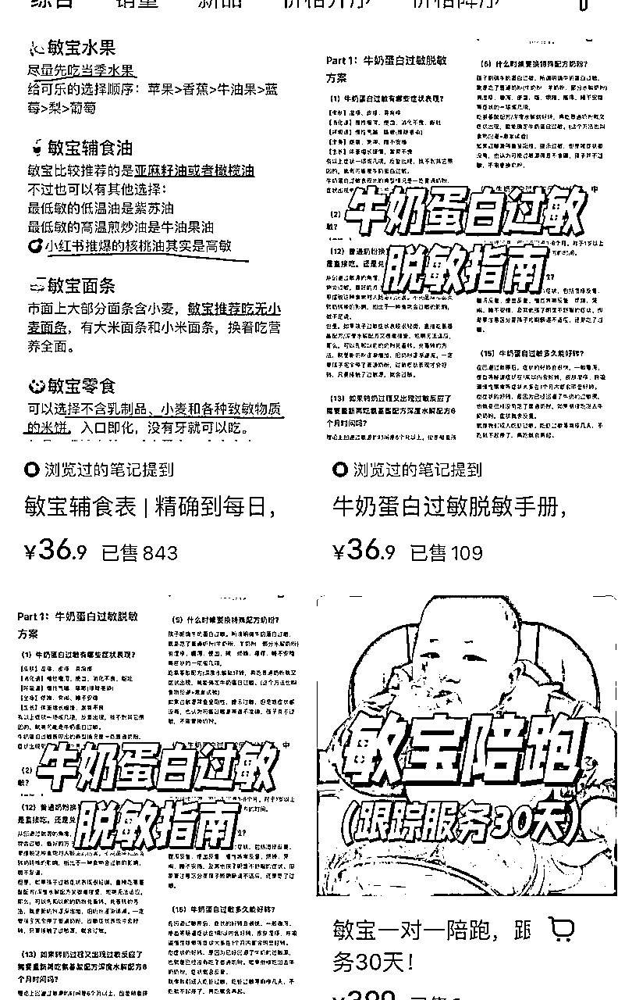
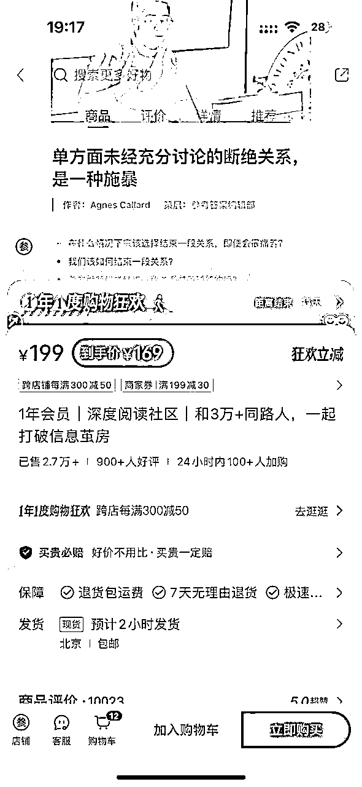
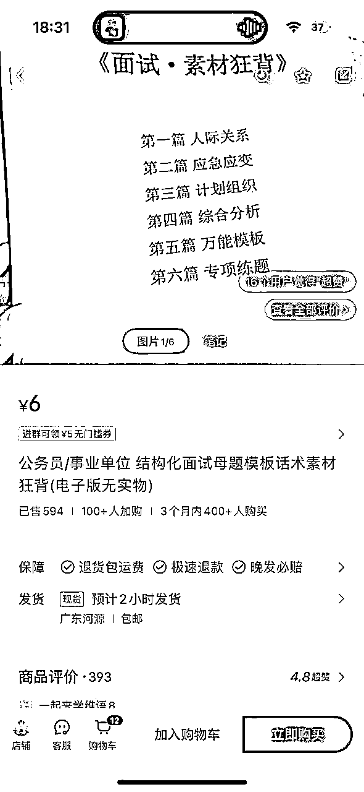
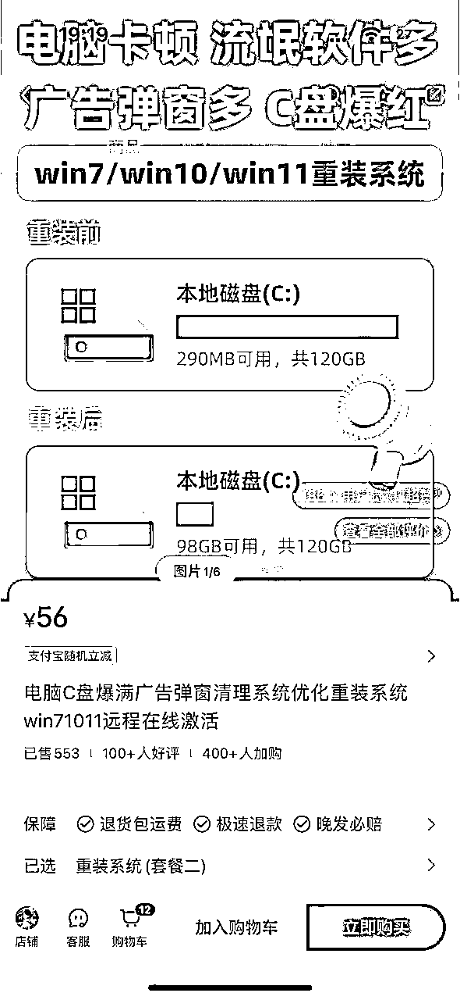

# 1年卖了2000多单数字产品，作为普通人的我1.1w字复盘

> 来源：[https://g8ekpu7h0l.feishu.cn/docx/C3d6ddb6NoxPv0xZnGNcomOUnth](https://g8ekpu7h0l.feishu.cn/docx/C3d6ddb6NoxPv0xZnGNcomOUnth)

复盘去年开始做所谓的知识付费，我更喜欢称为数字产品。

突然感觉我挺普通的，我不是KOL，也不是重点本科，没有在大厂工作，履历平平，但是在去年一整年，大概卖了将近2000单的数字产品。

我想，我能代表一批人

和我一样相对普通的非精英群体，到底该如何去在互联网赚到一些非职场价值体系下的钱？

## 01 你不必成为某个行业的专家

很多人都有一个误区，你必须要专业，最好成为一个行业专家，有一大批粉丝，你才能做所谓的知识付费，其实并不是这样的。

从数字产品的角度来看，你不用成为行业专家，你只需要能够解决一部分人的【付费需求】即可，也就是说你只需要比一部分人懂、擅长某些知识，同时你能够找到他们，解决他们解决不了的问题，就可以了。

当然，你可以以行业专家的方向督促自己进步，这能够帮助你成长。

首先，你需要找到一个非常非常细分的需求，同时你在这个非常非常细分的需求内是一个很专业的人。

其次，你需要学会构建产品和销售。

那么，我们要定义什么是数字产品。

很多人觉得产品就是课程，这归因于应试教育带来的认知惯性，我想要完成一次蜕变和成长，必须要有一个课程去承载。

课程很有价值，但是不适合个体，因为对于大多数个体来说，没有办法和资源，也没有精力和passion建立一份课程。

而数字产品的最小单位可以是简历模板，30天菜谱，甚至也可以是一篇外文文献的翻译稿，整体来说，不要担心你所设计的数字产品小，因为在整个简中社交媒体的容量足够大，需求五花八门，所以任何细分、小众的需求都可以找到基数足够大的受众。

## 02到底要卖什么数字产品？第一件事就是要盘资源、找定位

数字产品的开发第一步并不是去模仿和找对标，而是要静下心来，放下偏见，认认真真的去做自我复盘；

看到很多博主，他们其实有很强的内容表达能力，但是由于没有合理分析自己的优势是什么，直接扎入一个不熟悉的领域和赛道，最后草草收场。

欲速则不达，你想要做小红书数字产品，一定要先学会盘资源和找准自己的定位

为什么盘资源和找定位如此重要？

如果你没有去盘自己的优势资源，你最后很容易陷入选题慌，比如你是经验丰富的HR，你非要去走上美妆赛道，HR赛道你是专业的，你过往有大量的经验积累，在小红书上表达如鱼得水，你有源源不断地选题，起号对你来说不是难事，你只是把自己过去的经历和经验转移到小红书上。

这类的经验鲜活、独特、专业，很容易吸引算法和粉丝

而这个时候，你再开发出相应的虚拟产品和服务，真正完成了商业闭环，你也从打工人的角色转变成生意人，完成角色的蜕变。

那么到底该如何盘资源和找定位呢？

第一步自我提问：你是否完成过一些成就，完成这个成就的过程中，经历了挫折和失败，虽然过程曲折，但是你最终战胜了自己，并且有足够丰富的表达欲去表达这件事，以及这个经验很利他。

这个问题很重要，因为它对你来讲是隐藏的内容金矿，因为你不去刻意搜索，大脑很难想象你有这么一段经历；

而这个问题得关键在于【这个经验是否利他】

因为你要挖掘出能够利他的因素 ，否则你整理出来太小众，不仅无法引起共鸣，同时也会打击你的自信心。

所以，你要找到真正的市场和你的优势进行匹配，将你的知识残片变为他人的生存刚需。

我举几个典型的场景，且存在一定红利的场景

宝妈场景

可能很多人都会问，宝妈这个人群还有虚拟产品的红利？

再去细品我刚刚说的那句话，将你的知识残片变为他人的生存刚需。

对于有经验的宝妈，都经历过大大小小抚养婴儿遇到的各种难题，比如宝宝辅食，宝宝出现各种病状的相对应处理方法。

因为很多人都是第一次当妈妈，他们没有经验，而你过往的经验就可以成为他人的生存刚需，你只需要把这些经验封装起来就可以。

真正的竞争优势往往藏在三类特殊资源中，未被量化的生活算法，跨纬度的认知嫁接力，痛苦经历的解决方案库。

而在你的宝妈角色中，肯定有各种痛苦经历以及未被量化的生活算法，你就需要写下来。

这是你在宝妈角色下的痛苦经历解决方案，而你在整个人生中有很多角色，比如你是HR、考研上岸、考公上岸，考证上岸，装修达人、数字游民、大厂被裁成功转行等等。

你有无数的角色和经历，只要你拿到了结果，无论是失败还是成功，都可以去量化，写下来。

每个社会角色背后都隐藏着特定的知识体系和需求痛点，通过拆解角色的显性痛点和隐性痛点，就可以将生活经验转化为可销售的虚拟产品。

这些经验必须要具体、必须要鲜活、系统，能够提供真正有用的建议。

刚刚宝妈的角色有什么虚拟产品场景可以开发呢？就需要从经验角度入手。

比如，有很多宝宝都容易对很多食物过敏，比如对大米过敏不耐受，对牛奶过敏，以及不知道如何添加辅食，等等这些问题都是养娃过程容易出现的问题。

如果你经历过，并且有经验，都可以把这些整理出来，生成PDF文档或者excel

我看到小红书有一个宝妈的虚拟产品就是敏宝辅食表，售价36.9元，卖出去了800多份。

同时，这位宝妈的店铺还有《牛奶蛋白脱敏手册》卖出去100多份

还有牛奶蛋白过敏1对1咨询，卖出去185份

总体来说，针对过敏宝宝这个细分场景，开发了很多虚拟产品，并且销量都还不错。

所以，对于宝妈来讲，需要刻意的去观察和留存养娃过程中可能遇到的问题。

到了这里，很多人都会有一个问题，我没有足够丰富的经历怎么办？因为这类产品必须有大量的案例和经验去支撑，个体的经验相对来说比较单薄。

这个时候就要学会吸收他人经验，快速让自己成长起来成为专家，最简单有效的方法就是加各种群，比如公众号的粉丝群，各个大V的群，专业的宝妈交流群，育儿交流群等等

去看看他们在谈论什么，焦虑什么，有什么问题，他们的提问，就是你制作虚拟产品最好的养料。

其次，去看小红书，特别是要看那种求助帖、评论回答多的问答帖，以及那些高赞的评论，都是你需要关注的问题。

职场场景

职场场景太泛了，每个人都有过在职场的经历，所以假如你想单纯分享一些所谓的泛职场干货，比如如何做会议纪要，如何向老板汇报等，这类内容的受众太广，竞争压力太大，特别是面对这么一个成熟的市场，都有非常专业的玩家入场，不太适合你。

而对于职场场景最好的定位一定是垂直行业+你个人优势/积累的放大

首先，我来讲讲积累

每个行业，每个工种都有自己独特的方法论以及相关的资源文件，比如就广告营销行业来讲，就有各种方案模板、工作用到的表格，以及行业报告等。

之前看到有的博主，粉丝不高，但是卖活动策划用的表格，总计就卖出去500多份，还有的博主卖方案模板，行业报告等等。

这就是资源型虚拟商品

你必须要刻意对各种文件进行留存，并且场景要丰富多元，把这类产品匹配到一个场景，比如活动策划场景下用到的表格。

年终总结场景下用到的汇报模板，蛇年营销用到的全部素材PSD等等，一定一定要落地到具体的场景下，才有下单的理由。

如果你给了一堆资料，但是没有办法唤醒消费者的场景记忆，那么也很难销售成功。

第二类虚拟产品是对自己经验的封装

这个经验不一定要非常全，但是一定要非常精准，能够解决消费者具体的某一个问题，比如我曾经就制作过一个虚拟产品，是我用3天时间写的一个广告人作品集的制作思路，它是我关于广告人如何做作品集的经验封装，在小红书也卖出去300多份。

和上个案例提到的宝妈案例一样，只是把你过往经历的某个切面经验进行总结，它字数刻意不用太多，但是必须要精准，能够解决消费者的问题。

## 03 Build in public

Build in public的本质是解决流量问题和信任问题，因为在社交媒体上不表达，就没有机会让别人认识你。

在中文互联网比较主流的平台有微信公众号、 小红书、抖音、B站、快手、微博等等。

虽然有很多平台，但是有些平台难度很大，在这里我主要推荐两个平台，分别是小红书和微信。

因为这两个平台可以延展出两种不同的形式，首先微信平台可以发图文+长文+视频

而小红书可以发图文+视频

在这里我们主要谈论通过文字表达自己。

小红书的上限是1000字，而微信公众号没有上限，所以无论你想深度的去表达还只是想快速的去表达（不写很多字），小红书和微信公众号都可以满足你的需求。

另外，现在公众号和小红书的算法对于新人来说都十分友好，你有足够强的专业知识储备，再加上不错的网感和写作技巧，很快就可以找到自己的受众。

build in public还可以解决信任问题，因为你拥有一个叫做账号的东西，账号里的内容就是专业的集合；

可能有某个粉丝通过A笔记找到你，然后进入你的账号，最后在你的账号看到了B笔记，对你产生了信任感，然后关注你，再看到你有一些数字产品，刚好满足他的需求，那么他就有可能下单。

表达的意义在于，它有很长的生命周期，你构建的越多，你的内容越多，那么它们发挥的威力就越大。

就像雪球效应一样，越滚越大。

所以，不要担心你的表达没有意义，如果你发出的内容当下没有反馈，再等一等，说不定日后的回报是超额的。

## 04不要担心自己写不好

很多人抗拒写作的原因有一个很重要的阻力是担心自己写不好，因为在我们传统的教育体系框架下，你写作文还要写800字。

但是在社交媒体写作不要担心写不好，因为社交媒体大大缩短了写作的门槛，同时还有一个很重要的区别，你写作只需要把一件事说清楚。

比如如何构建一个Notion文档？你不需要华丽的词汇，你只需要把你的认知、技巧、干货用文字沉淀下来，把这件事说清楚即可。

当然，你可能也不一定要写作，也可以通过拍视频、录播客表达自己。

并不是每个人都适合写作，所以在一开始就要多尝试，多探索，找到适合自己表达的方式，再去构建自己的内容体系。

## 05数字产品是一个体系

一开始我有一个误区，我总认为你需要做的只是解决流量端和产品端的问题，首先是获客，其次是销售，把这个产品卖出去。

这种思维方式本身是没有问题的，想要销售数字产品，只需要解决流量端和交付端就可以。

但是，这种生意模式下，你只是做了一次性生意，也就是说你辛辛苦苦做了很多内容，只完成了一次转化，没有从单个消费者的完整生命周期考虑问题。

不要做产品生意，而是要做人群生意。

可以理解为你销售的第一单是和消费者完成第一次信任交付，如果你不留下他，那么你就很难再次触达。

有复购的生意，才是好生意。

就像很多生意模式，它看似GMV很高，但是流量很贵，利润很低，需要不断地投流来获取流量，最后只是表面繁荣。

那么，该如何理解数字产品是个体系呢

体系也可以称作系统，它包括产品+社群+社区留存

这是我的理解，就拿我的小红书专栏举例，一开始我并没有打算建立社群，因为对于我来说太沉重了，我没有当群主的经验。这是我的担忧；

但是后续我发现，绝大多数付费读者都问我有没有社群，然后我就建立了一个社群，这是我数字产品体系的1.0：专栏+社群。

后来，我在宣传这个专栏的时候，直接把社群转化为卖点，告诉潜在的用户，我不仅有专栏，而且还有社群。

这种策略带来了明显的转化，很多用户喜欢社群，所以它买的是社群门票；

另外，社群的价值在于它能够提供很多一手、超前的信息和观察洞察，不断的交流碰撞很容易有新的启发，就小红书引流来看，群里就贡献了10几种有用的引流策略。

不过，关于建立社群对我来说有一个不足的地方，由于我前期考虑不周，没有进行人群分流，没有考虑到我要建立的是一个社区，而一个群500人的容量远远不够，最后导致后续的读者没有群。

所以，建群只需要把单个群人数满足到150就可以，因为150是邓巴数字，在这个区间内，每个人都可以自由的表达自己，且没有压力。

500人的社群会出现一个很严重的问题，后续进群人数和前期人群没有熟悉感，同时500人的社群人数比较多，会给一些成员带来表达压力，最后导致内容输出不够。

总结一下，开始建群的时候就要考虑建多个群，然后保持每个社群的人数有一个均等的状态，当然，这取决于你要有足够强的流量能力以及产品能力要扎实，否则后续没有流量很麻烦。

后续我又发现一个问题，小红书的行业资料很多，特别是行业月报，每个月都会发布，然而大多数人不知道渠道在哪里，甚至有很多人都甚至去买这些报告，显然是没有必要的。

所以，我在社群建立没多久，就建了一个知识库，用来更新小红书的资料，包括热门笔记、行业动态、小红书报告、官方课件等；

后续我也加入了一些我的公开分享内容；

目前这个知识库也成为了我推广专栏的一个渠道，每天都会有100+人访问我的知识库，到目前为止，已经有1.1w人看过这个知识库。

最后想说一点，从一开始我做数字产品，到后来的配套社群，再到最后的知识库，这已经成为一个体系，这一开始并没有在我的规划内，可以说这一套是长出来的；

显然，最后它获客能力也比较强，在我没有推广专栏的情况下，每天也有自然增长，如果非要说理由，一个最大的理由就是它是公开的，每个人都可以访问；

很多人也想做知识付费，但是它并没有做到持续性，无论是交付还是表达，最终都半途而废了，有一个猜想，他们是完全利他，而没有利己，最后因为金钱反馈不足，而导致放弃，也就是付出显然比不上回报。

而我能够坚持的原因在于，本身我就是小红书博主，同时也对表达有足够多的passion，始终在一线，我写过1000多篇小红书笔记，也收获了很多正反馈。

能否坚持一件事，除了要有足够强大的外界反馈外，内心也要足够自洽，要相信这件事能成，这也就差不多了。

## 06虚拟资料和数字产品之间的区别

虚拟资料和数字产品是有区别的

首先是趋向内卷的竞争态势，假如这个产品不是你亲自设计，只是在互联网上找的资料，再去整合一下，那么就是第一种情况，虽然前期有一些时间差带来的先发优势，不过后续只会陷入价格内卷。

因为你这件事本身是缺乏门槛的，你能找到，其他人也能找到，这就是虚拟资料，它不是你的利基市场，同时，如果你对这个赛道不擅长的话，很难深入进去，只能做非常浅显的整理。

我举个例子，假如你想做K12教育的虚拟资料，虽然你也上过小学和初中，但是你对当下的环境了解如何？很难洞察到真实的消费者需求，最后就陷入了【照葫芦画瓢】的业务流程，比如做什么你做什么，别人卖什么你卖什么。

然而，数字产品就不同；

首先，数字产品你一定要做原创者吗？

并不是，数字产品的本质是解决用户的问题，它无关乎你是否原创，无关乎你是否是专家，只需要你能够解决它的问题。

举个例子，现在小红书有一类数字产品是知识库，比较知名的是参考阅览室，参考阅览室在小红书的销量过万，从侧证明它是一个不错的商业模式。

主要是通过内容策展的方式，去对国外优秀的信息源进行一个整合，方式很新颖，同时也出现一些模仿者，但是我看到很多小红书账号虽然数据不错，几千赞，几万赞，不过真实的销售转化并不好（有转化，但不高）。

为什么会这样，我大胆做一个推测

因为参考阅览室已经建立起足够强大的壁垒，它有先发的入场优势，同时它的销量很高，2.5w+；

对于大多数人来说，如果有需要，第一件事是考察这个产品的实力，如果客单价相对来说比较低，那么什么是第一核心卖点？一定是销量

销量是一个很神奇的数字，它不仅能够代表这个商品的受欢迎程度和火爆程度，同时它也是信任力的积分，所以我给一些想做数字产品的同学一个建议就是，不要卷单价，而是要卷销量。

在前期先提高销量，让利给消费者，提高自己的信任积分，然后再去尝试做一些高客单的产品。

除此之外，该如何借鉴/模仿参考阅览室？

参考阅览室的成功证明了消费者对优质信息的需求，甚至为了需求可以付费，那么也可以说明，垂直行业的知识库是不是也可以模仿？

去做一类人的需求，这样就可以避开锋芒了。

所以，任何一个大众性的需求，都可以转化为垂直行业的需求，就像我刚刚说的那样，做人群生意，比如运营人群有什么需求，是否有知识库的需求？产品经理人群有知识库需求吗？

考研人群是否有知识库需求？考公人群是否有知识库需求？

无论是notion还是飞书，教育成本已经很低了，尝试去做一个知识库，不仅利己，而且利他。

最后总结一下虚拟资料和数字产品的区别

1.虚拟资料相对门槛较低，竞争压力大，最终容易形成内卷，要保证尽快的入场。

2.数字产品不一定是原创者，而是真实的解决了用户的问题，就像买手一样，他们也是有价值的

3.数字产品的构建比虚拟资料难度要大，但是天花板比较高。

## 07少学习方法论，多学习案例

方法论其实很抽象，同时也会让人上瘾，因为它会让你觉得你行了，在作者的方法论文章里，一切都变得没有摩擦力，你总是能跟着作者的思路成功。

但是其实方法论干货读多了，当你真正下场去做项目就会发现，虽然你已经熟读方法论，同时方法论的颗粒度拆的也很细，但是你发现你下场后困难重重。

举个例子，比如你学了如何在小红书做矩阵号赚钱，但是其实你真正下场干的时候，你会发现，如何解决多个账号注册问题，如何解决身份验证问题，如何解决营业执照问题...等等

我并不是否定方法论的价值，而是很多方法论无法通过文字去表达一些干货，或者称作实操的智慧，它没有办法通过语言描绘，但是至关重要。

方法论的作用更像是汽车的辅助驾驶，它只能辅助你，但是你不能完全依靠它。

如何找到需求？如何找到你自己的优势？如何找到机会点？

最简单有效的方法是学习案例，因为案例是最真实的，它正在发生，说明它的需求是当下存在的，而不是过时的需求或者伪需求。

举个例子，如果你要做数字产品，你可以去找小红书社区销量最高的TOP10，再去看他们发笔记的角度，标题、封面图，正文，以及关键词，销售引导等等。

我刚开始做的时候也很迷茫，我想知道什么笔记好转化？什么笔记流量好？什么笔记点击率高？

后来就看其他人怎么发的，我发现一个流量密码，就是粗糙感。

比如你想要出售资料库或者自己写的内容合集，那么你可以把它打印出来，然后用手机拍下，当封面图。

这样做的好处在于，它区分于其他精心设计封面图，看似随机拍摄，但是它提供了足够丰富的信息，所以它点击率很高。

而这些都是案例，你必须要拆解案例，并且找到对自己有利的内容，来赋能自己的业务。

另外，方法论都有一定的【滞后性】，因为真正在现场的人，大多数人都在忙自己的业务，你想要学到真东西，必须和他们同频，到现场去，去观察——抽离——总结——复用

方法论也有用，在于你遇到一个很具体的问题，很具象化的困境，再去看其他人怎么做的，就像我刚刚说的那个问题，如何解决手机号问题？如何解决营业执照问题？

如何最低成本完成矩阵账号搭建等等？

这些很具体的问题都可以参考方法论，而不是去看《如何做好小红书》这个方法论。

## 08如何理解低客单和高客单

其实高客单和低客单可以卖给同一拨人，很多人都有一个误区，就是要做一次性生意，就推出了很多高客单地服务，你每次都需要浪费口舌去解释你地产品，转化一次很费力，情绪价值也不高。

但是，当你从低客单地视角去看，你卖了一个产品，假如可以加到微信，那么就相当于你获得了一个很有价值地潜在客户，因为他第一次信任你，给你下单了，那么你在不断的发朋友圈，不断的去展示你的专业，就可以把他转化为高客单。

所以，从获客的角度来看，低客单其实就是一种获客方式，假如你的利润产品是高客单的话，那么就可以通过低客单获客，高客单转化。

总结一下，在整个数字产品体系的构建上，低客单和高客单的有效配比，是最有效的。

## 09定价50元以下的产品最好卖

如果你不是一个非常知名的KOL，也不是业内熟知的技术大牛，就不要把产品价格设立的太高，因为产品价格太高，你没有建立足够的信任力，那么消费者的下单阻力比较大。

所以，你要去思考你的产品，如何在你每天都不需要费尽口舌解释它哪里好的情况下，把它卖出去，据我观察，定价50元的产品最好卖

比如19.9元、39.9元等

我和很多购买过我产品，但不是我粉丝的消费者交流过，有一部分消费者的下单逻辑是逛买，偶然看到了，所以我下单了；

那么，假如你的产品定价非常高，就会给消费者一定的下单阻力，特别不是你粉丝的消费者，他们很可能就不会下单。

如果你想要把你的产品售卖给非粉丝群体，且很容易让他们下单的话，你就需要去做一件事，思考你的定价策略，其次，不断地在社交媒体表达，扩大你地知名度，build in public，就可以了。

## 10为什么小红书是最适合做数字产品的平台

如果你是新手，那么小红书是最适合你的平台，因为从小红书的基础画像来看，它集结了最爱学习、同时付费意愿强、事少的群体。

所以，小红书是最适合做数字产品的平台。

同时，小红书的算法友好，只要你有足够丰厚的专业积累，构建一个小红书账号，在小红书账号里搭建你的数字产品体系、内容体系，就可以有效的闭环。

另外，小红书为所有站内商家提供了乘风、千帆的推广平台，你可以不断触达有意向购买的粉丝群体。

小红书是最适合做数字产品的平台，几乎没有之一。

## 11在核心课题找到你自己的利基市场

数字产品是有生命周期的，什么意思呢？

在蓬勃的简中互联网知识付费市场中，经常有各类的数字产品浮现，但是很多数字产品很快就过时了，对于个体来说，如果你辛苦开发的数字产品很快过时了，其实综合性价比并不高，也不符合纳瓦尔所说的边际成本为0的优势，在开发数字产品的时候，要考虑生命周期。

比如，你辛辛苦苦开发了一门《微信公众号运营笔记》，但是现在这门课绝对不会有人买，因为它过时的很快，它不是核心课题，它是处于一种中间态的知识，很容易被淘汰。

但是，什么不会淘汰？写作，因为从小到大，写作这个需求永远存在，这个就是核心课题。

那么，再延伸一层，你如果开发一门《社交媒体写作课》教大家如何在各个平台写内容，比只教在微信公众号写文章活的更久，生命周期更长。

因为写作是核心课题，社交媒体也不会消失，所以这个产品永远不会过时。

如果你关注在互联网上销量一直比较火的课，会发现卖的最好的都是比较基础的课程，比如口才课、比如演讲能力课、甚至教别人唱歌的课都能卖很多。

除了以上的例子，还有很多利基市场，比如健康、个人成长、职场、升学考试等等，几乎是所有人的核心课题。

而一个产品如果想拥有永恒的生命周期，你要做一件事，那就是在核心课题中找到你自己的利基市场。

你需要思考的是，你在这些核心课题里擅长什么呢？

以及你擅长的这部分，你是否能够成体系的去梳理出一套方法论/技巧/SOP/模板/知识库呢？

比如，有的人非常擅长考试，特别是擅长考公，那么她就可以去开发考公领域的数字产品。

在小红书，关于考公的数字产品有很多，比如有的人把面试话术整理出来，有的人把必备素材整理出来，这些都是数字产品。

他们可能在公务员考试并没有拿到大结果，但是他们很会去总结需求，并且是要给很好的产品经理，所以他们就能开单，卖很多单。

总结一下，如果想开发一个一劳永逸的数字产品，需要关注两个关键点，第一个就是核心课题，这个核心课题内一定要有很多细分细分的需求，包括已经被挖掘和没有被挖掘的需求；

第二个关键点就是在这个核心课题内，你能找到利基市场。

利基市场就是你的擅长、你的优势，在这个领域你没有对手，同时你有源源不断的干货、经验积累，同时你在这个领域里表达毫无压力。

## 12不要用精英视角思考需求

我经常听到这么一句话：这居然也能赚钱？？

看到很多人（包括我）发出这样的疑问，归根到底是我们从自己的视角去找需求，也就是假如你是消费者，你会为什么产品付费？

但是，每个人的背景不同，可能对于某个产品，某个需求的理解不同，可能你有能力解决这个问题，然而对方由于没有你那么优秀，他不能解决。

他想完成某件事，就会有卡点，那么有卡点，就会有需求，所以就会出现产品或者服务来帮助他解决这个问题。

所以，要思考，在你的职业和擅长中，是否有一些场景能够解决用户的一些卡点问题，虽然对于专业人才来说可能技术上不是什么难事，但是对于普通人来说有一定的门槛

举个例子：C盘清理

C盘清理看似很简单，几乎人人都会，但是对于很多小白，这是一个难题。

当然，如果认真百度或者去小红书搜索，一定会有详细的解决方案，但是为什么不去学习解决这个问题呢？

这里就需要考虑学习成本、时间成本以及紧迫程度。

因为很多人的付费集中点在于它很急迫，比如他们必须要找到解决方案，他们可以学习如何清理C盘，但是时间不允许，所以它找擅长的人去帮助他解决这个问题，这个时候【付费需求】就产生了。

## 13真正有价值的情报只能靠自己

真正有价值的情报只能靠你自己，没有人能告诉你赚钱的机会在哪里，假如某个机会被大肆宣扬，要么是红海拼杀，要么是知识付费的陷阱。

如果你想要做好小红书，你就需要在小红书刷时间，不是去看教程《如何做好小红书》，而是要去刷小红书，至少要对爆款有一个自己的认知。

另外是评论区，特别是一些笔记下的高赞评论，基本能代表一类人的需求，以及假如你想售卖数字产品，你就可以看热销商品笔记，看他们如何发笔记

同时，比如你是做设计师，同时想开发自己的数字产品，最好的办法就是去看同行在做什么，以及小白在关注什么，付费用户在买什么？

这样你才能获得有价值的情报。

## 14deepseek如何赋能到虚拟产品

我用过很多AI大模型，但是在中文表达和语言上的精准性这个方面，表现最好的就是claude和deepseek

但是claude的使用门槛比较高，很容易被封号；

然而deepseek的出现，弥补了claude的使用门槛问题，几乎每个人都可以用deepseek

那么对于小红书这个领域来讲，deepseek该如何去做到你最强大的AI外挂呢？

首先，是对内容生产效率的提升

deepseek可以解放个体的内容生产效率，以前很多人的精力只能维持在一个账号，但是现在deepseek可以轻松帮你完成个人小红书矩阵体系的搭建。

一个人最少可以做3个小红书账号，开3家店铺（你和父母）

具体的操作思路是，把你大号上已经被验证过的爆款内容，爆款标题，选题，让deepseek帮你进行二次开发

比如，你可以把你的标题和选题发给deepseek

具体的提示词：目前我想做小红书矩阵账号，但是目前账号的内容丰富度不够，这个标题是已经被算法验证过数据较好的标题，我希望你依据这个标题，再给我延伸出20个变形标题，字数控制在20字以内，同时给出我你的理由。

可能它给你的答案并不会让你满意，但是你也可以进行不断地深入提问和优化，从目标受众、行业、痛点等多个维度去提问。

这就是小红书矩阵账号地内容生产思路。

第二点，是单个虚拟产品的开发

很多人都有一个idea,也就是一个念头，但是具体落地，细节不充分，没有骨肉，这是一个很严重的阻碍，其实说白了，就是思维不够发散，总是卡在第一步。

而deepseek的优势，就是能够帮你制作一个粗糙的产品，让你尽快落地，同时能够帮你开拓思路，解决思路卡点问题。

比如，我想做一个广告行业的阿康求职宝典，我有这个最初的想法、idea，但是我不知道怎么办，怎么去更加落地，这个时候我就会问deepseek.

具体的提示词：我想写一份广告行业的阿康求职宝典，在小红书进行售卖，配合我的内容帮我带来曝光，从而吸引潜在买家进行购买，对此你可以给我内容上的建议和这个虚拟产品（主要是PDF的形式呈现）内容逻辑的建议吗

表述清楚：背景信息、你的目的、需求、你期待它帮你做什么

当你问完这些，deepseek就会给你一个相对完整的框架，然后根据框架，你再去做后续的调整，这样基本上一个相对专业的数字产品就可以落地了。

## 总结一下：

为什么我要建议每个人都可以去做数字产品，在小红书构建你的生意？其实它是普通人可以接触到少数真正的0成本创业

你可以真正体会到“一次时间”被卖出多份是什么体验，也可以看到除了打工场景外，你的另外一种可能性。