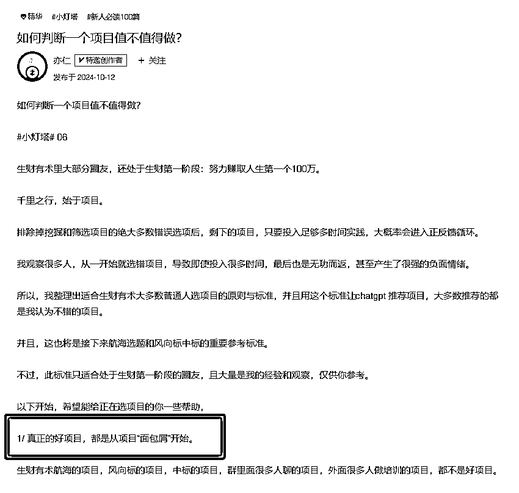
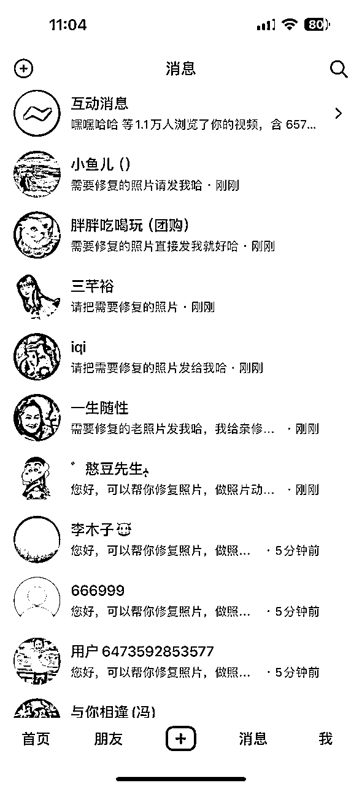
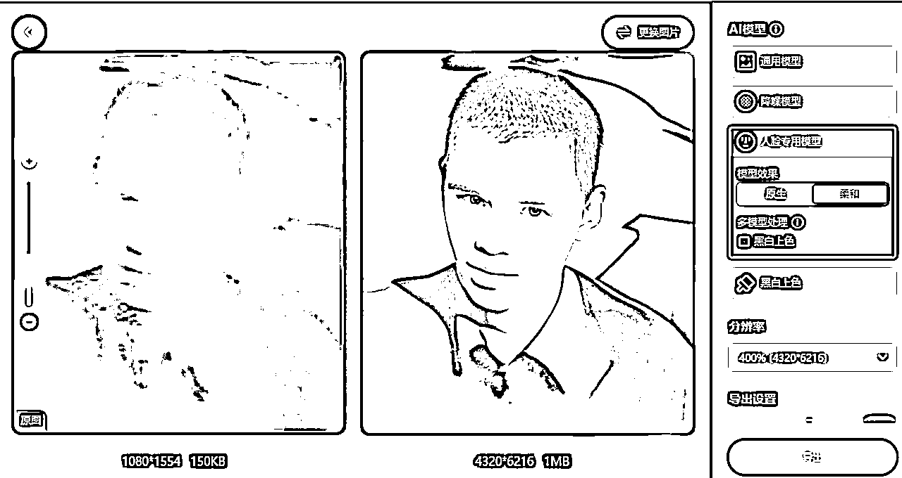
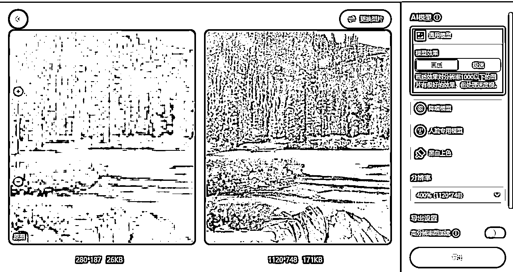
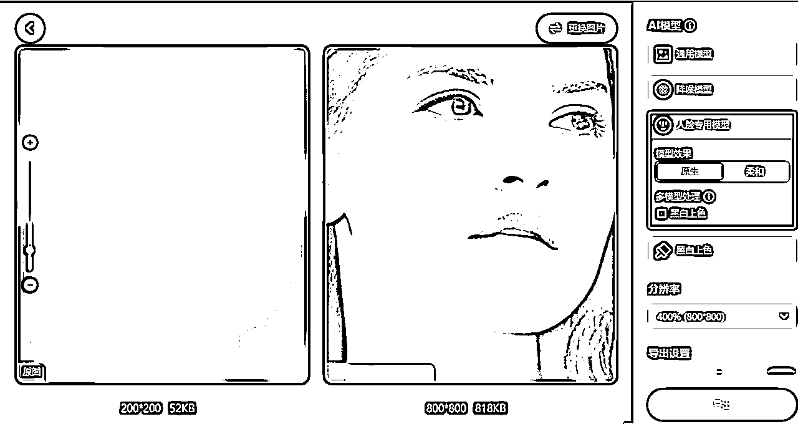

# 从生财“面包屑”到AI老照片修复的财富蜕变

> 来源：[https://wwa6ugt6w2.feishu.cn/docx/C3zJdKdiVofvUJx9JCFchBd4npN](https://wwa6ugt6w2.feishu.cn/docx/C3zJdKdiVofvUJx9JCFchBd4npN)

## 一、机会藏在字里行间

转眼间加入生财1年，从中学到了好多实用的技能，如何搭建营销渠道/如何做好用户运营/如何精准抓住市场需求。

这一年我的职业从亚马逊视觉总监变成了Ai老照片修复创业者，做到了“把副业变成了主业”。

不仅如此，我还结识了一群志同道合的伙伴，锦李/荷包蛋/波妮等等，和他们交流合作，让我打开了新的思路，看到了更多的可能性。

感谢亦仁《如何判断一个项目值不值得做？》打通了我的任督二脉。

也感谢更多各行各业的大佬分享的知识让我少走了很多弯路。

刚加入生财的时候，在生财有术的航海活动中：《中老年视频号知识付费》，我跟着团队一起钻研。

每一个环节，大家都齐心协力，毫无保留地分享自己的经验和想法。在这个过程中，我深刻体会到了团队的力量，也学到了很多书本上学不到的实战技巧。虽然最终这个项目没有达到预期的收益，但这次宝贵经历让我成长许多。

正是在这样的学习和交流中，我偶然接触到了 AI 老照片修复这个领域，当时就觉得这里面隐藏着巨大的商机，就像发现了一座等待挖掘的金矿。于是，我一头扎了进去，开启了我的 AI 老照片修复创业之旅。

## 二、感谢亦仁“面包屑” 打通了我的任督二脉

“面包屑” 概念的理解

真正的好项目，都是从项目“面包屑”开始。

强烈大家没有看过这篇文章的先去静下心好好的通读一遍，我相信你看完之后一定会先感谢亦仁，再感谢我。

https://scys.com/articleDetail/xq_topic/1525458545525212

在不断浏览帖子的过程中，“面包屑” 这个词频繁出现在我的视野里。

一开始，我对这个概念感到很陌生，完全不理解它和赚钱有什么关系。

直到我看到亦仁 “面包屑” 的解释，才恍然大悟。

原来，“面包屑” 指的是那些在赚钱项目中看似零散、微不足道的细节，但实际上这些细节往往是成功的关键所在。

就像在一个电商项目中，选品思路、定价策略、营销渠道客户服务的技巧等，这些都是一个个的 “面包屑”。

单独看某一个 “面包屑”，可能觉得没什么特别的，但当你把它们收集起来，按照一定的逻辑组合在一起时，就会发现它们能构成一个完整的、可行的赚钱方案。

我开始意识到，这些 “面包屑” 就像是一把把钥匙，虽然看似普通，但只要能找到正确的那几把，就能打开财富的大门。于是，我开始有意识地去收集和整理这些 “面包屑”，并按照不同的领域和类型进行分类。

## 三、收集 “面包屑”：揣摩现象背后的本质

### （一）精华帖中的宝藏挖掘

1.  跨领域寻找灵感：

在生财有术的精华帖海洋里，我像个寻宝者，《AI应用：从百万到亿级收益的超级机会》《AI 自媒体：抓住AI领域热钱与自媒体广告投放的新机遇》等等文章都让我醍醐灌顶，我从众多精华文章里去感受共性，从中抽丝剥茧的发现机会。

1.  不放过任何一个可能的线索：

从电商领域的引流策略帖子中，我发现了 “打造爆款产品” 的思路。

电商卖家们通过精准定位目标客户群体，分析他们的需求和痛点，用推广数据对核心人群进行不断地精准定位，然后针对性地优化产品详情页、制定吸引人的促销活动，以及编写出具有针对性的客服话术，从而吸引大量流量。

我将这个思路运用到老照片修复业务中，思考如何将老照片修复服务打造成 “爆款”。

我开始更加注重客户需求的挖掘，珍惜每一个用户的特殊要求及修改意见，了解他们对修复效果的期望、对价格的敏感度，以及他们希望通过修复照片获得怎样的情感满足。

在宣传推广方面，我借鉴传统电商的做法，突出修复前后的对比效果，提前做好大量的真实案例对比展示图。

在研究自媒体运营的精华帖时，我学到了 “内容营销” 的重要性。

自媒体人通过创作有价值、有趣、引人共鸣的内容，吸引粉丝关注，并逐渐将粉丝转化为客户。

我意识到，老照片修复业务也可以通过内容营销来提升品牌知名度和影响力。

于是，我开始在社交媒体平台上分享老照片修复的故事、技巧，以及历史名人或者民国美女前后的对比修复照片，并搭配上高赞词的文案，引发了很多人的关注和讨论。

这些内容不仅吸引了潜在客户，还让他们对我的修复技术有了更直观的了解，增加了流量对我的信任度。

1.  拆解成功案例细节：

有一位圈友分享了自己做线上教育项目的经历，从项目的启动、课程的研发、推广渠道的选择，到遇到的问题及解决方法，都进行了详细的阐述。

我仔细拆解这个案例，分析他每一个决策背后的原因，以及他是如何应对各种挑战的。在课程研发方面，他通过市场调研，了解目标客户的需求和痛点，然后针对性地设计课程内容，确保课程的实用性和吸引力。

在推广渠道的选择上，他尝试了多种渠道，如社交媒体广告、搜索引擎优化、线下活动等，最终确定了最适合自己项目的推广方式。

通过学习这个案例，我在老照片修复业务中也更加注重市场调研，了解客户需求，不断优化服务内容。在推广方面，我也开始尝试多种渠道，找到最适合自己的推广方式，提高推广效果。

### （二）“风向标”里的趋势洞察

#### 关注行业动态信息：

在生财有术的风向标板块，我时刻关注着 AI 技术的发展趋势。随着人工智能技术的不断进步，AI 在图像识别、图像处理等领域的应用越来越广泛，老照片修复的效果也越来越好。

我意识到，这是一个巨大的机遇，随着技术的不断成熟，会有越来越多的人选择使用 AI 技术修复老照片。同时，我也关注到人们对老照片修复的需求呈现出增长的趋势。随着社会的发展，人们对家庭情感、历史记忆的重视程度越来越高，老照片作为承载这些情感和记忆的载体，其修复需求也日益旺盛。

在此基础上我果断行动去测试需求是否真实，抖音/视频号发作品，发现后台真的很多人私信我，说明我找对了方向。

## 四、小步快跑 测试 AI 老照片修复 MVP 模型

### （一）技术选型与学习

1.  AI 修复工具的筛选：

在确定进入 AI 老照片修复领域后，我面临的首要任务就是选择合适的修复工具。

市面上的 AI 老照片修复工具琳琅满目，让人眼花缭乱。

像 Photoshop、醒图、美图秀秀等，这些工具在图像处理领域都颇具名气，但它们的功能和特点各有不同 。

我开始对这些工具进行深入研究和对比测试。我从网上收集了各种不同类型、不同损坏程度的老照片，包括黑白照片、彩色照片、有划痕的照片、褪色严重的照片等，然后分别使用这些工具进行修复。在测试过程中，我重点关注修复效果、操作便捷性、处理速度以及成本等几个方面。

Photoshop 功能强大，拥有丰富的修复工具和滤镜，可以进行精细化的修复。但它的操作相对复杂，对于没有专业图像处理基础的人来说，学习成本较高。而且，使用 Photoshop 进行批量修复时，效率较低。更适合作为后期微调辅助来使用。

醒图和美图秀秀则操作相对简单，容易上手，对于一些常见的照片问题，如色彩调整、轻微划痕修复等，能快速给出不错的效果。但在处理一些复杂的损坏情况，如严重的褪色、图像缺失等问题时，效果就不尽如人意了。

经过反复测试和比较，我最终选择了一款名为 “HPE” 的 AI 修复工具。

境外的小众公司开发出的Ai软件，在细节还原、色彩恢复方面表现出色，能够将模糊不清、褪色严重的老照片修复得栩栩如生，生成效果之好，速度之快让我惊讶。而且，它的操作界面简洁明了，即使是新手也能快速上手。

1.  掌握技术要点：

确定了修复工具后，接下来就是深入学习其使用方法和修复技术原理，以提升修复效果。

我通过官方文档、在线教程、视频课程等多种渠道进行学习。在官方文档中，详细介绍了工具的各项功能、操作步骤以及参数设置的含义。我仔细研读每一个部分，对工具的整体框架和基本操作有了初步的了解。

在线教程则以实际案例为导向，一步一步演示如何使用工具修复不同类型的老照片。我跟着教程的步骤，亲自操作，遇到问题及时查阅资料或在相关论坛上寻求帮助,还是不行就直接付费请教专业技术人员，用钱买时间。

在学习过程中，我发现 AI 修复技术的核心在于利用深度学习算法对老照片中的损坏部分进行智能识别和重建。

经过一段时间的学习和实践，我逐渐熟练掌握了 “HPE” 的使用方法，能够运用各种技巧和参数设置，将老照片修复得更加完美。我开始尝试修复一些具有挑战性的老照片，如年代久远、损坏严重的家庭合影、历史照片等，并将修复前后的对比照片分享到各社交媒体上，得到了很多人的认可和好评，这也进一步增强了我的信心。

### （二）服务定位确定

1.  明确服务特色：

在竞争激烈的市场环境中，要想脱颖而出，就必须明确自己的服务特色。

我深知，仅仅提供老照片修复服务是远远不够的，还需要在修复质量、个性化服务等方面下功夫。

增值服务和情绪价值是一个很重要的维度。

增值服务上：我严格把控每一个修复环节，确保修复后的照片在清晰度、色彩还原度、细节完整性等方面都达到较高的水平。最后生成一个照片转视频的gif送给客户，以及打印出实物照片快递发给客户。这样会极大的提升回购率。

情绪价值上：我会与客户进行充分的沟通，了解他们对照片的特殊情感和需求。比如，有些客户希望在修复照片的同时，能够保留一些岁月的痕迹，以体现照片的历史感；有些客户则希望对照片进行一些创意处理，如添加背景、调整色调等，使其更具艺术感。针对这些不同的需求，我会制定个性化的修复方案，为客户提供独一无二的修复体验。

1.  分析目标客户群体：

为了更好地推广我的服务，我对目标客户群体进行了深入的分析。我发现，老照片修复的潜在客户群体主要包括老年人和文化机构等。

家庭用户是老照片修复的主要需求者。

他们手中的老照片往往承载着家庭的珍贵回忆，如长辈的合影、童年的照片、结婚照等。随着时间的推移，这些照片可能会出现褪色、破损、模糊等问题，家庭用户希望通过修复，让这些照片重新焕发光彩，留住美好的回忆。对于家庭用户来说，他们更注重修复效果和情感价值，对价格也比较敏感。因此，我在定价上会考虑家庭用户的承受能力，提供一些性价比高的套餐服务。同时，我会通过社交媒体、家庭聚会等渠道，向家庭用户宣传我的服务，分享一些修复前后的对比案例，引起他们的共鸣。

文化机构如博物馆、图书馆、档案馆等，拥有大量的珍贵历史照片。这些照片对于研究历史、传承文化具有重要意义。文化机构在修复老照片时，更注重照片的真实性和历史价值，要求修复过程必须遵循专业的文物保护原则。为了满足文化机构的需求，我会学习和了解相关的文物保护知识和修复标准，与专业的文物修复专家进行交流和合作，不断提升自己在文物照片修复方面的技术水平。同时，我会积极参与文化机构的项目招标，争取与他们建立长期的合作关系。

## 五、推广与运营：如何引流和获客

### （一）引流策略制定

1.  社交媒体营销：

在社交媒体营销方面，我选择了视频号、抖音这几个具有广泛用户基础和强大传播力的平台。

微信公众号作为私域流量运营的重要阵地，我定期发布老照片修复的专题文章。

从修复技巧的深度剖析，到背后故事的温情讲述，每一篇文章都力求触动读者的情感。

我曾分享过一篇关于修复一张承载着祖孙三代回忆的老照片的文章，详细描述了修复过程中遇到的技术难题以及如何通过与客户的沟通，最大程度还原照片中的情感细节。这篇文章不仅获得了大量的阅读和点赞，还吸引了许多潜在客户的关注。并想办法及时导流到微信。

以短视频的形式，直观展示老照片修复前后的惊人对比。

为了制作出吸引人的视频，我在剪辑和内容上下足了功夫，选用反差最大的案例，把对比前的照片故意修模糊，这样对比后的照片就会显得效果很惊人。

同时，我注重视频标题和文案的撰写，用简洁而富有吸引力的语言，激发用户的好奇心。比如，“修复了死去3年爷爷的照片，奶奶看到后哭成了泪人” 这样的标题，成功吸引了大量用户的点击。

通过抖音的算法推荐，这些视频被推送给了众多对老照片修复感兴趣的用户，为我带来了源源不断的流量。

1.  线下合作推广：

在合作推广方面，我积极与摄影工作室、老年社区等机构建立合作关系。

与摄影工作室合作时，我为他们提供老照片修复的增值服务。当客户在摄影工作室拍摄婚纱照、全家福等重要照片时，摄影工作室会向客户推荐我的老照片修复服务。作为回报，摄影工作室可以从每一笔推荐成功的业务中获得一定比例的佣金。这种合作方式不仅为摄影工作室增加了服务的多样性，提升了客户的满意度，也为我带来了精准的客户流量。例如，与一家知名摄影工作室合作后，每月通过他们推荐的客户数量增长了 30% 左右。

针对老年社区，我组织了一系列线下活动，如 “老照片修复公益讲座”。在讲座中，我向社区居民介绍老照片修复的意义、方法以及背后的技术原理。同时，现场展示一些修复前后的对比案例，让居民们直观感受到修复的效果。为了增加互动性，我还邀请居民们带上自己的老照片，现场进行简单的修复演示。这些活动不仅受到了老年社区居民的热烈欢迎，还得到了社区管理部门的认可和支持。通过在社区内的宣传和推广，我成功在老年群体中树立了良好的品牌形象，许多居民成为了我的忠实客户，并通过口碑传播为我带来了更多的业务。

### （二）客户服务优化

1.  建立良好沟通机制：

为了建立良好的沟通机制，我在接到客户咨询的第一时间，会以热情、专业的态度回应。通过微信、电话等方式，详细了解客户的需求。比如，客户发来一张需要修复的老照片，我会询问照片的背景故事、客户对修复效果的具体期望，以及是否有特殊的细节需要保留或强调。在修复过程中，我会定期向客户反馈进度，发送修复中的阶段性成果图片，让客户随时了解修复的情况。如果遇到一些技术难题或不确定的因素，我会及时与客户沟通，听取他们的意见和建议，共同商讨解决方案。例如，在修复一张具有重要历史意义的老照片时，照片上的部分文字已经模糊不清，我与客户反复沟通，查阅大量资料，最终确定了最符合历史事实的修复方案。修复完成后，我会将修复后的照片以高清格式发送给客户，并耐心解答客户可能提出的任何问题，确保客户对修复结果满意。

1.  提升客户满意度：

为了提升客户满意度，我会提供一些额外的服务。

比如，在修复完成后，为客户制作一份精美的电子相册，将修复后的照片进行精心排版，并添加一些温馨的文字说明和背景音乐，让客户能够更好地保存和分享这些珍贵的回忆。

有一位客户在收到修复后的照片后，觉得照片的色调与他记忆中的有些差异，我在接到反馈后，立即对照片进行了重新调整（Ai技术的出现让修改的时间成本大大降低），并在最短的时间内将修改后的照片发送给客户。客户对我的处理方式非常满意，不仅对我的服务给予了高度评价，还推荐了几位朋友来找我修复老照片。通过这些努力，客户的口碑传播也为我带来了更多的业务机会。

## 六、成果与展望：“面包屑” 带来的财富与未来

### （一）业务成果展示

经过一段时间的努力，我的 AI 老照片修复业务取得了显著的成果。在收入方面，从最初的月收入寥寥无几，到现在每月稳定数五位数，也成功的AI修复这个副业变成了我的全职主业。

在客户数量上，也呈现出稳步上升的趋势。通过口碑传播、社交媒体推广以及合作渠道的拓展，我的客户群体不断扩大，覆盖了全国各地，甚至还有一些tk和youtube的海外客户。

这些满意的客户为我带来了良好的口碑。他们在社交媒体上分享自己的修复经历，晒出修复前后的对比照片，吸引了更多人的关注。许多客户在评价中表示，我的修复服务不仅让他们的老照片重焕生机，更让他们找回了那些珍贵的回忆，这种反馈让我们觉得自己在做一件真正有意义的事，这也是技术该给这个社会带来的作用！

### （二）持续发展规划

1.  技术升级与创新：

为了进一步提升修复效率和质量，我不断寻找HPE与PS或者其他软件的联动合作。

不断测试先用PS粗处理比较合理还是先丢给HPE处理比较合理。

修图技术上也不断迭代，与其他修复师不断讨论和碰撞。

1.  业务拓展方向：

在巩固现有业务的基础上，我打算拓展相关业务领域。

一方面，开展照片数字化管理服务。随着人们生活水平的提高，越来越多的人拥有大量的照片，如何有效地管理这些照片成为了一个问题。

我将利用 AI 技术，为客户提供照片分类、标记、存储等一站式数字化管理解决方案，帮助他们更好地保存和整理珍贵的照片资源。另一方面，探索老照片故事创作业务。每一张老照片背后都可能蕴含着一个动人的故事，我将与专业的文案撰写人员合作，根据客户提供的照片和相关信息，创作精彩的老照片故事。

这些故事可以以文字、音频或视频的形式呈现，为客户的老照片赋予更深层次的情感价值。通过这些业务拓展，我希望能够打造一个全方位的老照片服务生态，为客户提供更多元化的价值，实现业务的持续增长 。

1.  像只猎犬嗅到生活中的 “面包屑”

回顾这段 AI 老照片修复的创业历程，生财 “面包屑” 就像一条无形却坚韧的线，串联起每一个关键环节，从最初的灵感触发，到技术打磨、业务拓展，它无处不在，为我照亮前行的道路。

在这个充满机遇与挑战的生财之路上，我深刻体会到，只要我们像一只敏锐的猎犬，时刻保持警觉，用心去嗅探生活中的每一丝 “面包屑”，就一定能找到属于自己的财富宝藏。

无论是在生财有术这样的知识社群中，还是在日常的工作、生活里，都可能隐藏着那些改变命运的宝贵信息。

希望我的经历给大家带来启发，让我们一起在生财的道路上，用心收集、巧妙运用这些 “面包屑”，跑通更多项目！