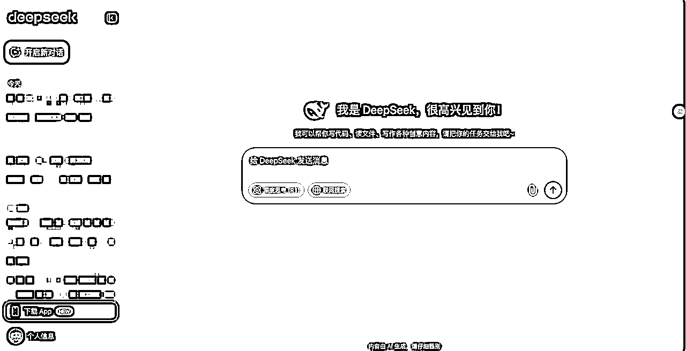
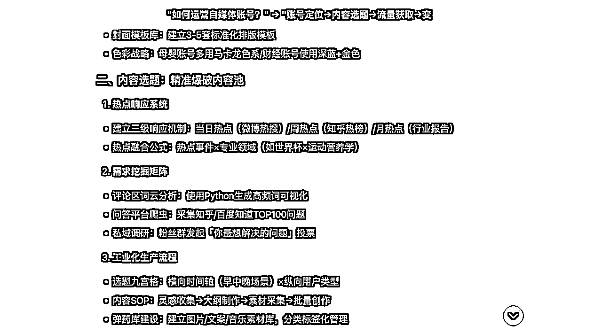
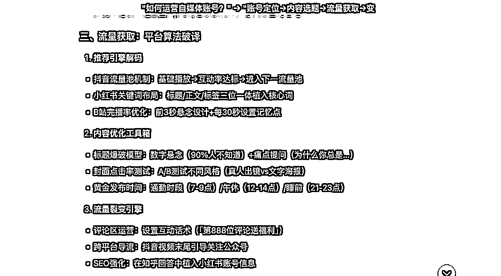
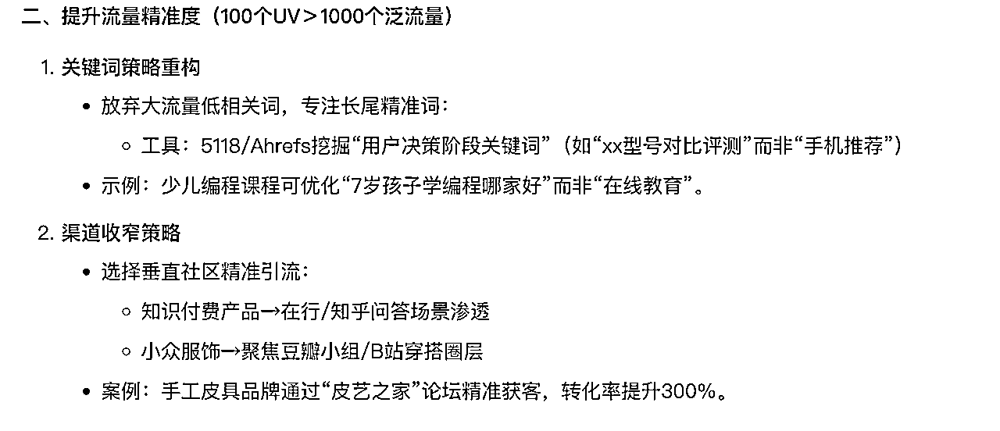
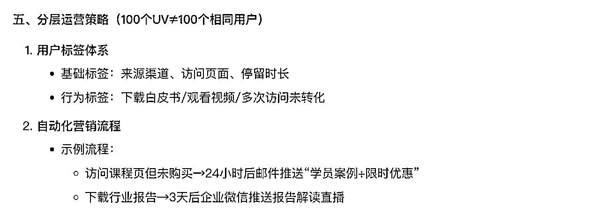
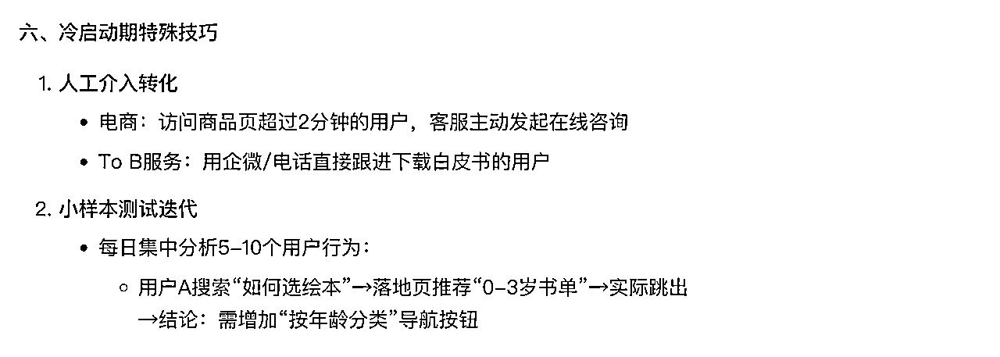
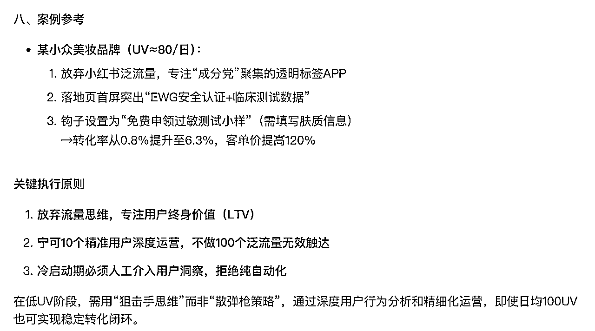

# 30个DeepSeek进阶使用指南，90%的人都不会！

> 来源：[https://fvxoq23qyuq.feishu.cn/docx/C9bcdqaMlooH6PxF4DpcTl57n2d](https://fvxoq23qyuq.feishu.cn/docx/C9bcdqaMlooH6PxF4DpcTl57n2d)

大家好，我是小乐，2021年4月加入生财。创业7年的程序员，2015年做的程序员开发工作，2016年开始做公众号，2017年年低裸辞做自由职业者。目前50多个公众号矩阵主理人，全网40万粉丝，擅长做公域流量，10年自媒体经验，现在all in ai。愿带领100万小白入门AI，让我们一起进步～

从 DeepSeek R1 发布的那一刻起，我就意识到，这不仅仅是一个普通的 AI 工具，而是一个有可能彻底改变我们工作、学习乃至生活方式的革命性产品。这个工具的发布无疑是技术领域的一次巨大飞跃，给全球用户带来了无限的想象空间和实践价值。

最近，DeepSeek-R1 的影响力愈加显著，它的火爆程度堪称前所未有。无论是日常生活的优化，还是专业领域的创新应用，都离不开它的身影。这款工具不仅迅速征服了全球市场，还登上了包括日本和美国在内的140个国家的 App Store 榜首，成为全球AI热潮的核心引擎，令众多硅谷巨头都感到惊讶和焦虑。


DeepSeek R1 的推出，不仅标志着AI技术的一次重要突破，更意味着全球科技生态正在发生深刻的变革。

说实话，这种现象级的热度让我既兴奋又感慨。兴奋的是，作为一个中国人，看到国产 AI 技术能够在全球范围内引起如此强烈的反响，真的是一种无比自豪的体验。

而感慨的是，几乎在一夜之间，DeepSeek-R1 成为所有人关注的焦点。甚至连那些平时对科技产品毫无兴趣的亲戚朋友，也纷纷开始向我询问：“DeepSeek 到底是什么？有什么神奇之处？真如网上说的那么强大吗？”

这种变化既令人惊讶，也让我感受到了国产技术崛起的巨大潜力。大家对 AI 的关注不再是遥远的未来，而是切实的现在。这种时代的变革，真的让人既激动又期待。


试想一下，借助 AI，你不仅能够轻松创作文章、设计图像，甚至还能够实现工作流程的自动化，从而将时间从繁琐的任务中解放出来，去追求你内心深处的梦想和目标，或者发展副业、增加额外收入……这一切，DeepSeek-R1 都能为你提供强有力的支持！

然而，作为一款刚刚问世的革命性产品，DeepSeek-R1 的定位、功能以及应用场景，确实还需要更多的普及和解释。在市面上，关于 DeepSeek-R1 的信息真假参半，有些人对其赞誉有加，有些人又对其挑剔过度，这让很多真正渴望了解它的用户感到迷惑不已。

为了帮助大家更清楚地认识 DeepSeek-R1，避免信息过载和误解，我花费了几天时间撰写这篇文章，分享一些实用技巧，并结合具体案例，帮助大家更好地理解它的优势，了解如何将它有效应用到日常工作和生活中。

毕竟，作为一款 AI 工具，DeepSeek-R1 的价值不仅仅体现在它的技术本身，更在于我们如何灵活地将它融入到实际的应用场景中，让它发挥更大的作用。

话不多说，接下来就让我们一起深入探讨，如何更好地使用 DeepSeek-R1，释放它的全部潜力吧！

## 第一部分：认识 DeepSeek

### 一）什么是 DeepSeek？



DeepSeek（深度求索） 是一家专注实现AGI（通用人工智能）的中国科技公司，成立于2023年。其核心团队由多位AI领域的顶尖科学家和工程师组成，致力于通过技术创新推动人工智能的边界，尤其在大语言模型、多模态技术等领域具有领先优势。

#### 核心信息

1.  核心产品

*   DeepSeek-R1系列模型：包括多个参数规模的对话模型（如7B、67B等），支持长上下文理解、复杂推理和多轮对话，部分模型已开源。

*   DeepSeek-V2：主打高性能与低成本，推理速度显著提升，API价格大幅低于行业标杆（如GPT-4）。

*   多模态模型：支持图像、音频等多模态输入与生成。

1.  技术亮点

*   长上下文处理：支持最高128k tokens的上下文窗口。

*   高效推理：通过MoE（混合专家）架构等技术优化计算效率。

*   开源生态：开放部分模型权重，供研究者和开发者免费商用。

1.  应用场景

*   智能助手、代码生成、数据分析、教育、医疗等领域，已与多家企业达成合作。

1.  竞争优势

*   性价比高：API成本仅为同类产品的1/100（对比GPT-4）。

*   中英文双语能力突出，针对中文场景深度优化。

1.  发展动态

*   2024年推出DeepSeek-V2，获多项国际测评前列成绩（如中文权威榜单C-Eval排名第二）。

### 二）如何使用 DeepSeek？

以下是DeepSeek的完整使用指南，涵盖从基础到高阶的10个核心使用场景：

* * *

#### 一、基础使用流程

1.  访问入口

*   网页端：https://www.deepseek.com

*   移动端：App Store/Google Play搜索"DeepSeek-R1"

*   API接入：pip install deepseek-sdk

1.  注册与配置

##### 企业用户建议配置 config = { "安全等级": "三级等保模式", "知识库接入": ["内部文档库", "行业数据库"], "响应速度偏好": "极速模式" }

* * *

#### 二、核心功能操作手册

1.  基础对话

```
[系统指令] 你是一个严谨的科研助手，所有回答需附带参考文献
[用户输入] 解释Transformer架构的创新点
```

1.  文件处理

##### 上传并分析PDF论文 !deepseek process --file paper.pdf --task "提取方法论缺陷"

1.  多模态交互

```
response = model.multimodal_query(
    image="实验数据图表.jpg",
    text="分析图中显著性差异"
)
```

* * *

#### 三、进阶使用技巧

1.  领域定制化

##### 法律领域微调 !deepseek finetune --domain legal --data case_laws/

1.  工作流自动化

##### 自动生成会议纪要流程 record_audio() -> transcribe() -> summarize() -> translate()

1.  私有知识融合

```
[知识库检索模式]
检索范围：公司2023技术白皮书
查询：找出智能客服系统的优化建议
```

* * *

#### 四、场景化应用模板

1.  学术研究

```
research_assistant = {
    "文献综述": "对比分析近5年NLP顶会论文",
    "实验设计": "设计三组对照实验验证假设",
    "论文写作": "按ACL模板生成方法论章节"
}
```

1.  商业分析

```
[商业智能模式]
输入：2023Q4销售数据.csv
指令：预测2024Q1趋势，输出可视化图表
```

* * *

#### 五、技术参数优化

1.  性能调节

##### 平衡速度与质量

##### model.set_params( temperature=0.3, max_tokens=2000, top_p=0.9 )

1.  安全设置

```
!deepseek config --privacy strict --audit_trail enable
```

* * *

#### 六、企业级部署方案

1.  私有化部署

##### 本地服务器安装 docker run -d --name deepseek \ -v /data/models:/models \ -p 7860:7860 deepseek/enterprise

1.  权限管理

```
rbac_config = {
    "部门权限": {
        "研发部": ["代码生成", "技术文档"],
        "市场部": ["竞品分析", "文案创作"]
    }
}
```

* * *

#### 七、故障排查指南

1.  常见问题处理 | 现象 | 解决方案 | |------|----------| | 响应延迟 | 切换至"极速模式"或清理对话历史 | | 知识库检索失败 | 检查文件索引状态，重新建立向量数据库 | | API调用超限 | 申请企业级令牌或启用分级响应 |

* * *

最佳实践建议：

1.  学术研究优先启用"严谨模式"（mode=strict）

1.  创意工作建议温度值设为0.6-0.8

1.  敏感场景务必开启"隐私过滤"（privacy_filter=on）

注：部分高级功能需企业版权限，具体参数请以最新官方文档为准。

总结DeepSeek的主要功能和应用场景

DeepSeek作为通用AI助手，可广泛应用于学习、工作、创作等场景，其核心优势在于强大的语言理解与生成能力，并持续通过技术迭代扩展边界。具体功能可能随版本更新而变化。

## 第二部分：DeepSeek 30个 使用技巧进阶

### 一）问题明确性提升

1.  拆解复杂问题 将大问题分解成多个小问题。 例："如何运营自媒体账号？" → "账号定位→内容选题→流量获取→变现方式"







1.  5W1H法则提问 用Who/What/When/Where/Why/How追问核心要素。 例："这个项目失败的原因？" → "具体哪部分环节（What）在什么时间（When）出现关键问题（Why）？"

1.  先问"是不是"再问"为什么" 避免错误前提导致的无效讨论。 例："为什么XX方法无效？" → 先确认"这个方法是否被正确实施过？"

* * *

### 二）高效沟通技巧

1.  预设场景法 说明问题发生的具体背景。 例："在用户日均UV不足100的情况下，如何提升转化率？"












1.  提供选择式提问 缩小回答范围。 例："这个问题更适合用SWOT分析还是PDCA模型解决？"

1.  阶梯式追问 通过连续递进提问深入本质。 例："数据下降→哪个指标下降最严重→该指标关联哪些部门→当前应对措施是？"

* * *

### 三）逻辑深度强化

1.  反向验证提问 用逆向思维检验逻辑漏洞。 例："你认为这个方案绝对安全？那在什么极端情况下可能失效？"

1.  假设推演法 构建虚拟场景测试方案。 例："如果预算减半，这个推广策略需要调整哪些部分？"

1.  跨领域类比提问 用其他领域经验启发思考。 例："医疗行业的精准诊断思路，可以如何迁移到用户画像分析？"

* * *

### 四）资源获取技巧

1.  锚定关键人提问 识别信息源头精准发问。 例："这个技术决策是CTO直接提出的吗？他更关注性能指标还是开发成本？"

1.  激发分享欲提问 用认可+好奇引导深度交流。 例："您刚才提到的用户分层方法很有新意，具体是如何定义种子用户的？"

1.  索取结构化答案 明确需求格式提高信息可用性。 例："能否用'问题点-根本原因-解决方案'的结构说明？"

* * *

### 五）批判性提问策略

1.  数据溯源提问 追问结论背后的支撑依据。 例："'用户满意度提升30%'这个结论的数据采集样本量和渠道是？"

1.  前提条件检验 识别隐藏假设。 例："这个方案成立的前提是市场持续增长，如果遇到黑天鹅事件是否有备案？"

1.  边界限定提问 明确适用范围。 例："这个方法在ToB和ToC场景中的实施效果差异有多大？"

* * *

### 六）场景适应技巧

1.  紧急事件提问模板 突发情况快速聚焦：现状+影响+资源 例："目前系统崩溃影响范围多大？已波及多少用户？可调用多少技术人力？"

1.  学术研讨提问法 聚焦创新点：独特性+可复制性+理论依据 例："这个算法创新与其他研究的本质区别是什么？在跨数据集测试中表现如何？"

1.  求职面试反问技巧 展现思考深度：团队现状+挑战+发展 例："当前团队在技术转型过程中遇到的最大挑战是什么？新人需要具备哪些破局能力？"

* * *

### 七）反馈处理技巧

1.  模糊回答澄清术 用具体化追问打破笼统回应。 例："您说'需要优化体验'，具体是指加载速度、交互流程还是视觉呈现？"

1.  矛盾信息验证法 交叉确认关键点。 例："刚才A部门说需求已确认，B部门说还在修改，能否提供最新版需求文档？"

1.  情绪化回应处理 用事实聚焦转化情绪。 例："我理解您对进度延迟的担忧，当前卡点具体在哪个环节？是否需要协调资源？"

* * *

### 八）工具辅助提问

1.  思维导图提问法 用树状结构展开问题维度。 例：（中心问题）→ 分支1政策影响 → 分支2技术难点 → 分支3用户反馈

1.  矩阵分析法提问 通过二维坐标定位问题优先级。 例：横轴"实施难度"，纵轴"见效速度"，将待解决问题放入四个象限

1.  流程图追溯提问 按流程节点排查问题。 例："从用户点击到支付完成的整个流程中，流失率最高的三步是？"

* * *

### 九）提问心态管理

1.  安全区突破提问 主动触及认知盲区。 例："关于区块链底层逻辑，我最应该修正的三个错误认知是什么？"

1.  示弱式高阶提问 用谦逊姿态获取深度信息。 例："我是行业新人，能否请您用最直白的方式解释这个商业模式的盈利关键？"

1.  压力测试型提问 主动暴露潜在风险。 例："如果完全按照我的方案执行，您认为最可能在哪三个环节出问题？"

* * *

### 十）持续优化技巧

1.  提问效果复盘 记录关键问答，分析改进点。 工具：建立问答日志（提问内容/对方反应/回答质量/后续验证）

1.  个性化话术库建设 收集优质提问模板，例如：

*   决策类："如果必须舍弃一个要素，您会选择哪个？为什么？"

*   预测类："根据历史数据，这个趋势持续下去半年后会发生什么？"

1.  跨文化提问校准 注意沟通语境差异：

*   西方直接型："请指出这个计划最大的缺陷"

*   东方委婉型："如果要从完善性角度考虑，哪些方面还可以加强？"

* * *

使用心法：

1.  黄金沉默法则：提问后留足3秒思考时间

1.  3:7提问比例：每10分钟对话，提问占3成，倾听占7成

1.  问题能量值评估：这个问题能引发对方多长时间的深入思考？

掌握这些技巧后，建议从日常对话开始刻意练习，逐步培养"提问肌肉记忆"。进阶者可尝试每周进行1次提问复盘，分析3个最有效和3个最失败的提问案例。

小乐认为，DeepSeek 代表了 AI 技术的未来发展方向。它不仅能更好地理解人类的语言，还能进行更为深入的思考，极大地降低了 AI 的使用门槛。

未来，AI 的使用将变得更加便捷和自然。就像手机从需要复杂操作的诺基亚时代，逐步进化到今天三岁孩子都能轻松上手的 iPhone，AI 的操作也将变得更加简单、直观，最终成为我们日常生活中不可或缺的一部分。

AI 的春风，终究会从中国的江南水乡吹向全球，走向更广阔的星辰大海。

好了，朋友们，别忘了点赞哦！你的反馈对我来说非常重要！

小小一赞，年薪百万！😊👍👍👍