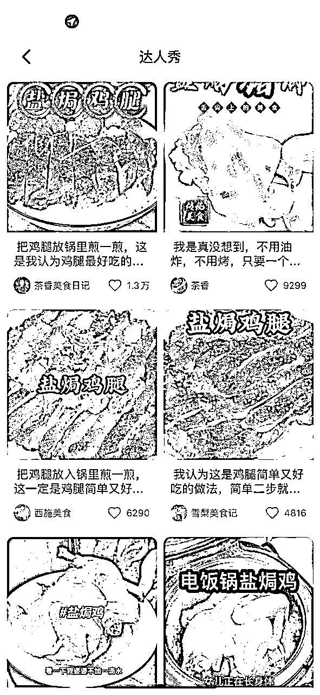

# 在不确定的市场，如何拿到自己的确定性？

> 来源：[https://hbgx3lqhpq.feishu.cn/docx/CVQcd6MIzokEiWxTfCOc8z7gnZd](https://hbgx3lqhpq.feishu.cn/docx/CVQcd6MIzokEiWxTfCOc8z7gnZd)

我是在五月份入局视频号的，参加了两次的视频号带货航海，平台规则一直在改变，但好在坚持下来，拿到了自己想要的结果【2024 赚到 10w 收益】

大家好，我是志豪，95 年惠州人定居广州，在云计算行业做了 7 年技术售后，四月份被裁员后入场视频号，目前已经初步跑通项目流程，2025 年也将会全身心投入到视频号带货，争取拿到更大的结果

这篇文章没有写视频号带货项目的实操，大家感兴趣可以去看往期航海手册。主要分享我这大半年时间，深扎视频号带货项目遇到的坑、解决问题的思路、内化的做事方法技巧，以及一些心得体会，以下是文章的大纲：

1、 我是如何一步步拿到目标结果的？

2、 如何维持实战过程的心态、情绪和动力？

3、 动荡的市场，如何拿到属于自己的确定性？

文中均为个人观点，如有不足之处，欢迎指出交流

全文思维导图（略有删减）👇

# 一、我是如何一步步拿到这个结果的？

## 熬

这半年如果在做视频号的兄弟姐妹，应该都知道，90 天左右就会有大变革，五月份最爆的是抠像玩法、然后出现人脸不可解控，数字人霸屏广场、批量封号、关联封号、微付费（硬广、口播）......

只要没坚持下来，下了牌桌就基本没啥机会了

这几年，尝试过非常多的互联网副业项目：知乎好物、公众号引流、淘宝/多多/抖音/闲鱼电商、ai 工具...以往都是浅尝辄止，视频号带货是我唯一一个深扎的项目，也是第一个让我赚到 10w+的项目。我能拿到自己想要的这个结果，最大的一个原因就是--熬下来了！！！

目前很多人在纠结打微付费还是打自然流、打硬广还是打口播...我建议是都去尝试，只有把脚弄脏，才知道自己适合做什么。我现在主要打自然流，以下是我对自然流和微付费的一些看法👇

|  | 自然流 | 微付费 |
| 优势 | 投入成本低 | 能够撬动自然流 |
| 劣势 | 起号概率相对低 | 投入成本高（一场直播2-3千） |
| 我的选择 | 我的文案、剪辑和出境能力都有沉淀，先用自然流去测试（文案、脚本、出境、选品） 测出爆款就用微付费快速放大结果（尝试中） |  |

下面是我最近一个月，自然流原创素材战绩（防镰刀拿去割韭菜，打了水印）

我的视频号带货项目领路人--拾柒老师，她在【32 岁负债 50w，重头再来】那篇复盘文章，说了一句话“挖一米宽，一米长，深耕一万米”，这同样也是我坚持下来的重要支撑点

这个过程我有挣扎过、崩溃过、放弃过，但在大环境的压力下，没有其它项目更适合我了。也是这一次次反复挣扎，让我有一种“屡败屡战”的经验，也让我面对困难的时候，拥有了【重新出发】的勇气

## 心法 PDCA

PMP 里面有一个知识点：戴明环 PDCA 计划、执行、检查、纠正

我把这个思维方式作为我的项目指导，延伸出了一个目标结果推导论

视频号带货我们做的其实就是内容电商，我用一个例子说明。

比如明天我准备卖【盐焗鸡粉】这个商品，我有几种方式做内容：

*   自己下厨全程实拍

*   网上找素材混剪

*   口播+画中画

*   其它...

无论哪种方式，我首先要搞清楚：

*   了解这个产品是干什么用的？

*   什么人群要买它？

*   我怎么卖给他？

这些问题，都可以从市场上快速找到答案---拆解同行！

### 找对标

抖音、快手、小红书各大平台，通过搜索关键词，即可找到正在做的同行（最好的老师），以抖音为例，右上角可以添加条件筛选：

最新发布--素材最新鲜，用来做画中画不容易出现同质化

最多点赞--最优质的素材，学习它的画面元素、脚本结构、声音和素材的处理手法（剪辑）

找到挂车的视频，点击去即可找到商家，下滑可以看到【达人秀】，这就是盐焗鸡粉这个商品相关的带货视频汇总，对标就找好了

### 拆解

把对标视频下载到本地（电脑下载工具推荐--IDM），逐帧分析他们的画面和脚本

脚本用微信小程序解析，即可获取整个带货脚本

### 设定目标

上面已经把对标的画面、脚本、声音都拿到，接下来就是分析和规划，一比一模仿爆款

画面：真人出境或者用数字人，把口播的视频做出来如果是真人出镜，服饰、画面、出镜人占比、语气语调、环境

最好都能一比一模仿爆款，因为爆款是同行已经验证过的，前期自己不要有太多的想法，先抄后超

### 执行、复盘和调整

执行的过程中，会遇到很多问题

比如，目标定的太高了，执行很困难

比如，找素材的时候，找不到对标视频一样优质素材

又或者说，找一个素材花了半个小时，没找到就放弃了，用一个相对低质的素材

遇这些情况，就要进行复盘和调整，出现问题，一定是我们某种能力不足，或者遇到了某个卡点

就单单对素材来讲，我们需要把目标定为

如何去找一个优质素材？

如何在短时间内，找到目标素材？

把这个当做目标去锻炼，当我们拥有这个能力之后，再去做更加进阶的目标

比如说我要做一个优质视频，这一点，我相信至少要一个月的时间，但只要达成了这个目标，做出一个挑不出毛病的视频，多方面的维度都能得到提升，比如剪辑能力、找素材能力和出品效率...

### 螺旋式迭代

前面用如何做好一个视频为例子，从微观的角度，从找对标到拆解，设定目标到执行复盘和调整，这是一个完整的闭环

一个闭环做完之后，再把目标定高一个层级，重复这四个步骤，就得到了螺旋式迭代

半年时间，我用这个方法去，拿到了我的目标结果

这个螺旋式迭代思维，可以让我们沉浸式的去做好每一件小事情，这个过程可能会很痛苦

但是它能够让我们脚踏实地，或许它离成功很远，但每一步都能让我有所收获

从微观的角度上来谈的话，他能够让我的基本功更扎实（剪辑能力、文案能力、内容创造力）

## 执行力

当我们进入一个圈子之后，信息差其实是已经抹平了

那为什么在一个圈子里面，除了大家的起步不一样，同行的人拿到的结果有着天壤之别，其中最大的一个区别，就是执行力不一样

这七个月以来，除了我崩溃的时候，我看到市场上的爆款，我跟品的速度，都是非常快的

我有一个特性，这个事情要么我不干，要干的话，要尽我最大的努力、最大的执行力，去做好这个事情，无论结果怎么样，只要我下场了就不会后悔

这一次我的爆款是 Wi-Fi 放大器，一周打了 17w 的 GMV（自然流），我能够拿到这个结果，第一个原因就是，跟品的速度比较快（执行力），其次是我做了很多的脚本测试和账号测试

因为市场上已经出现了爆款，那就证明这个品是没有问题，然后我把当前正在爆的视频全都下载下来，分析他们的脚本，还有内容，结合自己的优势（粤），就有了这一次粤语加爆款等于全新爆款案例

写这篇总结的时候是2025.01.19 ，这周又打爆了一个新文案--电视U盘影视贴，文案结构一样，套在新品上。自然流单条最高播放85w，GMV10w+，持续上涨中...

## 抠细节

很多人觉得 正反馈 = 赚到钱 ，或者视频爆了才算是正反馈

我们的正反馈系统，应该要学习游戏的设计理念，每一个小步骤都设置一个低目标，在执行的路途中都能有正反馈，赚到钱（打 BOSS），它只是最后一个行为结果

像我们玩的超级玛丽（一款游戏），你执行的每一步都会有一个正反馈，比如顶起砖头，有个蘑菇弹出来，捡到蘑菇，就会有很爽的音效、人物会变大，哪怕我们没到打 BOSS 的环节，也能获得快感，大脑分泌多巴胺

但我们执行项目，不可能说你刚打开电脑，剪辑了 2 分钟的视频，就能够拿到结果，这是不可能的

所以我们要去欺骗大脑，比如说我剪辑了 2 分钟，我把这个视频做好了，或者说我找到了一个完美的素材，把这个小动作当做正反馈，把这个理念，灌输给我的的大脑，告诉我的大脑，这个事情是能够让我心愉悦的

在爆单赚钱之前，无论写脚本、拍视频、剪视频或者拉直播，我都能够从每一个环节获得快感，这个事情就不会枯燥、不会让我失去兴趣，执行力自然就不会差

我做的每一个细节、每件小事，可能没有可预见的收益，但是它带给我的是，基本功变得更加的扎实，为最后那个所谓的“成功”做铺垫

## 蓝海思维

方言 + 爆款 = 全新爆款

当时我看到市场上全都是普通话的爆款，我也尝试用普通话的爆款去拍了，但是发出去账号被限流

我就在想，能不能用粤语去规避这种高风险的文案，其实是粤语的人群是非常多的，而且一旦做起来，他的传播能力是非常广

我可以用好的脚本、好的画面，再加上优秀的出境能力，还有感染力去打动用户

互联网现在最难的，就是搞流量，这个蓝海思维【方言 + 爆款 = 全新的爆款】，大家一定要好好去琢磨

## 出境能力

不管你是在做视频号，还是做任何事情，我们时代的趋势已经确定了----知识的载体从文字到图文，再到短视频

如果你想得到短视频的红利，出境能力是必不可少的

我们要敢于去卖自己那卖自己，如果说你连出境都不敢，那就不用谈后面销售的问题了

我是五月份开始自己实拍，这过程中也尝试过放弃了

但从长远的角度来看实拍这个事情是必须做的，他是属于重要，但不紧急

不是一天或者一蹴而就的，他是一个有沉淀，对我们未来有帮助的事情

比如我每天下去遛狗的时候，我会拿着镜头对着自己

一方面是记录我跟我的狗日常生活，第二个是锻炼自己看镜头的体感，不畏镜头

然后我还会去看一些博主，他们讲的一些口播的锻炼方式

练习了半年，现在我看镜头完全是没有那种陌生感，也不会说眼神飘忽不定

比如说我现在有一个自己做的产品，我要出去卖，我现在完全是有能力通过自己出境，去做产品的演讲售卖

但是在这半年以来，我在实拍这个事情上，是没有任何可遇见的收益的

这半年的实拍沉淀，对我这次的爆单是有很多帮助的（爆款视频脚本，配上有情绪、有感染力的画面，去戳用户的痛点，然后有一种沟通交流的感觉）

如果说你未来也准备去卖自己，或者去做短视频相关的一些行业，不管你在做短视频带货还是其他事情，我建议你都要去锻炼自己出境能力，因为这就跟 10 年前写作能力是一样，越做越香、越做越有沉淀，而且他是未来的一个趋势

# 二、如何维持心态、情绪和动力？

## 持续锻炼

如果你有做健身，有做力量训练，最开始可能你能做卧推 10 公斤，半年之后你能够推 50 公斤，两年之后你能推 80 公斤，以此类推

生物都有一种特性，就是用进废退

我们做力量训练是这样，我们的心力也是这样，当你有意识刻意去锻炼自己，一开始你去做一件事情，可能只能坚持两周，但你咬牙坚持下来，发现下一次你再做某个事情的时候，你能够坚持三周、四周、一个月、两个月甚至半年

不管是心力、耐力还是体力，这些都是可锻炼，但它也有一个负面的影响，一旦你松懈，松弛掉，它会退化

所以我们要让自己，一直处于螺旋式上升的过程，刘润老师的底层逻辑，里面提到了一个数学的算法模型

当你每天都退步百分之一，那么一年以后，你可能就归零了

但你每天都进步百分之一 ，那么一年以后，你就成长了 37.78 倍

心力不足怎么办？

*   记录自己，不管好坏，先停下来慢下来分析情况

*   接受不好的情绪，但不能颓废，要有重新出发的勇气

*   多去运动、户外、唱歌、打游戏、喜欢的事情

*   找到模仿对象，分析差距和制定计划

*   绑着炸弹做项目，做不成就得 si，当没有后路的时候，我发现了自己原来也这么耐打（推荐电影-面对巨人--死亡爬行带来的力量）

## 认清、接纳自己

教员四渡赤水，三万红军战士如何突破重重包围（个人浅见，不一定对）？

1、敌我实力差距很大，能够看清战局，逐个击破

2、进入包围圈，没有后援，信息封闭，发挥游击战特长

3、瞬息万变的军情，随时都要做出改变（摸着石头过河），决策能力

*   解决问题的量级，决定了你的收入层级

*   做正确的决策前，首先要了解自己。风险与收益并存，做当下该做的事情（脚踏实地）

*   承认自己的不足，没有必要苛责，如果昨天的自己不是 sb，那很可能只是原地踏步

*   没有谁可以一直靠运气加持，只有真正有能力的人，才能穿越时间周期，享受红利，否则也会凭实力亏散去

## 复盘调整

我是前几个月，听到一个大佬说他每天都会做笔记，他在视频号上是拿到很大结果，我看见了、相信了、也跟着他这样做了

之前一直以为自己的脑袋很灵，什么事情都记得住

但是自从我尝试把事情写下来之后，不管是我的计划，还是我的复盘，写到本子里随便一番，我就能找到自己所有的优点、缺点、目标和规划，这些都是可以完整清晰地看到，

每个人的脑容量是有限的，当你把这个事情写下来之后，对我的帮助是很大的，我的大脑更加清晰

每天和每周的复盘，能够看到自己进步的地方，可以进一步优化，看到自己短板，就要尽快的去避免，或者用其他的优势去弥补

找到我的关键问题（毛选），然后尽全力去攻克突破，每天做的事情都是有意义的（每个人情况都不一样，只有自己最了解自己）

# 三、动荡的形势下，如何拿到属于自己的确定性

## 动态因素

### 概率

概率是我们无法干预的，比如说这个账号概率是随机的，我们能做的是多个账号去测试把概率提高

## 环境因素

### 市场

打过视频号的应该都知道八月九月份之后，我们的自然流是非常困难的，很多都去跑付费去了，那如果我们没有资金，没有团队没有经验，没有这种心理准备打付费可能不太适合普通人

那这就是市场的因素，不管我们要做自然还是微付费，一定要知道当前的市场是怎么样的，知己知彼才能百战不殆

### 时效

到视频号带货，时效性就是跟报品的速度，如果你看到同行老师正在爆，你去跟品，大概率你也能爆

这里说明一下，你不要不做任何修改，用自然流去跟别人付费流，可以采用微改、爆款框架套内容（移花接木）等方式去跟品，跟框架

### 信息差

当你在排桌上都会有一个圈子信息差不同的圈子之间确实存在，但同一个圈子里面其实信息基本是平的，前提是你不要下牌桌，你要躬身入局

## 内部因素

### 执行力

不管做什么项目，执行力是最基础，最基本的一个能力，你会发现所有做成事的人，他都不会缺乏执行力

我相信，如果你选择的项目是对的，你走的方向是正确的，你的执行力够强，拿到结果只是时间问题

如果说你的执行力非常强，执行了很长时间，同伴也拿到结果，而你没拿到，要去反思是不是某一方面出现了卡点，或者是说方向跑偏了

### 专注力

有的人能够一天 16 个小时投入到一个项目，有的人三天打鱼两天晒网，一个月两个月之后，两种人的结果，其实是可遇见的

### 学习力

学习能力，可能每个人都不太一样，有天分型的，有后天努力型的，只有自己才最了解自己

但也像狗哥那天晚上直播说的那样，连志豪那个 XX 都能做成，凭什么你不可以？

我自认为学习能力是不怎么行的，在学校永远都是坐在最后一排，大家应该懂我说的是什么意思

但他并不能阻碍我前进，只要我不是文盲，只要我能够知道，怎么玩手机、怎么去搜索，我学的可能比较慢，但是我会用时间用投入，去让自己走得更远，有时候慢也是快

### 心态端正

如果你觉得谁过的很好，大概率你们不熟

当我们出现不好的情绪，比如说伤心，悲伤，挫败，无助，失望，沮丧，这些所有不好的情绪，每个人都会出现

我们要勇于的接受他们出现，可以尝试着用笔把它记录下来，冷分析他们出现的原因，接受他们，然后等情绪过后我们再进行优化改进

*   只要还在牌桌上，就不要放弃。做视频号，不爆是常态、常爆是变态（变态的投入）

*   好的问题才会有好的答案，执行深入才有好的问题，目标清晰执行力强

*   人生每一步都算数、认真对待每一件小事

### 拥有核心能力

#### 知识内化

市场上、圈子中或者整个互联网，其实都是不缺知识、不缺干货

但是同样是一份知识、一份干货，不同的人看完，有不同的收获，去实操之后也有不同的结果

因为每个人对知识的内化度都是不一样的

有的人看完就忘了

有的人看完打了一波鸡血

有的人看完去实践，然后把这个知识内化到自己的知识体系，他就成了

#### 元能力

很多人会有一种错觉，比如在公司上班拿到了很高的业绩，觉得这是自己的能力

但一旦你把这个公司平台或者资源去掉，把你自己从这个平台摘出来，扔到市场去检验

你会发现，你所认为自己有的能力，跟你实际的能力，是有很大的差距

不管你现在是在职场，还是在做副业

一定要有意识的去提炼自己，有什么的元能力/核心能力

比如我前面提到的，PDCA 螺旋式上升的思维理念，就是我从工作中把这个能力，提取迁移应用到视频号项目的

这就是我的一个能力，不管我是在公司上班，还是说我自己出来单干，这个思维这个能力，是我已经内化到我自己体系里面的

他就是我的元能力，无论我未来去做任何事情，我都能用他去指导或者指引我的行为

#### 发散性思维

类同于触类旁通，比如我前面举的那个例子，通过搜索关键词，怎么找到后面所有的资源

通过一个盐焗鸡粉，然后找到了一个爆款视频、找到一个爆款的店铺、然后把它后面所有的爆款同类目的视频都找出来

这就是一种发散/延展思路，和做思维导图/树状图的原理一样

#### 提取关键信息

在工作中，我能够在一个会议中，提炼出会议的中心主题

在一份文档里面，我能够把核心的内容总结出来

那在运用到我做项目的时候，我看到一篇文案

能够知道他这个文案的开头怎么设计的

他的文案结构是怎么衔接的

他要卖的东西的卖点是什么

怎么去做【开头、引导、塑造身份、塑品、最后引导购物】这样的一个文案的核心框架

提取出这个框架，加上我从视频号打滚摸盘爬，学到的内容能力，就可以复制出一个全新的文案

比如说我拿盐焗鸡粉的文案

我可以套到卖洗衣粉的文案，里面同样的框架不同的内容，这就是迁移能力加核心的能力

#### 做力所能及的事

我们一定要做自己力所能及的事，要有风险意识，要有清楚自己的定位和认知

比如说我这一次拿到的目标结果，其实放在大佬的身上，像我这种拍了一个星期，拍什么爆什么的素材，他们肯定是能拿到五倍、10 倍或者更高的上限，但放在我身上却拿不到

因为我能拿到结果，取决于我能解决多少问题的层级

我没有过他们采的坑，我就没有办法拿到他们所处位置的收益

但是在下一次机会来之前，我会把这些空缺的能力给他弥补上

当下一个机会来临的时候，我才能够把握住

很多人可能会去纠结已经成为事实的问题，但我们更应该看向未来

当我突破一个目标，再做下一个目标的时候，要勇于把自己捏碎重来，把自己当作新人、当作学生，去学习每一件事，要有勇气重新出发，这个市场就是一个丛林法则，你只有不断强大，你才能生存下来

当下市场信息源太多了，一定要学会筛选和判断

一个观点，放在别人的身上是对的，放在你的身上却不一定

我说的、别人说的、老师说的、任何人说的，都不要全信，只有自己去验证才是真道理

当然，以上讲的所有观点，都是我吹牛逼的，只有你自己去验证了，才是属于你自己的真理

最后，最后祝大家 2025 年平安喜乐、健康多米！