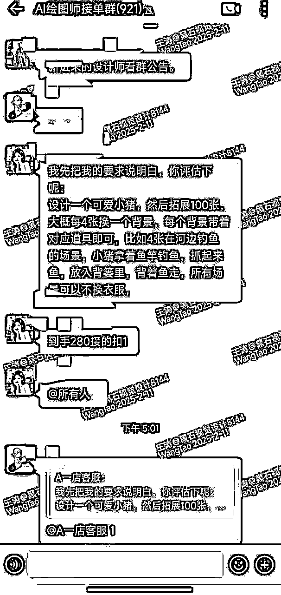
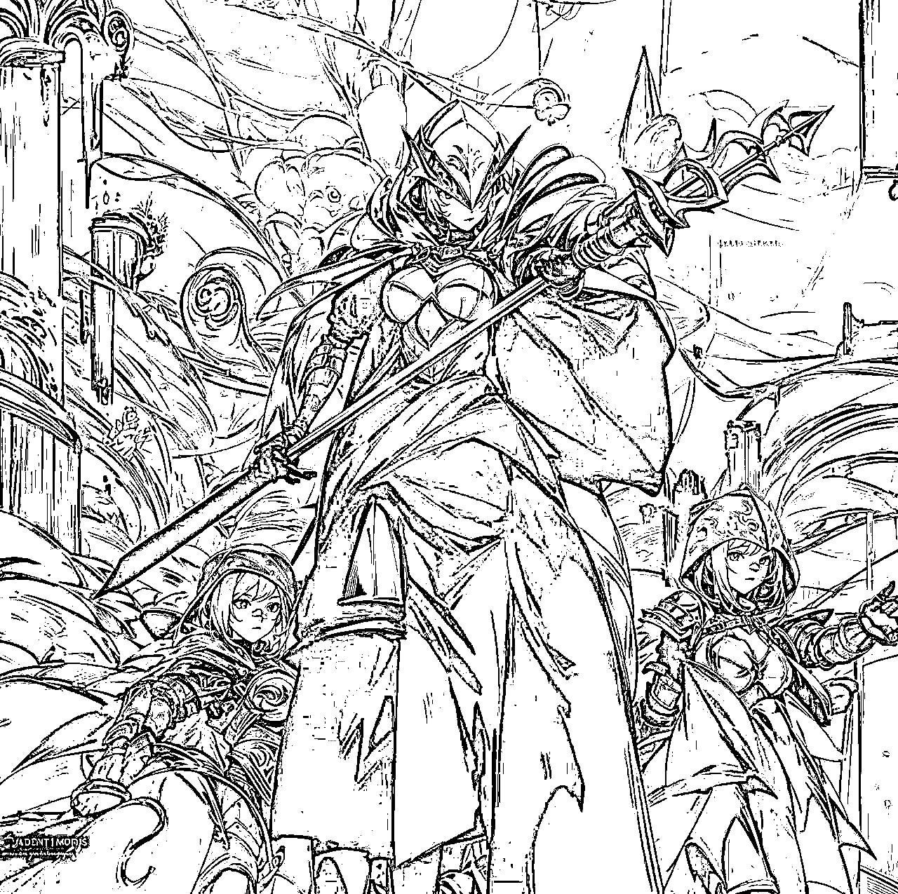

# 《工科大学生副业实战：零美术基础如何靠AI绘画接单变现》

> 来源：[https://jcn1z4p9gwo4.feishu.cn/docx/CtWvdCcAQoTYHmxRIhBc0p5Gn9c](https://jcn1z4p9gwo4.feishu.cn/docx/CtWvdCcAQoTYHmxRIhBc0p5Gn9c)

## 一、入行背景与契机

1.  个人背景介绍

哈喽各位圈友大家好，我是生财圈友可乐，圈名BCC，本人是一名刚毕业的大学生，就读于天津，就读专业为机器人工程，可以说是纯纯理工男一枚，hhhh，估计很多圈友都比较好奇，这个专业是否与美术/设计相关呢？要说美术的话，那属实谈不上，顶多是会培养一些欣赏艺术的美感，也是完全凭着对新鲜事物的好奇接触到了AI绘画这个行业

最初为什么选择AI绘画：

在众多副业当中，我也探索过一些其他类型的副业，包括最简单的薅羊毛，每天就是跟着一个大群里的管理员，每天不定时的发布一些捡漏商品，接触一段时间后感觉只能省掉一部分钱，但是群内真正赚钱的都是拉新人的活动，总的来说利润不大而且费时间，之后就不了了之了

最初接触AI绘画主要是对新鲜事物的好奇，只需要一句话就可以创作出一张十分可观的画面，后来就开始在网上搜集相关的资料，为了创作更加符合自我要求的画面，也想锻炼一门有实用性的技术，正好看到之前的航海有AI绘画相关的技能培训，之后在BOSS上找到了两份兼职的工作，从刚开始的不敢接单到后来零零碎碎赚了一千来块，算是除了工作以外赚的最多的一份收入了

1.  项目启动细节

*   首次接触SD和Midjourny的时间

刚开始的话接触的是SD，全称stable diffusion，简单介绍以下它的优势：

1. 开源免费

开源性：SD是完全开源的，其代码公开，用户可以自由查看、修改和扩展。这种开源性使得全球的开发者可以共同参与优化和改进，社区每天都在更新新的功能和插件。

免费使用：SD完全免费，用户无需支付任何费用即可使用其全部功能。相比之下，Midjourney需要付费订阅，每月费用在10~120美元之间。

2. 高度可控性

参数调整：SD提供了大量的参数和插件，用户可以对生成的图像进行精细的控制，包括人物动作、表情、细节等。例如，通过ControlNet插件，用户可以对图像的局部细节进行精确调整。

模型训练：用户可以自行训练和使用自己的模型，满足特定的创作需求。这种高度的可定制性使得SD在商业应用中更具灵活性，例如在产品设计、建筑设计等领域。

总的来说，SD应用场景为对人物动作性要求比较高或者融合性位置关系比较严格的图片创作，mj虽然付费，但是好在不用自己去找各类大模型，而且对配置没有什么要求，只需要一个可以访问海外网络的工具加上一个有额度的账号即可，相对来说创作更加简单，出图效率更高，质量也不会差到哪，SD经常会有显存不足的提示（可能我的设备配置不太支持出一些高质量的图），

*   学习成本和时间投入

当时学习每天只用一两个小时，大概学了二十来天吧当时，对SD的各个工具跟参数整体有了一定的认知，就开始在网上找一些相关的兼职，入群前小部分会要求发一些之前的作品，就挑上一两张自己看着不错的发给他就OK（一般不会在这个上面卡你），我的话因为应聘时间比较早，当时没管的这么严格，从当时进群只有二百多人，发展至现在已经900+了

*   前期准备工作(软件、设备等)

学习SD的话，需要准备一台电脑，一个最少400G以上存储空间的硬盘，以便放置所需要用到的大模型跟LORA，并且对显存有一定的要求，最好是12G以上的显卡，以下是我的配置参考：

图片中所用到的是秋叶大佬做成的SD一键启动软件，包含了众多常用的插件跟大模型，只需要根据安装包下载安装好就可以直接使用，对小白十分友好，不需要繁琐的操作，简洁的绘图区，只需要输入正向跟负面提示词即可，参数一般使用这一套即可：

*   常用配置：Steps ： 25，Sampler： DPM++ 2M，CFG ：7；

*   高清修复：R-ESRGAN 4x+，强度0.3。

## 二、从0到1的具体实操路径

1.  技能提升阶段

*   如何学习AI绘画

阶段一：基础入门（1-7天）

*   目标：熟悉SD界面，掌握文生图、图生图、参数调整（采样步数、CFG值）。

*   方法：复现B站热门教程案例（如“国风少女”“赛博朋克场景”）。

阶段二：精准控图（8-20天）

*   目标：熟练使用常用ControlNet插件，自主解决“手部畸形”“透视错误”等问题。

*   方法：下载OpenPose骨骼模型，通过调整线条控制人物动作。

depth深度控图，保证画面的层次感。

阶段三：实战应用（21-30天）

*   目标：寻找客户需求，如电商产品图精修、游戏角色设计。

*   方法：研究热门模型（如RealisticVision、DreamShaper），建立属于自己的风格库。

*   常用的学习渠道

B站：UP主“Nenly同学”（SD实战技巧），这位UP主会把SD所常用的插件跟SD的基础知识统统带领大家走一遍，包括各种参数调整后分别有什么样的影响，都会通过视频的形式展现出来，进阶学习的话就是各种插件的使用，大家可以在B站或者其他平台搜索对应的插件使用方法即可，常用的包括ADtailer(面部修复)、tile（分块处理）等等

GitHub：开源插件下载（如After Detailer自动修脸）、模型训练脚本。

*   遇到的主要难点和解决方法

首先在SD中我感觉最难的就是模型的选择，一个适配的模型才能创造出一个符合基本风格要求的图片，比如说真实系的就需要:lofi_V2这类由真实类照片训练出的大模型，动漫风的就需要：AnythingXL_xl等一系列卡通风格系大模型，但是往往在创作过程中就卡在了选模型的问题上，导致大量的时间都在寻找和测试合适的模型，不知道圈友们是怎么解决这个问题的，目前我的解决方法是多看多用，先确定风格，再找相关的模型挨个试，欢迎大家提供建议

1.  接单渠道开拓

*   BOSS兼职平台的开拓经验

首先如果大家要找AI绘画相关的岗位的话，以BOSS为例，直接搜AI绘画即可：结果如下图，我们需要注意的点是：1.当兼职的干，薪资不用看特别高的，薪资太高的基本是全职干

2.招聘需求里标注可居家办公的

3.活跃日期三日内的，太长的估计是停招岗位，意义不大

刚进接单群那段时间，真的是除了害怕还是害怕，怕自己做不好，会被客户投诉，大概一周这样子，每天基本就是在群里看一看各种作品的要求跟价位，想着不能就这样一直怯战下去，终于鼓起勇气接了自己的第一单，有的圈友肯定也比较好奇，是什么契机导致有勇气去接单了呢，因为这一单的价位足够低，只有15块钱，而且客户时间上的要求比较宽松，我才有勇气接下这一单，这也成为了我在这个行业赚到的第一桶金，虽然挣得不多，但让我在这个行业发展有了一定的信心，以下是我跟客户的一些创作交流展示：

原图：

首先我们需要确定一下客户的需求，客户需要我们把原图中的三位男性角色变为女性，空间关系我们尽量保持不变，这就需要使用到一个插件叫提取线稿，是一个contornet中的插件，其次判断这张图是属于二次元风格的，在模型选择时可以选择：Anything这一类的二次元大模型，接下来就是提示词的编辑了，我们可以使用tagger提示词反推插件，把客户的图片给到插件，得到提示词：

光线明亮的场景,中心位置站立着一位头盔式盔甲战士(种族:人类,年龄:成年,详细服装:1.2,配饰:1.2,面部特征:1.3,表情:专注,体型:中等,姿势:站立),穿着深蓝色和红色盔甲,手持长矛,面向观察者,盔甲有复杂的纹理和细节(详细皮肤纹理:1.2),背景是朦胧的城市建筑(架构元素:1.1),色彩为冷色调的蓝色和红色,以及白色和灰色,灯光照明富有戏剧性,视角从略微低于人物的水平位置,营造出一种具有强烈氛围感(大气:1.1)的画面,另有其他两名类似盔甲战士在画面左侧和右侧,他们均携带武器,整体风格类似油画,具有高细节度(高细节:1.2),摄影风格:绘画风格,photorealistic,高清画质,8k分辨率。

去掉不需要的或者不合理的提示词，并修改我们主体的提示词，如男性--女性，年龄，镜头语言等等，最终正面提示词我们可以给到：

光线明亮的场景,中心位置站立着一位女战士(种族:人类,年龄:成年,详细服装:1.2,配饰:1.2,面部特征:1.3,表情:专注,体型:中等,姿势:站立),穿着深蓝色和红色盔甲,手持长矛,面向镜头,背景是朦胧的城市建筑(架构元素:1.1),色彩为冷色调的蓝色和红色,以及白色和灰色,灯光照明富有戏剧性,视角从略微低于人物的水平位置,营造出一种具有强烈氛围感(大气:1.1)的画面,另有其他两名类似盔甲战士在画面左侧和右侧,他们均携带武器,整体风格类似油画,具有高细节度(高细节:1.2),摄影风格:绘画风格,photorealistic,高清画质,8k分辨率。

负面提示词给到通用负面提示词即可，或者我们把不想让图片出现的物品给到负面提示词（这里我直接放英文，正向提示词也需要英文）：

nsfw, paintings, cartoon, anime, sketches, worst quality, low quality, normal quality, lowres, watermark, monochrome, grayscale, ugly, blurry, Tan skin, dark skin, black skin, skin spots, skin blemishes, age spot, glans, disabled, distorted, bad anatomy, morbid, malformation, amputation, bad proportions, twins, missing body, fused body, extra head, poorly drawn face, bad eyes, deformed eye, unclear eyes, cross-eyed, long neck, malformed limbs, extra limbs, extra arms, missing arms, bad tongue, strange fingers, mutated hands, missing hands, poorly drawn hands, extra hands, fused hands, connected hand, bad hands, wrong fingers, missing fingers, extra fingers, 4 fingers, 3 fingers, deformed hands, extra legs, bad legs, many legs, more than two legs, bad feet, wrong feet, extra feets,

之后便是不断的调整提示词跟刷图，最后我给到客户的成品如下：

起初提交的时候我还有点忐忑，怕给出的图片客户会不满意，因为在我之前已经有两三位群友都说达不到这个客户的要求，直到客户说了句：很满意，我才松了一口气，也正是这次我领会到了：很多时候，不要我觉得，要客户觉得

*   其他尝试过的接单品类

之后也尝试过其他的项目，包括一千零一夜故事创作以及宋词的创作，给大家放一些成品参考以下（tips:因为是给到甲方的项目，所以会有版权信息，仅供参考哦）：

这一单作品是用mj出图创作的，不得不说，mj在控制角色一致性跟风格一致性上比SD简单不少，只需要加上指令：--sw 跟 --sref 加上对应的参数与图片链接即可，虽然出图也花费了不少时间，但完成这一单后我也学到了不少知识，有了不小的提高，这单收益也挺不错，嘻嘻

宋词成品：

## 三、实际运营数据分析

1.  时间投入

*   每天/每周投入多少时间

不固定，每天工作完回到家以后，先翻一遍群聊记录，看有没有在自己能力范围内的单子，如果有的话需要跟派单客服交流接下，随后会把咱们跟客户拉到一个小群里交流沟通，平时碰到感兴趣但是技术不达标的时候，我也会偷偷报个名，然后混到群里观察他们的阶段性成品图，向大佬们学习学习，提升自己的技术。

*   如何平衡学业和副业

在学习过程中，我个人认为学业的学习有时候可能是我们被要求强制性学习，不想学但又不得不学，而副业更多的是发自内心的想去学习，阶段性的成就感会让人爱上学习，副业也是，可以作为一个不断成长的自我参考标准，给予我们更多向上发展的空间。

1.  收入构成 与成本分析

| 项目 | 金额（元） | 说明 |
| 总收入 | 1037 | 单独订单接单5笔，共计212元，视频类共制作55分钟，收入825元 |
| 平台成本 | 75 | MJ订阅（两个月75元）+海外网络加速器（用的朋友的，嘻嘻） |
| 净收入 | 962 | 利润率92% |

## 四、经验总结与建议

1.  新手容易踩的坑

*   技术层面

其实这个行业发展至今，软件的操控门槛已经越来越低，一些不断改革的大企业，包括通义千问，即梦等等，不但有一键生图，更有一键图转视频，软件的学习对于我们这种服务小客户的人来说网上的免费教程已足够，况且在生财，航海的知识已经涵盖了大部分重要知识点，建议大家多练习即可，非必要情况下不建议大家去报名网上的AI培训课。

*   接单流程

首先找到相关兼职公司，准备好自己的作品集，

本人作品集代表作参考如图：

卡通转真人：

文字添加背景：

还有其他分类的大家也可以自己制作，提交作品选自己满意的几个即可，不需要太多哈，应聘成功后会将大家拉到一个大群中，客户的需求跟报价会发到大群中，大家如果看到自己心仪的单，直接在群中跟客服联系接单后，会把客户拉到一个小群中交流沟通，只需要注意入群公告中禁止发生的一些规则即可

*   客户沟通

多跟客户交流，不能只按照自己的想法来，阶段性成品交给客户指正，尽量按照客户所想的方向来，可以减少很多无用功。

1.  对新人的建议

*   入行准备事项

刚入行的话，尽量多看，多听，可能很多细节是我们之前学习所没有注意到的，比如我第一次完成作品时，自我感觉没什么问题，但是错误还是有很多处，之后多加小心注意即可：

*   需要具备的能力

自主学习的能力是十分重要的，首先没有人会强制咱们学习相关知识，所有就需要对这行有着足够的兴趣支撑或者其他理由来坚持下来，其次就是要有着迎接失败的好心态，出图过程中运气还是占很大一部分比例的，因为出图跟抽卡差不多，还没有办法完全控制，只能保证在一个范围之内，所以大家如果出了很多次也没有自己想要的图片，可以尝试修改提示词或者其他参数

*   发展建议

AI绘画作为副业来讲是个不错的选择，因为操作起来相对简单，但需要不断地学习，发现更多对自己有用的工具，提高自己的效率，寻找平台接单的话，因为我们只提供相关的技术，在我待得那家店里只能拿到4成利润，如果后续想自己开店的话，就需要学习一些引流与推广的相关知识，多劳多得嘛

最后，感谢各位圈友看完我的第一份副业经历，如有讲的不对的地方，欢迎大家多多提建议，在此也祝各位圈友蛇年快乐，心想事成，新的一年，一起生财有术！