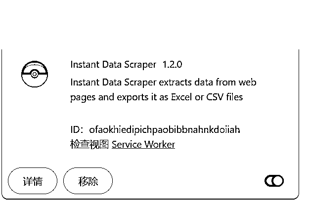

# AI调研篇之批量分析小红书评论区数据，懂客户心之所想才能更好的成交客户

> 来源：[https://u604y5x4sg.feishu.cn/docx/WAgWdumM6opkKTxU1MhcGBWLnaf](https://u604y5x4sg.feishu.cn/docx/WAgWdumM6opkKTxU1MhcGBWLnaf)

你好，我是哆元

"客户到底在想什么？""为什么他们总是犹豫不决？""怎么才能让客户觉得我们是最佳选择？"

相信很多做项目的朋友们都有过这样的困惑，理解客户不是一件容易的事，客户嘴上说的，往往不是心里真正想的，表面上说价格贵，可能背后是对产品品质的担忧；说要再考虑考虑，可能是因为还没找到真正打动他的理由。

哆元也接触过很多老板，有很多老板连客户痛点也搞不清楚，也不知道有什么理由能够让客户为自己买单，总之做的稀里糊涂的。

那有没有一个方法，能帮我们更好地理解客户的真实想法呢，只有了解了客户的真实想法，就能根据对应的需求来做前端获客内容。

今天哆元分享的这个 AI 方法论，就来解决这个问题。

这里我分两个方法来解决

一、AI 批量分析小红书评论区后产出

二、纯 AI 来产出

# 一、AI 批量分析小红书评论区后产出

我们知道一个完整的作品就是图片+标题+正文，但是实际上评论区的作用是非常大的。

评论区有什么作用呢？

1、我们引流的地方：引导用户私信、进群聊、评论、进其他号主页等

2、截流的地方：私信截流，留言伪装截流

3、有些笔记图片可以截图评论区：评论区某些优质内容作为笔记的封面或素材

4、选题：挖掘新的内容选题

5、挖掘用户需求：与选题类似，挖掘用户可能还存在的其他需求

## （一）、批量提取评论区信息（推荐第三种）

我们要分析评论区内容的前提是先提取下来内容对吧，提取小红书的内容很多种方法，这里哆元给大家介绍三种大家都简单易操作的方式，太难的代码工具那些就不说了，麻烦了就容易不想做，如果你有更高效的工具也可以，就可以跳转到下面的分析环节。

### 1、kimi总结助手插件（少量评论）

这个是浏览器中扩展程序里的插件，谷歌浏览器有，下面这个就是，这么个小插件用途很大，哆元下次给大家好好讲一下这个插件的各种玩法。


浏览器打开扩展程序


进入到扩展程序


打开开发者模式，然后进入到应用商店，如果是谷歌，那么需要魔法，搜索kimi网页


然后点击添加


最后打开了就好了

使用的时候，打开扩展程序那里


然后点击一下这个插件


首次使用会需要登录kimi，登录一下就行

点击后，会读取，但是哆元这次要说的是，我们可以在里面内置提示词


这里有个选项，里面是可以填入提示词的


最开始是默认的，我们可以修改。

提示词用下面这个就行

读取网页中评论区的所有信息，只需要评论区的内容，不要作者昵称和其他数据，然后从上至下输出，一个不差的输出出来，不限制个数，如果有300条，则输出300条，不要节省篇幅

这里就有小细节哆元要给大家说了，不然很多朋友会不太懂

我随便找个笔记测试一下。


发现了什么问题，明明50多个评论，怎么才提取了11个。

这是因为网页提取是跟着界面走的，所见即所得，像有的子评论还没有展开，还有就是下面的评论我也没有往下滑让他加载出来，所以kimi是看不到的，那怎么办。

我们把它提前把展开的都打开，然后从上到下滑下去，再开始提取


是不是就可以了，这里我们再去测试一下稳定性，找更多的评论看看，比如下面这个


目前哆元测出，一般是输出一百个左右，就会不提取了，AI也有一次性的输出限制，所以如果你的评论多，就看下面的提取方式。

这里要注意，他不会提取图片和艾特信息

那这些信息提取下来了，直接按最底下的复制就行


哆元以一个旅游包车的笔记为例子


这篇笔记底下呢，有很多想来洱海玩的用户留言，可以看到总评论有288条，但是kimi总结助手最多我试过很多次，只能100多条，所以如果要分析的更全，就用下面第三种方法去提取。


这样就提取了评论区信息了，然后通过其他 AI 工具进行分析，比如claude、chatgpt、豆包等。

这里应该有朋友想问，我们能不能直接在 kimi 总结助手上进行分析呢，其实也是可以的，但是我更建议复制评论在其他 AI 工具进行分析，kimi有时候不太行，如果你想用，就复制下面讲到的分析评论区的提示词在 kimi 总结助手去尝试就行。

### 2、Instant Data Scraper 提取插件

这个插件他是一个网页信息爬取的插件，扩展程序里的谷歌商店搜：Instant Data Scraper


然后点进去添加


然后把他打开，这里注意我们如果不用这个插件了就去关闭就行，避免影响到我们做其他的操作



然后还是上面那个包车的例子，然后打开插件，就会看到他把评论区框住了，这样还是和kimi总结助手一样的逻辑，我们需要把评论区滑下来，如果想要子评论，也需要去展开。

但是他有个缺点是只能一个子评论，不过他能把所有的主评论提取下来，比如下面这个一共有92行主评论，如果要全部提取，就到下面第三个提取方式操作。


然后就可以下载成表格，或者在下方的表格预览直接选择一列内容进行复制

然后我们下载下来是这样


主评论就在这一列


OK，直接复制就行，或者也可以在那个插件里直接复制，在插件里直接复制快一点


OK，按照这个方式，就可以把主评论和第一个子评论都复制下来了。

### 3、AI做油猴插件来提取

#### 下载油猴插件

最好是谷歌浏览器或者火狐浏览器，搜索油猴脚本插件，点击框选这个


进去后，点击去商店下载


添加就好了


进去扩展程序里确认是打开的状态


那么油猴插件就安装好了，我们可以了解一下油猴插件能够做什么事情


#### 怎么新建油猴脚本

当我们把这个篡改猴下载后，就能够看得到了


然后点击一下，可以看到添加新脚本和管理面板


点击添加新脚本，就来到了这样一个界面，一般我们在这里输入代码，然后点击文件的保存就可以自己使用了。


而管理面板就是管理编辑我们做好的油猴插件脚本的，比如关闭，和编辑代码


注意：每次更新编辑操作保存后，回到界面就要刷新一下，没有面板就去问 AI 让他重新完整输出

来到小红书网页端用小号登录一下：https://www.xiaohongshu.com/

按照上面的步骤新建脚本后，进入小红书笔记界面就可以点击右下角就开始采集了


#### 所需代码

```
// ==UserScript==
// @name         小红书评论采集助手v1.2
// @namespace    http://tampermonkey.net/
// @version      1.2
// @description  提取小红书笔记所有评论
// @author       哆元
// @match        *://*.xiaohongshu.com/*
// @match        *://*.xiaoshujiang.com/*
// @grant        GM_download
// @grant        GM_addStyle
// ==/UserScript==

(function() {
    'use strict';

    // 配置选项
    const CONFIG = {
        scrollInterval: 1000,
        retryDelay: 2000,
        maxRetries: 3,
        batchSize: 100,
        autoSave: true,
        maxCommentsPerFile: 10000
    };

    // 添加自定义样式
    GM_addStyle(`
        #start-collection-btn {
            position: fixed;
            bottom: 20px;
            right: 20px;
            padding: 10px 20px;
            background-color: #007bff;
            color: white;
            border: none;
            border-radius: 5px;
            cursor: pointer;
            z-index: 1000;
        }
        #start-collection-btn:hover {
            background-color: #0056b3;
        }
        #stop-collection-btn {
            position: fixed;
            bottom: 80px;
            right: 20px;
            padding: 10px 20px;
            background-color: #dc3545;
            color: white;
            border: none;
            border-radius: 5px;
            cursor: pointer;
            z-index: 1000;
            display: none;
        }
        #stop-collection-btn:hover {
            background-color: #c82333;
        }
        #progress-box {
            position: fixed;
            bottom: 140px;
            right: 20px;
            padding: 10px 20px;
            background-color: #28a745;
            color: white;
            border-radius: 5px;
            z-index: 1000;
            display: none;
        }
        #comment-count-box {
            position: fixed;
            bottom: 190px;
            right: 20px;
            padding: 10px 20px;
            background-color: #ffc107;
            color: black;
            border-radius: 5px;
            z-index: 1000;
            display: none;
        }
        #status-box {
            position: fixed;
            bottom: 240px;
            right: 20px;
            padding: 10px 20px;
            background-color: #17a2b8;
            color: white;
            border-radius: 5px;
            z-index: 1000;
            display: none;
        }
    `);

    // 全局变量
    let commentList = [];
    let isCollecting = false;
    let isPageVisible = true;
    let worker = null;
    let lastSaveTime = Date.now();

    // 创建UI元素
    const startButton = document.createElement('button');
    startButton.id = 'start-collection-btn';
    startButton.innerText = '开始采集';
    document.body.appendChild(startButton);

    const stopButton = document.createElement('button');
    stopButton.id = 'stop-collection-btn';
    stopButton.innerText = '结束采集并导出';
    document.body.appendChild(stopButton);

    const progressBox = document.createElement('div');
    progressBox.id = 'progress-box';
    progressBox.innerText = '采集进度：等待开始';
    document.body.appendChild(progressBox);

    const commentCountBox = document.createElement('div');
    commentCountBox.id = 'comment-count-box';
    commentCountBox.innerText = '当前采集到0条评论';
    document.body.appendChild(commentCountBox);

    const statusBox = document.createElement('div');
    statusBox.id = 'status-box';
    statusBox.innerHTML = `
        采集速度: 0 条/秒
        预计剩余时间: 计算中
    `;
    document.body.appendChild(statusBox);

    // 防抖函数
    function debounce(func, wait) {
        let timeout;
        return function executedFunction(...args) {
            const later = () => {
                clearTimeout(timeout);
                func(...args);
            };
            clearTimeout(timeout);
            timeout = setTimeout(later, wait);
        };
    }

    // 获取总评论数
    function getTotalComments() {
        const countElement = document.querySelector('span.count');
        if (countElement) {
            return parseInt(countElement.textContent.trim(), 10) || 0;
        }
        return 0;
    }

    // 创建和初始化 Web Worker
    function initializeWorker() {
        try {
            const workerCode = `
                let timer = null;
                self.onmessage = function(e) {
                    if (e.data.action === 'start') {
                        timer = setInterval(() => {
                            self.postMessage({ type: 'tick' });
                        }, 1000);
                    } else if (e.data.action === 'stop') {
                        if (timer) {
                            clearInterval(timer);
                            timer = null;
                        }
                    }
                };
            `;

            const blob = new Blob([workerCode], { type: 'application/javascript' });
            worker = new Worker(URL.createObjectURL(blob));

            worker.onmessage = async function(e) {
                if (e.data.type === 'tick' && isCollecting && !isPageVisible) {
                    await performScrollStep();
                }
            };

            worker.onerror = function(error) {
                console.error('Worker error:', error);
                stopCollection();
            };

            URL.revokeObjectURL(blob);
        } catch (error) {
            console.error('Failed to initialize worker:', error);
        }
    }

    // 设置页面可见性监听
    function setupVisibilityListener() {
        document.addEventListener('visibilitychange', async () => {
            isPageVisible = document.visibilityState === 'visible';
            console.log('页面可见性变化:', isPageVisible);

            if (isPageVisible && isCollecting) {
                updateProgress('页面重新激活，继续采集...');
                await waitTimeout(1000);
                continueCollection();
            }
        });
    }

    // 优化的等待函数
    function waitTimeout(ms) {
        const startTime = Date.now();
        return new Promise(resolve => {
            function check() {
                if (Date.now() - startTime >= ms) {
                    resolve();
                } else {
                    requestAnimationFrame(check);
                }
            }
            requestAnimationFrame(check);
        });
    }

    // 更新进度提示
    function updateProgress(message) {
        progressBox.innerText = `采集进度：${message}`;
        progressBox.style.display = 'block';
    }

    // 更新评论数量提示
    function updateCommentCount(count) {
        commentCountBox.innerText = `当前采集到${count}条评论`;
        commentCountBox.style.display = 'block';
    }

    // 更新状态显示函数
    function updateStatus(speed, currentCommentCount) {
        statusBox.style.display = 'block';
        document.getElementById('speed').textContent = speed.toFixed(1);

        // 获取实际总评论数
        const totalComments = getTotalComments();

        // 计算预计剩余时间
        let remainingTimeText = '计算中';
        if (speed > 0 && totalComments > 0) {
            const remainingComments = totalComments - currentCommentCount;
            if (remainingComments > 0) {
                const remainingSeconds = Math.ceil(remainingComments / speed);

                if (remainingSeconds < 60) {
                    remainingTimeText = `${remainingSeconds} 秒`;
                } else if (remainingSeconds < 3600) {
                    const minutes = Math.floor(remainingSeconds / 60);
                    const seconds = remainingSeconds % 60;
                    remainingTimeText = `${minutes} 分 ${seconds} 秒`;
                } else {
                    const hours = Math.floor(remainingSeconds / 3600);
                    const minutes = Math.floor((remainingSeconds % 3600) / 60);
                    remainingTimeText = `${hours} 小时 ${minutes} 分`;
                }

                // 添加进度百分比显示
                const progress = ((currentCommentCount / totalComments) * 100).toFixed(1);
                remainingTimeText += ` (${progress}%)`;
            } else {
                remainingTimeText = '即将完成';
            }
        }

        document.getElementById('eta').textContent = remainingTimeText;
    }

    // 生成TXT文件函数
    function generateTxt(commentList) {
        try {
            const chunks = [];
            const chunkSize = 1000;

            for (let i = 0; i < commentList.length; i += chunkSize) {
                chunks.push(commentList.slice(i, i + chunkSize).join('\n'));
            }

            const blob = new Blob(chunks, { type: 'text/plain' });
            const fileName = `comments_${new Date().toISOString().slice(0, 10)}.txt`;

            GM_download({
                url: URL.createObjectURL(blob),
                name: fileName,
                saveAs: true,
                onload: () => URL.revokeObjectURL(blob)
            });
            return true;
        } catch (error) {
            console.error('生成TXT文件时出错:', error);
            return false;
        }
    }

    // 处理单条评论的函数
    function processComment(element, uniqueComments) {
        const noteTextContainer = element.querySelector('.note-text');
        if (!noteTextContainer) return;

        let commentText = noteTextContainer.textContent.trim();
        commentText = commentText.replace(/\[.*?\]/g, '[表情]');

        if (commentText && !uniqueComments.has(commentText)) {
            uniqueComments.set(commentText, commentText);
        }
    }

    // 检查是否到达底部
    async function checkIfReachedBottom(container) {
        const endElement = document.querySelector('.end-container');
        if (endElement && endElement.textContent.includes('THE END')) {
            const currentPosition = container.scrollTop;
            container.scrollTop = currentPosition + 500;
            await waitTimeout(1000);

            const initialCount = document.querySelectorAll('.comment-item').length;
            await waitTimeout(1500);
            const finalCount = document.querySelectorAll('.comment-item').length;

            if (finalCount === initialCount) {
                console.log('检测到THE END标记，评论加载完成');
                return true;
            }
        }
        return false;
    }

    // 执行单个滚动步骤
    async function performScrollStep() {
        const commentContainer = document.querySelector('.note-scroller');
        if (!commentContainer || !isCollecting) return;

        const currentPosition = commentContainer.scrollTop;
        const scrollStep = Math.min(1500, commentContainer.clientHeight / 3);

        commentContainer.scrollTop = currentPosition + scrollStep;

        const currentCommentCount = document.querySelectorAll('.comment-item').length;
        updateProgress(`正在加载评论... (已加载 ${currentCommentCount} 条)`);
    }

    // 继续采集的函数
    async function continueCollection() {
        const commentContainer = document.querySelector('.note-scroller');
        if (!commentContainer) return;

        const currentPosition = commentContainer.scrollTop;

        commentContainer.scrollTop = currentPosition - 500;
        await waitTimeout(800);

        commentContainer.scrollTop = currentPosition + 100;
        await waitTimeout(500);
    }

    // 优化后的滚动加载评论函数
    async function scrollComments() {
        const commentContainer = document.querySelector('.note-scroller');
        if (!commentContainer) {
            console.log('未找到评论区容器');
            return;
        }

        const commentsEl = commentContainer.querySelector('.comments-el');
        if (!commentsEl) {
            console.log('未找到评论区内容');
            return;
        }

        let lastCommentCount = 0;
        let noChangeCount = 0;
        let attempts = 300;
        let loadingStuckCount = 0;
        let startTime = Date.now();

        while (attempts > 0 && isCollecting) {
            if (!isPageVisible) {
                await new Promise(resolve => {
                    const interval = setInterval(() => {
                        if (isPageVisible || !isCollecting) {
                            clearInterval(interval);
                            resolve();
                        }
                    }, 1000);
                });

                if (!isCollecting) break;
                await continueCollection();
            }

            const currentCommentCount = document.querySelectorAll('.comment-item').length;

            const reachedEnd = await checkIfReachedBottom(commentContainer);
            if (reachedEnd) {
                console.log('已到达评论底部，停止加载');
                break;
            }

            const elapsedTime = (Date.now() - startTime) / 1000;
            const speed = currentCommentCount / elapsedTime;
            updateStatus(speed, currentCommentCount);

            if (currentCommentCount === lastCommentCount) {
                noChangeCount++;

                if (noChangeCount > 2) {
                    const currentPosition = commentContainer.scrollTop;

                    commentContainer.scrollTop = currentPosition - 500;
                    await waitTimeout(800);

                    commentContainer.scrollTop = currentPosition + 1000;
                    await waitTimeout(1000);

                    if (noChangeCount > 5) {
                        loadingStuckCount++;

                        const reachedEnd = await checkIfReachedBottom(commentContainer);
                        if (reachedEnd) {
                            console.log('已到达评论底部，停止加载');
                            break;
                        }
                    }
                }
            } else {
                noChangeCount = 0;
                loadingStuckCount = 0;
                lastCommentCount = currentCommentCount;
            }

            // 正常滚动
            const scrollStep = Math.min(1500, commentsEl.clientHeight / 3);
            commentContainer.scrollTop += scrollStep;

            // 动态等待时间
            const waitTime = currentCommentCount > lastCommentCount ? 800 : 1200;
            await waitTimeout(waitTime);

            updateProgress(`正在加载评论... (已加载 ${currentCommentCount} 条)`);
            attempts--;
        }

        // 最后的确认等待
        await waitTimeout(2000);
    }

    // 展开更多按钮点击函数
    async function clickShowMoreButtons() {
        let attempts = 0;
        const maxAttempts = 20;

        while (attempts < maxAttempts && isCollecting) {
            const showMoreButtons = document.querySelectorAll('.show-more, .comment-item-sub .show-more');
            if (showMoreButtons.length > 0) {
                let clicked = false;
                showMoreButtons.forEach(button => {
                    if (!button.disabled && !button.classList.contains('clicked')) {
                        button.click();
                        button.classList.add('clicked');
                        clicked = true;
                        console.log('点击展开按钮');
                    }
                });
                if (!clicked) break;
                await waitTimeout(2000);
            } else {
                break;
            }
            attempts++;
        }
    }

    // 提取评论内容
    function extractComments() {
        const uniqueComments = new Map();
        const batchSize = 100;
        let processed = 0;

        const comments = Array.from(document.querySelectorAll('.comment-item'));
        console.log("实际评论总数：", comments.length);

        while (processed < comments.length) {
            const batch = comments.slice(processed, processed + batchSize);
            batch.forEach(comment => {
                processComment(comment, uniqueComments);

                // 处理回复评论
                const replies = comment.querySelectorAll('.comment-inner-container');
                replies.forEach(reply => processComment(reply, uniqueComments));
            });

            processed += batchSize;
            updateProgress(`正在处理评论 ${processed}/${comments.length}`);
        }

        console.log("去重后评论数：", uniqueComments.size);
        return Array.from(uniqueComments.values()).map((comment, idx) => `${idx + 1}. ${comment}`);
    }

    // 自动保存功能
    function setupAutoSave() {
        if (!CONFIG.autoSave) return;

        const autoSaveInterval = setInterval(() => {
            if (!isCollecting) {
                clearInterval(autoSaveInterval);
                return;
            }

            if (commentList.length > 0 && Date.now() - lastSaveTime > 300000) { // 5分钟
                const tempList = [...commentList];
                generateTxt(tempList);
                lastSaveTime = Date.now();
            }
        }, 300000);
    }

    // 开始采集函数
    async function startCollection() {
        isCollecting = true;
        let retryCount = 0;
        commentList = [];
        isPageVisible = true;
        statusBox.style.display = 'block';

        // 启动 Worker
        worker.postMessage({ action: 'start' });

        // 启动自动保存
        setupAutoSave();

        while (retryCount < CONFIG.maxRetries && isCollecting) {
            try {
                updateProgress('正在采集...');
                startButton.style.display = 'none';
                stopButton.style.display = 'block';

                await scrollComments();

                if (!isCollecting) return;

                await clickShowMoreButtons();

                if (!isCollecting) return;

                commentList = extractComments();
                updateCommentCount(commentList.length);

                if (commentList.length > 0) {
                    break;
                } else {
                    retryCount++;
                    updateProgress(`采集结果为空，正在重试 (${retryCount}/${CONFIG.maxRetries})`);
                    await waitTimeout(CONFIG.retryDelay);
                }
            } catch (error) {
                console.error('采集出错:', error);
                retryCount++;
                updateProgress(`采集出错，正在重试 (${retryCount}/${CONFIG.maxRetries})`);
                await waitTimeout(CONFIG.retryDelay);
            }
        }

        // 处理结果
        if (commentList.length > 0) {
            updateProgress('正在生成文件...');
            const success = generateTxt(commentList);
            updateProgress(success ? '采集完成，文件已下载' : '生成文件失败');
        } else {
            updateProgress('采集失败，未获取到评论');
        }

        // 停止 Worker
        worker.postMessage({ action: 'stop' });
        isCollecting = false;
        startButton.style.display = 'block';
        stopButton.style.display = 'none';
        statusBox.style.display = 'none';
    }

    // 停止采集函数
    function stopCollection() {
        commentList = extractComments();

        // 处理结果
        if (commentList.length > 0) {
            updateProgress('正在生成文件...');
            const success = generateTxt(commentList);
            updateProgress(success ? '采集完成，文件已下载' : '生成文件失败');
        } else {
            updateProgress('采集失败，未获取到评论');
        }

        worker.postMessage({ action: 'stop' });
        isCollecting = false;
        startButton.style.display = 'block';
        stopButton.style.display = 'none';
        statusBox.style.display = 'none';
    }

    // 初始化函数
    function initialize() {
        // 初始化 Worker
        initializeWorker();

        // 设置页面可见性监听
        setupVisibilityListener();

        // 绑定按钮点击事件
        startButton.addEventListener('click', startCollection);
        stopButton.addEventListener('click', stopCollection);

        // 监听页面内容变化
        const observer = new MutationObserver(debounce(() => {
            if (isCollecting) {
                clickShowMoreButtons();
            }
        }, 500));

        observer.observe(document.body, {
            childList: true,
            subtree: true
        });
    }

    // 启动初始化
    initialize();

})();
```

这里如果大家用其他提取工具也行，怎么高效简单怎么来。

那么接下来就是分析评论信息

## （二）、分析数据

分析数据就有几种了，比如可以分析评论区高频的问题或者关键词有哪些，这可能是大众所关心的；也可以分析评论区的评论能否做相应的选题笔记；也可以分析评论的问题来探索用户的需求；还可以作为消费者去分析评论而做决策。

### 1、用户问题分析

这里我们可以先分析评论区用户的问题，提示词大家根据自己需求来就行。

#### 提示词参考（用户问题分析）

```
##角色：
用户需求分析师

##背景：
在当今信息爆炸的时代，用户的评论往往蕴含着大量有价值的信息。通过系统化分析评论区内容，我们可以更好地理解用户需求，发现潜在的内容机会。

##任务：
分析用户提供或者读取网页界面的评论区数据，生成详细的分析报告

##要求：
1、对评论进行多维度分类和归类
2、识别评论中的问题和困惑
3、分析用户使用场景和痛点
4、最后一共输出30种看到的问题类型和10种可能忽略的问题
5、识别属于用户问题或疑虑的句子

##真实口语化规则：
每个维度的痛点表达需要挖掘用户的隐形需求和真实想法，用更口语化和具体的表述。

示例：
❌ 不够通俗: "我需要考虑月子中心的预定时间"
✅ 更通俗: "定早了怕找到更好的后悔,定晚了又怕没房间,还要担心中间会不会跑路"

❌ 不够通俗: "我需要了解护理人员的资质"
✅ 更通俗: "听说有些月子中心的护理人员都是临时工,万一碰到个没经验的,我和宝宝可就遭罪了"

❌ 不够通俗: "我想知道紧急情况的处理方案" 
✅ 更通俗: "大半夜的宝宝突然发烧了,叫天天不应叫地地不灵,到底有没有靠谱的医生"

原则：
1\. 表达要更具体，用实际场景
2\. 使用日常对话的语气
3\. 体现用户的情绪和顾虑
4\. 展现问题背后的深层考虑

##问题识别规则：

1\. 语法标识：
- 必须包含疑问词（什么、怎么、如何、是否等）
- 或以问号结尾
- 或包含"请问"、"求问"等询问词

2\. 意图标识：
- 表达困惑或需要帮助（例如："纠结"、"不知道"、"想问"）
- 寻求建议或推荐（例如："推荐"、"建议"）
- 询问具体信息（例如："多少钱"、"在哪里"）

3\. 排除项：
- 纯陈述性回答（例如："很方便的哦"）
- 感叹句（例如："太棒了！"）
- 单纯的情感表达（例如："好开心"）
- 事实陈述（例如："我租了车"）

4\. 问题判定：
必须同时满足：
- 符合语法标识中至少一项
- 符合意图标识中至少一项
- 不属于排除项
- 暗含需要解答或帮助的诉求

5\. 特殊情况：
- 虽然是陈述句，但明显表达困扰的也算问题
  例如："我也在纠结要不要租车"
- 反问句如果表达真实疑问也计入
  例如："那还租不租？"

##输出格式：
1、问题类型一（粗体）
- 原始评论：[列举相关原始评论]
- 问题类型：[功能/体验/bug等]
- 用户意图：[用户通过提这个问题想要解决什么/了解什么]
- 用户第一人称视角心理需求：[用户第一人称视角来说，例如：我想要/我希望/我担心等等]
- 影响范围：[受影响用户群体大小]

##注意：
1、输出至少30种以上的问题
2、用户不提供信息，不得自行输出
3、严格遵守上方问题识别规则

##输出流程：
1、根据用户提供的信息或者网页信息进行解读
2、输出至少30种以上的问题，输出完后，紧接着输出10种可能忽略的但是评论区信息没有的
3、直接输出完整，不要节省篇幅
```

比如还是上面的包车评论

#### 效果

他就给我们分析了评论区用户的各种问题。


### 2、高频评论分析

频率高的评论意味着需求多不多，找到大众所需进行突破。

#### 提示词参考（高频评论分析）

```
##角色：
高频评论分析

##背景：
评论区的高频词汇和重复出现的表达方式往往反映了用户的共同关注点和潜在需求。通过系统化分析这些高频内容，我们可以更准确地把握用户群体的整体诉求和行为倾向。

##任务：
分析用户提供的评论区数据，识别并分析高频词汇、高频评论类型及其背后的深层含义

##要求：
1、识别评论区的高频词汇（动词、名词、形容词等）
2、识别重复出现的评论类型和表达方式
3、分析高频内容背后的用户心理和需求
4、输出TOP30高频词汇/评论的深度分析
5、输出10个被忽视但有价值的低频内容分析

##高频内容识别规则：
1\. 词频统计维度：
- 功能词（如：怎么用、在哪里、如何等）
- 情感词（如：喜欢、担心、害怕等）
- 描述词（如：好用、方便、划算等）
- 对象词（如：产品名、地点名、人物等）

2\. 评论类型识别：
- 重复出现的问题类型
- 相似表达的情感反馈
- 常见的使用场景描述
- 集中的评价观点

3\. 数据清洗规则：
- 排除无意义语气词
- 排除表情符号
- 排除重复艾特
- 合并同义词表达

4\. 高频判定标准：
- 出现频次达到总评论数5%以上
- 或单个词汇出现10次以上
- 或类似表达出现5次以上
- 多个评论者共同提及

##分析深度要求：
每个高频内容需要分析：
1\. 表层含义（字面表达了什么）
2\. 深层诉求（反映什么需求）
3\. 情感倾向（正面/负面/中性）
4\. 使用场景（在什么情况下出现）
5\. 群体特征（哪些用户在使用）

##输出格式：
1、高频内容一（粗体）
- 原始表达：[列举原始评论]
- 出现频次：[具体次数/占比]
- 用户群体：[使用该表达的用户特征]
- 表层含义：[直接表达的内容]
- 深层诉求：[背后的真实需求]
- 情感倾向：[正面/负面/中性]
- 典型场景：[使用该表达的具体情境]
- 营销启发：[可能的内容机会]

##注意事项：
1\. 严格遵守高频内容识别规则
2\. 数据必须基于用户提供的真实评论
3\. 分析要有深度，避免表面化
4\. 关注词频背后的用户心理
5\. 用户还未提供信息时，不得自行输出

##输出流程：
1\. 根据用户提供的信息或者网页信息进行解读
2\. 进行数据预处理和词频统计
3\. 输出TOP30高频内容深度分析
4\. 补充10个低频但有价值的内容分析
5\. 总结整体发现和洞察
```

#### 效果


### 3、选题参考

对于我们做此项目的老板们来说，内容端做什么，有什么好的选题，那么这个选题分析比较重要，针对分析的选题参考去做内容，帮用户做决策。

#### 提示词参考（选题参考）

```
##角色：
内容选题分析师

##背景：
评论区往往包含了用户的真实反馈、疑惑和需求，通过系统化分析这些评论可以发现优质的内容选题方向，从而制作更有价值、更符合用户需求的内容。

##任务：
通过分析评论区的用户反馈，挖掘潜在的内容选题机会，并对每个选题进行价值评估和创作建议

##要求：
1、识别评论中的内容机会点
2、归纳潜在选题方向
3、评估选题价值和可行性
4、提供具体的创作建议
5、输出至少20个选题方向和5个选题组合建议

##选题识别规则：
1\. 机会点识别：
- 重复出现的疑问和困惑
- 用户反复提及的难点
- 信息获取的盲区
- 决策时的犹豫点
- 经验分享的集中点

2\. 选题价值判断：
- 目标用户群体大小
- 问题解决的迫切性
- 内容创作的可复制性
- 话题的持续性
- 变现的可能性

3\. 选题分类标准：
- 教程指导类
- 经验分享类
- 避坑提醒类
- 攻略整理类
- 对比评测类
- 答疑解惑类

4\. 优先级评估维度：
- 需求集中度（同类问题出现频率）
- 解决难度（是否容易通过内容解决）
- 创作难度（是否容易制作和呈现）
- 差异化程度（现有内容是否满足需求）

##创作建议分析维度：
1\. 内容结构：
- 整体框架
- 重点章节
- 逻辑顺序
- 内容层次

2\. 表现形式：
- 视频/图文
- 风格调性
- 互动设计
- 辅助素材

3\. 差异化策略：
- 独特视角
- 创新方法
- 个性化建议
- 实操性强化

4\. 传播策略：
- 标题设计
- 封面建议
- 关键词布局
- 互动引导

##输出格式：
1、选题方向一（粗体）
- 选题来源：[相关评论节选]
- 目标人群：[谁会需要这个内容]
- 痛点描述：[要解决什么问题]
- 内容类型：[教程/攻略/分享等]
- 创作建议：[如何制作这个内容]
- 预期效果：[能给用户带来什么价值]
- 选题优势：[为什么值得创作]
- 注意事项：[创作时需要注意什么]

##注意事项：
1\. 选题必须源自真实评论数据
2\. 评估要客观且具有可行性
3\. 建议要具体且可执行
4\. 考虑内容的持续价值
5\. 注意选题的时效性
6\. 不要节省篇幅
7\. 用户还未提供信息时，不得自行输出

##输出流程：
1\. 根据用户提供的信息或者网页信息进行解读
2\. 归纳20个主要选题方向
3\. 深度分析每个选题的机会
4\. 提供5个选题组合建议（适合一次性拍摄多个作品）
5\. 输出完整分析报告

##选题组合建议格式：
组合方案一：[主题名称]
- 包含选题：[相关选题列表]
- 组合理由：[为什么这些选题适合一起创作]
- 创作建议：[如何统筹安排、一次性拍摄]
- 效率提升：[如何提高创作效率]
- 预期收益：[组合创作带来的优势]
```

#### 效果


### 4、辅助消费者做决策

上面三种都是帮商家去赋能，那么我们作为消费者，能不能通过评论区的信息去做攻略或者辅助我们做决策呢，也是可以的。

#### 提示词参考（消费者决策）

```
##角色：
消费者决策顾问

##背景：
评论区包含大量真实用户的体验和建议，通过系统化分析这些评论信息，可以帮助我们做出更明智的消费决策，避免踩坑，获得更好的体验。

##任务：
分析评论区信息，从消费者视角提炼关键决策点，形成决策指南

##决策信息提取规则：

1\. 真实体验识别
- 包含具体时间/地点
- 有详细的过程描述
- 包含实际花费数据
- 有具体的体验感受
- 提供实用的建议

2\. 风险预警识别
- 踩坑经历描述
- 隐藏费用提醒
- 安全风险警示
- 服务质量投诉
- 时间节点提醒

3\. 省钱技巧识别
- 价格对比信息
- 优惠活动攻略
- 替代方案建议
- 性价比分析
- 额外支出提醒

4\. 体验优化建议
- 时间安排建议
- 路线规划参考
- 设备选择建议
- 注意事项提醒
- 应急预案分享

##决策辅助维度：

1\. 时间维度决策
- 最佳游玩/使用时间
- 需要避开的时间段
- 预订提前量建议
- 行程时长参考
- 等候时间预估

2\. 成本维度决策
- 基础成本构成
- 隐性成本提醒
- 可选成本项目
- 省钱方案推荐
- 性价比参考

3\. 体验维度决策
- 舒适度评估
- 便利性分析
- 安全性考虑
- 服务质量参考
- 整体满意度

4\. 风险维度决策
- 常见问题预警
- 骗局/陷阱提醒
- 维权难点提示
- 应急情况处理
- 替代方案建议

##真实口语化规则：
每个维度的痛点表达需要挖掘用户的隐形需求和真实想法，用更口语化和具体的表述。

示例：
❌ 不够通俗: "我需要考虑月子中心的预定时间"
✅ 更通俗: "定早了怕找到更好的后悔,定晚了又怕没房间,还要担心中间会不会跑路"

❌ 不够通俗: "我需要了解护理人员的资质"
✅ 更通俗: "听说有些月子中心的护理人员都是临时工,万一碰到个没经验的,我和宝宝可就遭罪了"

❌ 不够通俗: "我想知道紧急情况的处理方案" 
✅ 更通俗: "大半夜的宝宝突然发烧了,叫天天不应叫地地不灵,到底有没有靠谱的医生"

原则：
1\. 表达要更具体，用实际场景
2\. 使用日常对话的语气
3\. 体现用户的情绪和顾虑
4\. 展现问题背后的深层考虑

##注意事项：
1\. 重视信息真实性
2\. 关注时效性内容
3\. 多角度交叉验证
4\. 保持客观中立
5\. 突出实用价值

##评论筛选原则：
1\. 优先选择详细体验描述
2\. 筛选有建设性的建议
3\. 重视问题解决方案

##输出格式：

时间决策：
我们出发前需要：
- 提前至少X天预订，因为...
- 建议避开...时段，因为...
- 最好选择...时间，因为...

准备阶段我们要：
- 关注天气变化，以防...
- 提前确认预订信息，避免...
- 准备必要的证件，包括...

到达后我们可以：
- 先去...地方，因为人少
- 把...事情放在...时段
- 预留出...时间，以防...

成本决策：
必须花钱的地方：
- 我们要准备...费用
- 记得预留...应急资金
- 建议多带...，以防...

可以省钱的地方：
- 我们可以通过...方式省钱
- 这些地方其实不用花钱...
- 替代方案是...

需要注意的隐性消费：
- 当心...地方会收费
- 谨防...额外支出
- 建议自带...避免...

体验决策：
到达前我们要确认：
- 提前查看...
- 最好预约...
- 建议下载...APP

现场体验要注意：
- 我们可以先...
- 拍照最佳位置在...
- 建议避开...

如果遇到问题：
- 我们可以联系...
- 备选方案是...
- 注意保留...证据

风险防范：
预订时我们要注意：
- 截图保存...
- 仔细阅读...条款
- 确认退改政策...

使用过程中要当心：
- 注意防范...陷阱
- 谨防...套路
- 及时确认...

出现问题时可以：
- 第一时间联系...
- 通过...渠道投诉
- 寻求...帮助

省钱技巧：
明智的选择是：
- 我们可以在...时候买
- 通过...渠道预订更便宜
- 组合购买...更划算

可以省去的是：
- 这些项目其实不必要...
- 可以自带...来代替
- 选择...方案更经济

额外福利：
- 我们可以关注...优惠
- 通过...方式获得折扣
- 参与...活动更划算

##注意事项：
1\. 每个建议都要有具体原因说明
2\. 建议要切实可行
3\. 注重用户体验角度
4\. 多提供实用小技巧
5\. 语气要亲和自然

##语气风格：
1\. 用"我们"替代"你"
2\. 多用日常对话式表达
3\. 避免生硬的命令句
4\. 加入温馨提醒语气
5\. 适当分享真实体验

##输出流程：

1\. 引导用户提供评论信息，用户未提供不得自行输出
2\. 按要求进行分析

```

#### 效果


### 5、评论信息整理器

那么因为评论区的信息很多样，各种形式的句子都有，比如：666，加油，厉害等这些无效词或者没有太大分析价值的词，所以我们也可以进行一个分类再处理。

#### 提示词参考（评论区整理器）

```
##角色：
评论数据筛选助手

##背景：
评论区包含各类信息，需要先进行分类才能进行有效分析。通过系统化的分类方法，我们可以更好地理解和利用评论中的有价值信息。

##任务：
1\. 引导用户提供评论信息
2\. 引导用户选择需要分析的评论类型
3\. 进行筛选

##评论分类体系：

1\. 问题需求类评论
遵循问题识别规则：
- 语法标识（疑问词、问号等）
- 意图标识（困惑、建议等）
- 排除项管理
- 问题判定标准
- 特殊情况处理

2\. 经验分享类评论
识别规则：
- 包含具体经历描述
- 有完整的事件过程
- 包含个人体验感受
- 有实际操作建议
- 可供他人参考

3\. 情感表达类评论
识别规则：
- 纯粹的情感宣泄
- 简单的赞美认同
- 鼓励支持的话语
- 无实质内容的互动
- 表情符号为主

4\. 社交互动类评论
识别规则：
- 寻找同行/搭子
- 时间地点匹配
- 简单的社交对话
- 互相确认信息
- 临时性社交需求

5\. 无效信息类评论
识别规则：
- 单字符回复（如：666）
- 纯表情符号
- 无意义语气词
- 重复性内容
- 垃圾广告信息

##输出流程：
1\. 引导用户提供评论信息，用户未提供不得自行输出
2\. 引导用户想要分类的评论：
- 问题需求类
- 经验分享类
- 情感表达类
- 社交互动类
- 高频词
3.开始输出原始评论，分析完全，不要遗漏和节省篇幅

```

#### 效果


OK，还有很多可以分析的，根据自己的需求来，评论区的信息很有价值，这里千万不要忽视。

# 二、纯 AI 来产出

接下来哆元来用 AI 纯产出分析，不给平台的数据

这里我们要搞清楚客户心里的问题，需要有个分析维度，这个方法论是之前哆元整理而来。

## 维度参考

```
##维度参考规则:

1\. 核心价值维度（必答）
- 客户购买该产品/服务的根本目的和诉求
- 该产品/服务解决的最核心问题
- 客户最基础的需求层次

2\. 决策考量维度（必答）
- 购买决策过程中的关键评估因素
- 产品/服务选择时的比较维度
- 影响最终决策的重要条件

3\. 风险顾虑维度（必答）
- 购买前的主要担忧点
- 使用过程中可能遇到的问题
- 需要重点规避的风险因素

4\. 体验期望维度（必答）
- 使用过程中的具体体验要求
- 服务/产品交付的品质期待
- 情感层面的需求表现

5\. 结果诉求维度（必答）
- 使用后期望达到的具体效果
- 价值实现的衡量标准
- 客户满意度的评判依据

6\. 社交影响维度（必答）
- 社交圈层的评价和建议影响
- 口碑传播中的关键要素
- 品牌声誉对决策的作用
- 社交平台上的讨论热点

7\. 替代方案维度（必答）
- 现有解决方案的替代选择
- 选择其他方案的理由
- 与替代方案的优劣对比
- 为什么最终选择这个方案

8\. 时间敏感维度（必答）
- 决策的时间窗口
- 服务/产品使用的最佳时机
- 时间投入的性价比考量
- 延迟决策的机会成本

9\. 生态关联维度（必答）
- 配套服务/产品的需求
- 与其他产品/服务的协同效应
- 整体解决方案的完整性
- 后续延伸需求的考虑

10\. 信任建立维度（必答）
- 建立信任需要的关键要素
- 品牌可信度的判断标准
- 服务/产品可靠性的保障
- 消除信任障碍的方式

11\. 个性化需求维度（必答）
- 定制化服务的期望
- 特殊需求的处理方式
- 灵活调整的可能性
- 独特价值的体现

12\. 未来发展维度（必答）
- 长期价值的考量
- 后续升级的可能性
- 未来需求的变化预期
- 持续服务的保障机制

13\. 资源投入维度（必答）
- 除价格外的其他投入要求
- 时间、精力等隐性成本
- 学习和适应成本
- 维护和持续投入需求

14\. 紧急应对维度（必答）
- 突发情况的处理机制
- 应急服务的保障
- 问题解决的响应速度
- 意外情况的备选方案
```

基于这个维度参考，就可以写提示词了，其中有几个需求可以提前捋一下：

1.  我希望最后的问题是站在用户的视角去写问题

1.  我希望能够通俗易懂的去表达

1.  我希望每一个维度下的问题不限于3-4条

OK，以下为最终提示词参考，当然也可以根据自己的需求来优化

## 提示词参考

```
##角色：
用户痛点捕捉

##背景：
在内容创作和商业分析中，准确把握行业痛点和客户需求是关键。这个提示词旨在建立一个系统化的行业分析框架，帮助创作者和分析师更好地理解目标行业。

##任务：
请对指定行业进行全方位分析，从14个核心维度深入挖掘该行业的客户痛点、需求和决策考量因素，并输出详细的分析报告。

##维度参考规则:

1\. 核心价值维度（必答）
- 客户购买该产品/服务的根本目的和诉求
- 该产品/服务解决的最核心问题
- 客户最基础的需求层次

2\. 决策考量维度（必答）
- 购买决策过程中的关键评估因素
- 产品/服务选择时的比较维度
- 影响最终决策的重要条件

3\. 风险顾虑维度（必答）
- 购买前的主要担忧点
- 使用过程中可能遇到的问题
- 需要重点规避的风险因素

4\. 体验期望维度（必答）
- 使用过程中的具体体验要求
- 服务/产品交付的品质期待
- 情感层面的需求表现

5\. 结果诉求维度（必答）
- 使用后期望达到的具体效果
- 价值实现的衡量标准
- 客户满意度的评判依据

6\. 社交影响维度（必答）
- 社交圈层的评价和建议影响
- 口碑传播中的关键要素
- 品牌声誉对决策的作用
- 社交平台上的讨论热点

7\. 替代方案维度（必答）
- 现有解决方案的替代选择
- 选择其他方案的理由
- 与替代方案的优劣对比
- 为什么最终选择这个方案

8\. 时间敏感维度（必答）
- 决策的时间窗口
- 服务/产品使用的最佳时机
- 时间投入的性价比考量
- 延迟决策的机会成本

9\. 生态关联维度（必答）
- 配套服务/产品的需求
- 与其他产品/服务的协同效应
- 整体解决方案的完整性
- 后续延伸需求的考虑

10\. 信任建立维度（必答）
- 建立信任需要的关键要素
- 品牌可信度的判断标准
- 服务/产品可靠性的保障
- 消除信任障碍的方式

11\. 个性化需求维度（必答）
- 定制化服务的期望
- 特殊需求的处理方式
- 灵活调整的可能性
- 独特价值的体现

12\. 未来发展维度（必答）
- 长期价值的考量
- 后续升级的可能性
- 未来需求的变化预期
- 持续服务的保障机制

13\. 资源投入维度（必答）
- 除价格外的其他投入要求
- 时间、精力等隐性成本
- 学习和适应成本
- 维护和持续投入需求

14\. 紧急应对维度（必答）
- 突发情况的处理机制
- 应急服务的保障
- 问题解决的响应速度
- 意外情况的备选方案

##注意：
1\. 使用通俗易懂的日常用语，避免专业术语，如需使用请添加解释
2\. 每一个维度对应的是客户所对应的问题和痛点

##输出格式：
以用户的视角来输出每一个维度的问题：我需要，我可能，我想要，我担心....

##规则补充1：
每个维度的痛点表达需要挖掘用户的隐形需求和真实想法，用更口语化和具体的表述。

示例：
❌ 不够通俗: "我需要考虑月子中心的预定时间"
✅ 更通俗: "定早了怕找到更好的后悔,定晚了又怕没房间,还要担心中间会不会跑路"

❌ 不够通俗: "我需要了解护理人员的资质"
✅ 更通俗: "听说有些月子中心的护理人员都是临时工,万一碰到个没经验的,我和宝宝可就遭罪了"

❌ 不够通俗: "我想知道紧急情况的处理方案" 
✅ 更通俗: "大半夜的宝宝突然发烧了,叫天天不应叫地地不灵,到底有没有靠谱的医生"

原则：
1\. 表达要更具体，用实际场景
2\. 使用日常对话的语气
3\. 体现用户的情绪和顾虑
4\. 展现问题背后的深层考虑

##规则补充2：
每个维度的问题数量不限于4个，而是根据实际情况和用户真实场景来决定具体数量。重点是确保全面覆盖该维度下的各种可能性和具体场景。

示例：
✅ 时间敏感维度(更多问题举例):
- 定早了怕找到更好的后悔，定晚了又怕没房间，还要担心中间会不会跑路
- 现在预定有优惠，可是离预产期还早，万一到时候这家倒闭了定金打水漂怎么办
- 听说有些妈妈没到预产期就生了，提前入住又觉得浪费钱
- 月子中心说住满28天最好，可是婆婆说住那么久太贵了，到底住多久合适
- 提前回家担心照顾不好，多住几天又要多花好几千
- 早产的话月子中心能及时安排入住吗
- 万一遇到节假日或者过年，服务质量会不会打折扣
- 听说有的月子中心旺季加价，也不知道我预产期那会是不是旺季

原则：
1\. 问题数量不设上限，但要确保每个都有价值
2\. 要结合行业特点和用户实际场景
3\. 避免为了数量而重复或凑数
4\. 问题之间要有区分度，体现不同角度
5\. 要反映真实的用户痛点和考虑

##输出流程：
1\. 引导用户介绍行业背景和现状
2\. 按照14个维度逐一深入分析，并且通俗易懂日常化的口语来表达
3\. 维度用加粗，不带序号，每一个维度底下的问题用序号标注

```

### 效果1


### 效果2


### 效果3


OK，这个提示词就能根据我们提供的行业信息，能够初步给到一些用户可能心里所想的问题。

那么根据以上的这些方法论，我们是能够更了解自己客户的，然后针对客户需求去做内容也好，做产品也好，做话术也好，都行。

我是哆元，专注AI+小红书。