# 0编程基础，用gpt制作小红书信息采集器

> 来源：[https://b16xnqwk20.feishu.cn/docx/DQqvdWm7ToGbfYxv0SKc4CwjnQe](https://b16xnqwk20.feishu.cn/docx/DQqvdWm7ToGbfYxv0SKc4CwjnQe)

见贴欢喜，新年快乐！大家好，我是宋老师（账号：宋老师帮你做课），3年的时间，培训了2w多位的知识付费赛道的博主

多平台多账号矩阵，带来了近10w的私域好友，在内卷的自媒体时间，“抄超钞”技法，远大于原创起号变现速度，发了几千条短视频，我的心得就是，爆款选题是稳定流量的核心。不追求爆款，但是拍的内容，最好是有人爆火过的。

拍过短视频的朋友都知道，爆款是重复的，但是怎么找爆款，一直是老大难的问题，看过我之前的帖子的都知道👇常用的采集器是“八爪鱼&后羿采集器”，但是反爬虫的机制越发的高级，比较难使用了

最近也是看到ai的广泛应用，让我的团队的04年的小伙伴，自行学习并开发了一个插件《小红书信息采集器》

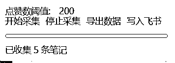

解决了这个老大难问题，简单好用，代码放在了后面，感兴趣的朋友，可以测试使用。我们还在不断的迭代更新，力争将AI+知识付费+团队，深度结合。不只是教学ai，自己也要是ai的体验官、深度用户。

# 一、采集器使用教程👇

*   今天我要给大家分享一个油猴插件里面非常好用的采集代码，可以采集作品链接，作者名称，作品点赞数，作品转发数，作品收藏数，作者粉丝数，作品发布时间，作者主页链接，可以一键保存到本地，也可以发送到飞书表格

## 1.油猴插件

*   我用的是tampermonkey插件，如果使用过油猴，可以直接看开发历程

*   安装很简单只需要在浏览器右上角找到三个点，点击，找到扩展

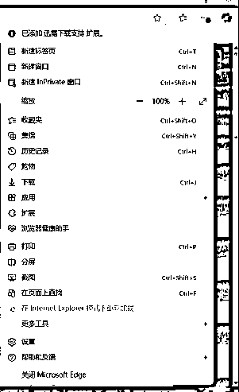

*   然后就可以去获取扩展了

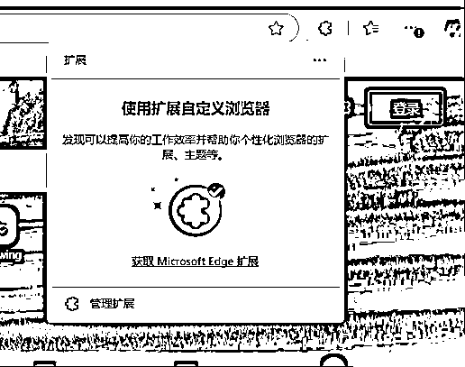

*   在里面搜索油猴或者篡改猴，就可以找到我们需要的插件了，点击后面的获取就可以使用了

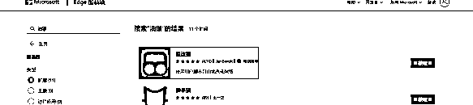

*   返回到浏览器初始界面就可以看到扩展了。

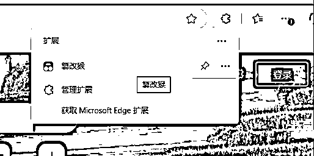

*   点击油猴，添加新脚本，就可以在里面加入脚本了。

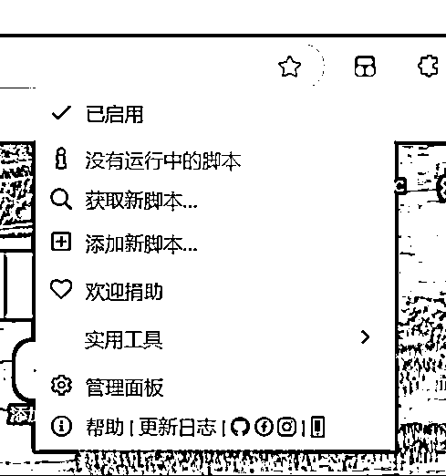

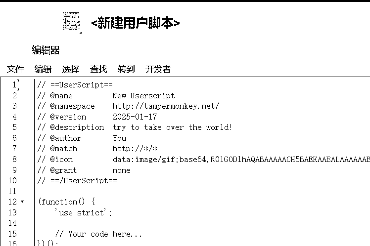

## 2.开发历程

#### （1）初始功能开发

*   我们最初只需要问gpt，告诉它，我想使用油猴采集小红书的信息，他就会直接给我们代码

*   然后再详细告诉他想要采集的具体信息

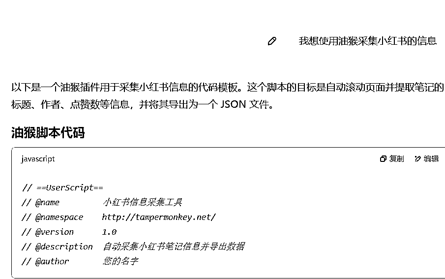

#### （2）功能逐步完善

*   因为小红书是滚动加载的，所以我们也要告诉gpt在代码里面加入滚动加载与数据动态采集

*   采集不同的信息需要不同的网址，我们可以直接把可能用到的网址全都告诉他，就是这样的效果

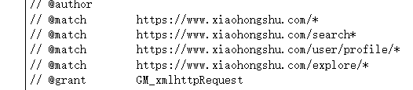

*   然后就是路径调整，因为最开始生成的代码，并不知道具体采集的路径，这时候需要我们在小红书页面按下F12。去把我们想要采集的HTML交给gpt，让它修改代码

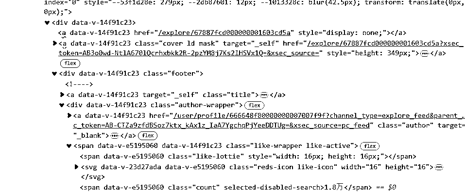

#### （3）进阶功能开发【仅限于在线同步使用，否则不需要】

*   接下来我们就可以在代码里面加入把数据导出为 Excel和发送到飞书多为表格的功能。注意代码里面的名称一定要和飞书的表头一样，顺序不重要。

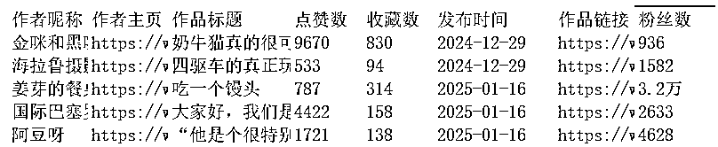

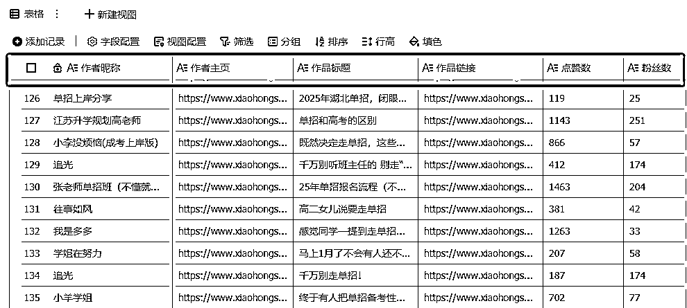

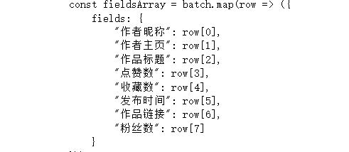

*   还要注意发送到飞书多维表格要更改的代码，这些都可以在飞书多维表格中找到，替换成自己的就可以

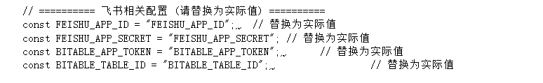

#### （4）用户体验优化

*   之后我们就可以在代码里面添加前端 UI 控制面板

*   开始/停止按钮

*   最大采集数与点赞数阈值设置

*   实时采集进度显示


#### （5）代码优化与扩展

*   到现在我们的代码就有了雏形，就可以把他不断地给该gpt，让它去不断的优化

## 3.简版代码【自取测试】

```
// ==UserScript==
// @name         小红书采集工具
// @namespace    http://tampermonkey.net/
// @version      1.0
// @description  采集并导出为Excel
// @author       您的名字
// @match        https://www.xiaohongshu.com/*
// @grant        none
// @require      https://cdnjs.cloudflare.com/ajax/libs/xlsx/0.16.9/xlsx.full.min.js
// ==/UserScript==

(function () {
    'use strict';

    // 全局变量
    let isRunning = false;
    let stopScrolling = false;
    let collectedData = [];
    let statusElement;

    // 工具函数
    function delay(ms) {
        return new Promise(resolve => setTimeout(resolve, ms));
    }

    function updateStatus(message) {
        if (statusElement) {
            statusElement.textContent = message;
        }
        console.log(`[Status] ${message}`);
    }

    // 采集数据函数
    function collectNoteInfo(note) {
        try {
            const author = note.querySelector('.name')?.innerText.trim() || "未知作者";
            const linkElement = note.querySelector('a.cover');
            const noteLink = linkElement ? `https://www.xiaohongshu.com${linkElement.getAttribute('href')}` : "无链接";
            const likeCountStr = note.querySelector('.like-wrapper .count')?.innerText.trim() || "0";
            const likeCount = parseInt(likeCountStr.replace(/[\D]/g, ""), 10) || 0;

            return { author, noteLink, likeCount };
        } catch (e) {
            console.error("[Collect] 收集笔记信息时出错", e);
            return null;
        }
    }

    async function scrollAndCollect() {
        const seenLinks = new Set();
        collectedData = [];

        updateStatus("开始滚动页面采集...");
        let attempts = 0;

        while (!stopScrolling && attempts < 100) {
            attempts++;
            window.scrollBy(0, window.innerHeight);
            await delay(1500);

            const notes = document.querySelectorAll('div[data-v-14f91c23]');
            notes.forEach(note => {
                const data = collectNoteInfo(note);
                if (data && !seenLinks.has(data.noteLink)) {
                    collectedData.push(data);
                    seenLinks.add(data.noteLink);
                }
            });

            updateStatus(`已采集 ${collectedData.length} 条数据`);
        }

        updateStatus("采集完成！");
    }

    function exportToExcel() {
        if (collectedData.length === 0) {
            updateStatus("无可导出的数据");
            return;
        }

        const headers = ["作者昵称", "作品链接", "点赞数"];
        const rows = collectedData.map(item => [item.author, item.noteLink, item.likeCount]);
        const worksheet = XLSX.utils.aoa_to_sheet([headers, ...rows]);
        const workbook = XLSX.utils.book_new();
        XLSX.utils.book_append_sheet(workbook, worksheet, "小红书数据");
        XLSX.writeFile(workbook, "小红书采集数据.xlsx");

        updateStatus("数据已导出为Excel");
    }

    // 创建 UI
    function createUI() {
        const container = document.createElement('div');
        container.style.cssText = `
            position: fixed;
            top: 20px;
            right: 20px;
            z-index: 9999;
            background: white;
            padding: 10px;
            border: 1px solid #ccc;
            border-radius: 5px;
            box-shadow: 0 0 10px rgba(0, 0, 0, 0.1);
            font-family: Arial, sans-serif;
        `;

        const startButton = document.createElement('button');
        startButton.textContent = '开始采集';
        startButton.style.marginRight = '10px';

        const stopButton = document.createElement('button');
        stopButton.textContent = '停止采集';
        stopButton.style.marginRight = '10px';

        const exportButton = document.createElement('button');
        exportButton.textContent = '导出Excel';

        statusElement = document.createElement('div');
        statusElement.style.marginTop = '10px';
        statusElement.textContent = '状态: 就绪';

        container.appendChild(startButton);
        container.appendChild(stopButton);
        container.appendChild(exportButton);
        container.appendChild(statusElement);
        document.body.appendChild(container);

        startButton.onclick = async () => {
            if (isRunning) return;
            isRunning = true;
            stopScrolling = false;
            await scrollAndCollect();
            isRunning = false;
        };

        stopButton.onclick = () => {
            stopScrolling = true;
            updateStatus("已请求停止采集");
        };

        exportButton.onclick = exportToExcel;
    }

    // 初始化
    createUI();
})();

```

# 二、chatGPT十分钟帮你改写爆款文案

有了高赞的数据，就可以准备改写成自己的文案内容

## 利用chatGPT进行仿写

chatGPT的文案能力非常强大，只要投喂它指令，它就可以帮你写出对应的爆款文案，

但前提是你输入的指令要精准、清晰。

在这里就不过多赘述了，给大家分享个用chatGPT写文案的口令，

大家可以自己尝试一下

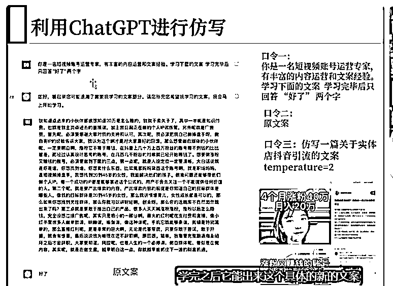

## 模仿自己的风格改写别人的文案

今天想给大家分享一个很好玩的写文案方法，我找了一段别人的文案，

让GPT用我的风格去改写别人的文案，如图：

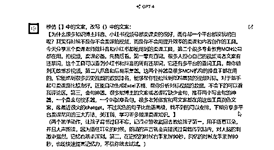

得到的结果特别给力，几乎完全模仿了我的短视频文案风格，不管是文案结构还是语言表达方式，都非常像。

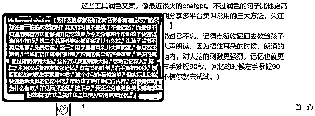

这就是借助AI工具的魅力，它的工作效率就是比人工高出一大截，

而且它不会像人一样有情绪，有拖延，或者其他复杂的因素。

# 三、矩阵打法引爆公域

有了工具的加持，3小时直接洗100个爆款短视频文案轻轻松松，

这时候就别一个号慢悠悠地搞了，直接矩阵搞起，引爆公域。

我和我的团队最近刚起了一波矩阵号，大家可以看一下，我在公域平台的账号可太多了，每天进量又会增加不少。

关于矩阵打法，也有很多需要注意的细节，篇幅有限就不展开讲了，感兴趣的老师可以私下交流。

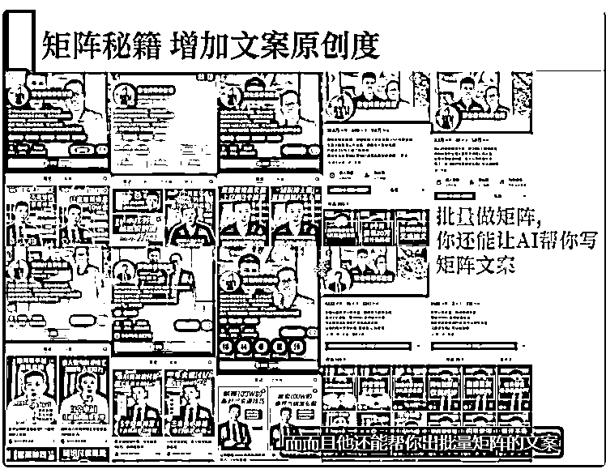

# 四、几个避坑指南

在本次分享的最后，想给各位老师分享几个核心避坑指南，这些都是根据我的亲身经历总结得出的宝贵财富。

## 避坑1：无爆款结构，无稳定流量

长期持续引爆公域的核心，就是要找到一套能够批量起号的爆款文案结构。

爆过的选题和结构，一定会反复成为爆款，这一点一定要无比坚信。

为什么我们团队矩阵起的快，没有那么多复杂的逻辑，

原因很简单，我们的文案结构是固定的。

我们先让AI去学习爆款结构，让它帮我稳定输出爆款文案内容，批量发到矩阵号上。

这个方法的效率和产出比无疑是最高的，而且带来的流量也是稳定且精准的。

团队负责私域的小伙伴每天只要安心负责接量和转化就好了，完成业绩也毫无压力。

知识博主的爆款一定是重复的，只是你不知道爆款的结构而已。

不断地重复，稳定地产出爆款，你才会有更多的流量进来，稳定变现。

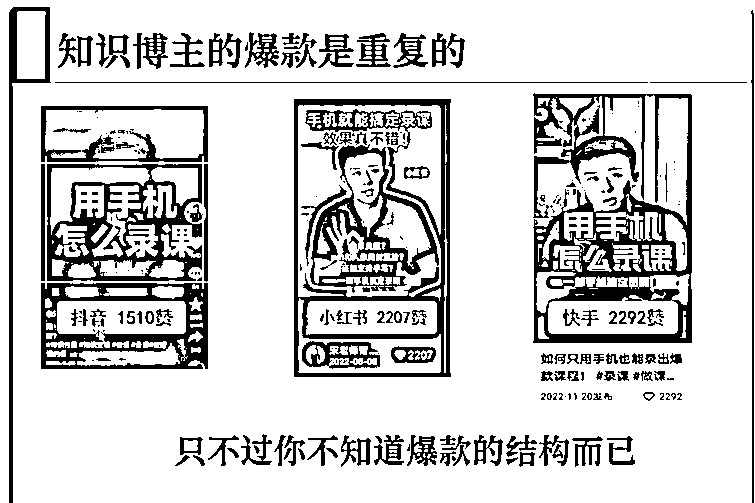

## 避坑2：不要追求流量的繁荣

很多知识付费老师最大的误区就是，我要流量，我要数据，我要蹭热点。

但由此带来的结果就是，数据很好看，流量很生猛，但没有精准用户，变现非常困难。

一个很重要的底层逻辑：

不要追求流量的繁荣，流量只是虚假的繁荣。

要多追求买课的咨询，这是决定你能不能变现的关键。

我现在单条300赞的视频，后台加微信咨询课程的人数大概有差不多100人，

核心就是我的短视频文案里面有钩子，用户根据我的钩子就来找到我，

这能让我非常高效且轻松地卖课变现，因为来的都是精准用户。

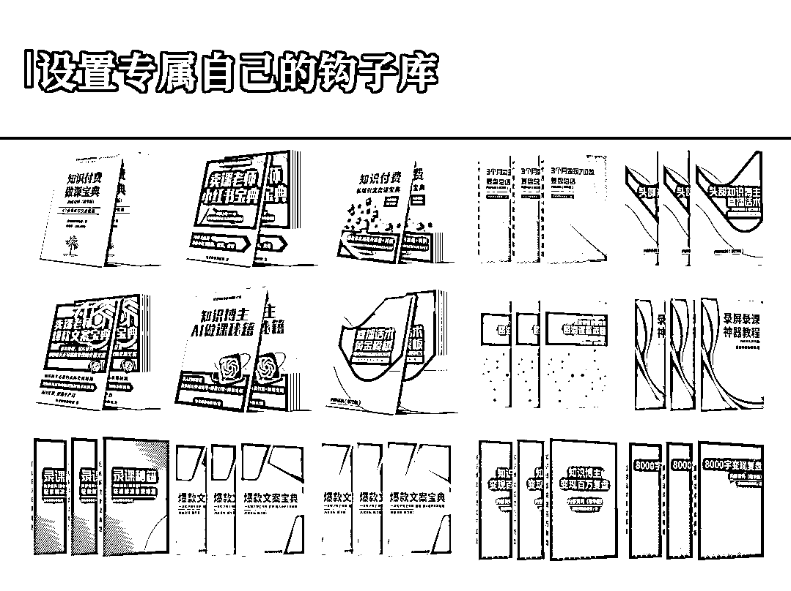

## 避坑3：写文案，能用公式，不用人工

新手上路总是盲目自信，总想着我一定要原创，要输出自己的观点，自己的内容。

这种盲目自信带来的后果就是——没有流量，非常打击自信。

时间久了你就会自我怀疑，自然也就拍不下去短视频了。

和大家说一个扎心的事实：90%的原创知识博主，最后都是死路一条，基本都是烂尾。

写文案都是套公式的，尤其是爆款文案，而且越套公式效果越好。

我常说的一句话是：直播卖课是瀑布，短视频卖课是小河，细水长流。

好的短视频文案是能帮你自动卖课的，我们团队经常靠短视频一天卖课过万，甚至过3万。

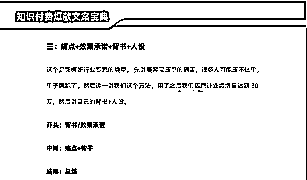

短视频的核心在于文案，你只要借助AI工具，找到爆款选题，

严格按照爆款文案的公式去用工具改写，不愁写不出来。

分享给大家几十个爆款短视频的文案公式，可以安排

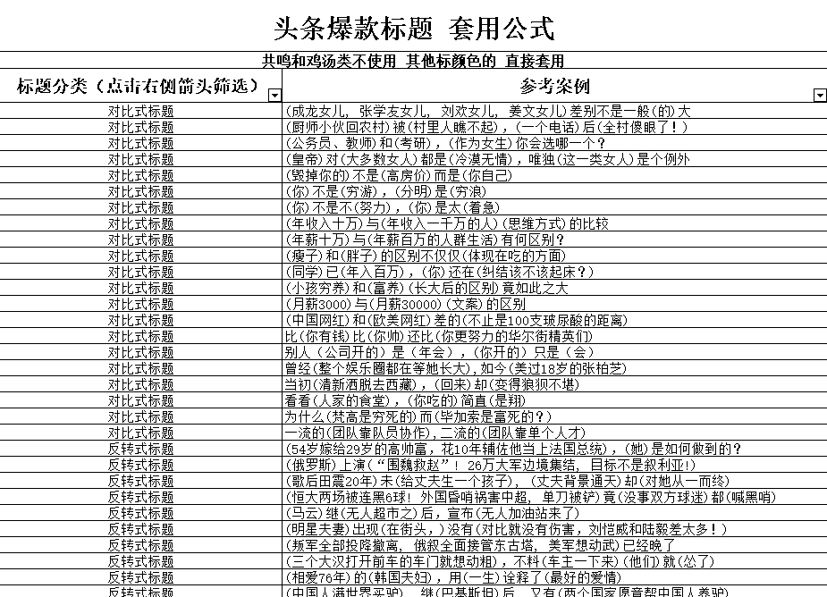

# 写在最后

今天要分享的内容就这么多，无论你是新手知识博主，还是已经在知识付费领域拿到过大结果，

在写短视频文案这件事上，能借助工具快速高效解决的事情，千万不要花太多时间和精力。

学会借势借力，科学使用工具，和时间抢跑，比勤奋努力更重要。

希望大家都能不用直播，仅靠短视频就能变现百万，大家有任何做课卖课相关问题，欢迎随时与我交流讨论。

往期精华帖：

《用【钩子打法】1年引流30000私域粉，卖课300w是什么体验！（附钩子制作全流程）》

《30天私域卖课60w是什么样的体验？》

《用Chatgpt 7天做了一套课，单月卖了1300单（变现52w）》