# 闲鱼卖泛IP周边 | 实战手册

> 来源：[https://shengcaiyoushu01.feishu.cn/docx/ELrJdUeKFoEPRqxz4KJcCrStnRf](https://shengcaiyoushu01.feishu.cn/docx/ELrJdUeKFoEPRqxz4KJcCrStnRf)

内容出品人：维拉

手册出品方：生财有术团队

出品时间：2025 年 1 月 21 日

建议：如果需要快速定位到精确内容，可以使用快捷键 Ctrl + F/command + F 的形式，搜索「关键字/词」，查找你想要的内容

# 一、项目概述

## 1.1 闲鱼卖泛IP周边项目的介绍和机会趋势

闲鱼泛IP周边项目，是指在闲鱼售卖动漫、动画、小说、游戏等知名虚拟形象的周边产品。

随着文化产业的蓬勃发展，各类 IP（知识产权）在市场上拥有极高的热度和广泛的粉丝群体。从热门动漫、影视、游戏到知名品牌等，其衍生的周边产品深受消费者喜爱。

闲鱼作为一个拥有庞大用户流量的二手交易平台，为泛 IP 周边的销售提供了便捷且低成本的渠道。许多限量发售或者是已经绝版的周边产品在市场绝迹或是价格高昂，二手周边便成为他们的选择之一，这也催生了在闲鱼售卖泛 IP 周边的商机。

## 1.2 收益情况和适合人群

收益情况：

这个项目收益几百-上千都有，收入上限取决于选品和货源，且客户多为对产品IP多少有点了解基础，沟通成本相对会低一点。

如果每天能花2-3个小时，按要求上架3-5个商品链接 ，目前维拉测出来的收入在200-300元/月/账号。如果有时间和货源，可以做多个账号，收益会更高。

可能适合人群：

1、IP 爱好者：本身对各类 IP 有深入了解和浓厚兴趣，熟悉热门 IP 的热门周边产品，能够精准把握粉丝喜好，凭借自身的热爱和知识储备，在收集和销售周边时更具优势，同时还能满足自己的收藏欲，将兴趣转化为收益。

2、有闲置物品出售意愿者：手中拥有大量因各种原因闲置的泛 IP 周边，如冲动消费后的囤积、活动赠品等，通过闲鱼平台可以清理闲置物品，回笼资金，实现物品价值最大化，且无需额外投入过多成本采购商品。

3、时间灵活的兼职者：如学生、自由职业者，有正业工作的人等，他们可以利用碎片化时间进行商品上架、客户沟通、发货等操作，能够灵活安排工作时间，在不影响主业或学业的前提下，通过运营闲鱼店铺赚取额外收入，还可以锻炼自己的商业运营和沟通能力。

## 1.3 项目怎么做

注册闲鱼账号（前期可以不开鱼小铺，先做），然后去各个渠道（比如拼多多，1688、品牌官方渠道和代理商）找品，选品上架，发货处理售前售后。这个项目最重要是货源、选品。

可以做无货源模式，出单了找拼多多/1688这些平台代发。具体实操内容会在下方第3章具体展开。

（注：鱼小铺需要系统自动邀请开通，无法主动开通，目前来说一般发布50条内容以上，结合评价这些综合因素去判断，官方认为你满足条件，会出现开通邀请页面）

## 1.4 项目案例

圈友维拉分享：

一开始看到一些可爱的周边觉得自己很喜欢，从自身是消费者的角度来说，也非常愿意支付不是很高昂但是有非常大情绪价值的物品，

而且在日常生活中也看到不仅是女生，很多男生的包包上也开始挂上了毛绒挂件，以及动漫周边、明星周边甚至是MBTI类的挂件，loopy和线条小狗的快闪店也非常多的人，发觉到这个可能是个市场，就利用闲鱼平台开始尝试。

闲鱼平台相比较于小红书之类的平台来说，门槛低，平台的限制也比较少，我又开始看闲鱼平台上的类似产品，发现这个市场类型非常多，也有一定的消费群体，就开始着手操作。

过程中发现今年又是KITTY这个IP的50周年庆，引起了一股热潮。2个月的时间，销售额在500左右，但是基本不用花太多维护时间，就是选品上架发货，客户的决策成本也不高，一般下单比较爽快，直拍的比较多，比较省心。

# 二、店铺准备

## 2.1 基建准备

*   准备好一台手机（一卡一机一号）

*   下载闲鱼，注册闲鱼账号

*   一个正常使用的支付宝账号，用于注册闲鱼账号，注册完属于个人商家，可以直接卖东西

*   注册方式：下载闲鱼app，选择支付宝/淘宝账号登录，就可以使用买卖东西了。

## 2.2 闲鱼 APP 的权限设置

以下以安卓手机举例，苹果手机可按照提示进行即可。

1\. 允许查看我的关注，粉丝列表

打开闲鱼APP，点击右下角“我的”，右上角“设置”往下拉有个隐私设置。建议这里拉成灰色即可，保护自己的客户资源。

2\. 允许查看我的动态范围

同样在隐私设置里，建议选择不可见，顾客查询不到自己的上货动态，销售状态，同时也预防同行查看自己的爆款产品。

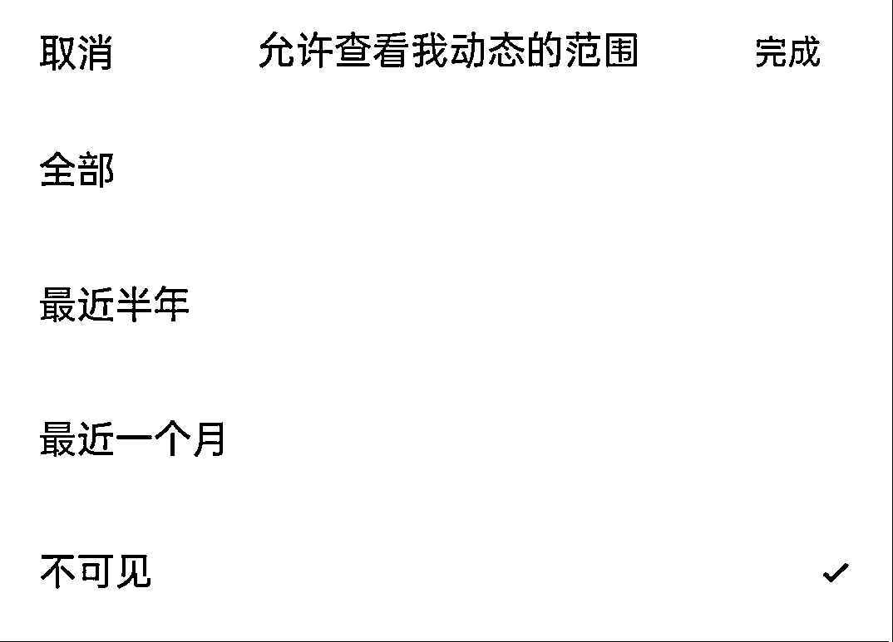

3\. 开启闲鱼消息通知

很重要，务必打开，前期消息务必及时回复。

路径：我的 -> 设置 -> 消息通知 -> 打开闲鱼消息通知

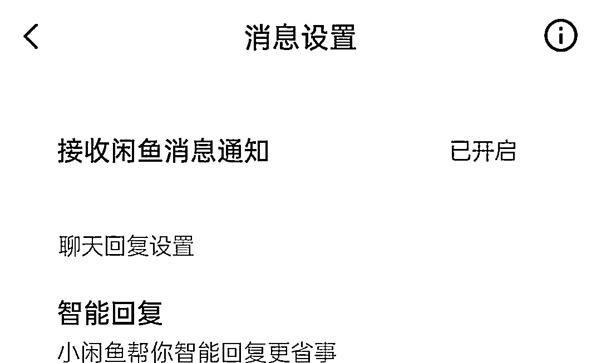

4\. 手机设置闲鱼消息的专属通知

打开手机设置 -> 通知与状态栏 -> 应用通知设置 -> 点击闲鱼软件图标 -> 打开允许通知 -> 在消息通知里设置闲鱼APP的专属铃声以及其他重要的设置，如：免打扰时允许通知提醒等。

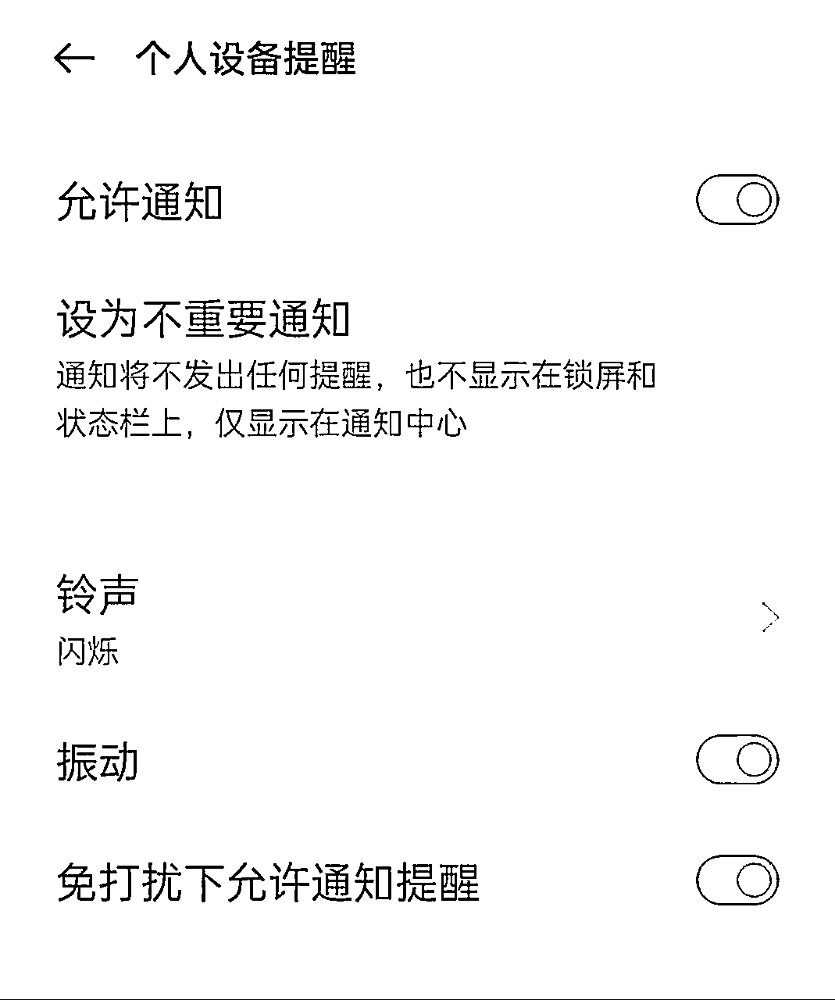

## 2.3 闲鱼账号完善

路径：我的 -> 设置 -> 个人资料

这里要完善信息百分之八九十以上，能填写的建议都填写下。具体步骤如下：

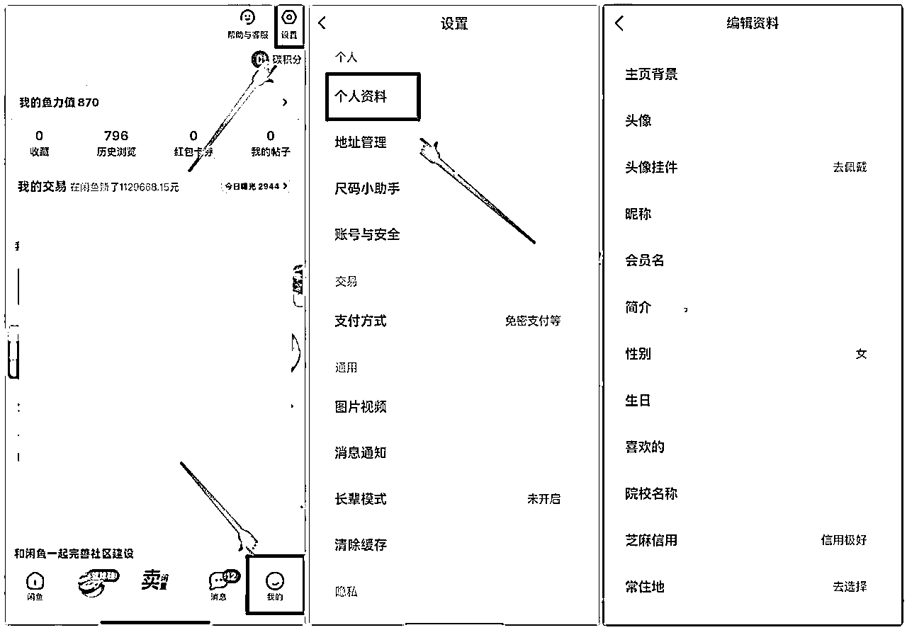

1.主页背景

杂货铺对于背景图没有过多的要求，可不更改或者自己喜欢的正能量的话。

2.头像

建议女性头像为主，经过测试，女性头像更容易出单。

3.昵称

用女性化的名字或者根据店铺的属性去设置名字，比如：某某小铺，某某厂家，不做过多的要求。

注意：如果暂时没有找到想做的垂直赛道的话，就不用着急改名字，因为闲鱼的名字 30 天内只能改一次。

4.简介

简介这里可以是自己的经营理念，也可以是对店铺的介绍。

比如：

怀旧动漫收藏家|玩具满xx包~售出不退不换

重度kitty或XXX控，祝我的客人天天开心，天天发财 等等

下方是一些参考：

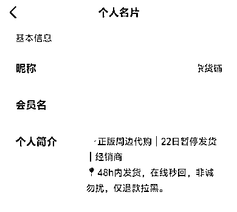

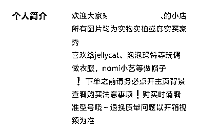

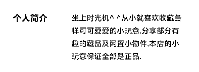

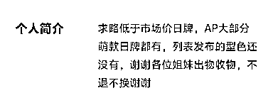

店铺准备内容来源：

【闲鱼蓝海】航海手册——项目准备工作章节

# 三、选品并找货源（重点）

## 3.1 做的类目推荐

1.  模玩手办类（适合专业玩家+有独家货源）

- 热门动漫模玩，动漫的人物模型、景品手办、黏土人等。

- 特摄英雄模玩：奥特曼、假面骑士系列的可动人偶、变身道具、怪兽模型等深受特摄迷喜爱。

- 机甲模型：高达系列模型一直有庞大的爱好者群体，还有国产的摩动核等机甲品牌周边。

1.  卡牌类（适合专业玩家，对产品的了解程度高，主要为限量和稀有卡面）

- 宝可梦卡牌：宝可梦与梵高博物馆联名的卡牌曾在闲鱼上引发抢购热潮，此外，宝可梦集换式卡牌简中版等也有很高的人气。

- 航海王卡牌：《航海王》的收藏卡牌、二创卡牌等，以其精美的画面和丰富的角色吸引了众多粉丝。

- 小马宝莉卡牌：包含小马宝莉卡位自助、趣影包、收藏卡牌等多种类型，在闲鱼上销量可观。

1.  玩偶毛绒类（市场需求量大，门槛相对较低）

-热门游戏玩偶：比如《蛋仔派对》的咸鱼棒公仔、蛋仔毛绒玩偶，形象可爱，深受玩家喜爱。

-动漫角色毛绒：线条小狗、小刘鸭、HelloKitty、三丽鸥等动漫IP的毛绒玩具，柔软可爱，受众广泛。

-BJD及棉花娃娃：BJD玩偶如三万院长swdoll、DollZone等品牌的产品，棉花娃娃如MINIDOLL、棉花星球等店铺的商品，在闲鱼上也有稳定的交易。

大家根据自己的兴趣，货源来选择自己想做的类目。

## 3.2 选品和找货源

### 3.2.1 选品思路

*   兴趣导向：选自己熟悉热爱的IP周边，如资深漫威粉可选漫威手办、海报等；或依据日常接触多的IP选品，像常玩《阴阳师》，可选式神玩偶、符咒等周边。

*   热度趋势：关注当下流行文化，小说动漫热剧《天官赐福》热播时，可选剧中相关挂件、徽章、立牌等周边。

*   市场稀缺性：挖掘小众但有忠实粉丝群的IP周边，如小众独立游戏的限量版原声音乐集；寻找绝版或限量发售的周边，如特定年份的迪士尼限量徽章，三丽鸥公仔这类周边收藏价值高，易吸引买家。

选品关注点：

1. 热门IP优先

参考动漫、影视、游戏的热度排行榜。例如，热门动漫《咒术回战》，可以选择售卖主角团的徽章、玩偶等周边。像《王者荣耀》这样的热门游戏，英雄手办、皮肤周边很受欢迎。

关注大型展会，如ChinaJoy、Comiket等展会推出的限定周边，这些周边因为稀有性，往往很有市场。

HelloKitty50周年，全球范围内重新掀起公仔、挂件，中古周边产品的热潮。

2. 考虑价格区间

可以有一些价格较低的小周边，如钥匙扣、贴纸，这些适合价格敏感型消费者。

也搭配部分中高价位的周边，像限量版手办、签名海报，用于吸引追求品质和收藏价值的买家。

3. 受众需求导向

观察社交媒体平台的讨论热点。如果某个IP的粉丝经常讨论想要某个角色的特定周边，就可以考虑上架销售。

针对不同节日或活动，选择合适的周边。比如情人节期间，售卖情侣主题的IP周边，像迪士尼情侣玩偶。

4. 关注周边品质

优先选择做工精细、材质好的周边。比如手办的涂装是否均匀、玩偶的面料是否舒适。

品牌周边通常质量更有保障，像万代的高达模型，选这类产品能减少售后问题。

举例分享：

迪士尼的IP都比较火，除了官方的的周边外，如果你有技能或者是找到合适的供应商，就可以做自研周边的售卖，下面这个店，就是店主会钩织技术，又喜欢迪斯尼的一个形象，就专门做手机壳，手表的周边定制，十个月的时间卖掉了300多个，平均一天一个，不过这个也是由于这个是手工制作，制作需要时间产能比较低。

按照这个思路可以扩展很多，比如用AI制作 IP的手机壁纸，电脑壁纸等，手绘画，也可以做定制化的物品等。这也是为什么我们说是泛周边，而不是那种官方周边之类的，因为可以自己制作，发散范围比较广。

### 3.2.2 货源渠道

1、二手交易平台

闲鱼自身平台：在闲鱼上可以找到个人卖家转让的泛IP周边。有些卖家可能是因为重复购买、退坑等原因低价出售，你可以以合适的价格收购，经过整理后再次售卖，这类比较考验卖家对产品的了解程度，也可能会涉及到需要垫资先行购买，玩的比较溜的可以直接上架，有人咨询或者有意向后直接下单购买寄到你的客户处，免去了压货和邮费的成本。

转转等其他二手平台：和闲鱼类似，转转上也有大量的二手泛IP周边，商品种类可能会有所不同，可以作为补充货源渠道，从中挑选品相好、有市场潜力的商品。

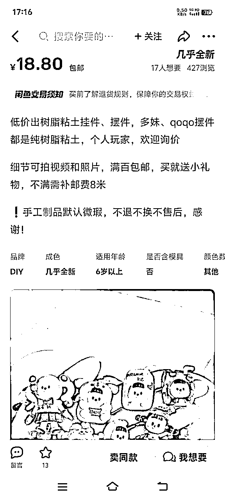

2、批发网站

1688：有许多商家提供动漫手办、卡牌、玩偶等泛IP周边的批发服务。可以通过筛选诚信通商家、查看用户评价等方式，找到质量可靠、价格合理的货源。不过要注意版权问题，避免侵权商品，尤其是迪士尼的产品，地表最强法务。

拼多多：拼多多上有很多无版权的实用周边产品，在日常实用物品上印刷IP图案等，有些是授权合作的产品，相对来说价格实惠，直接挂到闲鱼售卖，代发下单。

做代发的时候，尽量选择1688实力商家、严选，看下是不是真的厂家，1688现在也有很多二道贩子

拼多多的品，看销量，看最近评论以及差评多不多，差评都是为什么

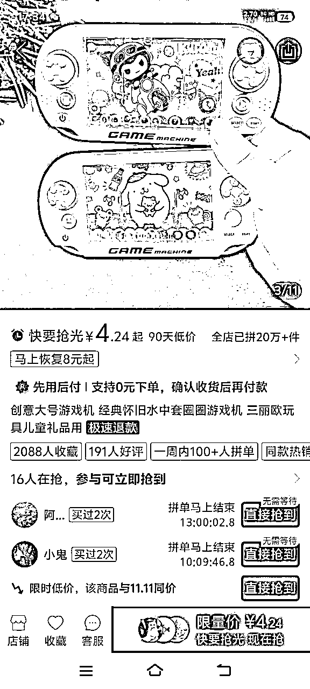

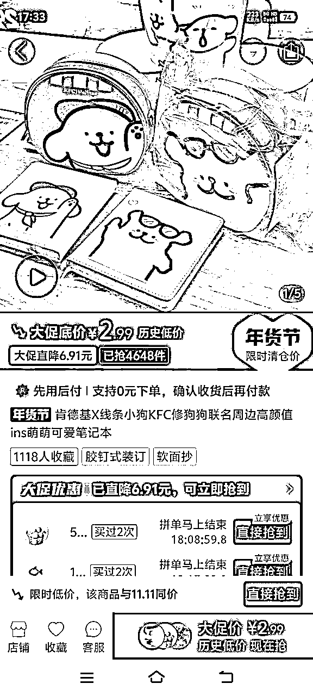

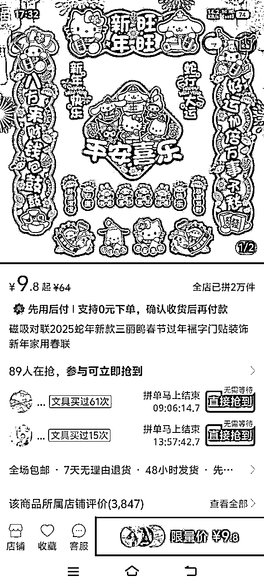

3、品牌官方渠道和代理商

官方网站和旗舰店：对于有官方授权的IP周边，直接从官方渠道进货可以保证商品的正品性。例如，迪士尼官方旗舰店会出售正版的迪士尼玩偶、徽章等周边，万代官方店有正版的高达模型等。这类可以做代购的模式，直接明码标价，加代购费售卖。

代理商：部分品牌会有代理商负责产品的销售和分销。通过联系这些代理商，可以获得批发价格的商品，同时也能确保商品的质量和版权合法性。1688上也会有品牌的一些代理商可以寻找。

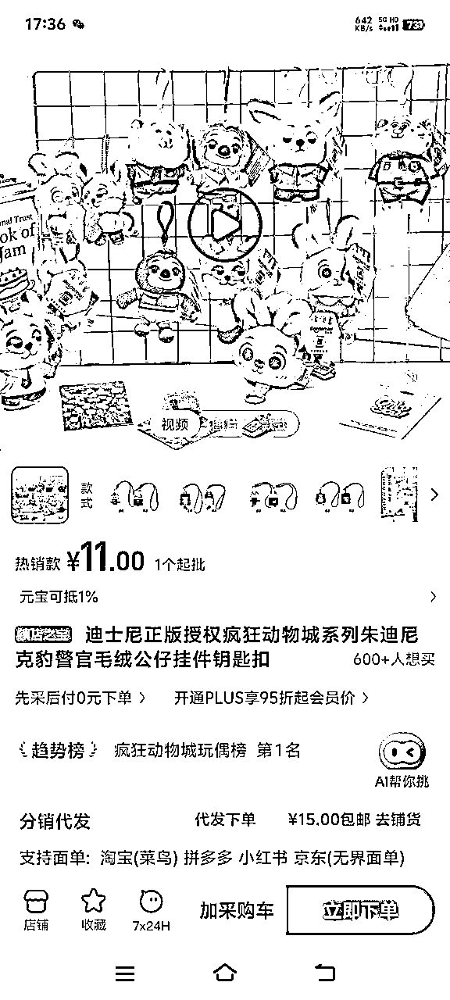

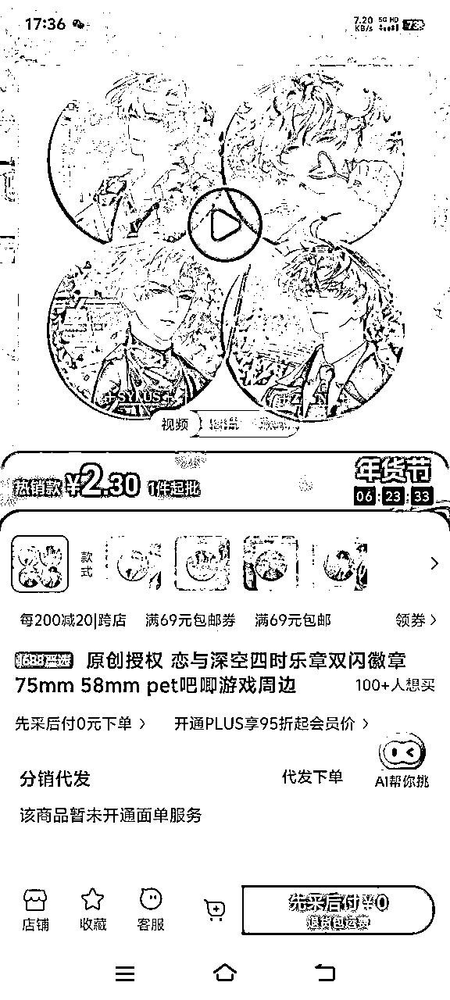

4、线下渠道

动漫展会：动漫展会现场，有众多的摊位售卖各种IP周边，包括限量版和独家商品。你可以和摊主协商批发价格，获取特色货源。

实体店清仓：一些实体的动漫周边店、玩具店可能会因为转行、换季等原因清仓处理商品。这时可以以较低的价格收购库存，将这些商品放在闲鱼上销售。

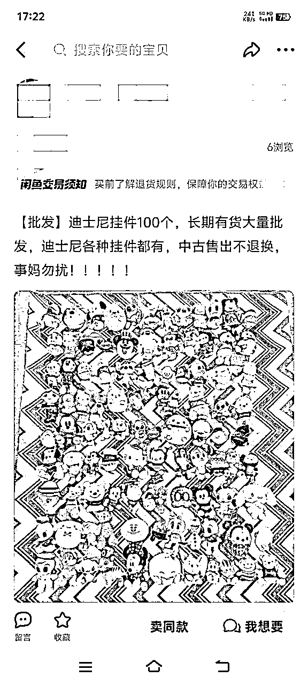

这种方式不太容易找，可以多关注，有时候闲鱼也会有，但是这种都需要垫资囤货，请谨慎再谨慎再谨慎！

比如上图这个，虽然是打着批发的旗号，但是要多注意评论和看下账号的情况，以及判断下这家手里的货是否卖的出去。

在没有较大的确定性需求的时候，不要囤货！不要囤货！不要囤货！

（囤货买不出去，会导致自己心态有波动）

## 3.3 商品上架流程

1、拼多多一件代发的，在评论区找清晰的实拍图，尽量凑齐9图，正常发布即可，关键词和引流词写到标题。

2、如果是拿实物囤货的就实拍图片，正常上架。

3、没有开通鱼小铺之前，已经卖掉的商品要及时重新上架，开通了鱼小铺之后就可以设置商品数量，商品不会因为卖掉就下架。

关于上架主图、标题制作，可以看【闲鱼蓝海】航海手册 上架部分

# 四、出单发货及售后

## 4.1 销售话术

*   客户咨询的问题，热情耐心欢迎，自己不能回答的的问题就直接复制去问商家，拿到回复再给客户回复。

*   如果客户是介意价格的时候就突出下物品的价值感，尤其是正版商品价格都会偏高一点，在保证物品质量的情况下，让客户认识到，闲鱼能购买的价格已经优惠很多

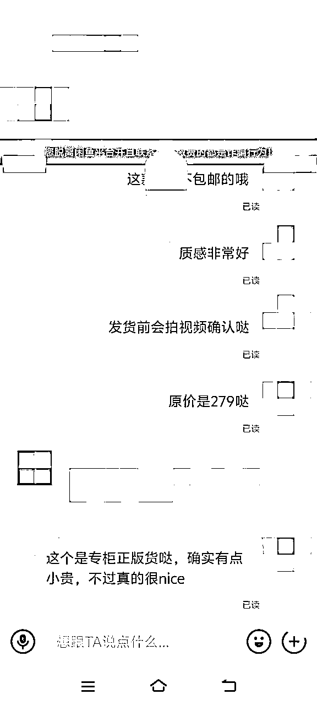

## 4.2 发货流程

闲鱼客户下单后操作：

1、把闲鱼上的买家地址复制，然后到拼多多或者1688拍下，地址改成买家地址，电话号码改成自己的号码，跟客服说要无痕发货，不要放好评返现卡之类的（在找货源的时候就可以了解下能不能做无痕发货）。

2、在闲鱼上立即重新上架商品，此时的推流会变大

3、拼多多或者1688的商家发货后，直接把快递单号复制到闲鱼上（注意是快递物流单号，不是订单编号）。闲鱼客户就能看到物流和取件码，如果闲鱼没有显示取件码的，去拼多多的商家物流看下后可以发给客户，提醒客户别忘记去取快递，一方面解决了客户看不到取件码的问题，另外一方面让客户感受到你的热情服务

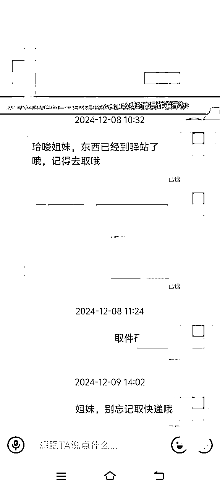

## 4.3 售后话术

可以参考【闲鱼蓝海】航海手册-售后内容

售后分很多种情况，针对遇到的情况去处理即可，无论哪种售后，我们的定位就是：中间人，将客户反应的问题，反映给相应的商家即可！

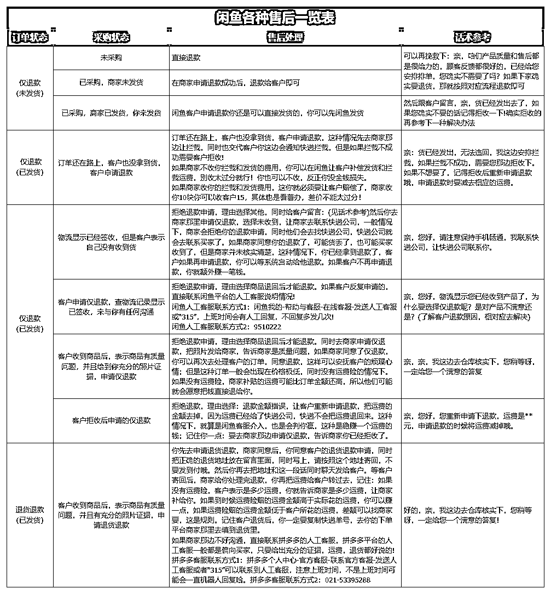

如果遇到物流方面之类的服务类问题，同时去供应商处了解发货情况，同时对客户进行安抚，遇到很态度强硬的就直接退货，因为这种很大概率收到货了还会有矛盾。

案例分享

这个客户在下单的时候就很着急发货的（多久能发货需要提前跟客户沟通下，有些特别着急的不能做到立马就发的可以婉拒，因为如果耽误事了，客户会把情绪发泄到你身上给差评得不偿失），然后物流停了2天没有更新，就及时去核实下物流是平台没更新还是真的没动，然后主动给客户一个合理的理由：比如爆仓了，比如天气问题之类的，客户如果不是真的有事着急一般都还是可以接受的

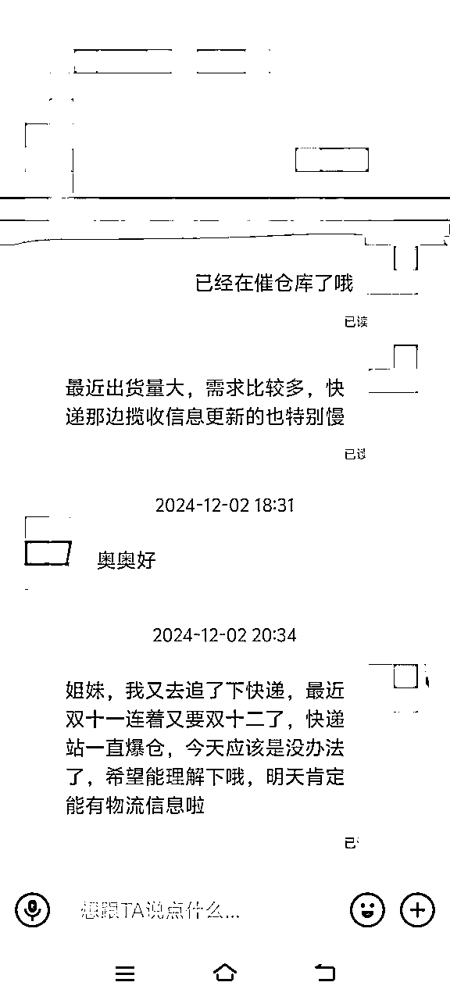

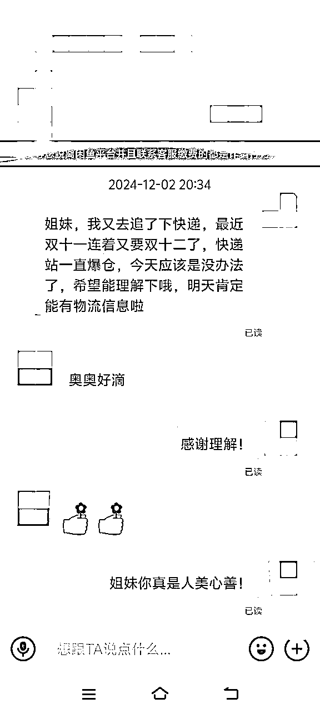

# 五、店铺日常运营和上新节奏

1、保持每天上新3个新品，个人账号可以上50个商品，平台邀请开通鱼小铺之后可以上架500个商品。

2、上架商品达到上限后，曝光很低的商品、没人咨询的商品下架，换新的品。

3、每天都做下闲鱼任务，比如闲鱼币之类的，让平台觉得你是活跃账户，而且闲鱼币能增加曝光，目前闲鱼增加曝光是不收费的，都是通过闲鱼币中的急速卖功能推广，另外商品设置闲鱼币抵扣也会增加一些平台的推流，类似淘金币的功能，能给商品做少量的抵扣和优惠。

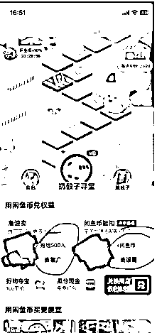

4、每天碎片时间在拼夕夕和闲鱼上刷品，按照第三点的选品的逻辑筛选品和上架。

# 六、项目常见问题分析/复盘

## 6.1 常见类问题：

1、是否是正品：这个建议说实话，不是正品授权的就不要硬说是正品，不然一定会差评的，考虑到客户的群体的特质，如果是要便宜+颜值的客户，就不会太在乎是不是正品，这时候就突出价格和颜值即可，如果是客户一上来就要问正品的话，不要想着糊弄过关，最后会给你差评和退款退货之类的，交流中感受下客户的需求点。

2、什么时候发货：这个以前跟供应商了解好，客户问如实说，有些人比如要着急送人，或者马上就要使用的，如果不能立马发货，客户的售后也会比较麻烦。

3、能不能便宜点：结合下成本和销售的情况，比如你是囤货的，那就尽量以卖出去为主，利润可以少一点，或者说以保本为主；如果客户问的很多又大砍刀，大概率不是个优质客户，以及不是我们的目标客户，可以适当的放过，不是每个来咨询的客户都会成交。

4、有没有瑕疵：如果是全新商品，可以直接在详情页写下不包官瑕，因为生产出来的东西我们如果也没拆的话不能保证到100%完全没问题，但是一般官方有品控质检，真的有大问题的是少数；如果是二手物品或者是自己囤货的，在发货前尽量拍视频给客户确认下，减少后期问题。

## 6.2 复盘

1、多看闲鱼上的潮玩、手办类的链接，学习举一反三

2、如果坚持做这个赛道，要不断地积极开拓新的货源和渠道，如果能拿到独家货源或者是成本非常有竞争力的货源是非常有优势的。

以上就是全部内容啦，这个项目实操门槛比较低，对泛Ip内容感兴趣，可以深入学习和尝试一下。

