# DeepseekR1本地部署超详细指南，解决 Ollama 卡顿，GPU 模式轻松上手

> 来源：[https://tue99hylfd.feishu.cn/docx/ElgYdULtooxDeYxnExmcJTmDnwh](https://tue99hylfd.feishu.cn/docx/ElgYdULtooxDeYxnExmcJTmDnwh)

## 一、本篇背景

之前有同学遇到这个问题：本地部署ollama来跑deepseek，但是从后台看CPU利用率百分百而GPU（即显卡）利用率不足1%，且本地输出的deepseek输出较慢，一段对话一个字一个字蹦，没有完全利用好本地的显卡资源。本篇基于这个情况给出从CPU切换GPU的解决方案，同时对于需要本地使用Deepseek的同学给出Ollama的部署教程。（两篇教程合并到一篇写了）

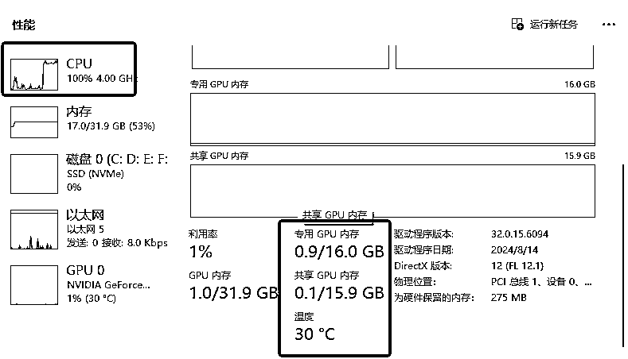

注意：本篇对于非程序员群体算进阶教程，过程不复杂，需要耐心照着教程走即可实现，但要求电脑为N卡配置，且内存够用能跑本地AI，教程参考前请先确认自己的电脑配置情况，优先确认自己的显卡是否在ollama支持的列表内（见下图），支持才能用GPU算力资源（本人电脑配置为AI电脑的基础配置：显卡NVIDIA 4060ti 16g+CPU intel i5-12400F+32g运存+2t固态内存用来放各类模型工具，跑SD/comfyUI/本地大模型8b及以下均流畅 ）

指路：看ollama部署跳到第三步，需要切GPU跳第四步，新手可按顺序阅读。

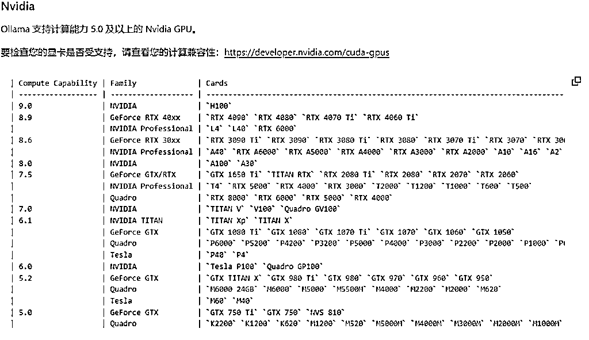

## 二、相关问题解答

为什么要做本地部署？

*   一个是可以减少和绕过审核，保证完全的本地服务，不会泄密，同时也不用经历平台接口的内容已经输出一大半但又因为审核问题回吐的在线使用情况。

*   第二个是可以用本地部署+本地知识库的方式对自己本地的内容做AI化管理，构建自己的第二大脑，J人必备，且完全隐私可控，数据不会被用于平台模型训练。

本地部署的优缺点

*   好处：不联网

*   坏处：不联网

如何判断自己要不要用到本地部署？

*   需要：和AI提问一直被ban不合规；想要做本地知识库（日记/私人记录AI化/和过去的自己对话）

*   不需要：联网收集资料；需要满血版的使用体验；提问与交互都非常符合核心价值观

*   大部分时候联网使用各家APP开放的deepseek基本能够满足需求，本地部署其实除了特殊场景必要性不大，本篇教程仅作参考

## 三、如何使用ollama搭建本地模型

三步走：

*   下载ollama

*   下载模型到本地

*   对话框使用

第一步：官网下载ollama

*   地址：https://ollama.com/

*   功能：ollama只是一个软件，功能是平台有很多现在流行的本地模型，帮助你只需要一个指令就下载平台上最新的模型并使用它，不友好的点是：没有使用界面，所有操作指令都执行在cmd黑色的对话框中

1.操作：点击页面“Download”按钮。根据自己的操作系统选择下载版本，例如Windows系统，下载“OllamaSetup.exe”文件到本地盘（不要放C）

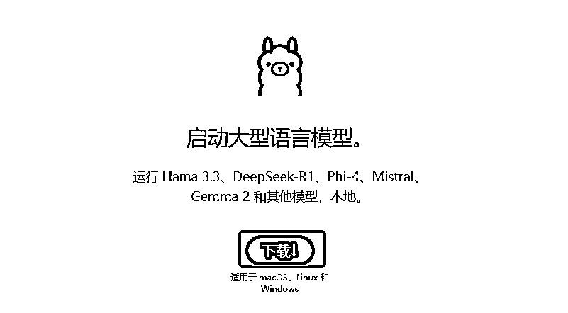

2.安装到本地：下载完成后，双击“OllamaSetup.exe”文件开始安装。点击“Install”开始安装过程，按照提示完成安装。

3.打开cmd对话框：按住电脑快捷键win+R，弹窗输入【cmd】然后回车，打开的黑色页面为【命令提示符】页面，我们所有操作都在这个黑色页面执行

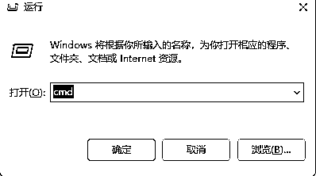

4.验证是否安装成功：在“命令提示符”中输入“ollama”，按回车键，如果看到相关输出，说明Ollama已正确安装。

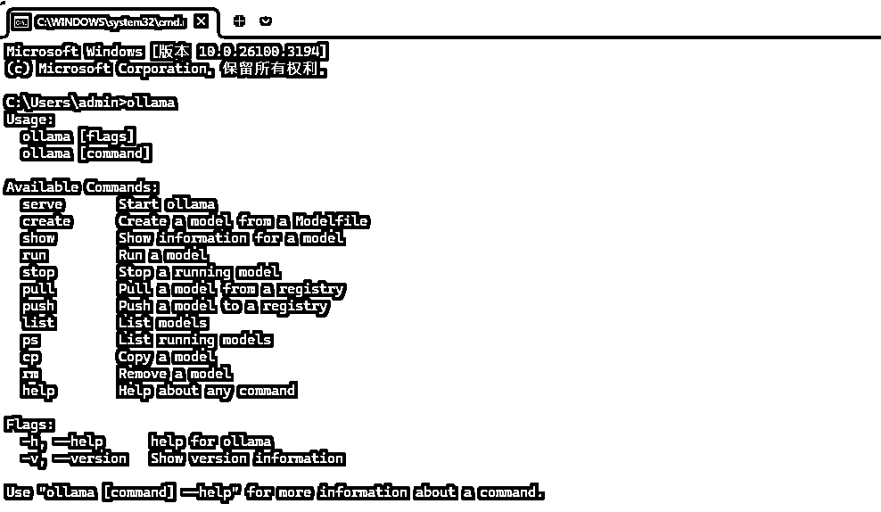

第二步：装模型进来到ollama里面

打开ollama官网，找到一个可以用的模型（这里拿deepseekr1最小的蒸馏模型1.5b举例，看自己电脑配置，b前面 的数字*2就是你运存最大能运行的模型大小，比如我的运存为16g，那么7B模型是可以本地跑的：7*2=14<16）

1.点击官网左上角的models

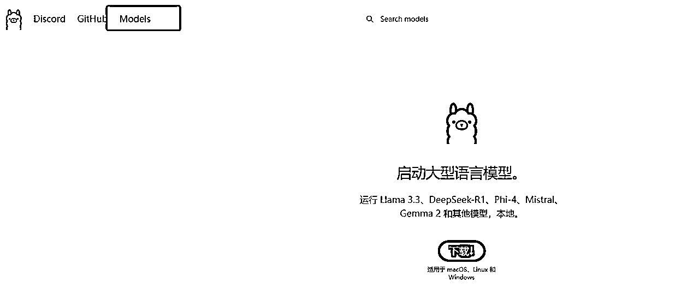

2.点击DeepseekR1进入模型选择界面

3.选模型：默认给的是7b，下拉框选择1.5b的版本，然后复制右边的下载代码

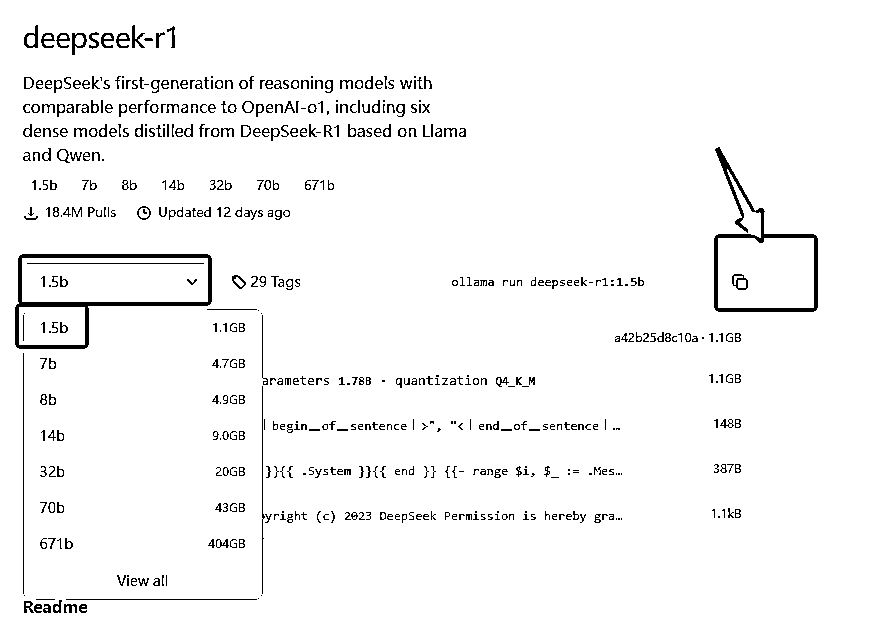

4.回到黑色框里面，粘贴这个代码敲回车，出现最下面的下载进度条，就说明模型从ollama官网下载下来了，等待下载完成

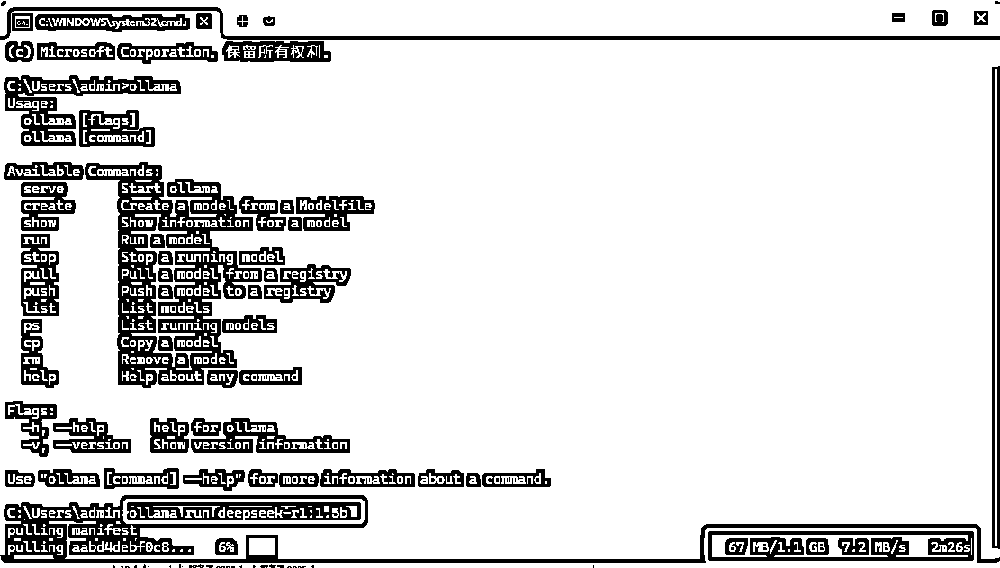

5.下载完成后，刚刚复制的代码，重新贴进去，等待一会就可以直接在框内和模型对话了

6.常见的一些操作名称（不记得就输入ollama，表里会给常用的操作指令）

*   ollama run deepseek-r1:1.5b #跑对应模型并对话

*   Ollama list #显示你下的所有模型，以及日期

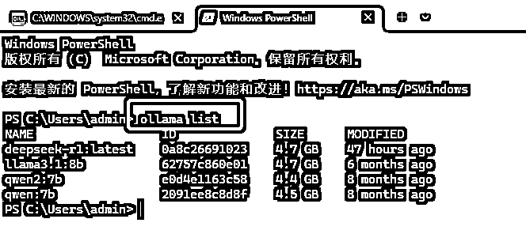

*   Ollama show deepseek-r1:1.5b #看一下这个1.5b模型的具体信息，一般用不上

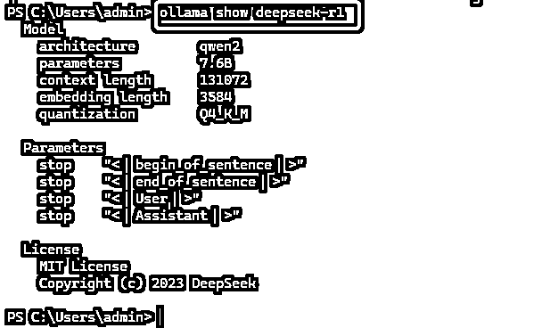

## 四、如何将deepseek从CPU模式切换为GPU模式

当你已经学会熟练使用ollama的时候，可能就会遇到一开始我说的问题，明明电脑性能超强，但是输出就是一句一句的不连贯，这个时候检查后台任务管理器发现，GPU根本没跑，跑的全是cpu的算力资源，而且CPU占用拉满到100%，这个时候我们就需要CUDA工具切回GPU。

CUDA可以理解为是英伟达的专属显卡工具，可以用来加速游戏，管理显卡运行的，这里我们要让ollama用上GPU，就需要CUDA辅助。

第一步：安装cuda toolkit

*   网站 https://developer.nvidia.com/

*   根据自己的电脑版本，选择对应，最重要的，安装类型一定要选Local本地而不是exe网络（本地部署容易踩大坑一般是这一步下错的问题）

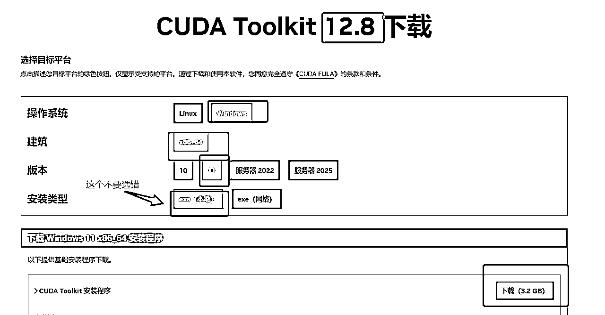

*   下载完成后，一键安装就行，记住得选空文件夹，安装包的文件夹不行

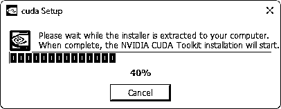

*   安装完后去cmd那里验证是否安装成功，跟验证ollama安装一个逻辑，打开cmd 输入【 nvcc --version】 显示版本号表示下载成功

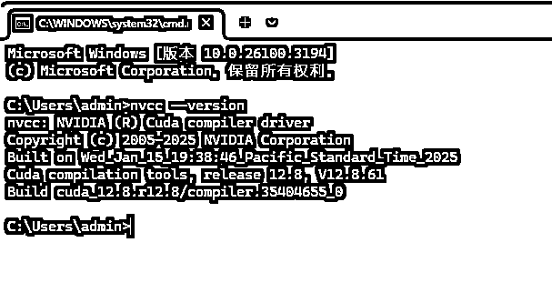

第二步：设置系统变量

系统变量类似于告诉电脑，走这里跑gpu更快，相当于给用gpu开了个传送门，如果不开这个传送门，ollama默认用的是cpu的算力资源

*   win搜索框直接本地搜索【系统变量】，打开页面，点击【环境变量】按钮

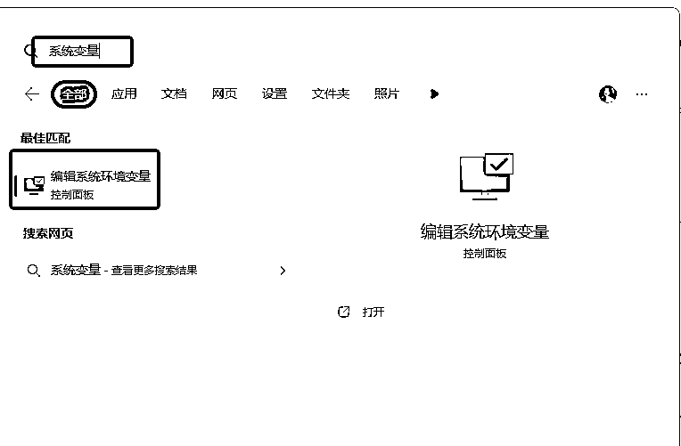

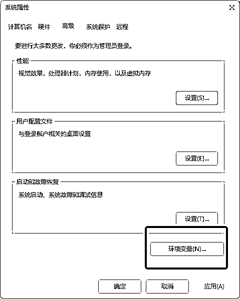

*   环境变量有两种，上面是个人的，下面是系统的，我们在下方系统的里面添加两个环境变量，这里面环境变量等于两个路标，让我们把不同软件的功能连接上，一个是ollama连接cuda的，一个是cuda连上对应显卡的

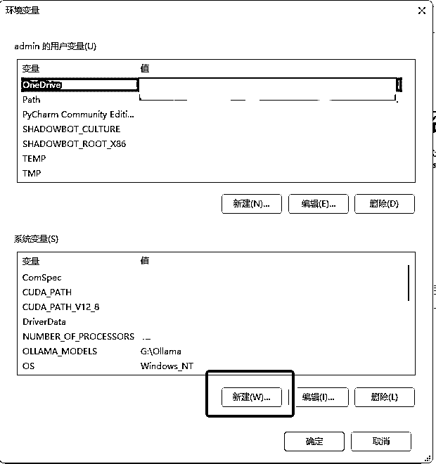

*   第一个环境变量：

*   变量名：OLLAMA_GPU_LAYER

*   变量值：cuda

*   第二个环境变量需要GPU的uuid，这个uuid需要走cmd查询找到，查询代码是【 nvidia-smi -L】

*   变量名：CUDA_VISIBLE_DEVICES

*   变量值：GPU的UUID

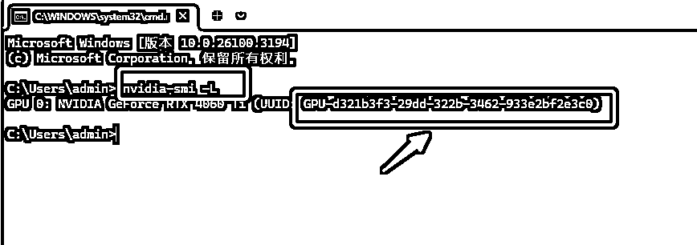

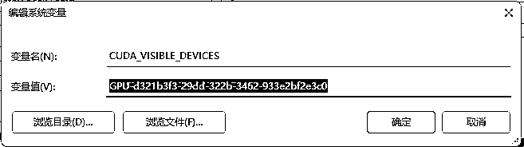

第三步：验证大模型是否在跑gpu

*   重新cmd打开黑框，输入运行命令【ollama run deepseek-r1】开始对话，同时重新开一个cmd打开第二个黑框，用【ollama ps】命令检查用的是CPU还是GPU，

*   右键打开【任务管理器】，切到性能模式，选择GPU检查

