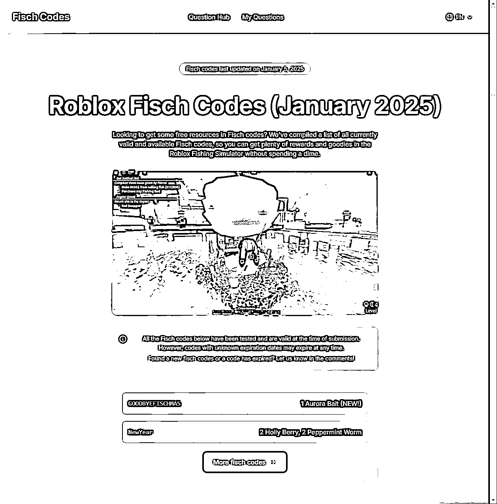
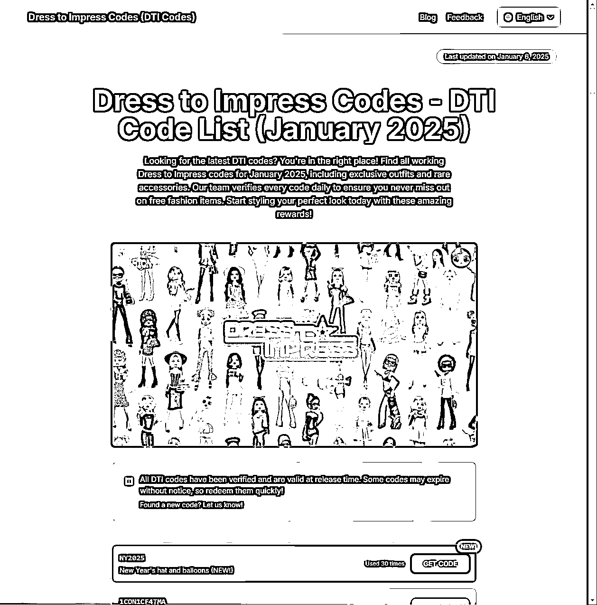
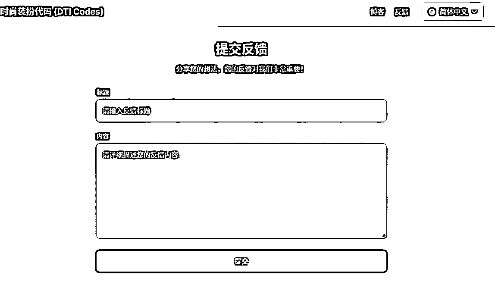
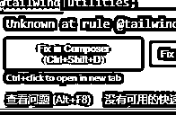
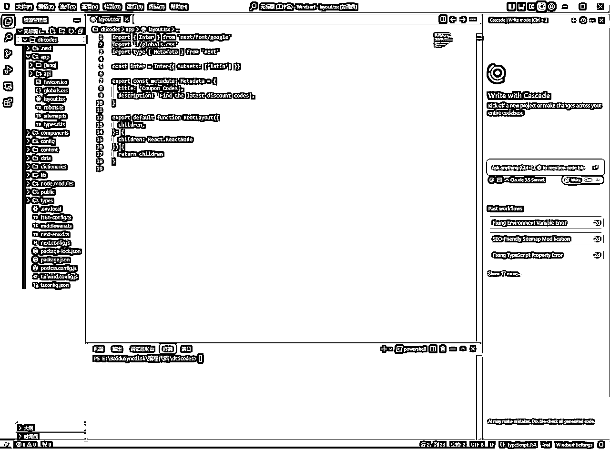
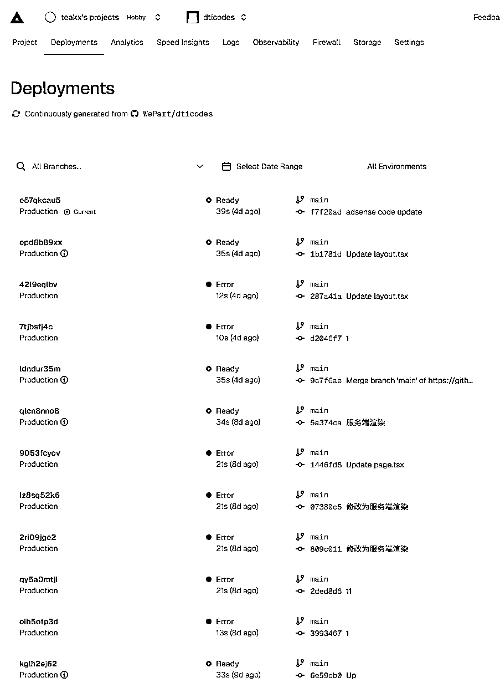

# 使用cursor+windsurf，非程序员3天做了一个多语言网站

> 来源：[https://u0yrmcie7v.feishu.cn/docx/EyuQdh5zOo05KbxXxLKcqyslnSh](https://u0yrmcie7v.feishu.cn/docx/EyuQdh5zOo05KbxXxLKcqyslnSh)

飞哥群里公布了一个关键词fiech codes，让大家去做相关网站。

10分钟之内，大部分的域名就被注册光了。

没办法，只能从这个关键词继续挖掘，然后发现了我现在的这个关键词dti codes。

首先我使用slimilarweb查了一下关键词的难度，发现难度不大，流量不低。

然后通过谷歌搜索了一下目前的网站，发现基本都是大站的内页。这么一看符合要求，立马注册域名https://dticodes.vip。

因为是codes的关键词，所以，我就想到当初自己经常查的godday coupon codes，他们的网站设计。

提供了优惠码，然后有一键复制功能。

核心功能就是：多语言网站，代码一键复制，页面设计符合主题，精美动效。

分析完以后就是cursor编码了。

首先，找一个看上去不错的模版，然后截图让cursor帮我写出一个框架。然后，我根据最初的关键词：fiech codes，找到了一个fiechcodes.org的网站。

然后我就直接截图他的网站，让cursor写了一个差不多样式的。再根据我们的要求让cursor调整修改，他就帮我们创建了一个简单的网站了。

你想要什么功能就可以告诉cursor，或者页面有什么问题，可以截图发给它来处理。

比如我增加了blog和feedback的功能，就是完全让cursor来进行编写的。同时也让它帮我实现了多语言功能。

刚开始的时候，cursor一定是给你将所有的代码写到一个文件中，这个暂时不要管，先去实现功能。

完成了想要的功能后，就需要对不同的组件进行分离了，其实就是告诉cursor拆分一下就可以了。

这个过程一点是存在问题，将问题发给cursor他就会自动修复了。

如果实在不会，可以将鼠标放到错误的代码处，下面会提示fix in composer，点击即可修复。

当我们的代码量变多的时候，cursor的一些修改就会出现问题了。可能会将你的代码改的乱七八糟的。

这时候就需要清楚下一位选手，windsurf。

windsurf和cursor不太一样，它会优先读取文件然后一点点的去修改。而不是像cursor一样先改了再说。

通过windsurf完成后续的功能设计，bug处理后，就可以上传到github，一键部署到vercel了。

然后Vercel绑定域名就OK了。

当然部署过程也是会遇到很多问题，只需要将问题反馈给windsurf就可以啦，一点点的解决掉就可以部署成功啦！

我说的很简单，但是实际操作过程可能还是会遇到问题的。但是，我也不想讲那么细致啦！

因为一些小白问题：github怎么用，怎么部署到vercel，怎么用cursor，怎么用windsurf等等，这类问题都可以通过搜索解决的。想要自己完成一个小东西，动手能力还有要多练习的！

### 我最大的感触是：AI编程难点是你提问的能力，能不能将问题描述清楚，能不能将需求讲的够仔细，这才是重点。