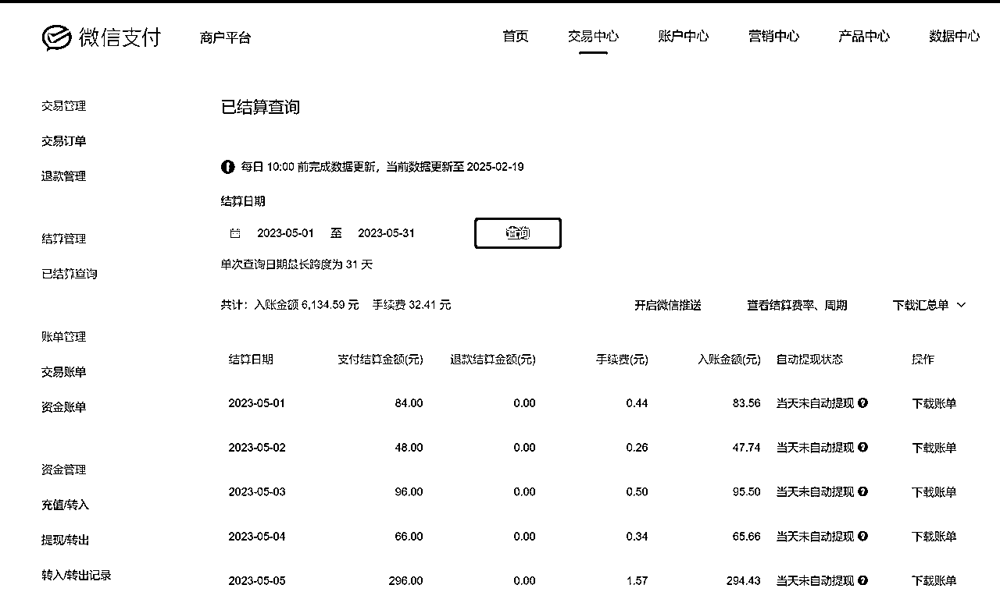

# 小众社交APP怎么做:一个从0到盈利的完整复盘

> 来源：[https://h0v0176ep4x.feishu.cn/docx/FSxRdzPiaoD0rAxvmlWc5ArTnkd](https://h0v0176ep4x.feishu.cn/docx/FSxRdzPiaoD0rAxvmlWc5ArTnkd)

大家好，我是超人，一个能让你的想法快速落地的程序员

过去十年，我的键盘敲击过千万行代码，开发过超100+的APP，最擅长的事情就是把一个Idea落地实现

这次分享的社交APP，从MVP到后来的重构优化，花了整整三个月，每天只睡四小时，而这个后来月入两万的平台，最初连数据库都三天两头崩溃。凌晨改代码更是家常便饭。但当我看到后台曲线突然起来的那刻，忽然明白：程序员最浪漫的事，不是写出多完美的代码，而是看着别人在使用你的产品时，那种满满的成就感

这篇文章会公开这个社交APP开发过程中的所有产品文档、技术架构图、运营SOP，相信亦仁大大的话，越分享越幸运

# 一、想法初衷

大概两年前，因为一直做APP的开发，所以会时常关注IOS排行榜，有一天在iOS的社交模块排行榜上看到了一个陌生的App，顺手就在国内的安卓市场搜索了下，发现没有同名的软件，在竞争激烈的互联网领域，竟然有这样一片空白

于是在七麦数据上继续深度分析：

可以看到该APP排名非常稳定，而且每日下载量达到了2000+

在国内的安卓市场搜索了下，发现没有同名的软件

经分析，这是一款针对小众人群的社交App，国外更加开放，用户基数大，所以此类App的出现并不奇怪，而国内相对保守，这类人群基数小，大厂通常不会涉足这类受众狭窄的产品，从这个角度看，这或许恰恰是一个潜在的机会，大厂看不上的边缘需求，正是独立开发者的诺亚方舟！

# 二、前期准备工作

## 竞品对标

首先找到的就是陌陌，探探等社交App，分析主要功能

用借鉴思维解构社交本质

不要高估自己的能力，该抄就去抄

*   探探的卡片交互+ Soul的匿名社交+ 豆瓣小组的内容沉淀 = 我的产品

*   关键点：砍掉所有非核心功能，保留3个致命功能点（滑动匹配，匿名聊天，动态发布）

## 找兼职设计师出设计图

提取核心功能点，交接给设计师，让她快速给出设计图

# 三、技术开发

## 技术架构

App基本逻辑：前端使用App配合后端完成数据库的操作，就能实现一个App的完整功能

现在面临的情况是有了设计图，但是要如何实现这个产品还有很长的路要走，如果APP的所有功能全部都自己写，那将会极大影响产品发布时间。

## 技术调研

组装式开发的艺术

首先拆分APP的核心功能点，梳理所用到的技术，然后去市面上找到靠谱的SDK（软件开发工具包），绝不重复造轮子

一对一私聊：作为一款社交APP用户私聊是核心中的核心，需要保证消息发送的稳定性和准确性，调研了网易IM云信和腾讯的IM，考虑到腾讯有微信这个背书，在价格相差不大的情况下选择了腾讯IM

图像和短视频云存储：用户会在APP中发布图片和视频动态，那多媒体数据的存储也是要考虑的，选择七牛云不仅是因为稳定，而且后台界面比较友好非常利于维护

实名认证：这个一开始并不是我们最看重的，是后期有用户反馈有人资料造假后才开始重视的，最开始找了腾讯和百度，发现百度接入更加简单，所以敏感词和真人认证都采用了百度方案

广告平台：业界用的比较多的一般是穿山甲或者优量汇，穿山甲是字节旗下广告变现平台，实测收益比腾讯的优量汇高了好几倍，因此首选穿山甲

所有核心的几个技术点整理如下：

| 技术功能点 | 实现方案 |
| 私信消息 | 使用腾讯IM |
| 图像和视频动态开发 | 使用七牛云存储 |
| 数据统计 | 友盟SDK |
| App广告 | 穿山甲SDK |
| 支付方案 | 微信支付和支付宝支付 |
| 微信登录 | 微信SDK |
| 短信登录 | 阿里云短信 |
| 敏感词过滤 | 百度内容过滤SDK |
| 人脸识别和实名验证 | 百度认证SDK |

## 后台开发：没有后台的后台架构

APP属于用户前端展示，后端的接口开发我不擅长，服务器部署我也不会，这是这个项目遇到的最大困难

所以当时为了尽快上架，这个项目是没有后台的，所有逻辑全部写在APP内（相当于APP只是一个空架子），只是为了尽快发布看看数据情况

所以当服务器部署成为拦路虎，我祭出开发者终极奥义：

1.  用SQLite伪造云端数据库

1.  定时器模拟消息推送

1.  本地加密存储用户凭证

这个"皇帝的新装"式架构，让我在28天闪电上架

### 项目跑通，快速迭代

项目上线后，出乎意料的很快就有真实用户的下载，于是决定认真做做这个项目

首先找到了一个支持云函数的第三方服务商（果创云：https://www.yesapi.cn/），同时后台数据库的也可以由他们解决，自此整个项目的数据闭环就此跑通，核心就是数据库的增删改查，再封装一层接口，

这段时间开始闭关修炼，整整三个月时间，终于完成了整个后端的完整实现

接口搭建直接在网站上完成

后台数据库创建

## 支付系统接入

目前微信支付和支付宝支付是国内主流的支付渠道

这边碰到的困难是必须搭建自己的服务器去处理支付信息，然后开始学习服务器部署相关知识，最终在腾讯云租了个服务器用Tomcat搭了个简单的Java后台最终搞定了

##### 注意事项：支付功能必须是公司资质才能接入，微信开发者后台的APP需要上架后才能申请，如图：

# 四、上架运营

然后开始上架到安卓应用市场，如何上架可以参考我之前的帖子（https://scys.com/articleDetail/xq_topic/4848255141445418）

### 流量来源

在应用市场做ASO（指应用商店优化，主要用于提高应用在应用商店中的可见性和下载量）

一般有以下几种方法：

1.  关键字优化：在品牌名称后添加一两个高搜索量关键词来描述应用的功能，有助于提高应用的知名度。

1.  副标题优化：副标题通常应该用一句话传达应用的目的，同时包含高搜索量的关键词。将最重要的关键词放在开头。

1.  通过应用描述赢得商店访客‌：应用描述应展示应用的价值主张、热门功能、多个用例和优势。回答商店访客最常问的问题，以增加他们的信任和兴趣。

1.  马甲包矩阵：相同的代码，通过更换APP名称和APP的界面样式，在多个应用市场上架，达到获取更多流量的目的

## 当前流量数据情况

现在同时上架的App约三款左右，其实核心代码是同一套，只是换个皮肤重新上架应用市场

目前日新增用户约200左右

## 敏捷开发，快速迭代

APP在初期发布后，是一定会有bug的，这点并不需要太过在意，这个世界上没有完美的产品，曾经的我也执着于完美的代码，每当我的APP出现bug总是一阵愧疚，直到有一天我发现微信也有bug存在，从此释然

先追求完成，再追求完美

为了便于用户反馈使用中的问题，加入了客服一键唤起微信的功能，我这边会根据反馈不断升级App

还记得产品刚刚发布的时候有用户反馈，充值了但是没到账，我当时已经在床上了，但还是半夜起来打开电脑，排查后才发现是服务器卡住了，重启服务器然后帮用户手动充值才解决

有了这个经历后就决定开发手机端的管理系统，这样以后哪怕在外边也能随时随地维护系统

### 内容合规化

鉴于国内的监管环境，内容的合规很重要，刚开始没有做限制会出现动态内容鱼龙混杂，后来才加了内容审核功能，APP所有的对外内容管理全部接入鉴黄系统，同时检查敏感词，保证内容合规，这样能过滤掉大部分有害信息，并且使用人工二次审核，于是在后台管理系统中增加内容审核功能

### 合规举例：

应用市场会对内容这块不定时抽查，所以尽量把内容做的合规是一个长期化的工作，举例如下：

问：什么样的内容是合规的，最常见的场景是什么

以上截图就是人工审核的界面，机器审核只会过滤特别明显的违规文字和图片，对于特别隐晦和带暗示的词语是无法是查到的，所以人工作为内容检查的最后一关必不可少

# 五、收益情况

## 成本支出

零人力成本+精准技术选型=最小化创业死亡率。

因为所有的研发都是我一个人搞定的，所以硬性成本只有服务器相关的费用

| 项目 | 费用 |
| 腾讯云服务器 | 158 |
| IM SDK（私信一对一功能） | 1500 |
| 七牛云 | 100 |
| 后台接口 | 700 |
| 百度关键词检测和实名认证服务费 | 300 |
| 短信接口费用 | 100 |
| 总计 | 2858 |

#### 每月固定成本：3000左右

## 盈利来源：

### 1、App会员费

## 后台收入情况：

微信支付后台：当月充值金额为6134元

支付宝后台：当月充值金额为13609元

2、App广告收入--在App明显位置都植入广告，赚取广告平台的收益

广告后台收益：当月收益2968元

以上总收益约22711元

### 收益总计

# 六、复盘反思

*   前期验证需求产品不用完美，甚至这次是用一个空壳App来验证需求

*   ASO的优化要注意细节，主标题和副标题要注意情绪化表达，勾起用户欲望，不要过于理性

*   巨头看不上的缝隙，就是独立开发者的机会，在日常生活中要时刻保持敏感度

*   抛弃完美主义，微信尚且有闪退，心中默念我先去做，做到60分就好

*   写代码要理性，推广时要感性，要诱惑用户

*   对独立开发者来说社交这个业务还是太重了，后台接口就接近100个，工具类的其实更适合

## 写在最后：

感谢大家看到这里，现在这个项目通过前期引流，已经获取了种子用户，用户粘性很强，但后续的运营不是我的强项，从0到1是我的强项，目前卡点停留在如何放大，这需要更专业的运营人才一起合作，我相信一个人能力再强也是有限的，希望大家多多提建议，一起做的更好