# AIGC产品创业经验总结——开发运营方法论

> 来源：[https://ijarxpcwej.feishu.cn/docx/FX4gd95wNoI9N3xI3oOchI4Sndf](https://ijarxpcwej.feishu.cn/docx/FX4gd95wNoI9N3xI3oOchI4Sndf)

我们产品上线有一年多时间，更新了20+个版本，每个月为用户生成11w+视频。很多圈友也是我们的用户，今天主要跟圈友们分享一下我们这一年多来积累的一些经验和踩过的坑，同时也是做个24年的总结。

## 一、创业历程介绍

我们为什么要做AIMIX智剪这个产品，一开始只是想解决自己的问题，从21年开始在生财学习了抖音短视频带货项目，开始都是自然流，自然流成本低就是不太稳定，所以慢慢增加了很多账号，算是初步搭建了带货矩阵账号，再然后就结合千川投放来放大爆品，所以每天都需要大量的素材，每天自己人工剪辑就比较费时间，基本上把大部分时间都花在了找素材、剪辑上面了，就没有时间优化选品、千川投放了，然后就想解放自己的低效率时间，Boss上找了几个兼职剪辑，我给他们素材，素材有些我自己买的，有一部分是找商家要的，然后不够的他们再自己收集一些，虽然我已经把价格压的比较低了，每条成片5-15块，主要看时长。每天的素材生产成本就有1-200块，每个月就要几千了，所以素材生产成本就很高。

然后就一直在思考有没有低成本的素材生产工具，也尝试了市面上很多类似的产品，要不就是使用太复杂，要不就是功能不满足，然后结合对这些产品的理解来重新拆解视频素材生产的流程，就发现其实这个工作流程也没有很复杂，更多原因是这些产品设计不足，没有很好的对业务模型进行抽象，比如有一款产品功能做的很多可能有上百个，参数也有很多，这个对用户来说学习成本就很高，用我们用户的话说“这就是给程序员用的”。

所以我们利用第一性原理对短视频生产流程进行了深度拆解，每个视频都是多个素材合成的，比如视频、解说配音、背景音乐、字幕、标题、贴纸等这些都是不同的素材，不同的素材组合就组成了不同的视频，如果需要批量生产，就需要一个视频脚本来规定合成规则，一般每个脚本都会有多个分镜，每个分镜设置了有哪些素材，我们批量混剪目的就是要生成尽量多的成片，而且还能重复，那就要准备尽量多的分镜素材，这样素材进行排列组合才会更多。

上面说的是合成量产，整个批量化剪辑最后一步，然后我们再来分析整个工作流程，筷子把这个流程分成了四步：编、拍、剪、投，对应的也是四个不同的岗位，这个确实也是一内容生产团队的标准配置。那么编对应的编导，也就是编导创意，这是一个比较重要的流程，这一步需要产出视频脚本，脚本质量的好坏直接决定了成片的质量和精准度，影视飓风也在他们的工作流介绍中说编导是他们流动性比较大的一个岗位。拍比较好理解，对应的就是拍摄、摄影岗位，如果是做二创那么这里对应的就是素材收集了，二期这一步应该要对素材做粗剪，比如要对素材做分镜、归类啥的。剪辑其实是最后一步，就是根据前面流程里产出的脚本，把第二步生产好的素材进行批量合成，那么这个就是一个标准的批量混剪工作流，然后不同行业、不同需求的老板、达人可以在这个基础上再创建自己的工作流。

## 二、精益创业

创业这事确实需要经验和方法论的指导，大多数的创业者也都是白手起家，没有经验也没有什么资源，所以

很难一开始就规划的很详细，因为没有匹配的资源去实现。《精益创业》中把创业比作开汽车，而不是造火箭，开汽车的好处就是随时可以调整方向，你开车去上班不会因为走错了一个路口而放弃上班，我们需要在到达目的的过程中不断修正方向和解决路上的问题。造火箭则不然，造火箭需要很精细的设计规划，然后安装设计实施，不能有一点偏差。

这个开车的旅程没有精确的导航，只要有了大概方向就先上路，然后在路上再寻找精确的目标，通过不断修正方向最终到达目标终点。如果你有创业或者副业的想法先干起来再说，你缺的根本不是方向和目标，生财有这么多项目总有一个适合你，没有思路就多来生财找找灵感，遇到了实操问题也都可以在生财找到答案。

创业的进程中有很多不可控的因素，尤其是做AI产品，AI技术的日新月异可谓是眼花缭乱，一是我们需要坚定初心，不要盲目追风口，风口变化太快，可能你的产品还没上线风口就过了；二是要做有门槛的产品，说不定大模型的下个更新就可以替代你产品的功能，这可以当做是一个管理的问题，你既需要管理产品功能的正常交付又需要管理过程中的各种风险因素。产品交付并不限于我们做的产品功能，还包括用户体验的各个链路，比如从售前产品介绍到用户使用产品再到产品售后，只要关于用户体验的都是属于我们的产品交付，尽量要做到让用户感觉体验丝滑。

我们的产品或者服务为用户提供了价值，用户才会觉得付费是值得的，这时候用户愿意为我们的产品背书，慢慢就会形成口碑，再然后就会慢慢形成品牌。这是做一个长期产品的方法论，当然只是想跟随风口赚快钱就是另一套玩法了。

寻找产品价值的过程其实就是寻找PMF的过程，虽然这个过程比较漫长，但是一旦找到了PMF产品就会迎来爆发式增长，这是一个指数增长曲线，前期增长会比较缓慢，爆发增长前的坚持和等待都是有意义的。《YC创业导论》中教给我们的创业方法论也是先打造好产品，通过用户的反馈建议优化功能，不断地寻找产品增长点，然后结合黑客增长方法论加速增长，当然这个只是增长放大器，并不是杀手锏，这个需要建立在找到PMF的基础上才能起到加速增长的作用，不然会起到反作用。

大部分产品都是边开发边进行调整，不是所有东西都可以规划出来的，尤其是创业不是按图索骥，而是干中学，可以看看我们最初的版本和现在的版本，核心功能只是做了优化，其他功能都有比较大的改变。

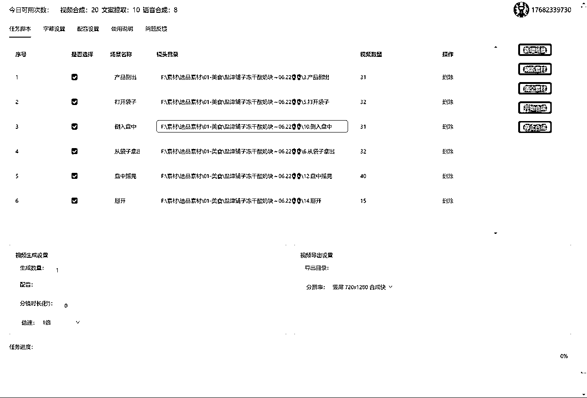

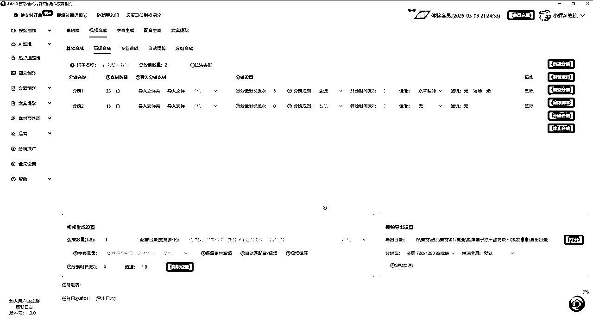

## 三、市场调研分析

前面也说过，我们在做这个产品时也没做过详细的市场调研，一是主要为了解决自己的需求，二是感觉有类似需求的商家和自媒体达人应该也有很多。但是有时需要跟投资人聊融资的事，而且也要跟团队伙伴同步认知，所以就花时间做了下市场分析，摘录一部分我们商业计划书的一部分来分享一下：

随着互联网环境及技术的发展，为适配不同的社会背景及用户需求，多种内容创作方式顺势而生，经历从PGC、UGC到AIGC的演变 历程。在基础设施完备前提下，AIGC与其他内容生产方式相比，提供了从基础素材到最终内容呈现的便捷一体化技术协助与服务， 进而降低基础内容创作的门槛及成本，为更多有自我展现意愿的互联网用户打开了想象及实践的空间。内容生产将不再只是百万专 业内容创作者才可实现的事情，我国10亿多互联网用户均有可能简单、快速的进行包含但不限于：文字、图片或长、短视频等多种 形式内容的创作。AIGC的出现和发展，可大幅提升潜在内容创作者规模，并伴随带来内容产量的指数级增长。

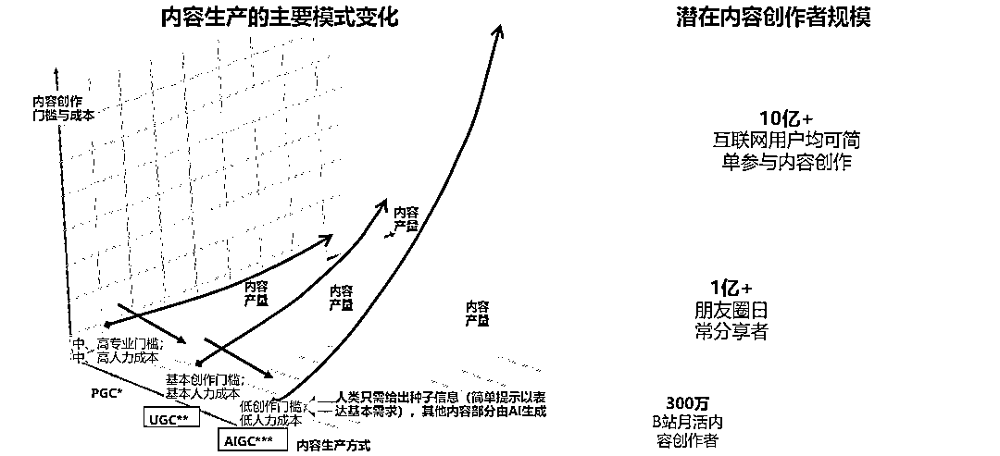

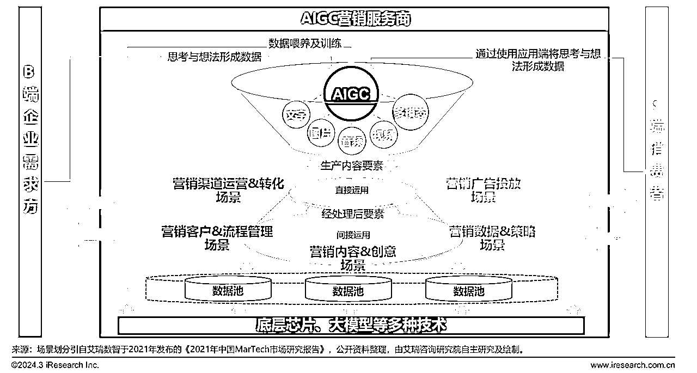

AIMIX智剪聚焦于营销场景服务链路的内容生成&创意和广告投放2个主要环节，后续可以逐步完善整个营销业务场景的闭环。

营销内容生成和创意是所有营销环境的起始阶段，需要先有创意的指导才能决定整个营销方案的落地实施，营销内容的生成效率和质量决定了营销方案的效果和天花板。

广告投放场景又是整个营销方案的放大器，可以把整个营销方案的效果放大N倍。

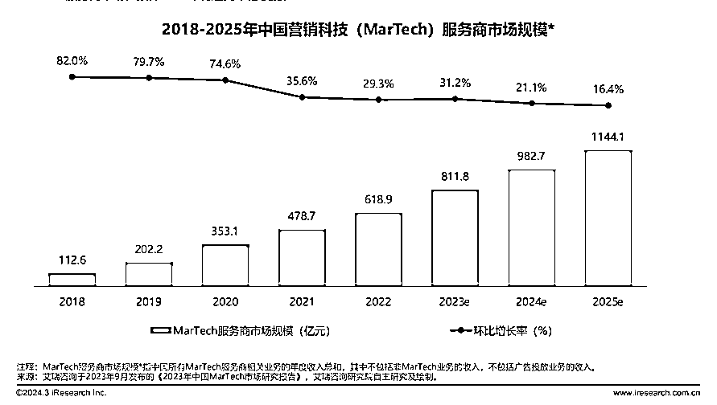

## 四、产品功能设计

既然需求明确了，那么我们再来开始着手产品功能设计，当然我们产品一开始功能没有这么全面，甚至用户体验也不是很好，主要是我们做的客户端产品有关，做客户端产品的挑战要比SaaS产品大很多，这个后面会具体讲。

如果按照我们做正常产品的经验来说，第一步首先要去做数据分析和竞品调研，比如要根据关键词看产品的需求量和竞品的盈利空间，但我们开始做的时候没考虑这些，一是因为我们对行业和业务流程比较了解，二是对整个行业需求的预判（主要是营销和电商），感觉这个事能干，正好处于AIGC红利爆发期，所以直接就干了。

开始设计产品的时候简单看了几个客户端的竞品，还没了解过筷子这些SaaS端的产品，主要感受就是这些产品不懂产品设计也不懂用户需求，所以我们还是有信心的。

### 量产合成

根据我们前面对业务流程的梳理，主要从2个方面考虑产品设计，一是根据工作流进行单点功能设计，根据工作流进行单点功能设计的好处就是通用性比较好，用户可以根据单点功能进行组合自己的工作流，而不会受到我们产品预设工作流的限制。二是我们把合成量产步骤的功能进行了抽象设计，其实批量合成的需求无非就几种，一是顺序混剪合成，然后在合成的成片中可以加标题、配音、背景音乐、字幕等素材；二是无序混剪合成，也就是随机混剪，这个过程就是随机组合素材；再然后可以进一步解放用户生产力的就是AI成片了，只需要用户进行简单的操作，就可以批量生成音画匹配的视频，就是把整个视频生成流程自动化和AI智能化了。

这些是批量混剪的通用需求，那么是可以达到量产视频的目的了，但是还有一个更重要的问题需要解决，那就是我们批量生成的视频可能重复度会比较高，因为素材会被重复使用。这个靠人工是很难识别的，所以我们需要一个算法来计算每个视频的重复度，于是我们设计了一个去重算法：

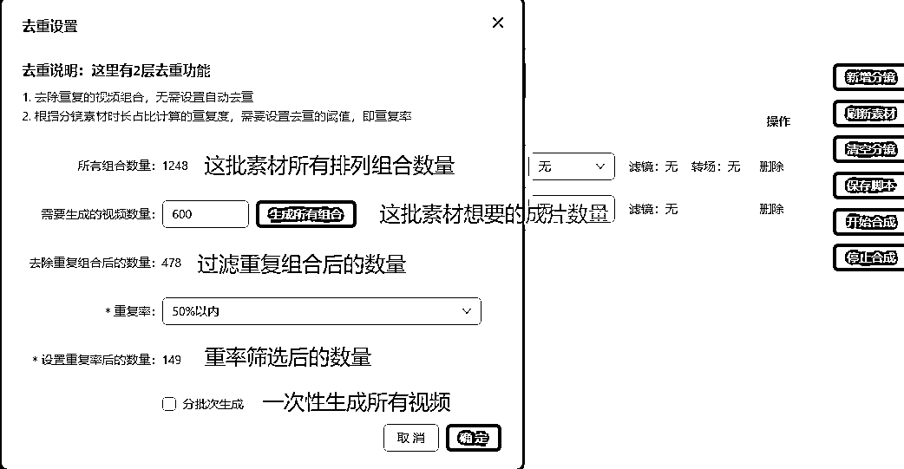

### 素材预处理

对于原创的素材我们可以直接使用视频合成来直接合成成片，那么对二创的素材我们需要先进行拆分洗稿再进行二次创作，这里会增加2个流程，一是对长视频素材进行分镜，把长视频分割成很多个短视频素材，二是对素材进行去重处理，增加素材的原创度。

#### 素材分镜

二创的混剪的核心就是把多个素材进行重新组合，首先就要拆分素材，这里我们设计了多种分镜方式，基本涵盖了常见的需求，无论你是需要按画面、按时长、按数量还是按口播分割：

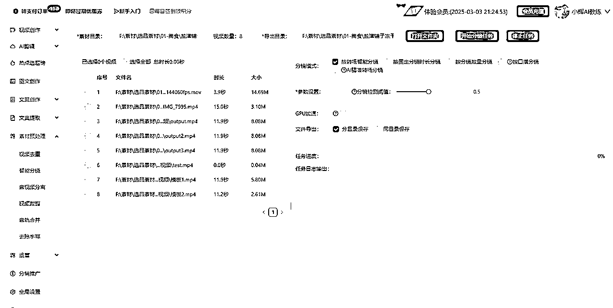

#### 视频去重

混剪其实就是最好的去重方式，但是综合平台数据来看，有素材原创能力的创作者还是少数，所以我们如果能在素材层面提高原长度，那成片的原创度就比较有保证。这里的视频去重是对原素材的画面进行一些改变，比如调色、叠加图片、视频、随机变速、抽帧、加特效等，既可以改变画面而又对原素材影响较小：

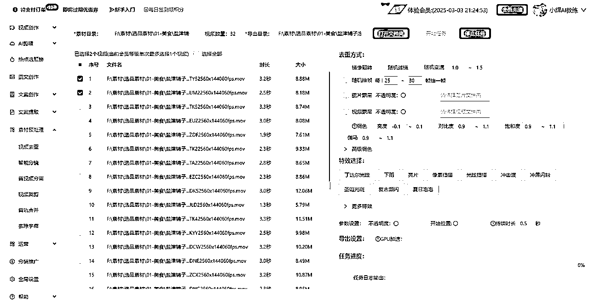

#### AI成片

AI成片功能可以算是AI剪辑产品的标配了，但是很多产品只是用AI营销的噱头，并没有多少AI的能力，有很多只是通过视频中的音频文案做匹配和剪辑，这种只适合口播视频，对营销带货类视频就没什么效果了。我们想做的是尽量通用一点，让AI可以理解素材中的画面和音频文案，再根据用户的视频文案进行匹配，这就需要用到多模态大模型的能力，国内的模型效果都比较一般，我们也还在寻找一个效果好而且成本比较低的解决方案，目前这个功能刚上线，还不是很准确，营销类的视频效果还不错，如果圈友们有什么好的方案欢迎来一起交流。

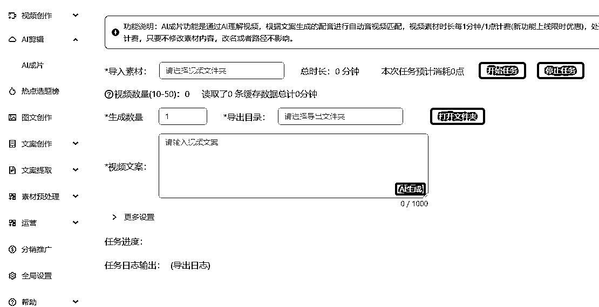

## 五、编码实现

有了前面的产品设计，编码相对来说就比较简单了，只要按照产品功能设计实现即可，而且现在可以通过AI生成大部分的代码。我们的产品需要不断的增加和优化功能，可能也会涉及到多人协作，所以在开发前还是要做好技术架构设计，并遵循良好的工程化开发工作流，比如敏捷开发，才能保证代码的可维护性。

我们现在的开发工作流：

做一个功能设计是一个提出假设，并验证假设的过程，验证是需要用户参与的，通过用户的反馈或者埋点数据收集分析，最终我们能判断这个功能的一些指标，后续是否优化还是移除。

在这个工作流中能自动化和AI化的部分要尽量自动化：

### 用户需求收集

在需求收集阶段除了跟用户交流、调研竞品我们还会通过一些自动化的方法来收集用户需求，比如我们通过AI智能客服来收集用户提问的未解决的问题，这些大概率就是用户的需求，但是我们现在的产品功能无法满足，我们会通过记录这些问题来作为需求的引入。

具体实现方式是我们通过扣子搭建了一个客服的工作流，首先我们会识别用户的意图，如果是关于产品的问题，先检索我们的产品知识库，并把问题和回答记录到多维表格中，记录有2个用途，一是我们可以人工辅助AI回答，并把人工答案给AI参考，AI在下次回答同样问题的时候就可以更精准。二是我们可以发现哪些是用户未被满足的需求。

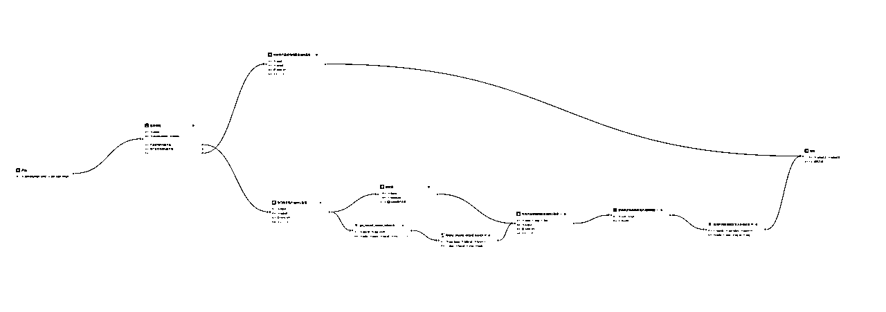

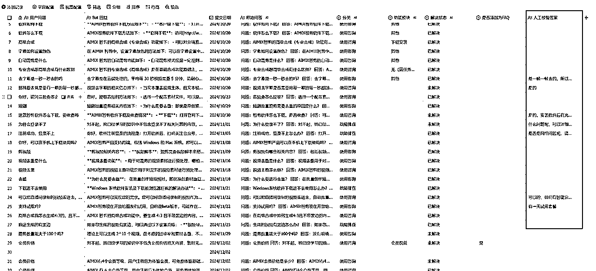

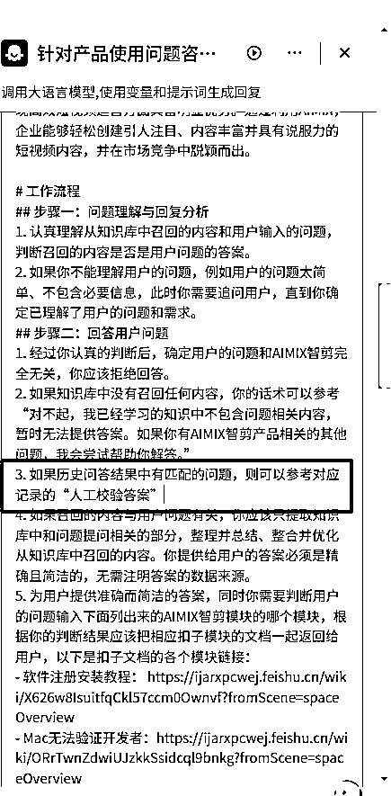

### 代码开发

我们客户端代码统计有7w行，除去一些格式化文件，估计有个4-5w行代码，其中有1/3的代码是用AI生成的，这其中也用到了很多模型和编码工具，比如开始都是用Chat GPT生成，再复制粘贴到编辑器中，这个过程有点繁琐，尤其是需要频繁修改测试代码时，后来用上了copilot类的插件，可以在编辑器中提示和生成代码，但还是不太丝滑，知道Cursor的出现，可以直接在编辑器中生成和修改代码，而且可以通过代码评审的方式修改简直不要太高效。

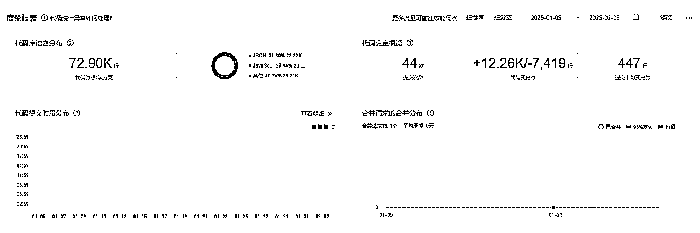

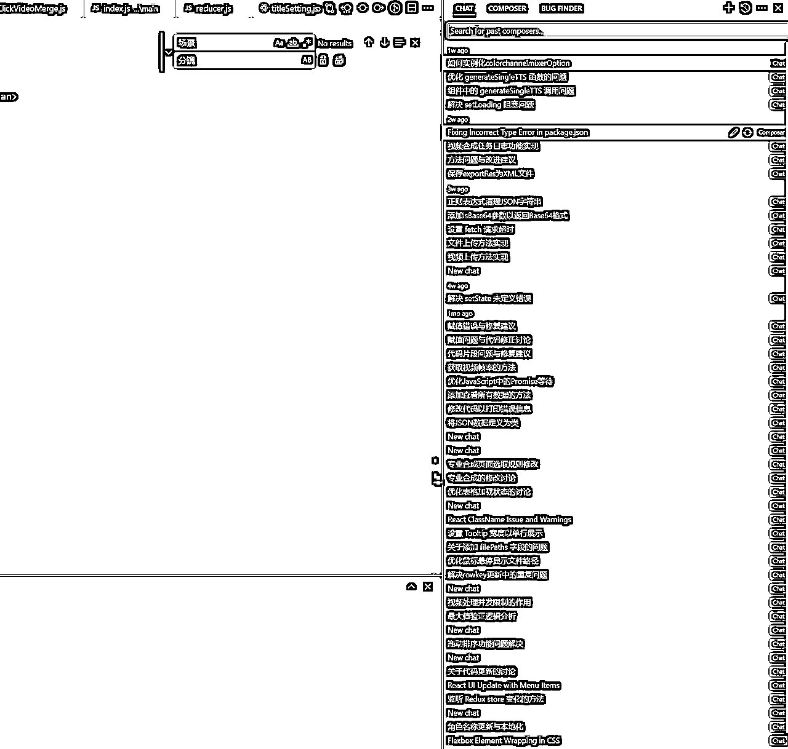

比如在写前端页面时，用Cursor可以直接生成 HTML + CSS + JS逻辑代码，一步到位，而且Cursor也可以帮我们排查Bug, 他可以把多个代码文件作为上下文传递给大模型，排查代码太高效了。

我这里直接把页面的报错给AI, 他就可以自动分析代码中的缺陷：

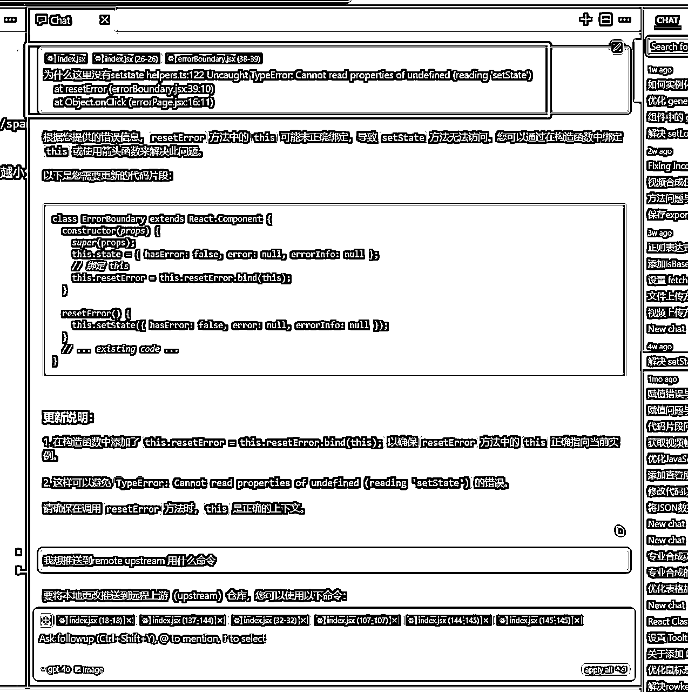

比如我不太会写正则表达式，这时候AI生成就特别有用：

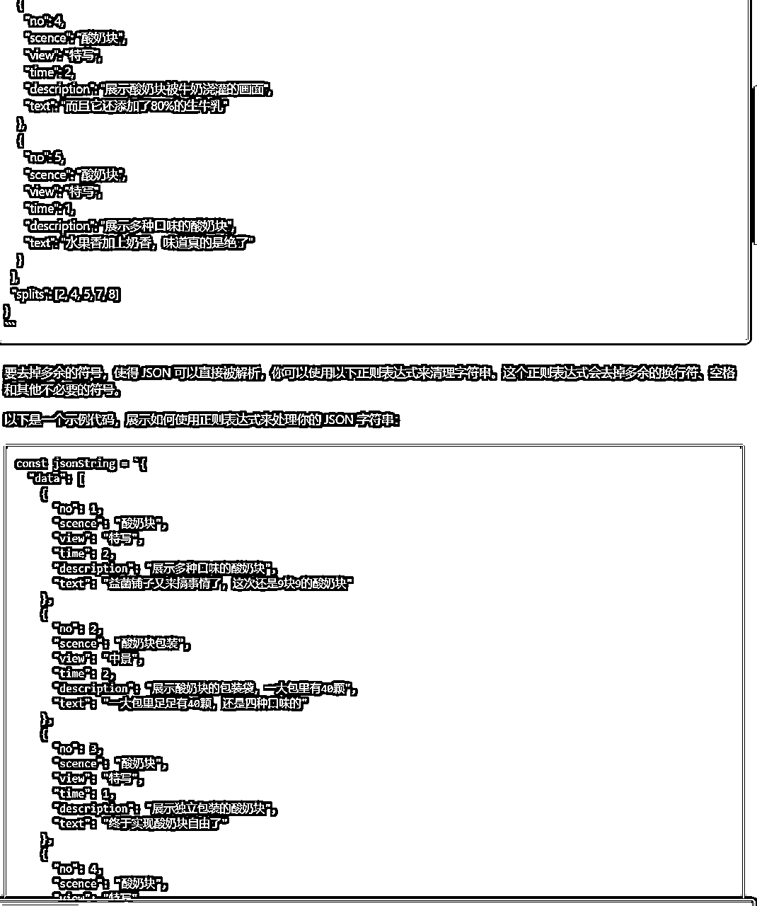

关于模型，Cursor中有很多模型可以选择，大部分情况下Claude.35生成的效果要比GPT-4好一点，o1是最强的模型，他生成确实会有一个逻辑推理的过程，比如逻辑复杂一点的代码其他模型生成时会陷入死循环，o1模型会在推理之后给你提供多个解决方案，我们有很多关键的技术问题是通过o1解决的。

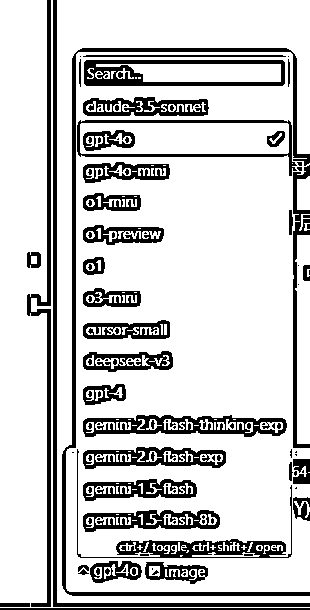

Cursor是需要收费的，试用期到了只能用一些简单模型，好在Cursor支持使用自定义的模型API，我们可以在Cursor中配置 OpenAI、Anthropic、Google或者Azure的API key， 就可以实现按量付费，使用多少token就算多少，如果用的不多比包月要便宜很多，而且包月还限制次数。

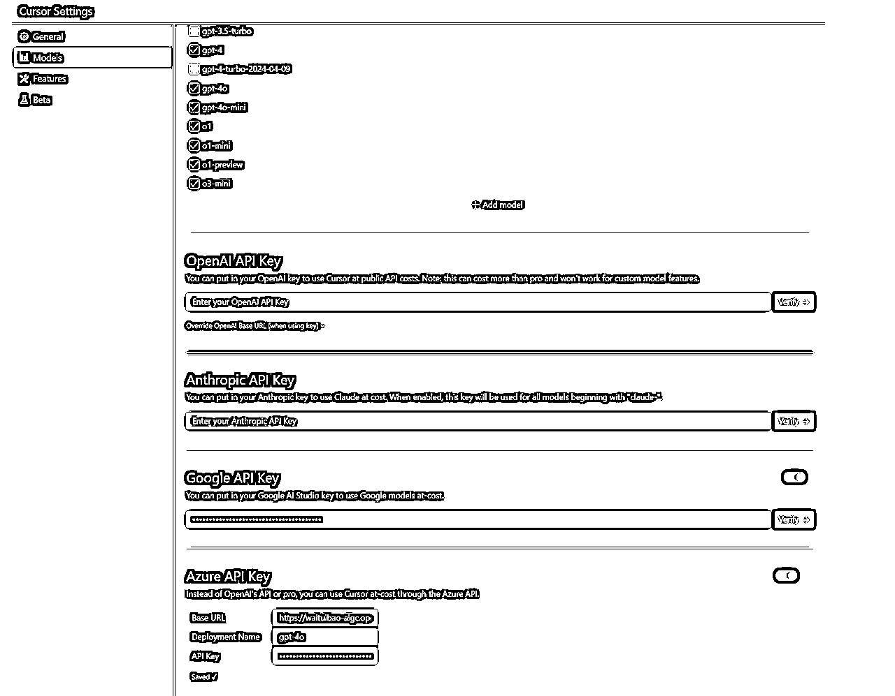

### CI/CD

在开发的过程中我们需要频繁的发布、测试，开发完成之后还要上线，这些流程都可以自动化，我们可以通过代码托管平台的CI功能进行持续交付，比如阿里云效的流水线：

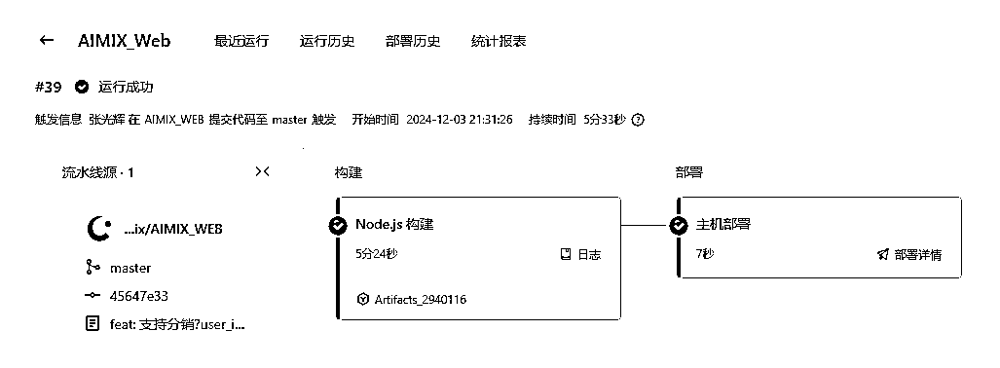

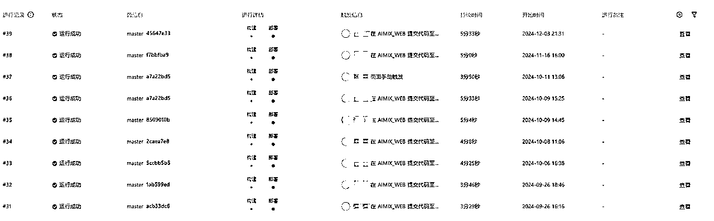

通过流水线自动发布之后，可以通过微信通知，也无需等待发布的过程

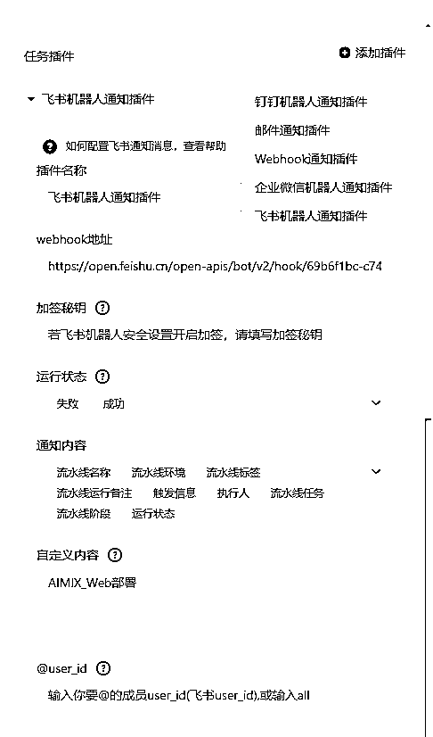

这里还是推荐Github的 Action, 比较灵活和强大，可以支持SSH方式发布，比如我们有个功能需要部署到Auto DL，因为Auto DL提供的就是Docker容器，所以不支持安装Runner，这个时候用Github Action构建就可以实现，但这里遇到一个坑，就是Github的服务器都是在国外，如果要部署到国内的服务器，因为网络的问题，经常会部署超时，当部署的文件比较多时尤其明显，所以我们加了一个流程，先上传到腾讯的COS，再从COS下载到服务器上，因为COS是可以开启全球加速的，而且也可以直接选择国外的地区存储。

```
 # 压缩 temp 目录
    - name: Compress Public Directory
      run: |
        tar -czf public.tar.gz -C temp_dir .

    # 使用腾讯云 COS Action 上传压缩文件
    - name: Upload Compressed File to COS
      uses: XUEGAONET/tencent-cos-action@v0.2.0
      with:
        args: upload -sf public.tar.gz /
        secret_id: ${{ secrets.TENCENT_CLOUD_SECRET_ID }}
        secret_key: ${{ secrets.TENCENT_CLOUD_SECRET_KEY }}
        bucket: ${{ secrets.COS_BUCKET }}

    # 从 COS 下载并解压到服务器
    - name: Download and Extract on Server
      uses: appleboy/ssh-action@master
      with:
        host: ${{ secrets.DEPLOY_HOST }}
        port: 13490
        username: ${{ secrets.DEPLOY_USER }}
        password: ${{ secrets.DEPLOY_PASS }}
        script: |
          # 设置下载路径和目标目录
          mkdir -p /root/autodl-tmp/app2
          curl -o /root/autodl-tmp/app2/public.tar.gz https://${{ secrets.COS_BUCKET }}.cos.na-siliconvalley.myqcloud.com/public.tar.gz
          # 解压
          tar -xzf /root/autodl-tmp/app2/public.tar.gz -C /root/autodl-tmp/app2
          # 删除压缩包
          rm -f /root/autodl-tmp/app2/public.tar.gz

    # 重启 PM2 服务
    - name: Restart PM2 Service
      uses: appleboy/ssh-action@master
      with:
        host: ${{ secrets.DEPLOY_HOST }}
        port: 13490
        username: ${{ secrets.DEPLOY_USER }}
        password: ${{ secrets.DEPLOY_PASS }}
        script: |
          export NODE_PATH=/usr/local/node20
          export PATH=$PATH:${NODE_PATH}/bin
          cd /root/autodl-tmp/app2
          /usr/local/node20/bin/pm2 delete all || true
          /usr/local/node20/bin/pm2 start /root/autodl-tmp/app2/ecosystem.config.js

```

第二个推荐的理由是Github Action 提供多种构建环境，因为我们产品是客户端而且又是跨平台，所以需要在Windows和Mac上分别打包，Github Action提供了Window、Mac和Linux多个平台构建环境，而且还可以选择系统版本，整个CD流程就很丝滑了。

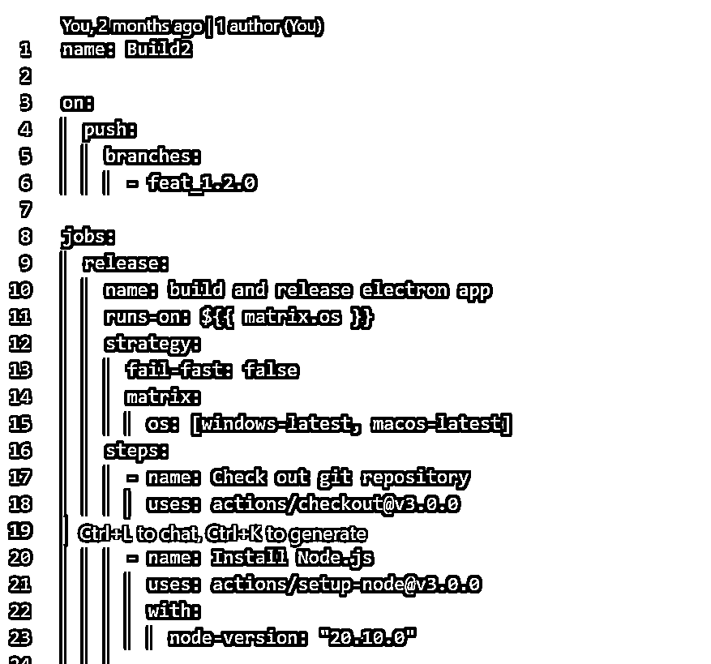

### 快速迭代-用户反馈

之前我们是不太重视和用户沟通的，主要是觉得麻烦，经常要回答一些简单或者重复的问题，会比较浪费时间。但其实经过用户社群运营和深入跟用户交流会发现很多产品潜在的问题，比如我们产品的很多bug都是用户反馈的，我们自己测试不会会覆盖的很全面，我们的用户各种使用场景又比较多，会帮助我们提出很多有用的建议，我们的产品开发跟用户反馈结合就比较适合时长需求。

#### 用户交流群，及时收集用户反馈

我们团队都是开发同学，缺少专业的测试，所以我们的产品需要用户来快速测试反馈，一般我们新版本发布之前会先发布测试版，然后在用户群里发布，群里的用户都是老用户，对我们产品包容性比较强，所以有问题也会及时反馈。

#### 深入交流，促进价值流动

我们的用户做各个行业的都有，经常会在群里交流一下行业经验，所以我们就直接组织一些用户交流会议，通过直播的方式更好的让用户价值流动起来，