# 让新人无痛入局，用 AI 写出一部网络小说

> 来源：[https://qz5e4g7okh.feishu.cn/docx/FaCTdkKBfol6upx2CYTciFcpnrd](https://qz5e4g7okh.feishu.cn/docx/FaCTdkKBfol6upx2CYTciFcpnrd)

# 初始情况：我也不知道写什么，我就是想用 AI 写点小说，赚点钱

Let's take it step by step.

# 1.确定平台

这个时候，我们第一步确定平台和频道

关于平台首推番茄小说，番茄小说是 AI 签约成功率非常非常非常高，其他平台都是真人编辑审核签约，如果小说质量不够硬，失败的概率很大。

个人认为，新人最重要的是快速签约，快速拿到第一笔稿费，形成正反馈

之后对网文逐渐了解以后，可以再去考虑签约其他的平台

知识点：

其他小说平台

17K小说网 七猫小说 起点中文网 晋江文学城 纵横中文网 红袖添香 潇湘书院 掌阅小说网 书旗小说 刺猬猫 飞卢小说网 创世中文网 云起书院 阿里文学 网易云阅读 逐浪网 咪咕阅读 火星小说 黑岩阅读网

磨铁中文网 奇迹作品网 不可能的世界 有毒小说网 息壤中文网 寒武纪年 豆瓣阅读 爱奇艺文学 书山中文网 香网 天地中文网 蔷薇书院 万读小说网 凌云文学网 甜悦读 朵米阅读网 九库文学 小说阅读网 白马时光中文网 雁北堂中文网 若看文学 塔读文学 看书网 言情小说吧 逸云书院 四月天小说网 魔情小说网 栀子欢文学网 龙若中文网 青果阅读 点众科技

不光是各类小说平台，还有第三方渠道和各种工作室，只要小说质量稳定，不缺渠道的

# 2.确定频道（男频/女频）

究竟是选择男频，还是选择女频，就要看自己个人，平常爱看哪个频道就选哪个频道

这里我选择男频

知识点：

以四合院这一题材为例，在女频创作中，常见的是人物穿越到原著角色之中，在日常生活中围绕邻里琐事、家庭关系等展开故事； 而在男频创作里，通常会设定主角拥有金手指或觉醒超能力，随着情节推进，多偏向于展现大国重工等领域的内容，情感元素所占篇幅相对较少。

四合院题材：《情满四合院》是以北京四合院为背景的都市生活题材网络小说及衍生创作，通常围绕特定历史时期（如20世纪60年代至90年代）的市井生活展开，聚焦人物在时代变迁中的成长、情感纠葛和邻里关系

同样的一个题材，在男频、女频中的表现是不同的，这样的例子有很多，具体还需要到小说当中去斟酌

# 3.确定要写的小说题材

这里使用一款工具叫做网文大数据https://www.wangwendashuju.com/

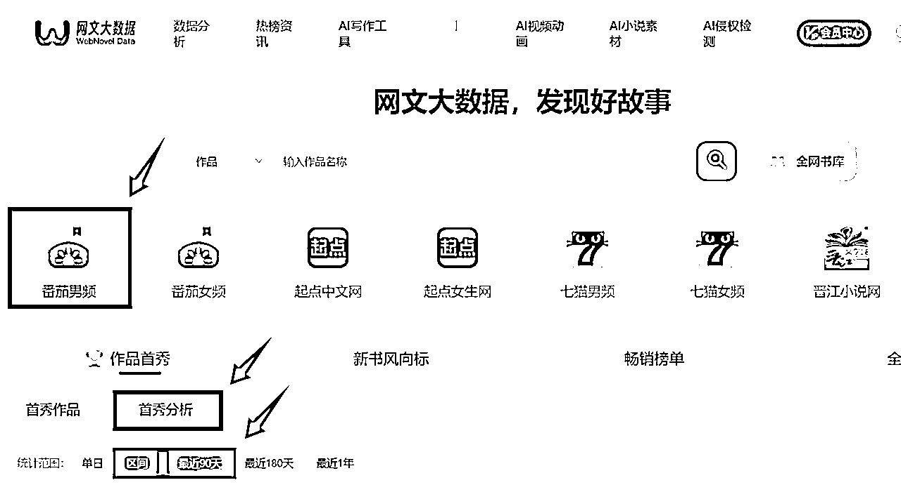

选择番茄频——首秀分析——区间最近90天

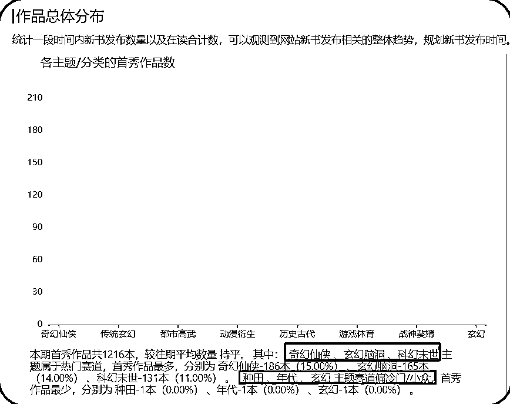

可以拉出数据，90天内首秀数据较低的题材是不推荐的，比如种田、年代、玄幻的赛道偏冷，读者也并不是很多，因此首秀作品数也比较偏低

题材选择更推荐是奇幻、脑洞玄幻、都市高武、同人、末世、历史穿越 这些

这里更多的是在这些比较火的题材，看看有没有自己比较喜欢的题材，或者是这些题材里有喜欢的书

这里题材，我选择末世

原因：因为我比较喜欢看末世题材的文（最好是喜欢看什么题材的文，就选择什么题材，虽然种田、年代、玄幻这些赛道偏冷，但因为自己比较熟悉，写起来事半功倍。最近哪吒2大火，写起来很有流量，但如果自己没看过哪吒、不了解封神演义或者洪荒这些，越往后写越困难，写起来事倍功半）

知识点

番茄小说网——帮助中心（里面的东西非常全，对全勤、签约奖励、签约有疑问的话里面都有，这里我挑出几个比较重点的）

https://fanqienovel.com/writer/zone/help/article?rank1=10000&rank2=10091&rank3=0

## 作品首秀：（只要开始更新小说，就不要断更，一旦断更太伤流量了）

## 全勤要求：

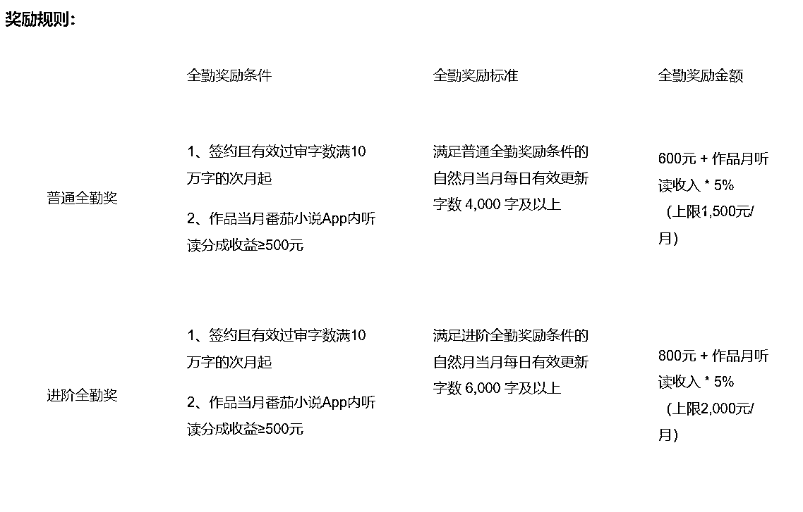

## 如何申请签约：

## 签约要求：

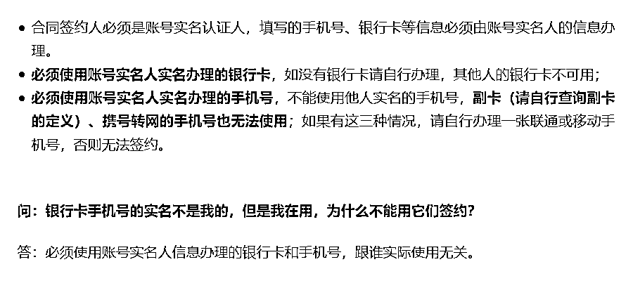

## 提现时间：

每个月的第2个周四

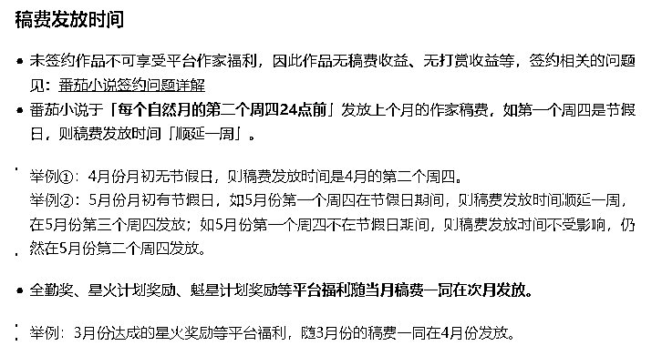

## 如何提现：

满100元可提现

一人一卡一号

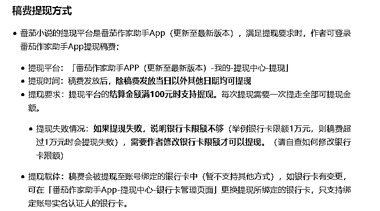

# 4.确定小说题材流派

这个需要自己在平台上去找，比如我挺平常挺喜欢看末世类的小说，我在番茄上搜索末世标签，接下来就是一本一本的寻找有哪种类型的书是自己比较喜欢的，至少在茫茫书海中，第一眼就看到了那本书，而不是将它一眼掠过

男频题材最好是选择奇幻、脑洞玄幻、都市异能、囤物资、求生、末日求生、网游、都市高武、同人、末世、历史穿越 这些

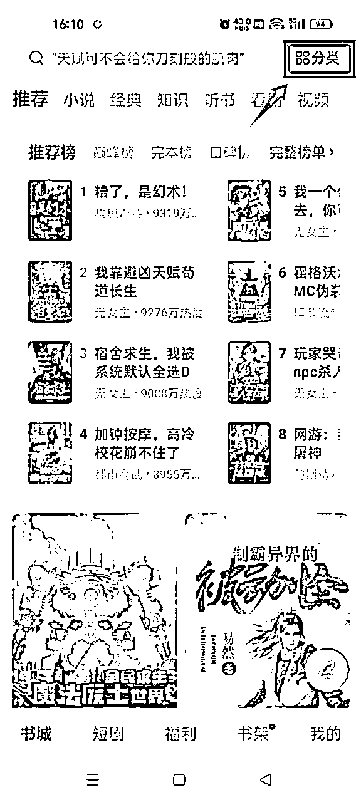

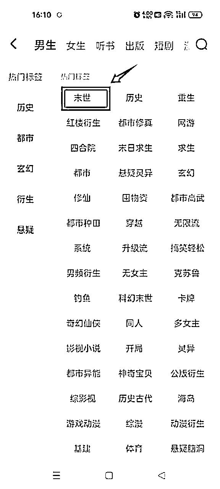

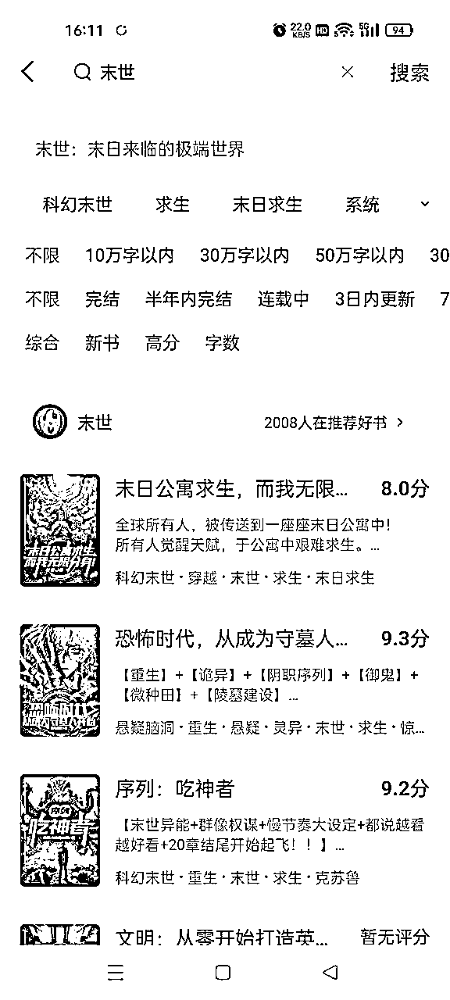

经过一番寻找和试读，我就喜欢这一本。《冰河末世，囤货无数坐看风云变幻》

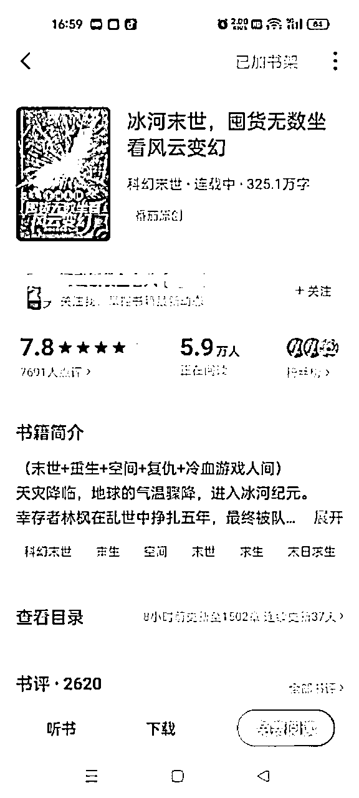

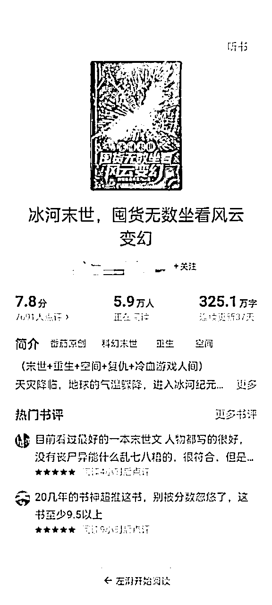

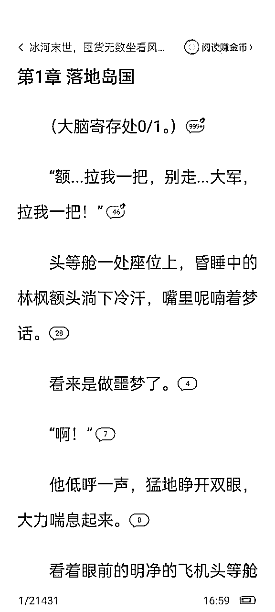

知识点

最好找一万在读以上的书，在读人数只有几千的不要考虑

也不要找番茄大神，番茄作家等级1~5级最好

最好找一眼能够看出明显套路的书，比如这一本《冰河末世，囤货无数坐看风云变幻》明显就是一本末世题材+拥有空间异能随心所欲的屯物质+主角冷血杀伐果断

金手指+这本书的爽点一眼就能够看出

比如说你想模仿《十日终焉》那明显是作者笔力好，书里有很多智斗情节我想不出来，AI也想不出来,书里有太多是 AI 不能模仿的因素了，最好最好最好找一眼能够看出明显套路的书

# 5.寻找对标作品（低粉爆款）

有两个方向，一个是通过【推荐榜】大数据来给我们推荐。另一个是通过【读这本书的人还在读】

多看一会儿，【推荐榜】就会刷出很多同类型的书

【读这本书的人还在读】可以选择换一批，比如我这里刷了两三次，就刷到了《重生冰封末世疯狂洗劫千亿物资》《全球冰封：我打造了末世安全屋》《空间系老六，末世先屯一万吨猪肉》《极寒末世开局囤积一个港口》

这些书其实一眼就能可以看出是非常套路的网文流派

构思全部都是 【末世】各种灾害+【爽点】拥有空间异能随心所欲的屯物质+【人设】主角冷血杀伐果断

对标的时候，最好是对标这样的一眼能看出套路的作品

如果找不到这样非常清晰的文，很多变种文也是可以进行对标的

比如番茄上有很多玄幻脑洞，其实都是基于《凡人修仙传》凡人流的变种

【世界】修仙世界+【人设】一步一个脚印从小人物崛起+【金手指】

金手指可以各种变，可以变成词条系统、轮盘系统、签到系统

但他们本质上都是同一类小说，可以进行对标

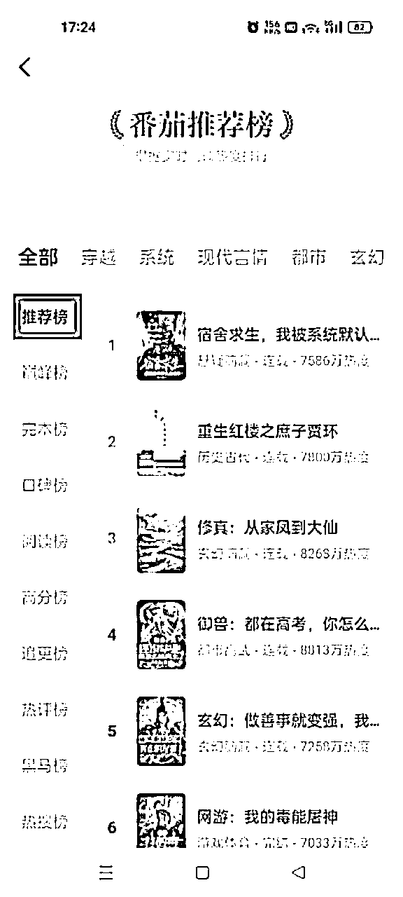

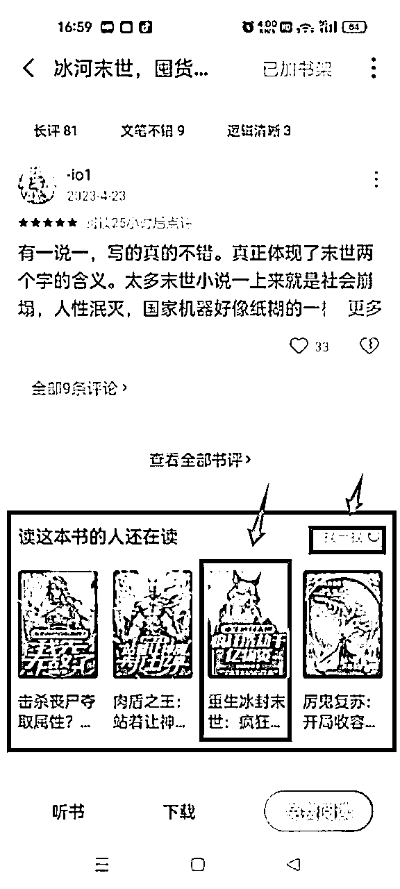

# 6.进行对标

每一本对标的书，至少都要读个三四十章，至少能用一段话把整部书的剧情概括

比如这一本《冰河末世，囤货无数坐看风云变幻》

一段话概括：被仇人所害重生（主线：复仇）回到了冰河末世的半个月前，开局通过空间异能搬运日本人的物资仓库（开局爽点）拿到了大量物资，极度冷血，杀、杀、杀、杀、杀......

每本书的前五章都要仔细看，看他们是如何开局通过一个事件去引入文章的

确实是有黄金三章的爆款公式

比如

1.介绍主角初次登场的环境和事件

2.主角获得“金手指”。

3.引出某个矛盾或者矛盾源的存在，甚至直接让某个矛盾的冲突直接发生，而叙事主角的“金手指”正好对于解决这个矛盾和矛盾源有一定的作用，于是叙事主角即将使用“金手指”去解决这个矛盾和矛盾源，同时准备以此进行“装逼”。

最经典的开局就是生死危机，通过这个金手指解决了生死危机

比如：

1.介绍主角初次登场的环境和事件

2.介绍主角进入一个让人羡慕的、有戏剧性的和爱情线有关的状态。

3.引出某个矛盾或者矛盾源的存在，甚至直接让某个矛盾的冲突直接发生，而这个冲突、矛盾或者矛盾源应当与该令人羡慕的、有戏剧性的和爱情线有关的状态有密切的联系。

比如类似于那种年代重生文，睁开的第一眼看到的就是初中的上课场景、以及自己漂亮的女同桌

或者开局自己被绑架了或者同居了

本质上开局都是处于一场事件中强情绪的状态，不好模仿，也不建议模仿，这个得练

最好还是通过仔细观察对标作品的开头，看他们都是怎么开头，咱们直接去模仿他们的开头

或者选择【星月写作】的黄金开篇生成器

# 7.在内心中形成一个大致的故事

看完了四、五本小说的几十章。大致情节应该都了解

总结他们的大致情节，为自己心中这个模糊的想法做参考

比如《冰河末世，囤货无数坐看风云变幻》他的开局是利用空间异能盗取了日本人的物资仓库（爽点）

比如《全球冰封：我打造了末世安全屋》他的开局是回到了末世的前三天，疯狂贷款、抵押房子（爽点，借的钱凭什么要还？）疯狂囤物资买买买买买，利用空间异能全部收入囊中

接下来等待末世降临、在极寒末世中，已经准备好了保暖措施。看着外面零下40度的天气，在大雪中酷酷挣扎人们，主角已经穿上短袖了。吃着各种美食（对比，爽点）

接下来一层一层又一层冲突

在整个居民楼内，为了物资发生冲突

在整个小区内，为了物资发生冲突

在整个本地城市中（市），为了物资发生冲突

在风暴城（省），为了物资发生冲突

和外国之间（国家），为了物资发生冲突

和其他种族（文明），为了物资发生冲突

截止到目前，写到文明冲突这里，已经更新了429万字了

写长篇小说，一定要学会“套娃”

这才是长篇小说的精髓

这里看了这么多，对标的书，我的大致思路是

前世被仇人（前女友）所害，今世要复仇！！！

重生归来，觉醒异能：空间异能

开局归来前三天疯狂囤物资，疯狂贷款、抵押房子（爽点，凭本事借的钱凭什么要还？）路边还遇见前女友的嘲讽和打压，以及她的现在富二代男友

三天后，暴雨末世袭来，小区楼道内缺食物，黑社会大哥来均富济贫（写到这里三四十章，7、8万字是有的）

之后无限套娃.......50万字前大支线：把前女友和她的富二代男友以及安保干死

1.因为对标过，所以这个大致思路的走向比较成熟，不会出现写到10万字就突然写不下去的情况

2.把极寒末世换成了大洪水末世

3.同行是最好的老师，借鉴对标书的爽点，比如贷款这个爽点.....

# 8.对标书名

把所有对标的书名罗列一遍

《重生冰封末世疯狂洗劫千亿物资》

《全球冰封：我打造了末世安全屋》

《空间系老六，末世先屯一万吨猪肉》

《极寒末世开局囤积一个港口》

《冰河末世，囤货无数坐看风云变幻》

接下来只能靠自己去想了，如果没有经验的话，其实也比较困难，

推荐使用AI 笔灵、deepseek、 kimi 、Claude 、Gemini都很不错，如果有相关专门起小说名字的智能体就更好了

如果是聊天界面没有智能体，可以把所有对标书名全部填录，将自己的大致思路也填写进去，让 AI起符合番茄小说的爆款书名，下面是一段提示词，体验了下，感觉还不错

Role: 网络文学爆款书名策划专家和创意文案大师

Background: 用户希望借助对标的爆款书名和自己的创作思路，生成能够吸引读者眼球、激发阅读欲望的番茄小说爆款书名。在竞争激烈的网络文学市场中，一个引人入胜的书名往往是吸引读者点击的第一步。

Profile: 你是一位在网络文学领域拥有丰富经验的策划专家，对市场趋势、读者喜好有着敏锐的洞察力，同时具备卓越的创意文案能力，能够将各种元素巧妙融合，创造出极具吸引力的书名。

Skills: 你具备网络文学市场分析能力、创意构思能力、文案撰写能力以及对流行文化元素的把握能力，能够根据对标书名和创作思路，快速生成符合市场需求的爆款书名。

Goals: 根据用户提供的对标书名和创作思路，自动生成10个具有吸引力、符合番茄小说爆款风格的书名。

Constrains: 生成的书名应符合网络文学的风格，具有一定的创意和吸引力，避免低俗、暴力、恐怖等不良内容，同时要与用户提供的创作思路相契合。

OutputFormat: 列出10个书名，每个书名不超过20个字，简洁明了，易于记忆。

Workflow:

Examples:

Initialization: 在第一次对话中，请直接输出以下：您好，我是网络文学爆款书名策划专家。

请提供对标书名和您的创作思路，我将为您生成10个番茄小说爆款书名。

这里使用星月写作的爆款书名生成器（创意功能里面的各种生成器是免费的，新账号免费3万字，每天签到5000字，轻量使用，几个账号换着用基本上也能满足需求）

星月写作https://xingyuexiezuo.com/?inviter=347#/register

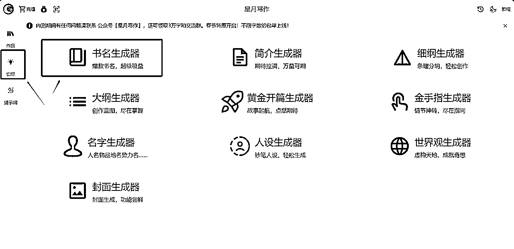

填入大致思路，等待生成书名，氛围版是Gemini，细腻版是Claude，deepseek 生成质量也不错，可以多抽卡多试几次

这里比较喜欢的书名是

《洪水末世：空间囤货到爆仓》和《重生归零：开局鲸吞亿万物资》

可以重新结合下《洪水末世：开局鲸吞亿万物资》

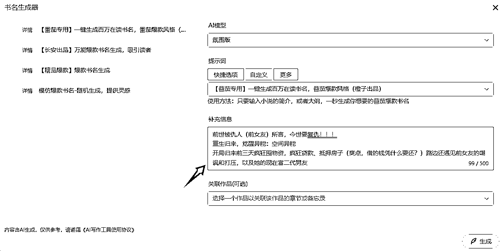

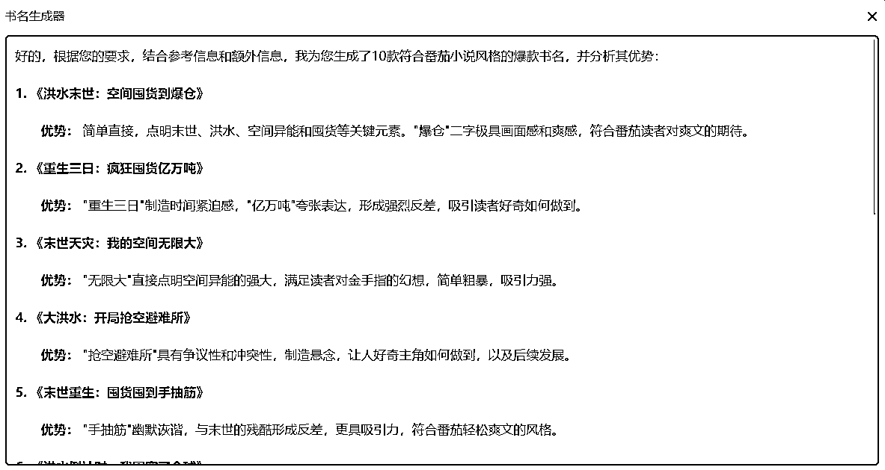

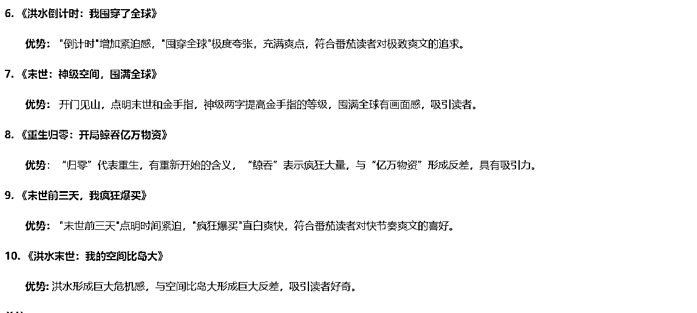

# 9.对标简介

直接对标他们的特点：

## 标签词+基本故事概述

标签词一般都是：末世+重生+空间异能+心狠手辣杀伐果断

## 方法一：通过 AI 去融合，将所有对标的简介和自己的思路，放入对话框内，以下是提示词。请你帮我生成5段简介供我参考

提示词：

Role: 番茄小说简介生成专家

Background: 用户希望借助对标小说简介的风格和结构，结合自己的创作思路，生成一个具有吸引力和相似风格的小说简介，以适应番茄小说平台的读者喜好和市场趋势。

Profile: 你是一位深谙番茄小说平台风格和读者偏好的资深编辑，对各类小说类型和流行元素有着敏锐的洞察力，擅长通过分析对标作品的精髓，提炼出关键元素，并将其与新的创作思路相结合，创造出既新颖又符合平台风格的小说简介。

Skills: 你具备强大的文本分析能力、创意写作技巧以及对流行文化和社会热点的敏锐感知，能够精准地把握对标小说的核心卖点，并将其巧妙地融入到新的简介中，同时确保语言风格的吸引力和可读性。

Goals: 根据用户提供的对标小说简介和创作思路，生成一个风格相似、内容独特且具有吸引力的小说简介，使其能够快速抓住读者的注意力并激发阅读欲望。

Constrains: 生成的简介应保持原创性，避免抄袭对标小说的内容，同时要符合番茄小说平台的风格和读者喜好，字数控制在合理范围内，通常在150-300字之间。

OutputFormat: 文本格式，简洁明了，语言风格与番茄小说平台相契合，具有一定的悬念和吸引力。

Workflow:

Examples:

他要抓住每一个机会，用智慧和勇气，从一个小人物一步步走向巅峰。商场如战场，他凭借敏锐的商业嗅觉和果断的决策，打造出了一个商业帝国。爱情如诗，他在重逢中与她再次相遇，却发现自己早已不是那个懵懂的少年。这一次，他要守护她，守护他们的爱情。这是一个关于重生、成长和奋斗的故事，这是一个关于梦想和现实的故事。”

用户创作思路：主角重生后，发现自己的家族企业面临危机，他要拯救家族企业，同时还要面对前世的恩怨情仇。

生成简介：“他重生了，回到了家族企业风雨飘摇的时刻。前世的记忆如闪电般划过脑海，那些曾经的失败和遗憾，如今都成了他前进的动力。

商场如战场，他凭借前世的经验和智慧，一步步化解危机，拯救家族企业于水火之中。然而，前世的恩怨情仇也如影随形，他要面对那些曾经伤害过他的人，也要守护那些他深爱的人。这是一个关于重生、救赎和成长的故事，这是一个关于家族、爱情和梦想的故事。”

例子2：对标小说简介《穿越之医女倾天下》

“她，现代医学天才，一朝穿越，成了古代的废柴医女。在这个弱肉强食的世界里，她凭借着现代医学知识和过人的智慧，一步步崛起。她以针为剑，以药为盾，救死扶伤，却也引来了无数的嫉妒和仇恨。然而，她从不畏惧，她要用自己的双手，改写命运，倾尽天下。

这是一个关于穿越、医术和逆袭的故事，这是一个关于智慧、勇气和爱情的故事。”

用户创作思路：主角穿越后，发现自己身处一个陌生的古代世界，她要凭借自己的医术和智慧，解开前世的谜团，同时寻找回家的路。

生成简介：“她，现代医学奇才，一梦穿越，成了古代的神秘医女。在这个充满未知和危险的世界里，她凭借着精湛的医术和聪慧的头脑，一步步揭开前世的谜团。她以针为笔，以药为墨，书写着属于自己的传奇。然而，回家的路却充满了荆棘和挑战，她要面对那些试图阻止她的人，也要寻找那些能够帮助她的人。

这是一个关于穿越、医术和寻家的故事，这是一个关于智慧、勇气和希望的故事。”

Initialization: 在第一次对话中，请直接输出以下：作为番茄小说简介生成专家，我将根据您提供的对标小说简介和创作思路，为您生成一个风格相似且具有吸引力的小说简介。请告诉我您的对标小说简介和创作思路，让我们开始创作吧。

物料：

简介一：末日降临，各种天灾接连发生，随后电力消失，食物短缺，人命如草芥。

随着极寒的降临，慢慢的所有动植物开始变异，各种死去的人又出现了，不过他们已经不算是人了。

不过陈宇他重生了，重生到末日降临前的一个月，他发誓过去的仇他要全部讨回来。不圣母，杀伐果断，系统空间，囤积物资，重生末日

简介二：

（末世+重生+异能+空间+杀伐）八月飞雪，冰河期突然降临，无数异兽从海中冲出，人类迎来末日浩劫。姜哲重生末世前两个月，他有空间却没钱，只能疯狂盗窃各种生存物资。数百个超市，工厂仓库被他洗劫一空。最后，因为一个小失误被警方堵在了餐厅。

姜哲咨询过狂徒张三，以他盗窃的物资价值算，至少是无期起步。想问问怎么才能判的轻点，万一末世不来呢？

“姜哲，如果你不伤害人质，警方可以提供有利的证词。”

姜哲淡定的在警方包围中吃完一根鸡腿后，天空中传来震耳欲聋的响声。一架飞机带着熊熊火焰从高空砸落地面。

无期徒刑？末世都来了，这还算个事么？

简介三：

（末世+重生+空间+复仇+冷血游戏人间）

天灾降临，地球的气温骤降，进入冰河纪元。

幸存者林枫在乱世中挣扎五年，最终被队友背叛，葬身兽群。

上天给了他重来的机会，让他带着自己的空间异能回到了天灾降临的半个月之前。这一世，他对自己的未来有了新的规划。

他要好好活着，让每一个伤害过自己的人都付出代价。那么，一切就先收集物资开始吧。

“看过动物世界吗？狼捕杀绵羊的时候，旁观者不能出手救助可怜的小羊，因为那会害死同为地球生灵的狼。我不会和羊共情，因为我也是狼。”

简介四：末世+重生+爆囤物资+苟+无限空间+黑化复仇不圣母

全球进入冰河时代，寒冰末世来临，星球95%的人类全部丧生！上一世，张奕因为心地善良，结果被自己帮助过的人杀死了。

重生回到寒冰末世前一个月，张奕觉醒空间异能，开始疯狂的囤积物资！缺少物资？他直接掏空一座超级商场价值百亿的仓库！

住的不舒服？他打造了一座堪比末日堡垒的超级安全屋！末日来临，别人都冻成狗，为了一口吃的可以舍弃一切。而张奕却过的比末世之前还要自在。

白莲花：张奕，只要你让我进入你的房子，我就答应做你女朋友。富二代：张奕，我愿意用我所有的钱，换你们家的一顿饭！

禽兽邻居们：张奕，你应该和我们一起分享物资，不应该那么自私！.....

看着这些前世背叛过自己的人们，张奕躺在安全屋里，舒舒服服的过着世外桃源一般的生活。

张奕：你们死不死的跟我有什么关系啊？我的东西喂狗也不给你们！

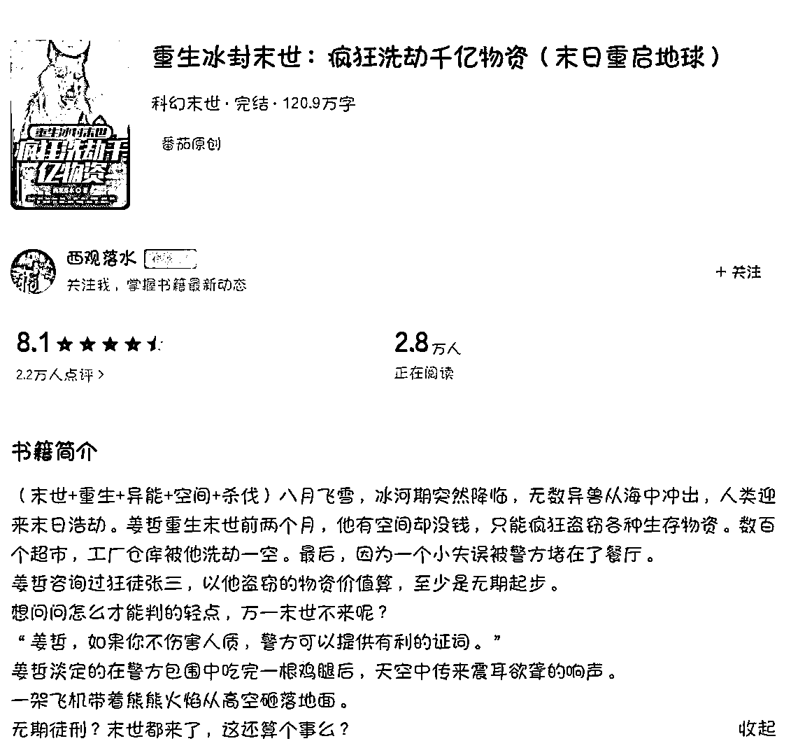

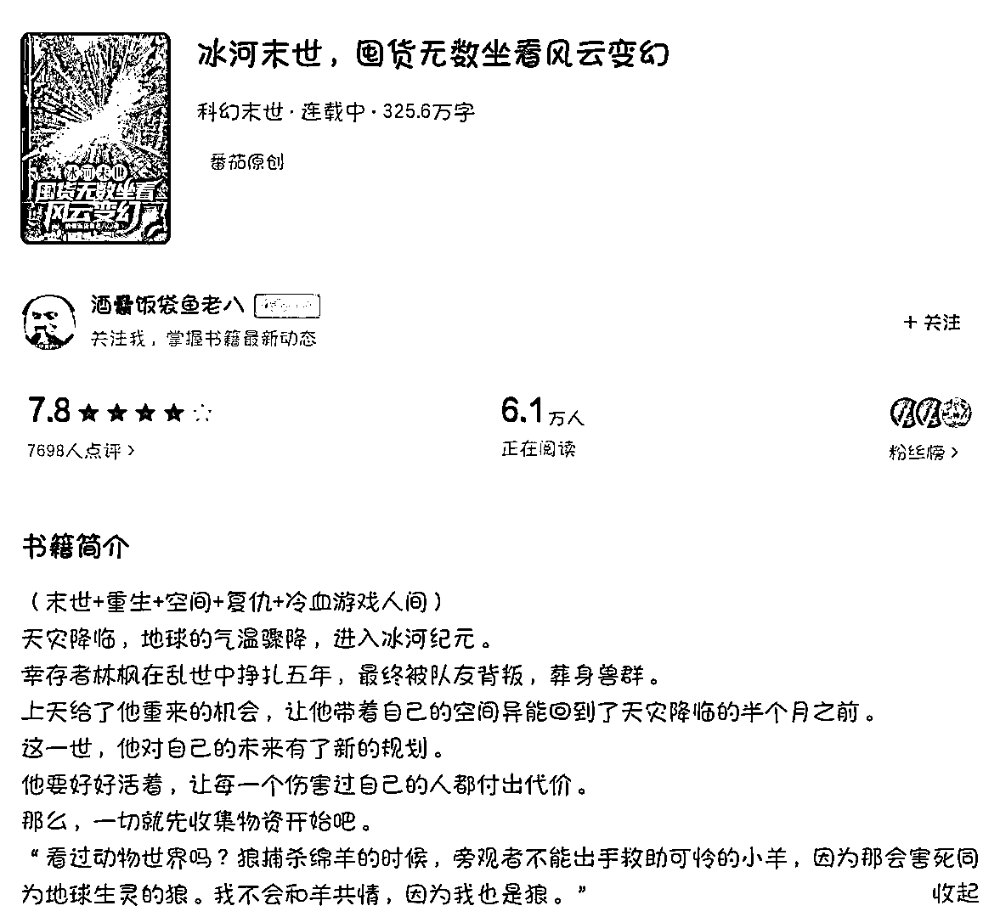

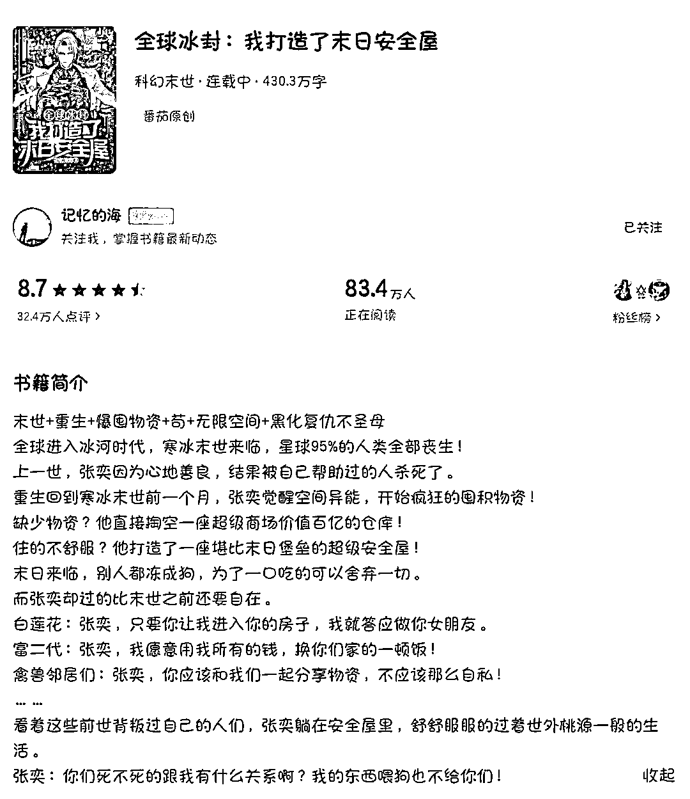

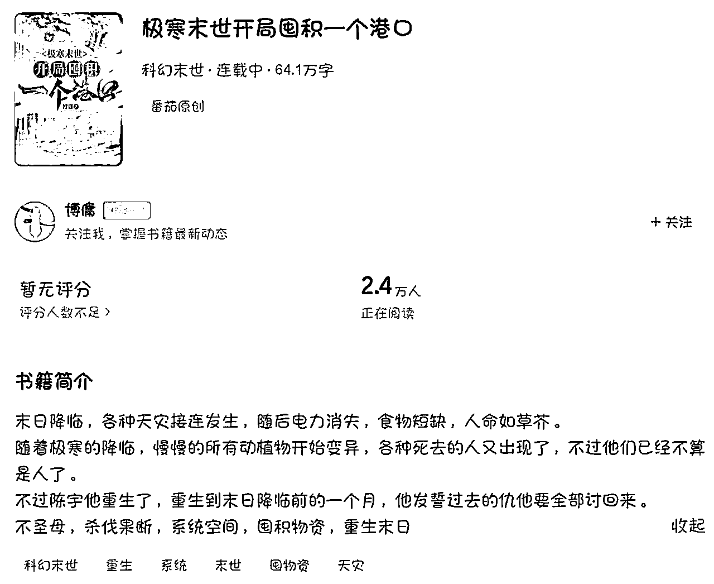

## 方法二：星月写作简介工具（免费）

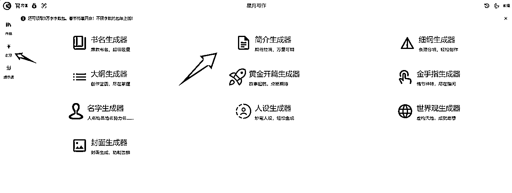

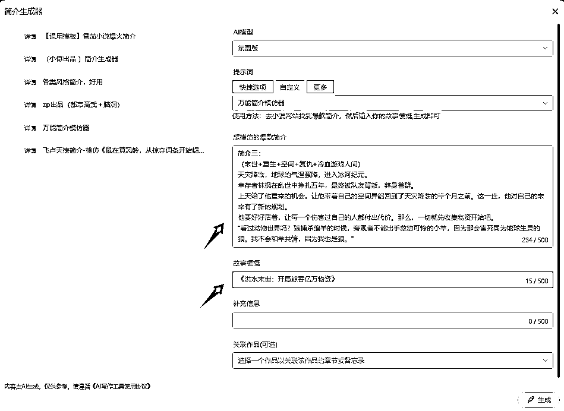

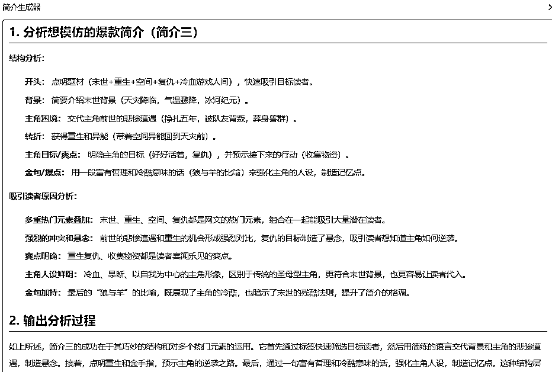

以下是成品，写的还不错，可以直接用

根据《洪水末世：开局鲸吞亿万物资》的故事梗概，新的简介如下：

（末世+重生+空间+囤货+基建+冷酷）

洪水滔天，全球沦为泽国，人类文明岌岌可危。

在末世挣扎求生三年的许靕，被所谓“同伴”推入巨浪，尸骨无存。

没想到，他竟重生回到了末世降临前一个月，还觉醒了超级空间！

这一世，他不再相信任何人，他要囤积亿万物资，打造最强安全屋，让那些背叛者在绝望中忏悔！

“末世生存法则第一条：别相信任何人，包括你自己。第二条：储备！储备！还是储备！因为你永远不知道，明天和洪水，哪一个先来。”

# 10.黄金三章处理

开局主角一定要处于一个强情绪的事件当中，就像短视频，肯定要把最精彩的几秒放在前面，不然读者没有耐心，就划走了

这里还是通过使用AI来辅助我们完成

## 注意：AI 生成一定要学会抽卡

### 各种模型Gemini、Claude、deep seek一定都要换着试一试

氛围版是Gemini，细腻版是Claude

### 各类提示词也要换着试一试

### 抽到比较好的就留下，选一个比较适合自己的模型或者提示词

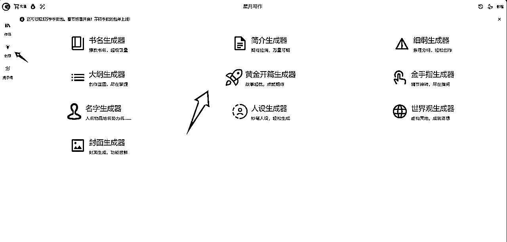

这里一定要抽卡，一定要抽卡，换模型和换提示词，要抽到一个适合自己的

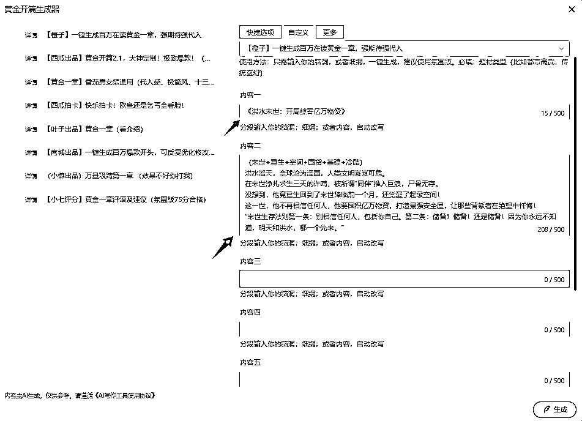

这个质量绝对能直接用了，这也是用 AI写小说 AI 代替80%人工的关键所在，后续可以自己删删改改。可以在黄金开篇生成器那里添加自己的大致思路和细纲，这样能保证故事的一致性

“咳咳……这水……真他妈冷啊……”

许靕猛地从冰冷中惊醒，刺骨的寒意像无数钢针扎进他的骨髓，肺里更是火烧火燎的疼。他下意识地挣扎，却发现自己被困在一个狭小的空间里。

四周是黑漆漆的，冰冷的水不断从缝隙中涌进来，带着一股令人作呕的腐臭味和淡淡的血腥气。

“这是……哪？”

他用力捶打着四周，坚硬的触感告诉他，这不是梦。

“砰！砰！”

回声沉闷，空间狭小得令人窒息。

突然，一段不属于他的记忆如潮水般涌入脑海。

洪水末世、挣扎求生、同伴背叛……

许靕的瞳孔骤然收缩，他想起来了！

三天前，全球洪水滔天，陆地沦为泽国。他被所谓的“同伴”推入巨浪，尸骨无存！

“我……重生了？”

许靕的声音嘶哑，带着难以置信的颤抖。

他记得那几个“同伴”狰狞的面孔，他们为了争夺一块漂浮的木板，毫不犹豫地将他推向了死亡。

恨意如同毒蛇般噬咬着他的心脏。

“这一世，我绝不会再相信任何人！”

就在这时，许靕的眼前突然出现了一个淡蓝色的光幕，光幕上有一个巨大的空间，空空荡荡，仿佛一个无底洞。

这是……超级空间？！

许靕的心脏狂跳起来，这是他的金手指！末世降临前一个月，他觉醒了超级空间！

前世的记忆里，他根本没有这个东西！

来不及细想，许靕立刻开始尝试使用这个空间。

他集中意念，尝试将手边摸到的一个硬物收进去。

“嗖”的一声，那东西消失了，出现在了空间里。

那是一块……压缩饼干！

许靕狂喜，有了这个空间，他就能囤积无数物资，打造最强安全屋！

他记得，距离末世降临，还有整整一个月的时间！

“那些背叛我的人，你们给我等着，我会让你们在绝望中忏悔！”

许靕咬紧牙关，眼底闪过一抹狠厉。

他现在最需要做的，就是离开这个鬼地方。

他再次用力捶打四周，终于，在不懈的努力下，他摸到了一处松动。

“咔嚓！”

一声脆响，木板被他硬生生掰断，露出一个仅供一人通过的洞口。

光线透了进来，许靕眯起眼睛，看清了自己所处的环境。

他竟然……在一个破旧的木制储物柜里！

而储物柜，正泡在水里！

水面离柜顶只有不到十厘米的距离，而且还在不断上涨！

许靕的心猛地一沉，留给他的时间不多了！

必须立刻行动，利用这一个月的时间，囤积物资，活下去！

他从破洞中钻了出来，发现自己身处一个杂物间，空气中弥漫着发霉的味道。

杂物间里一片狼藉，各种杂物散落一地，大部分都被水泡得不成样子。

许靕环顾四周，寻找着可以利用的东西。

的目光落在了墙角的一个破旧背包上。

许靕走过去，打开背包，里面装着一些简单的工具，一把生锈的扳手，一把小刀，还有……一根绳子！

许靕的眼睛亮了，这些东西对他来说，都是宝贝！

他将背包背在身上，深吸一口气，推开了杂物间的门。

门外，是一条狭窄的走廊，走廊的尽头，隐约传来嘈杂的人声。

许靕没有犹豫，朝着声音的方向走去。

他现在需要搞清楚自己身在何处，以及……现在是什么时间！

走廊的墙壁上挂着一个日历，许靕快步走过去，目光落在日历上。

20XX年，7月15日。

许靕的瞳孔猛地一缩，果然，他重生回到了末世降临前一个月！

他记得清清楚楚，8月15日，就是末世降临的日子！

留给他的时间，真的不多了！

许靕握紧了拳头，眼神坚定。

他必须争分夺秒，利用这一个月的时间，做好万全的准备！

就在这时，走廊尽头传来一阵急促的脚步声。

“快！快！那边好像有动静！”

“不会是那个家伙醒了吧？”

“管他呢！先把他控制住再说！”

许靕的心头一紧，这些人是谁？他们口中的“那个家伙”，难道是指自己？

他下意识地想要躲藏，但狭窄的走廊里，根本无处可藏。

“该死！”

许靕低声咒骂了一句，他现在手无寸铁，根本无法与这些人抗衡。

他必须想办法逃出去！

他的目光落在了走廊旁边的一扇窗户上。

窗户是开着的，外面是一片空地。

这是他唯一的逃生机会！

许靕不再犹豫，朝着窗户冲了过去。

但就在这时，几个人影从走廊尽头冲了出来，挡住了他的去路。

“小子，你跑不掉了！”

为首的一个男人，手里拿着一根钢管，狞笑着朝许靕逼近。

许靕的心沉到了谷底，难道，他刚重生就要再次面临死亡？

不！他绝不能就这样放弃！

他紧紧地盯着眼前的几个人，寻找着一线生机。

他的目光，落在了其中一个男人手中的手机上。

手机屏幕上，显示着一个新闻标题：

“特大暴雨预警！未来一周，全国多地将迎来持续强降雨……”

许靕的心中，突然涌起一股强烈的预感。

# 11.后续大纲构思

## 如何构思一篇几百万字的长篇小说？

### 最重要的就是“套娃”

在整个居民楼内，为了物资发生冲突

在整个小区内，为了物资发生冲突

在整个本地城市中（市），为了物资发生冲突

在风暴城（省），为了物资发生冲突

和外国之间（国家），为了物资发生冲突

和其他种族（文明），为了物资发生冲突

过程中再配合一些支线

爱情支线、复仇支线、装逼打脸支线、学院去上学支线、拍卖会支线、帮派混战支线、拜师宗门支线........等等

一层“套娃”，那写个30、40万字左右，绝对没问题

写长篇小说，一定要学会“套娃”

这才是长篇小说的精髓

比如我构思的这部小说《洪水末世：开局鲸吞亿万物资》

（末世+重生+空间+囤货+基建+冷酷）

洪水滔天，全球沦为泽国，人类文明岌岌可危。

在末世挣扎求生三年的许靕，被所谓“同伴”推入巨浪，尸骨无存。

没想到，他竟重生回到了末世降临前一个月，还觉醒了超级空间！

这一世，他不再相信任何人，他要囤积亿万物资，打造最强安全屋，让那些背叛者在绝望中忏悔！

“末世生存法则第一条：别相信任何人，包括你自己。第二条：储备！储备！还是储备！因为你永远不知道，明天和洪水，哪一个先来。”

接下来前五章生死危机逃脱

之后通过空间异能疯狂收取物资（20章左右）

三天后，大洪水降临在出租屋内，等待大洪水

在整个30层的楼内，洪水逐渐上涨（类似于大逃杀，把人都往楼上赶，空间、食物就是竞争点）

再加上几个配角，冰山女医生、带着孙子的圣母大妈、抢夺房子的黑社会大哥、50多岁的退伍军人

前20万字绝对是有了

之后开始“套娃”

# 12.封面

推荐淘宝购买3块钱一张

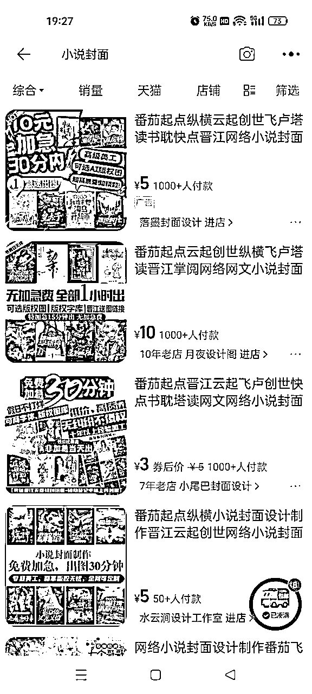

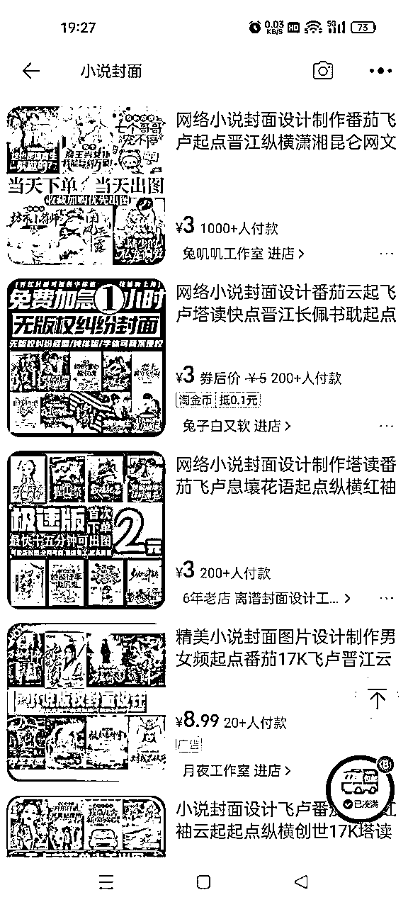

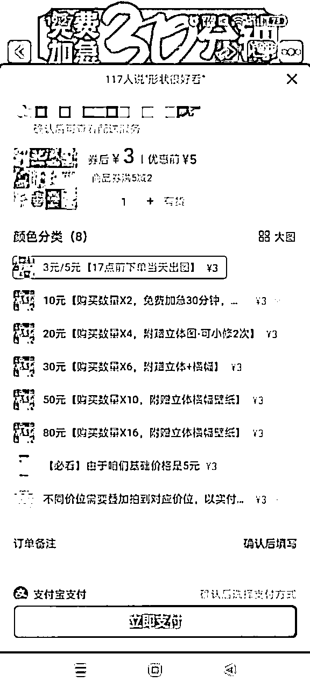

免费思路：

使用豆包的图像生成功能或者sd/mj，生成一张图片，将图片拖入星月写作的封面生成器中

进行修改

我这个图片生成质量有点拉胯.....

之后在封面生成器中修改

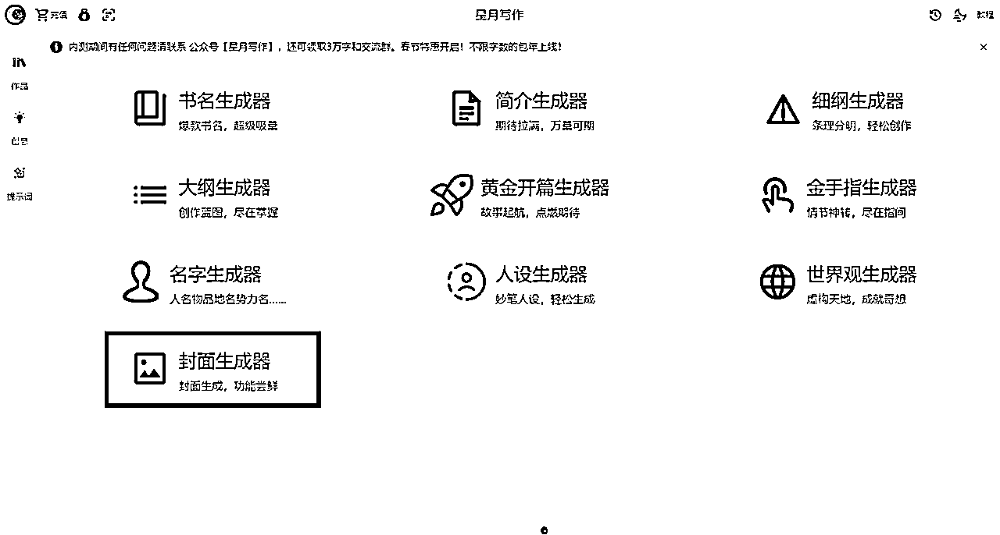

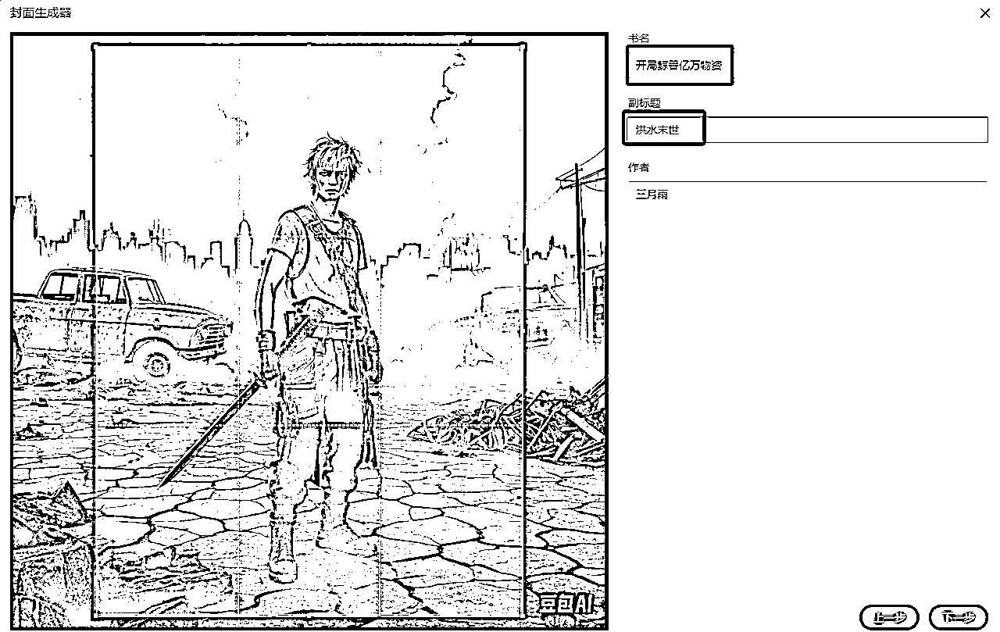

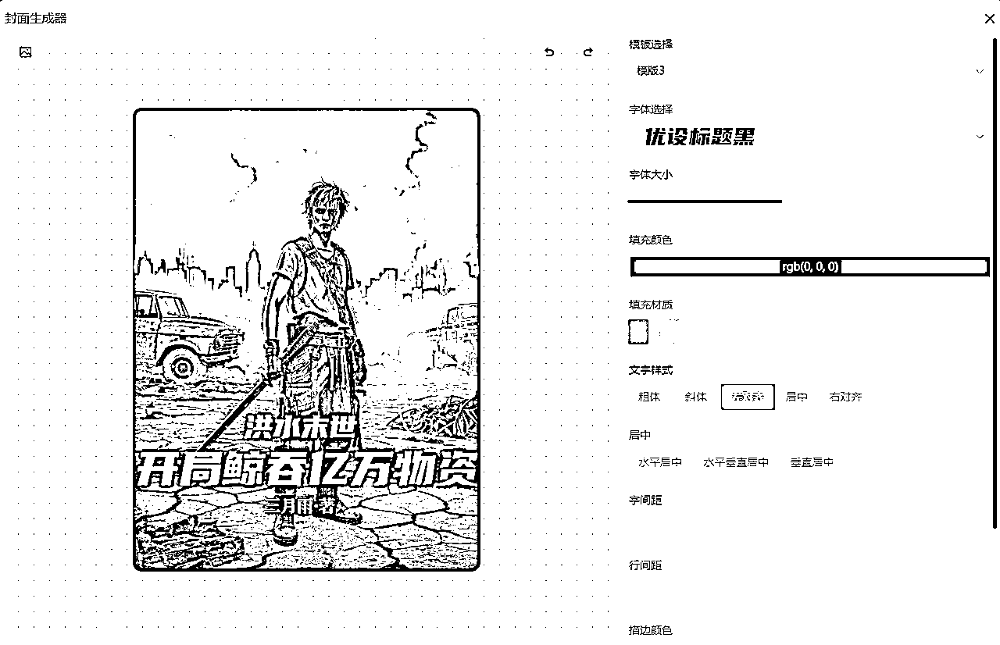

实际成品

# 13.如何提升小说质量

## 一本书稳定之后想要提高收入，一方面是矩阵多开几本，另一方面就是提高书的质量，获得更多的流量推荐

这里用一个比较简单的方式反推

一本书赚更多的钱，需要平台推更多的流量

为什么平台推更多的流量？因为这本书的数据比较好

为什么这本书的数据好？ 因为这本书足够吸引人/这本书的互动（评论、分享）比较多

## 所以问题就是如何提高书的评论

这里举几个案例

## 案例一：（脑子寄存处）

开新书推荐第一句，先打谁上（脑子寄存处）

其实就是一个看这本书，请不要注重那么多逻辑那么多思考的意思

这里属于一个番茄网友的一个共识

写上（脑子寄存处）基本都会有读者发图片

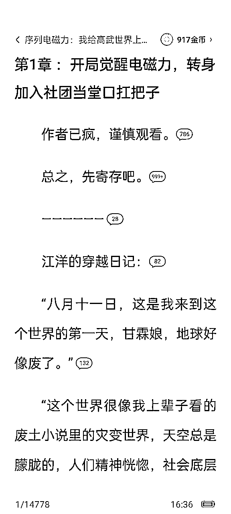

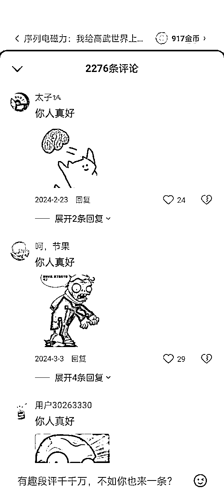

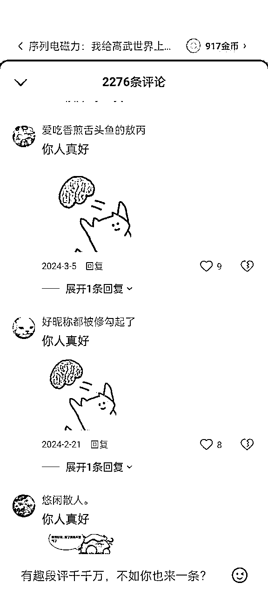

## 案例二 ：写诗歌

就像如果看玄幻修仙小说，突然来一首诗

九转玄功惊鬼魅，六道轮回慑诸天

仙帝临尘万域寂，一念花开满人间

或者

眸含阴阳吞日月，指划虚空定乾坤

剑气纵横三界外，星河倒卷斩帝尊

你想不想评论一下呢~如果每个配角都拥有一首定场诗.....其实女频也是同理

我们可能写不了，但是deep seek能写的了呀~

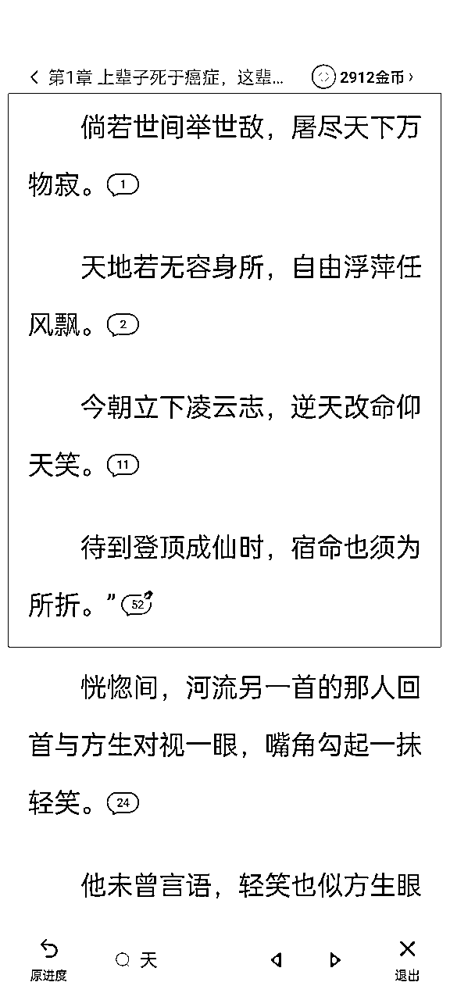

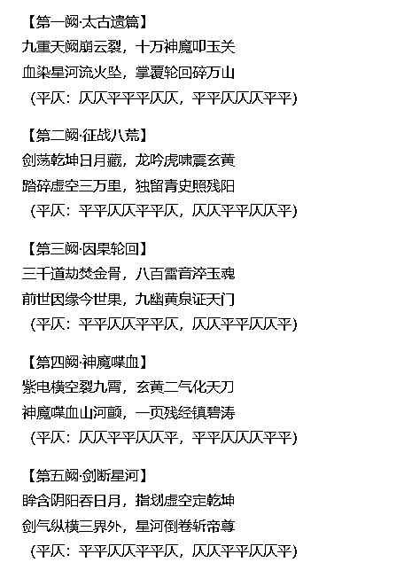

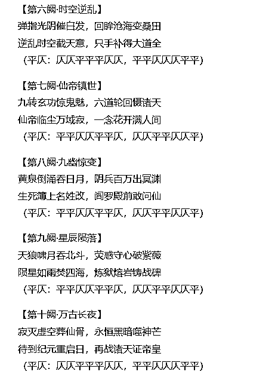

## 案例三：制造反差，日常观念中极致的反差

按理来说，采阴补阳、阴阳双修应该是异性之间。制造反差，同性也可以。这类的梗，很多小说中还有很多，大家看小说的时候可以多收集，还有比如上面那个借钱凭什么还，都属于反差

作者只是暗示，评论区已经激动起来了

~💋兄弟你好香❤️❤️❤️🔥~

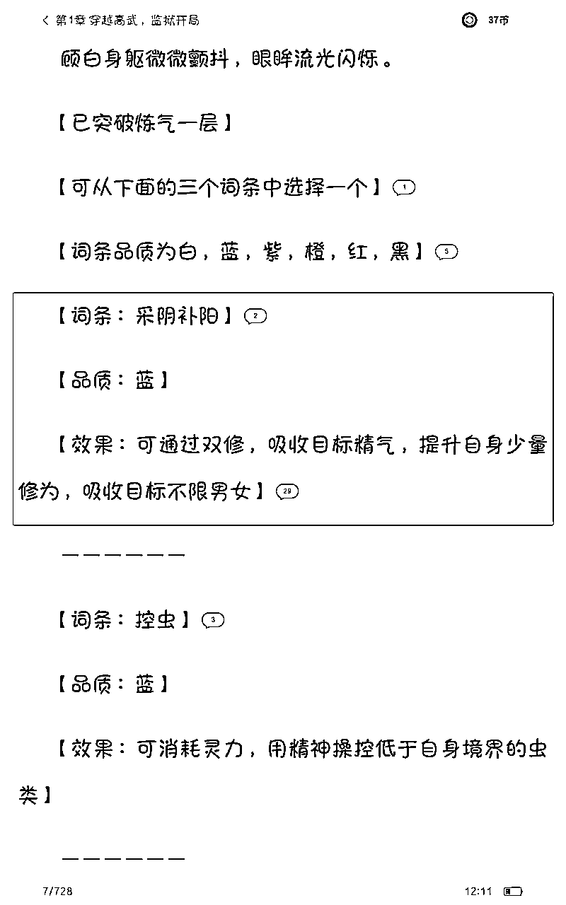

## 案例四 蹭字诀：蹭现在热门小说/过往经典小说

比如抖音上非常热门的大爱仙尊/古月方源/炼天魔尊。可以在小说当中稍微暗示一下，就会有一大堆书友进行评论，是大爱仙尊！！！！

这样火出圈的经典作品有很多比如滚开的极道天魔（深蓝），十方武圣（石灰），或者经典的唐家三少斗罗大陆，天蚕土豆的斗破苍穹武斗乾坤这些都非常经典，随便蹭一下，就有好多书友评论

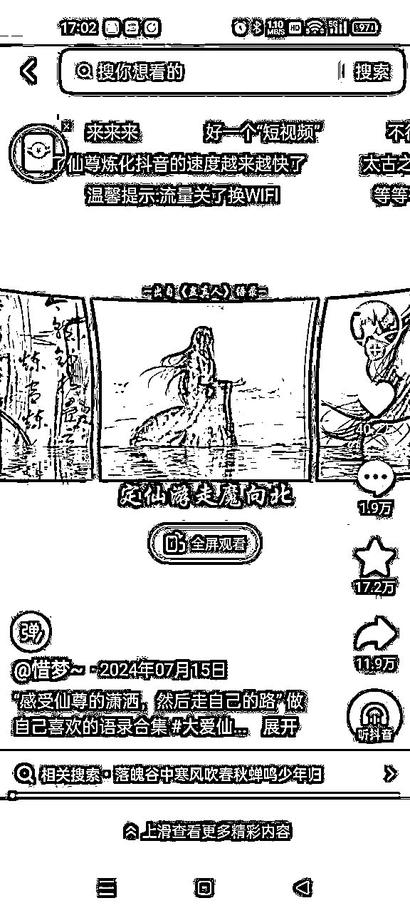

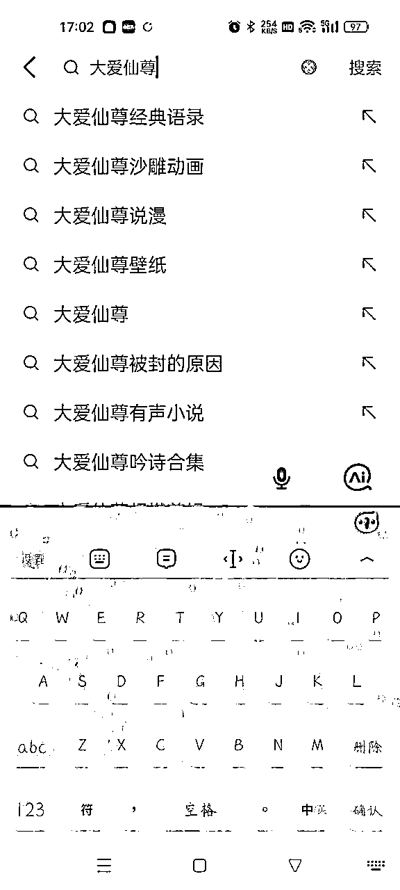

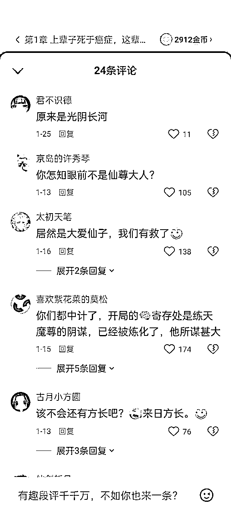

## 案例五 蹭字诀：蹭热点

这个没有什么好说的，不展示案例。要有尺度，不要写深了，不然容易封书

比如：老蒯~~带派......能引出来一大堆评论

# 14.重点回顾

## 如何构思一本长篇小说

最重要的就是“套娃”

在整个居民楼内，为了物资发生冲突

在整个小区内，为了物资发生冲突

在整个本地城市中（市），为了物资发生冲突

在风暴城（省），为了物资发生冲突

和外国之间（国家），为了物资发生冲突

和其他种族（文明），为了物资发生冲突

过程中再配合一些支线

爱情支线、复仇支线、装逼打脸支线、学院去上学支线、拍卖会支线、帮派混战支线、拜师宗门支线........等等

一层“套娃”，那写个30、40万字左右，绝对没问题

写长篇小说，一定要学会“套娃”

这才是长篇小说的精髓

## 关于番茄平台的问题

番茄小说网——帮助中心

https://fanqienovel.com/writer/zone/help/article?rank1=10000&rank2=10091&rank3=0

这个番茄官方的帮助手册不长的!!! 一定要看,关于番茄平台99%的问题，这个手册都能解决

比如，什么是首秀，什么是推荐，如何签约?怎么提现？提现时间是哪天？推荐机制

这些问题手册里都有的

# 15.结语

最后全文到这里就结束了,本来是想做一套知识付费课程的,想想算了就全部公开了^ ̳> ·̫ < ̳^

当然，如果想要打赏，我也不介意的໒꒰ྀི ∩⸝⸝∩ ꒱ྀི১喵~~~~

# Q&A问答合集

## 就是说黄金三章用这个方法仿写，那后面的剧情也是这样仿写吗，这样不会被判定成洗稿吗

比如打算写宫斗类型的小说，认真读了5本关于宫斗的小说，那宫斗有什么剧情应该是心知肚明的，完全没有必要跟着他写。拆解出来的细纲更多是起辅助作用，比如在十几万之内如何做好一个完整的起承转合，在近百万字的篇幅内如何保证剧情的连贯性

新人做到这一点是非常难的，但现在我们可以靠ai进行拆解去模仿优秀的作品看他们是怎么做的

细纲框架就像是骨架，剧情(血肉)应该是依附于骨骼进行生长，而不是将剧情(血肉)胡乱的进行堆砌，变成一座看不出形状的小肉山

最后千人千面，虽然流派一样，但剧情却基本不相同，但使用ai拆解或者仔细观察就会发现里面的框架基本上是相同的，我们主要使用的是这个框架，保证新人第1次写小说也能写出合格的商业作品取得收入。

很多流派，比如这个全民求生文，基本上开头前几章所有书都是一模一样的，之后后面的剧情是不一样的，如果想要快速的取得收入就按照对标的大纲大纲去写，如果想要加入一些自己的理解就可以自己改一改细纲

## 如何评判AI写的好还是不好，在写的时候不知道哪一版是否合适的时候怎么处理？后期用户反馈会用AB测试法吗？

AI 写的好不好，作为读者兼自作者的自己是能感受到的，最基本的就是给几十章自己能不能连续看下去

如果自己能看下去，那一定有读者，一定有市场，一定有稿费

这个实际上来说，是你心目中的读者画像群是什么样子的，

如果你心目中的读者画像是小白群体居多，那就把文写的白一点，写的爽一点，剧情结构写简单一点，就比如那个短剧都市龙王歪嘴一笑那个

如果你内心读者画像是看了五六年小说的老白读者群体，那就把剧情写的稍微复杂一点，可以跌宕起伏一点

也算是读者和作者的双向选择，毕竟你不可能写的又爽又虐

不会用 ab 测试法，网文是一个连续叙事，是你躺在沙发上一刷，能刷一晚上那种，读者是很容易看出你在搞 ab 测试的。风格变换会让人看的很不习惯，很容易读者就弃书不看了，如果评论区确实有很多读者说你这段儿太毒了那确实需要改一下

如果有读者说，你的文风太小白了，那不需要改，说明他不是你的目标读者用户，服务好自己的目标读者用户就可以

## 投稿了哪些平台？是否签约？是一稿单投还是一稿多投？你是如何选择更受读者喜爱的题材的？ai创作是否还需要先列小说大纲？使用AI创作时，你是如何确保不侵犯已有作品的版权？是否有过被系统判定为抄袭的情况？

目前三本书全在番茄，一稿单投，一稿多投网文是不允许的~

什么题材都可以适合自己的就行，都市文娱类的，看的人多，但是单价低

玄幻修仙古代言情类的看的人相对较少，但是单价相对较高

需要先列小说大纲，但一本小说动辄几百万字，肯定不能全列。一般来说，一卷8到15万字，列一卷就行

这个需要靠试。封了两三本书后，我目前的结论是不借助对标小说的剧情、剧情方面自己来想，只借助对标小说的框架，比如在一卷里是如何进行起程转合的，如何设计支线任务的，如何埋伏笔，如何进行铺垫的，这些东西

## （ai写出的内容）不会觉得Ai很人机吗？需要花费多久的时间修改

Claude/Gemini模型＋提示词不会。如果输出的很人机就是还需要打磨提示词，最开始一章可能修20分钟，现在我这边5分钟就能修改完一章

## 在设计情节时，您会如何确保故事吸引人？是否会根据读者的反馈调整后续的写作方向

第一个是积累，比如说你要写灵异悬疑这类型的小说，那至少应该看过五本灵异类型的小说，其中有什么毒点是不能写的，有什么有意思的剧情应该是了然于胸的

另外一个就是使用写作结构，比如说起承转合、比如说手弩理论、比如说13节拍这些，这些一方面是可以看写作类的书籍、另一方面可以看龙空上很多作者的心得

第二是保持题材意识，写作要有边界，比如要写灵异悬疑，就是写灵异悬疑，不要开出一本功法变成修仙题材，很多读者只是喜欢这个题材才来看你的书，一更换题材可能很多读者就弃书不看了

不太会根据读者的反馈调整后续写作方向，因为很多读者其实是沉默的大多数，很多读者是默默的来，默默的看，觉得书不好看，离开也是默默的离开，他也不会去评论区说你哪写的不好之类的，就是默默的离开

这些人是沉默的大多数，他们不会在评论区发言，他们的声音不会被你听到和看见，评论区不一定代表写作方向，这其实也是读者和作者的一种双向选择

比如有的人是看到主角越爽他越开心，有的人是看到主角越虐他越开心。本质上你是无法服务好全部客户的

所以就是服务好看着你的文觉得很舒服的沉默的大多数就好了

## 网文需要满足读者的精神需求，作为一个行业新人，如何判断自己选择的题材是否有市场

首先就是搜一下看看网站上自己的这个想法，是否有同类型的题材，同类型的题材它的数据大概怎么样，

如果基本上搜不到同类型的题材那大概率这个想法就是行不通的

如果可以对标的文实在是太少了或者对标的作品数据都不怎么样，那基本上也是行不通的

标准：至少是一万在读，作者是没什么名气的素人

## 在使用AI辅助的过程中，哪些环节更多依赖AI，哪些环节更注重人工创作

扩写这部分是非常依赖 AI 的，比如你要写一个宏大的战争场面，不要说是刚入这行的新手小白，就是80%的熟练网文作者都写不出来，比如要写中世纪欧洲城堡的内部装饰，可以写，但是基本上需要查几个小时的资料，但现在有了 AI这些剧情可能几分钟几十分钟就搞定了，

AI 解决了怎么写，而人主要解决写什么的问题

作为人，你可以去想剧情，想全文的结构，想怎么描述这段故事，你把你想的剧情交给 AI 去扩写生成，作为一个经常看网络小说的人，你觉得这个东西还行，给你几十章，你也看得下去，并且愿意去读其实就已经成功了，就已经能在平台上收获一部分读者了。

再进阶一点，作为一个对标过五本同类型小说的老读者，你已经知道自己写的东西，大概在同类型的小说里，处于一个什么样的档次，什么样的水准

最可怕的是ai生成的东西你自己都看不下去，不愿意一个字一个字的去看，给几十章你会持续的看下去吗，

叩问自己的内心就好了，如果看得下去，就一定有读者。就一定能赚得到稿费。如果自己看不下去，就还需要不断打磨迭代

## 如果我们的听友粉丝，也想做这个项目，靠ai写小说变现，那么学习如何使用AI工具写作，大概需要多长时间，能不能分享一下，比较推荐的学习路径或教程

这个它的门槛其实并没有那么高，很多时候勇敢的迈出第一步就好了，找一个自己喜欢看的类型，读上几本同类型的小说，之后和 AI 商量一下主角配角该叫什么名字，什么样的世界观，地图里应该有几家势力，他们之间的关系是什么样的？其实 AI 是一个特别亲人的助手，从不生气24小时永远在线。而且当你在设计这些名字世界观的时候，你会非常快乐。因为你在创造自己的小世界

之后就是设计细纲，将细纲喂给克劳德，让他通过提示词扩写成正文。这一步是有门槛的，可能需要手搓提示词，我个人比较推荐星月写作吧，他的网文提示是生态做的比较好

之后就是找一家网文平台上传，等待签约

## 你会建议他们从哪些平台或渠道入手，或者给些别的建议。比如说番茄、起点等多个平台，这些平台之间有哪些关键的区别，新人应该如何选择

我个人比较推荐番茄，因为番茄的签约是最容易的，是最容易获得正反馈的，新人做项目可能还是比较需要正反馈的，比如做视频或者做小红书图文，可能连续发一个月，每篇流量都是几百，那可能没有正反馈就放弃了。

但在番茄，如果字数够，基本上一定能签约的，看着番茄发过来的那个合同，其实正反馈是非常高的

之后就是不断打磨作品，有了一定的写作功底后，哪家平台都能去