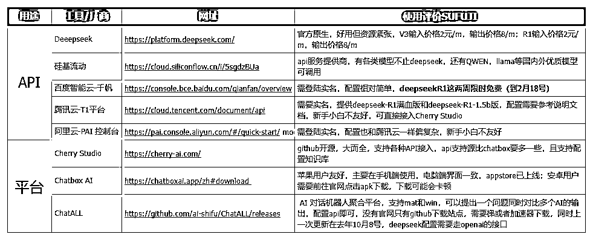
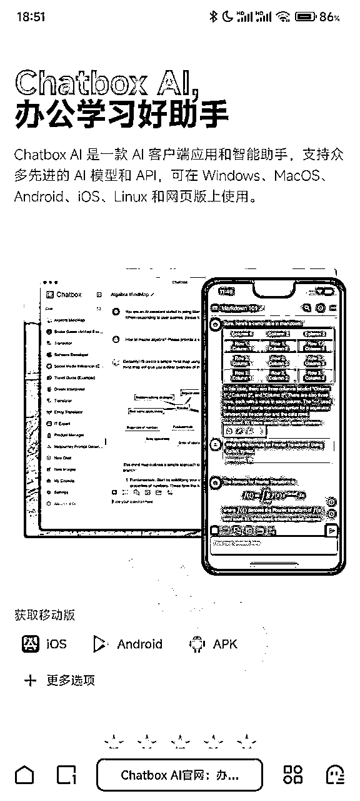
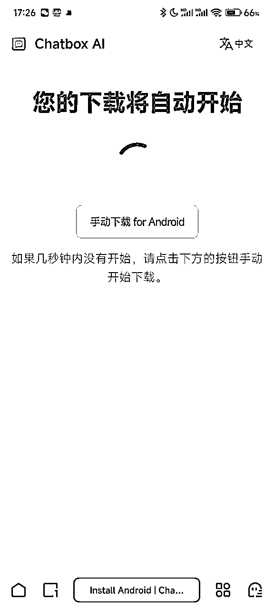
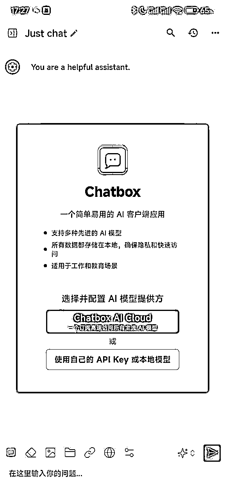
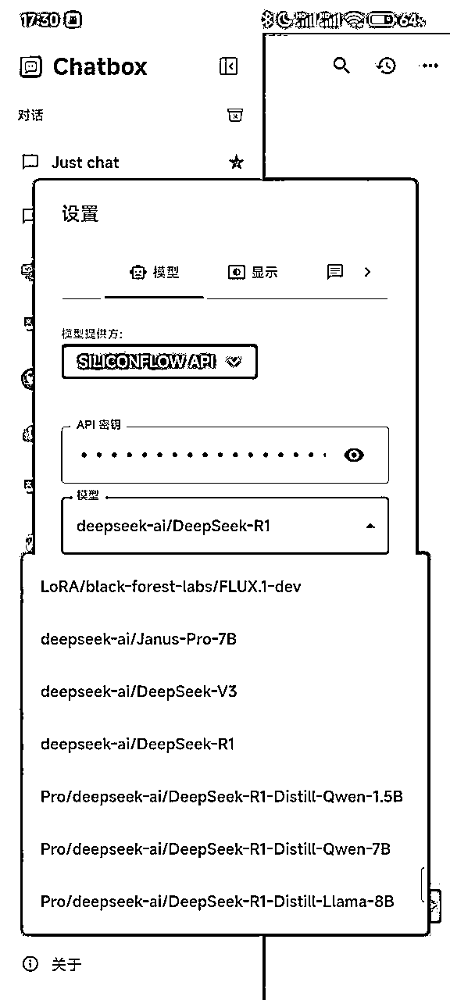
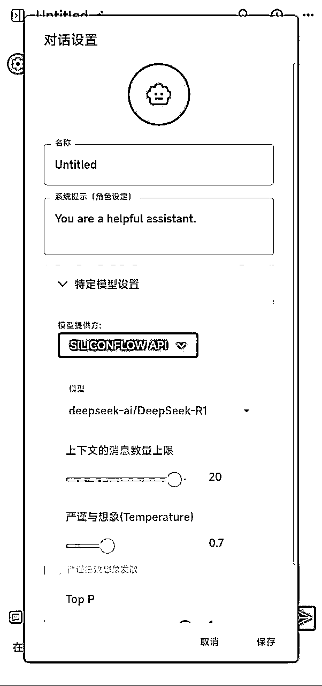

# 如何在手机端使用Deepseek的API？ChatboxAI手机app配置手把手教学【AI教程03】

> 来源：[https://tue99hylfd.feishu.cn/docx/FnxCdtaDYoonpLxGtS7cNVgNnCh](https://tue99hylfd.feishu.cn/docx/FnxCdtaDYoonpLxGtS7cNVgNnCh)

# 一、背景

上篇讲了Deepseek的api如何在CHerryStudio上使用，但Cherrystudio目前只有电脑端，无法在手机上使用，对于使用手机更多的同学可能还是会有不方便，本篇主要讲解deepseek的api在手机端的部署，使用的是Chatbox.ai，相关路径以及操作步骤在实战篇中详细讲解

上一篇deepseekAPI+CherryStudio指路 ：

*   如何获取硅基智能api（获取Deepseek官方api的操作步骤请前往 ，原理都相同）

*   如何配置Cherrystudio

本篇会重点讲解如何配置Chatbox，以及下载路径

*   苹果机/mac电脑用户可以直接应用商店直接下载，没有获取门槛

*   安卓用户手机打开官网可能存在无法打开或者无法下载现象，我已打包网盘apk文件放后面大家可以自行下载

*   链接: https://pan.baidu.com/s/1oRZMXdNjhQD1sJgrsdDfTg?pwd=1111 提取码: 1111

# 二、工具使用对比

在上一篇中，我把API类比为汽油，CherryStudio类比为车，但实际上，车和汽油这两个是有很多种选择的，市面上也不仅仅只有CherryStudio，我整理了如下表格可以对比下。

以下测评包含各个工具的优缺点，大家可以参考下按需选用（AI时代工具迭代很快，当一个工具无法使用的时候懂原理的同学可以直接无缝切换其他工具），标黄为推荐选择。

# 三、实操篇

实操全程使用手机，不需要使用电脑端

## 1.手机端下载chatbox.ai

*   苹果手机应用商店搜索即可，安卓用户使用浏览器打开该地址：https://chatboxai.app/zh#download

*   安卓用户-选择第三个apk

*   点击按钮加载完成后会跳转弹出下载的apk保存页面，选择保存到本地

*   如果一直无法弹出下载页面，或者弹出白页显示一串代码，那就使用百度云盘下载保存我上传的apk

*   链接: https://pan.baidu.com/s/1oRZMXdNjhQD1sJgrsdDfTg?pwd=1111 提取码: 1111

*   apk点击打开后，可能会因为国内无法备案弹出警告，直接允许就OK了

## 2.chatbox.ai软件设置

*   打开后，会有页面弹出，选择第二个【使用自己的api或者本地模型】

*   模型提供方一直下滑到出现【SILICONFLOW API】（硅基流动）或者【DEEPSEEK】，上一篇教程已经教学怎么获取api了，还不会的同学点这里去复习 ，这里直接填写api即可，然后模型下滑选择R1，上下文和温度都先默认

*   模型检查：设置好之后回到对话模式，点击右边【新对话】或者任意一个对话按钮，点击最上方的untitled查看对话配置的模型，正常上述流程完成后，下方就是确定的api了，需要修改参数需要走设置，角色设定可以自己找网上的prompt填充或者使用官方提供的，一般而言像R1这种推理模型反而更加不需要结构化提示词引导，给定身份就可以了。

*   实测发现，chatbox.ai手机端使用硅基流动api，概率会出现推理较慢的现象，如果思考持续不蹦出字数的话，这个时候点击停止思考按钮（红色方块）再刷新即可。