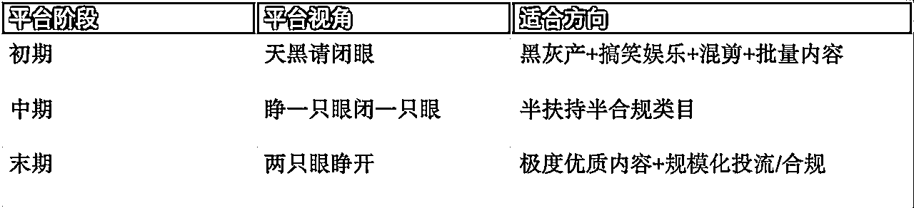
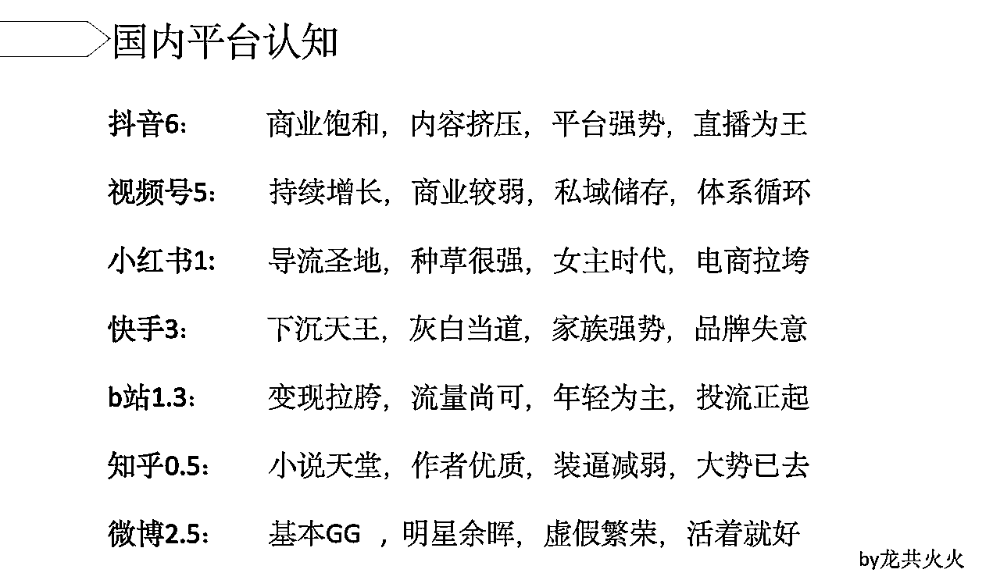
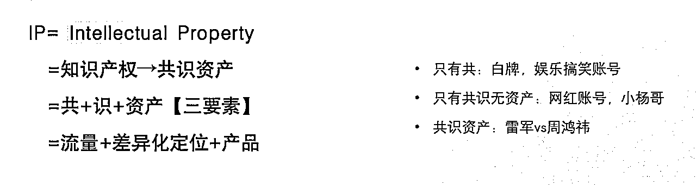
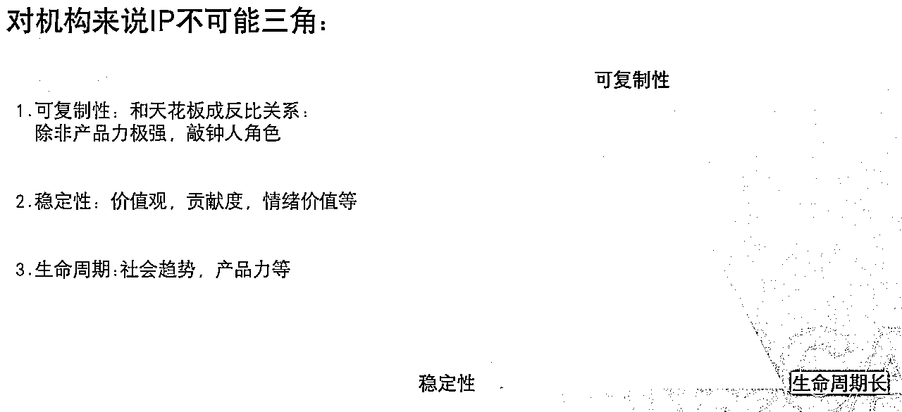
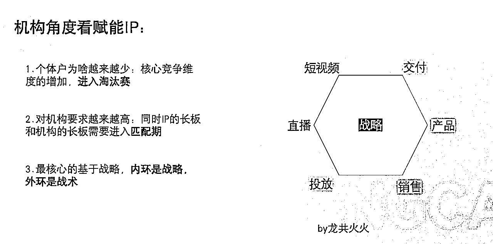
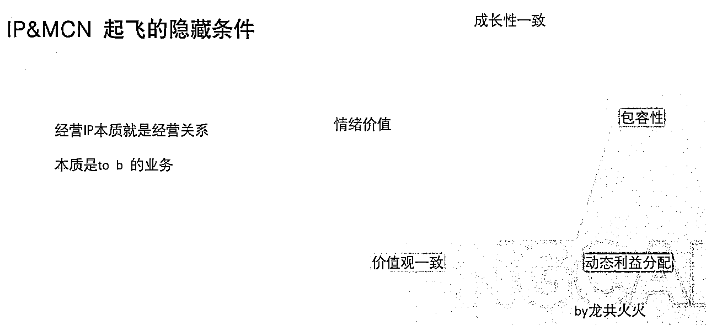
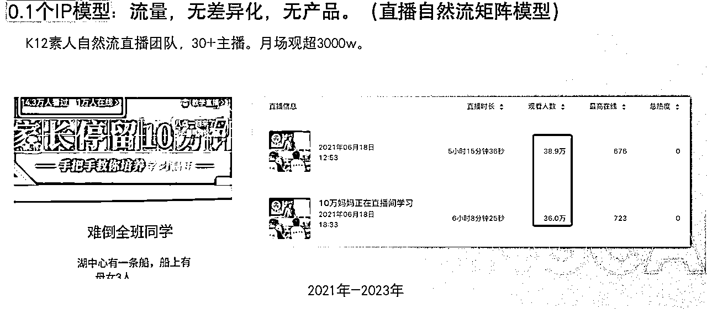
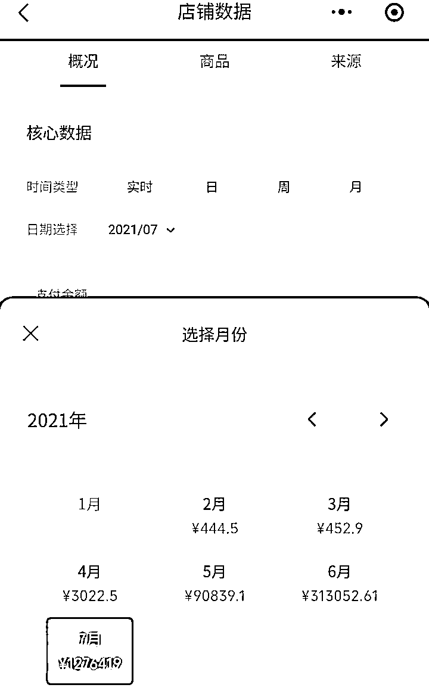

# 创业6年亿级反思：关于流量、平台、IP、认知成长及团队

> 来源：[https://ruiyihudong.feishu.cn/docx/FxhydOPYEogwrCx8HAncTMjynnc](https://ruiyihudong.feishu.cn/docx/FxhydOPYEogwrCx8HAncTMjynnc)

一转眼，从2019年3月创业（睿翼互动）到现在，来到了第6年。运气比较好的是，我们活了下来。

*   19年做了行业第一批 K12 短视频 MCN

*   20年在快手上开创了直播卖例子玩法

*   21年跑通了视频号，做了素人直播矩阵

*   23年开始尝试IP化的打法

过程中有一些收获，自营了6000多万的家长短视频粉丝。拿过一次福布斯U30（没花钱），也曾拿过融资（创新工场）。也有不少波折，经历过双减等。

此间心得分享给大家，之前也写过一篇创业3年反思可以搭配着看。

这篇文章以碎碎念为主，全文8000字，主要以下4个模块

*   流量及平台经验 11条

*   IP,MCN理解 15条

*   个人认知升级 35条

*   团队复盘 13条

我的习惯是几年更新一篇文章（差习惯，要改），可以分模块跳着看，全部阅读完差不多30min。放心文末没有卖课广告，小白请慎入。（联系请加 huohuo1616）

# 关于流量和平台：

1.新媒体平台上，流量红利的本质是供给红利，简单来说就是供给远小于需求。同时我们所有动作要符合平台进程。玩家的兴起，一般都是起于娱乐搞笑，兴于热点行业，终于产业。

满世界都跟你说某某红利的时你要警惕，当小圈子无意中得知某个红利，你要立即行动。

2.没有流量红利的时候，各种围绕精细化，或者降成本的动作会火起来。行业有大红利的时候，你更多听到的还是通透拉满，日耗百万。

互联网项目里信息差传递时间在变少，对比公众号小说业务，短剧行业从闷身发大财到大规模发酵只间隔了1年。不是媒体嗅觉变强了，是好项目太少了。

这年头当有人跟你说有好项目的时候，一定要眼见为实，不要被截图所迷惑。

3.赛道决定一切，赛道决定一切，赛道决定一切。太重要的话要说三遍。

不要做盲目追红利的人，红利是留给有积累的人和团队。有些机会注定不属于你。

4.在某种程度上，付费的流量更便宜，免费的流量实更贵。

付费便宜在，你是在公开市场上放开拿量，类似于地主跑马圈地，更加稳定。

免费流量，贵在需要看天吃饭，需要持续耕耘，类似于农民。

当然两者没有好坏，不同阶段使用武器也不一样。

5 一家公司寄托于流量力挽狂澜，那么离长久很远。那些天天拿着大喇叭在门口喊的餐厅，最好不要进去，除非他是让你排队等号。

6.产品优于流量，当你产品力不强的时候会天天喊着缺流量。

很多IP反应到了短视频平台找不到流量，根本问题其实是没找到PMF。之前做线下课程，都是靠转介绍来的客户，一直没理解用户真正是谁，他们的隐藏需求是啥，反而说XXX平台没有我的用户。就像一个训练有素的马术师，看到一辆跑车，跨在引擎盖上，大喊着驾驾驾。

但真正做好产品太难，身边创业者不超过1%。

7.一直只做流量会有反噬，更多的是心态层面，太着急有结果，所以有小结果就沾沾自喜，没结果又慌得一批。所谓的聪明不是好事，主要是聪明的人出路太多，很容易拐进林间小路上。

8.私域是很多生意绕不过去坎，私域里用户的价值才能被称重。

私域不被重视，核心不是战术上的问题，是战略上的认知问题。

虽然我从16年在公司就做过个人号矩阵，包括在18年写《高阶运营》时，提出过私域流量池部署，应该是国内最早在书里提出这个概念的。但我们搞了6000w的短视频粉丝，私域量级只有几十万。

不是不会做，是没有看到真相，没有认真计算产值，所以草草的忽略掉了。就跟你开车越野车到了沙漠，发现一路上到处是湖泊，你没有心思在这里好好的把水灌满，边开边走，直到驶入湖泊消失处。

但请注意，私域是租客逻辑，不是房东逻辑。没有关系是恒定的，你的闺蜜都能把你拉黑，更何况是你没见过的用户。

因为是租客，所以一上来就要把动作规划好，一个要租5年的房子和租1个月装修力度自然不一样。

9.很多人的生意模式算利润，大头基本上是在平台这。

不要盲目追求纯确定性的方法论，有些人突然在平台起来了，有可能他因为某段时间幸运，或者某个玩法ok被选上了，其实他自己也不知道原理。

对于平台来说其实无所谓，人面不知何处去，桃花依旧笑春风。

如果走纯投放模式来说，要找到平台无法直接计算你产出的模式，要么在私域里翻江倒海，要么在品牌里叱咤风云。

10.关于平台的红利，需要细分到具体类目来谈，前几天去硅谷，当地朋友问我国内的新媒体平台什么情况，编了一段大概印象。

朋友说要起一个横批，那还是“内容为王”

11.下一波平台红利的叙事，大概率是AI大幅提高内容生产能力，及提升过程中的效率。

# 关于IP和MCN

1.短视频发展到现在，低垂的果实基本上已经摘完，剩下来的回归到生意本身。

比流量红利更大的是人心红利，这也是IP的机会。

2.到底什么是IP？

我的角度：流量+差异化定位+产品沉淀，缺一不可。所以大多数IP不是真IP，最多算数字分身。

3.其实绝大多数的MCN是一个很差的生意，因为存在不可能三角。可复制性，稳定性及生命周期是魔咒。

夫妻档，师徒制的稳定性比大多数MCN高的本质是，构造了社会契约，而不是简单的经济契约。

MCN发展到现在，其实在回归其本质Multi-Channel Network，是频道逻辑。

其本质是给IP提供服务，而不是创造产业。

4.未来的MCN，不是比拼谁签了更多的人，而是在这个产业中渗透的更深。IP只能是一部分，而不是全部。MCN会逐步去魅，还是叫XXX产业公司更合适。就像雷军，在社交媒体他不仅是一个账号，更是代表了手机数码和汽车两个大的产业。

5.IP如何留住主播，从机构的角度需要满足6个要素：

短视频/直播/投放/销售/产品/交付

内环是战略（很多IP会忽略划一根线的价值），外环是战术（不能有大短板，或者长板足够长）

6.但实践过程中你会发现，MCN要起飞远比这个难，在六要素外还存在一个冰山下的模型。

对于机构来说经营IP本质是经营关系。

在价值观/情绪价值/包容性/成长性/利益分配都需要一致。

实施过程中会掺杂各种变量，就算是俞敏洪这样的行业大佬也难留住董宇辉，问题可能出在我们看不见的隐藏环节。

7.你能从IP业务赚到的钱

=【用户需求，产品能力】最大公约数

=【你的认知，IP认知】最大公倍数

所以最好你在专业领域的认知要远高于IP

8.那没有IP是不是没法做业务了。其实也不是，我们21年做了一个k12业内最大的自营素人直播矩阵，通过可复制主播模型，累计培训了几百个主播（在杭州被同行称为黄埔军校），同期有30+主播直播。以至于我们miss掉了纯IP红利，因为前期我们利润比有些同行IP公司高。

以至于我们miss掉了 纯IP红利，因为前期我们利润比有些同行IP公司高。

9.用户进入存量注意力时代。

这个时代里面，核心在于给用户产生多巴胺从 【多频刺激】转移到【大幅共振】。

比如知识付费行业，之前是通过短时多刺激，即10秒内给你各种表演动作，比如翻白眼来刺激你停留。

后面逐步会变成了娓娓道来，给你更多认知上的颠覆。

10.只有IP就是差生意，拿IP当成触角就是好生意。

对于知识付费来说，卖课IP已经见顶，但是产业IP正当时。我们也逐步的在做产业级别的IP【心理学，家庭教育，传统文化领域等】，有相关资源或者感兴趣的欢迎联系本人（gongyan42）。

11.下面这句话对我们我来说教训有上千万了。

孵化IP是很多时候是伪命题，放大IP价值更大。你是要玩一个低概率游戏，还是做一个确定的事？

12.IP业务对于很多赛道来说，当下最大的不是流量问题，是公众情绪。这两年暴雷了很多IP，但在微博，公众号时代的后期，”咪蒙“式的消失也屡见不鲜。

IP做的越大，本质就是车速越快，就像你开着120码的车，前方始终吊着一把达摩克里斯之剑，只要遇到一个小坑，可能前功尽弃。

核心是谨小慎微，适当往后撤。可以参考大冰火之后的动作。

13.微信公众号2012年推出，2015年商业化，2019年开始数据下滑（接广告部分），但现在依然存在，经历了10年以上，大红利消失了，小红利依然存在。

比如21年的公众号和视频号可以一体化关注（行业叫默展号），我们通过这个功能涨了1000w公众号粉丝。去年很多玩家用gpt批量写文章拿流量主收益，小绿书出现等等。

抖音，视频号也一样，一个牛逼的产品，生命周期比你想象的要长，生态建立起来了，森林里就算砍掉了大树，还会有很多鲜花开放。

所视频直播无论是IP，电商都还能做，依然在每个阶段有新的红利，核心区别是

你要变成高手，或者等待你的机会出现。

14.进场时机很重要，除了信息之外，就是看常识。在关键判断上，要相信自己的判断，不要跟着舆论走。

我们6年中有几个关键的卡点

一个是21年双减，我当时不知道有双减，年初的时候，我发现网校再给我们CPA结算价格下降，从卖一个9元例子结算150元到了90元。当时意识到了这个行业我们作为渠道商，其实本质赚的是资本市场上溢价的钱。

这个风一定会停止，类似于滴滴和快的打车一样，那后面我们作为渠道一定会痛苦。所以我们在21年的2月就开始独立做自己的录播课。等到双减来的时候，我们广告部分收入只占了20%。

另一个是关于视频号，我们可能是业内最早跑通视频号的教育MCN。20年视频号有一阵子泡沫期，很多人放弃了当时我判断视频号为什么能做，两个基础事实：

1）微信月活11个亿，抖音加快手去重月活大概8个亿，还剩3个亿上网但是不看视频的人群，那最后一定会在视频号上看。简单推算就知道一定是老年人主导。

2）基于罗杰斯创新扩散曲线，事物的扩散是有规律的，不是匀速的，无论是智能手机，新能源汽车都符合这个规律。那最后的接受者还有16%，如果按照移动互联网11亿算，最起码还有接近2亿人没熟悉短视频。

两者交叉分析视频号就是答案，所以我们坚定地认为视频号能跑出来，坚持半年后我们在21年7月份终于跑通。比行业说的红利提前了2年。

15.目前看到对做IP产业公司最好理解，出自张勇（新荣记老板，在米其林无数次摘星）

“从我们 1995 年开第一家店，我们对食材的追求高，慢慢形成了文化。我不希望厨师做菜标准化，而是他把菜当成一个作品来做，把这个工作当成自己的荣誉。”

# 关于认知成长

1.和一个比你高2个level的人聊过一次，低过你苦思冥想一年，你收获的答案或许和周围人完全不一样。

2.牛逼的人厉害的不是他在做什么，而是观察他拒绝什么。

不做什么并不代表他在偷懒，相反他的目标集中。有个朋友前几年无所事事，天天打打高尔夫，偶尔更新下公众号，很多人给他介绍新机会，他都拒绝了，一开始以为他颓废了，后来才知道他在等待入场时机，后来进军餐饮，一举爆发。

3.我们吃过了很多红利，但很多时候就是吃的西瓜尖，做过一阵子之后没有放的非常大。为什么是这样？之前我认为只是组织能力差，其实是看终点的能力。

很多人说你赚不到认知以外的钱，其实是你赚不到觉察以外的钱。

我们为什么会错过，其实是你没有关注。如果没有觉察能力，任何有用的的信息在你面前没用。去年有一个群友来拜访我，最后临别的时候跟我说了句，没事就多买屯点XXX。XXX后来涨了很多倍，不是我不知道，是你内心根本不关注。

4.太简单的东西，往往吸引不了重视。

很多事情底层往往简单的令人可怕，你很可能很早就听过，但人往往相信复杂，似乎复杂后面的力量更大，更容易成瘾。

如果一个人往往能把一件事情，能说的很简单，要么是傻子，要么就是高手。如果你发现是后者，乖乖认小弟。

5.臣服是一种态度，其实更是一种能力。我们往往自己的ego很大， 觉得能力圈可以拓展到很多领域。

当你能意识到局限性的时候，已经赢了。

当然改命的核心，往往不是自己变牛逼了，而是找了一个牛逼到大哥带你牛逼。

段誉在学会凌波微步之前，对菩萨磕了999个头。

6.认真做事是一种顶级能力，意味着绝对的专注，绝对的目标导向，能够排除万难。

李小龙说速度是身心同步、消除不必要的动作、注重精准。速度的本质不在于匆忙，而在于效率。

很多时候我们做事情手忙脚乱，核心是身心不一。

7.《更富有，更睿智，更快乐》是一本书名，也可以是人生的座右铭，分别代表着追求食物链（物质），智慧链，幸福链。

当然每个人阶段不一样，提醒自己及时知止很重要。

见到周围的很多朋友，已经很有钱了，但是家庭过得不怎么幸福，可能在后者上投入的时间没有研究赚钱的1/10。

城里的人想进去，城外的人想出去。最核心的是你要有意识到城的存在。

8.绝大多数人，一开始创业的时候本质是消除恐惧感，对于金钱，人际关系的恐惧。当恐惧感消失的时候，其实你才真正开始创业。而不是倒过来。

当然很多人表面上说想赚钱，其实想急于证明自己。后者可能会翻大跟头。

前几天去硅谷转了下，发现很多当地创业者非常powerful，来源于他们的底层自信，真的喜欢这件事情，而不是单一的赚钱。我从去年开始慢慢觉察到自己的这点。

9.不要发力过猛，不要期待过高。要保持平常心。

在一个满是人的游泳池里，快速到达对岸最快的速度可能不是猛游，而是走一步看一步。当然更好的办法是从那个游泳池爬出来，直接走到对岸。

很多创始人一开始用力过猛，要么后面身体或者心力消耗过快，需要很长时间恢复。

10.心力是一个很神奇的东西，很多聪明的人反而体会不到。

因为聪明是不生智慧的，他们不是不具备，是每次快用上的时候，打一枪换一炮。

11.要经历周期，经历好的和坏的，既要在绝望中充满希望，也要在欢声笑语中低头反思。

12 看到行业三个月的变化有时候很简单，看清行业三年后的变化是难的事情，但看清后决策会变得简单很多。去年有本书很棒，10X than 2X，强迫自己的思维有10倍速的视角。

包括一个10年的项目，能不能在6个月内完成。

13现在越来越明白底层特质的重要性，如果光看技能层 人和人其实差距不大，但底层决定十年后的发展上限。

14 人最重要的是加速度，过去成功不代表现在成功，但过去一直失败你要小心了。如果一个人 几年内都没有任何成绩，要反思选择或者能力问题了。

15一直热衷赚快钱，最大的坏处是会形成思维惯性，对低垂的果实表现出狂热，但从概率上来说，总有一天，你会被跑的比你更快的狮子吃掉。

16 .做正确的事情，不一定是做难的事情，“做难而正确的事情”是有行业语境在的。

在很多行业，不用和自己过不去，正确的事情有时候反而会做起来会更轻松，因为自带势能加速度。

17 如果一个概念 10 年前大家都在说，现在依然还在炒，要么是真的难，要么是真的对。

前者是 sass，每年都是元年。后者是 IP，从图文到短视频时代。

18 不要羡慕纯运气，要学习可被复制的运气，大多数高手的运气都是可以被计算的。最简单增加运气的方法就是多花钱还有就是保持好人品。

有朋友今年接手了一个非常好的机会，其实来源于很多年前在一个商学院认识的一个大哥，对他接近 10年 的观察。

19 一个人的核心能力是知止，越早知道或者触摸到能力圈的边界越好。因为知止，心态反而会更开放。

过去一味的强调自营，载了不少跟头，包括这次我们去做产业IP，我们也主动找合作方合作很多环节。

20.太阳底下没有新鲜事，很多你认为很新鲜或者棘手的事情，可能别的行业，别的维度上已经发生过好多次。

21.“道者，人之所蹈，使万物不知其所由”很多事情的发生其实暗合规律，但只是自己不知道而已。

比如行业流量变迁的规律，商业模式的红利期，都存在周期。对普通人来说，最难的是尊重常识，当然更难的是承认自己是普通人，不是special one。

当然你悟到这个点后，你就无所畏惧了。因为我们是普通人，我们可以犯蠢。

过去很少找大佬主动聊天，生怕大佬觉得这个问题太愚蠢了。但有个朋友讲，你可以羞愧，但是1秒钟后羞愧就过了，之后你就恢复正常。

22.在当下的环境中企业一直要关注几个点，增长，效率和风控。

对于公司来说，营收是面子，资产是里子，现金流是日子。

23.多和能数次穿越周期的人聊，他们有更深的体感。一时的风起云涌，不如一直呆在牌桌上更令人值得尊敬。

24.终局思维和逆向思考能力都是稀缺品质。

25.在很多人眼里的赌博行为，其实是无数次精准的计算。

不要只看利润率，要看ROE

ROE=利润率*杠杆率*周转率

所以看到一个月利润率20%且超高周转的生意后，一个大佬果断借了8000w年24%的“高利贷”，一把封神。

（这里不鼓励大家进行任何借贷行为，有时代背景在）

26.在成功之前，找到你的绝对长处，长到依靠这个，周围的资源会自动聚拢为止。

27.想要大幅增长，从需求端要满足：刚需，稳定，趋势向上，抗周期，有延展。同时具备要素越多越好。

28.圈子很重要，圈子的平均收入就是你的收入。

有个顶级投资人一直会问创业者两个问题：你的大哥是谁（你在什么样的圈子里），你之前赚的钱都花在哪里（只顾贪图享受的直接pass）

29.对于学到的新知，要养成付费意识，而且是随手付费意识。我经常在每周日晚上自己直播间“PUA”观众，如果听到有价值一定要送礼物，第一你能记住这个知识点，第二你的好习惯就培养出来了。

我发现微付费的杠杆非常大。之前看某个大佬的公众号，那会他的阅读量不高，我给每篇历史文章打赏了200。加到微信后，这个大佬连忙感谢，像遇到知音一样。可能正常渠道你都没法接触这样的人。

30.玩了一个叫做财富流的游戏，线下6个人组局，用3h走完一生。有几个体感：

一个是终局思维，如果一个人一上来就看见过高山上的风景，确实能够更快的进入顺流层。（游戏中表现为被动收入远大于主动收入）。

第二做任何事其实都会消耗精力，这是一个隐形的投资，把精力花在哪里就会得到完全不一样的结果。

有个朋友刚赚了笔大钱，想要买一辆兰博基尼，后来被投资人劝退了。理由是核心不是600w，而是你买之后要在车上花时间研究，还要花更多时间炫耀，这点时间不如投入在公司上收益更大。

31.呆在牌桌上，可以待机，但不要下线。

32.判断终局的能力是最难的，所以区分出来了纯打工，生意人，企业家。

33谁痛苦，谁改变。聪明人最大的问题是，总是能找到很多支线的答案，每次都能活下来。这是对他们最大的诅咒。

34 这五年创业，热衷于加各种组织，私董会，咨询等，累计花了几百万。很多朋友问我，到底哪个私董会最值得推荐。其实这个问题反过来问更合适，你去参加这些的目的是啥？

每个阶段你参加每个私董会的目的是不一样的。

之前只是生怕自己 fomo一些机会，但后来发现，缺的不是信息，是目标。

35能游到海水变蓝，最核心的不是努力游，而是先确是海。不然越游越累，可能发现是在沼泽。

如何判断？算力+算法+数据

有自己的底层操作系统（算力强），多元思维模型（算法好），优质信息源（数据好）。

幸运的是AI时代，能够帮我们做很多决策参考，我现在基本上已经离不开GPT了。【这里面有很多心得，考虑回头有空，做个AI新媒体俱乐部】

# 关于团队

1.顺着人性做事，逆人性修心。共苦其实没有同甘难。

2.太高的利润率往往不是好事，会有很多人盯上，如果叠加上没有很强的组织壁垒，那会形成灾难。

普通公司不要轻易搭建所谓的护城河，在你没有看清楚这件事情之前，可能只是搭建了一条马奇诺防线。

而且你觉得它是护城河，仅仅是因为你在上面投入过多。

3.使命愿景价值观，刚创业的时候感觉比较虚，没有看懂和理解。

直到去年才有感觉。核心是确定目标，动力，制定规则。

就像一艘船在大海里，有的人开着开着就变成了海盗，有的人变成了哥伦布发现美洲，这注定是两种截然不同的命运。

4.筛选比培养更重要，但是前提是你能配得上大家，你只能找到你目前能找到最好的人。

所以不要抱怨企业人才不行，多看看自己哪里出了问题。

5.冰山下的比冰山上的更重要。

创业刚开始，我们更看重技能型的人才，拿来就用，但是后面慢慢发现，招错一个人的成本其实非常大，特别是造成的伤害方面。

那如果招对，可能更核心看这个人的一些基本特质，价值观，人生观。

6.很多时候企业的失败，并不在于一路业务缩减，而是创始人的精力问题。

就像硅谷现在说的创始人模式的回归。雷军做小米汽车的时候问了李想一个问题：

“如果我们做汽车，你给我一个建议，只要一个，是什么？我说：小米车要想成功，你必须all in——没有什么其他的，只要做到这一点，小米汽车就会成功。”

7.如何判断组织升级的标准是什么？

李想：核心要完成四个任务：如何能有效感知并获取到全面真实的信息；如何能做出好的判断及决策；如何确保执行的过程；如何有效复盘。

能做好其中2个以上就很难，继续修炼。

8.短期主义vs长期主义的本质不是选择，是看清真相。

所以不要上来就谈长期主义，可能造成长期危害。

我曾经很困扰于是做生意还是做事业的问题，不知道自己的初心在哪里。其实没有短期和长期主义，本质是你看清这件事情的真相。就像打游戏一样，不能只关注眼前的补兵，而要看清整个地图，明确最终目标是推掉水晶塔。

9.要时刻保持团队的中正位，既不要纯利益导向，也不要一点利益都不谈。

10.远离那些经常负能量的人，不要认为你能轻易改变一个人。

同时将军赶路，莫追小兔。不要被情绪裹挟，不要被沉没成本打劫。

11.有一本书《悉达多》，有一个商人问他，“你一个大僧人什么能力都没有，你在干嘛？”

他说我有三个能力：会思考，会等待，会斋戒。

*   会思考（强大的认知能力）：看清真相

*   会等待（延迟满足感） ：看清真相后的耐心，主动也好被动也好。

*   会斋戒（忍受痛苦的能力）：接受过程中的曲折

“期望值很高的人，耐力就很低。不幸的是，在成功的道路上，耐力是很重要的。我不知道如何教给你们，除非我希望你们遭受一些磨难。我很幸运，从小就在一种能够成功但又有很多挫折和磨难的环境中长大。直到今天，我在公司内部使用“痛苦和磨难”这个词组时仍然感到无比欣喜。"——黄仁勋

这本质就是西游记的故事。

12.利他是个好东西，请持续。无论是在公司内还是对身边朋友。

我经常在各种场合随手帮一些朋友，我发现短期效益不大，但长期看很多机会都是来源于之前积累。

以至于有个小圈子都说近火火者富，20年拉了身边一票朋友，做教育的CPA，好几个结果都还不错。

13.今年我们也从一家纯粹的K12 MCN公司，转型为产业IP的公司。主要聚焦在帮助 真正有愿力和能力的IP一起放大。

目前重点看的是心理学，家庭教育，人文领域等。

这个过程中，我们也在尝试结合AI和数字人技术，取得了一些进展（小红书2个月涨了50w粉）。

我坚信做对的事情，然后把事情做对。

下一波AI+IP的时代要到来了，坐标杭州，我们也在找各种人才，包括短视频，直播，产品，产品，私域，管培生等。

目前我们在AI+IP 赛道已经跑出案例，某个心理学知名大v，其ai化程度已经达到80%。

我也希望和有IP资源或者IP一起合作，以及各个方向上的合作伙伴。

欢迎推荐和自荐

联系方式 gongyan42 或者 公众号【龙共火火】

和你愿意的人一块取经，也取你自己的真经。

## 小彩蛋

PS：每周日晚上，我都会在视频号【龙共火火】

不定时直播碎碎念，已经坚持了4年，纯公益行为。欢迎来听，今年也准备尝试自己的IP方向，准备做一个成长的公益栏目叫《巨人之书》。

在国外有一个博主叫蒂姆·费里斯，采访了几百个横跨各个领域的专家（体育，金融，作家，艺术家等）做成了播客，出版了《巨人的方法》《巨人的工具》。

我也想找身边一些穿越周期的朋友，一块录一个节目，给身边的年轻人提供一些帮助。

如果你有兴趣可以联系。