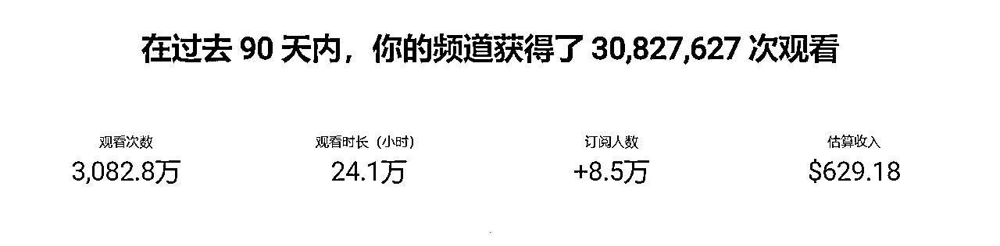

# YouTube航海14天开通YPP，我用的是同中求异

> 来源：[https://zphzxek10r.feishu.cn/docx/GNEcdwdvAooVArx7uakcGp1pnhh](https://zphzxek10r.feishu.cn/docx/GNEcdwdvAooVArx7uakcGp1pnhh)

大家好，我是时光。这次航海报名了YT，然后14天直接跑通YPP。今天做个小复盘

这篇文章早就准备写的 但是文笔比较差，再加上觉得也不是什么比较大的成就，所以一直没有完工，今天刚好有时间，再加上看到圈友刘小排的越快乐越成功的帖子，深受启发，所以简单做个复盘。

12月4号开船，19号收到开通YPP邮件

YouTube shorts的基本操作一些内容就不说了，星球现在很多优秀的前辈都是的很清晰

主要说一下我理解的同中求异

首先自我介绍一下 二奢狗，币圈老韭菜,早期的AI绘画的爱好者，所以说对这次航海的的一些前期准备对我来说比较简单，比如指纹浏览器，谷歌三件套等等 。

先晒一下目前的账号的状态吧

因为中间有一些事情需要处理，所以断更了一些时间，再加上目前AI类型的频道，印度地区观看量比较大，导致现在收益只有600多刀 已经在想办法把账号的权重往欧美地区调整了

这次航海之前 看到了亦仁老大发的超级标，然后就果断动手注册YT，开始着手准备。航海一开就直接报名了YT的船。

开始之前看了星球里面的一些前辈分享，有了初步的认识，后来看完航海手册里面的比较详细的分类介绍，就选择了AI视频的赛道

感觉大家都觉得AI视频的门槛比较低，所以很多人选择的也是AI赛道，比如动物融合和达人秀这种的。我觉的这种赛道会极其拥挤，毕竟这次航海人数2000多人 就算只有500个人选择了AI视频赛道，

一个人做3个号的话 就是1500个新号同时出现在一个赛道里面，同时去抄那几个有限的账号。这种感觉很不好，我认为出成绩的可能会很小。

开始几天并没着急动手，不停的去刷视频，无论国内还是国外的，所有AI生成的视频类型 基本都刷了 一遍。然后开始整合资源和类目。去打乱重新组合，

比如只是一个AI生成的图像，但是我觉得这个可以和YT上的另一个风格进行融合创造，所以我就会去尝试创作。

不断的尝试几天，终于让自己发现了一个YT上暂时没有的素材类型，直接用之前注册好的一个号进行发布， 确实和我想的一样，视频爆了。基本睡觉起来每条都是十几万到几十万的播放。后面直接就是一天两三百万的播放。

这就是我想说的同中求异，火的赛道之所以火肯定是有原因的，大家模仿也是对的，但是如果所有人都去直接抄账号的内容，使用拿来主义的话，效果并不会很好

我们要做的是去分析这个账号类型，拆解它的工作流程，然后自己可以尝试模仿原账号内容去测试自己的工作流程完整度。

但是如果对视频进行像素级的模仿的话，同质化就会过于严重，同时原作者也会收到版权提醒，因为我自己就已经收到了，看到了很多模仿我的账号

同中求异，就是我们可以去做相同的赛道，但是不要去完全的做相同的内容。大家都做达人秀变身，都是动物和美女进行融合，那你为什么不能做美女和物品，和花朵，和美丽的雕塑进行融合变换呢？大家都做宝宝走秀，做动物故事，那你为什么不做动物走秀，宝宝做家务呢？

门槛越低的事情，以后的门槛就会越高。这句话现在真的理解了。

还是那句话，仿其形不如画其骨，同中求异。祝大家早日YPP，每天赚刀了。

理工男，文笔差到爆炸，大家将就看吧。