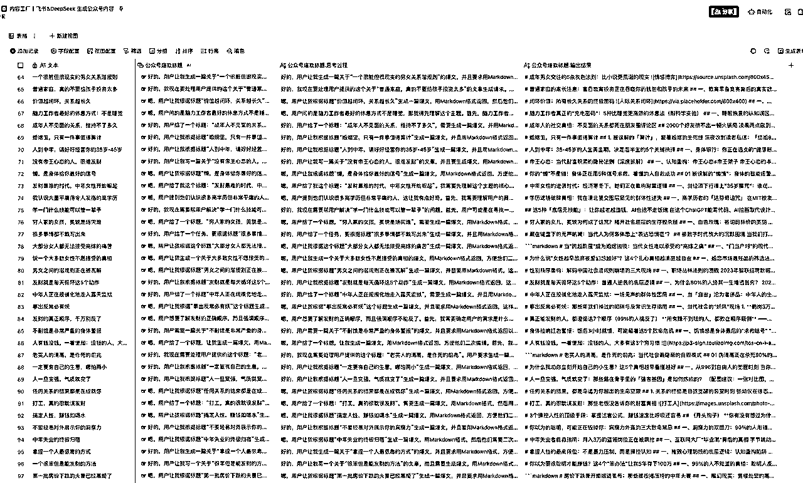
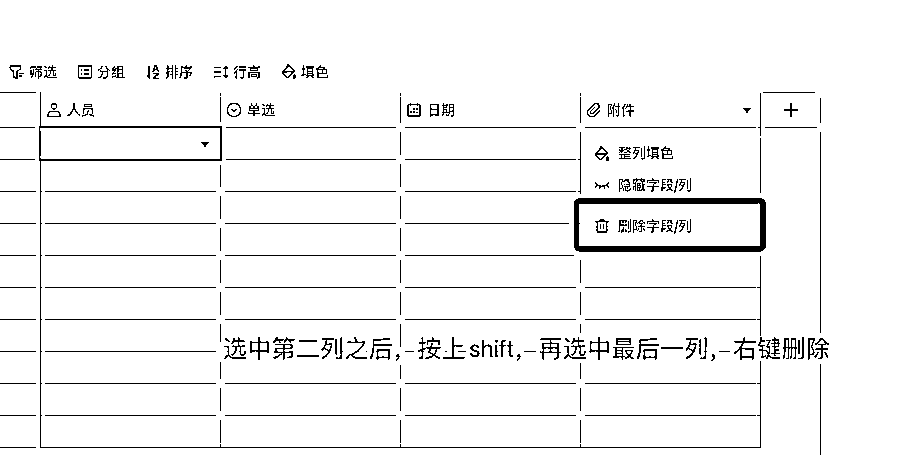
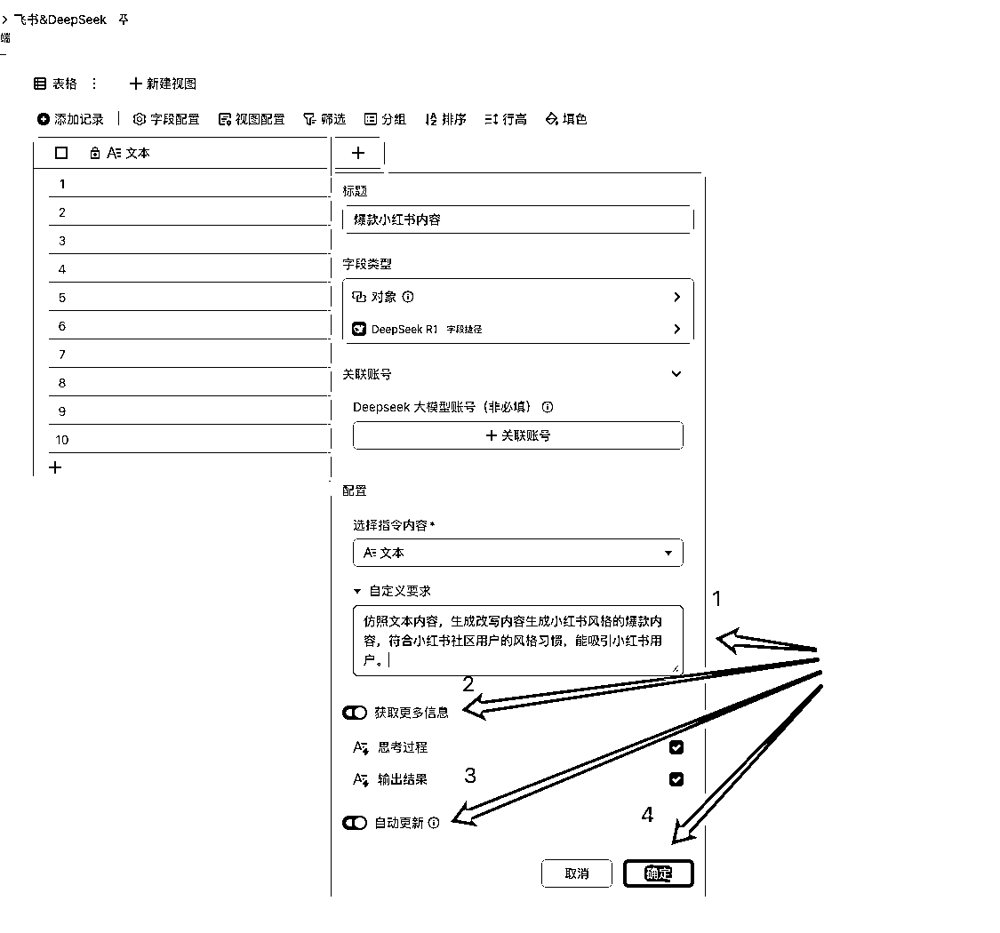
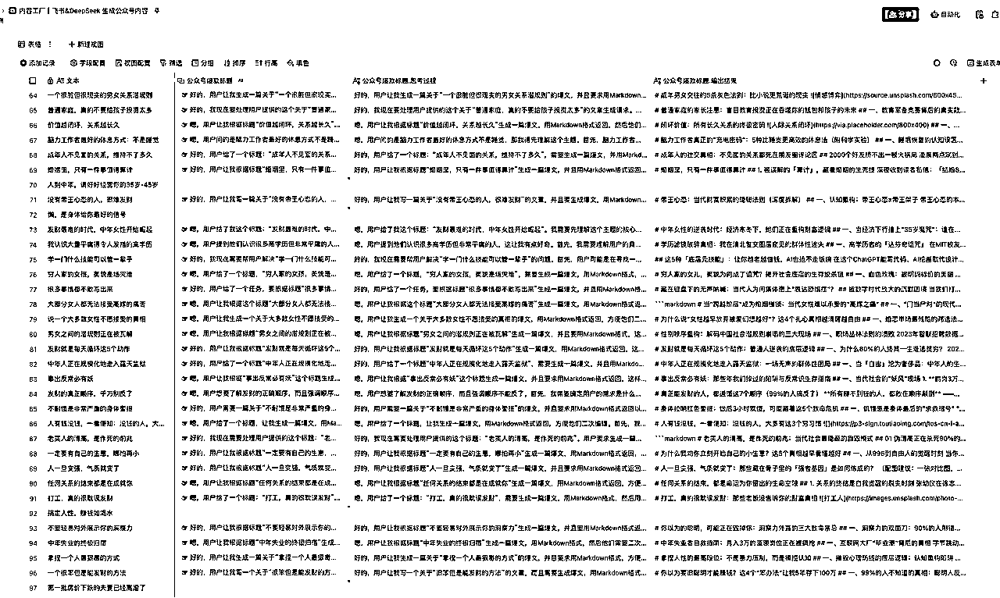

# 内容生产天花板！飞书&DeepSeek双王炸

> 来源：[https://svox0dxsvym.feishu.cn/docx/PeSPdjiOCoAWEmxIWtEcvTrXnEb](https://svox0dxsvym.feishu.cn/docx/PeSPdjiOCoAWEmxIWtEcvTrXnEb)

这两天看到很多大佬在宣传飞书多维表格结合DeepSeek R1生产内容，简直就是王炸级别呀。

我试了一下，简直就是内容生产机器。

先给大家看一下图

怎么做？直接上教程了。

一，创建飞书多维表格

创建飞书多维表格之后，保留第一列表格，其余表格全部删除

操作步骤

1.  点击右边➕号

1.  标题输入小红书爆款内容

1.  文本搜索字段捷径，这里输入DeepSeek 然后按回车

操作步骤

1.  选择好DeepSeek R1之后回车

1.  关联账号暂时可以不填，后续按自己需要补上

1.  指令内容选择第一列内容

操作步骤

1.  写入提示词的要求，比如我要魔改第一列的文本内容给我生成新的内容

1.  按默认来，不用改

1.  按默认来，不用改

1.  点击确定即可

至此整个自动生产内容的流程介绍完毕，大家快去试试吧！

我找了一批公众号爆款标题，然后生成了一批内容

