# YouTube科普解说号-开通初级YPP & 达标高级YPP复盘帖

> 来源：[https://alsvgw465y.feishu.cn/docx/GkWldFB61oPg0nxcV3acUOAhnWg](https://alsvgw465y.feishu.cn/docx/GkWldFB61oPg0nxcV3acUOAhnWg)

# 引言：

大家好，我是私藏人间，自由职业者，深耕Youtube赛道。12月份参加生财YouTube Shorts航海，持续更新@老马教练的科普解说赛道，1月份出爆款700w+播放，开通YouTube 初级YPP，通过私教陪跑 @方波妮@Gary教练分享的新玩法，已达标高级YPP，非常感谢生财有术平台提供的私教陪跑社群，感谢两位教练的给力指导。

经历生财YouTube大航海，不少圈友在航海期间做 reddit故事和科普解说号，但大部分圈友因为频道数据卡百播/千播，而不得不放弃这个赛道；今天我想给大家分享，学习YouTube航海手册和私教陪跑手册，我们普通人如何才能复刻出爆款，以及开通YPP经验分享；以下我会分四个阶段和大家分享我的成长之路：

第一阶段：依据手册学习，但掌握不到位，视频卡千播

第二阶段：再次攻占手册，秘籍就在手册里，视频迎来稳定万播

第三阶段：极致复刻对标，终于迎来属于自己的爆款视频，700w+播放

第四阶段：开通初级YPP & 达标高级YPP

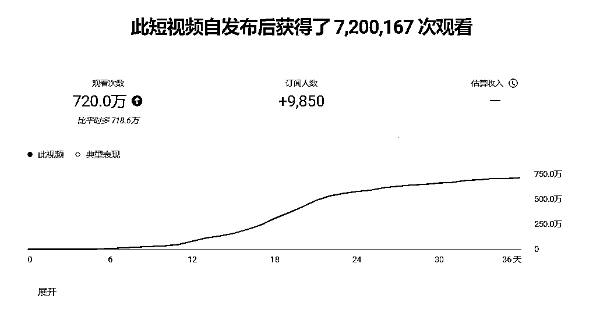

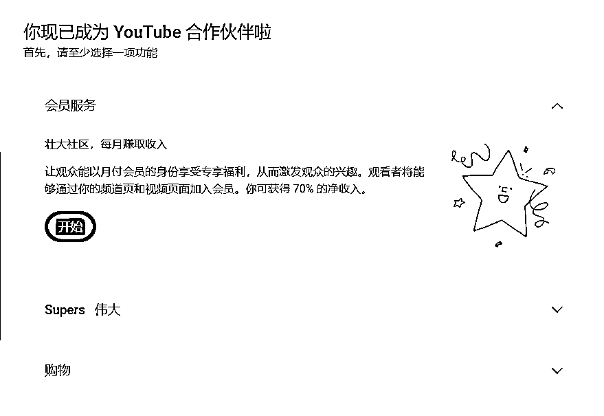

不知不觉，从制作第一个视频发布到现在已经有两个多月了。这次分享有三个目的：

1.复盘总结（这两个多月项目上遇到的问题以及优化方法）

2.鼓舞打气（常年千播或者万播的圈友，给同赛道的小伙伴打打气)

3.分享科普解说赛道适合普通人的打法：按照航海/私教陪跑手册来，极致学习模仿对标视频。爆款之道，就在其中。

下面开始正文：

# 第一阶段：依据手册学习，但掌握不到位，视频卡千播

从亦仁24.10.24发布超级标开始，才关注到Youtube这个赛道。心里想：亦仁指出的赛道，肯定没毛病啊，跟着干就行了。后面还看到波妮教练的帖子，非常详细的教程。但是自己又开始等等等。（不要像我一样，拖延症太严重，能下场就赶紧下场）

直到航海开始才着手下场，大致看完一遍航海手册，觉得科普解说赛道还挺适合我，就选择了科普解说赛道，然后又拖延了几天，发布第一个视频已经是12.9了。

当时【选择面向内容】，不知道怎么选。还选择了面向儿童的内容，没流量才知道自己选择的不对。（有问题群里举手，可以快速解决，自己琢磨会浪费很多时间）

虽然科普解说赛道这一块航海手册里面的教程已经非常全面了，但是期间还是有一些细节我没有注意，导致视频的质量不过关。最开始发布的视频只有1-3k播放，后面调整了一些细节才达到万播标准值，后面我会详细分享这部分。

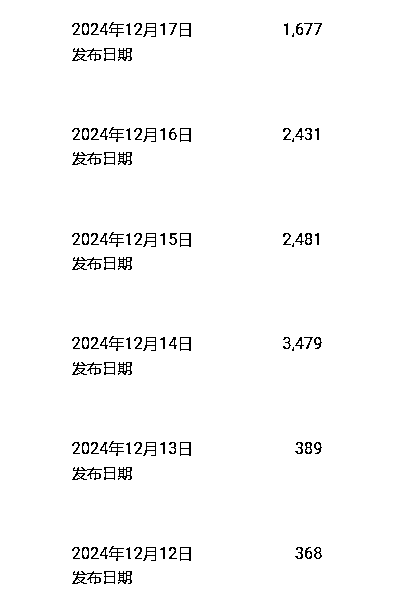

# 第二阶段：再次攻占手册，秘籍就在手册里，视频迎来稳定万播

## 1、优化转场、气口

虽然看了一遍航海手册，但是根本没去注意航海手册里面的要求，都是按照自己的想法开始做。视频都是直接视频素材拼接到一块，加个配音。甚至素材也找的不符合，画面都看不清。

发布之后直接给打击到了，这啥也不是啊。教练说万播才是正常值，这也差太多了。

开始重新学习手册，才意识到还有这么多细节自己没注意到。转场特效、根据音频每句话的气口添加画面。

自己连标准值都没做到，怎么会有流量。接着按手册开始优化。

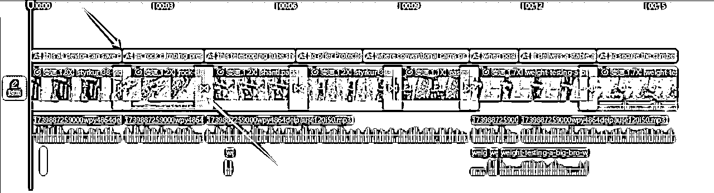

操作步骤：

先识别字幕，然后按每句话的停顿添加画面，每句话结束就转场下一个画面。

如果一句话比较长，中间可以多加几个画面，一句话结束也是转场下一个画面。

再添加上转场特效、音效。

整个视频质感直接上升。

优化之后，流量也开始达到万播标准值。

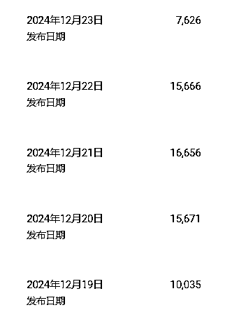

总结：一定要认真的学习手册，一步一步对照着来，不要有自己的想法，手册都是教练们走通的路，跟着走肯定没错。

如果自己没达到标准值，就回头看看自己的动作是不是变形了，自己看不出来，就找教练问问，当局者迷，旁观者清。

## 2、数据不好断更

持续更新了10多天后，一直万播，数据起不来，没有正反馈。心力不足，感觉自己是不是不适合做这个项目，这也太难了，直接选择断更。

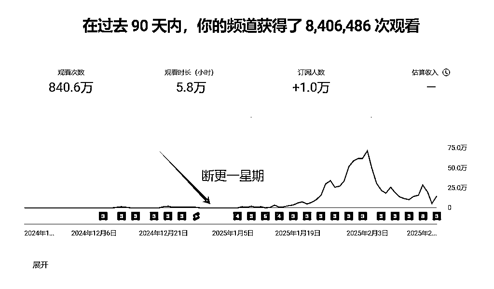

后面又看到圈友们的反馈，有很多很好的数据，就意识到肯定还是自己没做到位。就决定重新调整流程，继续开始更新。

# 第三阶段：极致复刻对标，终于迎来属于自己的爆款视频，700w+播放

## 1、优化开头前3s

以前做抖音都是看前3s、5s完播率，视频平台的调性都大差不差，Youtube是平均观看百分比、选择观看率两个指标。

我是用的科普解说逆练方式，就开始从这个角度下手。既然对标视频能爆，肯定就是整个视频没什么问题的。那就模仿对标视频的开头。

把开头和对标视频做的一模一样，文案的开头也不改动，这样来提升选择观看率。（非常重要）

操作步骤：

把对标视频的开头关键帧截图，直接谷歌识图功能搜图，一般能直接找到原视频。（不得不说航海手册真的很全面，都有教程）

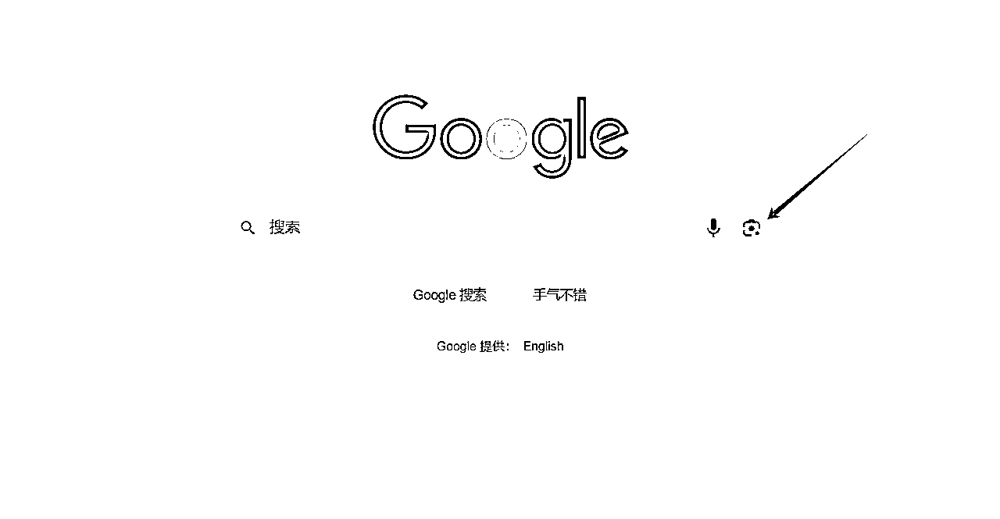

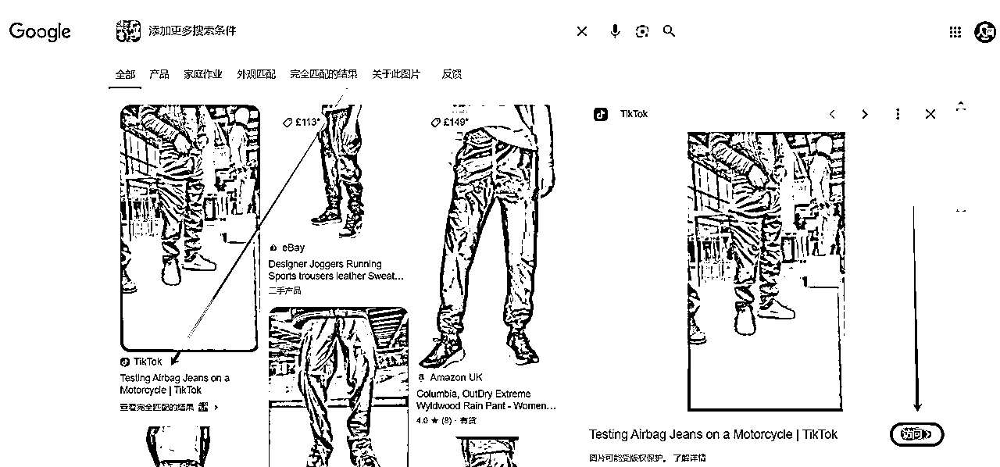

把下载下来的视频，找到和对标视频同样的片段，看对标视频放了几秒，咱们就直接跟上。对标用了一个箭头，那咱们也用上一个箭头。尽量做到非常相似。

视频对比（左边是对标视频）

可以看一下这个对比，爆款的选择观看率是高的多的。

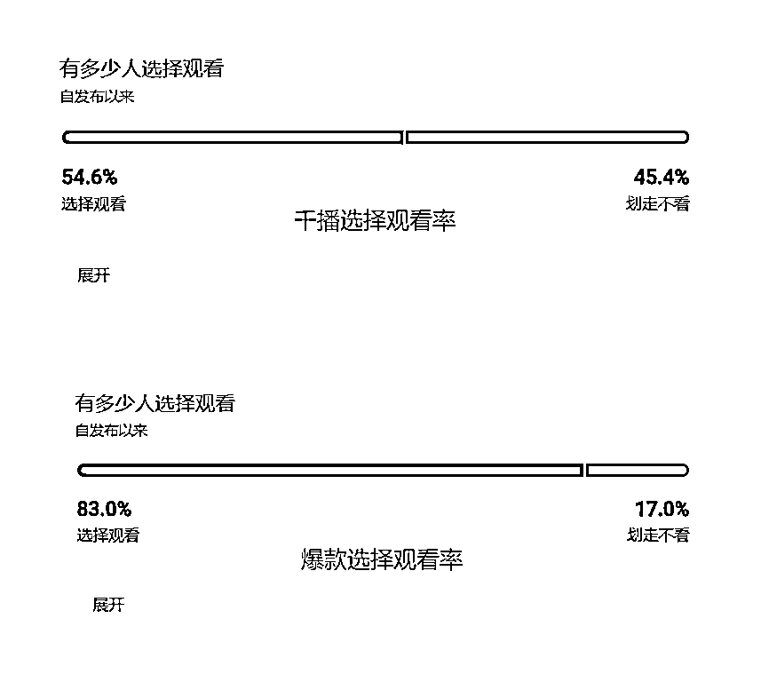

再次优化自己的视频之后，又更新了十几天，终于迎来了自己的第一个爆款。到目前为止是720w观看次数。

大家也可以看到，这个爆款不是短时间内就获得了高播放，最初也是没有流量，发布一星期才开始爆，所以大家做视频也不用着急，说不定哪天就开始爆了，咱们把能优化的地方优化好，等待系统推流就ok。

总结：大家不要看到数据不好开始焦虑、甚至断更。多从自己身上找原因，同时航海/私教陪跑手册也要多看几遍，审视自己的动作有没有变形，找找视频还有哪些可以优化。坚持更新也许下一个视频就会爆。

# 第四阶段：开通初级YPP & 达标高级YPP

## 一、初级YPP被拒：科普解说赛道初级YPP被拒，如何申诉

好不容易达标了初级YPP，没想到申请开通直接被拒，当时直接心态崩了。

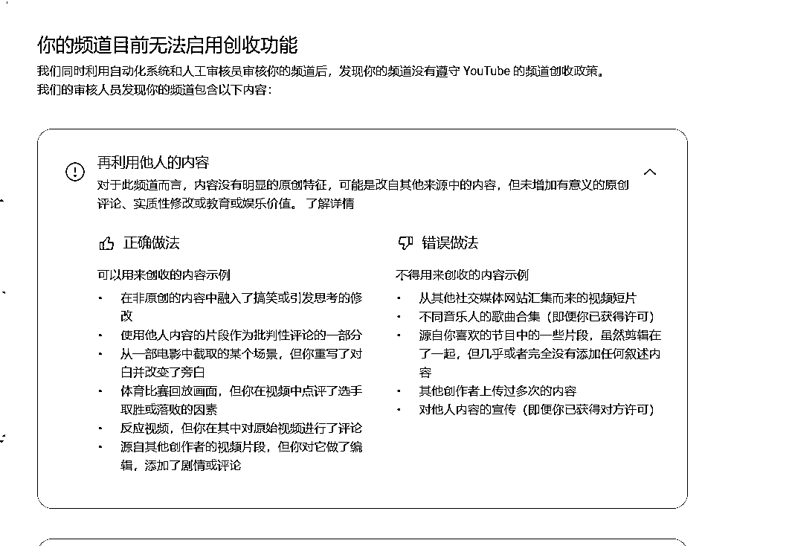

就问波妮教练该怎么办。教练给我一个帖子，按照教练的帖子申诉，两天之后就申诉成功开通了。

波妮教练的帖子：https://t.zsxq.com/GHRK1

以下是我科普解说赛道-再利用他人的内容，YPP被拒申诉的流程，大家有遇到的可以参考。

腾讯会议录制，打开屏幕+人像，露脸录制，可以把人像放到右下角，避免遮挡屏幕。

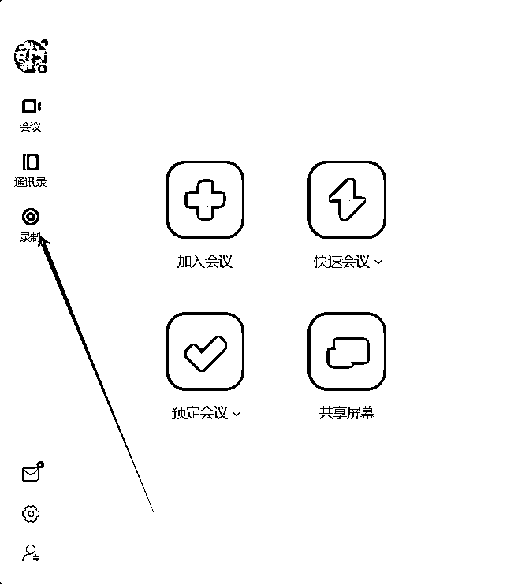

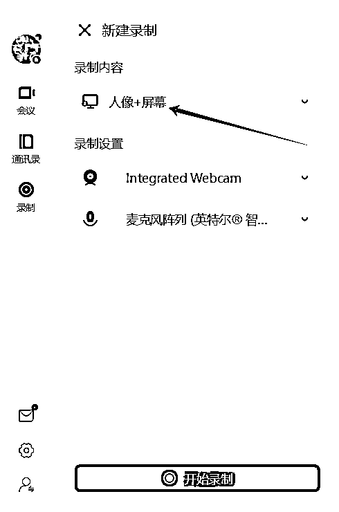

录制内容：可以用中文

### 1.前30秒先介绍自己的频道主页、简介、视频

例如：这是我的频道主页、频道简介、短视频、长视频、balabala都介绍一下。

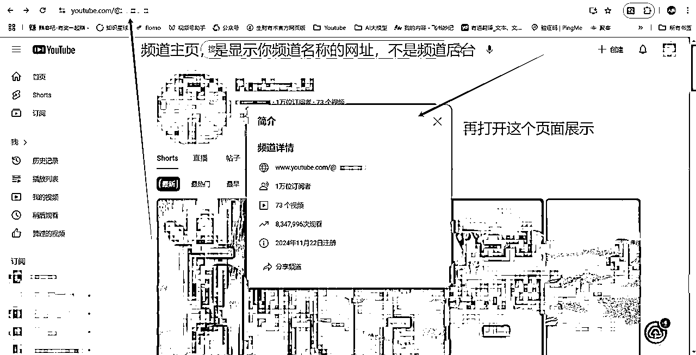

### 2.展示被拒的原因，就是再利用他人内容的页面

例如：这是我申请创收功能被拒绝的原因，是再利用他人的内容。

### 3.讲讲你的作品为什么符合创收，点图上-了解详情这个可以看到

例如：我是科普解说赛道，我就说我的频道是符合创收的内容，是源自其他创作者的视频片段，但通过剪辑在其中添加了故事情节和评论。

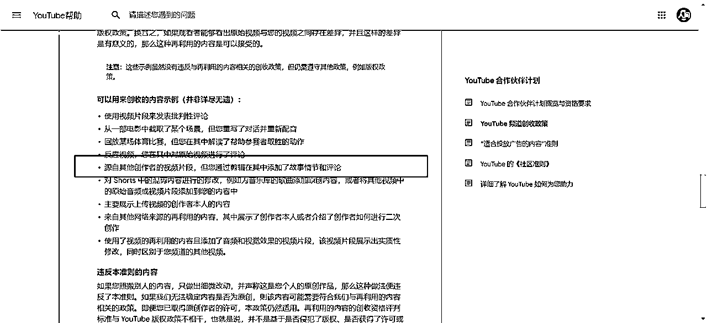

### 4.展示视频的创作流程，剪映或者capcut的草稿箱

我是科普解说逆练，那我肯定不能说我的创作流程哈哈哈。我就用正练的方式走了一遍流程，再展示一下capcut的草稿箱，证明视频都是自己做的。

可以多打开几个草稿箱，展示一下。

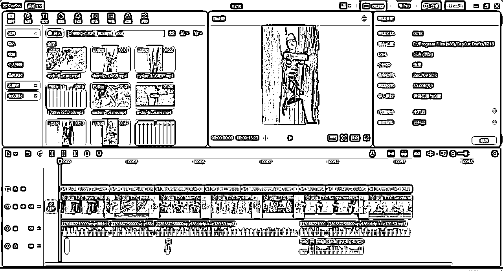

### 5.展示文件夹素材

录制完成之后，给视频加上中文字幕就ok，这就是我申诉的全部流程。

总结：遇到问题真的要向教练请教，自己费劲力气钻研，有时候还不顶教练一句话。

遇到问题要向教练请教，遇到问题要向教练请教，遇到问题要向教练请教。

## 二：达标高级YPP

通过YouTube私教陪跑教练提供的新玩法，截止目前已达标高级YPP，待下周数据更新，即可开通高级YPP。后续我会补充科普解说号YPP开通后收益情况，做这个赛道的圈友也有不少，但能开YPP的人我应该是生财第一位（除了老马教练），我相信大家也一定很期待这类赛道的YPP收益情况，我会积极分享，敬请关注本帖子。

# 总结

1.  分享自己一路走来的心路历程，主要目的是给在同赛道的圈友（reddit和科普解说）鼓励，打鸡血。

1.  对标、执行、迭代：没有天生的爆款，只有不断优化的动作。哪怕暂时数据不佳，也要相信“下一个视频就会爆”。

1.  科普解说赛道打法：按照航海/私教陪跑手册来，极致学习模仿对标视频。爆款之道，就在其中。

如果你也在科普解说赛道摸索，不妨从今天开始——

1.  逐字阅读手册，对标每一个细节；

1.  日更10天，用数据反馈优化方向；

1.  遇到卡点立刻求助教练，拒绝闭门造车。

坚持下去，爆款或许就在明天！

# 感谢

感谢生财有术提供的平台！这次陪跑的效果真的很好，信息非常及时，希望能多多举办！

感谢@方波妮教练、@Gary教练，在陪跑期间遇到问题时都能第一时间解决！

感谢@老马教练 提供的科普解说赛道！

感谢@七天老师、@方波妮教练、@Gary教练 对文章给予的指导！

后续出结果再来给大家汇报，祝愿大家早日开通YPP，一起赚美金！