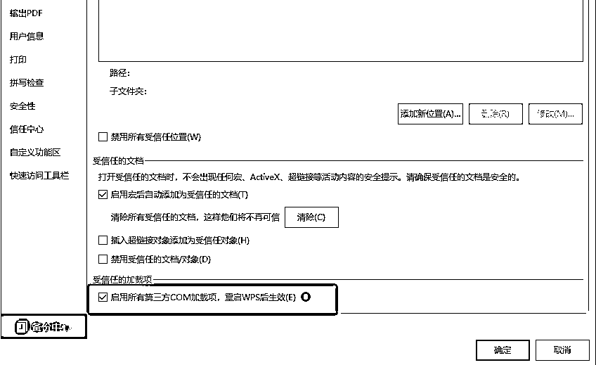
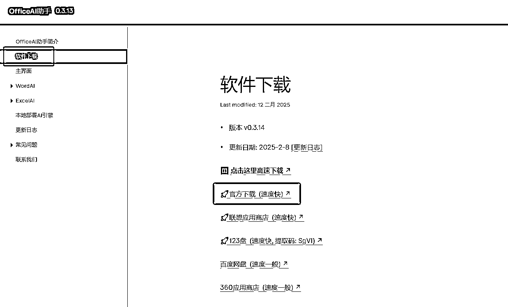
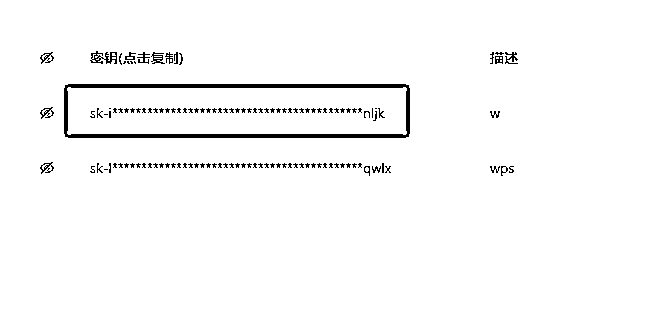
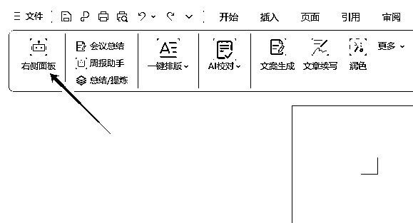
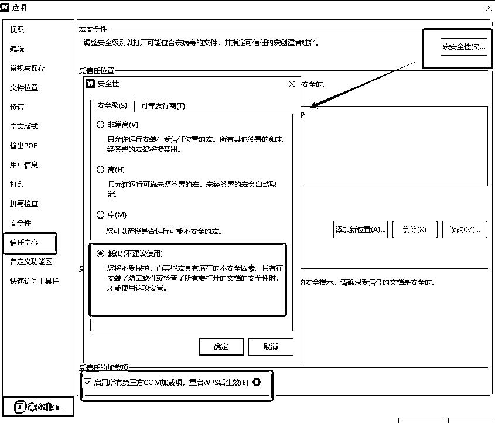
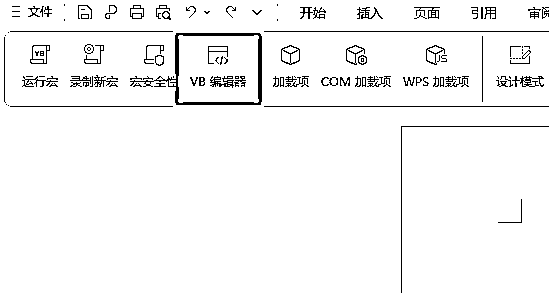
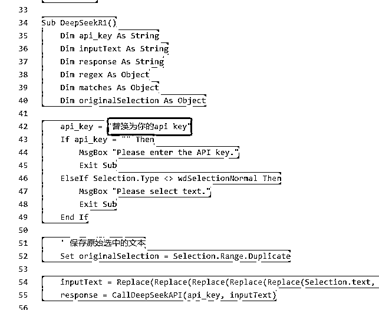
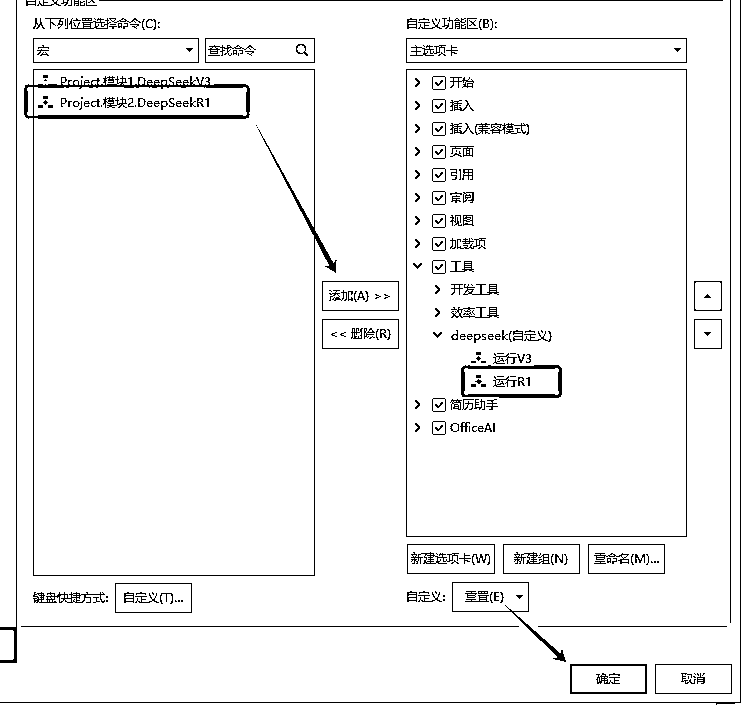

# 把DeepSeek接入WPS，高效办公（保姆级教学）

> 来源：[https://ys8xnr7kn3.feishu.cn/docx/HIwzd2nW1ooudix0MrncQONhnTu](https://ys8xnr7kn3.feishu.cn/docx/HIwzd2nW1ooudix0MrncQONhnTu)

## DeepSeek与Word的梦幻联动，将为你开启高效办公的新篇章！熟悉的Word界面中，只需轻点鼠标，就能召唤出强大的DeepSeek，让它为你快速检索信息、精准翻译文本、智能生成内容…… 告别在不同软件间来回切换的繁琐，告别低效的信息获取方式，让办公效率飞起来！

## 效果演示

按照文本教程完成操作后，Word的选项卡中将会出现DeepSeek的生成图标，选中文本并点击生成，即可实现模型回复！例如，我们想要将一段中文文本翻译成英文：


接下来我将详细介绍，如何实现DeepSeek与Word的结合。

# Office AI助手接入方法

# 设置WPS信任

打开WPS-创建一个文档-点左上角的文件-选项-信任中心



启用所有第三方COM加载项，重启WPS后生效(E)，然后点确定

## 安装office Ai插件

下载officeAi助手：https://www.haiyingsec.com/static/introductions/officeai/introduction.html



下载好后进行安装，安装前要先把WPS关闭


点击完成后就会自动打开WPS，上方就会出现officeAI，登录-点击设置


平台选择硅基流动的R1，然后模型选择R1，这里还需要添加一个API_key

## 获取API Key

登录硅基流动：https://cloud.siliconflow.cn/i/FSIqvgQd




选择密钥-新建密钥-随便填写-复制密钥到WPS-保存



这样就可以在WPS里使用SeepseekR1了

# VBA插件开发方法

## 设置WPS信任

跟上面的方法一样，开始之前还需要先设置一下信任问题



设置好后记得点确定

## 配置WPS

安装wps.vba，下载地址：https://pan.quark.cn/s/f0e6145a1ab0

点击工具-开发工具-点击VB 编辑器





DeepSeek-V3代码：

```
Function CallDeepSeekAPI(api_key As String, inputText As String) As String
    Dim API As String
    Dim SendTxt As String
    Dim Http As Object
    Dim status_code As Integer
    Dim response As String

    API = "https://api.siliconflow.cn/v1/chat/completions"
    SendTxt = "{""model"": ""deepseek-ai/DeepSeek-V3"", ""messages"": [{""role"":""system"", ""content"":""You are a Word assistant""}, {""role"":""user"", ""content"":""" & inputText & """}], ""stream"": false}"

    Set Http = CreateObject("MSXML2.XMLHTTP")
    With Http
        .Open "POST", API, False
        .setRequestHeader "Content-Type", "application/json"
        .setRequestHeader "Authorization", "Bearer " & api_key
        .send SendTxt
        status_code = .Status
        response = .responseText
    End With

    ' 弹出窗口显示 API 响应（调试用）

    ' MsgBox "API Response: " & response, vbInformation, "Debug Info"

    If status_code = 200 Then
        CallDeepSeekAPI = response
    Else
        CallDeepSeekAPI = "Error: " & status_code & " - " & response
    End If

    Set Http = Nothing
End Function

Sub DeepSeekV3()
    Dim api_key As String
    Dim inputText As String
    Dim response As String
    Dim regex As Object
    Dim matches As Object
    Dim originalSelection As Object

    api_key = "替换为你的api key"
    If api_key = "" Then
        MsgBox "Please enter the API key."
        Exit Sub
    ElseIf Selection.Type <> wdSelectionNormal Then
        MsgBox "Please select text."
        Exit Sub
    End If

    ' 保存原始选中的文本
    Set originalSelection = Selection.Range.Duplicate

    inputText = Replace(Replace(Replace(Replace(Replace(Selection.text, "\", "\\"), vbCrLf, ""), vbCr, ""), vbLf, ""), Chr(34), "\""")
    response = CallDeepSeekAPI(api_key, inputText)

    If Left(response, 5) <> "Error" Then
        Set regex = CreateObject("VBScript.RegExp")
        With regex
            .Global = True
            .MultiLine = True
            .IgnoreCase = False
            .Pattern = """content"":""(.*?)"""
        End With
        Set matches = regex.Execute(response)
        If matches.Count > 0 Then
            response = matches(0).SubMatches(0)
            response = Replace(Replace(response, """", Chr(34)), """", Chr(34))

            ' 取消选中原始文本
            Selection.Collapse Direction:=wdCollapseEnd

            ' 将内容插入到选中文字的下一行
            Selection.TypeParagraph ' 插入新行
            Selection.TypeText text:=response

            ' 将光标移回原来选中文本的末尾
            originalSelection.Select
        Else
            MsgBox "Failed to parse API response.", vbExclamation
        End If
    Else
        MsgBox response, vbCritical
    End If
End Sub
```

DeepSeek-R1代码:

```
Function CallDeepSeekAPI(api_key As String, inputText As String) As String
    Dim API As String
    Dim SendTxt As String
    Dim Http As Object
    Dim status_code As Integer
    Dim response As String

    API = "https://api.siliconflow.cn/v1/chat/completions"
    SendTxt = "{""model"": ""deepseek-ai/DeepSeek-R1"", ""messages"": [{""role"":""system"", ""content"":""You are a Word assistant""}, {""role"":""user"", ""content"":""" & inputText & """}], ""stream"": false}"

    Set Http = CreateObject("MSXML2.XMLHTTP")
    With Http
        .Open "POST", API, False
        .setRequestHeader "Content-Type", "application/json"
        .setRequestHeader "Authorization", "Bearer " & api_key
        .send SendTxt
        status_code = .Status
        response = .responseText
    End With

    ' 弹出窗口显示 API 响应（调试用）

    ' MsgBox "API Response: " & response, vbInformation, "Debug Info"

    If status_code = 200 Then
        CallDeepSeekAPI = response
    Else
        CallDeepSeekAPI = "Error: " & status_code & " - " & response
    End If

    Set Http = Nothing
End Function

Sub DeepSeekR1()
    Dim api_key As String
    Dim inputText As String
    Dim response As String
    Dim regex As Object
    Dim matches As Object
    Dim originalSelection As Object

    api_key = "替换为你的api key"
    If api_key = "" Then
        MsgBox "Please enter the API key."
        Exit Sub
    ElseIf Selection.Type <> wdSelectionNormal Then
        MsgBox "Please select text."
        Exit Sub
    End If

    ' 保存原始选中的文本
    Set originalSelection = Selection.Range.Duplicate

    inputText = Replace(Replace(Replace(Replace(Replace(Selection.text, "\", "\\"), vbCrLf, ""), vbCr, ""), vbLf, ""), Chr(34), "\""")
    response = CallDeepSeekAPI(api_key, inputText)

    If Left(response, 5) <> "Error" Then
        Set regex = CreateObject("VBScript.RegExp")
        With regex
            .Global = True
            .MultiLine = True
            .IgnoreCase = False
            .Pattern = """content"":""(.*?)"""
        End With
        Set matches = regex.Execute(response)
        If matches.Count > 0 Then
            response = matches(0).SubMatches(0)
            response = Replace(Replace(response, """", Chr(34)), """", Chr(34))

            ' 取消选中原始文本
            Selection.Collapse Direction:=wdCollapseEnd

            ' 将内容插入到选中文字的下一行
            Selection.TypeParagraph ' 插入新行
            Selection.TypeText text:=response

            ' 将光标移回原来选中文本的末尾
            originalSelection.Select
        Else
            MsgBox "Failed to parse API response.", vbExclamation
        End If
    Else
        MsgBox response, vbCritical
    End If
End Sub
```

选择V3或者R1的代码复制到模块中，记得把代码里面的API key替换成自己的（也就是硅基流动里面复制的）



点击 文件 -> 选项 -> 工具

选中，点击新建组，右键新建组，点击重命名，将其命名为"DeepSeek"

选择DeepSeek（自定义），在左侧命令中选择"宏"




找到并选中"DeepSeekR1"，点击添加，点击重命名，重命名为"运行R1"，点击确定


在文档中输入问题，并选取，然后点击运行，稍等一会，就会成功了

## 将你的文档另存为 Wps 模板 (.dotm)：

点击"文件" → "另存为"

选择保存类型为"Microsoft Word 带宏的模板文件 (*.dotm)"

保存到 Wps 的模板文件夹（通常是 C:\Users\用户名\AppData\Roaming\kingsoft\wps\startup，如C:\Users\Administrator\AppData\Roaming\kingsoft\wps\startup）


这样每次打开 Wps 时，宏就会自动可用