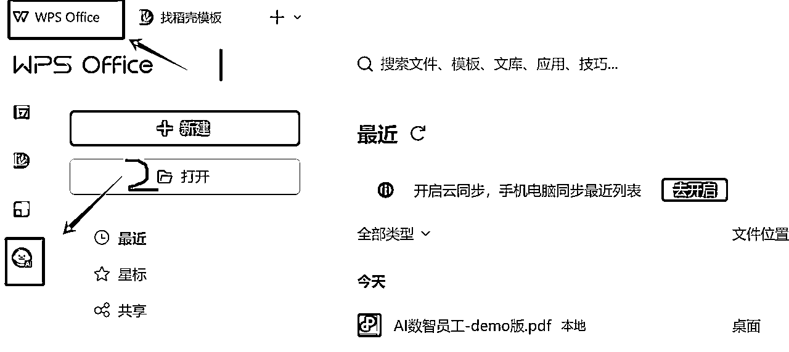
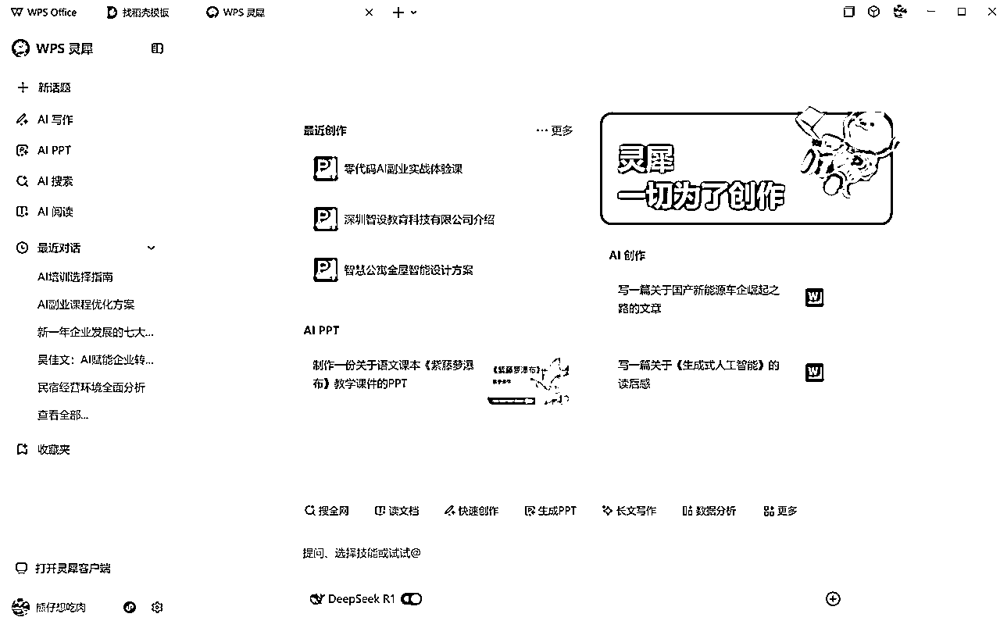
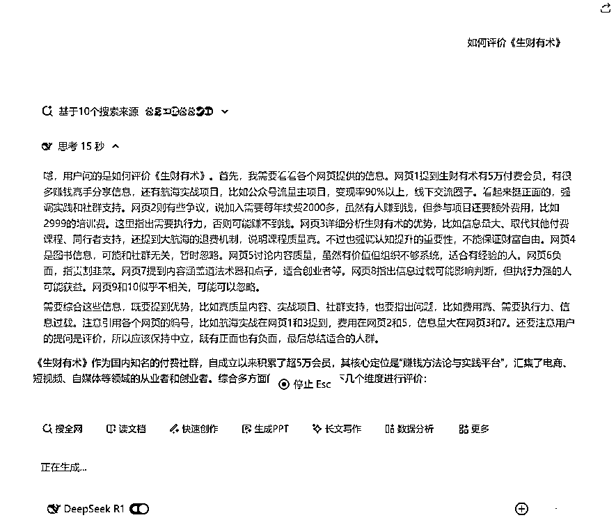
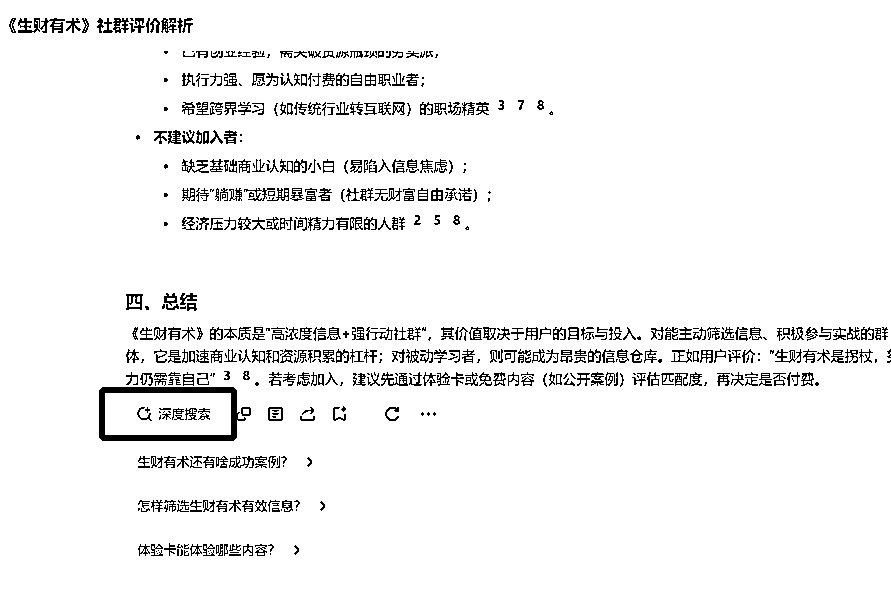
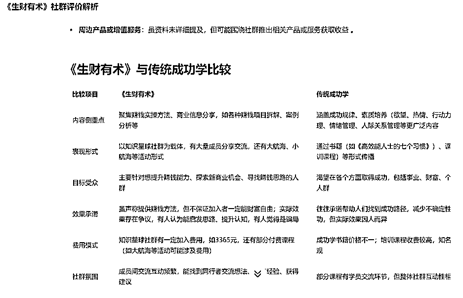
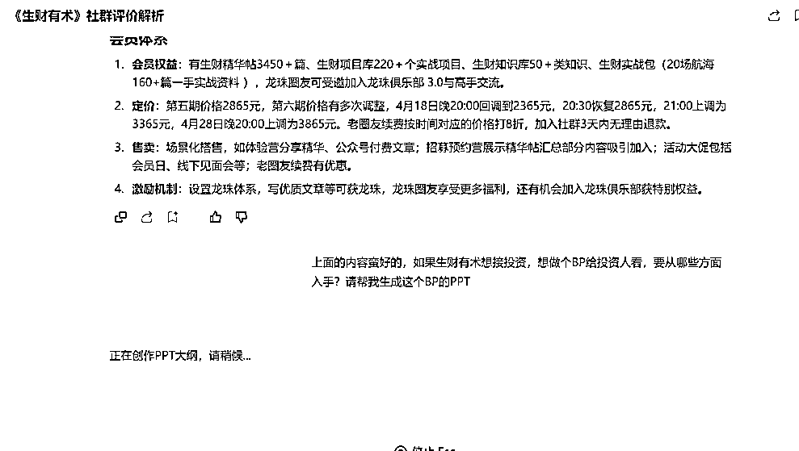
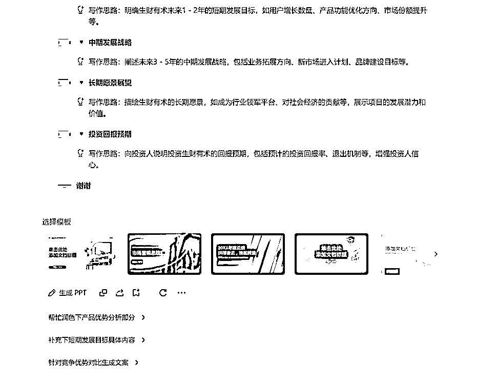
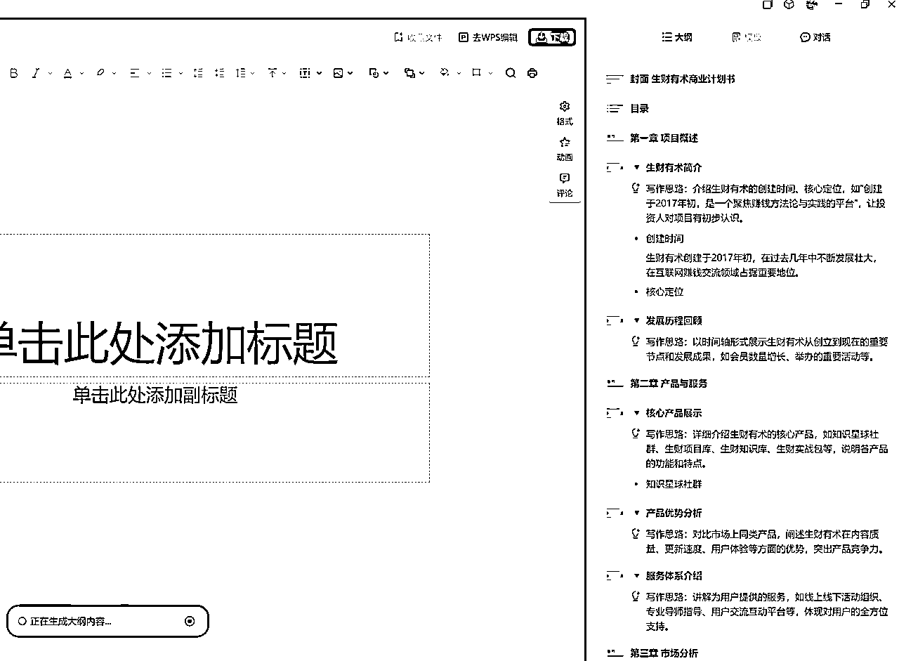
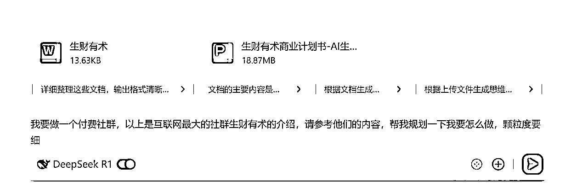

# 牛马福音-用AI提效办公-DEEPSEEK+WPS解决方案

> 来源：[https://lxkvj39q93t.feishu.cn/docx/I6S7dEhoKoO85UxvclfcAwcUnvg](https://lxkvj39q93t.feishu.cn/docx/I6S7dEhoKoO85UxvclfcAwcUnvg)

大家好，我是做AI企业培训的佳文，生财GPT提效、coze、ComfyUI教练

也是那个完全不懂编程但是被阿紫教练教会写小游戏的男人~

随着最近DEEPSEEK的爆火，企业级AI培训需求也越来越多，如果大家最近接洽到企业提效的培训需求，就可以看到，企业培训和个人培训的区别有很大的区别，更多的是需要结合自身业务，来真正提高效率，达成“降本增效”的成果，而不是简单的对话使用，这就对企业服务教练有着更高的要求，需要至少上过班，或者分管过一些部门，对企业的整体流程和一些岗位有着深入的认知，才可以结合AI为企业达成效率的提升。

办公场景，例如PPT等，是企业多数岗位比较核心的工作内容之一，今天就借助DEEPSEEK的浪潮，讲一下如何结合DS，创作PPT等文件

# 一、软件选择：WPS

众所周知，在办公软件这一块，WPS是没有对手的

随着DEEPSEEK的爆火，WPS 的AI功能也与DEEPSEEK进行充分融合，将自身强大的办公功能，通过DS这个放大器，进行多倍放大

WPS的DS入口藏的比较深，可以从软件版进入，也可以直接进入网页版体验(https://copilot.wps.cn/)

为什么选择WPS而不是大家都在推荐的纳米AI、秘塔等呢？

原因有几个

1、金山的服务这么多年来，还是很稳定的

2、办公场景，WPS真的好用

3、不止有DS，更有更多指令

# 二、如何使用WPS版DS

首先，根据上节的路径进入，网页版或APP版

进入之后，可以看到下面有DS的开关，打开就好了，实测是可以联网搜索内容的

我们像正常和AI对话一样，开始与他进行一些沟通

写的速度蛮快的，比官网一会儿一卡的效果要好很多

写完之后，可以再让他进行“深度搜索”

经过几轮对话，可以看到他生成了一些比较不错，比较优质的内容

有了这些内容基础，就可以开始进一步更深入的操作了

# 三、深入使用WPS+DS功能

先做个PPT吧，网页看着有点累~

简单指令搞定

大纲写完了，选个模板让他开工吧

再，等几分钟，就生成好了，文档放在贴子里面，大家想下载的可以自己下载下来玩

# 四、除了PPT，DS+WPS还能做什么

再来个基础的，文档都有了，生成个思维导图吧

指令也是一如既往的简单：把上面的内容帮我生成思维导图

再写一篇公众号吧，指令~同上的简单

懒得排版了，生成的内容见此文档

上面都是网络+AI生成内容，那如果有基础内容，能不能让他做二次修改呢？

我们新开一个窗口，以前面生成的内容为基础，来做二次创作（假设生成的内容就是我们已经掌握的基础资料）

先上传文件再提问，可以让他做更有意思的东西

问出来的方案也放在下面了，供大家参考

# 五、一些思考

以上是用付费社群在做案例，进行商业规划

如果是实体产业呢，是不是可以有更多的案例进行对比、分析、对标？

就像去年很流行的一句话，每一个行业都可以用AI重构一遍

同理的，在不同公司里，每一个岗位、每一个SOP，都可以用AI重建一次

今年企业端AI服务大环境已经成熟了，希望大家能抓住这波风口，迎接更高的上限，与大家共勉