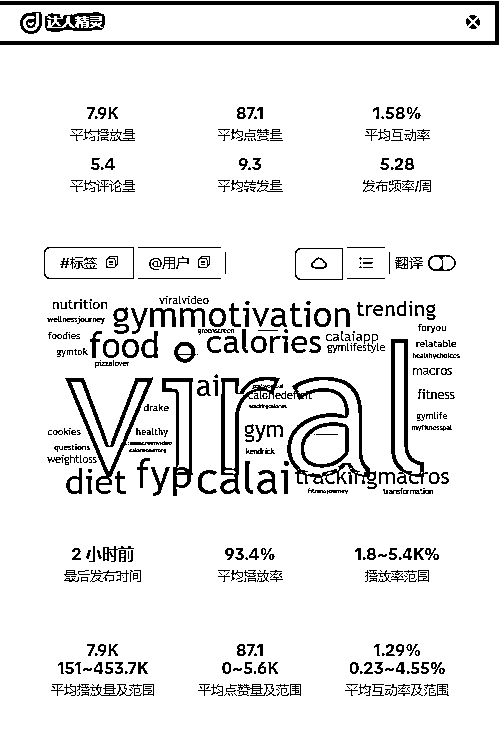

# 浅析2024年一鸣惊人的AI应用——Cal AI

> 来源：[https://gwlxqear42r.feishu.cn/docx/WTfZdQjreotAEMxc3ylcytk8nlf](https://gwlxqear42r.feishu.cn/docx/WTfZdQjreotAEMxc3ylcytk8nlf)

上次写的帖子被加精后，我被狠狠打了一波鸡血。于是，当我看到第三期龙珠悬赏贴，又开始蠢蠢欲动。这一次，我瞄准了2024年风靡美国的AI应用——Cal AI（毕竟抄作业就要抄学霸的！），分析它的变现情况和营销思路。废话不多说，开干！

首先，简单给大家介绍一下Cal AI这款APP。Cal AI是一款由AI驱动的应用程序，旨在帮助用户通过拍照或扫描条形码来分析食物的营养成分，计算卡路里摄入量，从而实现体重管理目标。Cal AI由3人团队开发，其中两位成员年仅17岁！自2024年4月上线以来，该应用在短短6个月内下载量破百万。

Cal AI 主要功能有：

*   食物识别与分析：用户只需拍摄食物照片或扫描包装上的条形码，Cal AI即可分析食物中的蛋白质、碳水化合物和脂肪含量，提供详细的营养成分信息。

*   个性化计划：在初次使用时，用户可以回答一系列关于生活方式和健身目标的问题，Cal AI会根据这些信息制定个性化的饮食和锻炼计划。

*   进度跟踪：用户可以设定目标，并通过每周、每月或每年的数据监控进度，Cal AI会总结用户的成就并指出需要改进的地方。

*   手动修正功能：如果AI分析结果有误，用户可以手动编辑数据进行调整，确保营养信息的准确性。

# 变现情况

关于Cal AI的收入情况，坊间一直议论纷纷。对此，创始人Zach Yadegari毫不避讳，直接在twitter公布App Store的后台数据，更是在Youtube的一档访谈节目里直接向主持人当面秀收入：仅仅10月的收入就高达114万美元！详情可见链接：The 17-Year-Old Who Built a $1.12M/Month Ai App | Zach Yadegari

（PS：Zach Yadegari这个17岁少年的创业历程也很传奇，我会在后面简单讲讲他的创业故事）

为了验证Cal AI的具体数据，我用了Sensor Tower这个APP分析工具。免费版即可查到Cal AI在苹果和谷歌应用商店的基础数据，预计11月总下载量高达50W，收入约84W美金，可以看出Cal AI的收入大头是在苹果应用商店。

然后我又花费巨资10元去闲鱼代查了Cal AI在苹果商店的具体数据（收入、下载量、月活用户、日活用户）：

可以看到Sensor Tower和创始人发在twitter的数据有些出入。我研究了一下，可能有以下原因：

由于应用商店的数据不可公开获取，Sensor Tower是基于其收集到的样本数据和算法来进行估算，并且推算得出的收入仅是用户通过应用商店直接支付的金额，不包含开发者从广告、品牌合作或其他外部收入获得的收入。如果将分析工具的误差，以及外部收入考虑进来，Cal AI实际的月收入情况应该是接近百万美金。

根据11月福布斯的独家报道，Cal AI团队已扩大至17人，并且年化经常性收入ARR可达1200万美元。（注：ARR 是年化经常性收入（Annual Recurring Revenue）的缩写。它是一种衡量订阅型或服务型APP收入的常用指标，表示应用在一年内可预期的经常性收入，计算的是基于用户订阅的收入，排除一次性收入、非经常性收入或广告收入等因素。ARR 主要用于评估应用的长期收入潜力。）

# 流量情况

## 营销策略

在访谈节目中，创始人透露了Cal AI的营销策略主要是红人营销Influencer Marketing, Tiktok是推广的主战场，他们和近150名网红建立了稳定的合作关系，保证每月都有视频产出，花在单个网红身上的费用从100-10W美金之间不等。据他所说，Cal AI的营销策略主要有：

1.  筛选网红：推广初期，他创建了一个新的 TikTok 账户，只刷那些与健康和健身相关的视频，反向利用算法推荐去寻找相关领域的网红。根据网红的视频互动数据、观众参与度、评论质量等筛选合适的候选人。而且在Cal AI上线的第一天开始，就创建了Tiktok账号推广，创始人自己也拍摄视频。他们创建了多个Cal AI相关的账号。主账号用来发布官方宣传视频，其他小号就用来在网红视频评论区与观众互动，引导下载APP。

1.  谈判策略：Cal AI创始人选择绕过网红的MCN团队，直接发送大量私信联系网红，平均每 100条可能获得1-2个有效回复。并且通过提供按月合作的套餐（例如，每月4个视频），以降低单次视频的成本。针对不同网红的实际观看量和互动水平，预估CPM并协商合理价格。

1.  付费机制：通过对比 CPM（每千次展示成本）和 RPM（每千次展示收益），确保每次合作都能带来利润。根据网红历史数据评估其表现，并预付费用锁定合作。假设某网红视频平均获得 50,000 次观看，按 $2 CPM 计算，网红收费 $100。如果预计 RPM（每千次观看收益）是 $5，则视频能够带来 $250 收益，远高于成本，保证了盈利。

1.  视频制作：鼓励网红在日常内容中自然展示应用，而非生硬的广告推荐。例如，通过“每日饮食分享”视频展示 Cal AI。利用评论区互动，通过植入评论或回复用户问题，引导更多人关注应用，例如：“这是什么 App？”以引发讨论。控制评论区，及时回复用户问题，进一步引导用户下载。要求网红固定顶置品牌评论，提高曝光率。

1.  数据驱动。使用内部开发的工具跟踪网红的推广效果，这套工具可以通过对比视频发布后的下载量曲线和收入变化，来评估不同网红的实际转化率，优化投入（并且打算将这套工具公开，售卖给其他广告商，这商业思维牛逼👍）

1.  内容复用：收集网红制作的视频，并通过官方账户重新发布。根据视频的表现，将内容重复使用（间隔几个月后重新发布）以节省成本并维持流量。将不同网红生成的内容整合，用于Meta等其他平台的付费广告。

## TK流量

因为Tiktok的推荐流比较难统计，所以我统计的是搜索流部分的视频流量情况。此环节用到的工具有达人精灵和影刀RPA。（PS：我的流量分析方法可能比较浅显，如果圈友有更好的Tiktok流量分析方法，欢迎留言哟！）

以下是在Tiktok搜索“cal ai”出现的、与此应用有关的视频（已剔除不相关视频），总计观看数破亿级。这只是一个搜索关键词抓取的视频数据，Cal AI铺设的视频流量肯定是远大于这个数据的。通过汇总这些基础信息，我发现了一些值得关注的点：

①爆款视频规律

*   功能导向：强调Cal AI的核心功能（如快速追踪、简单易用）的标题通常观看量较高，如“Track your calories”、“Cal AI makes tracking easy”等，或者突出使用Cal AI后的效果，如“Lost over 130lbs”、“Best way to lose weight”等。

*   情感共鸣：能够引起用户情感共鸣的标题（如感激、惊喜）更容易吸引观众。使用情感化的词汇或表情符号吸引用户，如“Thank god for this app😭”、“Literally just take a picture😭”等。

*   引发好奇心：通过提问或使用引人入胜的词汇，如“Why AI Calorie tracking apps are bogus”、“What’s actually hard… 🦾”等。

*   使用简洁语言：标题简短且直接，容易理解，如“FASTEST calorie tracking EVER”、“Cal AI is so much easier than using a scale”等，或者直接在标题艾特Cal AI的官媒账号，引导点击。

②红人合作规律

Cal AI 目标是全球市场，合作的网红不仅限于美国，还有欧洲、中东等地，视频发布语言囊括西语、阿拉伯语等。（在德国、中东地区已经出现了模仿Cal AI、使用本地化语言的应用，猜测后续Cal AI可能会推出多语言版本）

正如创始人在访谈中所说，他们的确会和投入产出比高的头部网红深度绑定，多次合作。例如拥有两百万粉丝的网红alim_kh0，就和Cal AI合作了8个视频，最多的时候在12月发布了3条视频，总共为该产品贡献了五千万播放量。

③官媒矩阵化

细数了一下，在这批视频里披着cal ai软件头像和名称的Tiktok账号就有11 个：getcalai、cal.ai.app、cal.ai0、app.calai、cal.ai4、try.cal.ai、cal.aiapp、trycalai、thecalai.app、cal.ai0、app_calai。这些账号的内容除了二次复用网红的爆款视频，还有真人出镜拍摄（应该是团队成员或者兼职外包）。这样做的好处有：

*   节省推广费用。可以借鉴网红的爆款视频，在此基础上迭代优化，自己生产爆款视频；

*   提高内容转化。活跃在网红的视频评论区，回复APP相关的提问，引导用户下载使用；

*   增加营销声势。相较于网红的软广，官方账号的视频内容更加直白，80%的视频标题都直接写上产品名称Cal AI，简介都是一句话卖点+下载指引，例如：“Take a Picture, Track your calories👇👇👇Search “Cal Ai” on the App Store”，就像是在大卖场门口拿着个大喇叭吼“走过路过，不要错过，快来下载这款APP啊！！！”

# 创业历程

因为Cal AI的成功，很多人将17岁的Zach称为天才少年。实际上，17岁的他已经是一个创业老手，体会过成功的甜美，也品尝过失败的苦果。他的创业之旅远比大家想象的更早开始。

Zach的创业之旅始于7岁。那时的他沉迷电子游戏，为了学会制作属于自己的游戏，报名参加了一个编程夏令营。在夏令营期间，他花了大量时间研究Youtube上的教程视频，有时能看上一整天，然后动手实操。12岁时，他成功地将自己的第一个游戏发布到应用商店。

13岁时，他看到有同学经常一次性打开很多网站来玩游戏，于是创建了一个名为“Totally Science”的游戏网站，该网站可以集成很多热门小游戏，伪装成教育类网站，绕过学校的游戏封锁协议，让学生能够在课堂上玩游戏。这个网站很快吸引了大量学生党，还让Zach体会到了产品从0到1实现商业化的惊喜，当时这个网站每年能给他带来6万美元收入。创建两年后，Zach在 flippa.com 网站上以10万美元的价格将其卖给了一个更大的游戏网站。

在高中时期，Zach意识到自己需要更大的挑战。于是他又和朋友一起开发了一款名为“Grindclock”的APP，通过用David gogins类似的励志演讲者语音，让用户在激情澎湃的鞭策中起床。刚开始的市场反馈不错，短时间内就获得了2万次下载，但增长未能持续，于是Zach和团队将目光转向其他赛道。

那时的他开始去健身房锻炼，想要增肌，所以每天要记录饮食和计算卡路里。但是由于用来记录的软件My Fitness Pal 操作太繁琐，Zach用了3天就忍无可忍将其卸载。恰逢ChatGPT等AI技术的推出和流行，他就开始思考能不能将两者结合起来，用AI来优化这种卡路里追踪的应用程序。于是，Cal AI诞生了。

