# YouTube Shorts AI赛道“动物救援”爆款变种——“天使狗狗”制作攻略

> 来源：[https://lijv5pnbdb.feishu.cn/docx/IWNkdCEWIonehhxE0g7cWHeMnad](https://lijv5pnbdb.feishu.cn/docx/IWNkdCEWIonehhxE0g7cWHeMnad)

# 前言

大家好，我是轻舟，10年+全栈工程师，目前主做YouTube Shorts AI赛道，也对AI编程很感兴趣。

YouTube Shorts近期有一个“天使狗狗”（Angel Dog）的 AI赛道异常火爆，对标账号创建2个多月，47个视频播放量超过3亿5千万。

也吸引了一些圈友的注意，这篇文章就详细拆解一下这类视频应该如何制作。

# 整篇文章结构

# 对标账号数据

对标账号(起号阶段重点看这个，建议也看看其他的)：https://www.youtube.com/@dog-cute-animals/shorts

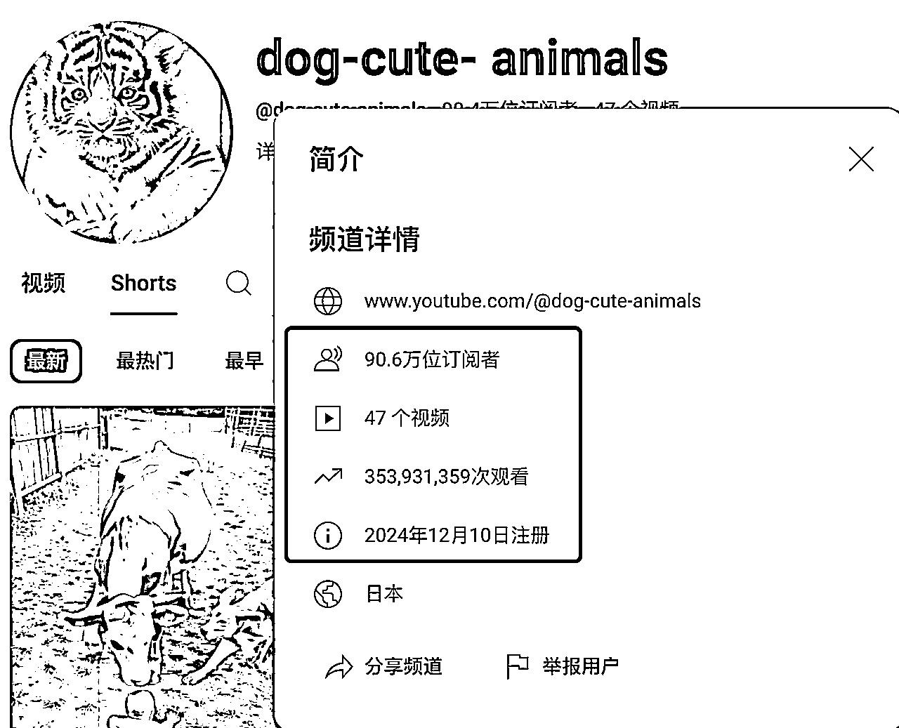

按热门排序

2个超过五千万播，8个超过一千万播，上限非常高

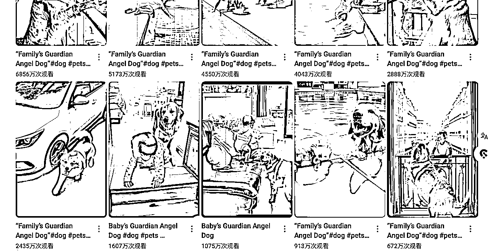

按最新排序

一周内仍有千万播视频出现，多个百万级或接近百万级出现，现在入场完全不晚

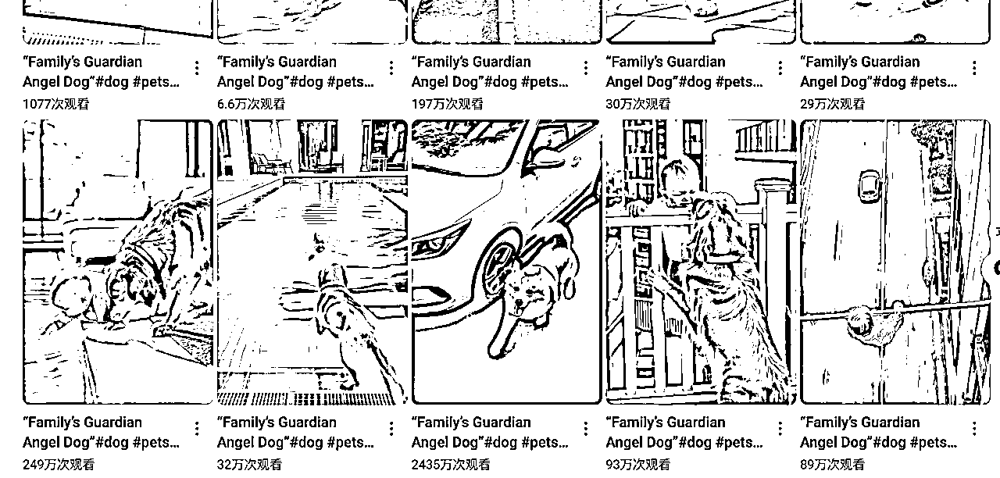

# 时间线

*   对标账号首个视频发布时间是24年12月17日，我第一次刷到的时间大概是1月23日

*   我首次发布时间是1月29号（闷头搞了一个星期，才做出第一个😒），目前发布了22个该赛道视频

*   该赛道首次出现在生财，是在2月14日路大的帖子里，“太好用了!”DeepSeek+YouTube油管影视解说变现

*   2月17日，Gary教练发布私教陪跑中期复盘帖，我鼓起勇气去链接咨询，教练明确告诉我该赛道很不错，无限进步--YouTube Al shorts私教陪跑中期复盘

*   2月19日，该赛道出现在中标中，帖主@徒步联系到我(Gary教练介绍)，请教该赛道制作方法 中标帖

*   2月19日，youtube有人(订阅有14.3万)评论，找我请教制作方法，还在邮件沟通中，不确定是不是圈友

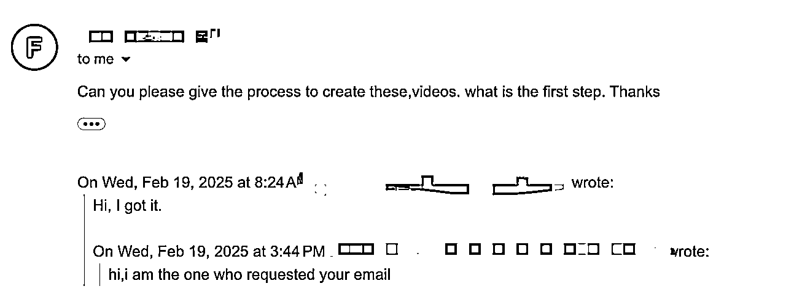

# 我的账号情况

*   更新了22个之后，出现第一个推流的视频，目前播放量28w+

*   教练金口玉言，可以冲小百万😄

*   对标是超过5千万播的视频，我目前的数据和观看率还有很大差距，优化空间很大

*   要把目标定在千万播！

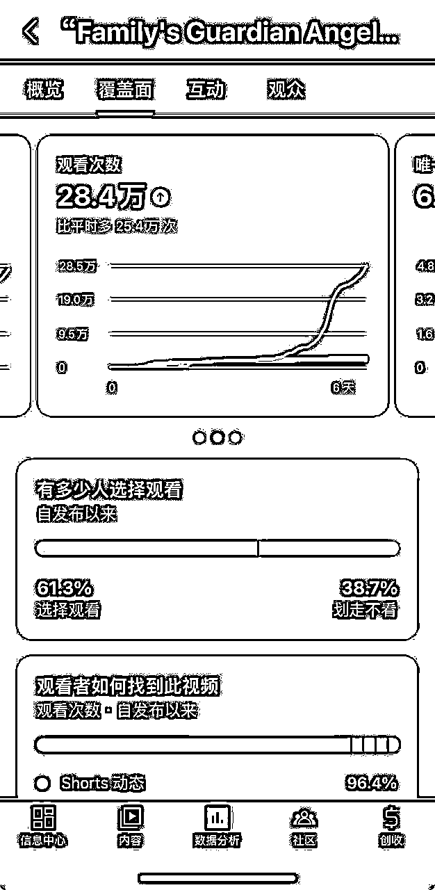

# 怎么做

既然证明了这是个好赛道，也吸引了越来越多的人关注，接下来文章会以自己的账号和视频为案例，详细分享以下信息点：

🚩如何挖到一个比较蓝海的爆款赛道

🚩爆款原理拆解

🚩实操教程与难点解析

## 如何挖到一个比较蓝海的爆款赛道

这是我咨询Gary教练时，他的第一个疑问

1）每天刷youtube，看到AI类的频道，播放量还不错的，先点赞，然后进频道，如果整体数据都不错，就订阅，截图是我订阅的全部频道

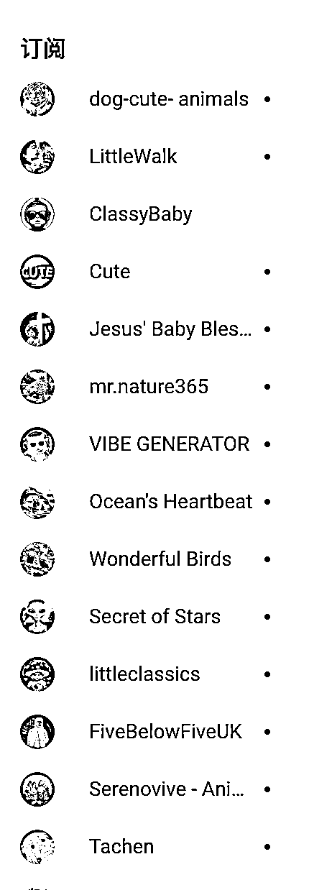

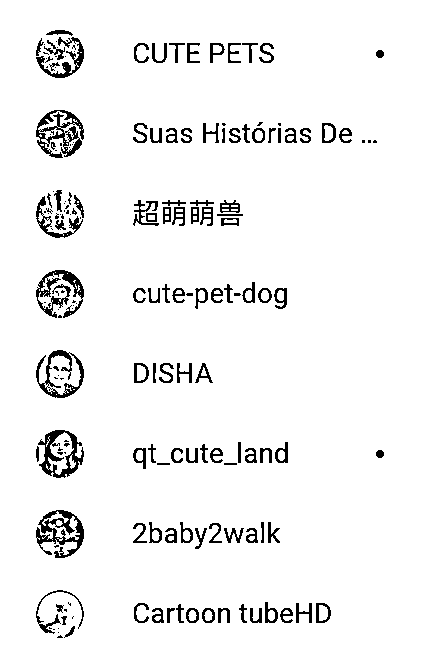

2）每天刷订阅shorts列表页 订阅shorts列表页，这个列表是按发布时间排序的，看到视频比较靠前观看量又很高的就是你的重点关注对象（近期爆款）。（仔细看，其实图里面又有一个值得关注的赛道了）

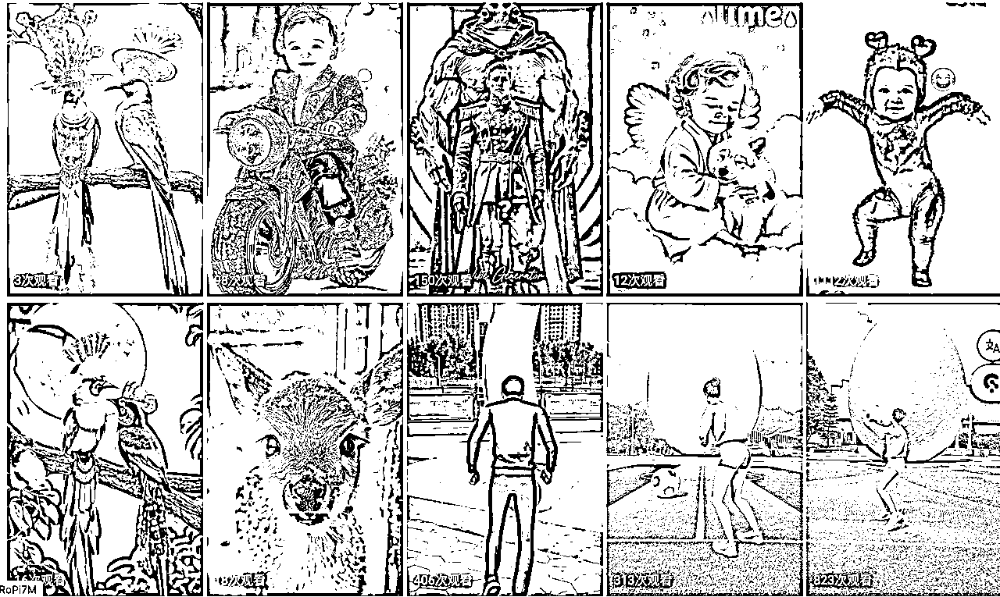

3）记得每天花几分钟刷，一定要坚持，能很快感知到爆款赛道

## 爆款原理拆解🔥

这是我个人的思考，我的视频大多是按这个逻辑来制作，在此分享给大家

用户思维

我们在刷youtube时，什么视频会让我们停下：搞笑、惊奇、共鸣等

欧美国家大部分家庭会养大型犬，而且当成家人看待（从某风向标看到）

天使狗狗属于哪一类（提升选择观看率的关键）

共鸣类，用户刷到时，心会被揪一下，这个宝宝好危险，不会出事吧

底层逻辑（决定了平均观看时长）

提供情绪价值，用户看到这类视频的15-30秒内，心情应该是担心-->期待-->长舒一口气或是会心一笑

此处不再展开，大家可以思考一下，也可以找我交流。

留个思考题：按照上面说的心情曲线，你应该如何分配这15-30秒，如果你有思路，那就太好了！

## 实操教程与难点解析

### 先看一下完整视频

### 制作难点一览

1、该类视频最大的特点是一镜到底，这是最大的难点（保证人物和场景的高度一致性）

2、视频中的狗狗作为拯救者，有时候开场是不存在的，如何让它丝滑入场(看下图，youtube上也有人咨询我)

3、尽可能做到真实，最好是有人在评论区骂你，怎么可以拿这种事情拍视频，看下图😂

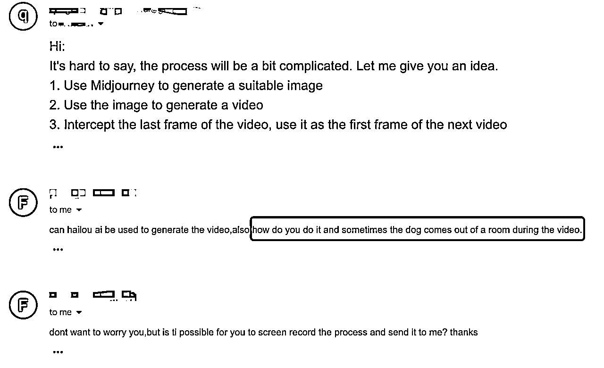

### 故事创作

把自己当成导演，你怎么安排这两个演员，演一个惊险的小故事

可以用AI工具帮你生成剧本，故事一定要简单，太复杂的制作起来会很痛苦，

开始制作前脑海中要有画面，多想想够不够吸引人。

### 首图制作

首图制作非常关键，这里重复一下心情曲线：担心-->期待-->长舒一口气或是会心一笑

重点强调：担心的情绪，一定要在第一秒揪住用户的心

但是也不要太过了，毕竟是小孩子，还要稍微兼顾下真实性(不要出现刀、血腥等，大概率会限流)

1）作图之前，要想好方位，小孩出现在什么位置，狗狗在什么位置，狗狗怎么走到宝宝面前，空间够不够

2）第一次生成，可以拿对标视频的截图来垫图，方法航海手册和很多帖子都讲过，使用midjourney的/describe命令

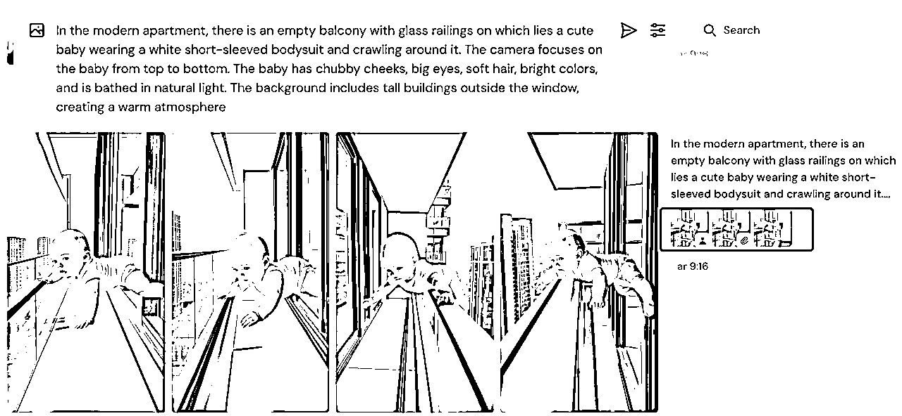

可以看到，我是拿对标垫图的，咒语供参考

In the modern apartment, there is an empty balcony with glass railings on which lies a cute baby wearing a white short-sleeved bodysuit and crawling around it. The camera focuses on the baby from top to bottom. The baby has chubby cheeks, big eyes, soft hair, bright colors, and is bathed in natural light. The background includes tall buildings outside the window, creating a warm atmosphere. --ar 9:16

可能遇到的问题：

生成怼脸图片，或者图片整体很好，但是狗狗出现的位置不够

我的解决方案（以下图为例）：

图片整体很好，但是婴儿后面太窄，主场景空间不够

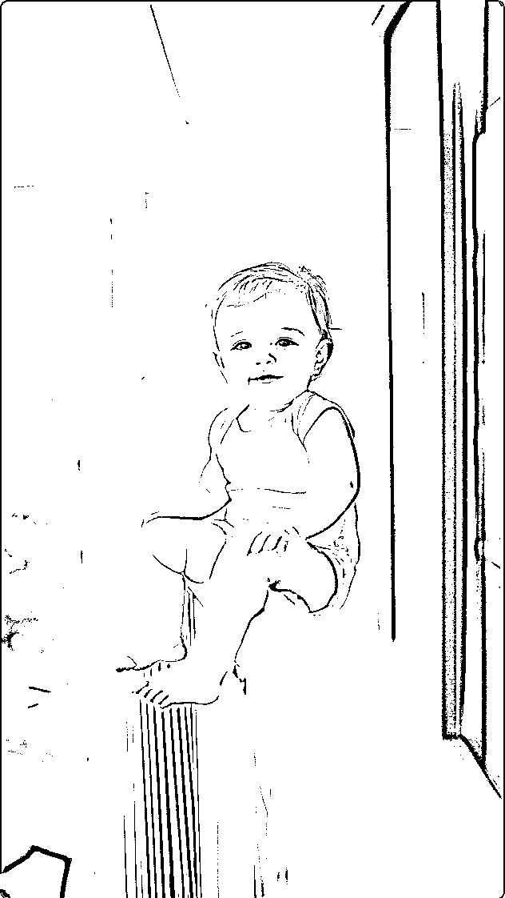

1）使用midjourney的Edit功能（需年费会员），把左边的内容隐藏，选择9:16后，右边会空出来一部分

点击Suggest Prompt，然后Submit Edit即可，右边会重新生成

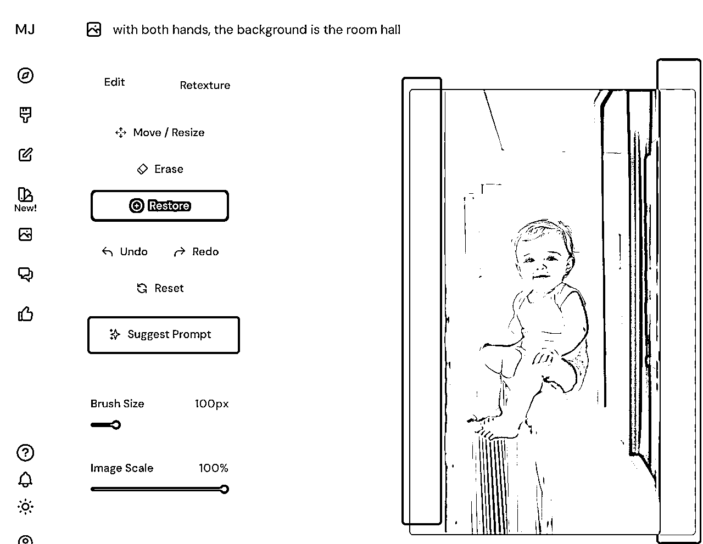

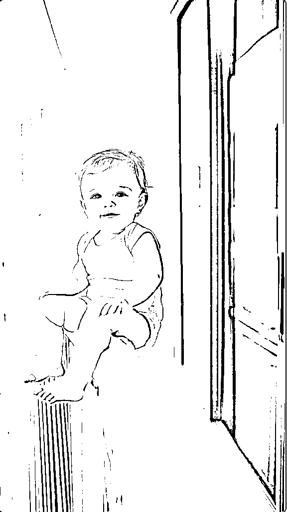

2）即梦的智能画布也可以实现类似的功能，而且免费，大家可以尝试一下

### 视频制作

怎么只做了一张图，就开始制作视频啦？？

一镜到底是这样的，我也没想到好的办法，继续往下看吧😭

可用工具，按效果：可灵≈海螺>runway

#### 生成第一个视频

第一次生成情况（我让金毛出场，结果视频播完了，也没看到金毛😭）：

也别浪费，调个倍速当成开头，能省就省点。。。。。。

这里会引出一个难点，怎么让狗丝滑走入场景

方案1：调整提示词多试几次，不过可灵好贵。。。。。。

方案2：

*   使用midjourney的Edit功能，在首图合适的地方添加一条狗，一般加个模糊的头即可（参考下图示例）

*   即梦智能画布的局部重绘也可以实现

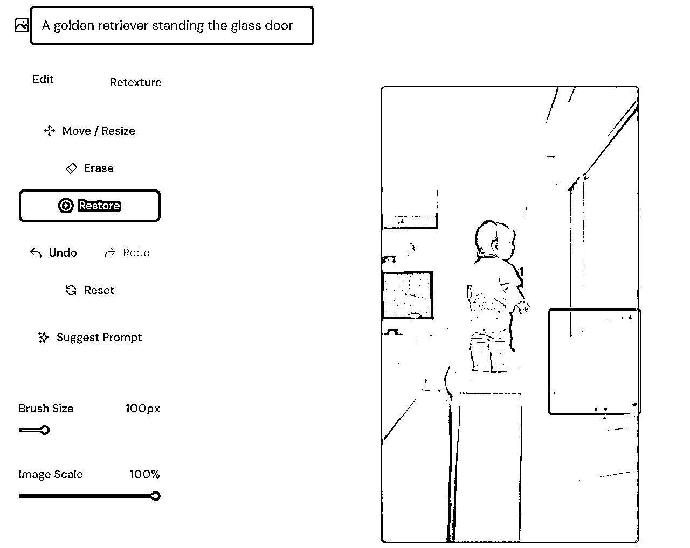

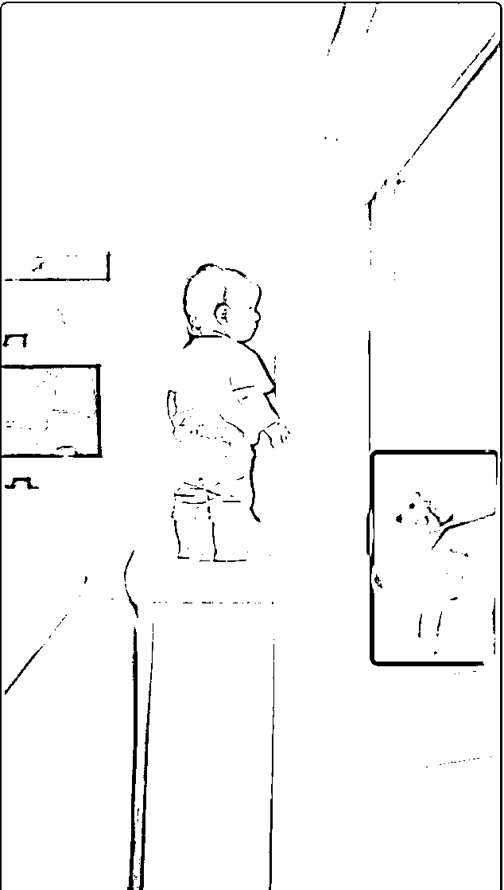

这两种方案都要抽卡，如果有大神知道确定性比较高的方法，希望能指导一下

我采用第一种方案，调整了一下描述，第二次生成

金毛丝滑出现了，还跟小孩互动起来了，运气不错，感动。。。

我的经验是，在提示词中，把金毛当成主角，提示词尽量简单，成功率会比较高

比如：金毛狗快速跑到小孩面前（加个“狗”字是因为，有一次AI把金毛当成了小孩的金色头发😅）

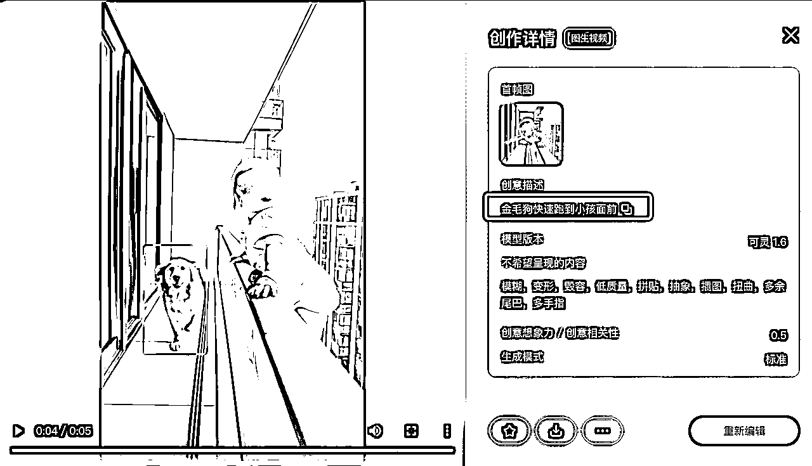

#### 生成第二个视频

核心思路：截取第一个视频的尾帧，作为第二个视频的首帧继续生成，相当于视频延长

注意：如果第一个视频的尾帧不合适，出现错位、模糊、明显遮挡等情况，要往前截取合适的。选择不合适的图片，效果会很难把控。

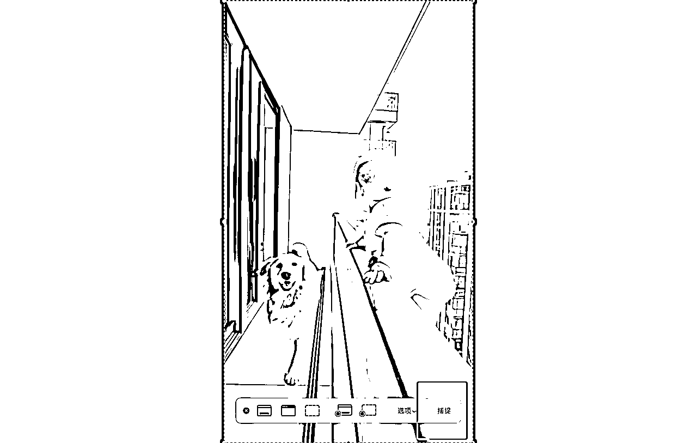

截取上传，重复这个操作即可。

遇到的问题汇总

问题1：动作没做完就结束了

举例：狗狗伸手抚摸孩子，伸到一半上个视频结束，下个视频手又缩回去了

解决方案

避免使用这种帧进行视频生成，

如果需要使用，要有意识地通过明确提示词来控制，如：金毛伸手抚摸孩子

问题2：上一个视频尾帧出现遮挡，下个视频人物就变了

比如上一个视频尾帧是狗狗抱住小孩，挡住了小孩的头，下一个视频，小孩再出现时完全变了个人

下图的例子里，小孩的脚跨过栏杆时，莫名其妙多出来一双鞋

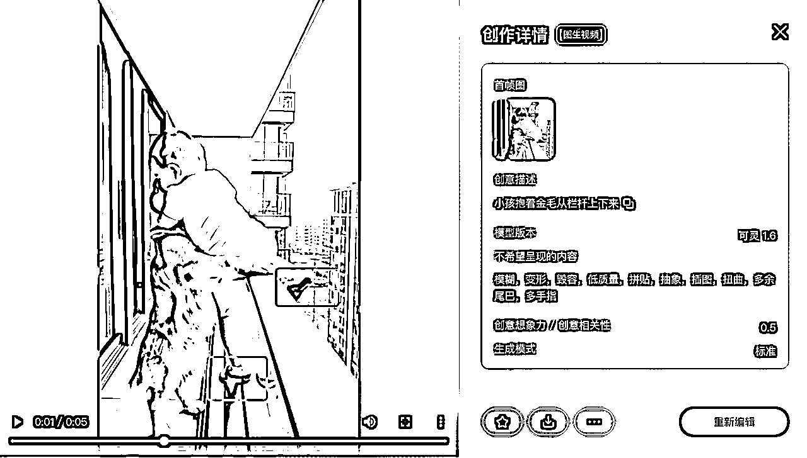

解决方案

方案1：丢弃上一个视频遮挡部分的内容，选择未被遮挡的帧，通过提示词控制，在下一个视频中还会生成上一个视频丢弃的部分，但是会往后延长一些

方案2：下一个视频的描述词中，加上小孩的穿着外貌描述，但不要加太多内容，会影响视频生成

问题3：非会员视频水印问题

可灵、海螺非会员生成的视频都有水印，现在剪映会员也无法去掉这些水印

解决方案

视频生成阶段，请不要有强迫症，忽略水印，待所有视频生成之后，统一在剪映中处理水印，处理方式见视频剪辑章节。

### 视频剪辑

视频剪辑，只需要把几个视频简单拼接即可，我还是重点讲遇到的问题和解决方案

问题1：速度、步调不统一

比如：上一个视频正在跑，第二个视频变成走了

解决方案

用剪映生成视频时，先截取不一致的部分，再调整不一致部分的倍数

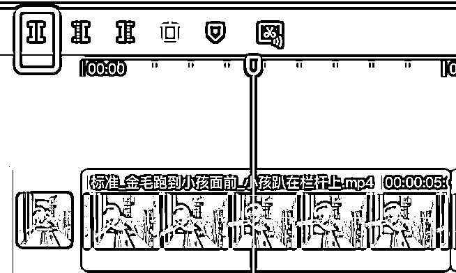

问题2：非会员视频水印问题

用剪映生成视频时，调整缩放即可，可灵调成108%，海螺调成111%，可以隐藏水印

缩放之后，会带来新的问题，前后衔接的地方会出现抖动，怎么处理？

前一个视频衔接处：通过关键帧，控制前一个视频平滑缩放，达到完美衔接，参考下图

后一个视频衔接处：把后一个视频做同样比例的缩放

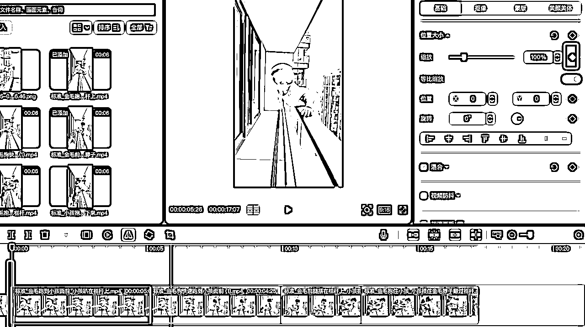

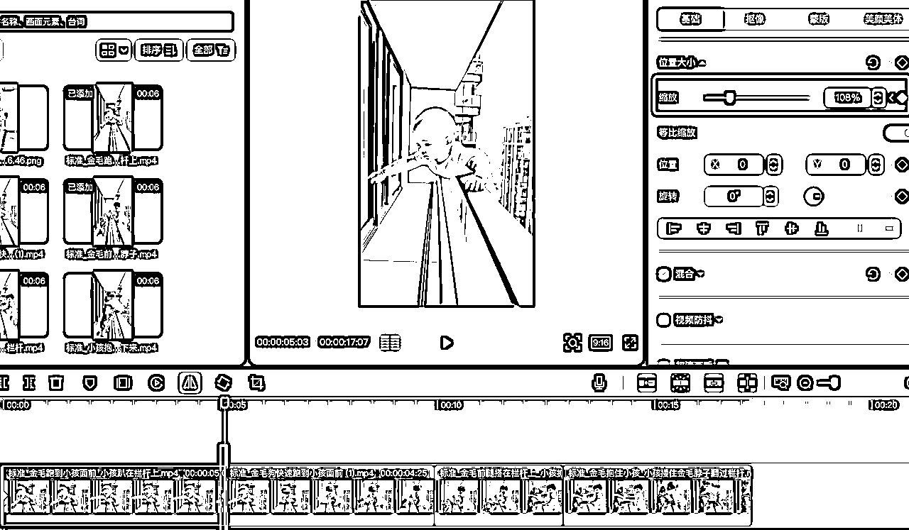

问题3：添加音频

这个只能看感觉，我把收藏的所有音频列出来，供大家参考

# 结语

我的很多做法都是野路子，还有很多优化空间，分享出来是想给大家一个参考。

大家在做的过程中，要抛弃完美主义，先完成再完美。

想下场的，不要想太多，直接开始就行啦。

希望这篇文章能真正帮到几个圈友，我也很乐意跟大家一起探讨，一起进步，一起开通YPP!

最后，我要特别感谢下Gary教练，耐心地帮我指出存在的问题，在我提出把心得分享出来时，他非常支持，主动提出要帮我把关。

我告诉他，他是我软关系中的第一个贵人！