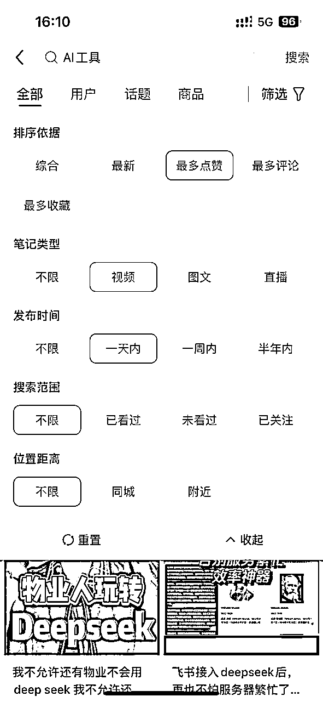
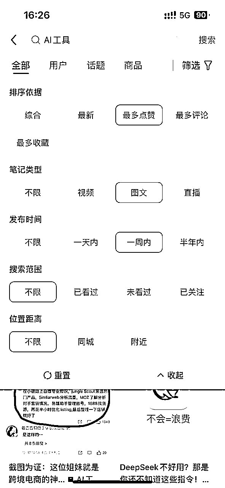
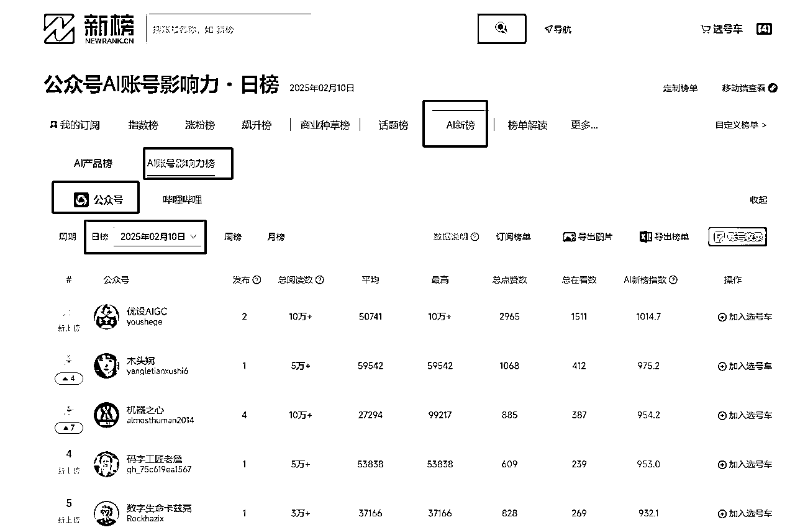
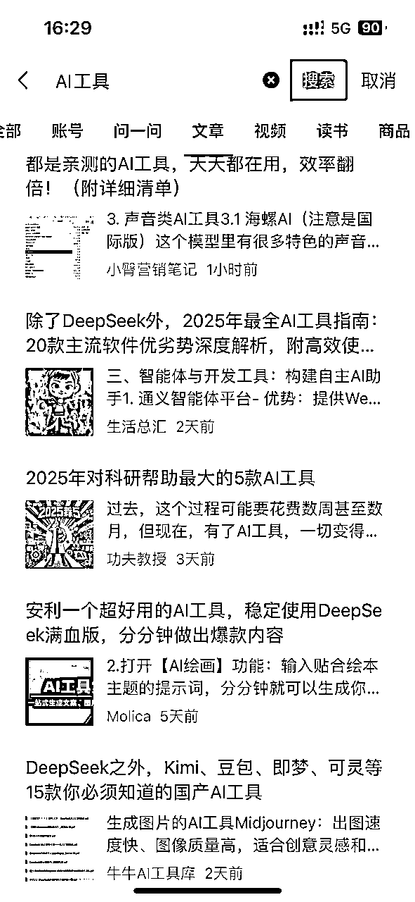
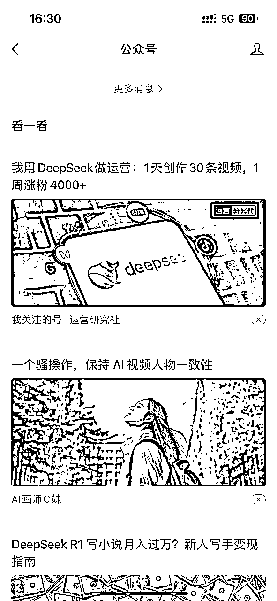
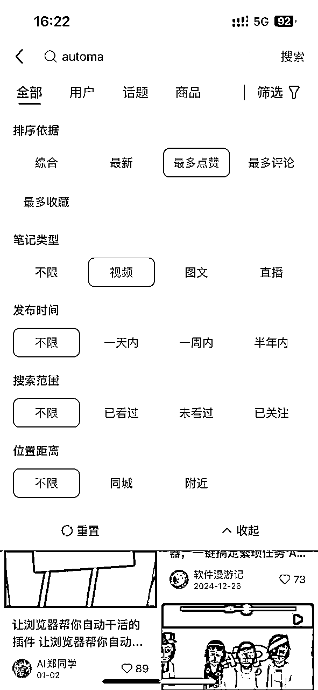
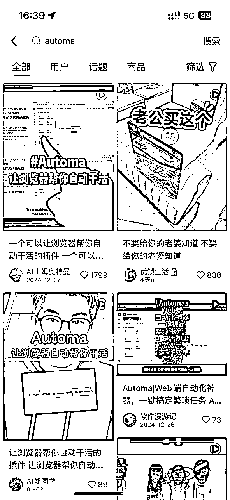
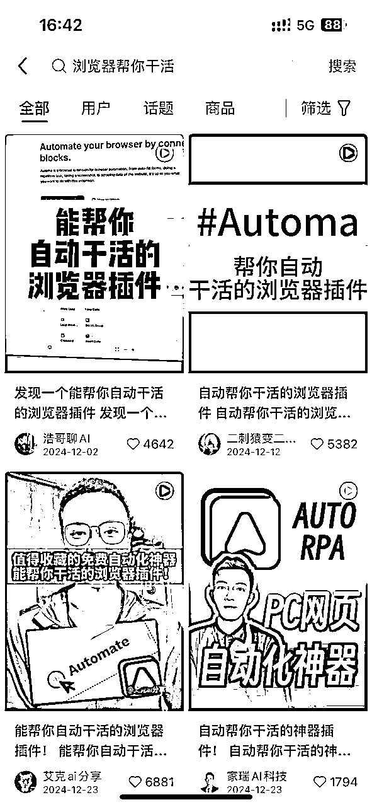

# 自媒体小白做AIP，41天全网粉丝2万

> 来源：[https://x0jfcqhoq5e.feishu.cn/docx/J3JWdJF1VoQG3wx5BGlcHhCQnBf](https://x0jfcqhoq5e.feishu.cn/docx/J3JWdJF1VoQG3wx5BGlcHhCQnBf)

大家好，我是柠檬，人在杭州

在第41天的时候，也就是今天，我成为了全网AIP 2万的博主（过年期间的deepseek并没有给我带来爆款）

# 一、结果展示：

从25年的1月1日开始发布小红书、视频号和抖音视频。

截至目前41天：小红书8900粉丝，视频号8600，抖音2000

变现金额：全靠商单，接了6个商单，总变现4000元（有2个1000多的，其他的都是几百元）

目前在没有爆款的情况下，粉丝每天以100到200左右的范围在涨。

# 二、过程：

## 2.1 为什么选择做AI工具号

先说一下，我在选择做AI的时候，我的思考的路径是这样子的：

因为算是第一次做自媒体，不太知道怎么做，我也怕我不能坚持下来。

我也没有想清楚我后续怎么变现，但是不管，我觉得我得先做起来，要不然越想自己就越畏难。

因此我就需要能够找到有正反馈让我能够坚持下去、可以迅速看到变现、制作简单、对标不算很多的账号。

我依靠着上面这4个选择赛道的角度，在公众号、小红书、抖音上去搜索关键词:AI

我先拿着“AI”这个关键词，在公众号上去搜索文章，

然后又根据这些文章，去不断的点击收藏、喜欢、关注，看他们文章的关键词，再看公众号给我的推荐文章，

就这样来来回回的不断的操作。

最终发现了几个关键词：

AI、AI前沿资讯、AI提示词、AI工具、AI变现、AI神器、AI软件、AI搞钱、AI副业、小白学AI、普通人学AI

AI智能体、AI绘画等等等

然后我又拿着这些关键词分别去小红书和抖音搜索。看视频的时候就点喜欢、收藏、关注。跟公众号操作一样。

就这样反反复复的我就知道大概有哪些类型，哪些账号。

研究了一通之后，最后选择了AI工具这个细分赛道。完美符合我上面选细分赛道的4个角度。

就对着电脑拍、介绍AI工具，剪辑难度不是很大，变现也简单，靠接商单

| 细分赛道 | 小红书对标账号 | 不选择的原因 |
| AI前沿资讯 | 朋克周、赛文乔伊、马克张 | 1、受众小（喜欢科技和AI的人群）、剪辑难度有点大（剪辑繁琐）、前沿科技需要经常关注外网新闻、没办法快速正反馈变现（前期需要接大厂的广告）。 2、只是不适合作为初期刚进入AI赛道的我来做。后续会准备尝试做这个赛道试试水 |
| AI副业 | 柿子的AI生财笔记、AIGC自修室 | 1、剪辑难度太大，没办法快速有正反馈 2、变现方式：需要卖课和直播卖课。自己之前又完全没这个经验 |

最后等我完成这些步骤，我就觉得这和我在工作中需要做的产品调研、竞品调研的方式一模一样。

通过一个关键词，就可以以点带面挖掘出整个方向。

做完这一步让我内心有点小自信了，不再那么胆怯去做自媒体，底层的方法和在工作上做产品经理是相通的。

## 2.2 AI工具号制作

### 2.2.1 选题

#### 1、小红书视频选题

确定了要做AI工具 这个细分赛道后，接下来就是要确定“选题”了。

选题我目前主要通过小红书、公众号去搜索。

为什么没有通过抖音。是因为我抖音的涨粉速度慢，小红书涨粉速度快，因此日常选题主要通过小红书和公众号去选。

刚开始不知道如何要确定选题。偶然有一天我发现同一个工具，有很多博主都在讲，而且都爆了。

那我就按照思路去抄。我也去讲这个选题。

就只需要在小红书的搜索里，筛选一天内，视频类型的去借鉴他们就行。

如果一天内的选题自己觉得做不下来，我也会筛选一周内/半年内的爆的视频去做。

#### 2、小红书图文选题

图文爆过的内容，用视频讲也会爆。

所以也可以在小红书搜索图文里的内容，看看有没有自己能做的。

#### 3、微信公众号

选题，这2个字我理解成是对一个观点的解读，那么如果在公众号爆了，其他平台也会爆。那么就继续在其他平台就行。

主要看4点：

(1)微信里的搜索关键词

(2)日常微信推荐的文章

(3)自己关注的公众号

(4)新榜AI

### 2.2.2 确定怎么拍

确定要做什么选题之后，我发现我不会拍。我不知道要怎么对着电脑拍,要拍哪些内容。

然后我就去拿着这个选题去小红书搜索。看看爆的视频的拍摄手法是什么。

比如我要介绍一款浏览器自动化工具automa。那我就筛选“最多点赞、视频类型”就行了。筛选出来的如下图。

筛选的结果并不好，只有1个1000多的爆款。

搜索的结果不好，那可能就是我搜索的关键词不对，我接着去拿第一个1000多爆款视频去找关键词，

这个爆款视频封面和标题上写的是：浏览器帮你自动干活。

那ok ，我就去拿这个关键词继续搜索：浏览器帮你干活。

看下图，搜索后出来的全是爆款视频。

那我就依次研究他们第一个镜头在哪里，拍摄的哪些画面，第二个镜头在哪里，拍摄的什么画面。

就这样依次看完几个视频，大概心里就有底了。

分享下我常用的电脑录屏工具：

谷歌插件【cursorful】，虽然有升级版，但是免费的就够用了

### 2.2.3 确定视频文案

视频的文案是很重要的。这就像我们在做年终汇报的时候，

你要将你一年的工作量集中在那半个小时，那就要浓缩精华，突出重点和优势。

工具介绍也是一样的道理：

1、先点名名称

2、一句话告知这个工具的主要用途和重点优势

*   在推荐某个工具的时候，我首先会去工具的官网上去看介绍，因为官网上的首页介绍一定是最核心的功能。

*   如果是免费且开源则重点说；

*   如果是某大厂出品，则重点介绍增加用户信任、如果是付费就不要提付费2个字了）

3、介绍这个工具适合哪类人在哪些场景下用。

4、增加钩子，关注领xxxx（这个也是我做了1个月才开始用...）

文案长短影响视频长度：

视频长度我一般是看对标是多长，目前我的视频是控制在20S左右。

之前做过一些30-40秒的视频，发现转化效果不好，因此后面有广告主合作的时候，我都会建议在20S内。

写文案:

最初的时候，我会拿着几个爆款视频文案。去都给claude，让它去分析下为什么火，然后把我上面总结的一些主要核心功能和适用人群、适用场景都发给claude。让它再给我改写成意思一样，文案字数差不多的文案。

就这样，文案部分就完成了。

### 2.2.4 配音

文案完成后，我最初是用自己的声音去讲，发现不够饱满和情绪高涨！然后才去找的配音工具。

最初不确定要什么音色，也不确定音色对转化效果的影响。

因此在大概第3-6个视频的时候，我分别测试了不同的音色去发，看下效果怎么样，想试试哪种音色转化效果更好。

当然这个测试不是很严谨，我只是控制好了视频的时长长度、和选题的大类型（比如都是面向学生、面向打工人的工具）

测试下来我目前发现配音音色发现不会对转化有影响。

分享下我用到的配音工具：

免费的声音克隆和配音工具有很多，这里推荐一下免费的给大家

因为github上有很多开源的，所以其实有精力的话自己也可以捣鼓个配音工具出来，收会员费

https://anyvoice.net/zh/ai-voice-cloning

https://ttsmaker.com/

https://fish.audio/zh-CN/

https://speechma.com/

https://ttsopenai.com/

### 2.2.5 剪辑

有了配音和视频，接下来就是导入到剪映去剪辑了。

剪辑这块我也是一步一步学的，之前完全没剪过视频，就跟着B站的视频实操和摸索。

基本的倒是会了，针对我目前的工具号剪辑起来问题不大。

剪辑这一步最耗时的是因拍摄的视频长度和音频长度不一致，需要调整变速。

其他的就是一些加转场、做封面、加文案、调整字幕颜色等基础操作了。

这里就不过多介绍了。

分享下我这一步用到的工具：

手机和电脑视频互传不压缩的工具：localsend。win和mac和安卓和ios都可以用，免费。

## 2.3 AI工具号接商单

接第一个商单的时候，完全不知道怎么操作。

对方问我是否有返点，我不明白是什么意思。我以为是推广他们的产品，用户买了给我提成。然后就去小红书和B站搜索查询后才明白

就这样一步一步的完成了第一个商单。

感谢第一个广告主没有嫌弃我，这个广告主目前要准备合作第二次了~

我觉得25年在AI应用百花齐放的情况下，商单会越来越多，这是一个好事情。

我其中2个1000多块的商单是在视频号和抖音接到的。他们主动联系我是否可以合作。

他们做的都是海外平台，而且我的粉丝受众有20%是海外华人。

跟他们说了我的粉丝画像后，他们很爽快的一口价就合作了。

后来合作后他才跟我说，他其实不是为了用户增长，

是为了能够让投资人知道有人主动发现了他们的工具，

让投资人知道他们的工具还是有一些知名度的，来给投资人讲故事~

但是说实话，我个人不太喜欢接商单的方式。原因是这种不是我可控的，是别人来找我，一种不稳定的变现方式。

最近在做AI工具号其他的变现方式，在行动，目前还未变现~

# 心态：

1、在做AI工具号的时候，我出现了2天的畏难情绪。

在大概第6天的时候，来了第一个商单。我没想到商单来的这么快，内心情绪很复杂，原因是我不知道如何接商单，如何制作让广告主满意的视频。

这种畏难情绪让我关闭了一天的蒲公英。然后第二天自己克服了这种畏难情绪后，就好多了。

通过这个事情我就发现。其实很多事情都是自己想的多了。真正去做的时候不难的。

2、关于其他几个细分赛道：

*   AI副业这个细分赛道，之前看的小红书的这个细分赛道，类似于AIGC自修室这种实操讲解视频。一直担心如果辛辛苦苦剪了几个视频发出去没有水花，担心自己坚持不下去，因此没有行动。

最近我理清了自己的这个思路，根据变现模式去倒推我的视频表现形式，不一定非要做这种剪辑难度大的实操讲解视频。

最近几天找到了这个新的视频表现形式，准备去试一下水

*   AI数字人，在24年下半年了解过AI数字人，这真的是一个能够帮助中小商家电商带货和自媒体快速提效的创作工具。

目前精力还有余力，昨天发布了一个用数字人讲解的视频给我带来了800的粉丝增长，值得我再这个赛道继续做