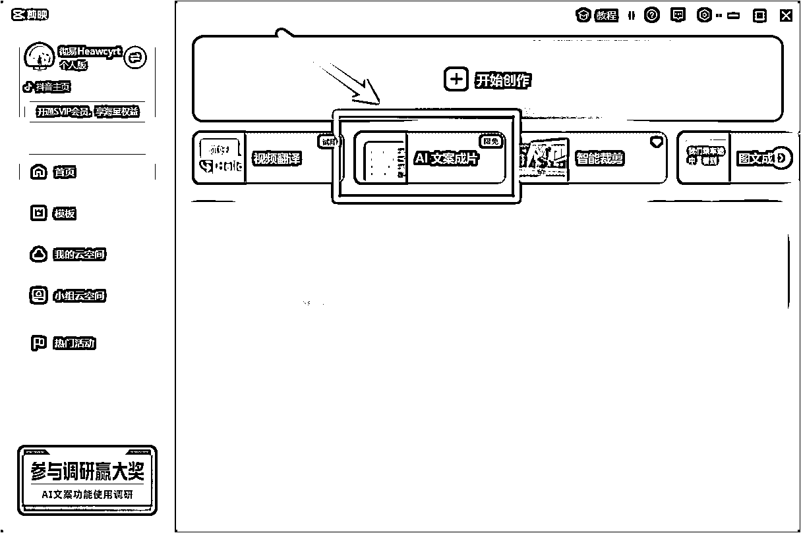
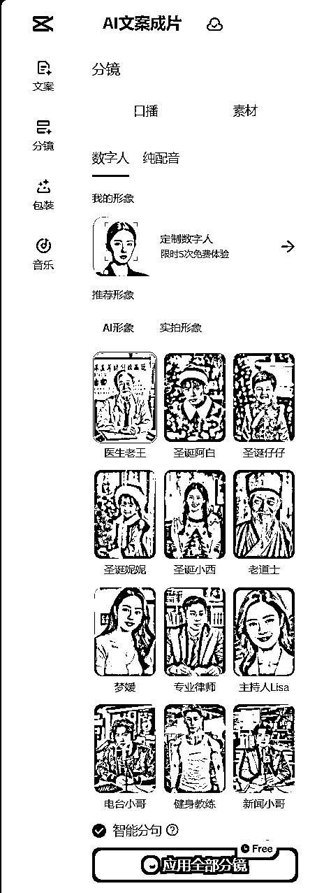

# 剪映AI数字人新功能，批量产出口播引流视频「实操指南」

> 来源：[https://ox9k4rncex0.feishu.cn/docx/Jy0TdzoBXoleMZxJGeqc11KKn0f](https://ox9k4rncex0.feishu.cn/docx/Jy0TdzoBXoleMZxJGeqc11KKn0f)

# 0\. 前言

大家好，我是彻易Heawcyrt。

04年大学生，全网万粉博主，大二实现经济独立，擅长使用效率工具 + AI优化工作流，欢迎同频的前辈或小伙伴交流研讨。

我们直接开门见山，大家可以先看看下面两个视频的效果。

视频 1 是数字人口播。

视频 2 是 AI 配音 + 自动素材匹配。

两个视频的制作时间都不超过3分钟，我自己做了好几个视频平均下来算上等待时间一个视频也能保证在10分钟以下。

虽然整体上 AI 感还是蛮重的，但好就好在是免费的，不用花钱，甚至还有5次定制数字人的免费权益。

# 1\. 主要用途

目前来看，其实就是怼量，降本增效或者赚流量钱。

将单条视频制作周期从「文案-素材-剪辑」压缩至5-20分钟：

1.  文案方面，只需要你找到同行业的爆款文案或者爆款选题，再用内置的AI写文案或者用DeepSeek、Claude、GPT帮你写，最后人工审一下就能解决；

1.  素材方面，可以给他我们的素材库，让他自行匹配，也可以让他利用他自有的素材库进行匹配，或者不用素材了，直接一个数字人就够；

1.  剪辑方面，有智能包装，加一些音效、划重点什么的。

这样出来的视频，其实就是工业流水线加工后产出的杂牌小零食，算不上高质量，但总会有人买单，不信你去看拼多多。

我去问 DeepSeek-R1，这样的视频能做什么，他给了我一条预判：

当数字人制作成本低于真人拍摄的1/5时，短视频行业将出现「千号矩阵」战术——用海量账号覆盖长尾关键词，通过概率博弈获取流量。建议在合规前提下，优先布局本地服务、知识付费、跨境带货等强转化赛道，利用数字人实现7×24小时精准流量捕捞；同时可以全球化布局，借助多语种数字人突破地域限制，单条视频可同步生成英语、泰语、西语版本

（关键行动点：立即测试不同数字人形象的点击率差异，建立专属话术数据库）

# 2\. 使用 SOP

## 2.1 进入页面

打开剪映，更新至最新版本。登录进去，首页点击“AI文案成片”，会跳转到剪映的网页端。

## 2.2 开始创作

点击“开始创作”，输入或者粘贴文案，同时也可以用内置的 AI 写文案。

## 2.3 内置 AI 写文案

用内置 AI 写文案的话，可以输入主题、内容要点、仿写文案、预估字数、更多要求。

*   输入主题：就是文案最核心的标题；

*   内容要点：可以是你构思的提纲；

*   仿写文案：可以在👉 https://www.xiazaitool.com/ 网站上，把抖音/红薯上的视频下载下来，然后他会自动帮你提取该视频的文案（耶？好像发现了一个可以很方便提取视频文案的办法）；

*   预估字数：你希望你的视频大概时长多久，他就生成差不多时长的文案；

*   更多要求：希望得到的文案的风格、语气、方言等等，没有要求可以不填写。

*   补充：这个“智能检索”功能，目前实测很一般。

## 2.4 数字人、AI配音、素材

数字人分为 AI 形象和实拍形象，也可以使用纯 AI 配音不用数字人（开头的视频 2），素材的话可以批量生成 AI 素材、批量匹配用户在剪映里上传的素材以及从公共素材库里批量匹配素材。

*   视频 2 用的就是批量匹配公共素材，如果自动匹配的素材不喜欢，还可以替换。

## 2.5 智能包装，自动划重点、音效、字幕

点击包装，这里面的东西都是能给视频增加观感的，比如能自动帮你划重点（如图3），音效大家可以自行去文档开头视频 2 里感受。

## 2.6 音乐 BGM

推荐使用网易云的听歌识曲功能，把你在其他爆款视频里听到的想要使用的BGM直接获取出来，然后去“音乐”里面找，一般来说都能找到，毕竟和抖音上公用一个音乐库的；也可以搜索关键词，比如“中医”，就能得到许多用于中医相关视频的BGM。

## 2.7 导出视频（右上角）

# 3\. 视频 1 和 视频 2 制作拆解

# 4\. 最后

当然啦，导出的视频肯定有不完美的地方，如果要求还要高些，导出后可以去抖音接着编辑。

我也相信，随着 AI 技术的愈发成熟，未来AI数字人/AI配音口播类视频，会更加匹配我们所期待的质量。

感谢你看到这里，祝大家 2025，一起生财有术。