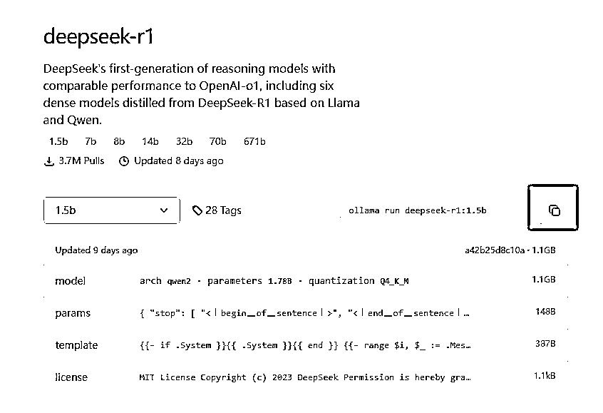
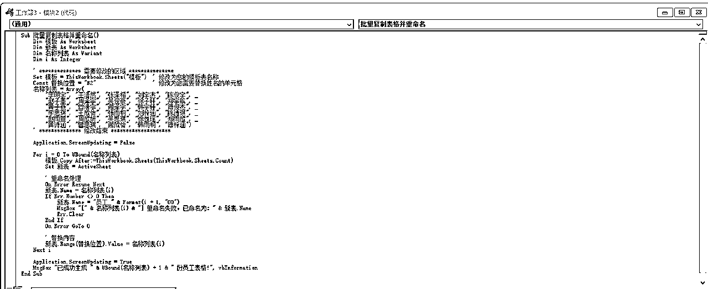

# 我发DeepSeek相关教程，视频号2天万粉！

> 来源：[https://yf4niapxuw.feishu.cn/docx/KLVJdgFklo2nFFxygY7cMcQ2nyb](https://yf4niapxuw.feishu.cn/docx/KLVJdgFklo2nFFxygY7cMcQ2nyb)

你好呀，我是云珞。

这个春节，我没有回家，主业上，加班了3次，副业上，每天坚持做DeepSeek相关教程视频。

不露脸的AI教程视频在视频号很难火，我从去年11月8日开始发AI相关的视频，抖音和小红书都火了，都成为了万粉博主，就视频号没有火。

但这个春节，截止到今天（2月5日），我发了8个DeepSeek相关教程视频，在第5个火了，视频号2天万粉。

今天，我的视频号2万粉。

分享一下DeepSeek的玩法。

# 一、DeepSeek是什么

简单来说，DeepSeek是由中国顶尖AI团队深度求索（DeepSeek Inc.）开发的通用大语言模型体系，其研发始于2023年，致力于突破认知智能边界。DeepSeek在自然语言处理、数学推理、代码生成等核心能力上达到国际领先水平，已推出DeepSeek-R1、DeepSeek-V2、DeepSeek-V3等多个版本。其模型采用混合专家（MoE）架构，训练效率高，推理速度快，能耗低。

我观察过，在春节期间，DeepSeek相关话题一直在抖音热榜上。虽然有时候呆了很久，有时候很快就下去了，但天天都在热榜出现过。

它曾经让英伟达一夜蒸发4000亿市值，它的创始人梁文峰曾经与总理座谈，它被神秘网络攻击，它被美国开展国家安全调查时，它被多个国家禁用。

这在国产AI中独一份。

诸君，请看它爆火的时间线。

# 二、DeepSeek怎么用

# （一）DeepSeek官方网址

## 1、网页版网址（建议试玩用这个，官网的，最聪明）

https://www.deepseek.com/

点击开始对话，即可使用。

一般点击深度搜索(R1)，内容质量会更高，偶尔也可以关闭R1，发送聊天，看看两者的区别。

## 2、APP

手机APP你直接在应用商城下载，图标样式是一个鲸鱼，下面写着DeepSeek：

## 3、API密钥地址

https://platform.deepseek.com/usage

现在它会免费送10元额度，也可以自己充值。点击创建API key，就可以创建自己的密钥了。

# （二）其他平台的DeepSeek（个人感受：有时候和官网一样聪明，有时候比官网差一点点）

## 1、硅基流动

https://cloud.siliconflow.cn/i/vgtfhXXB

可以直接网页对话体验DeepSeek，可以画图体验DeepSeek的Janus-Pro-7B模型，可以设置API密钥，通过CherryStudio本地部署。

## 2、秘塔AI

你打开它的长思考，相当于打开联网的DeepSeek，不过，我始终觉得官网的最好。

## 3、纳米AI搜索中的DeepSeek

## 4.本地部署ollama+chatbox

如何本地部署DeepSeek R1，只需要两步，小白也能看懂。

视频版：

文字版：

### （1）下载并安装ollama

第一步，打开ollama（网站是 https://ollama.com/），它简化了大型语言模型的部署流程，你可以用它快速在本地运行和测试模型。

你选择自己需要的系统下载到电脑里，一定要登录邮箱，不然下载不了，或者会下载失败。

如果你登录不了ollama网站，可以从网盘里直接下载我从官网下载的OllamaSetup.exe（链接：https://pan.quark.cn/s/2ca5537d5ffe），和官网没有区别，是我从官网下载后，上传到网盘的。

下载后，直接双击安装。

等进度条完成后，你按下 Win + R 键，打开“运行”对话框。

在“运行”对话框中输入 cmd，然后按下 Enter 键，或者点击确定，即可打开命令提示符。

接着，你输入olama命令，点击Ent键，看看你有没有安装成功，如果你出现了类似我画面上的符号，就表示安装成功了。

olama命令是什么意思？就是你直接在这个黑色框框里，输入olama这个单词，然后点击Ent键，它就开始运行了。

你再次打开ollama网页，点击左上角的models，

刚刚你下载ollama电脑版时，你呆的页面是Discord，现在你到models页面了。

页面跳转后，选择deepseek-r1，

根据自己的电脑配置，选择合适的大小，我选的是1.5b，最小的一个，太大的，我怕带不动。

但太小了，DeepSeek，可能不会那么聪明。

我实测了。

实测后，我总觉得本地版的不如网页版的聪明，网页版用不了的时候，你再用本地版的吧。

你如果想查看自己的显存大小，直接同时按下 Ctrl + Shift + Esc 键，打开任务管理器，点击性能选项卡，在性能选项卡中，看你的GPU或显卡大小。

然后你复制你选中的命令框，

直接点击这个复制键，

把你复制的内容粘贴到里面，

按下Ent键，等待模型下载完毕。

如果你成功下载好了模型，你的页面会出现Send a message或者for help，你直接输入中文问：你是谁，它会回答：您好!我是由中国的深度求索(DeepSeek)公司开发的智能助手DeepSeek-R1。如您有任何任何问题，我会尽我所能为您提供帮助。

这时，你就可以使用DeepSeek-R1，与它对话聊天了。

但是，这样一来，你只能通过命令框与它聊天，很不方便。

我们还可以下载一个可视化工具，方便我们更好的聊天。

因为你用命令框聊天，复制它写的文字，极其不方便，一旦你关闭了命令框，想要找之前的聊天内容，就很难了，根本找不到。

### （2）下载并安装chatbox

第二步，打开chatboxAl（网址：https://chatboxai.app/zh），下载并安装，首次打开时，会跳出来一个选项，你点击第二个选项：使用自己的 API Key 或本地模型。

如果你看到的是中文，那更好。

如果后期，你的页面不是中文，你点击设置，点击显示，看看语言是不是简体中文，如果不是，就选择简体中文。

你进入新页面后，你再选择ollamaAPl，进入配置，选择你在ollama下载的deepseek-r1。

保存好后，你点击新对话，就可以与DeepSeek-R1聊天了。

如果你的上下文的消息数量上限那一栏，想和我一样，拉到最右边，设置为不限制，即可。

严谨与想象功能也一样，它的数值越大，想象力越高。

如果你要它不要跳出你的设定回答，你的数值就小一下。

### （3）使用DeepSeek-R1

如何使用呢？

你打开新对话，直接输入：有 100个人，求证：其中必定有两个人，他们在这群人中的公共朋友的个数为偶数。

他很快就解答了出来，还有解题思路。

如果你是学生，对于错题集，老师已经讲过答案和解题思路了，你还是不懂，那完全可以把它当做老师，弯道超车。

如果你是打工人，你可以直接把你的身份、目标、担忧告诉它，让他帮你想办法，比如你说：我是个会计，老板让我分析新能源车财报，但我连电池型号都分不清！怎么办呢？

他回答你后，你可以根据自己的问题一步步和它聊天，理清楚你的思路。

如果你遇到它显示错误呢？

一般情况是，你没有打开命令框。

每次你关闭后重新打开，是需要先打开命令框的，它打开了，就代表你打开了ollama。

如果你的ollama关着，那就用不了。

## 5.DeepSeek 懒人整合包本地部署

视频版：

文字版：

第一步：迅雷下载懒人整合包

你拿出你的手机，打开链接（迅雷）：https://pan.xunlei.com/s/VOIF-4SwAs1hclPPUea5Vx3JA1?pwd=n7a3#

或者夸克（备用链接）：：https://pan.quark.cn/s/ac59616c3c18

两个链接内容一样，但为了防止失效，放了2个。

找到资源后，直接在手机上保存，以获得超速下载。

接着在电脑上下载就好啦，是不是超简单！

第二步：解压与设置

1.  解压下载好的懒人包，

把 lmstudio 文件夹复制，放在 C:\Users\ 你的用户名 \ 里。

1.  找到 LM Studio 并打开。

1.  点击界面上放大镜的图标，

进入新页面后点击 App Settings

在语言那一栏往下滑，选择简体中文，中文界面用起来更顺手哦～

接着点击 Runtimes，把 CUDA 改成 CPU，设置好后关闭窗口，此时 LM Studio 已经是中文页面啦。

第三步：模型选择与参数设置

1.  根据自己显卡的大小来选择模型，比如我选的是 8B 的模型。

如果你不知道自己的GPU或显卡大小，直接同时按下 Ctrl + Shift + Esc 键，打开任务管理器，点击性能选项卡，在性能选项卡中，看你的GPU或显卡大小。

如果你有至少 4GB 的 GPU，那选 8B Q8 的模型！

如果你在LM Studio 没有看到这些模型，那你打开解开的压缩包里的可选配模型，

把它们拷贝到.lmstudio/models/nathmath-bilibili 就行啦，小白也能轻松上手。

1.  你打开LM Studio，选择一个模型，把 GPU 卸载设置为 30 ，CPU Thread Pool Size 拉满。

## 6、SCNet

https://chat.scnet.cn/#/home

# 三、DeepSeek提示词

总结下来，就是DeepSeek没有提问技巧，你多问，多看它的思维链就行了。

说实话，之前我是不喜欢看DeepSeek的思维链的，我觉得我看DeepSeek给我的结果就行了。

但这段时间，我发现，提问技巧都隐藏在它的思维链里，有时候你不知道怎么提问，看看它的思维链就知道了。

比如，它写的这首打工人的诗词，思维链里考虑到了【七绝的结构，四句，每句七个字，押平声韵】、【再检查一下每句的平仄是否符合七绝的格律】，这些都是提问技巧，你看了它的思维链后，完全可以想想，自己想要什么样的内容，然后根据思维链提问。

比如，我再次提问，写的是：我要写一首普通打工人加班很多的七绝诗词，七绝的结构是四句，每句七个字，押平声韵，每句的平仄要符合七绝的格律，第一句得点出主题，强调加班很多，第二句接着深化，强调不敢辞职，第三句要转折或进一步推进，可能用比喻，想躺平但不敢躺平，最后一句要收尾，表达迷茫。

这个提问，完全是根据它之前的思维链和我的需求写的。

请看它写的内容：

《七绝·案牍夜》

案牍如山月影重，敢辞霜雪负春风。

身如倦鸟思栖木，雾锁长桥路几通。

是不是比之前更好了。

更重要的是，更符合我的需求了。

它的核心技巧我讲完了，再讲6个通用的提问技巧。

## （一）忘掉套路，真诚发问

如果你以前学过AI提示词，或者收藏了很多AI提问指令，那你完了，你用这套指令问DeepSeek，只会认为它平平无奇，但若它普普通通，又怎么可能成为白宫严选。

错误示范是你问它：你现在是一个短视频文案高手，请帮我写一个关于某某产品的推广文案，要求吸引眼球，引发共鸣。

你看，它写的内容虽然不错，但比较普通。

可是，若你问：我这款某某产品超好用，但就是不知道怎么夸它，你能帮我写个文案，让用户一看就想买吗？我明明只选了R1，没有选联网，但它的思考链知道这是H1是宇树科技的产品，文案内容更符合我的需求。

只要你像和人聊天一样，说说你的身份、目标、担忧，它就会给你一个有启发的内容。

## （二）善用公式，事半功倍

DeepSeek没有提示词模板，但有万能公式，就是创作类型、体裁、情感基调、文化元素这几种元素，你说清楚就行了。

比如，你输入诗词_七绝_绝望_打工人，它就会为你做一首诗，它在思维链里还说可能还需要多修改几次，让诗句更流畅，意境更深刻。

再比如，你输入短篇小说_言情_甜蜜_校园，它就会为你生成一篇短篇小说，我超喜欢这句“原来喜欢一个人的时候，连呼吸都会变成蝴蝶，轻轻落在对方颤动的睫毛上。”

当然，它也有缺点，你用它写小说，第一眼很惊艳，超过2000字必崩，它特别喜欢加一些科技梗、诡异梗。

## （三）说人话，别整那些虚的

比如，你问它，什么是AI？说人话！

它说AI能学东西、会做决策、模仿人类技能，

所以，当你觉得它DS味太重，你可以直接说：说人话、用大白话说、用广场舞大妈都能听懂的话解释、举三个现实例子、禁用专业术语、每段不超过手机屏幕。

## （四）反向PUA，让AI帮你挑刺

比如你问它：你觉得这个文案哪里不够吸引人？如果你是用户，你会怎么吐槽？

你看了它的回复后，就会豁然开朗，然后有针对性提问。

我就比较喜欢它提出的反思：过度强调“性能参数”而非“真实痛点”，年轻人需要的是“替我偷懒”而不是“看我多牛”。

一个卖给年轻人的产品，那就要考虑真实痛点，而不是性能参数。

## （五）模仿大师，满足你的心愿

DeepSeek很擅长模仿各种风格，比如你假设一个情节，让它写作，它写出来的内容，让你满满感动。

我就比较喜欢这句：待暮雪白头姑苏岸，当携天子笑，候君醉看，万家灯火。

## （六）用某某风格讲某某知识点

之前我们经常刷到某种知识视频，让知识用一种奇怪的方式进入大脑。

现在我们可以让DeepSeek生成这个风格，方便我们学习。

看完这句话，你是不是马上记住Tree这个单词了。

# 四、DeepSeek如何使用（举例场景）

## 1、用DeepSeek快速记英语单词

你完全可以用DeepSeek将常用单词编成有趣的故事来记忆，用故事征服遗忘曲线。

那怎么做呢？

第一步，拍下你的单词本照片。

第二步，打开DeepSeek网页版或者APP，点击这个回形针，上传图片，

第一个图是电脑版的，第二个图是手机版的，

输入提示词：请把图片单词列出来。

点击发送按钮，同时发送图片和提示词。

第三步，让它将上面的单词写一篇科幻冒险小说，

提示词是：请用上面的单词写一篇科幻冒险小说，适合小学一年级学生阅读，并且把对应的单词标粗体，字数在500字用英文输出

这样一来，记单词是不是变容易了许多，用故事记忆单词是一个好方法。

第四步，让AI出题，

比如你说：根据这篇文章出10道英文选择题，每一道选择题的答案放在最后。

这样学习英语是不是变得有趣了。

现在轮到你了，按照这个方法，打开DeepSeek，上传图片和提示词。

从此，这些单词在你脑中不是孤岛，而是一座故事大陆。

## 2、用DeepSeek批量制作表格

你还在为一个个创建表格、填写信息而烦恼吗？今天向你分享一个超绝的技能 —— 用 DeepSeek 批量创建表格，轻松告别繁琐工作！

第一步：开启 DeepSeek，输入指令

打开 DeepSeek 这个神奇的工具，然后大胆地输入你的提示词，比如 “我要做一张 30 个人的表格，帮忙写个代码” 。

等它把代码生成后，再把 30 个人的名字输进去，它就会给出全新的代码，是不是超智能！

第二步：打开工作表

使用说明里提到，要把自己的模板工作表改名为 “模板” 。

打开表格，把工作表重命名为 “模板”，

接着点击 “工具”，选择 “开发工具”，

再点击 “VB 编辑器” 。

在第一个 “模板” 处，点击右键

选择 “插入” - “模块”，

把刚刚在 DeepSeek 复制的代码粘贴进去，

然后关闭这两个窗口。最后点击 “运行宏”，30 张表格就一次性搞定啦！🎉

用DeepSeek批量创建表格这个思路很绝，批量性的内容，都可以用这个方法。

你学会这个方法，工作效率直接拉满！

如果你想自己尝试一下的话，我已经把代码和表格放进去了，https://pan.quark.cn/s/6227f439b567

赶紧试试吧！

## 3、用DeepSeek作图

你能想到的流程图、序列图、饼图、思维导图、四象限图、桑基图等等，它都能轻松拿捏！

只要输入简单的文字描述，一分钟不到，一张精美又专业的图就诞生啦。

而且效果真的很惊艳，细节满满，拿去工作汇报或者做设计素材都超合适。

在这个 AIGC 大火的时代，DeepSeek 绝对是我们提升效率的神器！不管你是职场打工人，还是学生党，又或是设计爱好者，都能利用它轻松搞定各种绘图需求。

具体怎么用呢？

第一步，打开DeepSeek，输入提示词，我要画一个某某流程图，用mermaid格式。

重点在这个mermaid格式，不论你想做什么图表，在最后面都是加上这句mermaid格式。

你想做什么样的图表，就写什么样的图表名称，比如柱状图、折线图、漏斗图，等等。

第二步，打开draw或其他画图工具，复制你刚刚在DeepSeek生成的mermaid格式，

点击这个+号，点击高级，你选择mermaid，粘贴内容，一个流程图就做好了。

其实，你可以直接用DeepSeek画可视化图表。输入提示词，点击运行 HTML，就可以看到图片了。

为什么要再用上draw呢？

因为draw可以修改文字，如果你对DeepSeek生成的内容，有个别不满意，直接修改就行了。

draw的网址：https://app.diagrams.net/#

直接用DeepSeek画可视化图表的提示词：https://pan.quark.cn/s/02777a71045c

效果如下，只能通过截图获得图片，请按照自己的需求决定是否需要这个提示词。

## 4.用 DeepSeek 和 Kimi自动做 PPT

内容生成：打开 DeepSeek，输入提示词，提示词如下：

我是一位工作8年的新媒体工作者，工作中经常需要了解某个陌生的行业，帮我写一份关于机器人的行业发展趋势报告的 ppt , ppt 内容包括行业最新的研究报告、产业上下游关系、 ppt 内容大纲，最后以 markdown 的形式输出。

你稍微修改，就可以用了。

输入提示词后，你让它帮你写一份 PPT 内容，然后复制生成的文本。

DeepSeek 推理能力超强，生成的内容质量极高，为优质 PPT 打下基础。

之后，你打开 kimi，点击第四个 kimi+，找到 PPT 助手，

把从 DeepSeek 复制的内容粘贴进去，

结尾加上一句提示词：根据以上要求整理一份PPT

接着静静等待，一份精美的 PPT 就新鲜出炉啦！

