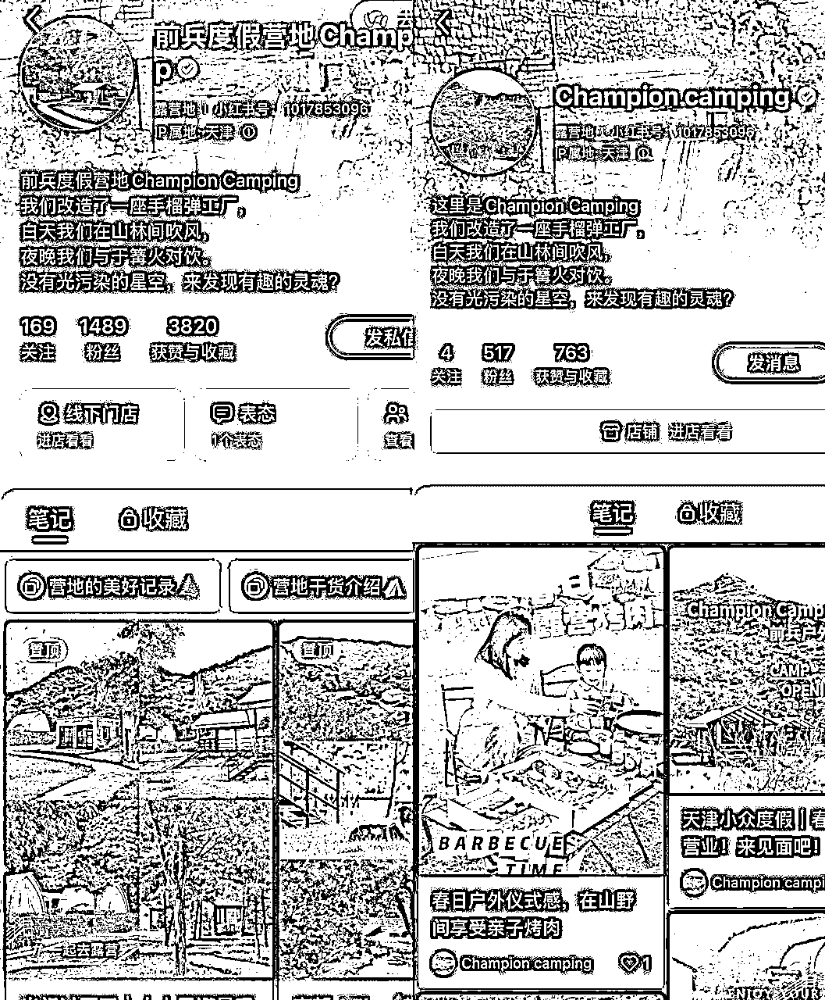
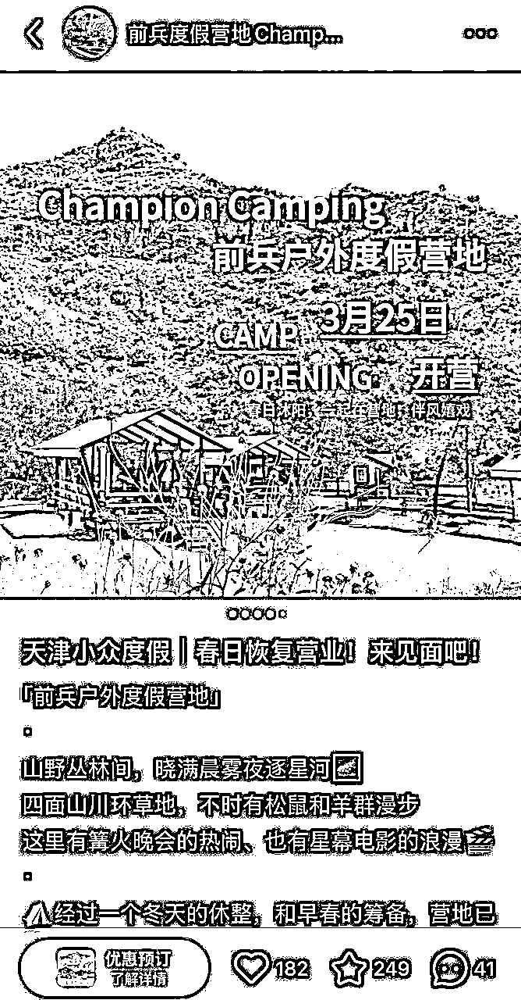

# 「深度复盘」线下度假村小红书引流获客，营收提升50%

> 来源：[https://kv6btk7fh2.feishu.cn/docx/KLVrd2QBXoqdKBxsQuDc8Fy3njf](https://kv6btk7fh2.feishu.cn/docx/KLVrd2QBXoqdKBxsQuDc8Fy3njf)

内卷充斥在各行各业，文旅赛道的餐饮、民宿、景区同样是内卷重灾区。卷价格、卷服务、居高不下的成本与狂泻向下的市场让很多人感到迷茫。

这催生了很多老板对于“流量的依赖”，这几年催生的各种探店、培训、短视频和直播代运营层出不穷，每一波都看似能帮老板解决一部分流量问题，但每一次探店、培训、直播特价的鸡血过后，大概率重回到原点，这时老板们才反应过来，原来看起来有限的业绩增长，是花费了更高的成本。

“流量兴奋剂时代”真的缺流量吗，想要获取流量就得一直花钱吗？

内卷的时代，生意就只能做高价往低价卷、卷到大家都哀鸿遍野吗？

老板们每天又要忙业务、又要忙接待、又要做线上，没有足够的精力和能力，真的就不能做流量了吗？

近5年我们做了近30个文旅相关的实体项目的经历，结合实操中遇到的流量与业务的难题，分享一下我们如何从线上与线下双向系统整合的视角去做实体店的业务运营与流量运营。

先说结论：

1、实体商业终归是是先业务后流量，业务是根，流量是叶。

2、选择大于努力，选择匹配的流量分发平台创作内容，可以以小搏大。

3、流量转化率远比流量本身重要。

下面是我们营地项目的实操过程：

首先，我们先对营地2023年的业务现状进行系统的复盘和梳理

梳理之后，我们很明显的发现了运营问题和改善措施之所在。

几个影响经营结果的问题：

1、收入结构：收入单一，几乎全靠客房收入，房价虚高（即便当年能有一定的入住率），长期看不具备稳定性。

2、传播方式：以抖音和大众点评为主，虽抖音的曝光流量比较大，花了很大气力运营，但因为客单价较高以及人群不精准，导致客资很多但流量转化少，叫好不叫座。其他线上流量平台几乎没有曝光。线下合作资源，比较被动等待的方式，有合作找过来就谈，并没有主动拓展。

3、产品能力：（1）主要卖点只是自然环境和住宿，因为人员结构、服务方式和成本考虑，并没有配置独立的出餐能力，而是选择了定制化外包的方式，导致客人现场选择用餐不灵活。（2）产品体验只在“功能层面”，并没有给顾客创造便利性、惊喜感，因为没有主理人感觉， 几乎没有情感沉淀。

4、没有战略地增加设施：没想清楚精准人群是谁，没有统一长期的运营目标考量，为了搞活动、搞内容不断增加活动设施和物料，而整体的使用率很低，造成大量闲置侵蚀利润。

针对上述发现的问题，制定优化的行动方案。

流量平台精准定位：

通过对于各个平台流量逻辑的梳理，针对度假营地项目，既要更多的覆盖大流量池，也要筛选流量池质量，提高潜在消费转化率，几个流量平台的定位为：

*   抖音：公域流量曝光平台，上 住宿之外的低客单价的餐饮团购，引流到店加微信进私域；

*   快手：/

*   大众点评：设定营地和咖啡店两个大众点评，优化评价图文质量，沉淀好评，引流到店；

*   小红书：用户画像与营地高度匹配，同时搜索流量精准客户价值高，适合转化高客单价产品，重点建设；

*   视频号：随着私域客户沉淀越来越大，视频号日常更新会有裂变效果，私域流量的二次精细化运营，重点建设；

产品力提升：

*   完善基本的吃住玩服务能力，供应能力完整、衔接丝滑；

*   更关注与顾客之间的互动，通过拍照、现场随机聊天、记住顾客的喜好以及满足其特殊要求的细节，提升惊喜感和好感度，形成超预期体验；

*   有的放矢去优化服务，做对的事，把事做对，在必要的事儿上做的极致（比如每一位离开客人都要到门口目送），不追求事物巨细，节省心力；

收入优化：

*   收入结构平衡，放大非住宿收入的种类、覆盖面，形成了1：1的良性比例；

*   人群画像和运营定位清晰之后，在投入设施和更新项目时，主次分明，大量避免了不必要的浪费（比想象中可观）

基于上述 问题的分析、改善逻辑以及发展规划，我们把运营重点放在了精细化的流量运营以及产品力的打磨，而两者又是相辅相成、无法割裂来做。

接下来的篇幅，着重复盘一下，在重点运营小红书赋能线下生意的过程以及其背后的逻辑。

2024年3月初，小红书蓝v账号510个粉丝，到2024年10月底，粉丝增涨约1000个粉丝，加到微信的客户约1000人，总体转化销售额约50w。

主页对比图片

在3月20日，发的第一篇笔记，即获得了比较不错的长尾流量。

流量：

这里着重提两个关键运营动作，为接下来整个自然流的批量获取打下重要基础。

1、关键词定位

这个项目从自然环境上天然有“户外”“露营”的属性，但其本质是一个度假酒店类项目。我们在做小红书蓝v认证的时候将类别设定成了露营地。这样做源于一个思考：这个项目如果放在大的泛酒店行业流量池里，会犹如星空中的一颗不显眼的星星，要与数不尽的项目争抢流量，而在露营地领域，我们可以接近本地天花板级别。

2、流量错峰

此外，把握流量的时机也至关重要。北方民宿旅游市场正式的热度从5月开始，而“露营”这个关键词的热度从早春就已经开始。而小红书平台也会根据不同时期的热点给予相应的流量倾斜。也就是说，我们在3月底就开始拿平台的流量并且非常不拥挤，自然流量自然就很好。

在流量转化上，即便后来在小红书上同步了订房商城，但我选择了所有的客资全部先到私域再转化成交。这样做的原因有两个：1、场地涵盖的功能内容较多，无法线上展示全面；2、客单价较高（800-1000元），需要辅助答疑。3、省掉扣点，微信万分之六、小红书5%，50w一个经营季省下来2.5w。具体的操作方式：客户在后台私信咨询或在图文笔记下留言评论，会统一在私信后台简单沟通，解答问题后成交意愿很强后，直接转到微信里成交。

这里需要着重说明，我自己是直接发微信号/微信号图片给顾客，至今没有被风控过，中间出现过两次发的微信号对方看不见，但没有收到过官方的预警信息。可能是运气，也可能是平台也需要内容充分吸引流量。其实有很多安全引流到私域的做法，网上很多内容，这里就不展开了。

内容：

小红书内容创作的基本逻辑：优质的图文+做过SEO关键词布局，大概率能拿到好的长尾流量。

（1）梳理关键词

在文案创作前，我们找到行业内近期做的比较好的5-8个账号对标，梳理出关键词。这个项目的关键词，像“京津冀周边小众出游”、“京郊小瑞士”、“京郊毛孩子天堂”、“小盆友来这儿也太自由了”都是非常切中项目的卖点和消费者的买点。整理关键词的过程中，既要考虑能蹭到足够精准的搜索流量，也要考虑自己项目本身的特点能与关键词完美融合，如果这个关键词下你自己的项目能有完美独特的呈现， 用户大概率就会选择。

（2）发文频次

前期需要保持高频的输出，来测试有效的关键词，当测试初步成功后要进一步保持输出频次。测试关键词阶段，每天1-2篇，当出现一篇爆文后，继续跟进输出至少每天1篇。对于一个粉丝量不高的蓝v账号来说，我们的爆文比例不会高于10%，但爆文会带来90%的流量。当流量出现后，做好丝滑的私域转化，不要因为回复不到位或疏忽让流量白白浪费。

（3）内容创作

足够丰富的、符合关键词的内容是整个小红书内容的核心。

对于一个线下生意来说，创作的原点一定是线下有足够多的素材：好看的图片视频、足够多元化的事件、足够细腻的记录、足够丰富的互动。巧妇难为无米之炊再好的文案也不能无中生有。对于一个需要线下交付的项目来说，经营的尽头还是要回到产品、内容的深耕上，小红书和其他互联网流量工具可以成为滤镜，但自己的底子一定也不能很差。

很多线下项目做不好小红书的原因就是两个痛点：

*   内容策划没有人持续输出

*   没有好的审美的、且可以实时记录的人一直在现场

内容是一种感觉、一种视角、因人的审美和思维而差异巨大。创作内容和记录内容还不能拆开，现实很可能是要求主理人自己具备这些综合能力，要不就是有一个能胜任的创业合作伙伴。往往民宿的人员体系很难有这样的配置。既懂内容又能呈现内容的团队是个很好的创业机会。

（4）要不要投流

以前我一直是自然流的信奉者，觉得纯靠自然流能拿到爆文是能力的体现。但现在我是一个坚定的投流支持者，前提是要完成爆文关键词测试。如果你的自然流商业链路能跑通，投流只是在加速这个过程。

根据自己的成本结构，测算ROI，通常1:4以上的投产比就可以随意投，我们的保本线是1:3，投流能把权重和热度拉起来也至关重要重要。

付费转化率：

我们做了很多流量、内容和事件上的动作，真正目的就是为了提高付费转化率。

无论是线上还是线下的生意，付费转化率都是最重要的目标（没有之一）之一。通过层层流量池的转化，最后谁拥有尽可能多的高价值流量，谁才能在内卷的时代不被动。跟很多老板交流，基本上大家都是盲目的去做基础流量池，但在往高价值流量池转化上出现了各种各样的问题，最后觉得还是自己的流量不足，在这个循环了走不出来。

线下实体项目要构建自己的增长飞轮。

我们的营地项目为什么重点做小红书而不是抖音，一是因为流量精准质量高，二是一个线下实体经营者往往无法同时兼顾多个流量平台的运营质量，尤其是在流量池建设期，更希望自己的精力有更精准的产出。

每个实体老板都要了解自己业务真实内在驱动力的原点是什么，以及驱动此增长飞轮的核心要素是什么。以营地项目举例来说，营地的内在驱动力的原点是要不断有内容创作力且乐于传播的年轻人来体验，从而能带动项目本身有丰富的内容素材（人在这里玩本身就会成为好的素材），从而能够让精准的流量平台有更多好的内容呈现与流量推荐，从而推动业务增长。

最后总结一下我对于实体项目与流量之间关系的理解。

好的流量从来都是以好的产品和内容为基础。在“流量兴奋剂”流行的时代，大部分人有时会分不清谁是因谁是果。对于一个实体项目来说，流量本身并不直接解决任何问题，它只是将你的好你的坏，都在放大并形式反馈而已。

而且，随着流量红利时代的逐渐远离，关注自身产品能力的良性成长，并最终反馈在高转化率上，才是重点。