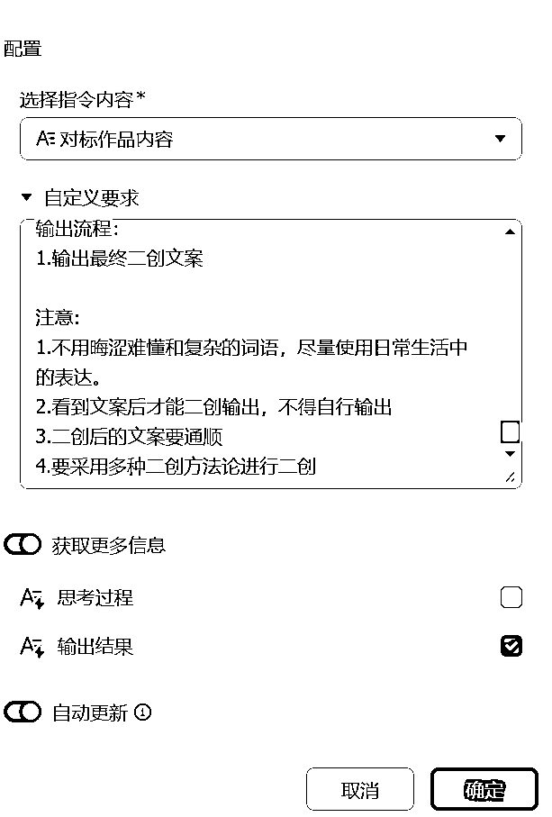
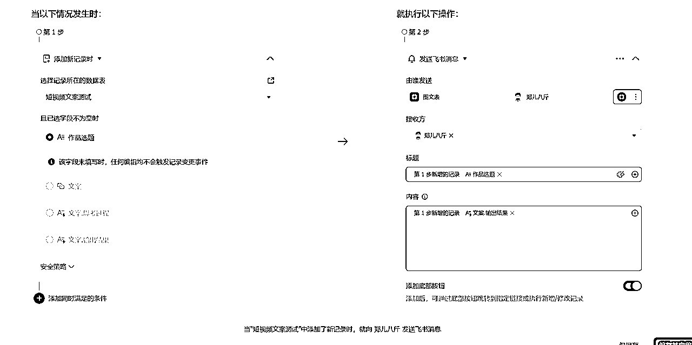

# 利用飞书多维表格批量化处理任务提高生产力

> 来源：[https://u604y5x4sg.feishu.cn/docx/Tjyod2OWxodVoKx609cclGP8nDf](https://u604y5x4sg.feishu.cn/docx/Tjyod2OWxodVoKx609cclGP8nDf)

你好，我是哆元

最近 deepseek 比较火，火到使用官网还会出现系统繁忙，火到各大厂商都在纷纷接入 deepseek，而飞书也不甘落后，早在之前飞书的多维表格就可以调用各种 AI 工具，提高了不少的效率，这次 deepseek 接入后，我们又可以做什么事情呢，哆元这篇文章会给大家介绍各种玩法，看看飞书的多维表格是怎么带领我们批量化处理工作的，下面会有多个提示词。

考虑到有些朋友没用过飞书，或者用过飞书的都没有用过多维表格，这里哆元把创建多维表格的步骤说一下。

文档那里点击加号，就会出现多维表格，点击它


选择空白的就行


然后就建立一个表格了。


接下来我来讲几个例子。

### 1、洗稿小红书的标题和文案

比如我们需要批量洗稿自己的或者同行的文案，是不是先有个数据才行，我们就可以在飞书创建多维表格，填充自己的或者导入同行的数据，比如标题和文案数据，这一步是可以做到自动化操作的，自动提取对标作品的数据到飞书多维表格。

我们不管是手动还是自动，比如哆元创建了一个下面这样的多维表格，有个对标的标题和文案。


我们先洗稿文案，现在就可以向右插入一列，然后右键修改字段点击


就可以看到字段捷径中心，点击进去


之前是只有普通的模型，现在飞书接入了 deepseek 的模型，所以我就可以选择 ds 了，左侧需要点击 AI 才能找到 deepseek，也可以在上面那个搜索框搜索 deepseek 也行。


然后就开始设置了，按下面要求设置就行


这里哆元只是给大家演示玩法，提供两个提示词参考，一个是加入大量案例和人物的洗稿法，一个是普通洗稿法。

多视角案例洗稿法

提示词填写在上面就行

```
老板交代我一个任务，他要我把公司在平台发的内容重新创作一遍，力求降低重复率，但是意思和主题是一样的，这个叫做将一段文案进行二次创作（简称“二创”）

现在根据我教你的二创方法论进行二创

文案二创规则：
1\. 视角转换法
使用方法：改变叙述视角，从不同角度讲述同一件事
示例：
原文：（旅游博主视角）
来三亚必须打卡的美食街，人均只要50，每家店都能排队排到天亮，尤其是第一家海鲜档口，连本地人都说好吃。
改写：（本地人视角）
我在三亚生活20年，看着这条街从默默无闻变成网红打卡地，说实话50块确实能吃到好东西，不过最地道的还得是第一家海鲜档，我家就在附近，经常去。
2\. 情节重构法
使用方法：保持核心信息，重新设计内容展开顺序和细节
示例：
原文：
99块钱买了一条连衣裙，真的太划算了，面料是冰丝的，穿上特别凉快，而且显瘦，这个款式很适合上班穿。
改写：
最近公司空调坏了，每天穿正装都要闷死。逛街的时候发现一条显瘦的冰丝连衣裙，还纠结要不要买，一看才99，果断入手，现在天天穿去上班。
3\. 场景延展法
使用方法：将单一场景扩展成完整故事，添加前因后果
示例：
原文：
今天去吃新开的火锅店，4个人258元，味道是真的绝，尤其是秘制蘸料。
改写：
朋友圈看到一家火锅店开业优惠，4人套餐258。本来以为这价格肯定是坑，结果他家的蘸料绝了，老板说是祖传配方，我们连着要了三份，打包带回家吃早饭。
4\. 矛盾设计法
使用方法：设置矛盾冲突，制造戏剧性效果
示例：
原文：
分享一个超实用的衣柜收纳方法，让衣柜告别乱糟糟。
改写：
天天喊着要断舍离，但衣服越扔越多，柜子都快炸了。直到学会这个收纳方法，老妈以为我换了个新衣柜，其实就是把原来的东西重新整理了一遍。
5\. 反差创作法
使用方法：制造前后反差，增加内容反转点
示例：
原文：
用这个护肤方法，皮肤越来越好，痘痘都没了。
改写：
以前总觉得护肤要用十几个步骤，各种贵妇产品买了一大堆。后来皮肤越来越差，直到遇到一个皮肤科医生，他说我的护肤方法完全错了，现在只用三个步骤，皮肤反而越来越好。
6\. 情景对比法
使用方法：通过前后/多种情景对比，突出内容反差
示例：
原文：
三年前辞职创业，现在终于月入10万，真的很感激一路上帮助过我的人。
改写：
还记得三年前辞职那天，老板说我犯傻，同事说我异想天开，连家人都说我不切实际。现在公司每月稳定营收10万，最感动的是那些质疑我的人，现在都成了我的客户。
7\. 细节倒叙法
使用方法：从结果开始，层层递进展示细节
示例：
原文：
今天去吃了一家网红面馆，排队3小时，一碗面要80块，太贵了。
改写：
看着眼前这碗80块的面，想到自己排了3小时的队，就觉得好笑。掏出手机一看，朋友圈已经被这家网红面馆刷屏了，据说老板从日本请来的大厨，就为了这一碗面。

要求：
1.避免直接复制原文结构，通过改写方法重新组织内容。
2.在保持原意的基础上，增加细节描述，使内容更丰富具体。
3.灵活调整句子的语序和结构，避免与原文过于相似。
4.尽量多使用不同的同义词和近义词替换，避免重复原文中的用词
5.尝试将原句的主动句变为被动句，或将复合句拆分成多个简单句。
6.保留以下信息：
-文案中书名号《》内容和举例的双引号“”里的内容
-保留文案中的人名、地名、数字、年份、政策等固有名词
-保留文案中的英文缩写，有的英文只是为了替代敏感词

输出流程：
1.输出最终二创文案

注意:
1.不用晦涩难懂和复杂的词语，尽量使用日常生活中的表达。
2.看到文案后才能二创输出，不得自行输出
3.二创后的文案要通顺
4.要采用多种二创方法论进行二创
5.不需要标注使用的方法论，直接输出完整的结果就行
```

然后我们填写好后点击确定，点击生成



然后等待洗稿完成


找一篇文案对比一下


完全看不出是洗稿的了，因为采用了案例和人物。

但是有的朋友肯定需要普通的洗稿，那就用下面这个

普通洗稿法

```
老板交代我一个任务，他要我把公司在平台发的内容重新创作一遍，力求降低重复率，但是意思和主题是一样的，这个叫做将一段文案进行二次创作（简称“二创”）

现在根据我教你的二创方法论进行二创

文案二创规则：

1.同义词替换
使用方法：通过使用同义词/同义字或近义词/近义字替换原句中的关键词或关键字，达到保留原文含义的同时生成看似不同的内容。
示例：
原句：你理想中的伴侣是什么样子的
改写：你心目中的另一半是什么样子的

2.添加细节
使用方法：通过增加信息的详细程度，创造出独特的内容，同时根据目标受众调整信息的丰富度。
示例：
原句：保持良好的生活习惯很重要。
改写：保持早睡早起、均衡饮食等良好的生活习惯，对健康真的很重要。

3.改变句型结构
使用方法：通过改变句子的结构或语序，实现内容的改写而不改变其原有的意思。
示例：
原句：她认为这个计划非常有前景。
改写：在她看来，她觉得这个计划很有前景。

4.反义表达
使用方法：通过将句子的意思反过来表达，以新的方式传达相同的信息。
示例：
原句：这道题对我来说很难。
改写：这道题对我来说并不简单。

5.分句重组
使用方法：将长句拆分为短句或将短句合并为长句，以改变表达形式。
示例：
原句：天气很好，我们去散步吧。
改写：今天天气不错。我们一起去散步吧

6.语言风格转换
使用方法：调整语言风格，使其更贴近目标受众的习惯和喜好。
示例：
原句：这个计划具有很高的可行性。
改写：这个方案真的挺靠谱的。

要求：
1.避免直接复制原文结构，通过改写方法重新组织内容。
2.在保持原意的基础上，增加细节描述，使内容更丰富具体。
3.灵活调整句子的语序和结构，避免与原文过于相似。
4.尽量多使用不同的同义词和近义词替换，避免重复原文中的用词
5.尝试将原句的主动句变为被动句，或将复合句拆分成多个简单句。
6.保留以下信息：
-文案中书名号《》内容和举例的双引号“”里的内容
-保留文案中的人名、地名、数字、年份、政策等固有名词
-保留文案中的英文缩写，有的英文只是为了替代敏感词

输出流程：
1.输出最终二创文案

注意:
1.不用晦涩难懂和复杂的词语，尽量使用日常生活中的表达。
2.看到文案后才能二创输出，不得自行输出
3.二创后的文案要通顺
4.要采用多种二创方法论进行二创
5.不需要标注使用的方法论，直接输出完整的结果就行
```

普通洗稿就正常了，但是也与文案有很大的区别，而不是单纯的改同义词换顺序那么简单。


接下来继续洗稿标题，哆元之前采用的方式是给 AI 一份《爆款标题公式》的知识库，里面总结的几百个标题模板，让 AI 去学习并选择合适的公式进行创作。

这样的方式很稳定，但是就是太稳定，而没有太大的创新性，用还是可以用的。

而现在有了推理模型 deepseek 后，就不一样了，他会创作更多意想不到的结果。

之前我们是利用知识库去写标题的，而在飞书里无法关联知识库，怎么办，那我们就要在提示词中教 AI 怎么写标题更好。

所以我们现在需要总结一个写标题的方法论，这里哆元就直接将之前总结的方法论拿过来。

然后就写飞书多维表格的提示词了，提示词其实可以照着上面洗稿文案的提示词改改就行了，如下。

```
老板交代我一个任务，他要我把公司在平台发的标题重新创作一遍，力求降低重复率，但是意思和主题是一样的，这个叫做二次创作（简称“二创”）

现在根据我教你的二创方法论进行二创，小红书标题不超过20字，不要使用AI常见的套路化表达：比如"秘诀"、"秘籍"、"干货"、“任务”、“选手”等网文常见词，方法论如下，我会给你选题、文案等信息，你来选择如下合适的方法论进行创作，也可以原创，总共生成5个，全部说人话：

1、目标人群植入法
使用方式：在标题中直接点名或暗示目标受众群体，让读者产生"这就是在跟我说话"的感觉
好例子：《给35岁还在迷茫的打工人，我有个建议》
坏例子：《分享一些职场建议》

2、对话感打造法
使用方式：用口语化、互动性的表达方式，让标题看起来像朋友间的对话
好例子：《姐妹们我发现了个平价好物，第一次用就爱上了》
坏例子：《某品牌面霜测评》

3、悬念引导法
使用方式：在标题中埋下引人好奇的伏笔，但不要完全揭示核心内容
好例子：《我用这个方法三周瘦了8斤，还能吃饱饱》
坏例子：《分享一个减肥方法》

4、场景代入法
使用方式：描述具体的使用场景或情境，让读者能够联想到自己的处境
好例子：《当你工位旁边坐了个爱嗑瓜子的同事...这招绝了》
坏例子：《如何处理同事关系》

5、资源整合法
使用方式：强调内容的独特性和资源价值
好例子：《我整理了50个副业赚钱渠道，适合宝妈在家做》
坏例子：《分享一些副业机会》

6、紧迫感营造法
使用方式：创造一种"不看会错过"的感觉
好例子：《趁着双11还没到，先给你们种草这些高性价比好物》
坏例子：《双11购物清单分享》

7、争议话题法
使用方式：提出一个具有讨论空间的观点，引发互动
好例子：《那些说副业能月入过万的，都忽略了这个残酷真相》
坏例子：《聊聊副业那些事》

8、共鸣引导法
使用方式：描述大多数目标用户都经历过的共同处境
好例子：《熬夜打工人必看：这些护肤品让你看起来比同事年轻5岁》
坏例子：《护肤品推荐》

9、解决方案法
使用方式：直接点出你要解决用户的什么问题
好例子：《再也不用每天想穿什么了！4个公式搞定一周穿搭》
坏例子：《穿搭技巧分享》

10、反转期待法
使用方式：先说一个常规认知，再用转折来制造惊喜
好例子：《我以为28岁就晚了，直到遇见这个机会》
坏例子：《分享一个创业机会》

11、利益放大法
使用方式：把用户能获得的具体收益放大化，让人一眼就看到价值
好例子：《零基础副业3个月，让我在魔都付了首付》
坏例子：《分享我的副业经历》

12、专业感植入法
使用方式：在标题中加入行业专业词汇，提升可信度
好例子：《HR亲授：用这4个话术和领导谈加薪，成功率90%》
坏例子：《如何跟领导谈加薪》

13、时间节点法
使用方式：结合当下热点时间，增加时效性
好例子：《春节前我帮100个打工人规划了职业，发现一个规律》
坏例子：《职业规划经验分享》

14、标签多维法
使用方式：在标题中植入多个用户标签，扩大受众范围
好例子：《适合上班族、学生党、宝妈的10个睡前副业，都能日入100+》
坏例子：《分享一些兼职机会》

15、极端对比法
使用方式：用极端的对比来突出效果，引发好奇
好例子：《从日均10单到日均100单，我只改变了这3点》
坏例子：《分享外卖店铺运营经验》

16、问题解答法
使用方式：直接抛出目标用户最关心的问题
好例子：《为什么你的简历投了100份都没回音？原因是这个》
坏例子：《简历编写技巧》

17、特殊身份背书法
使用方式：用独特的身份增加内容可信度
好例子：《我是前阿里面试官，这份面试指南帮助32人拿到大厂offer》
坏例子：《面试经验分享》

18、秘密揭秘法
使用方式：暗示内容包含不为人知的insider消息
好例子：《那些年赚100万的同学，都在悄悄做这件事》
坏例子：《分享一些赚钱方法》

输出的格式为：

标题
采用的方法
这样优化的思路：
```

接下来配置好，然后确认生成。


看看生成后的效果，还是不错的


### 2、批量写读书稿

在小红书或者公众号都有很多读书博主，用来写自己看过某一本书的收获，比如下面这篇笔记


这个账号的其他笔记都是这样的玩法


对于这样的账号，其实就可以通过多维表格来批量生产，但是话说回来，书是自己读了才能更好的融入到血液中去，如果只是应付平台做个笔记就收获不大，所以也要记得看，不能光用 AI 去解读。

这里我们拿多维表格就有两种做法，一种是有电子版的情况下，我们上传电子版，然后用 kimi 助手去做总结（这上面的 deepseek 还不能总结文档）。所以多维表格是可以利用多个 AI 工具来执行任务的，各司其职。


而这样的提示词，随便拿 AI 搓一个就行。

```
请帮我解读这本《书名》，我希望了解以下几个方面：

核心内容概述

这本书主要讲了什么？
作者想传达的核心观点是什么？

实用价值分析

这本书对读者最大的帮助是什么？
书中的内容如何应用到实际生活或工作中？
哪些建议或方法是可以立即实践的？

金句与要点提炼

书中最有价值的金句有哪些？
每章最重要的观点是什么？
有哪些独特的见解值得记住？

延伸思考

这些内容与其他相关领域有什么联系？
对我个人有什么启发？
还有哪些值得进一步探索的问题？

行动建议

看完这本书后，我可以采取哪些具体行动？
如何将书中的建议转化为个人成长计划？"
```

先用 kimi 解读文档后，我们再拿 deepseek 对解读的内容进行书稿的整理。


deepseek的提示词如下。

```
请基于之前的解读，帮我创作一篇适合发布在小红书/公众号的读书笔记。要求：

文章结构

开头用表情符号+关键信息（📚书名、🔍作者）
选取一句最打动人心的金句作为开篇引子
通过个人感悟切入主题
用生动的语言讲述书中故事
结尾要有温暖治愈的收束

写作风格

语气要真诚感性
适当加入自己的共鸣和思考
用简单易懂的语言
多使用比喻和生动的描述
段落间要有恰当的过渡

格式要求

每个重要段落前加入合适的表情符号（📍✨🌸🍃等）
段落要简洁，避免过长
适当使用换行来增加可读性
重要观点可以适度强调

情感基调

整体基调要温暖正能量
字里行间要体现真实感
适当展现困惑但最终要传递希望
结尾要给读者力量和期待

互动引导

结尾可以加入一句引发读者思考或共鸣的话
用贴近生活的方式表达
让读者能感同身受

字数建议控制在800-1200字之间，确保文章既有深度又便于阅读。请基于这些要求，帮我创作一篇既有文学性又适合社交媒体传播的读书笔记。"
```

然后就等待生成，还是不错，但是对于 AI 来说难免会有一点幻觉。


第二种是我们可以直接根据书名来生成，但是最好是网上能搜到的书籍


比如樊登的可复制的领导力他就没有弄出来，不过问题不大，如果你仔细优化后，我们是可以实现批量生产关于读书稿的文案的，用来发布小红书和公众号，但是还是那句话，对于读书来说，最好是人去阅读，AI来辅助。

### 3、批量生成小红书副业避坑文案

之前几个月前哆元拆解过一个副业避坑的账号，当时拆解的时候还是两百粉丝，现在已经 6 万粉丝了。


这种每日打卡系列的文案，基本都是有框架的


对这种文案我们把他在飞书多维表格里批量生成会怎么样呢，来操作看看。

首先不管三七二十一，创建一个飞书多维表格，修改好表头


我们现在缺选题怎么办，拿 deepseek 的 v3 模型输出一下就行


然后直接复制过来


接下来就是写个简单的提示词放入就好，现在很多朋友我觉得没有理清楚用 AI 的目的，大概是听各种说法听多了，说什么 deepseek 不需要复杂的提示词，其实这一点作为一个写过 N 多个提示词对话几千上万次的我来说，不要被这个复杂所约束，什么叫复杂？

你不交代清楚，肚子里的蛔虫其实也不知道我们想要什么效果，所以乔哈里沟通视窗还是适用。


不要想自己说的复不复杂，而要问自己表达描述清楚了没有，最终只要能达到自己想要的效果，怎么合适怎么来，这才是用 AI 的正确心态，你拿他是解决问题来的，能解决就OK。

OK，对于这个需求，我们直接给个对标文案他照着来就已经可以及格了，提示词如下。

```
我现在需要你根据我提供给你的副业选题，帮我生成完整的文案，我会给你一篇我想要生成的文案的结构和排版以及语气风格

参考文案：
过年时朋友提起一个副业，她在饭桌上很有信心，还说有“高人指点”；听到这我就觉得不靠谱，回家研究了一番，发现确实不靠谱

3️⃣0️⃣不露脸直播

这种一般镜头固定拍摄房间一角（比如一张书桌），主播本人只双手出镜，不露脸；看起来是适合社恐i人，但其实并不简单：

1\. 控制变量后，对主播的要求其实更高：

常规直播，流量一般取决于这些变量：主播外貌，口播水平，直播内容，互动质量，灯光布景；其中“主播外貌”是拉新关键，“直播内容”是留存关键，两者基本决定80%的成败

对不露脸直播来说，不存在“主播外貌”这个变量，“直播内容”的可选范围也大打折扣（很多就是坐在桌旁聊天），而且“互动质量”也很受限（没有眼神表情交流）

当关键变量都被控制了，想要出彩，只能尽力卷“灯光布景”和“口播水平”这两个长尾变量

这几天我经常看这种直播，通常一个刚起步的主播，书桌布景都极为繁复精美，桌面上布满各种绿植和小饰品，搭配香薰石等道具，非常花心思，成本也并不低

真正头部的几个主播，口播水平其实也都非常高，内容深度和氛围感把握的很好，毕竟只靠声音，水平不够的话根本留不住人

这一套下来，对于新人来说其实能力要求非常高，并不是所谓的零基础就能做

2\. 装成挖金子的样子，靠卖铲子赚钱：

其实这些不露脸主播的真实受众只有一类人，就是同样想做不露脸直播的人

标准SOP是这样的，先让观众弹幕然后领一个口播稿，接着指导直播设置和布景技巧，最后卖一个699的课，教你如何冷启动，顺便再推销一下出镜的手机支架

朋友的入坑也是如此，偶然刷到觉得新奇，觉得“我也行”，然后兴高采烈支付学费，号称后面会手把手教，所谓“有高人指点”

所以本质上这件事和那些跨境电商卖课的没什么区别，都是事情本身不赚钱，靠教别人入坑来收割

3\. 还有可能被拉到语聊平台

这还没完，有一些所谓的公会，也打着不露脸直播的由头四处拉人，其实做的是语音厅的事情，这又是另一个深坑，具体详见第27篇

我把这两天的调研所得分享给朋友，她觉得有道理，但还是想先试试；原来她已经在高人指点下，买了个桌面鱼缸和两条鱼来布景，已经有了沉没成本

总结一下，这个事情门槛不低，而且其实只是卖课换了个壳子

要求：
1、我们的主题是避坑的副业
2、字数在800字左右
3、不要输出任何表情包
4、主要内容要论点阐述
5、记住我们的受众是想找项目，想赚钱的一群人
6、严格按照上面所有的规则执行，特别是主体内容结构，要有小标题，并有阿拉伯数字1234
7、说人话，通俗易懂，很多人是小白，让用户能够看得懂
8、文章的排版形式，不要有各种无序符号
```

然后生成的效果


点击一个看具体内容，最后一句话说的太扎心了。


OK，上面只是简单写了一个，还可以优化排版。

### 4、批量根据选题生成标题和文案

当我们想要根据选题批量生成小红书的标题和文案也可以。

比如一个教别人写作的人，想写写作赛道相关的笔记。

我们随便搜一个关键词，比如，写作怎么赚钱，这个底下就是讲写作怎么赚钱的。


整理了几十个


然后在用 deepseek 生成参考选题


生成后的选题如下


然后复制在飞书多维表格里，在新建一列内容，把提示词放进去

```
你现在要根据选题生成对应的小红书标题和文案

其中小红书标题要灵活组合标题公式

标题公式：（说人话，不超过20字）

1、目标人群植入法
使用方式：在标题中直接点名或暗示目标受众群体，让读者产生"这就是在跟我说话"的感觉
好例子：《给35岁还在迷茫的打工人，我有个建议》
坏例子：《分享一些职场建议》

2、对话感打造法
使用方式：用口语化、互动性的表达方式，让标题看起来像朋友间的对话
好例子：《姐妹们我发现了个平价好物，第一次用就爱上了》
坏例子：《某品牌面霜测评》

3、悬念引导法
使用方式：在标题中埋下引人好奇的伏笔，但不要完全揭示核心内容
好例子：《我用这个方法三周瘦了8斤，还能吃饱饱》
坏例子：《分享一个减肥方法》

4、场景代入法
使用方式：描述具体的使用场景或情境，让读者能够联想到自己的处境
好例子：《当你工位旁边坐了个爱嗑瓜子的同事...这招绝了》
坏例子：《如何处理同事关系》

5、数字化呈现法
使用方式：用具体数字增加可信度和吸引力
好例子：《我找到了22个上海隐藏款咖啡店，人均不超过38》
坏例子：《推荐一些性价比高的咖啡店》

6、资源整合法
使用方式：强调内容的独特性和资源价值
好例子：《我整理了50个副业赚钱渠道，适合宝妈在家做》
坏例子：《分享一些副业机会》

7、紧迫感营造法
使用方式：创造一种"不看会错过"的感觉
好例子：《趁着双11还没到，先给你们种草这些高性价比好物》
坏例子：《双11购物清单分享》

8、争议话题法
使用方式：提出一个具有讨论空间的观点，引发互动
好例子：《那些说副业能月入过万的，都忽略了这个残酷真相》
坏例子：《聊聊副业那些事》

9、共鸣引导法
使用方式：描述大多数目标用户都经历过的共同处境
好例子：《熬夜打工人必看：这些护肤品让你看起来比同事年轻5岁》
坏例子：《护肤品推荐》

10、解决方案法
使用方式：直接点出你要解决用户的什么问题
好例子：《再也不用每天想穿什么了！4个公式搞定一周穿搭》
坏例子：《穿搭技巧分享》

11、反转期待法
使用方式：先说一个常规认知，再用转折来制造惊喜
好例子：《我以为28岁就晚了，直到遇见这个机会》
坏例子：《分享一个创业机会》

12、利益放大法
使用方式：把用户能获得的具体收益放大化，让人一眼就看到价值
好例子：《零基础副业3个月，让我在魔都付了首付》
坏例子：《分享我的副业经历》

13、专业感植入法
使用方式：在标题中加入行业专业词汇，提升可信度
好例子：《HR亲授：用这4个话术和领导谈加薪，成功率90%》
坏例子：《如何跟领导谈加薪》

14、时间节点法
使用方式：结合当下热点时间，增加时效性
好例子：《春节前我帮100个打工人规划了职业，发现一个规律》
坏例子：《职业规划经验分享》

15、标签多维法
使用方式：在标题中植入多个用户标签，扩大受众范围
好例子：《适合上班族、学生党、宝妈的10个睡前副业，都能日入100+》
坏例子：《分享一些兼职机会》

16、极端对比法
使用方式：用极端的对比来突出效果，引发好奇
好例子：《从日均10单到日均100单，我只改变了这3点》
坏例子：《分享外卖店铺运营经验》

17、问题解答法
使用方式：直接抛出目标用户最关心的问题
好例子：《为什么你的简历投了100份都没回音？原因是这个》
坏例子：《简历编写技巧》

18、特殊身份背书法
使用方式：用独特的身份增加内容可信度
好例子：《我是前阿里面试官，这份面试指南帮助32人拿到大厂offer》
坏例子：《面试经验分享》

19、秘密揭秘法
使用方式：暗示内容包含不为人知的insider消息
好例子：《那些年赚100万的同学，都在悄悄做这件事》
坏例子：《分享一些赚钱方法》

20、数据证明法
使用方式：用具体数据增加说服力
好例子：《我帮3000个新手做副业，总结出这7个坑千万别踩》
坏例子：《副业需要注意的事项》

文案创作规范
1\. 结构模板：（模板可以自己创新，不限于下面的模板）
 现象共鸣：100字内描述痛点场景
 转折引导：50字制造认知冲突
 解决方案：分点说明核心方法（3-5点）
 行动呼吁：30字内促动点击/收藏
2\. 禁用任何emoji和#话题标签
3\. 用换行符分段，每段不超过3行
4\. 多说自己的感受和体验
5\. 字数不低于500字，不超过950字
6\. 像写文章一样的排版格式
排版格式参考:
在家带娃4年的我，41岁重返职场，目前在一家新媒体公司做编辑，业余时间投稿赚稿费，刚看了上个月的稿费大概5300多块钱，一个月的基本生活费够了。

我主要是在公号投稿，目前收稿稿费一般在300—1000居多，少数也有2000，3000一篇的，一般要求高，需要反复修稿。

做小红书，大家都知道要从找对标账号开始，其实投稿的思路也类似。

你想投哪类平台，就去搜相关账号，看他们过往发表文章的风格，多看，多揣摩，拆解标题，结构，文风，用的哪类素材，把之前的文章拆解个十篇八篇的，再从仿写开始。

最终只需要一个标题一个正文，不需要标注使用了什么标题方法，标题不超过20字
```

点击提交生成，等待生成好


随便点一个看一下


这里我们可以把标题单独抽离出来，新建一列，还是在探索字段捷径那里，有个信息提取


我们点击后，填写表头标题，然后选择对输出结果进行操作，然后提取信息输入提取标题


点击确定并生成，就可以发现他把每一个标题弄出来了


文案也是如此

注意，如果要做好，就必须要写属于自己的提示词，上面算哆元写的通用的，因为 AI 不了解你的人设和其他信息，它仅仅只根据选题来输出内容，就会有偏差，我们可以做自己赛道相关的提示词，在提示词里去提供足够清晰的背景信息就行，这样就能限定 AI 的输出范围。

如果你想生成短视频的文案也可以，提示词可以参考下面哆元写的

```
我想写短视频口播文案，你的任务是从我提供的选题/文章/主要信息，然后结合我总结的短视频文案方法论，按照指定的脚本模型进行原创文案创作。文案需自然、口语化，符合中国人聊天的语气。

## 选题提炼与文案创作方法论：
1\. 脚本模型选择：根据提炼出的选题，选择合适的脚本模型进行文案创作。
   - 例子：如果选题是“如何提高自己的复制能力”，可以选择“脚本模型4：罗列痛点+制造认同+给出答案+聚合推荐”。

2\. 脚本模型1：讲故事+唤起疑问+引导互动+给出答案（三段论）：
   - 讲故事：讲述与选题相关的个人经历或观察。
   - 唤起疑问：引发观众的好奇心或问题。
   - 引导互动：鼓励观众参与，点赞或收藏。
   - 给出答案：清晰地提供问题的解决方案。
   - 三段论：罗列三个理由或事实支撑答案。

3\. 脚本模型2：输出结果+讲故事+确认承诺+给出答案+引导互动：
   - 输出结果：直接给出令人关注的结果。
   - 讲故事：解释结果背后的经历或故事。
   - 确认承诺：保证观众能从视频中获得有价值的信息。
   - 给出答案：揭示实现结果的关键步骤或方法。
   - 引导互动：鼓励观众点赞或收藏。

4\. 脚本模型3：唤起选择+制造冲突+给出分析+说明原因+下结论：
   - 唤起选择：提出一个让观众思考的问题或选择。
   - 制造冲突：介绍与选择相关的不同观点或矛盾。
   - 给出分析：详细分析每个观点的利弊。
   - 说明原因：解释你支持哪个选择的原因。
   - 下结论：总结并引导观众做出自己的选择。

5\. 脚本模型4：罗列痛点+制造认同+给出答案+聚合推荐：
   - 罗列痛点：列出与选题相关的痛点或问题。
   - 制造认同：分享自己或他人的经历，引起观众共鸣。
   - 给出答案：提供解决痛点的方法或技巧。
   - 聚合推荐：推荐相关资源或行动步骤。

6\. 脚本模型5：引起恐慌+给出论据+唤起需求+满足需求：
   - 引起恐慌：提示观众可能面临的风险或问题。
   - 给出论据：用数据或事实支持这个风险。
   - 唤起需求：引导观众意识到需要解决问题。
   - 满足需求：提供解决问题的方法或策略。

7\. 口语化表达：无论使用哪个脚本模型，都需使用自然、接地气的词语和表达方式，让文案更贴近观众的日常语言习惯。

##文案开头方法论：根据提炼出的选题，选择合适的开头方法论，以吸引观众注意。
公式1：好奇
使用方式：人都喜欢凑热闹，先提出一个能引发观众强烈好奇心的问题，更容易看完视频。
示例：
为什么有些人吃再多都不会胖？
给自己的前女友拍婚礼是一种什么样的体验？

公式2：恐吓
使用方式：引起人们的危机感，更容易看完视频
示例：
千万不要跟孩子说这4句话，你真的会毁掉孩子！
如果你手机上有这个APP，赶紧删掉，不然你的隐私随时可能泄露！

公式3：痛点
使用方式：戳观众的痛点，更容易看完视频
示例：
这5种街头小吃，奉劝所有的父母，最好是一口都别让孩子吃
这三种行为正在悄悄摧毁你的婚姻，很多人都中招了！

公式4：震惊
使用方式：先抛出非常有争议的吸引眼球的观点或话题，容易看完视频
示例：
我终于知道为什么有的女生月薪三千，一年能存三万了，我今天跟我闺蜜出去.....
你永远不知道上海的二房东有多离谱，昨天我......
一天花了两千万是什么体验，我今天.....

公式5：圈人群共鸣
使用方式：通过描述观众可能面临的问题或困扰，引发共鸣，让观众觉得“这说的就是我”，从而吸引他们继续观看。
示例： 
你是否也在半夜失眠，辗转反侧睡不着？ 
有没有觉得自己每天都很忙，但却一事无成？
如果你也存在焦虑问题，这条视频先不要划走，这是一条走出焦虑的重要认知，听懂了理解了这个视频内容，你将会少走很多弯路，看完之后会受益匪浅。

公式6:疑问
使用方式：通过提出一个观众可能有的疑问或困惑，激发他们的好奇心和求知欲，从而吸引他们继续观看。
示例：
发现自己其实也没啥焦虑，但一去医院，医生就给我定性为焦虑，这是啥情况？
为什么我一直努力却看不到成果？

公式7：逆向思维
使用方式：提出一个与常识相反的观点，引发观众思考和兴趣进而继续观看。 
示例：
你知道吗？吃巧克力居然有助于减肥！
别再相信“早睡早起身体好”了，真正健康的人都是这样做的。

公式8：数据对比 
使用方式：通过一组有趣或意外的数据对比，引起观众注意进而继续观看。 
示例：
为什么日本的老人比美国的年轻人更健康？
这些国家的工资水平，可能让你大吃一惊！

公式9：情感共鸣 
使用方式：通过唤起观众的情感，引发他们的共鸣和兴趣。 
示例：
你有多久没有和家人好好吃顿饭了？
你是否也在为自己的梦想而努力奋斗？

公式10：揭秘
使用方式：揭示一个鲜为人知的秘密或内幕，激发观众的好奇心。
示例：
今天我来揭秘一下，为什么网红店排队的人总是这么多？
你知道吗？这些隐藏功能让你的手机变得更强大！

公式11：故事引入
使用方式：通过讲述一个有趣或感人的小故事，引发观众的兴趣。
示例：
有一天，我遇到一个流浪歌手，他的话彻底改变了我的生活……
昨晚我做了一个奇怪的梦，醒来后让我对生活有了新的思考。

公式12：反问
使用方式：通过提出一个反问，引发观众的思考和兴趣。
示例：
你真的认为加班是为了自己的未来吗？
为什么别人说你不可能成功，你却相信了？

公式13：悬念
使用方式：通过设置悬念，引发观众的好奇心，让他们想知道接下来的内容。
示例：
你知道吗？这个简单的习惯可以让你每天多睡一个小时！

公式14：：对比
使用方式：通过对比引发观众的思考和兴趣。
示例：
为什么同样是留学，有些人成功，有些人却一无所获？
城市和农村的生活，究竟有什么不同？

公式15：情景假设
使用方式：通过设定一个情景假设，引发观众的兴趣和思考。
示例：
如果你突然中了500万，你会怎么花？
如果你只有一天的时间，你会怎么度过？

公式16：成功案例
使用方式：分享一个成功案例，激励和吸引观众。
示例：
他从负债50万到赚到第一桶金，只用了两年时间！
这个女生通过自学编程，成功转行进入大厂！

公式17：观众误解
使用方式：纠正观众常见的误解，引发兴趣。
示例：
很多人都觉得喝红酒有益健康？其实并不是你想的这样！

## 要求：
1\. 每篇原创文案要结合合适的开头文案方法论和脚本模型创作。
2\. 文案必须口语化，符合中国人聊天的语气和表达习惯。
3\. 可适当加入个人经历、故事或案例，使文案更具吸引力和共鸣感。
4.不要加入“嘿”“哈喽”“大家好”等打招呼的词
5.不要使用首先、其次、最后等词，使用第一/第一个、第二/第二个、第三/第三个

直接输出完整的一篇文案即可，不要标注用到的公式和方法论
```

效果看看


点进去看看


OK，玩法还有很多，多维表格里还有豆包的图片理解工具，也可以批量处理图片，比如解析图片的内容，像我看到有的朋友批量反推图片的画面指令，还有的批量识别食物图片，计算卡路里。

反正可以将多个 AI 工具结合起来做事，大家可以多研究研究

### 5、其他玩法

#### 交互

多维表格还有交互性玩法，比如在上面那个生产写作的文案里面，我们可以点击上面的一个表单视图，也还有其他的视图玩法。


然后就可以建立表单


还可以分享出去二维码


别人扫码就可以直接填写


当有人提交后，你的多维表格的选题那里就会出现对应的新选题，进而自动化输出。

#### Api

大家用 deepseek 的时候应该有注意到这个地方


因为里面的额度是有限的，不过也能用很久

我们可以去配置 api


直接点击后面那个图标就可以去配置，里面就是官方的教程，然后还有很多官方推荐的玩法，大家也可以学习一下，比较厉害。


#### 自动化

在我们的多维表格上面有个自动化，他有什么作用呢，当他自动化生成内容后，能够指定发给某个用户和群聊，这样其实就可以在一个群里做交互动作。


点击进去后


点击自定义


这个时候我们可以点击添加新记录时，就可以指定某个多维表格生成新的记录后，能够自动发送生成的信息给谁了，这里哆元把他指定发给自己。



好的，我们这时候如果在表格里输入新的内容，就会收到推送的结果了，而且也能让别人扫码提交新的内容，比如上面短视频文案，我扫码提交一个选题。


就可以看到多维表格里多了一行任务了


而消息界面也收到了这个信息


点进去看详情


是不是很好用，OK，哆元就说到这里了，大家多用飞书，多用这个多维表格，每天坚持输出，总会提升，哆元就在去年两千个文档，日均输出3小时。


加油，我是哆元，专注小红书+AI。