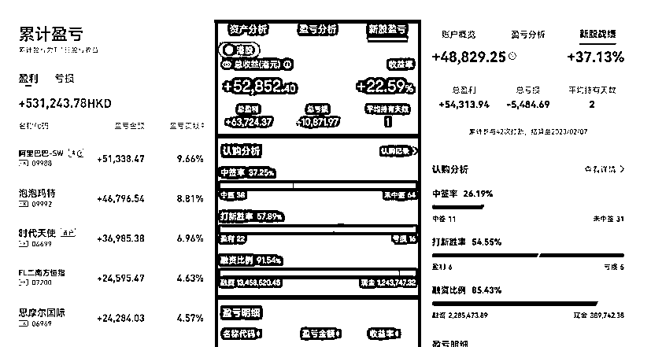
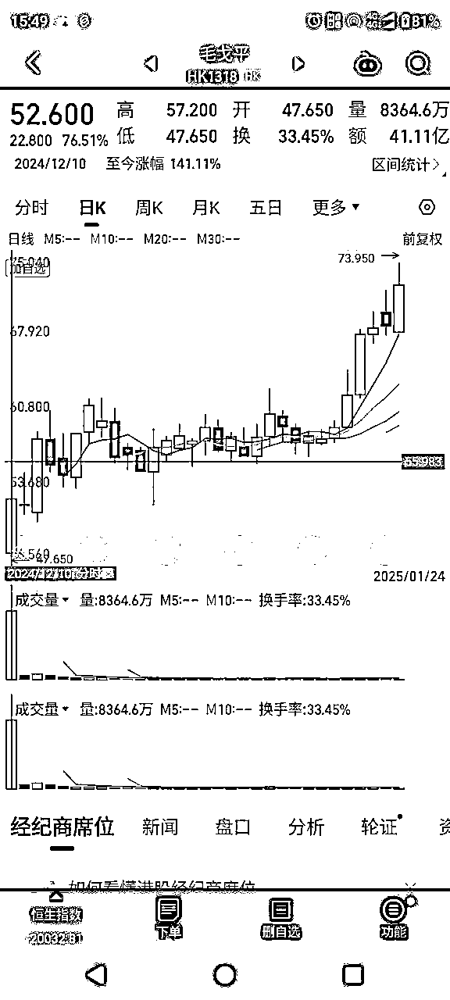
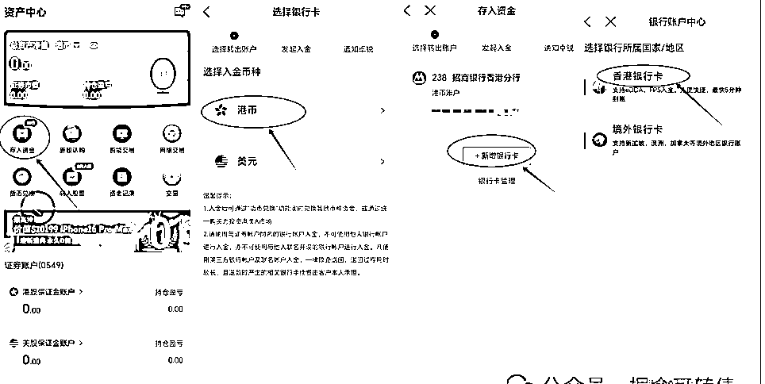
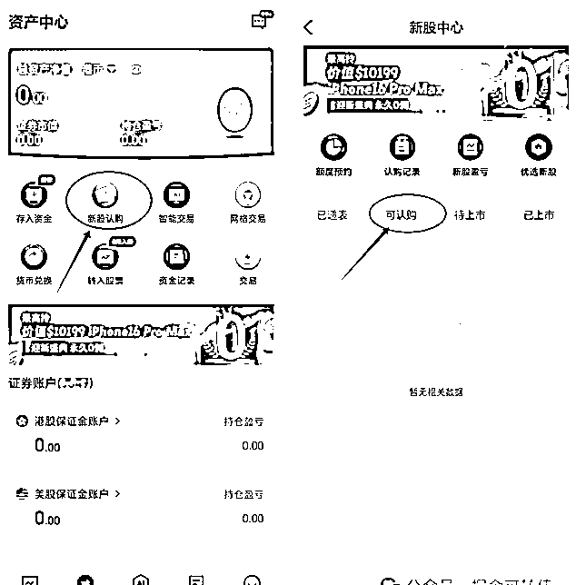

# 《港股打新策略》

> 来源：[https://wiizueiq5ks.feishu.cn/docx/LFqVdWDOco4Zx0xosVycsZayngh](https://wiizueiq5ks.feishu.cn/docx/LFqVdWDOco4Zx0xosVycsZayngh)

# 前言

在2019年至2021年期间，港股打新策略表现极为出色。当时，投资者可以使用多个账户参与打新，几乎所有参与者都获得了丰厚的收益。我们当时也全程参与其中，收获了一大笔可观的利润。

遗憾的是，自2021年起，港股市场遭遇了一轮近乎“腰斩”的熊市行情，港股打新的赚钱效应也随之戛然而止，从之前的盈利模式逐渐转变为亏损局面。参与人数和认购热度也随之大幅降温，跌至低谷。然而，最近随着毛戈平的上市，这一沉寂已久的打新策略又重新引起了市场的关注。毕竟，毛戈平的一手中签率高达100%，上市首日股价暴涨76%，累计涨幅更是达到了92%。所有参与申购的投资者都获得了可观的收益，其赚钱效应确实非常显著！

现在有不少新投资者加入港股打新的行列。对于经验丰富的投资者来说，港股打新似乎是一件很简单的事，但对于新手来说，可能需要花费不少时间去理解。当时，许多朋友前往香港办理银行卡，当时机票、住宿和餐饮费用都很便宜，顺便旅游一圈后回来开户打新。如今，那些早早就参与港股打新的投资者早已赚得盆满钵满。那么接下来，我们将讲讲港股打新得整个思路。

# 合作模式

## 合作规则

1、收益阶段性合作，64开，客户60%收益，我40%收益，合作期限一般为一年，期间资金将存放于香港账户。期间账户不动，资金自动理财。理财不参与分红，也不承担资金成本。

2、资金可用于购买理财，理财收益不参与分配，同时国内利息差也不承担，汇率波动涨跌也不承担。

3、合作基于君子协定，旨在实现互利共赢。

4、阶段性分红：按月或按季度结算，盈利按64分成（您60%，我40%）。该账户有盈利，则保证金退回。下只新股中签保证金如果足额。也不缴纳。如果不足额，再补充。

5、亏损承担：若出现亏损，由我全额补足。

结算方式：以阶段性盈亏总和为依据进行分红或补亏，而非单只股票盈亏。

6、保证金要求：若账户未盈利有安全垫资金情况下，每只中签金额可以缴纳20%保证金（比如你中签10000元，可以找我给2000元保证金）。如果有盈利，按盈利提供保证金标准。

7、账户数量：每人名下可开立5家左右券商账户，预计薅羊毛收益约3000-4000港币。

操作方式：

若您无暇操作，可委托我作为操盘手代为处理；

每个账户均为小资金操作，秉承“打新不炒新”原则，不购买任何股票。

账户安全：帮忙代薅羊毛结束后，可修改账户密钥，确保资金安全。这个不分成。

8、打新按历史以往收益，预计收益30%-80%之间，根据资金不同，策略不同，运气不同，收益会有一定差异。但总体是值得投资的一个方向。

# 什么是港股打新？

港股打新，即投资者参与香港交易所新股IPO的申购。与A股打新相比，港股打新有以下显著特点：

1.  参与门槛低：港股打新不需要投资者持有证券市值，只要有有效的港股券商账户，账户中有足够资金即可参与。

1.  中签率高：港股打新的中签率远高于A股，通常会优先保证一户一签，以确保中小投资者的参与机会。

1.  融资申购：投资者可以通过券商提供的融资服务进行申购，融资倍数通常可以达到10-20倍，甚至更高。融资申购可以增加投资者的申购资金量，从而提高中签概率，但投资者需要支付利息并承担相应的融资风险。

1.  一人一户限制：过去港股打新允许一人多户申购，但目前规则已改变，同一人只能通过一个账户申购同一只新股，重复申购会被取消资格。

此外，港股打新还有一些独特的规则和风险：

*   新股破发风险：与A股相比，港股新股上市首日破发率较高，2024年破发率约为36%。

*   暗盘交易：新股在正式上市前一天下午16:15-18:30可以通过券商内部系统进行暗盘交易，这是一种场外交易方式。

*   申购费用：港股打新的申购费用通常包括券商手续费（约1.0085%）和融资利息（如有）。

# 如何参与港股打新

参与港股打新其实非常容易，总共只需三步：第一步是办理一张香港银行卡；第二步是开通港股账户；第三步则是向港股账户存入资金。接下来，我们将详细介绍每一步的具体操作。

## 第一步：办理香港银行卡

目前，投资者必须使用香港银行卡或其他海外银行卡，才能向港股账户存入或提取资金。因此，可以说香港银行卡是参与港股打新的唯一门槛。

如果能够前往香港，办卡过程其实相当便捷，甚至可以通过线上渠道办理，避免了线下网点排队的麻烦。办卡所需资料通常包括以下内容：

1.  身份证原件；

1.  港澳通行证原件；

1.  通关小票（也称为通关小白条）；

1.  地址证明（虽然可能用不到，但最好准备，例如信用卡账单、房产证、水电费账单等）；

1.  几千港币现金（虽然可能用不到，但最好准备，部分银行可能会要求在办卡后现场存入一定金额）。 需要注意的是，不同银行的具体要求可能略有差异。因此，为了确保顺利办理，建议在前往银行之前，提前与相关银行确认所需资料。例如，中国银行和众安银行等都提供线上办卡服务，非常方便。我们也有详细的办卡攻略可供参考。

## 第二步：开通港股账户

当你成功办理了香港银行卡后，接下来只需开通港股券商账户就可以参与港股打新。不过要注意，A股券商账户中可以申请开通港股通权限（但有50万元资金门槛），这仅能交易部分港股股票，却无法参与港股打新。

如今，许多券商账户都会推出一些推广活动，例如：

*   H盛证券：提供价值1400港币的福利！

*   老H证券：500港币的福利！

*   长Q证券：终生免佣，外加600港币的福利！

通常，只要向账户存入1万港币，就能轻松获得一千多港币的奖励，足以抵消办理香港银行卡的成本（主要是往返路费和餐饮费用）。

或许有些朋友会问：“A股已经开了3个账户，还能再开港股账户吗？”答案是可以的。A股和港股是两个独立监管的体系，互不影响。港股开户没有数量限制，你可以根据自己的需求开设多个账户。一般情况下，港卡办好后，投资者会尽量开通所有有奖励的券商账户，以获取全部的福利。

## 第三步：给港股账户入金

办理好账户之后，就可以进行资金存入了。通常，券商APP上都会有一个“存入资金”的选项，以卓锐为例，以下是相关截图：

不同券商的界面可能会有一些差异，但总体差别不大，稍微摸索一下就能掌握。这里简单介绍一下eDDA和FPS的概念。熟悉A股的朋友都知道，银证转账无论是转入还是转出，都能实时到账。然而在港股，支持银证转账的券商和银行非常有限，主流的出入金方式是eDDA和FPS。

eDDA类似于单向银证转账，速度较快，资金通常在5分钟内到账，但只能用于转入，不能用于转出。投资者只需在券商端发起入金申请，无需登录银行APP进行转账，也无需上传转账凭证，操作起来比较便捷。不过，并非所有券商和银行都支持eDDA。如果不支持eDDA，就需要通过FPS方式进行入金。FPS是一种转账方式，需要投资者先通过银行APP完成转账，然后将转账凭证上传到券商APP上。对于第一次接触港股的人来说，可能会对这种操作感到困惑，毕竟在2024年，还需要手动上传转账凭证，确实有些不便。但这就是香港作为全球金融中心的特色——既现代化又保留了一些传统操作。

完成了前面的三个步骤后，就可以好好打新赚钱了。

其实操作流程非常简单。在券商APP的菜单中，通常会有一个“新股认购”的选项。点击进入后，会看到一个“可认购”的列表，如果有新股发行，就能在这里找到相关信息。

遗憾的是，目前没有新股正在发行，因此无法提供更详细的步骤截图。不过，不同券商的界面虽然会有一些差异，但总体上是类似的，稍作尝试就能熟悉操作。

# 港股打新的具体规则

之前我们已经介绍了港股打新与A股打新的不同之处，例如：

1.  港股打新无需市值，只要有资金即可参与；

1.  港股打新的中签率远高于A股；

1.  港股打新可以融资申购，券商通常会提供10倍的杠杆资金，帮助客户提高中签概率。

接下来，我们再详细对比一下港股打新与A股打新的具体规则差异：

1.  申购周期不同

A股打新通常只有一天时间，必须在当天下午3点前完成申购。而港股打新的招股期通常会持续3-6天，甚至更久。并且，港股打新不限于交易时间，只要在截止时间之前，无论何时下单都可以，哪怕是在午夜12点。

1.  新股定价不同

A股新股在发行时价格已经确定，而港股新股在发行时通常是一个价格区间。例如，华润饮料的发行价格区间是“13.5-14.5港元”，直到招股结束才会确定最终发行价格为14.5港元（上限定价）。当然，也有一些新股会选择下限定价或中间定价，这取决于认购热度和市场环境，由承销商和上市公司决定。

1.  一手数量不同

A股股票的标准是一手100股，只有科创板的起始单位是200股。而港股比较特殊，不同股票的一手数量差异较大，可能是一手200股、500股甚至800股，并非固定不变。

1.  缴款时间不同

A股打新采用信用申购模式，投资者先提交申请，中签后再缴款，甚至可以选择放弃缴款。而港股打新则需要在申购时冻结资金，中签后资金自动扣除，未中签才会退回，不存在中签后再缴款的情况。

1.  中签机制不同

A股新股的中签率是统一的，而港股打新并非平均分配，而是会优先照顾小额投资者，因此一手中签率往往较高。每只新股的最终中签结果由发行公司和承销商共同决定，具有较大的灵活性，没有固定的分配规则。

1.  暗盘交易

这是港股的特色之一。在新股正式上市的前一天下午16:15-18:30，会有一个短暂的交易时段。如果中签，投资者可以在这一时段选择卖出，也可以等到正式上市后再交易。暗盘的表现通常可以作为新股上市首日表现的参考。

1.  甲乙组划分

这也是港股的特色。认购金额小于500万港元的归为甲组，大于500万港元的归为乙组。甲乙组分配的总股数大致相等，但创业板新股不区分甲乙组。通常情况下，乙组的整体中签率会高于甲组。

# 港股打新的风险

任何只强调收益而不提风险的策略，都是不靠谱的。港股打新也不例外，同样存在诸多风险，主要包括以下几点：

## 新股破发风险

在A股市场，大多数新股上市首日都会上涨，破发比例极低。例如2024年，共有77只新股上市，仅有1只破发，破发率仅为1.3%。然而，港股的新股破发率相对较高。2024年港股共有71只新股上市，其中24只破发，破发率高达34%，即约三分之一的新股会在上市首日跌破发行价。因此，港股打新不能像A股那样盲目申购，否则很容易遭受损失。

## 融资打新风险

港股打新的一大特点是支持融资申购，券商通常会提供10倍、20倍的杠杆，热门新股的杠杆甚至可以达到50倍、100倍。假设你的账户中有1万港币现金，在没有杠杆的情况下，最多只能申购1万市值的新股。但如果使用50倍杠杆，就可以申购高达50万市值的新股。融资申购的目的是为了提高中签率，如果新股上市后大涨，自然能获得更高的收益。但反过来，如果新股破发，亏损也会被放大。因此，融资打新是一把双刃剑，对于冷门新股，千万不要轻易使用融资，否则可能会迅速被市场“消灭”。

## 炒新股风险

对于打新来说，通常会在中签后于上市首日卖出，不会长期持有。历史数据表明，大部分新股上市后即达到巅峰，随后股价往往会一路下跌。所以，我们一直倡导“打新不炒新”的理念。然而，总有一些投资者耐不住手痒，盲目追高买入，结果很容易把打新赚到的钱又亏回去。此外，还有一些投资者在新股空窗期会去购买其他个股，但港股个股的波动幅度比A股大得多，尤其是小盘股，风险难以把控，最好避免参与。

当然，尽管存在上述风险，港股打新整体上仍然是一个有盈利机会的策略。例如，如果今年只参与超购倍数在200倍以上的新股，那么在15只新股中，仅有3只破发，10只上涨，胜率可以提升到67%。

所以我们要始终牢记初衷。在办好香港银行卡后，稳健的策略其实只有两种：

一是多开通港股账户，获取券商提供的开户奖励；

二是专注于参与那些行业热门、概念热门以及认购热度高的新股，避免炒新，尽量少去博冷门股。

# 以往收益如何和未来期望

有的账户去年十几万得港币，收益率大概在10万港币左右（有策略得打），按现在得汇率，也是赚了快3-8万了。

今年美国降息周期得到来，我们预计会有资本回流，未来慢慢得港股打新会是不错得一个投资选项。只要自己账户放大概十几万人民币账户，即可实现不错的收益。大户最优解就是有50万港币以上，获得乙组打新优势。

码字不易，麻烦点个赞再走。