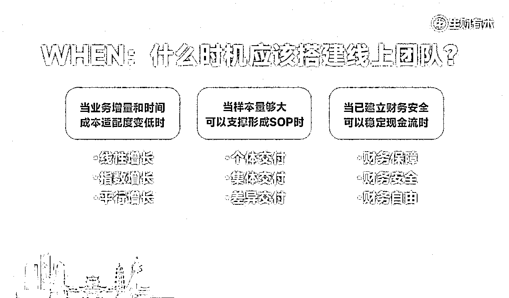

# 自由职业瓶颈期，如何搭建小而美的一人公司团队，撬动百万利润

> 来源：[https://fcjmogm9bc.feishu.cn/docx/Lc3ydCiAbo1MFWx2Z3acoKktnsd](https://fcjmogm9bc.feishu.cn/docx/Lc3ydCiAbo1MFWx2Z3acoKktnsd)

我是大家的老朋友，永远给大家提供降本增效新策略的理白。

年初做了一场嘉宾分享，复盘了我2024一整年，从超级个体到一人公司，用4位线上兼职撬动40余名志愿者团队的搭建及管理经验，今天把更完整的文字版本同步到这里，希望能够给到所有处于人效发展瓶颈期的老板和IP们一些启发。全文1.6W字，预计阅读时间：10分钟。

# 为什么是我？

我医学出身，天然就懂得怎样保养身体和保护精力。

我每天只工作4-5小时，依旧能撬动500W以上营收，是因为我一直在践行一人公司理念。

我线上兼职团队4人、志愿者近40人，人力总成本仍然控制在10W/年以内，已形成一条稳定的链路。

我最长出差时间15天，完全没有手机和信号的状态下，团队可以完全实现自运转，营业额保持在70%以上。

我的团队每个月都有纳新、筛选、淘汰机制，一直保持流通性。

我的所有内容均可以借助团队实现一鱼多吃，直播内容可以在公众号、社群、星球帖子、朋友圈以及视频切片，全网、多平台反复复用。

基于我主副业结合的特殊性，我总结出了一套经验与方法论，与圈友们分享。

# 一、从自由职业到一人公司，问自己4个问题。

我们的个人力量总是有限的，你会发现我们自己在交付用户的过程当中，去做自己个人品牌的过程中，一个人的能力始终是有限的。

你需要去调动更多资源，你需要去开启外部合作，你需要搭建自己的核心团队。这个过程就是从个人IP逐渐发展到一人企业的过程。

## （一）WHY：为什么要保护创业者的精力？

### 1、保护精力，就是保护财力，就等于在牢牢的抓住创始人交付的稀缺性。

从内容的角度考量，保护精力就是“一鱼多吃”的能力，是否可以让自己的每次内容输出，都做到100%的效率复用？

从运营的角度考量，保护精力就是“团队协作”的能力，是否可以弱化主理人的存在感，完全交由团队自动运转？

从交付的角度考量，保护精力就是“沉淀SOP”的能力，随着交付能力的提升和用户体量的变大，面对的客户变得越来越多元，是否可以按照不同的梯度和节奏去服务以及交付我们的用户。

### 2、操作策略

#### （1）把时间成本拿出10%做战略思考

作为创始人，作为引领者，永远要去时刻思考战略的内容。要学会去阅读一些跟战略相关的书籍，去更多的接触一些大佬的观点。看看自己身边的同行，比自己更优秀的创业者他们都在做什么。

这部分人能够给你提供什么样的价值，这些价值能够给我们带来什么样的思考量，这个是非常关键的。

比如说你每天可能要给客户打五个电话，每天可能要写两条内容，每天可能要发十条朋友圈，每天可能会去写好多好多课件，这些总时长可能占据了8-10个小时的周期。

这十个小时当中，就要拿出1个小时的时间来用来深度思考，可以让那些没那么重要的事儿挺一挺。这个时候自己就会有更多的可能性，这个可能性可以用来阅读。可以用来思考，可以用来深度的去回顾、复盘、总结、提炼以及展望和规划。

自己的业务模型每天不断地高速迭代，小频快跑，把自己的业务逻辑去往上走。

#### （2）把业务模型拿出10%做协作共赢

我们的很多业务其实是非常复杂的，有一些业务是跟别人产生多元合作的。这个时候有好多人在一开始就选择了跟别人合作，这不是很安全的现象。

合伙做生意这件事情是容易出一些问题的，因为一开始你并不确定这个生意能做多久，也并没有设置非常多的保底机制，没有给自己设置非常丰富的安全牌和护城河。

你的业务模型一旦跟别人合作占的比重太大，对方出问题，或者是这个业务结构出问题，有可能会造成你满盘皆输。

甚至遇到一些不靠谱的人，还有可能会伤你的口碑和你的业务逻辑，还可能会伤掉你的IP。

我也遇到过那种反目成仇的案例，见过那种好好的开一个班，一起合作，最后无缘无故就没了。

所以，一开始我是不建议很多人以合作的形式，合伙的形式去做一个大的生意的，或者去做一个大的创业的。

我认为的比较适合一人企业以及个人IP创业的行为和动作，都是以一个人为主导。

你有几个合作伙伴作为你的员工助理助教都没问题，但你自己要有主导权。

这是一种主从关系，是一种相互配合的关系，而不是两个人是平等的关系，这个是非常重要的。

那么，为什么要拿出10%来做协作共赢？这10%是什么？

是你的业务在不同的板块有一些触点跟别人产生合作。

比如说靠谱老师的核心业务是销售培训，我的核心业务是IP孵化，定价都是万元以内客单，这是我俩的利润品。但我们都拿出了个人10-20%的精力和时间，放到一起作为一个触点，合作了一个新的客单价四万的产品。

协作共赢的产品它有几个特质，第一个是两个主理人之间形成的协作共赢，在流量，内容，交付逻辑上会有相互补充的关系。

比如说我更擅长的是战略规划，靠谱老师更擅长的是营销转化。

涉及到给客户的团队打长时间的会议，一般是我来主刀，我来把规划定好。

在大型的发售营销策略，具体的内容点位和创作上，靠谱老师会给出精准的建议去让这些用户去执行，这就是我们的一种在内容上的协作共赢。

同时，我们的时间上也在协作共赢。

非常重要的客户我们两个一起交付，相当于我们各自都节省了50%的时间精力，可以帮助我们更好的去拓展自己的流量，或者是去做其他的可以帮助交付整体质量提升的部分，是我们各自拿出的10%去做协作共赢的产物。

#### （3）把赚到的钱拿出10%做市场外包

这个是每一个个人品牌独立的IP，一定要不断地追求的动作。但凡这件事情在重复，在消耗了，是无意义的劳动了，可以被整理和梳理成sop了，它都可以市场外包。

比如说你每天都在发公众号，一直在自己排版。后来你发现只要把内容写好就行，可以扔给一个排版编辑，让他来完成排版。市场价可能也就单篇的10到20块左右，一个月大概几百块的成本，这就是一种外包。

外包到一定程度之后，你会发现很多内容一开始就是语音转文字或直播写的。平时你是把这些内容自己整合成一些文章，后来你发现完全可以让别人来帮你去做这样的整理工作。而这一部分如果继续付钱，又是一次市场外包。

比如说你自己有团队，你自己正在交付某些用户，要去做很多很多的动作。这个时候你可能有一个业务，每隔3-5天要提醒一次用户去跟进什么什么动作，统计什么什么表格，去做什么什么数据复盘，这些动作你可以请一个兼职的助理助教来代替你完成。

主理人和创始人的精力要不断地被节省出来，但凡你发现做的这件事情是重复的，给你带来的正向收益几乎为零。而这个工作，你可能花一笔小钱去撬动另外一个人帮你完成的时候就跑通了第一个闭环，这就是保护自己个人精力的几种核心方式。

## （二）WHEN：什么时机应该搭建线上团队？

我们在这里提出三个不同维度的支撑。

三个维度，你符合任何一个条件，就可以去做这件事情。

### 1、当业务增量和时间成本适配度变低

比如说，你原来同时在交付10个人的时候，时间成本是一直在变高的。

当你交付到某一个临界节点的时候，时间边界效益在递减。

随着你交付的客户不断变多，自然会形成各种各样的以社群为载体，以标准课为载体，以某个训练营为载体的集中交付期。

集中交付期，是需要人力，物力和财力支撑的。

这就是可以考虑拿钱搭团队的过程，你一个人在交付一个团队的过程当中出现了时间消耗越来越大，但在收益上产生了波段的过程，这是第一个点。

第二个点就是你在做某一个项目a，每天投入的时间是五个小时，收益是一个月一到两万。

当你投入到八个小时的时候，收益可能涨到了两到三万。

可是你发现投入8小时和投入10-20个小时，增长变得有限了。

这个时候你就要开始考虑，这部分多出来的时间是不是对你而言就是一个无效时间了。

换句话说，你可能需要把时间节省出来去做更重要的事了，这部分工作就需要通过员工来完成。

你的个人努力和个人时间的投入成本进来，对你的业务总体增量没有影响的时候，这部分就可以拿出来外包，或者是让员工来做，让团队来做。

什么叫线性增长？指数增长和平行增长之间有什么区别？

线性增长指的是你每多投入一分收获就多一分，这个叫线性增长，是一个很稳定的过程。

比如说我原来开始是做写作出身的，我知道花两个小时写稿和花五个小时写稿，我的稿费就是不一样。因为时间变多了，能产出的稿件变多了，我能投稿的单次投稿的内容变多了，能够得到的稿费就自然变多了，这是直接跟数量相关的。

到了一个阶段之后，我发现必须要提高我的内容质量。

单次条件时间情况下，如果我的内容质量进入了一个突飞猛进的环节，那我的稿费就会自然升高，能够上稿的平台就会自然变多，能够得到的利润空间就会变得越来越大。

我服务的人越贵，我服务的人越重要，我能够获得的利润就越大。

这个时候需要主理人本身的精力用来思考怎么样让自己的业务升级，升级之后会遇到一个指数增长。

那最后就会遇到刚刚发现的那个情况，就是碰到了行业的天花板，或者是单账号的天花板，或者是单个人精力时间的天花板。

你陷入了一种瓶颈期，发现保持跟之前一样的业务密度和业务工作量，收入没有什么进展了，也很难再往上叠加工作量了。同时，很多的工作量已经被重复了，开始被无尽的消耗了，这个时候就可以开始考虑需要1-2个人来帮助解决问题了。

### 2、当样本量够大可以支撑形成SOP时

第二个叫当样本量够大，可以支撑形成sop。

什么叫个体交付？

我们一开始去交付，去做知识付费，去陪伴客户，去交互客户的过程当中是个体交付。

一开始你的客户一定没那么多，因为你的流量是有限的，交付能力不变的情况下，流量成本是有限的，获得流量的能力是有限的。

所以一开始。你可能只能交付3-5个人或者10-20个人，这个时候的交付往往是个性化的。

一个人刚开始去做培训的时候，带的学员是比较忠诚的。而且，他能够投入的精力以及情感是比较多的。因为这个时候他能够记住每一个人，我的第一个客户是谁，我的第二个客户是谁，我的第十个客户是谁，往往这个主理人是记得住的，这个叫个体交付。

个体交付的意思就是你基本上记得这些人是谁，你不是在用sop在交付，是在用你这个人在交付，用你的情感能量在交付别人。这个过程当中，你会发现人越来越多的时候，不得不去形成一些sop。

什么样的情况下需要形成SOP交付？

比如说，你必须把这个课听完再来跟我约电话，必须完成一二三四这四个作业，再来进入到第五个环节，人为的设置一些关卡，设置一些问卷。人为的设置各种各样的福利活动，让这些人进入到设置的游戏规则和流程当中再被集体交付，再被流程交付，被系统交付。

这个时候主理人的精力节省出来了，这个过程是一定要依托团队去完成的。如果做反复做这些普通的事情，作为主理人你的时间是被浪费的。

所以当你需要集体交付，需要样本量大，需要sop支撑的时候，你就需要搭建团队了。

形成SOP是为了差异性交付。

搭建团队之后就可以自然的进入到下一个阶段叫做差异性交付。

搭建了团队之后，你的时间其实又被省出来了。

可能你原来面对100个人，接不过来，没有办法去承接。

但是现在这100个人的80%的问题，通过你的团队承接住了很多基础矛盾，非主要矛盾被接住了。

这个时候，他们每个人各自的20%的主要矛盾问题会来找你本人解决。

你重新回到了个体交付的状态，这个时候再做差异化的交付，势能和能力就已经截然不同了，这个叫形成sop。

### 3、当已建立财务安全可以稳定现金流

第三个就是当建立财务安全可以稳定现金流时，这个地方有三个概念，财务保障，财务安全，财务自由是来自于这个《财务自由之路》这本书。

这本书里边把我们的财务分了三个等级，叫做财务安全，财务保障，财务自由。

什么叫财务保障？

所谓的财务保障就是留出了六个月的现金流，这六个月的现金流可以让自己在没有任何增长的时候保命。

什么叫财务安全？

所谓的财务安全就是基本上每个月的正向收入可以覆盖掉一些支出，且有结余。也就是说你的盈亏是平衡的，且盈利是大于支出的。你不是一个持续地在消耗自己的状态，这个叫财务安全。

什么叫财务自由？

所谓的财务自由是你的被动收入，大于你的日常消耗，你的所有供应链和所有成本已经小于被动收入了。被动收入指的是你的投入、你的房产、你自己靠管道数带来的各种各样的更多的可能性。

比如说你之前发了一篇文章，持续的有流量主的费用。

比如说你之前投进银行里或者是某个理财基金里的某一部分钱持续的给你带来利润，这个叫财务自由。

当你的被动收入已经开始大于你主动的消耗，这个时候叫财务自由。

我们作为创始人只要满足这个财务安全的概念，基本上就可以去做团队。

所以你会发现很多公司破产，做不下去，经营不了了，也都是因为财务安全无法保障，就是每个月的支出成本已经远远的大于自己的实际利润。

这个时候，你可能就要开始裁员，开始关停公司。

很多人他会发现做这件事情已经没有冲动了，已经没有挑战性了。

有很多人他是在不断地追求卓越，追求更多的可能性的。

而这个过程当中，想要去追求更多的业务体系和体量的时候，可以考虑采用这样的方式让一个团队来完成你的一个业务闭环。

而自己又可以去带新的团队，去做新的事业了，这是这样的一个逻辑。

## （三）WHERE：从哪招募有战斗力的线上员工？

### 1、团队搭建有哪些方式及渠道？

#### （1）核心用户

第一个就是日常找助理从核心用户中选择，越核心的用户，越值得被挑选。

比如说，我的核心一号员工小宇宙老师。她就是分别跟我买了两个万元客单产品后，还持续愿意深度链接；我的二号员工微微老师，也是如此。

小宇宙和微微老师，就是这样变成了我的核心员工，现在也是我的管理者。

现在我觉得在理白团队里，他们甚至是比我本人还要重要的角色。

从核心用户中去选择你需要的人才。

核心用户有几个好处？

第一个好处：他对你比较熟悉，知道你的价值观，知道你的情感浓度，知道你日常在做什么。所以上手就会快，可以快速的跟进和熟悉你的业务。

第二个好处：粘性更强，不需要去培养他的用户粘性，不需要去宣扬什么企业文化，他就能够快速的去捕捉到你的概念。

第三个好处：他是你带出来的人，是你的徒弟，已经学会了你的很多方法论和知识。

这个时候无论是让他帮你去做运营，还是帮你去做交付，在很多很多时候他可以成为你的嘴替，帮助你承担很多部分。

你的交付逻辑之下，符合你的用户需求和期待的这样的交付体系。这个是日常的交付，日常的招募。

#### （2）特殊渠道

你总归是需要一些人做一些日常员工做不到的事情。

比如说我要出一本书，比如说我可能需要剪辑手。

这些事情是我自己没有培养过的，我自己的员工目前不具备这个能力的，我就需要在专业人才中去选择。

甚至说我可能需要一个财务官，我刚开公司的时候需要去合理地知道公司该怎么样更好的交税，怎么样更好的去分配财产，股权的分层等等，这些东西是需要一些专业人士来帮我提点的。

甚至一些更大的社区和公司，他们会去招项目合伙人，或者直接是公司合伙人，共创合伙人等等。他们要么在能力上有巨大的优势，要么就是在流量获取能力上有巨大的天赋。

我记得亦仁哥就提到过：

如果能够给得起配得上这样的一个人的高薪，你就一定能够找到适合你的人。

如果觉得自己的人干活不踏实，不利索，或者是觉得自己的人不行，大概率是因为你给的钱不够多。

所以，一个从特殊渠道在专业人士中以正式招聘的形式去选择合作伙伴这是第二个方式。

#### （3）机构合作

第三个就是合作，咱们生财就有团队在做小助理培训，你可以付费去购买你需要的助理助教。

比如说我就找他们买了一个内容编辑，我的内容编辑叫北川，也非常优秀。

现在我的日常公众号排版都是他来完成的。

可以理解为你付费招募一个已经被培养过的，已经有某一部分基础能力的一个员工。

这个时候，你就可以直接去买，直接去市场上找到专门做这样培训的。

那么同样的，如果你自己目前的员工，有什么技能需要去掌握，你也可以花钱让别人来培训你的员工。所以我经常花钱去请谁谁谁谁，来教给谁谁学什么什么东西。

这就是合作一个好处，你可以快速的通过同行或者是通过某一些固定的机构买到你想要的人才。

同时，你可以在优秀的社群招募到非常多优秀的人才。比如，咱们生财的志愿者培训体系下出来的志愿者，直接被我招进来做我的运营部门负责人了哈哈。

#### （4）营销策略

第四个就是一些小众的方式，是我原创的一种方式，用营销策略来招员工。

因为理白就是一个IP营销顾问，我的天赋就是把所有的动作全部找到它的营销逻辑。

所以，可能所有的人教你怎么招员工，只能教前三种或者是更多。

而我教你的是，怎么样把招聘这个动作也变成营销的过程。

我们来举一个例子：

比如说，我们要招一个员工，本质上是要为我的业务做赋能，而为我自己的业务做赋能的过程当中，其实也是在变相的让别人了解到我的业务。所以有很多非常大众的赛道。

这个人在了解的过程当中会觉得，我不妨也买一个这个服务，我不妨也买一个这个交付。

如何做一个完整的策划？

##### 1）征集文案

比比老师是做的小红书业务培训，当时我们设计写了一个征集文案。

我们团队现在需要员工来帮我们交付一部分的客户，这些客户包括了一些c端客户，也包括了一些b端客户。

比如说一些简单的业务调研，市场调研，爆款选题调研，数据分析，问卷搜集等等这些工作，是需要别人来配合我们做的。

这个过程我们写了一个征集文案，告诉大家你们需要做什么工作，我们大概能够拿出多少的薪资，欢迎你来报名。然后，这个时候报名的人数就到了100到200人。

##### 2）填问卷

报名的这部分人圈起来之后，就进入了第二个环节叫做填问卷，锁定核心需求。

如何设计问卷填写内容？

它包括了几个环节

第一个点：考察这个人的日常的消费水平和收入水平，来判定要开多少的工资才能配得上他。

第二个点：了解一下这个人的年龄标准和家庭状况，来判定他每天能够抽出的工作量有多少。

第三个点：判定他是否具备相应的能力

我们涉及到的这几道考题，是层层递进的。

比如说：

第一道考题，是让他根据这个选题找到市面上最爆的四条笔记。

第二个考题，是可能会让他在找到这四个封面中当中哪一个封面最容易爆。

类似于这种考题，我们涉及了非常多，用来考验他的基础业务能力，这个叫做填问卷。

我们一边在填问卷的过程当中去出题，一边去考察他的一些基本的背景情况。这些就可以通过年龄、月收入、期待的薪资以及家庭环境和家庭情况来做一些基础调研。

##### 3）做筛选

第三步，就是做筛选。

筛选这个地方，我们做了非常多巧妙的设计。

###### 问题一

比如说：

我们会直接在问卷里问，如果要求你必须已经是我们的付费用户才能成为我们的兼职员工，你愿意付费吗？或者你怎么考虑这个问题？

有的人就会直接写，我愿意。

有的人就会写，我不愿意。

有的人会写出一大篇的理由，但是核心思想就是我不愿意。

这其实就是一个在不断测试的过程，就是你一直在检测这个人可以被你考察到什么程度，他可以被你用到什么程度是可以接受的，这就是一种筛选过程。

###### 问题二

我们会问你的期待工资是多少，这个时候就会发现一个很惊人的现象。

有很多很烂的，能力很差的人，他的期待工资非常高。

但是有很多能力非常强的人，他甚至会写什么我不期待工资，只需要跟你的团队持续学习1-3个月就好。那你会发现每个人的小九九是不一样的，有的人会写我期待的工资，是符合这个市场需求的。

第一种人就可以直接不要。

第二种人就是可以给你很大的帮助，你也可以信任他。

但他可能三五个月之后会自己开班，可能会自己去做这个事情。

我们作为招聘者，作为管理者，需要去做好这样的预期管理。

第三种人可能就是相对稳定，所以我们会发现招上来的员工大概率就是第三种人，可能相对稳定一点。

###### 哪两类兼职员工持续稳定？

<h7>大学生</h7>

第一类人是大二大三的学生，他至少在大四毕业之前的两年的周期是稳定的。

为什么大学生稳定？

第一个原因社会环境相对单纯。

第二个原因有一笔死工资，他会很开心，一个月的生活费可以改善很多，哪怕他家里是富有的，他也很愿意做这件事情。

第三个原因离毕业还有一段时间，不至于那么着急忙慌的去做别的事情。

他可能稳定在你这里，他就可以无缝的给你干。

而且我们也有案例，就是这个学生给你干到大四毕业之后变成你的全职员工也会有这样的案例。而且，大学生相对而言要价不会特别离谱。

<h7>孩子3岁以上的宝妈</h7>

第二类人群是宝妈群体，特别要强调是孩子3岁以上的宝妈，这个数据非常重要。

为什么孩子3岁以上的宝妈稳定？

因为孩子在三岁之后基本上就可以送到幼儿园去了，所以这部分宝妈白天的时间是控制的，可能就是晚上哄睡的时候需要时间，可能孩子大了要辅导学习。但是白天在幼儿园的时间，在学校的时间，宝妈的时间是相对空出来的。

你非常多的运营业务可以交给这些人来负责，而且这类人可能一干可以干五年这么长时间。

因为她可以持续的去做这件事情，而且她的生活环境也相对比较简单。

<h7>全职太太</h7>

第三种就是一个非常少见的理想状态全职太太。

为什么全职太太稳定？

全职太太，她需要有一个理想信念。

就像新闻里说的，一个拖地的清洁工阿姨得知某家公司要倒闭了，然后出资了1000万把这家公司救活的，这种奇葩案例，你一定听说过。

会有这样一部分人，她先生很有钱，或者家里很有钱，很早就不上班，或者不需要上班，也没有什么很奢侈的爱好，是一个很本分的人，她心中有一个追求感，有一份追求。

你的业务或者说你的理想、你的信念、你的价值观跟她是匹配的。

她愿意为你去做这些事情，甚至工资对她而言没那么重要，工作是为了完成她心中的某个抱负和理想。这也是一种很合适的人选，但是这种人选就可遇不可求。

前两种是可以被筛出来的年龄段，读书层次以及大概婚恋情况都是可以调研出来的。

##### 4）送福利

最后一步就叫做送福利，让出利益空间。

我们刚刚一直在聊这是一个营销动作。

第一个逻辑是我们要让所有成为我们员工的人，至少先成为我们的付费用户，我们可以筛出来。

第二部分是经历了层层筛选，设置了初试和复试。复试之后，我们最后做了一个福利。

赠送什么福利？

首先给所有人一个具体的礼物，可能是一个小课，可能是一个实体礼物，这个不定。

那第二个步骤是，我们的某些核心课程可能这个原价是799元，鉴于大家经过了层层努力和筛选，虽然筛选掉了，淘汰了，但是给到你一个权限，可以半价买这套课来学习。

也希望你在学习这套课之后，未来有实力更好的成为我们的员工。

你让出了这个利益空间之后，这部分人会因为这一个流程对你的实力很自信了。

你设置的考题他不会做，他就会想要学，想要提升，就会觉得我确实需要提升这部分技能，我确实需要在这个能力上有所突破。他就会买你的课，甚至是买你的私教，买你的交付。

所以我们通过招聘这个动作，把它包装成了一个营销动作，我既招到了合适的2-3个员工可以持续给我们工作，同时也招到了一群极度信任我们交付水平和实力的人。

我们甚至没有搞什么公开课活动，他们就已经验货了。

因为他们最开始代入的是我是交付方，我给的真的很多。

而他们作为被成交方的时候，也会非常心甘情愿的为你付费，这就是把整个招聘逻辑包装成一个营销策略的过程。

### 2、不同招募方式的优缺点

#### （1）核心用户的优缺点

核心用户的好处就是知根知底，你对这个人非常有信心，你知道他的来源，你知道他是怎么来的？你知道他是干嘛的？

坏处就是有可能他很多技能点是需要培养的，需要去让他在某某一些技能点上不断突破的，需要消耗主理人自己时间的。

所以经常会有人来跟我说理白老师，我发现我带了个团队，还不如不带，因为有的时候我教完我的团队该怎么干，这个我都自己干完了。

我说你别急，这个过程肯定是要有的，你把第一个人教会了员工之后，回去之后是不是可以让这个人来帮你去做培训了？

所以这也是我的逻辑，我自己的团队当中，我会设置管理者，管理者帮我去管团队的过程当中，我自己就不用再去跟更多的人去做接触了，这个叫做贴身培养。

#### （2）专业人士的优缺点

专业人士就是自带经验可以帮你把很多事情和业务盘活，甚至在很多地方是强于你的，不然你也不会花大价钱去请他。这个负面或者弊端就是成本太高，你可能请不起，可能留不住人才。

#### （3）特殊渠道的优缺点

第三个叫特殊渠道，特殊渠道的好处就是省事省力。

你说好需求，说你要干啥，给出你的预期薪资，帮你匹配到合适的人。

省事就是这些人是做中介和媒婆的这种感觉，他可以帮忙对接主理人和自己的助教们，把助教匹配给主理人们。

但它的坏处也很明显，就是保密性不强。

因为有可能这个人会同时打好几份零工，他给你做编辑，也可能给别人做编辑。

所以，你的业务不方便让人知道的情况下要慎重。因为有可能这些东西，会随着这个人被传出去，很难被保密。因为有可能这个老师在他身上可能比你在他身上更有信任度，这个叫特殊渠道的好坏。

#### （4）营销策略的优缺点

营销策略的好处就是一举两得，不只能招到人还能挣到钱，还能完成一次发售活动。

坏处就是很多人他可能愿意来配合你，但是可能三五个月之后，他就可以自己独立的去干这个了，因为你把他教会了，所以这是营销策略过程当中的一些负面影响。以及因为这是一个营销活动，所以用户的忠诚度就不是很强，随时有走的可能。

所以，我和我合作过的很多私塾的对象，他们的不同方式去招募的员工，核心用户是持续时间最久的。但是营销策略招过来的人，可能三五个月就要换一次。

所以你的团队如果培训起来很快，上手很快，或者工作流比较简单的时候用这种策略招聘，是非常合理的。

## （四）WHAT：合格的3-5人线上团队长什么样子？

### 1、对不同员工的要求

#### （1）听话照做执行力

听话照做的执行力，是一个非常基础的能力。甚至在某些程度上是胜过后面两个更高级别的能力。

一个愿意对你保持配合和忠诚度的人是一个基础要求。在最开始你给别人布置的任务，其实并没有那么复杂。所以，听话照做就是一个非常重要的本领。

他可以很认真，很踏实的去做这些事情。相对而言，他可以是一个笨笨的，相对木讷的，不怎么爱说话的人，但是做事的动作一定要很利索，这是第一个要求。

#### （2）主动作为推进力

第二个就是主动作为推进力，他可以倒逼你去行动一些事情。

你布置了任务之后，他主动开始倒逼你去完成一些业务和量级。

我们团队比比皆是，每天都是不同的人来催我干这些干这些。

可能在过程当中，我是那个被推着往前走的人，这就是二号员工的一个很好的要求。

#### （3）统筹协调管理力

一号员工，他可以在你不在的时候帮你去做一些决策。

比如说，我经常会面对要交手机的出差。因为我有主业，我的主业很多时候有一些培训，或者有一些项目，手机是要锁起来的，可能一锁锁要锁三天。

这三天我不在。我的团队该怎么运作？

有没有这样的人可以帮你去做这些事情，帮你去统筹兼顾和管理？你需要这样的人才帮助你管理你下面的人和不同的员工。

### 2、对管理模型架构的要求

一人公司理想团队的管理模型，它的核心架构最上面一定是主理人以及合伙人。

主理人是作为负责人来负责所有的一切，合伙人可以去帮助做一些辅助决策。

这个时候就分成了内部管理的负责人和外部企业负责人。

#### （1）内部管理

内部管理的负责人可能有不同的项目组a项目b，或者说可能会有不同的业务组。

还有负责做内容的，负责做流量的，负责做运营的。

不同的项目有不同的负责人，还有一部分叫做志愿者负责人，就是专门管志愿者的。

内部管理的逻辑就是你需要一个贴身助理，去帮助你分担一部分任务。

分担的多了，你发现这个人承接不过来了，就需要给这个人涨薪。

这个时候你会发现有一部分业务又可以分出去，就要找第二个助理。

找了第二个助理，这个时候你会发现第二个助理也要涨薪。

这个过程当中，你又发现你又有一部分业务需要第三个助理。

第三个助理出现了，你会发现你要同时对接三个人。

你发现好累呀，那你就把第一个助理培养成管理者，让这个管理者去对接二和三，你就不用对接了，这就是架构的一个层层递进的关系。

#### （2）外部对接

这个项目或者这个事情不需要长时间的干，短期需要做。

比如说，我要做一次操盘，我就会去请彩卉，我要设计海报，我就去找佳丽。

比如说，九月份有一个新产品要发售，要做一套海报，或者是做一个发售的操盘。

12月份你又要搞一次，这个时候九月份对接一次之后，带一个员工一起去对接。

对接完了之后，下一次对接就不用你本人对接了，就有人专门为你去做对接了，就有所谓的外部对接负责人帮你对接。

微微老师原来第一次我们搞实战活动的时候，是我带着他一起跟教练说该怎么做，跟志愿者说该怎么做。后来这个事情跑完之后，2月份到12月份所有的实战营，以及跟所有人对接都不需要我本人来进行了。

微微可以帮我全权把这些事情负责，这个时候就形成了我们团队的管理模型。

# 二、单打独斗到40人兼职团队，人力成本控制在10万以内，我做对了什么？

## （一）如何设置团队框架和激励机制？

### 1、权力机制

第一种就是你要让他拥有决策权，拥有替代权，拥有知情权。

什么叫权力？

权利就是他能够拥有在这个环境内自主决策和自主判定的能力。

#### 什么叫决策权？

比如说子不语，她让很多剪辑手剪完一个东西，我是没有时间看的，我也不会提前去看。

我的管理模式往往是让员工推进自我成长。

比如说子不语，找剪辑手剪完了一个视频。

我说你自己定，你来判断，你决策就好，我一直都会说这种话。

我让她自主决策什么样的内容是符合我的。

数据会说话，最近数据跑得不好了，我会截给她看。

让她自己拿到这些数据去做调整和反馈，哪一部分数据好自然就可以往这个方向去发展，这是第一种。

第二种是我会回看发的过程当中哪些细节不愉快了。

比如说我前两天我会发现，明明是一个9:16的长视频图。

但是封面是需要做成3:4的，封面露出的标题上下两行之间超出了3:4一个范畴。

我就跟她直接说，这条视频目前来看是不合格的。

我正常会发，只不过后面要注意。

我不会去追溯前面犯了什么错，只是说后面要调整。

这样的话是可以不断让员工去找到自己能够独立决策的这种信心的。

她决策的东西越多，就越愿意为这件事情负责，越愿意把这个东西往前推进的更好。

所以不要代替员工做决策。

作为老板不要有太强的完美主义。

#### 什么是替代权？

你要知道员工的决策顺序是什么？

就是由谁负责哪一个板块，谁不在的时候谁负责什么板块，要非常清晰。

比如说我就会讲的很清楚，我在出差那段时间有十天不在家，我会说所有的决策拍板靠谱师负责。团队内部的所有事情宇宙老师可以拍板，宇宙老师可以独立决策替代我去做决策。

就是替代理白做决策的人是谁？他可以完成什么样的动作？

有什么事情是必须向我汇报的，哪一部分内容是值得告诉我的和或者说是必须告诉我的。

哪一部分是不用告诉我的，就是要让员工知道自己要到决策到什么程度，以及能够替代谁做什么决策。

如果宇宙老师休息的时候微微应该做什么决策，子不语该做什么决策，落薇该做什么决策，每个人都要有这样的一个独立判断意识。

#### 什么叫知情权？

知情权要向不同等级的人开放不同的权利。

比如说跟志愿者说就是你们去执行这个动作，跟志愿者管理说就是你要如何激励这些志愿者。

为什么要这样激励？

在跟宇宙或者是微微和落薇他们说本质上是为了这个目的，但是我要用这种手段来达成。

你们要知道我的底层逻辑是为了什么？

甚至在很多时候，我在战略部门里做出了一个决策，或者是一个想法的时候

我会请他们来帮我优化，会让他们知道我为什么要做这件事情。

第一是他们知道了为什么要做这件事情，他们推进起来就会更心安理得，有自己的底层逻辑和自己的思维方式。

第二是他们知道了我的底层目标是什么的时候，就更能够非常清晰的感知到，在推进的时候哪些话可以说，哪些话不可以说。

这就像是我们有一个大原则。

如果你不告诉员工这个大原则，比如说我就是要卖a，a过来讲个价。

如果员工不知道你能不能让利，能不能给出其它的对应解决方案，他是不敢替你做决策的。

所以，他知道你的底层逻辑这件事情是非常重要的。

要让他知道你是如何做出这个判定，以及如何做出这样的一个符合规定的判断逻辑。

他才能够更好的去推进这个事情，叫做知情权。

### 2、薪酬机制

底薪+绩效+奖金

#### 底薪

我建议是薪资要定三个板块，第一个一定要有底薪，志愿者可以不给底薪。

但是只要是你的正式员工，哪怕他是兼职也要给底薪，就试用期也要给底薪。

这个底薪，比如说全职员工的底薪是2000。那试用期可以给60%，可能就是二六一十二一千二，对不对？

或者全职员工的底薪如果是500，那给60%就是300。

第一是要有这个底薪，你可以说试用期多久转正之后底薪是多少，这是一个底薪设置，底薪设置是在这个人没有违反你的重大决策和重大逻辑，以及没有给到你做出重大损失的时刻，这个底薪是雷打不动都要发的，这个是底薪。

#### 绩效

第二个是绩效，啥叫绩效？

有一些规定工作，你必须要完成。这个涉及到一些交付运营部门，我们不太容易出现这种绩效的情况。

因为我的团队的所有交付都是我本人来做，这个是我自己作为自己的业务模型的一个考量。

我所有的一对一的交付都是我本人，我不需要助理帮我去约电话，不需要我的助理去催什么，

他们只需要完成运营管理和内容的工作就行了。

大部分的这个交付工作是我来做的，但是有一部分团队是你需要你员工去做交付的

比如说我要跟进某个客户的十条小红书笔记，需要去帮助客户发20条视频，这个叫做绩效。

绩效考核是以具体的数据为依托的，就是达成了某一个标准。

比如说我每周或者是每天要在社群里跟用户提醒一次，这是一个达标率。

我每隔一周需要给用户提交一个十套的什么什么选题报告，这个是一个达成率。

达标了之后，绩效就可以发，可能绩效设置成底薪的一半，甚至是四三分之一都没有问题，这是绩效。

#### 奖金

奖金是围绕着单一项目的设置，或围绕着增量和转化的设置。

首先，一部分奖金是最近有一个什么活儿，大家做的都不错，我突然多赚了50万。

这50万我拿出5万来分，或者拿出1万来分，每个人发红包。

或者是直接给他们买金子，就像我经常会买礼物，可能会寄我自己代理的护肤品。

最近这些员工本身帮助了转化，比如说我跟比比老师谈的奖金设置有一部分就是转化奖金。

比如说这个人他报了一个3个月的私教，是由这2个助教在跟。

如果这个人在3个月私教结束之后，他升单成了年度年度私教的话，这两个人都有的分成。

这2个助教助理都有一部分的利润可以分掉。

第一是倒逼他们在这3个月周期的交付中好好对待这个用户

第二是他们也可以承担一部分的销转作用，这个就是奖金设置。

底薪是稳定保底的，绩效是让他们可以完成一些规定动作，可以让他们不出错。

做到80分的，奖金是冲着100分去的。这个人做的足够好就有奖金，这个人做的能够给你带来新的增量，他就能有分钱，这就是一个良性团队设计。

要定期的去根据不同的情况去涨薪，以及不要不舍得开人。

我去年就犯过这个错误，有一个人其实已经不适合我们团队了，已经不太适合长期跟我们干了。

但我觉得有感情，不舍得开，所以拉不下面子，不好提。

一直在发这个钱，但活儿越干越差。

最后是我团队的其他的人在干这个活儿，但我的钱还是发给那个人，是严重的奖惩错逆。

最后我调整好了就开掉了，后面也是朋友，也是很好的关系，也没有什么影响。

之前太好面子就会出现这种问题，或者是太心软就会出现这种问题。

不要用情感左右自己逻辑上的判断，公司和公司的管理团队的运营，有一套严密的缜密中密的sop和逻辑的。

你不能因为个人感情在这里边发挥过度，就丧失了这些东西好，这是财务。

## （二）不花一分钱的志愿者队伍如何建设？

### 1、为什么招募志愿者？

我建议大家一定要做志愿者这个动作。

我们团队的志愿者有40多个。志愿者是不需要发工资的，志愿者只需要给他一些课就行了。

我们的志愿者是层层筛选出来的，我会先填问卷，让大家愿意去做志愿者。

### 2、志愿者要做什么？

可能是社群的一些运营，一些基础的社群维护，一些答疑，一些文字整理的工作。

工作内容都不难，但是做到一定工作量级就可以解锁我的一套课或者是我的某一个交付和服务。

他做的多，甚至可以成为我的核心用户。

### 3、志愿者的招募和培训流程

## （三）主理人可以完全放手的团队管理方法

### 1）战略团队

战略部就是我们几个最老的核心员工加靠谱，比比，几个人谈一些具体重要的发展策略。

一年能够搞一两千万的独立的自由职业者，也是需要这样的战略部门。

我们不是完全一个人拍脑门儿，啪一下就决策了，也是需要一个战略部门来讨论该做什么。

### 2）内容团队

然后我们又分了内容部，运营部，产品部，外脑团和顾问团。

内容部就是专门负责我的公众号，视频号，朋友圈，社群的一些素材的积累，还有我日常在群里的发言等等的整理。

比如说我的内容部里边有人专门负责朋友圈，视频号剪辑的这个管理。

我的视频号是专门养了十几个剪辑手，这些人归同一个人管。

我只要每次直播完，会有十几个剪辑手全部帮我把视频剪好，我只要定时发就行了。

我的内容虽然很多，但是基本上都在一鱼多吃，就是因为我有不同的管理团队帮助我把不同的素材重新重组，这是我的内容团队。

### 3）产品团队

我的产品团队就是设计海报、操盘发售、上架我的课程链接，以及我的一部分的学员达到了一些条件之后可以得到一些免费赠课。

或者说我的一些志愿者可以免费学一些课程的时候帮我开放链接，这个是产品部门的事情。

### 4）运营团队

运营部门的事情就是我每个月会搞两次实战营，是运营部门负责的。

比如说我的所有员工培训，所有的新志愿者培训会有非常详细的志愿者守则。

员工培训守则给他们布置什么作业，达到什么条件可以升级，达到什么条件可以得到我的虚拟货币，达到什么条件可以接受我的什么课。

有非常详细的、明确的指令sop和规划，这些都是我团队的人写出来的，我全程没有参与过，这些具体的文件已经全部形成了。

我看似是一个人在这里工作，其实我下面有几十个人在配合我。

这几十个人都不是被我本人管的，都有我自己的核心员工在分门别类的管理着。

这就是我的几个部门的大概的分工、要求以及结构。

这就是一个我作为一个团队的负责人的规划，就是一个比较不错的团队管理模型。

在这个模型之下，任何一个人都可能会兼顾2-3个不同的角色。

比如说他在内容部门里边是负责人，可能在产品部门里是一个配合者。

然后，他们不同的部门之间也会有相互的合作。

比如说我需要写一本书，我可能需要运营部门的人帮我出几个工作人员搜集，可能需要内容部门的人帮我去把之前的一些讲稿整理出来，可能需要一些剪辑手把我的素材剪出来。

然后，给到这个外部的顾问团来帮我把框架搭好。这种时候，我的每一个具体的业务都是由几个人来共同协作完成的。

然后你把每个人的具体分工写的非常清楚就可以很清晰地把你的业务执行好。

这跟大公司的业务逻辑肯定没法比，但是你会发现一个小小的麻雀，它也是五脏俱全的，也是可以提供非常非常多的不同维度的交叉可能性。

之后，你把自己的团队带好，只要保证你自己这个人在增长，把工资发好，就没有什么大问题。

最后，我认为所有变现的问题，本质上都是效率的问题，只要我们能正确使用杠杆撬动效率，用制度创造利润，就能大大节约主理人的时间成本，让自己的团队，更好更快地发展下去。