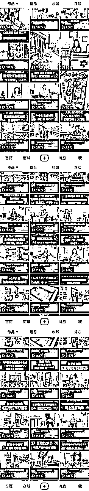
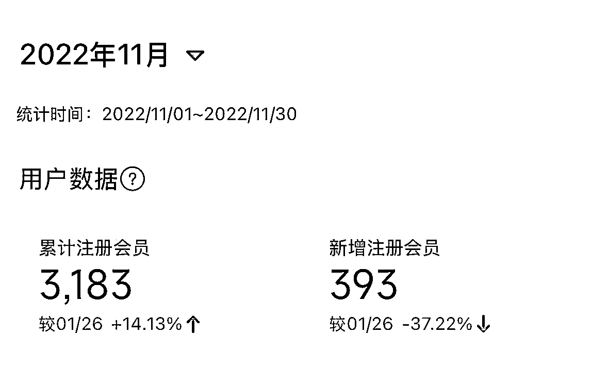
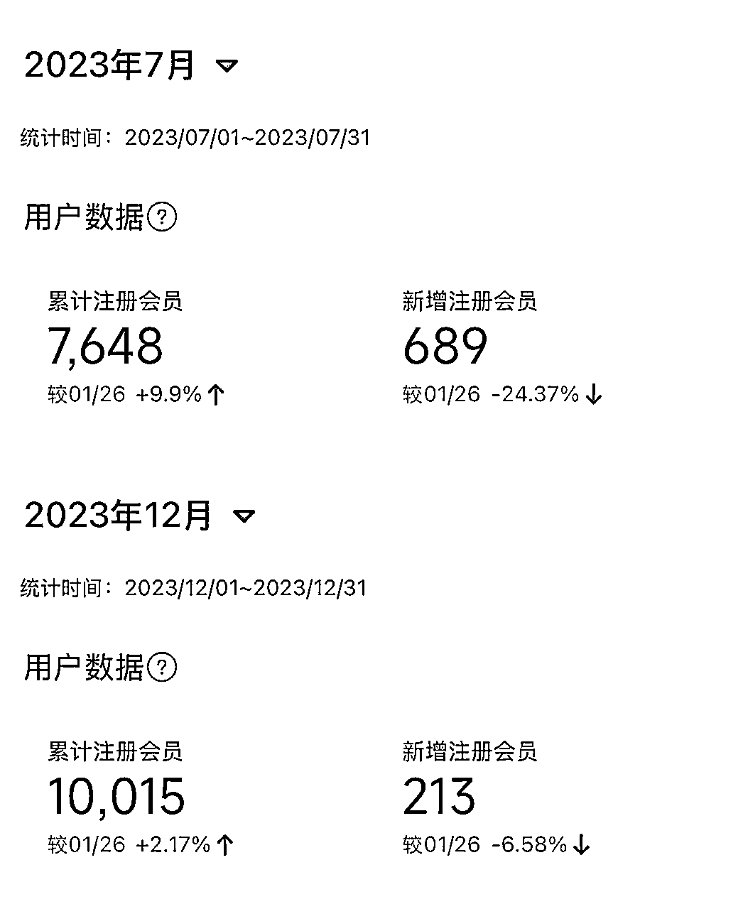

# 『深度复盘』把握同城流量红利，线下咖啡连锁用户1年增长10倍

> 来源：[https://kv6btk7fh2.feishu.cn/docx/Ls7udq0AXozYz8xMBVQcu6Uqnwe](https://kv6btk7fh2.feishu.cn/docx/Ls7udq0AXozYz8xMBVQcu6Uqnwe)

每一个流量平台的兴起到鼎盛再到衰落，都有其节奏。作为实体店的经营者，我们要做的就是要洞察每一个平台所处的阶段，如何为我们所用，并能快速做出正确的行动。当红利出现时，要毫不犹豫地行动，当流量消退时，要控制好自己的成本。

先说结论：

1.  每一个公域流量平台的更迭都遵循“时光机理论”，都会经历“让流量服务商和商家都赚钱”—“流量服务商赚钱和商家不赚钱”—“流量服务商和商家都不赚钱”三个阶段，学会清醒地判断身处哪个平台的哪个阶段，做对的事。

1.  经营实体商业 ，产品服务环境都只是工具和方式，最终传导到经营的本质是经营与每个用户弱社交关系。

1.  基于微信生态的私域经营能力是可以跨越流量周期的元能力，永远要把控好离交易最近的最后一站。

接下来结合我在2022起盘做的一个社区咖啡连锁项目，来具体阐释不同的流量池在实体商业的不同阶段如何产生影响，以及作为实体店商家视角如何驾驭流量，在对的时机做对的事。

2022年3月，经过4个多月的筹备，我们开出了第一家服务本地咖啡用户的社区咖啡店，定位是做下沉市场、社区周边、便捷自取和配送的、定价在10-15元精品咖啡连锁（可以对标下沉市场的manner）。

我们设定的商业模式的核心就是“高复购率”，所以商业要素的构建都是为了增加复购率而服务。作为当地的独立品牌我们无法像瑞幸那样做到大而全，从产品和人群上做到全覆盖，但我们可以强化优势，满足有精品咖啡需求的稳定客户群体的需求，并用连锁的方式强化便利性，形成差异化竞争。经过分析，能够增加复购率的几个核心要素：“价格便宜”、“自取便利”、“配送快”、“品质高且稳定”

第一波初始流量：朋友圈和线下流量

商业模式没有问题，随着第一家店的开业，我们开始小范围进行验证。因此，第一家店的第一波流量传播，我们用本地朋友圈+社区周边地推+电梯广告，框定服务的物理范围和传播范围。进入到下面的循环。

第一波流量来自于朋友圈和线下流量，第一个月（4月）带来了687个小程序注册会员（有过消费），其中304人成为了月卡付费会员（精准人群）。也就是说，除了门店销售，第一个月收到了近1w元的会员费以及300多个精准咖啡高复购用户，初步验证了设想的盈利结构，接下来，在3个月内，又开出了另外3家店。

为了应对接下来门店数量的增长以及更多用户的触达，6月份我们开始做抖音账号。

第二波流量：抖音同城

为了应对接下来门店数量的增长以及更多用户的触达，2022年6月份我们开始正式做抖音账号。后知后觉，原来抖音在2022年3月正式开启同城流量扶持政策。我们也算在不知不觉中享受到了流量的红利。

那时，用最接地气、最直白的内容输出模式，就能轻而易举地拿到了海量的同城流量，每一条视频平均播放都在2w以上，而我们几乎保持每天2条的更新速度。就这样，在不到4个月的时间里，门店的注册会员增长了5倍，达到近3200人，付费会员累计达到1500多人，持续付费会员累计达到1100多人，每个月可以收到3w多的会员费。

此时，我们建立的认知是，好的产品和好的模式本身就最好的营销，我们尽情享受着免费的流量红利加持，继续蒙眼狂奔到2023年的7月份。

后来分别在2023年的7月注册会员量再次翻倍、并在同年12月，注册会员超过1万人。

第三阶段：流量生态巨变，服务商和商户的零和博弈。

尽管数据是在增长，但增速是在明显放缓，原因有几个方面：

（1）当地城区范围（能服务的到）的常住人口约10万人，我们开出的6家门店覆盖1万用户（10%）比例不低。

（2）2023年是餐饮加盟的大年，尤其以库迪、t97等招商加盟品牌的横空出世，买走了大量流量和广告，加速了抖音流量商业化的速度。

（3）流量渠道单一的弊端开始凸显。

当2023年所有的抖音服务商都在卖力地呼吁商户上低价团购、做赔本还不一定赚吆喝的本地直播时，在我们也不能免俗地参与其中时，我陷入了困惑。

这样做的意义是什么？低价团购、引流福利就能找到“精准的新用户”吗？ta们兑换完薅的福利真的会原价产生复购吗？我们都已经有1w多个付过费的会员了，我们真的“缺流量”吗？

在经过痛苦的思考之后，我终于理解了，我们其实不缺流量，是我们与客人的“社交关系”的问题。虽然我们有各种用户社群，但每天的运营只是提前预设的发发主推产品，做的机械又冷漠，而我们的工作人员，几乎不会在群里说一句“人话”，就像一个认识了很久的朋友，每天看到的是所谓的朋友的“冷脸”，这才逐渐导致沉默和流失。

在整个2023年的发展历程中，我们把主要精力放在了门店拓展和抖音运营上，但在私域运营中并没有体系化的策略，加到微信的会员，也只是日常更新朋友圈和生硬的群福利，并没有让用户觉得我们建立起了初步的社交关系。此外，公域流量池的极速商业化，让抖音服务商和商户，都陷入了低价团购引流内卷、不可持续、价值感很弱的窘境。

私域的持续运营能力非常重要，尤其是我们这种依托高复购而成立的商业模式。几千上万个用户如果在私域端精准地运营一定能产生更加持久的价值，并能延续整个连锁体系的真正价值。也能在流量周期的波动中，拥有极大的抗风险能力。

可惜没有如果。