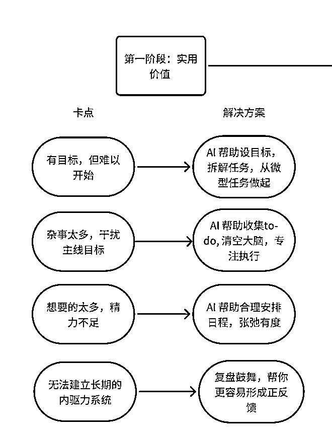

# AI开发初尝试 —— 一个月开发AI目标教练

> 来源：[https://kwi1nir3wz0.feishu.cn/docx/HQ0ldQK7soS5H3xzx79cezMdneh](https://kwi1nir3wz0.feishu.cn/docx/HQ0ldQK7soS5H3xzx79cezMdneh)

## 1.市场调研

因为个人兴趣，和已经积累的粉丝资源 (我和PuleiPai各有一个万粉的小红书账号分享个人成长类内容) 我们开始选中的赛道是productivity (生产力工具）。最简单的思路，就是针对别人已经验证过的付费需求，用ai再重新做一遍，提升用户体验。 我们首先分析了paywallscreen.com上的数据，这个网站通过收集和整合不同来源的付费墙的数据，可以对各个应用的变现提供了数据的参考。

我们发现，在生产力工具中，总体来说有两个大的方向：

1.  一个是单纯地帮助你提效，比如项目管理，习惯追踪等，这一类应用功能都简单直接，受众广但收入天花板有限。

1.  另一类是加入了“个人成长”的应用，更多的是提供情绪价值。这一类会更强调整体应用体验的设计，实施难度会更高，但是相应的收入上限也更大。

下面是我们总结的生产力工具的分类和变现情况， 因为我们人在美国，所以专注海外的应用商店数据。

| Category | Description | Examples |
| Task Management | 这一类app解决的痛点是帮用户记录下tasks, 设置提醒， 帮忙prioritize tasks. | Todoist - 月收入 $300k |
| Habit Tracker | 帮助用户better keep track of their habits | Habit tracker - 月收入$200k |
| Planner | 帮助users plan their day. Structured and tiimo功能基本一模一样 | Structured - daily planner - 月收入$200k |
| App Blocker & Focus | Block apps access to help you stay focused | Forest |
| Personal Growth | Provide coaching, journaling etc. To help you achieve self-growth | summit |
| 个人助理 | Personal assistant through message | https://www.reddit.com/r/ProductivityApps/comments/1har5c5/i_built_an_ai_secretary_and_now_i_cant_live/ message based |

经过讨论，我们决定做二：一个是我们对二更感兴趣，对自己感兴趣的东西更有动力坚持。一个是二对标的市场，相比于一，是门槛更高的非标品, 不像传统的效率工具都大差不差，我觉得潜在竞争会更小， 用户付费意愿会更强，我们也观察到这类产品确实的变现是效率工具的两到三倍。

## 2\. 细化产品定位

决定了做个人成长这个方向之后，我们进一步对市面上不同的应用和训练营产品进行分析，最终确定了我们想做AI目标教练 —— 我们会将《福格行为模型》《原子习惯》等理论转化为可复制的代码逻辑，用AI结合行为科学去助力正在为重要目标努力的人。之前Puleipai也曾经尝试了人工监督的目标训练营，取得了不错的效果。所以这个方向对我们来说还算顺理成章。

用户的挑战：

每个人都在为心中的目标努力，无论是备考留学、求职创业，还是养成运动习惯、自我提升。在追梦的路上，总会遇到各种阻碍，像“小怪兽”一样让人苦恼：

*   想做的事很多，却不知如何开始；

*   事情太多，精力难以为继；

*   计划总是完不成，陷入自我批评；

*   不知道如何建立长期的动力系统……

我们的解决方式：

随着大模型技术的发展，我们可以将脑科学融入产品，打造一个实时陪伴你成长的智能伙伴。它能够帮助你更轻松地实现目标，无需高昂的私人教练费用。让每一个对人生抱有美好期待的人，都能更容易实现目标！

## 3\. 流量分析

我们利用现在ChatGPT和Deepseek 的搜索功能进行了流量分析，以下是ai搜索结合不同的网站的数据生成的总结

这些个人成长和自我关怀应用程序采用多种策略来吸引和留住用户，包括：

*   应用商店优化（ASO）： 通过优化关键词、描述和视觉效果，提高应用在应用商店中的可见度。

*   内容营销： 发布与自我关怀和个人成长相关的有价值内容，以吸引潜在用户。

*   社交媒体互动： 利用社交媒体平台分享励志内容，与目标受众互动。

*   与红人合作： 与健康领域的红人者合作，扩大受众范围。

*   社区建设： 允许用户在应用内与朋友联系，培养社区感和共同进步感。

*   免费增值模式： 提供免费版本，并提供可选的高级功能，降低新用户的进入门槛。

## 4\. 产品开发

设定了“目标教练”这个产品方向之后，我们很快敲定了MVP想先解决实现目标的路上，最常见的三个卡点1\. 有目标，但难以开始 2\. 杂事太多，干扰主线目标 3\. 想要的太多，精力不足 4\. 无法建立长期的内驱力系统

针对这四大痛点，我们确定了四个核心功能，分别是 1) ai帮助设定目标，拆解任务，帮助用户从微任务开始做起 2）ai帮忙搜集代班事项, 大脑只用来思考和执行，不用来存储要做的事 3）AI根据用户想实现的目标和零碎的事项, 帮助用户安排每天的日程，专注主线任务 4）ai根据任务进度和用户一起进行复盘和鼓舞，帮助用户形成正反馈。

开发的工具主要是cursor + claude，cursor负责拉框架和写基础的代码，遇到cursor解决不了的问题会上claude。有意思的事，我发现cursor虽然也使用claude sonnet的模型，但代码质量并没有直接使用claude编程高。最终经过几周开发，我们完成了MVP，下面是我们应用的介绍视频(全英）https://www.bilibili.com/video/BV11MNbeZEAb/?vd_source=c8a00d44633cbe4ad221262a311d31b7

## 5\. 下一步的计划

*   尽快把应用开发到一个可以上线的程度

*   建立一个更好的后端

*   建立用户的登录界面和ai 教练选择和设置功能

*   设计onboarding的页面和流程，先开始在社交媒体上造势，计划先招募50位用户内测

*   得到第一批的反馈之后，改进第二版，增加更多的ai教练功能，开启产品付费。