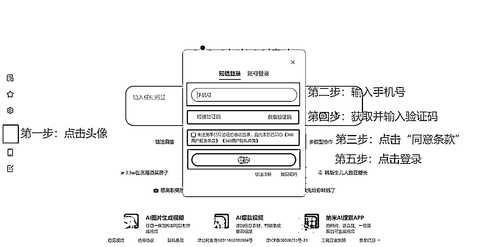
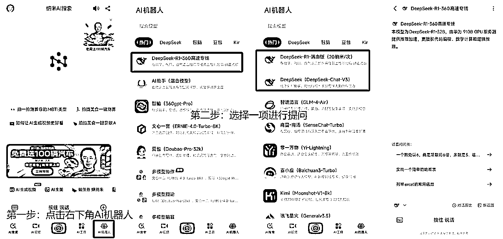

# 万字职场牛马必备DS写作指南（完全版）

> 来源：[https://txt6wm3b04b.feishu.cn/docx/Mmuad0w8JoIAoHxwKZacJw4cnlh](https://txt6wm3b04b.feishu.cn/docx/Mmuad0w8JoIAoHxwKZacJw4cnlh)

# 文档版权声明

创作人：越越|爆文海王

已申请版权，盗版必究！

* * *

# 本篇文章介绍

## 使用飞书

建议使用电脑版飞书进行阅读；

飞书软件的使用教程：快速上手文档

具体操作流程请参考下图：

具体操作步骤如下：复制文章的直达链接至浏览器地址栏

注意事项：第一次阅读需要登录，登录完成后！可在电脑版飞书历史栏中看见文章。


## 文章结构

*   新手常踩的坑：汇总我们经常会遇到的问题；

*   自检清单：检查整个流程的完整性和可行性；

*   操作过程：列举通用的操作过程；

*   可直接使用的模板：可直接复制使用的提示词+文章模板；

*   修改小技巧：强调一些使用的小技巧；

*   常见问题解答：整理可能遇见的问题；

*   课后练习任务：根据本节课所学的内容，进行练习；

## 阅读建议

*   本文章中按照板块分，大根据自己的实际需求进行选择阅读；

*   本文章中所提到的案例和提示词均为举例说明，并不是唯一；

*   本文章中的重点是向大家提供使用deepseek操作的思考逻辑；

### 综合建议

根据我目前的实际体验来看，性价比最高的还是”硅基流动“平台，仅供参考。

本文中所列出的平台目前是适合我们普通消费者使用的大平台，不作为高强度的生产力使用。

针对deepseek官网”服务器繁忙“的现象，我给大家几个建议：

1.  尽量在晚上10时——次日7时之间使用

1.  尽量不要把”深度思考R1“和”联网搜索“同时开启

1.  尽量不要在同个网络下，频繁使用同个账号进行提问

1.  尽量不要上传超过1w字的文档或者低分辨率图片

1.  不建议本地部署

## Deepseek下载注册

### 应用商店安装APP

#### 找到应用商店

在手机桌面找到「应用市场」图标。

#### 搜索应用

点击顶部搜索栏 → 用拼音输入「deepseek」→ 点击「搜索」键

#### 下载安装

认准图标（蓝色鲸鱼，开发者显示「深度求索」）→ 点击「安装」按钮

注意事项：

华为叫「应用市场」

小米叫「应用商店」

OPPO叫「软件商店」

苹果手机叫 「App Store」

#### 安装演示

本文中演示的机型为：小米（miui系统）、华为（鸿蒙系统）。

##### 小米（miui系统）安装

第一步：点击桌面“应用商店”

第二步：点击“软件搜索框”

第三步：选择“安装”或者“升级”

第四步：等待“安装完成”


##### 华为（鸿蒙系统）安装过程

第一步：点击桌面“应用市场”

第二步：点击“软件搜索框”

第三步：选择“安装”或者“升级”

第四步：等待“安装完成”


##### 苹果（ios系统）安装过程

第一步：点击桌面“App Store”

第二步：点击“软件搜索框”

第三步：选择“获取”

第四步：等待“安装完成”


### 官方网站安装APP

#### 打开官网

打开官方网站，官网地址：https://www.deepseek.com/


#### 下载 App

使用手机下载二维码


使用手机打开下载链接：https://download.deepseek.com/app/


使用电脑浏览器打开下载链接：https://download.deepseek.com/app/


#### 安装 App

结合1.1.1.4安装演示安装品牌安卓机和苹果手机中应用商店的APP，该部份重点演示APP安装包安装流程。

第一步：下载APK文件

点击“其他下载方式”，根据提示安装APK文件。

以小米（miui系统）为例安装：


在安装过程中会提示“未知风险”，则按照系统提示完成相关授权。

### APP 升级与卸载

#### APP 升级

在各大品牌手机的应用商店中均可以实现App升级，详情请见1.1.1应用商店安装步骤。


APP升级与APP安装区别就是：

升级：在原有安装的基础上更新功能，数据不会丢失，账号不需要重新登录。

安装：缓存数据会丢失，账号需要重新登录。

我们仍然可以通过APP自带的升级功能实现升级，通常APP在使用过程中会自动推送更新，但是也不排除自动更新的情况发生，因此我们需要手动进行更新。

我们可以在APP内部进行操作：


#### APP 卸载

在各大手机中均可通过长按应用图标实现卸载。

出现以下情况，可以尝试通过“卸载重装”解决问题：

*   APP在使用过程中异常卡顿，尝试重启设备仍然无法解决；

*   APP在使用过程中需要不断重新登录，可尝试重新安装APP；

*   APP在使用过程中，提示需要升级，商店升级失败，可以尝试1.1.2官方网站安装指南升级；

#### 注册登录平台

打开已安装完成的APP，进入首页。

### 网页端APP使用

#### 选择浏览器

推荐使用以下浏览器，方便后续安装使用平台功能，且适配大部分插件。

##### Google Chorm浏览器

正版官网地址：https://www.google.cn/chrome/?eqid=d5ed62f70000e77f0000000565326efa


##### Mic Edge浏览器

正版官网地址：https://www.microsoft.com/zh-cn/edge/download?form=MA13FJ


##### 火狐浏览器

正版官网地址：https://www.firefox.com.cn/


#### 打开官网页面

Deepseet官方网址：https://www.deepseek.com/

第一步：将上述网址复制进任一浏览器地址搜索栏中，并按回车键进行搜索。

第二步：第一时间保存书签至收藏夹中。

第三步：点击”开始对话“模块。


### 注册登录平台

在平台主页上点击”开始对话“模块后，开始进一步操作。

电脑端APP、手机端APP都可注册登录平台。

为简化流程，本文以电脑端APP注册登录进行演示。

#### 已登录过平台，可直接对话


#### 未登录过平台，请按照提示登录注册

##### 选择验证码登录

第一步：输入大陆手机号

第二步：勾选同意条款

第三步：点击发送验证码

第四步：输入验证码

第五步：点击”登录“按钮


##### 选择密码登录

使用密码登录的前提是已经完成账号注册，可以通过立即注册绑定密码。

第一步：输入大陆手机|邮箱

第二步：输入预先设置的”账号密码“

第三步：点击”同意条款“

第四步：点击”登录“按钮


#### 使用微信扫码登录

##### 使用微信扫码登录的优点

*   可以加快登录速度；

*   避免验证码发送频繁问题发生；

*   避免遗忘账号密码；

##### 微信扫码登录步骤

第一步：点击页面中的”使用微信扫码登录“按钮

第二步：根据提示扫码或者直接登录操作

*   扫码：电脑中未登录电脑版微信

*   快捷登录：电脑中已登录电脑版微信

第三步：按照提示绑定手机号（手机号可以是已注册，也可以是未注册）


### 安装注册过程常见问题

#### 应用下载阶段

##### 应用商店搜不到Deepseek

*   表现：输入「Deepseek」显示「无结果」或关联产品

*   解决方案：

安卓用户：

打开浏览器 → 输入https://download.deepseek.com/app/→ 点击「其他下载方式」

下载完毕后，将安装包发送至安卓手机中，详情可见1.1.2官方网站安装APP


iOS用户：

打开手机浏览器 → 输入或点击本链接 ‎DeepSeek - AI 智能助手→ 点击「获取」


##### 下载被拦截提示「风险应用」

*   表现：通过第三方安装包安装时提示”风险应用“

*   解决方案：

安卓处理步骤：

```
第一步：点击「仍要下载」  
第二步：前往设置 → 搜索「特殊权限」 → 开启「安装未知应用」权限  

主流手机厂商设置路径：
华为：设置 → 安全 → 更多安全设置 → 外部来源应用下载  
小米：设置 → 密码与安全 → 系统安全 → 特殊权限设置  
OPPO：设置 → 密码与安全 → 系统安全 → 外部来源应用  
```

iOS处理方案：

```
 设置 → 通用 → VPN与设备管理 → 点击「Shen Du Qiu Suo」→ 选择「信任」  
```

#### 安装阶段

##### 安装进度条卡住不动

*   解决方案：

清理手机存储空间（至少预留500MB）：打开手机管家 → 点击「清理加速」→ 勾选缓存文件

关闭后台运行程序：

安卓：双击多任务键 → 上滑清除所有应用

iOS：上滑悬停进入多任务 → 关闭非必要应用

##### 安装成功后闪退

*   解决方案：

重启手机（长按电源键10秒）

检查系统版本：

安卓需≥8.0 → 设置 → 关于手机 → 软件版本

iOS需≥14.0 → 设置 → 通用 → 关于本机

卸载后重新安装（删除旧安装包重新下载）

#### 注册阶段

##### 收不到短信验证码

*   解决方案：

| 可能原因 | 对应操作 |
| 短信被拦截 | 打开短信APP → 点击「骚扰拦截」→ 恢复信息 |
| 手机号错误 | 检查区号是否为+86 → 重新输入完整11位号码 |

提示「该手机号已注册」

*   解决方案：

尝试「手机号+密码」登录 → 点击「忘记密码」重置

联系客服：APP内点击「联系我们」→点击「联系支持人员」


## Deepseek功能使用

在正式讲解Deepseek在公众号运营上的应用前，我把Deepseek几个常见的功能与大家详细介绍，这些功能将会在很大程度上帮助大家提高创作效率。

### Deepseek对话功能

Deepseek作为一款国产的Ai对话平台，主要任务依然是语言生成功能。

我们使用Deepseek平台也是主要利用其语言功能。

#### Deepseek网页版对话功能

##### 功能区分布

新建对话功能区：点击”开启新对话“，即新建对话。

历史对话框：在此区域可以看见”历史对话“的内容，对话标题即是第一句对话内容。

对话输入框：在此区域可以输入”对话内容“，与Ai进行对话沟通。

功能选择区：有”深度思考“”联网搜索“两大功能可供选择。

上传附件区：可在此功能下选择上传附件。

内容发送键：输入完毕后，可直接点击发送内容。


##### 功能区介绍

###### 对话功能区

点击”开启新对话“，即新建对话。


###### 历史对话框

在此区域可以看见”历史对话“的内容，对话标题即是第一句对话内容。

继续对话：点击历史对话，可以继续和Ai对话。


有序分类：对话中的”第一句“即是标题，可以通过重命名标题进行修改标题。


###### 对话输入框

在此区域可以输入”对话内容“，与Ai进行对话沟通。

在DeepSeek的对话输入框中，您可以输入多种形式的内容与AI进行交互。以下是常见的支持形式：

###### 自然语言文本

*   描述问题：用日常语言提问或描述需求。

*   多语言支持：支持中文、英文等多种语言混合输入。

*   结构化指令：通过明确指令控制输出格式，如：

*   举例：用分点列表总结《红楼梦》的主题。


###### 代码相关输入

*   代码片段：直接粘贴代码请求调试或解释，建议用Markdown标注语言：

*   报错信息：粘贴错误日志请求解决方案。

*   算法问题：描述编程题目或逻辑需求

例如：帮我看看这段代码的问题出在哪里？

```
```python
def test():
    print(Hello World)

```


###### 数学学术内容

*   公式输入：支持LaTeX或自然语言描述数学问题：

*   学术概念：询问理论、论文思路或数据分析方法。

例如：求解方程：x^2 + 2x - 3 = 0


###### 插入附加数据

*   文本文件内容：可粘贴CSV/JSON等数据请求处理（需在输入框内）。

*   上传文件：可通过附件上传文档、图片等。

例如：我想Ai帮助我分析某个PDF里的内容，我即可上传该文件，并对Ai提出要求。

假设我需要使用Ai帮助我分析《蛇年春晚爆点分析》里的内容：

第一步：我先选择相关文件进行上传。

第二步：我在输入框中输入我的需求。

第三步：与Ai进行进一步对话，以获得自己满意的答案。


###### 创意生成任务

*   内容创作：请求生成故事、诗歌、营销文案等。

*   头脑风暴：输入关键词获取灵感。

例如：帮我生成赞美蛇年春晚中”非遗全息剧场《千年一瞬》“文章的爆款标题。


###### 联系全文对话

*   延续对话：在连续对话中引用之前的回答。

例如：请结合之前的对话，我需要你帮我罗列出Deepseek功能使用指导。


##### 特别注意事项

*   输入限制：避免违法、暴力或敏感内容，部分版本可能有输入长度限制。

*   格式优化：使用清晰的分段、标点或Markdown提高AI理解准确度。

*   文件支持：若无明确上传按钮，建议以文本形式粘贴文件内容。

#### Deepseek手机版APP对话功能

##### 新建对话功能区

手机端APP中的新建对话功能有两种方法可以直接实现。

*   方法一：直接进入首页进行对话

*   方法二：点击主页右上角“+号”

*   方法三：点击“开启新对话”


##### 核心功能区分布

手机版Deepseek App中的功能布局基本一致。

APP主页中拥有以下功能区：拓展功能区、输入框、高级功能、历史对话区


##### 核心功能区介绍

拓展功能区位于输入框右下角，我们可以点击”+“号进入功能区。

功能区中有：拍照识文字、图片识文字、文件。

###### 拍照识文字

拍照识文字功能可以实现通过手机拍摄文本，获取文本相关内容并解析处理。

*   第一步：选择“拍照识文字”功能。

*   第二步：如果第一次使用，需要授权。

*   第三步：拍摄相关图片。

*   第四步：在输入框中输入自身实际需求。


###### 图片识文字

图片识文字与拍照识文字的区别在于前者可以直接使用相册中的图片进行加载。

*   第一步：提前拍摄需要识别的素材（比如截取PDF片段、文章片段等）。

*   第二步：上传需要识别的图片素材。

*   第三步：在输入框中输入自身的实际需求（我们想要Ai帮助做什么事？）。

*   第四步：根据对话，进行调整输入。


###### 上传指定文件

在手机端APP中也支持上传手机中的文件。

文件类型通常支持：PDF、word、音频等。


###### 历史对话框

在此区域可以看见”历史对话“的内容，对话标题即是第一句对话内容。

历史对话区可点击主页左上角“+”号进入，在历史对话区可以实现以下功能：

*   进入历史对话，继续与Ai对话

*   长按历史对话，修改对话标题或者删除对话

*   单击历史对话框的标题可以直接跳转首句提问位置


### Deepseek的同步功能

Deepseek的手机APP端的内容与网页端的内容是同步更新。

因此我们可以随时随地使用两个终端同时工作。


### Deepseek深度功能

Deepseek平台中提供：深度思考R1+联网搜索功能，适用于不同场景。

我们在运营公众号时可能经常面临以下痛点：选题枯竭、热点追不上、专业内容写不透、用户互动没话题。Deepseek的深度功能就能够很好帮助我们解决以上问题。

### 联网搜索实战

当「酱香拿铁」凌晨刷屏时：

*   第一步：输入"瑞幸茅台联名最新数据"

*   第二步：联网搜索实时抓取：3小时销量破百万/微博话题阅读量破3亿/朋友圈打卡文案合集

*   第三步：自动生成《从爆款联名看品牌出圈的3个隐藏公式》框架

*   第四步：插入网友神评论截图，早8点准时推送热点解读

### 深度思考R1应用

写科技类账号时：

*   第一步：输入"半导体产业链国产替代现状"

*   第二步：R1生成5000字深度报告后，追加指令："用奶茶店供应链比喻半导体产业"

*   第三步：获得类比框架：晶圆厂=中央厨房、光刻胶=配方秘方、封装测试=外卖包装

*   第四步：产出《开家奶茶店，看懂中国芯片突围战》爆款推文

### 双功能组合

面对留言区提问"618家电怎么选"：

*   第一步：联网搜索最新京东/天猫家电销售榜单

*   第二步：同步输入"2023智能家电选购避坑指南"

*   第三步：R1生成对比表格：冰箱制冷技术对比/净水器滤芯成本计算

*   第四步：整理成《粉丝逼我做的618闭眼入清单》互动干货

### 冷门选题破冰技巧

运营传统文化账号时：

*   第一步：输入"年轻人对汉服认知调研"

*   第二步：联网抓取小红书最新汉服话题TOP20

*   第三步：R1交叉分析生成：《Z世代汉服消费的5个反常识》

*   第四步：植入敦煌文创周边开箱视频脚本框架

### 小白操作备忘录

*   热点追踪：每日早中晚三次输入"今日微信/抖音/微博热搜"

*   爆款改造：看到10w+文章时，输入"请用[职场干货]风格重构这篇文章"

*   用户画像：粘贴10条典型留言，指令"分析核心需求并推荐3个选题方向"

*   规避风险：重要数据后自动追加"请标注信息来源并去敏感词"

## Deepseek平台多渠道使用

目前Deepseek官网频繁出现”服务器繁忙状态“，极其影响我们使用体验感。

除了官网正式版本以外，我还替大家整理了一些常见、好用、性价比高的渠道，供大家选择性使用。

### 秘塔Ai（Deepseek R1模型）

电脑官网地址：https://metaso.cn/?s=bdpc

手机端版本请搜索”秘塔Ai搜索“，详情请见手机端安装指南


注意事项：

1.  秘塔Ai虽然免费使用，但是响应速度过慢，本人建议请耐心等待生成结果！

1.  秘塔Ai与官网完全版本相比较，依然是阉割版本，效果不如官网or手机版！

1.  秘塔Ai适合搜索”学术“相关的知识库内容，不能满足”口语化“表达的需求！

### 纳米Ai（Deepseek R1模型）

电脑官网地址：https://www.n.cn/?fromsou=1

手机端版本请搜索”纳米Ai“，详情请见手机端安装指南




电脑端中纳米Ai deepseek R1模型是在”慢思考“模式中。

在手机端中的纳米Ai中我们可从界面发现deepseek R1有特别专线。



注意事项：

1.  纳米Ai虽然免费使用，但是需要不断拉新参与活动。

1.  秘塔Ai与官网完全版本相比较，依然是阉割版本。

### 硅基流动（Deepseek R1模型）

官网地址：硅基流动统一登录


注意事项：

硅基流动是一个付费平台，请按需使用！

可在硅基流动中使用多种模型，例如文生图、图生文模型。

可在硅基流动中申请deepseek R1的Api接口，速度会快。

可在硅基流动中直接使用deepseek R1功能，但是效果不如官网。

### 超算计算机（R1 / V3 / Coder）

官方网址：https://chat.scnet.cn/#/home

# Deepseek公文写作

*   该部分的内容：主要解决大家在实际工作中的写作难题；

*   该部分的内容：满足演讲稿、新闻稿、合同协议、通知通告、述职报告、会议纪要、规章制度等7项写作需求；

## Deepseek辅助公文写作

### 制作演讲稿

#### 新手常踩的坑

*   问题1：写出来的稿子像念说明书

👉 告诉deepseek（错误指令）：

```
写一篇关于环保的演讲稿
```

错误原因：指令中缺乏关键信息

👉 告诉deepseek（改进指令）：

```
写一篇初中生环保主题的3分钟演讲，开头用塑料袋漂流的故事，结尾让同学举手承诺
```

*   问题2：内容太笼统没重点

👉 告诉deepseek（错误指令）：

```
帮我写竞聘班长的演讲稿
```

错误原因：指令中缺乏关键信息

👉 告诉deepseek（改进指令）：

```
写竞聘班长的3点计划：① 设立'烦恼信箱' ② 每月组织趣味运动会 ③ 班费透明化，要带表情符号和同学互动台词
```

从以上的两个例子中，我们可以发现：

*   两个例子中的提问都缺少“成果要求”；

*   两个例子中的提问都缺少“问题背景”；

因此，在设计演讲稿的时候应该仔细检查以下《自检清单》。

#### 自检清单

✅ 检查开头有没有吸引人的故事/问题

✅ 每段内容能不能用1句话总结

✅ 结尾有没有让听众行动的号召（如鼓掌/举手/反思）

#### 三步写出好稿子

从deepseek中得知，我们写好一篇符合条件的《演讲稿》至少需要三步。

##### 第一步：输入稿子细节

👉 告诉deepseek（输入问题细节）：

```
我要在['场合']给['谁']讲['主题']，
重点是['XX']，
不要提到['XX']，
希望听起来['有趣/专业/感人']...
```

注意事项：'绿色字体'代表可以自由发挥，进行填充。

👉 举个例子，告诉deepseek你的问题细节：

```
我要在'同学婚礼'上作为'闺蜜''发言'，
重点是'回忆校园趣事'，
不要提'前任'，
希望'搞笑又温馨'，
时间不超过'3分钟'
```

##### 第二步：让内容更生动

为了让《演讲稿》更具备号召力，我们应该在稿中进行优化，具体可以这么做：

👉 告诉deepseek（润色演讲稿）：

```
为了让我的演讲稿更吸引人，你可以添加以下要素：
加个比喻：把道理比成日常东西（如"坚持就像外卖配送，总会迟到但不会不到"）  
插入对话：假装和听众聊天（如"有同学问：这和我们有什么关系？我想说..."）  
来点反差：先严肃后搞笑（如"专家说每天要睡8小时——但看看在座各位的黑眼圈！"）
```

注意事项：在添加过程中，你需要考虑《演讲稿》的使用场合。过于正式严肃的场合不适合太翘皮、过于宽松的场合不适合太正式。因此，你可以在上条提问输出完毕后，继续在对话中进行调整。

👉 告诉deepseek（确认风格）：

```
 这篇《演讲稿》的'使用场合'，请你确认最终风格。
```

##### 第三步：大家能听得懂

我们在此之前已经确定这篇《演讲稿》是在什么场合演讲？哪些人是听众？

因此，我们要进行语言风格润色调整。

👉 告诉deepseek（润色语言）：

```
方案一：把'因此我们可以得出结论'改成口头语
方案二：每段开头加个'记得那一年或你们有没有'
方案三：删掉听不懂的词语，换成'初中生能明白的话'
```

以上所提到的方案仅供大家参考，如果不符合大家需求，大家可以直接向deepseek提问。

👉 告诉deepseek（征求意见）：

```
你觉得我这篇《演讲稿》的初稿在'语言风格'上是否满足我的要求？有哪些建议？
```

#### 直接使用模板

鉴于《演讲稿》在不同场合均有涉及，那么我给大家整理了几大常见领域的“演讲稿”使用模板。

大家可以直接将'绿色字体'的内容进行填充更换即可。

##### 学生班级演讲（简单版）

👉 告诉deepseek（模板1）：

```
背景:'帮我写个2分钟班会发言稿'
主题:'手机使用'

要求：  
开头：'上周我熬夜刷视频的真实故事'  
中间：'对比合理用手机和沉迷的区别' 
结尾：'带全班做锁屏手势一起承诺'  
```

##### 工作会议发言（进阶版）

👉 告诉deepseek（模板2）：

```
背景：'写部门季度总结的发言大纲'  
主题：'用过山车比喻业绩变化'

要求：  
夸赞：'夸三个同事的具体案例（用小王/老张/莉莉代称）'  
任务：'最后布置任务用闯关游戏比喻'  
风格：'要正式但不死板，带点幽默'
```

##### 家长会讲话（走心版）

👉 告诉deepseek（模板3）：

```
背景：'家长会发言稿'  

要求：
开头感谢家长时，结合他们'职业举例（医生家长/快递员家长）'  
用'小明的转变'故事说明家校配合的重要性  
结尾朗读孩子'写给家长的信片段'  
要感动但不煽情，控制'5分钟内'  
```

#### 常见问题解答

##### 文章长度过长怎么办？

👉 告诉deepseek（优化文章长度）：

```
方案一：文章过长，请删掉重复的内容，每段留最关键的'*句话'。请简化内容，简明扼要，通俗易懂。
方案二：这篇稿子念慢点要'*'分钟，帮我删到'***'字左右
```

##### 回答没感情怎么办？

👉 告诉deepseek（情感回复）：

```
方案一：在原来的基础上，添加一些“语气用词、语气用语”，让文章更有感情。

方案二：在原文的基础上，让文章更加有“情绪感”，你可以参考以下语言风格：
'在讲失败经历时加点自嘲：当时觉得自己像不会游泳的救生员'。
```

##### 你在台上怕忘词怎么办?

👉 告诉deepseek（手卡制作）：

```
把这篇稿子改成手卡小纸条格式，每张纸条写'1个关键词+表情符号提醒',大致的'演讲时间'。
```

##### 突然要改内容怎么办？

👉 告诉deepseek（修改内容）：

```
原稿第'*'段讲'某某内容'，现在要改成'新的某某内容'，其他部分不变，请重新生成这一段。
```

##### 怎么让AI模仿我的说话风格？

👉 告诉deepseek（模仿语气）：

```
  方案一：请用这个语气改写演讲稿：'...（粘贴你的演讲稿示例）...'
  方案二：这是我平时的文章和聊天记录，请学习风格。输入内容：'文本内容'
```

### 制作新闻稿

#### 新手常踩的坑

*   问题1：像写作文一样啰嗦

👉 告诉deepseek（错误指令）：

```
在这个阳光明媚的春天，我们公司怀着无比激动的心情宣布..
```

错误原因：指令中缺乏关键信息

👉 告诉deepseek（改进指令）：

```
使用倒金字塔结构，把最重要信息放开头：【XX公司今日发布首款AI翻译耳机，准确率达98%】
```

*   问题2：自卖自夸惹人烦

👉 告诉deepseek（错误指令）：

```
我们的产品是市场上最好的，远超竞争对手...
```

错误原因：指令中缺乏关键信息

👉 告诉deepseek（改进指令）：

```
换成第三方证言『实测比同价位产品翻译速度快2倍』——科技媒体评测
```

#### 自检清单

✅ 5W1H是否齐全？

*   Who：主角是谁？

*   What：做了什么事？

*   When：什么时间？

*   Where：发生在哪里？

*   Why：发生的原因是什么？

*   How：怎样了？

✅ 有没有直接引语（"..."负责人表示）

✅ 联系电话/官网是否在结尾

#### 三步写出合格新闻稿

从deepseek中得知，我们写好一篇符合条件的《新闻稿》至少需要三步。

##### 第一步：填写新闻信息表

👉 告诉deepseek（输入问题细节）：

```
[Who]：'市环保局 + 阳光小学师生'  
[What]：'开展"变废为宝"手作大赛，收集300kg废旧物品'  
[When]：'6月5日世界环境日 9:00-11:30'  
[Where]：'市青少年活动中心展厅'  
[Why]：'响应环保号召 + 培养儿童环保意识'  
[How]：'展出150件创意作品，获奖作品将在全市巡展'  
请结合上述内容，分别生成3种风格“严肃版 / 故事版 / 数据版”
```

注意事项：'绿色字体'代表可以自由发挥，进行填充。

如果deepseek生成的内容过于“浅显”，我们可以理解为“找不到深层次的原因”，我们应该：

👉 告诉deepseek（探索新闻事件背后的深层次原因）：

```
为什么这个事情会发生？为什么这个时间/地点特别重要？
```

好的新闻稿中“深层次原因”往往是一阵见血，足够体现出一篇文章的好坏。

##### 第二步：套用新闻稿模板

本《新闻稿》制作教程适合在大家工作中应用，比如编辑产品评测、编辑热点文章等。

大家可以直接将'绿色字体'的内容进行填充更换即可。

产品发布型

👉 告诉deepseek（模板1）：

```
标题：'XX'产品上市！解决'XX痛点'  
第一段：产品'基本信息+最大亮点'  
第二段：用户'证言'/'实验数据 ' 
第三段：'购买渠道+优惠信息'  
结尾：'公司简介+联系方式'
```

活动宣传型

👉 告诉deepseek（模板2）：

```
标题：'XX活动''本周六'开启！免费参与  
第一段：'时间地点+活动意义'  
第二段：'特色环节（嘉宾/奖品/互动）'  
第三段：'报名方式（附二维码）'  
结尾：'主办方介绍'
```

企业公告型

👉 告诉deepseek（模板3）：

```
标题：'XX公司宣布重大战略调整'  
第一段：'决策内容+实施时间'  
第二段：'背景说明（市场变化/用户需求）'  
第三段：'负责人解读（直接引语）'  
结尾：'企业信息'
```

选择好具体的应用场景后，你可以结合填写新闻信息表的内容进行组合。

👉 告诉deepseek（提示词组合）：

```
第一步：先投喂
[Who]：'市环保局 + 阳光小学师生'  
[What]：'开展"变废为宝"手作大赛，收集300kg废旧物品'  
[When]：'6月5日世界环境日 9:00-11:30'  
[Where]：'市青少年活动中心展厅'  
[Why]：'响应环保号召 + 培养儿童环保意识'  
[How]：'展出150件创意作品，获奖作品将在全市巡展'  
请结合上述内容，分别生成3种风格“严肃版 / 故事版 / 数据版”

第二步：按照应用场景生成《新闻稿》
（如果选择产品发布型）
标题：'XX'产品上市！解决'XX痛点'  
第一段：产品'基本信息+最大亮点'  
第二段：用户'证言'/'实验数据 ' 
第三段：'购买渠道+优惠信息'  
结尾：'公司简介+联系方式'

第三步：继续往下阅读调教
```

##### 第三步：增加文章可读性

Deepseek生成《新闻稿》初稿后，我们可以根据实际生成的文章内容进行调整。

调整的具体操作，请继续往下阅读：

👉 告诉deepseek（细节微调）：

```
方案一：插入"据XX报告显示..."（加权威）
方案二：添加用户故事"宝妈李女士说..." （加温度）
方案三：埋入热搜关键词"#职场神器#智能办公"（加传播）
更多方案，可以结合自己的实际需求大胆提问即可！
```

##### 特别注意：具体玩法

这部分章节的内容主要向大家提供一些案例参考学习，也可以作为练习案例。

*   通过现有的新闻稿提取“5H1W”信息

*   通过现有的”5H1W“信息生成新闻稿

提取5H1W信息

👉 告诉deepseek（提取5H1W信息）：

```
请提取'新品上市（数码产品）的新闻稿件内容'中的以下要素：
Who：主角是谁？
What：做了什么事？
When：什么时间？
Where：发生在哪里？
Why：发生的原因是什么？
How：怎样了？
生成简要内容。
```

Deepseek生成以下内容：

```
标题：【299元起！小米智能翻译笔明日开售】  
导语：小米生态链新品"速译通"翻译笔将于6月18日10点正式发售，支持50种语言离线翻译...  
亮点呈现：  
• 实测翻译速度比上代快40%  
• 独创"会议模式"自动生成纪要  
用户证言：  
"出国开会全靠它，就像带了个隐形翻译"——用户王先生  
购买渠道：小米商城/天猫旗舰店  
```

根据提取出来的信息，重新生成新闻稿。

具体操作详见3.1.2.3制作新闻稿

#### 案例类型库

##### 公益活动（宠物领养）

```
标题：【周末来撸猫！流浪动物爱心领养日】  
核心信息：  
• 时间：5月20日10:00-16:00  
• 地点：XX市动物保护中心  
• 福利：免费疫苗+领养礼包  
故事亮点：  
"被救助的橘猫'平安'现在成了中心招牌接待员"  
报名方式：扫码预约（附公众号二维码）  
```

##### 企业获奖（科技公司）

```
标题：【XX科技入选"中国AI企业50强"】  
关键内容：  
• 获奖时间：2024年5月  
• 入选理由：智慧医疗系统落地300+医院  
数据支撑：  
帮助医生诊断效率提升60%（附医院合作名单）  
负责人发言：  
"这是对'技术向善'理念的最好肯定"——CEO张华  
```

#### 常见问题解答

##### 文章太长怎么办？

👉 告诉deepseek（简化文章）：

```
 方案一：把每段缩成2句话，保留数字和引语。
 方案二：删掉形容词，只留事实性内容
```

##### 文章太枯燥怎么办？

👉 告诉deepseek（情绪化表达）：

```
方案一：在第三段插入1个用户使用场景描述。
方案二：把产品参数改成对比图：旧款VS新款
主要宗旨是增加文章素材的丰富度、多样化。
```

##### 想上热搜怎么办

👉 告诉deepseek（使用网络热梗）：

```
方案一：加网络梗,标题带上'当代打工人必备神器'。
方案二：结尾加话题互动：'@三位好友分享你的需求'。
具体的网络热梗，你可以直接要求deepseek在文中插入“最新的网络热梗”，开启联网搜索。
```

### 拟定合同协议

#### 新手常踩的坑

*   问题1：漏掉"说话不算数"条款

👉 告诉deepseek（错误指令）：

```
签了装修合同没写逾期每天赔100元，结果工人拖延
```

错误原因：遗漏相关条款

👉 告诉deepseek（改进指令）：

```
乙方逾期完工，每延迟一日支付合同总额0.5%作为违约金
```

*   问题2：漏掉"耍赖不认账"条款

👉 告诉deepseek（错误指令）：

```
合作开发APP没写"成果归属"，最后抢版权  
```

错误原因：指令中缺乏关键信息

👉 告诉deepseek（改进指令）：

```
本协议项下所有知识产权归甲方所有，乙方享有署名权
```

#### 自检清单

✅ 双方身份信息完整（姓名/身份证号/住址）

✅ 金额同时用大小写（如¥1000元整+壹仟元整）

✅ 违约情形写具体（不能只写"违约方担责"）

#### 三步写出安全合同

合同/协议中的条款对我们而言特别重要，千万不可以忽视。

##### 第一步：填空基础信息模板

👉 告诉deepseek（输入双方信息）：

```
你是一位资深的律师，请结合以下信息，帮我生成一份合同/协议初稿：
合同名称：'____'协议  
甲方（需方）：姓名'____'身份证号'________'  
乙方（供方）：姓名'____' 身份证号'________'  
合作内容：'____'  
履行时间：'____'年'__月__日至____年__月__日'  
支付方式：'____'（定金/分期/验收后付）  
交付标准：'____'（附验收清单）  
违约责任：逾期每日罚'___% / 质量问题赔___倍'  
争议解决：协商不成向'___法院起诉'  
签字页：'双方手写签名+按手印+签日期'  
```

注意事项：'绿色字体'代表可以自由发挥，进行填充。

等待deepseek完成答复后，请检查条款的完整性、可靠性。

👉 告诉deepseek（检查合同/协议中条款）：

```
请仔细检查刚才生成的合同/协议中条款设置的合理性。
```

特别强调：此项功能支持检查已有的合同/协议的专业性。具体操作如下：

将合同/协议文本拍照，上传deepseek附件，解析完成后：

👉 告诉deepseek（检查合同/协议中条款）：

```
请提取这份合同/协议中的信息，从'甲方/乙方'的角度仔细检查完整性/合理性，并提出修改建议。
```

##### 第二步：根据类型加条款

经过上一步提问操作，我们基本上可以了解当前这份合同协议的基本情况。

在deep seek的建议下，我们可以适当选择相应建议进行调整。

我给你提供一些生活中常见的合同条款：

###### 租房合同

⚠️告诉deepseek加这些：

```
房屋损坏赔偿标准（如墙面污损赔200元/㎡）  
转租限制条款  
物业费/水电费缴纳方式  
```

###### 服务合同

⚠️告诉deepseek加这些：

```
服务不满意时的重做次数  
工作成果交付形式（如PPT要源文件）  
保密条款（违者赔3倍服务费）  
```

###### 买卖协议

⚠️告诉deepseek加这些：

```
货物验收标准（如签收后24小时内提出异议）  
运输风险承担方（如物流损坏由卖方负责）  
保修期及范围  
```

注意事项：如果不知道要加哪些条款，那么我建议你继续提问deepseek。

👉 告诉deepseek（检查合同/协议中条款）：

```
我这份是'合同类型'，请帮我检查是否还遗漏哪些关键条款？
```

##### 第三步：合同协议专业化

合同/协议术语正式文本，所以是很严谨，那么我们就需要把文字内容的表达专业化。

👉 告诉deepseek（合同/协议专业化）：

```
仔细检查合同文本，请依据法律专业术语，进行检查、修改。
```

#### 常用合同模板

结合日常生活工作的需要，我整理几个常见的协议模板。

##### 个人租房协议（精简版）

```
甲方（房东）：'王某某 身份证号XXXXXXXX'  
乙方（租客）：'李某某 身份证号XXXXXXXX'  

一、房屋地址：'XX市XX区XX小区1栋202室 ' 
二、租期：'2024年6月1日至2025年5月31日'  
三、租金：'每月2500元（贰仟伍佰元整），押一付三'  
四、特别约定：  
• '乙方不得养宠物，违者扣全部押金  
• 厨房墙面油污需专业清洁（费用从押金扣除）  
• 提前退租需赔偿2个月租金'  
```

##### 自媒体代运营合同

```
服务内容：'乙方为甲方运营抖音账号（@美食探店）'  
考核标准：  
• '月更12条视频，点赞<500的需重制  
• 3个月内粉丝达5万，未达标退还50%服务费 ' 
付款方式：  
• '签约付30%定金（¥6000）  
• 每月15日付¥5000'  
保密条款：乙方不得透露甲方店铺地址及供应链信息  
```

#### 常见问题解答

##### 合作方要求临时加内容怎么办？

👉 告诉deepseek(添加内容)：

```
在原合同第'*'条后新增：'乙方需额外提供每周运营数据报表，格式见附件3'
```

##### 条款有歧义怎么办?

👉 告诉deepseek（检查歧义）：

```
'1'条条款存在歧义，请仔细检查，并按照我的'看法'进行调整
```

##### 想补充细节怎么办？

👉 告诉deepseek（补充细节）：

```
我需要在'*'条款处，补充'**细节'
例如：
"详见附件1：设备清单"
"按附件2验收标准执行"
```

### 拟定述职报告

#### 新手常踩的坑

*   问题1：流水账式汇报

👉 告诉deepseek（错误指令）：

```
1月完成A项目，2月参与B培训，3月协助C活动...
```

错误原因：缺少相关细节

👉 告诉deepseek（改进指令）：

```
按"能力成长维度"重组内容（如沟通能力/专业技能/管理能力）
```

*   问题2：避谈失败经历

👉 告诉deepseek（错误指令）：

```
虽然有些不足，但总体进展顺利
```

错误原因：未列出具体事项和结果。

👉 告诉deepseek（改进指令）：

```
Q3客户投诉率上升15%，经分析发现服务SOP未及时更新，已牵头完成3版流程优化
```

#### 自检清单

✅每项成果都有数据支撑

✅问题分析不超总篇幅20%

✅使用动词强化主动性（主导/推动/重构）

✅删除6个以上形容词（重大/显著）

✅至少2个跨部门协作案例

✅未来计划与公司战略挂钩

#### 六步让领导满意

##### 第一步：定位领导需求

参与考核的领导有直属上司、HR考核 、高层领导。

因此述职报告中的内容需要体现出多元化、跨部门合作等特点。

要想获得领导的青睐，我们需要关注领导在这份述职报告中最想看到哪些内容？

我给大家罗列了一个合格的述职报告中需要包含的要素：

✅业绩贡献(30%) → 量化指标达成率

✅能力提升(25%) → 新增技能/证书

✅问题解决(20%) → 攻克的关键难题

✅团队协作(15%) → 跨部门支持案例

✅创新突破(10%) → 流程/方法改进

由此可知，在deepseek眼中”年度工作指标“更重要，而对于工作流程/方法的改进却显得不那么重要。

业绩贡献>能力提升>问题解决>团队协作>创新突破

##### 第二步：搭建基本框架

👉告诉deepseek（工作基本信息）：

```
请根据我提供的职业信息，请帮我生成一份述职报告初稿：
核心价值定位: 
"作为____角色，本年度聚焦____三大重点"  
关键成果举证  
"实现____目标，较去年提升____%，超出预期____%"  
能力进化路线  
"从____到____的能力转型，具体表现为____"  
战略级反思  
"如果重新开始，我会在____阶段采取____策略"  
未来价值蓝图  
"下一阶段将把____经验复制到____领域，预计带来____改变"
```

Deepseek会根据我们所提供的基本职业信息生成一份《述职报告》初稿。

注意事项：在这一步中，我们可以在'绿色字体内容'中填入我们认为重要的信息，不需要特别修饰，按照自己所整理的内容进行填写即可。

##### 第三步：填充事实素材

一份完整的《述职报告》需要使用真实的数据进行填充，那么我们就需要把我们自己整理的数据投喂给deepseek，辅助我们完成一篇合格、优质的《述职报告》。

👉请按照以下表格。填写真实业绩数据：

| 数据类型 | 适用场景 | 案例 |
| 同比增幅（与自己以往业绩对比） | 体现成长性 | 客户续约率同比提升32% |
| 横向对比（与同事之间进行对比） | 展示竞争力 | 团队业绩排名从第7升至第3 |
| 成本效益（降本增效的效果） | 证明决策能力 | 通过流程优化节省46人/月工时 |
| 长尾效应（给单位带来的长期效应） | 强调战略价值 | 培养的3名新人已成为储备干部 |

注意事项：在填写相关数据的时候，一定要对数据进行清洗、筛选、转换，一定要使用真实可靠的数据源。

完成以上工作后，接下来就让deepseek辅助我们生成更为详细的《述职报告》。

👉告诉deepseek（详细的数据）：

```
请结合以下数据，帮我形成方便领导理解，又能凸显我的工作能力的《述职报告》详细稿件。
数据：'上文中绿色字体内容'
```

等待deepseek答复后，我们便得到一份具备数据支撑的《述职报告》详细版。

接下来我们需要继续使用deepseek对稿件进行调整优化。

##### 第四步：优化表达方式

一般而言，《述职报告》需要使用正式的语言进行表达。

接下来，我们就需要把《述职报告》进行语言上的优化表达：

👉告诉deepseek（优化语言表达）：

```
请按照以下要求帮我润色优化语言：
'语言需要正式'
'专业名词需要表达正确'
'不要出现明显的语病'
'不要出现错别字'
'要有吸引力'
'字数在2000字左右'
请输出完整的《述职报告》
```

在同一个对话中，输入以上提示词。

##### 第五步：文章高阶润色

👉你可以告诉deepseek（高阶润色）：

```
请将报告中提到的数据进行数据可视化分析，例如：
对比设计："市场份额增长（12%→18%）" 改为 "市场份额增幅超行业平均3倍"
价值换算："节约成本25万" 改为 "相当于创造2.5个新人全年编制价值"
请你按照要求帮我修改报告。
```

如果输出的结果中出现以下情况，那么我们可以按照以下思路手动进行修改：

❌ "差不多/大概" → ✅ "精确到92.6%"

❌ "我自己" → ✅ "在团队支持下"

❌ "没办法" → ✅ "探索出替代方案"

也可以继续提问deepseek进行修改：

👉告诉deepseek（优化语言表达）：

```
请帮我检查稿子中是否存在以下情况，或者类似的情况，如果存在请参照示例修改。
❌ "差不多/大概" → ✅ "精确到92.6%"  
❌ "我自己" → ✅ "在团队支持下"  
❌ "没办法" → ✅ "探索出替代方案"'
```

##### 第六步：报告记忆设计

《述职报告》中最好的记忆点就是各段落中的金句使用。

👉你可以告诉deepseek（提取报告金句）：

方案一：

```
第一步：请你根据刚才分析的内容，为我输出金句、符号化标签。
第二步：再结合刚才生成的金句、符号化标签，继续添加进述职报告中，并润色述职报告。
```

方案二：

```
你需要结合我提供的段落：'段落文章'
生成金句+符号化标签，并将这些内容体现在报告中。
让报告具备有逻辑、有号召力、有吸引力的表达。
```

#### 岗位适配模板

我们可以按照以下结构，完成不同岗位的《述职报告》。

前期的具体使用过程一致，只需要在修改初稿的时候，向deepseek进行提问。

##### 技术岗述职报告

👉告诉deepseek（模板一）：

```
这是技术岗述职报告框架参考，你可以结合刚才的初稿进行调整。
【技术突破】  
【效能提升】  
【技术辐射】  
```

##### 销售岗述职报告

👉告诉deepseek（模板二）：

```
这是销售岗述职报告框架参考，你可以结合刚才的初稿进行调整。
【业绩地图】   
【模式创新】   
【资源沉淀】  
```

##### 行政岗述职报告

👉告诉deepseek（模板三）：

```
这是销售岗述职报告框架参考，你可以结合刚才的初稿进行调整。
【精益管理】   
【应急典范】  
【文化塑造】  
```

#### 常见问题解答

##### 如何委婉表达资源不足？

👉你可以告诉deepseek：

```
请在文中委婉表达资源不足，
你可以参考下列格式表达： 
在现有资源下实现____突破，若获得____支持，预计可提升____%
```

##### 团队成绩与个人贡献如何区分？

👉你可以告诉deepseek：

```
正确区分团队成绩与个人贡献，
你可以参考下列格式表达： 
作为项目负责人，通过'____策略带领团队实现____目标，个人重点承担____模块'
```

##### 业绩未达标怎么处理？

👉你可以告诉deepseek：

```
我的业绩没有达标，
你可以参考下列格式表达： 
突出相对进步："较Q1已有28%提升"  
展示补救措施："建立预警机制避免同类问题"  
关联后续价值："沉淀的经验已应用于____项目"
```

### 整理会议纪要

#### 新手常踩的坑

*   问题1：写出来的稿子像念说明书

👉 告诉deepseek（错误指令）：

```
逐字记录"张总说...李经理回应...
```

错误原因：《会议纪要》不是”复读机“，不需要详细复述会议过程。

👉 告诉deepseek（正确指令）：

```
提炼核心观点，按"议题-结论-责任人"结构化呈现
```

*   问题2：遗漏关键信息

👉 告诉deepseek（错误指令）：

```
只记结论不记背景，导致执行时理解偏差。
```

错误原因：会议的结论和讨论背景无法对应，造成信息传递有误。

👉 告诉deepseek（正确指令）：

```
使用以下结构复述：
✅背景：'因Q2客户投诉率上升15% ' 
✅决策：'优化服务流程3项'  
✅依据：'客服部调研报告数据'
```

#### 确认会议类型

不同的会议类型，《会议纪要》的颗粒度也不同。

越重要的会议，《会议纪要》的颗粒度越细，侧重点也不同。

👉决策型会议 → 重点：结论+执行计划

👉讨论型会议 → 重点：各方观点+待办事项

👉汇报型会议 → 重点：关键数据+改进建议

所以我们在使用deepseek整理会议纪要的时候，需要明确”会议信息“。

#### 四步写会议纪要

除了上文中所提到的会议类型，我们还需要重点关注会议的”保密性“和落地性。

*   有些会议需要保密，则不能将会议内容上传服务器分析；

*   有些日常会议，则需要保存现场原始记录，方便后期制作会议纪要；

##### 第一步：会前准备

提前确认会议详情，规划会议重点。

✅确认会议议程（提前获取PPT/资料）

✅准备模板框架（按议题预设表格）

✅标记重点议题（提前与主持人确认）

在此步骤中，我建议使用deepseek明确此次需要准备的材料和关注的重点。

👉 告诉deepseek（前期准备）：

```
你是一位资深的行政秘书，你需要参加一场会议，你获得了会议的资料：
'会议议程'
'会议议题' 
请你帮助我生成可供制作《会议纪要》使用的模板框架和需要重点关注的点。
```

等待deepseek回复，根据deepseek的回复，我们就知道哪些内容是我们关注的重点？

##### 第二步：现场记录

我们在制作《会议纪要》之前需要重点做好现场笔记。

👉 告诉deepseek（现场记录）：

```
我在会议现场记录，我需要注意哪些细节？怎么提高记录效率和准确性？
```

根据此前，我咨询deepseek的建议后我整理了一些通用的方法。

方法如下：

关键词速记法：

✅原话："关于新产品的定价策略，建议采用阶梯式定价..."

✅速记：定价→阶梯式

✅补充：高端版/标准版/基础版

符号速记法

✅! → 重要决策

✅? → 待确认事项

✅→ → 任务分配

✅@ → 后续跟进

这两种方法使用最多！

如果不熟悉这两种方法的使用细节，你也可继续向deepseek发出提问。

👉 告诉deepseek（技能深化）：

```
请详细说出'关键词速记法、符号速记法'的具体操作细节。
```

完成以上步骤后，默认我们已经获得了一手合格的现场会议记录。

接下来，我们就需要将会议记录进行结构化生成。

##### 第四步：结构整理

将会议记录模板化，我们可以继续在原对话的基础上对话。

填写会议的基本信息模板：

```
会议基本信息  
时间：'____'  
地点：'____'  
参会人：'____'  

议题与结论  
   '| 议题 | 讨论要点 | 决策内容 | 责任人 | 完成时间 |  
   |------|----------|----------|--------|----------|  
   |      |          |          |        |          |'  

待办事项  
'@张经理：6月15日前提交市场分析报告  
!全体：下周试行新考勤制度'  
```

注意事项：根据自己的会议现场记录如实填写。

完成信息填写后，使用deepseek进行优化。

👉 告诉deepseek（内容优化）：

```
这是我的现场会议记录，请将下列内容进行优化，让《会议纪要》更加专业，突出重点。
现场会议记录：
'填写会议的基本信息模板：'
同时需要帮我按照"轻重缓急"的要求罗列重点。
```

作完这一步提问，等待deepseek的输出。

此外，我们还可以使用deepseek帮助我们建立日历提醒。

👉 告诉deepseek（事件提醒）：

```
请按照日历，帮我生成'事件提醒'，能够导入至我的'win'系统备忘录中。
```

##### 第五步：会后确认

使用deepseek优化完《会议纪要》之后，请务必人工检查《会议纪要》的正确性。

请按照《规章制度》，完成《会议纪要》的保存与发送。

✅重点事项标红

✅模糊点补充说明

✅24小时内发送确认邮件

#### 场景化模板库

根据大家的需求，我给大家整理以下3个常见的《会议纪要》的模板。

可以在deepseek生成《会议纪要》后，告诉deepseek：

👉 告诉deepseek（使用模板）：

```
请按照'模板'结构，生成新的《会议纪要》
```

可直接使用的《会议纪要》模板结构

##### 项目推进会纪要

```
【项目进展】  
'里程碑：完成需求分析（进度30%）'  
'风险点：接口开发滞后2天'
【关键决策】  
'调整排期：测试阶段延长3天' 
【待办事项】  
'张工：6月10日前完成接口文档'  
'李经理：协调测试环境资源'  
```

##### 月度经营会纪要

```
【核心数据】  
'销售额：达成率92%（目标500万）  
成本控制：超支8%，主要因物流涨价'  
【改进措施】  
'优化采购渠道：开发2家新供应商'  
'调整定价策略：高端产品线提价5%'  
【重点任务】  
'市场部：6月20日前提交竞品分析'  
'财务部：测算新定价方案利润率'  
```

##### 头脑风暴会纪要

```
【创意方向】  
'主题1：跨界联名（支持率65%）'  
'主题2：会员积分升级（支持率30%）'  
【优选方案】  
'确定方向：与XX品牌联名'  
'执行要点：突出年轻化元素'  
【后续安排】  
'设计组：6月15日前提交3版方案'  
'市场部：联系XX品牌洽谈合作'  
```

#### 效率提升工具

##### 智能辅助技巧

除了上文中所提到的”速记法“以外，我们还可以使用以下方法：

✅腾讯会议在线Ai提炼《会议纪要》；

✅讯飞科大现场语音转文字识别；

✅Xmind思维导图软件快速成图；

此外，我们还可以将deepseek与其他Ai平台工具结合使用。

##### 快速核对清单

✅每个议题都有明确结论

✅每项任务都有责任人+时间节点

✅专业术语添加注释

✅敏感信息已脱敏处理

#### 常见问题解答

##### 如何应对发言混乱？

👉 解决方案：

✅按议题分段记录

✅标注"待确认"事项

✅会后与发言人核实

##### 重要决策怎么记录更准确？

👉 记录要点：

✅决策内容

✅决策依据

✅反对意见

✅执行条件

##### 会议纪要需要多详细？

👉 黄金法则：

✅决策型会议：详细记录依据和结论

✅讨论型会议：重点记录不同观点

✅通报型会议：提炼核心数据和指示