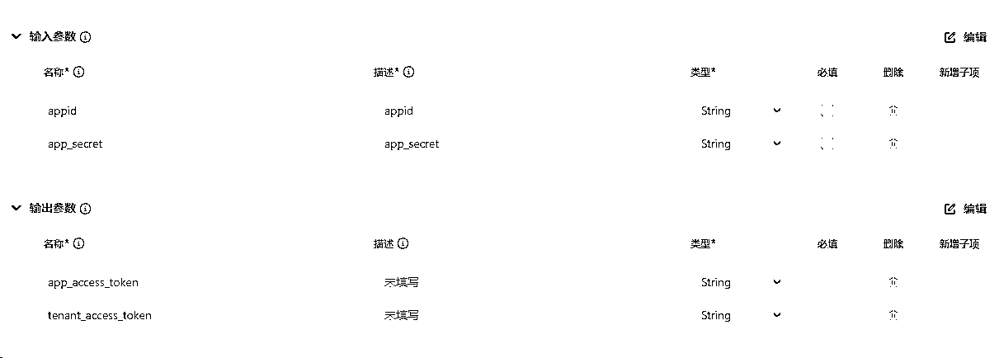
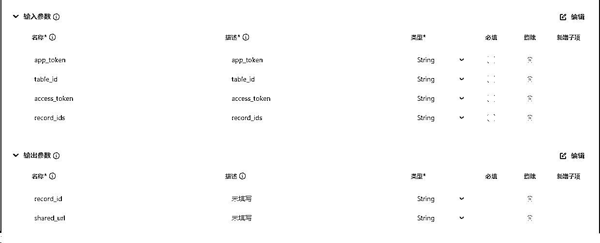
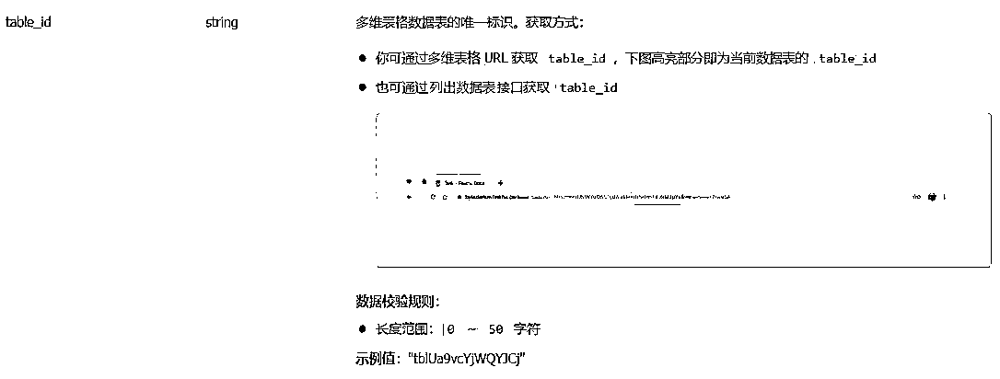
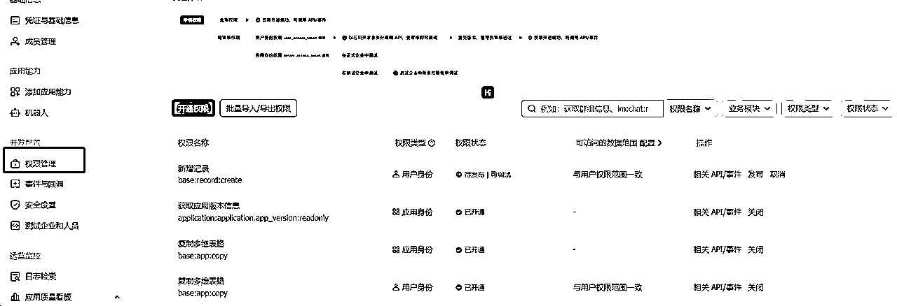

# 如何用AI工具撬动2000+智能体订单

> 来源：[https://iy8tus37tl.feishu.cn/docx/NGcZdQHb2oQIWhxuU1Tcps9Unmh](https://iy8tus37tl.feishu.cn/docx/NGcZdQHb2oQIWhxuU1Tcps9Unmh)

# 一、缘起

24年下半年，航海增加了关于扣子智能体，但是当时事情比较多，没有报上。自己也是在私下尝试下，感觉确实能够提升效率，但是没有找到一个很明确的变现方式。在刷风向标的时候无意中看到有圈友分享的关于coze变现的风向标：https://t.zsxq.com/CxKE5，感到真的是万物皆可咸鱼。想到自己作为产品经理，逻辑架构还是可以的，虽然没有是代码小白，但是完全可以借助大模型完成代码开发，至此踏上了智能体开发之路。

# 二、接单

刚开始做的时候，因为完全没有经验，只是敢接很小很简单的单子，稍微复杂一点的不敢接；而且报价真的很低，真的是超级廉价牛马！！！当时完美就是奔着边做边学的思路去的。

很多单子也是从其他AI公司接的外包单子，但是当最初的小需求完成之后，客户会有后续的2.0，3.0的需求，智能体的价格也是随之涨上来的。

2000+的智能体订单最初是来自一个200的单子，当时客户的需求是做一个财务贴现报价的智能体，给的需求也相对比较简单。但是中间一直在改需求，中间花了近一个月一直在来来回回改需求，改流程，，，甚至一度想要放弃。。但是想着前期只给了100的定金，花了这么多精力，还有100没收回来，不甘心，就继续撑着。

当时的实现思路是这样的：

1、文字消息，通过大模型进行提取整理；

图片消息，将OCR之后的文本让大模型进行总结（当时还没有视觉模型）

2、实时知识库：考虑到客户会随时调整知识库的利率，希望调整后，报价可以实时抓到最新的报价信息，所以用的飞书；

3、结果计算：纯代码部分

4、结果记录：直接记录在飞书

大概近一个月左右，客户暂时没有太大问题了（而且AI公司也知道，正常订单，不会这么久），就趁机找AI公司先结算就跑路了，想的是可算结算了，后续有问题直接找AI公司吧。

# 三、后续

但是过了3天，客户通过项目群找过来，希望继续合作，可以做后续2.0，3.0的开发，详细沟通了后续的需求，报了1500的价格（当时有弥补1.0的意思），客户竟然没有犹豫，直接打款了。。当时心里一阵感动，趁着周末，一个周末搞定大框架，后续就是修修补补

coze端经过一个月的磨练，很熟悉，快速搞定了，但是对接微信遇到问题，最初用的是COW，但是COW默认的是文字消息，不支持图片消息，需要二次开发插件；所以找了很久的个人微信的机器人项目（最后用的wechatferry）。

部署又遇到问题，一直提示授权问题（工作流中，用到的飞书官方插件，一直需要提示授权），后来找coze工程师，解决思路是需要创建应用，通过应用调飞书多维表格查询和写入，但是coze商店中没有相关的插件，无奈只能继续自学飞书插件，自建插件（当时也到咸鱼找过，单纯开发一个飞书插件最高的竟然要价600，最低的100，无奈囊中羞涩），还好最后顺利上线。

后面陆续增加了返回飞书记录的查看链接，多金融机构报价等等需求，就顺手很多了，基本很快就可以搞定。

今年客户在2.0的基础上，继续做3.0的需求：

1、收集员工在同行群中，同行的报价信息和语料；

2、。。。

3、。。。

# 四、工作流及插件

工作流和自建的飞书插件如下，分享给小伙伴


工作流与上面画布的流程图是一致的，代码部分涉及公司业务

主要涉及飞书多维表格几个插件：

1、获取飞书应用access_token

```
def handler(args: Args[Input])->Output:

    def get_app_access_token(app_id, app_secret):
        """
        通过给定的应用ID和应用密钥获取app_access_token以及tenant_access_token

        参数:
        app_id (str): 应用唯一标识，创建应用后获得
        app_secret (str): 应用秘钥，创建应用后获得

        返回:
        dict: 返回包含 'app_access_token' 和 'tenant_access_token' 键值对的字典，如果请求失败，字典中的 'msg' 键对应错误描述信息
        """
        url = "https://open.feishu.cn/open-apis/auth/v3/app_access_token/internal"
        headers = {
            "Content-Type": "application/json; charset=utf-8"
        }
        data = {
            "app_id": app_id,
            "app_secret": app_secret
        }
        try:
            response = requests.post(url, headers=headers, json=data)
            response.raise_for_status()
            result_json = response.json()
            return {
                "app_access_token": result_json.get("app_access_token"),
                "tenant_access_token": result_json.get("tenant_access_token")
            }
        except requests.RequestException as e:
            return {"msg": str(e)}

    result_token = get_app_access_token(args.input.appid,args.input.app_secret)
    app_access_token = result_token.get("app_access_token")
    tenant_access_token = result_token.get("tenant_access_token")

    return {"app_access_token": app_access_token,
            "tenant_access_token":tenant_access_token
    }
```



应用的appid和appsecret在飞书应用后台可查


2、查询飞书多维表格记录

```
def to_serializable(data):
    if isinstance(data, dict):
        return {k: to_serializable(v) for k, v in data.items()}
    elif isinstance(data, list):
        return [to_serializable(item) for item in data]
    elif hasattr(data, '__dict__'):
        return to_serializable(data.__dict__)
    else:
        return data

def handler(args: Args[Input]) -> Output:
    def query_feishu_bitable_records(app_token, table_id, access_token, user_id_type="open_id", page_token=None,
                                     page_size=20, view_id=None, field_names=None, sort=None, filter_info=None,
                                     automatic_fields=False):
        url = f"https://open.feishu.cn/open-apis/bitable/v1/apps/{app_token}/tables/{table_id}/records/search"
        headers = {
            "Authorization": f"Bearer {access_token}",
            "Content-Type": "application/json; charset=utf-8"
        }

        # 构建请求数据
        data = {
            "user_id_type": user_id_type,
            "page_token": page_token,
            "page_size": page_size,
            "view_id": view_id,
            "field_names": field_names,
            "sort": sort,
            "filter": filter_info,
            "automatic_fields": automatic_fields
        }

        data = {k: v for k, v in data.items() if v is not None}

        try:
            serializable_data = to_serializable(data)
            response = requests.post(url, headers=headers, json=serializable_data)
            response.raise_for_status()
            return response.json()
        except requests.RequestException as e:
            return {"code": -1, "data": str(e)}

    result = query_feishu_bitable_records(
        app_token=args.input.app_token,
        table_id=args.input.table_id,
        access_token=args.input.access_token,
        filter_info=args.input.filter_info
    )

    code = result['code']
    data = str(result['data'])

    return {"code": code,
            "data": data}

```


3、批量新增多维表格记录

```
def handler(args: Args[Input]) -> Output:
    def add_feishu_bitable_record_batch(app_token, table_id, access_token, records=None):
        url = f"https://open.feishu.cn/open-apis/bitable/v1/apps/{app_token}/tables/{table_id}/records/batch_create"
        headers = {
            "Authorization": f"Bearer {access_token}",
            "Content-Type": "application/json; charset=utf-8"
        }
        data = {
            "user_id_type": "open_id",
            "client_token": None,
            "ignore_consistency_check": False,
            "records": records
        }

        try:
            response = requests.post(url, headers=headers, json=data)
            response.raise_for_status()
            return response.json()
        except requests.RequestException as e:
            return {"code": -1, "msg": str(e)}

    # 定义一个函数用于将 CustomNamespace 对象转换为字典
    def namespace_to_dict(obj):
        if hasattr(obj, '__dict__'):
            result = {}
            for key, value in obj.__dict__.items():
                if hasattr(value, '__dict__'):
                    result[key] = namespace_to_dict(value)
                else:
                    result[key] = value
            return result
        return obj

    # 将 args.input 中的对象转换为可序列化的字典
    app_token = namespace_to_dict(args.input.app_token)
    table_id = namespace_to_dict(args.input.table_id)
    access_token = namespace_to_dict(args.input.access_token)
    records = [namespace_to_dict(record) for record in args.input.records]

    result = add_feishu_bitable_record_batch(
        app_token=app_token,
        table_id=table_id,
        access_token=access_token,
        records=records
    )

    info = []
    if "data" in result and "records" in result["data"]:
        for item in result["data"]["records"]:
            code = result.get("code", -1)
            msg = result.get("msg", "")
            record_id = item.get("record_id", "")
            info.append({
                "code": code,
                "msg": msg,
                "record_id": record_id
            })
    else:
        code = result.get("code", -1)
        msg = result.get("msg", "")
        info.append({
            "code": code,
            "msg": msg,
            "record_id": ""
        })

    return {"info": info}
```


4、获取飞书多维表格单条记录分享链接

```
def handler(args: Args[Input])->Output:

    def batch_get_records(app_token, table_id, access_token, record_ids):

        # 构建请求 URL
        url = f"https://open.feishu.cn/open-apis/bitable/v1/apps/{app_token}/tables/{table_id}/records/batch_get"
        # 构建请求头
        headers = {
            "Authorization": f"Bearer {access_token}",
            "Content-Type": "application/json; charset=utf-8"
        }
        # 构建请求体
        data = {
            "record_ids": [record_ids],
            "user_id_type": "open_id",
            "with_shared_url": True,
            "automatic_fields": False
        }

        try:
            # 发送 POST 请求
            response = requests.post(url, headers=headers, json=data)
            # 检查响应状态码
            response.raise_for_status()
            # 返回响应的 JSON 数据
            return response.json()
        except requests.RequestException as e:
            # 若请求出错，打印错误信息
            print(f"请求出错: {e}")
            return None

    result = batch_get_records(
        app_token=args.input.app_token,
        table_id=args.input.table_id,
        access_token=args.input.access_token,
        record_ids=args.input.record_ids
    )
    record_id = result["data"]["records"][0]["record_id"]
    shared_url = result["data"]["records"][0]["shared_url"]

    return {"record_id": record_id,
            "shared_url":shared_url}
```



2、3、4的apptoken和table直接取飞书链接的值




accesstoken取插件1的返回值

需要注意

1、要给应用添加云文档的编辑权限（应用管理页面-权限管理，添加云文档和多维表格，不确定可以全部开通

2、要给多维表格添加应用的管理权限（飞书多维表格—右上角三个点—更多—添加文档应用—选择创建的应用，给予“可管理”权限




# 五、总结

中间陆陆续续还有其他智能体的订单，比如微信公众号自动发布、数据采集-清洗、工程项目报价等等，借助AI工具进步还是挺快的。

2025继续加油！！