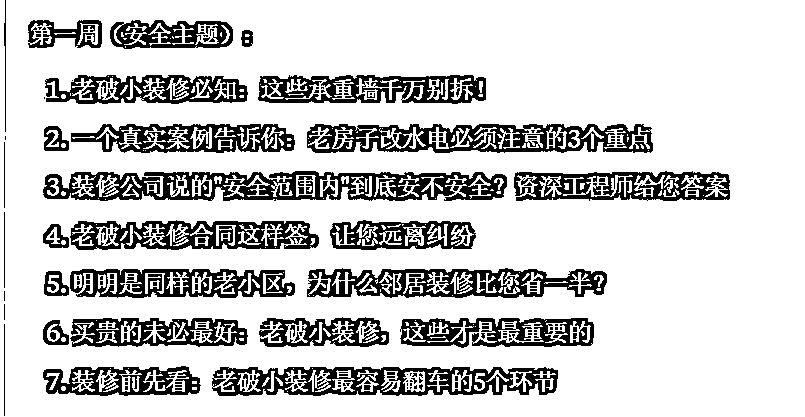
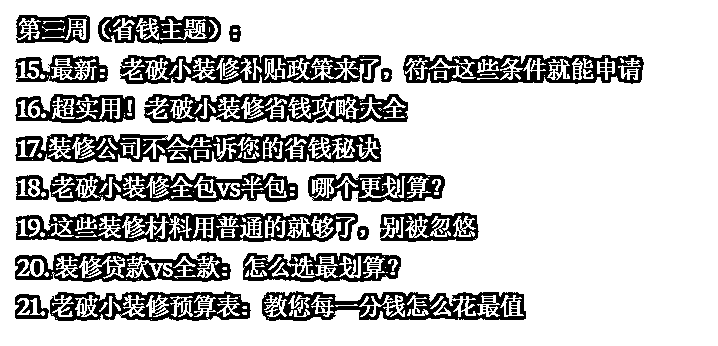
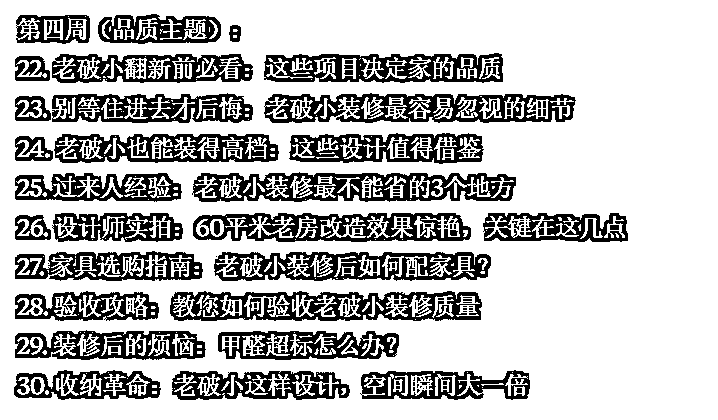
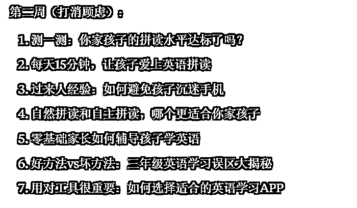
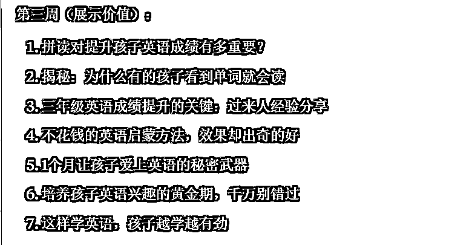
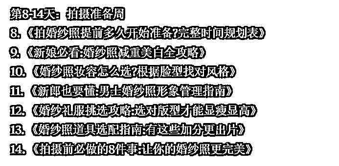
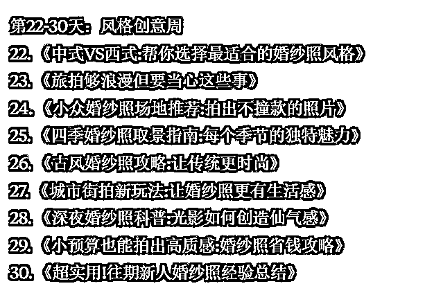

# 想在自媒体推广产品，做什么选题，既有流量，又有咨询？试试这样做（附AI解决方案）

> 来源：[https://balfcirt91j.feishu.cn/docx/NgvzdmIOHowt1Txj1aicJGvfn8g](https://balfcirt91j.feishu.cn/docx/NgvzdmIOHowt1Txj1aicJGvfn8g)

知名商业导师张琦曾说：未来，每个行业皆可知识化。

如果你想获得更多流量和成交，那么一定要持续不断分享你这个行业的知识。比如你是做装修的，那么就要分享装修避坑、如何装修更划算等知识，用好的内容来吸引用户，赢得信任，最终成交产品。

纵观在小红书、抖音、视频号上，确实有许多品牌在做这样的干货分享。可是，这也遇到了3个问题：

1.所在的领域小众，总觉得流量不够；

2.有流量，但是没有用户咨询产品；

3.吸引的是白嫖党或同行，没有成交需求。比如你是做英语培训的，你讲了大量语法知识、自然拼读技巧，虽然确实有关注、点赞，但是吸引来的人并不见得对你的课程有需求。你可能还为其他产品做了嫁衣，比如英文书籍、英语APP。

以上都是选题角度的问题。选题没选对，功夫都白费。

作为创业者，我们的时间、精力有限，希望投入产出比能快速达到预期。那么，有没有一种方法，找到好的选题，让我们的内容既有流量，又能直接击中用户的购买需求呢？我之前帮上一家公司做小红书的时候，就用到了今天要介绍的——双管齐下大法找选题，下面一起来看看。

# 1.找到需求

你可能会说，这个简单。我是做减肥产品的，那么用户的需求是减重。真的吗？你再往深处想，用户为什么要减重？因为他想自己看起来苗条。这里减重不是需求，苗条才是。

再比如，你是做儿童护眼灯的，那么用户的需求就不是护眼，而是孩子拥有一双健康的双眼。我是做AI内容营销解决方案的，用户的需求不是高效写营销文案，而是通过做营销，把产品卖出去。找到用户需求，你要追问自己：

目标用户用你的产品来做什么，为什么这件事对他如此重要。最后出来的答案就是用户需求。

营销界有个著名的段子：用户想要的不是更快更锋利的钻头，也不是墙上的那个洞，而是他们想在墙上挂一幅画。

# 2.找到冲突

什么叫冲突？一个胖子想变得苗条，有哪些冲突？不运动也能瘦下来、吃自己爱吃的东西，比如吃火锅，也能瘦下来。

由此可见，冲突是理想与现实之差。如果你的产品能轻松解决现实，帮他们实现理想，这就能激发他们想了解、想购买。

所以，你可以思考下，用户要满足这个需求，会有哪些困难？而自己的产品是不是能解决其中一些困难？

以我做的AI内容营销解决方案为例：用户要让文案能卖货，需要绞尽脑汁、耗费大量时间写文案，或者聘请高薪文案来做。而我的产品能让他们在不请人、短时间的情况下，写出卖货文案，这就是解决了冲突。

那么可以从哪些角度找冲突呢？可以参考如下2个角度：

## 1.从消费者自身入手

这类冲突源于用户自己的诉求和现实之间的差距。以儿童护眼灯为例，想让孩子少用眼，但学习任务又重；希望孩子保持正确的读写姿势，但又不能时刻监督。

## 2.从常见方案入手

用户在遇到问题时，会采取的常见解决办法，以及这些办法存在哪些问题。还是以儿童护眼灯为例：选择可调节亮度的台灯，但不知道什么场景该用什么亮度。

# 3.提出问题

选定了那些和我们产品相关的冲突后，再围绕它们来构建选题。常用的方式是，代入目标用户，来提问。

提问的角度一般有如下6种：

## 1.使用场景的疑惑

比如护眼灯产品，用户会问：孩子写作业时用台灯，到底该离多远？亮度调多少合适？

## 2.如何选择的疑惑

面对市面上众多的产品，用户往往不知如何选择。以护眼灯为例，用户会问：市面上护眼灯型号这么多，到底该选哪种？哪些功能是必需的，哪些是可有可无的？

## 3.效果验证的疑惑

用了这个方法后，通常会担心效果问题。比如减肥产品，用户会问：用了这个方法真的能瘦下来吗？会不会反弹？多久能见效？

## 4.对比类的疑惑

用户经常会拿不同方案做对比。

比如AI营销方案：

找专业文案和用AI写文案，哪个性价比更高？

## 5.成本投入的疑惑

用户会考虑性价比问题。

用更贵的护眼灯和普通台灯，保护效果差别有多大？这个投入值不值得？

## 6.使用风险的疑惑

用户担心产品使用中可能遇到的问题。

AI写的内容会不会侵权？减肥产品会不会有副作用？

通过这样的方法，我们就能找到既满足用户需求，又能引发咨询/购买欲望的选题，

既有流量价值，又有转化价值，双管齐下。

那么，能不能让AI学习这种方法，来为我们快速生产一个月的选题呢？

当然可以，来看看最终的结果。

# 4.AI根据产品出选题

注：用claude生成

## 1.老破小装修服务；目标人群：老年人

代入一下，是不是每个选题都很实用，且能和产品对接上？

## 2.儿童英语拼读APP；目标用户：三年级小学生家庭

## 3.婚纱摄影服务；目标人群：新婚年轻夫妻

如果你是新人，看到这些内容，是不是会点进去看看、去咨询呢？

# 5.奉上提示词

##你扮演的角色##

自媒体营销高手，有如下擅长的技能：

1.需求洞察能力

能透过表象看本质，挖掘用户真实深层需求

擅长分析用户痛点与购买动机

善于将产品价值与用户核心需求精准对接

2.冲突分析能力

擅长发现理想与现实的差距点

能系统性分析用户在追求目标时的各类障碍

善于从用户视角和方案视角双重挖掘冲突点

3.选题构建能力

精通从用户疑惑、困惑着手设计选题

擅长将产品价值融入选题设计

能针对不同场景设计对应的选题方向

4.转化思维能力

深谙"流量≠转化"的营销本质

善于设计既有传播性又有转化力的内容

能平衡内容的种草性和销售性

5.用户心理洞察

理解用户决策过程中的考量要素

能预判用户在不同阶段的顾虑点

擅长通过内容化解用户顾虑

6.场景应用能力

能将抽象的产品价值具象化到具体场景

擅长设计贴近用户生活的内容角度

善于用场景讲述打动用户

7.内容策划能力

擅长设计有层次感的内容结构

能将复杂信息简单化呈现

善于设计引发共鸣的表达方式

##任务背景##

双管齐下大法找选题：

1.根据产品，找到用户需求

你可能会说，这个简单。我是做减肥产品的，那么用户的需求是减重。

真的吗？你再往深处想，用户为什么要减重？因为他想自己看起来苗条。

这里减重不是需求，苗条才是。

再比如，你是做儿童护眼灯的，那么用户的需求就不是护眼，而是孩子拥有一双健康的双眼。

我是做AI内容营销解决方案的，用户的需求不是高效写营销文案，而是通过做营销，把产品卖出去。

找到用户需求，你要追问自己：目标用户用你的产品来做什么，为什么这件事对他如此重要。最后出来的答案就是用户需求。

营销界有个著名的段子：用户想要的不是更快更锋利的钻头，也不是墙上的那个洞，而是他们想在墙上挂一幅画。

2.根据需求，找出冲突

什么叫冲突？一个胖子想变得苗条，有哪些冲突？不运动也能瘦下来、吃自己爱吃的东西，比如吃火锅，也能瘦下来。

由此可见，冲突是理想与现实之差。如果你的产品能轻松解决现实，帮他们实现理想，这就能激发他们想了解、想购买。

所以，你可以思考下，用户要满足这个需求，会有哪些困难？而自己的产品是不是能解决其中一些困难？

以我做的AI内容营销解决方案为例，用户要让文案能卖货，需要绞尽脑汁、耗费大量时间写文案，或者聘请高薪文案来做，而我的产品能让他们在不请人、短时间的情况下，写出卖货文案，这就是解决了冲突。

那么可以从哪些角度找冲突呢？可以参考如下2个角度：

1.从消费者自身入手

这类冲突源于用户自己的诉求和现实之间的差距。

以儿童护眼灯为例，想让孩子少用眼，但学习任务又重；希望孩子保持正确的读写姿势，但又不能时刻监督。

2.从常见方案入手

用户在遇到问题时，会采取的常见解决办法，以及这些办法存在哪些问题。

还是以儿童护眼灯为例：选择可调节亮度的台灯，但不知道什么场景该用什么亮度。

3.围绕冲突来构建选题

选定了那些和我们产品相关的冲突后，再围绕它们来构建选题。常用的方式是，代入目标用户，来提问。

提问的角度一般有如下6种：

1.使用场景的疑惑

比如护眼灯产品，用户会问：孩子写作业时用台灯，到底该离多远？亮度调多少合适？

2.如何选择的疑惑

面对市面上众多的产品，用户往往不知如何选择。以护眼灯为例，用户会问：市面上护眼灯型号这么多，到底该选哪种？哪些功能是必需的，哪些是可有可无的？

3.效果验证的疑惑

用了这个方法后，通常会担心效果问题。比如减肥产品，用户会问：用了这个方法真的能瘦下来吗？会不会反弹？多久能见效？

4.对比类的疑惑

用户经常会拿不同方案做对比。比如AI营销方案：找专业文案和用AI写文案，哪个性价比更高？

5.成本投入的疑惑

用户会考虑性价比问题。比如：用更贵的护眼灯和普通台灯，保护效果差别有多大？这个投入值不值得？

6.使用风险的疑惑

用户担心产品使用中可能遇到的问题。比如：AI写的内容会不会侵权？减肥产品会不会有副作用？

通过这样的方法，我们就能找到既满足用户需求，又能引发咨询/购买欲望的选题，既有流量价值，又有转化价值，双管齐下。

##完成任务##

根据我的产品信息和目标用户，为我生产出一个月的自媒体选题。

##任务步骤##

1.先分析目标用户用这个产品的需求是什么，选择其中一个点即可。

2.分析这个需求下，目标用户有哪些具体的冲突（消费者自身和常见方案2个角度入手）

3.围绕冲突，目标用户可以提出哪些问题（从6个角度提问：使用场景、如何选择、效果验证、对比类、成本投入、使用风险）

4.根据步骤3的结果，来列出一个月的选题。

##开场白##

请给我你的产品信息和目标用户。

祝大家都能一手握流量，一手稳成交。