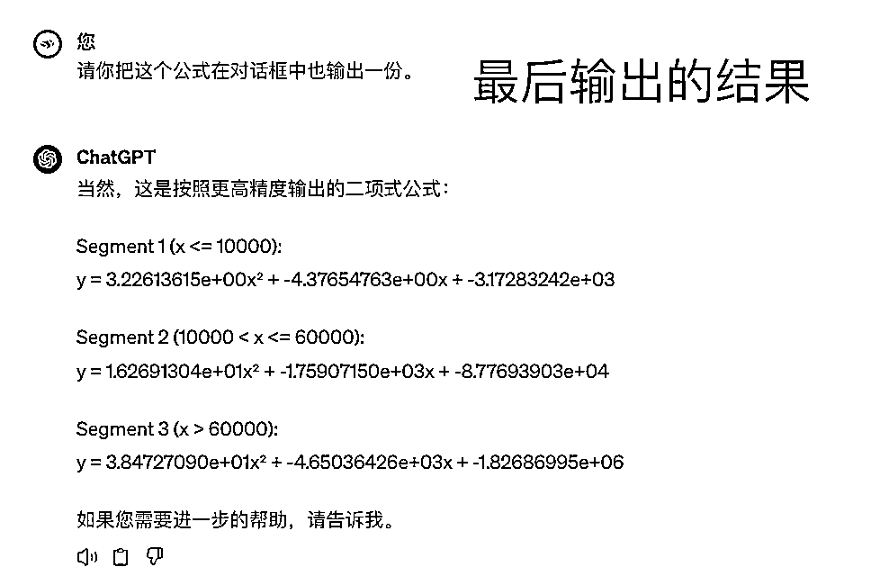
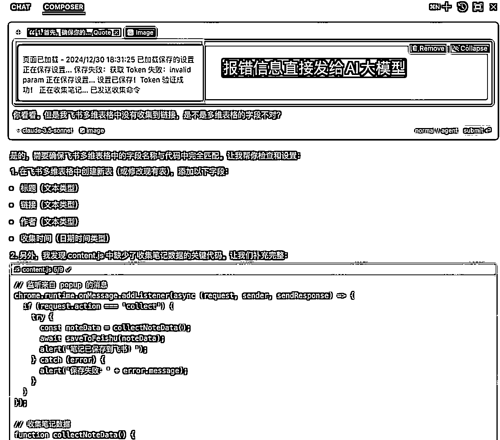

# 为增加业务利润率，小白如何用AI写Python算法？

> 来源：[https://wsbj757q14.feishu.cn/docx/JbvtdIwxjobzZxxiyw8cQZY4nqc](https://wsbj757q14.feishu.cn/docx/JbvtdIwxjobzZxxiyw8cQZY4nqc)

大家好，我是我来，一家百亿营收电商公司的数据产品经理，喜欢研究AI大模型的各种实践应用。之前写过几篇分享：

今天呢，分享一下我最新的AI实践成果，怎么用AI大模型写Python算法，并用这个模型来指导真实业务的投放！

一听是写程序就想走的同学听我说完哈，是让AI写，我们不用动手，不用真的去研究算法。

## 经验分享

### 背景信息

我现在在一家电商公司做数据产品经理，之前是在K12在线教育领域创业，主抓教研和私域转化。两年前转到这个行业时稍微学过一些Python，懂一些Python语法，但其实已经有两年多没有写Python，所以说我也不具备写代码的能力。

大家日常都会网购，运费险、退货率这些概念我就不解释了。作为一个电商公司，最近我们业务上遇到了一个相关问题。

原来我们的销售端，有一个很重要的指标是看费比（投放费用/销售额），实际就是一个ROI的倒数，也可以看做是单日销售单元模型的一个简化参数。现在大环境不太好，公司更看重利润，所以就需要看退后费比（投放费用/退后销售额）。

比如说，昨天卖了1万块钱，他最终的退后销售额在今天并没有办法知道，因为退款这个动作，它是持续发生的，比如说15天、25天，甚至周期更长。但是业务端，却需要根据昨天的退后费比指标，来判断接下来的运营动作：增加还是减少费用的投入。

在这种情况下，业务就给我们团队提了一个需求：希望站在今天，就可以预测昨日的最终退后销售额。

但是我们公司没有专门的算法团队。但是这件事又对业务动作极其重要，这个数据直接影响到业务投放的动作和节奏。所以说，这个数据是极其重要的。

如果是早两年这事我还要犹豫一下才会考虑，想着去年还不错的用AI的实践，加上我自己也比较喜欢探索型项目，同时也好奇AI大模型到底能在这个问题上，能解决到什么样的程度，所以最终这个项目就落到了我的头上。

所以我的核心目标是：通过AI大模型预测昨日的退后销售额，且误差率不能超过10%。

### 探寻解法

去年我做的分享，关于怎么用AI大模型做算法拟合（直达链接： ）。那个项目，会更简单一些，因为只需要我的样本数据喂给AI大模型，它是能自己帮我去找出两组数据的函数关系。

直接让AI大模型拟合出公式

但是这一次我面临的问题和挑战会更大：

1.  数据安全：这些数据都是我们企业的真实销售数据，考虑到安全性和数据量，没有办法直接喂给大模型；

1.  复杂场景：业务场景会更加复杂，涉及到不同的商品、不同的销售周期（大促还是平销）、不同的销售平台。

基于以上两点，加上我本身已经不会写Python了，我能选的方案还是只有用AI大模型写代码。

那么接下来，我的核心问题是：怎么样用AI大模型写出一个适合我的Python算法。

### 遇到挑战

明确了这一目标之后，我就开始行动了。其实去年我也分享过怎么样去写提示词做数据处理类的工作，此时我依然按照那个思路做。

然后呢，AI大模型生成了个代码，跑个结果很快就成功了✅

但发现了一个问题，我根本无法确定大模型生成的这个程序，最后运行出来的到底是不是我想要的结果。因为每一天的退款率，实际上是预估出来的，这就会让我没有办法判断这个结果对不对。

更可怕的是，因为不太懂代码，哪怕不对，我并不清楚问题出在哪儿了。整个Python程序就像是一个暗箱黑盒子，完全不知道这里面发生了什么。此时的我，很困惑很迷茫，不知道接下来该怎么办。

*   这个项目真的没有办法完成了吗？

*   是AI大模型的能力不行，还是我的能力不行？

我有一个习惯，出现问题时先从自己身上找原因。便开始复盘当前到底遇到了哪些问题：

*   问题一：所有代码均是AI大模型生成，所以我对这里面的细节均不清楚

*   问题二：代码太多了，我不太能看懂，也不太想看，读起来很痛苦

*   问题三：最后的输出到底好不好，我没有办法判断

接着，我便开始回想：平时都是怎么给技术提需求的？为什么技术同事能实现我想要的需求，而AI却搞不定？

然后，我就发现有2个关键点：

1.  在给技术同事提需求时，需求文档会写得极其清晰：最终要什么样的数据，数据从哪儿来的，怎么计算的；

1.  其实不单单是和AI交流，包括和技术同事交流也是一样，我必须要逻辑清晰，但凡我模糊的地方，最后一定会出问题。

我意识到：我必须搞清楚整个数据流转的流程，不然AI肯定是个黑盒，很有可能AI不按照我的指令处理数据。

回到我遇到的三个问题上，我开始思考对策：

问题一：所有代码均是AI大模型生成，所以我对这里面的细节均不清楚

不清楚细节是因为整个任务的处理链路太长了，有很多需要AI大模型自主决策的部分。只要我告诉AI大模型，每一个模块明确的处理逻辑，我相信它可以按照我的思路进行。

所以，我需要更加细致地拆解整个数据流转的流程，搞清楚从输入到输出到底有哪些环节，然后让AI大模型按照我这个环节来执行。

突然意识到，我有一种侥幸心理：只要我和AI大模型说清楚输入和输出，就可以拿到我想要的结果。但是如果项目过于复杂，我没有想清楚，不管AI大模型生成了啥，我都没有办法判断结果的好坏。

这就好比，我给下属派了一个活儿，但这个活儿其实我也不知道咋干。只是存在一种妄念：也许会有奇迹，下属能干好。

另外，这背后还有一个认知是：基于我过去使用AI大模型的经验，只要我的提示词描述够清晰，一般AI大模型不会胡乱生成代码。

问题二：代码太多了，我不太能看懂，也不太想看，读起来很痛苦

emmm，坦诚而言，我真不想看那一大堆的代码，一方面确实不太能看懂了，另一方面没有耐心。读别人的代码，是一件挺痛苦的事情。

但是，我可以让AI大模型给每一段代码写上注释啊，这样我就可以知道每一步AI大模型在干啥了，进而判断它的思路有没有问题。

问题三：最后的输出到底好不好，我不知道，也没法判断

就像数学一样，其实数据逻辑是很明确的，对了就是对了，错了就是错了。之所以没法判断，只是最后预测环节由于是预测所以不清楚。但是其他过程还是很清晰的，那么我能不能先保证其他过程是没问题的呢。

至于预测结果，就得回到我的项目交付标准上，我后续怎么和其他人证明我的预测没问题，此时的标准就应该是什么样的。

我的预测标准是：「T+25的预估退款金额」与「最终25天后的实际退款金额」一致，虽然最新的数据没有「最终25天后的实际退款金额」，但是历史数据已经超过25天了，我是可以计算出实际退款金额的。（逻辑有点绕，这里不进行展开）

基于此，我发现：我不能偷懒、不能偷懒、不能偷懒，自己没有理清楚的东西，不要妄想让AI清晰地实现。

我便开始耐心梳理整个数据处理流程，就有了下面这张图：

基于拆解的数据链路，写了一版新的提示词。

提示词拆解

1.  明确输入、输出、处理过程

1.  如果处理过程很复杂，可以做拆解，比如按照「流程」拆解、按照「模块」拆解

1.  能精确尽可能精确、能具体尽可能具体

然后我就把这些提示词直接给到AI大模型了。

大家猜猜我尝试的结果如何？结果并不如人意：总是报错，报错报错。而且，我还是不好定位问题。

既然如此，那我就一步一步地操作，这下总行吧？还真行！真的给我了一个还不错的结果！！

这下这个探索我就基本上搞定了。此处又得到了一个很核心的认知：当提示词很复杂的时候，可以一块一块地喂给AI大模型，每完成一块，再继续下一块。

### 经验总结

1.  AI大模型的编程能力非常强，哪怕自己是一个零基础的小白，也完全能够用AI大模型写出自己需要的程序；

1.  要想用AI大模型写出自己需要的程序，需要做好几个准备。

| 准备 | 解释 |
| 探索AI大模型的边界 | 实施方案、代码实现，肯定是可以做的 |
| 能清晰地描述清楚自己的需求 | 说清楚自己到底要一个什么样的东西 |
| 能用提示词表达自己的诉求 | 让AI大模型告知实现方法 |
| 具备拆解思维，可一步一步实现 | 基于AI大模型的能力，如果没法一次实现，就分步骤实现 |

*   这个项目是去年做的，如果现在用 Cursor 和 Windsurf 来做，估计效率至少可以提高30%以上。

## 小白怎么用AI大模型"写"程序？

最后，我其实最近几天一直在想，对于我这种几乎零基础的编程小白来说，怎么样才能用AI写好一个程序，这里面可能会有什么样的卡点。同时，我也在去思考有哪些虽然我确实是不太会写编程的，但是有哪些信息是需要大家知道的。

我想了想，假设你已经有意愿，并且解决了上网问题，那么有以下几个问题，大家很可能会遇到，这里我把一些方法也分享给大家：

### Q1：怎么选择合适的AI大模型工具编程？

推荐Windsurf和Cursor这种专业的软件来做，而且不用担心环境问题。在指引下可以很容易的就完成环境到代码的执行。

### Q2：听说编程要配置环境，这个要怎么弄？

选择合适的工具就可以解决大问题，比如Windsurf和Cursor，也可以下载Anaconda，配置环节很简单。

Windsurf下载链接：https://codeium.com/windsurf

Cursor下载链接：https://www.cursor.com/

Anaconda下载链接：https://www.anaconda.com/download

### Q3：AI编程类提示词到底应该怎么写才比较好？

提示词拆解

1.  明确输入、输出、处理过程

1.  如果处理过程很复杂，可以做拆解，比如按照「流程」拆解、按照「模块」拆解

1.  能精确尽可能精确、能具体尽可能具体

1.  当提示词很复杂的时候，可以一块一块地喂给AI大模型，每完成一块，再继续下一块

### Q4：不懂编程可以做吗？

比如说，需不需要懂Python，需不需要懂什么样的知识？

0基础完全没问题，但以下事情需要知道：

*   什么场景可以用编程处理，什么场景不可以用编程处理

*   怎么写提示词让AI大模型处理

*   报错了也能用AI大模型处理好报错问题

### Q5：程序报错了要怎么处理？

直接发给AI大模型，让它自己处理。

这里有一个小技巧，提示词中可以加上一句话：希望你考虑程序运行报错的情况，并能把错误信息显示出来。

### Q6：反复尝试后还不行，怎么办？

报错之后反复尝试，让他做了各种各样的调整，都没有实现自己想要的逻辑，怎么办呢？

努力找出问题，迭代提示词，新建一个对话框，从头开始，逐步实现逻辑。

（如果对话内容过长，由于AI大模型的长文本能力受限，可能会忘掉之前对内容，所以此时最好的方式是重新写）

### Q7：看不懂代码怎么办？

如果你愿意，可以每一行代码，都让AI加上大白话注释，这样就可以知道每一行代码都在做什么处理。

### Q8：不确定我想要的东西能不能用程序实现怎么办？

直接问AI大模型能不能实现。

截图中使用的是Cursor，为啥用这个，因为我之前买了会员，Windsurf更好用，但我的次数用完了

### Q9：有没有什么编程小项目可以先上手的？

做个抓娃娃的小游戏。我把提示词给大家，大家可以用 Windsurf 或 Cursor 试试，10分钟就可以搞定哦，还挺好玩儿的。

截图中使用的是 Cursor 工具