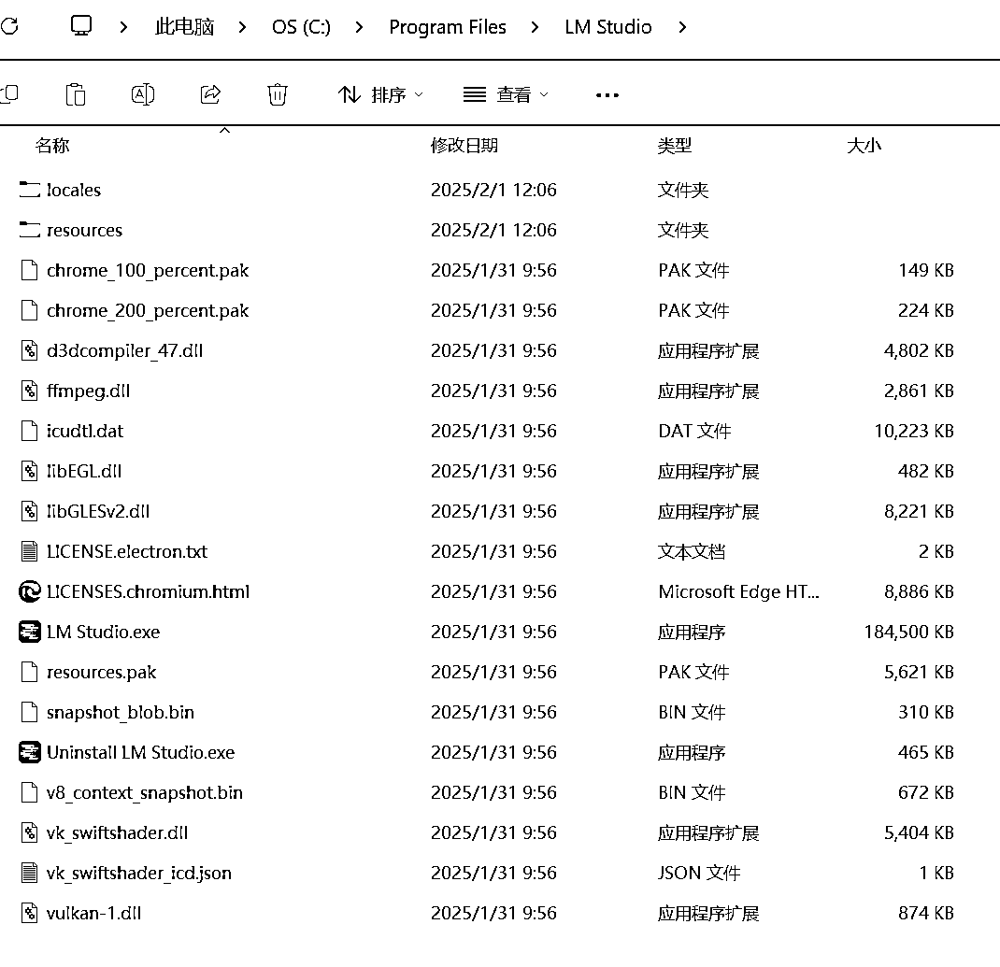
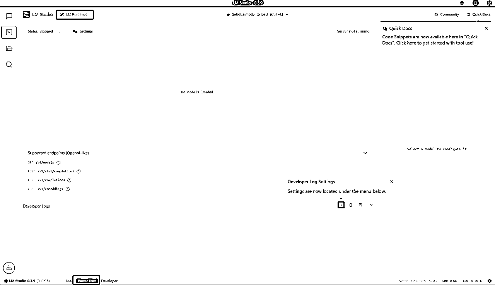

# 手把手图文教程教你断网本地部署deepseek

> 来源：[https://wosa79zedo.feishu.cn/docx/OYNMdcrjSoFMASxaeffcNzxenTb](https://wosa79zedo.feishu.cn/docx/OYNMdcrjSoFMASxaeffcNzxenTb)

Deepseek今年春节彻底出圈，这也导致服务器经常宕机无法及时生成回复。除此之外，在deepseek的服务说明里也明确指明用户上传的任何数据和资料都在它的数据收集范围之内，所以如果是涉及个人隐私的数据，也不适合使用网页版交流。

在B站看到一个教大家本地部署deepseek的视频，讲解得非常详细，有时间可以去b站看视频，up主叫“NathMath”。不过考虑到对着视频操作不如图文版方便，所以基于视频内容和自己实践总结了一个手把手图文版教程，希望能帮助更多人在本地电脑上部署deepseek

步骤概览：

一、下载并按照LM studio

二、下载deepseek R1模型

三、在LM中导入R1模型

四、对deepseek R1进行参数配置（实践验证8G显存、16G内存最佳配置是多少）

五、通过windows高级安全防火墙屏蔽掉LM的出站和入站访问

六、使用本地版deepseek与AI对话

## 一、下载并按照LM studio

1.下载并安装lmstudio

（1）访问 lmstudio.ai，下载windows版本。

（2）在本地电脑安装，安装完成后的截图

## 二、下载deepseek R1模型（推荐方法二）

1.方法一：在LM中直接安装deepseek R1大模型

下方菜单栏选择 Power User 模式，点击左上方 LM Runtimes按钮

在打开的窗口选择Model Search，在搜索框里搜索 deepseek。

可以看到相关大模型都会出现在搜索结果中，选择需要安装的版本进行下载。可以看到，选择8B GGUF版本（意思是8亿参数量化版）模型大小是4.92G。

2.方法二：从其他途径下载R1大模型【推荐】

方法一存在一个问题，就是如果不会魔法下载不了，up主在原视频中也提供了抱脸镜像站的下载方式，但实测网速还是很慢。

建议可以直接在我提供的网盘地址中下载，获取 Deepseek-R1-Distill-Llama-8B-GGUF和1.5B GGUF版本的模型。

https://pan.quark.cn/s/5e45ea2a1a1c

## 三、在LM中导入R1模型

1.首先需要把下载下来的大模型放置在正确文件夹位置。

（1）在C盘-用户下找到 .lmsudio文件夹，里面有一个models文件

（2）models文件夹里默认是空的，需要按照如下步骤创建两层的文件夹（一定要比照着做）

在modes下创建第一层文件夹，命名随意，可以使用我的命名叫做 LLM

在LLM下创建第二层文件夹，命名一定要跟大模型名称一致，例如我提供的大模型文件名全称是Deepseek-R1-Distill-Llama-8B-Q4_K_M.gguf，第二层的文件夹一定要命名为Deepseek-R1-Distill-Llama-8B-Q4_K_M，也就是说除了文件后缀.ggfu外，其余的内容要保持百分百一致。

在第二层文件夹Deepseek-R1-Distill-Llama-8B-Q4_K_M下放置下载下来的大模型。

2.在LM中选择上方 select a model to load，可以看到已经下载并放在正确位置的R1大模型，点击。

导入后的模型点击左侧文件夹的图标也可以看到。

## 四、对deepseek R1进行参数配置

点击完模型后立刻会弹出一个参数配置页面，可以进行参数配置。

后期如果想要调整配置，需要在下方选择 power user模式后点击模型旁边的齿轮，即可进行重新配置

简单说明下配置参数含义：

*   Context length：代表AI在思考问题时需要考虑多长的上下文，通常4096就足够了，如果本地电脑独立显卡并且内存大，可以适当选择高一些。写小说的话可以设置成20000左右。设置值越高，意味着对电脑配置的要求越高。

*   GPU offload：代表本地GPU负载多少层的计算。如果本地电脑无独立显卡，直接选0，如果有独立显卡，可以选择适当的数值。 我本地4060 8G显卡，选择了24层用GPU计算。

*   CPU Thread Pool Size：CPU可以调用的线程数量，建议直接拉满即可。

*   Evaluation Batch Size：AI计算每个批量的大小，默认512，如果有独立显卡可以适当调高。我选择了1024。

*   其他设置：保持默认，不要改动。

完成任务后会加载模型，加载完成后我们可以看一下本地电脑硬件是否能够满足此参数下的运行。

打开windows任务管理器，可以看到，对于8B GGUF版本的R1模型，在参数设置成文本长度8000、GPU 负载24层、计算块大小1024的情况下，GPU占用了8G中的6G，完全能够运行。 当然，目前这个情况GPU算力资源还有一些空余，如果需要，可以再适当调高些参数（比如增加文本长度）。

如何根据本机电脑硬件配置计算参数设置？

在B站原视频中，up主的建议是：

*   没有GPU：选择1.5B Q8推理，或者8B Q4推理

*   4G GPU：8B Q4推理

*   8G GPU：32B Q4推理，或者8B Q4推理

*   16G GPU：32B Q4推理，或者32B Q8推理

*   24G GPU：32B Q8推理，或者70B Q2推理

但是有网友反馈4060 8G的GPU+16内存的电脑跑32B Q4的推理非常慢。经过实践，这里提供一个简单的计算公式。

GPU显存+内存的数字与参数量的数字相比，如果前者大于后者，就基本可以跑起来。

例如，我的电脑GPU显存8G，内存16G，两个数字相加是24，这个24是小于32B中的32，所以运行起来可能会存在缓慢的问题。所以我最终选择了8B的版本。

## 五、通过windows高级安全防火墙屏蔽掉LM的出站和入站访问

上面的步骤解决了在本地部署R1并使用的问题，但是没有解决本地隐私数据如何不被大模型获取的问题，解决这个问题的关键就是断网，也就是不让在LM软件中与大模型的对话与外网有数据传输，从而保护数据安全。这一点非常重要，特别是与AI交流过程中如果涉及到个人隐私数据或其他重要敏感的数据，就不适合采用官网直接访问的方式，这也是要本地部署的最重要原因之一。

1.打开windows高级防火墙

2.新建入站规则（分别阻止lm studio.exe、elevate.exe和lms.exe三个文件入站）

在弹出的对话框中选择lm安装文件夹里的 LM Studio.exe文件，

选择 阻止连接，

可以起一个规则的名称（随便起名），

同理，再建两个入站规则，分别对elevate.exe和lms.exe阻止网络连接，这两个文件的位置分别：

elevate.exe在LM安装文件包下的resources文件夹下

lms.exe在C盘-用户文件夹.lmstudio/bin文件夹下

3.新建出站规则（分别阻止lm studio.exe、elevate.exe和lms.exe三个文件出站）

同样的方法，再建立三条出站规则，分别阻止lm studio.exe、elevate.exe和lms.exe三个文件出站，步骤与入站一样。

## 六、使用本地版deepseek与AI对话

然后我们就可以愉快的与R1对话了。我用AI帮我给b站做饭视频录音转录，然后把文字版喂给deepseek，让它总结成更结构化的菜谱供我下厨。

你可以看到R1思考的过程，这也是我目前选择deepseek R1作为首席AI的原因，看R1的思维链对自己思考问题能力的提升很有帮助。

与网页版不同的是，思考完成后整个思考过程是可以折叠的，这样可以不占用过多的页面。

我们再来检测一下断网的效果。可以看到，再访问外部数据LM提示获取失败。

## 要点总结：

*   下载deepseek R1模型，选择合适的版本（计算公式：GPU显存大小+内存大小之和与参数量的数字做比较）；

*   单独下载后的R1模型需要放置在正确的文件夹位置才能导入；

*   参数设置要根据自己电脑硬件配置来；

*   通过windows防火墙设置，分别阻止lm studio.exe、elevate.exe和lms.exe三个文件入站和出站（总共设置6个新规则）