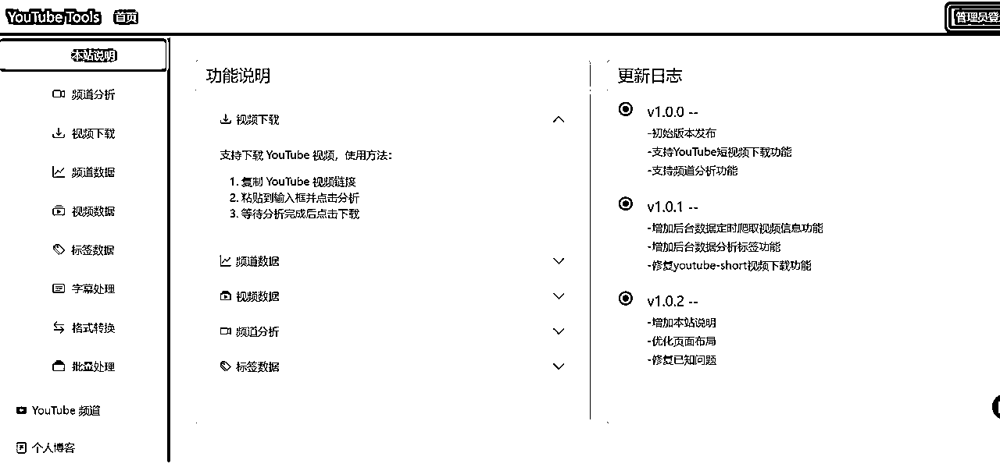
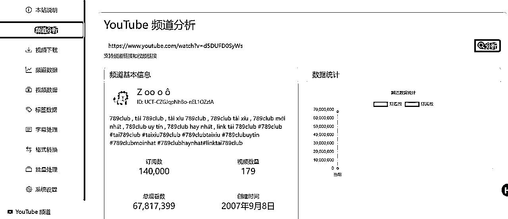
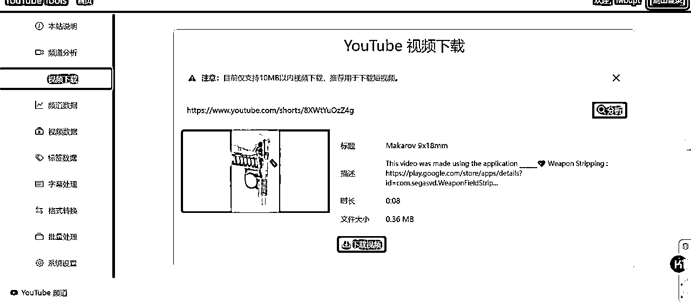
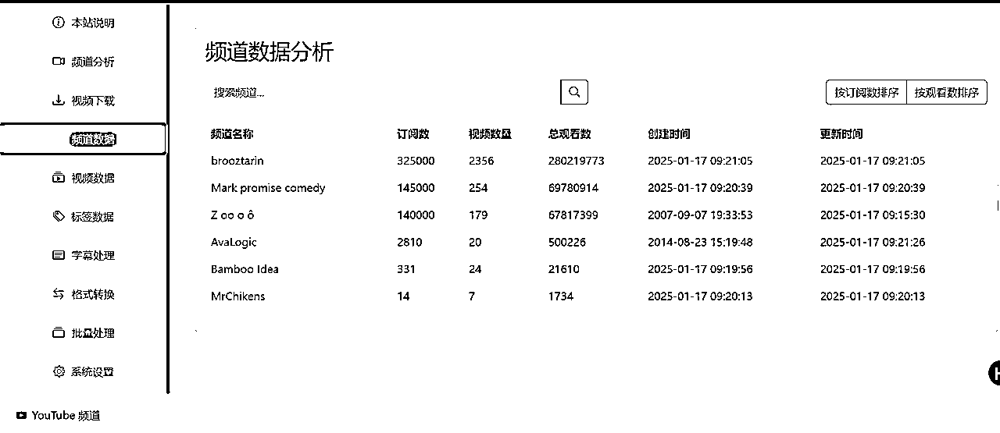
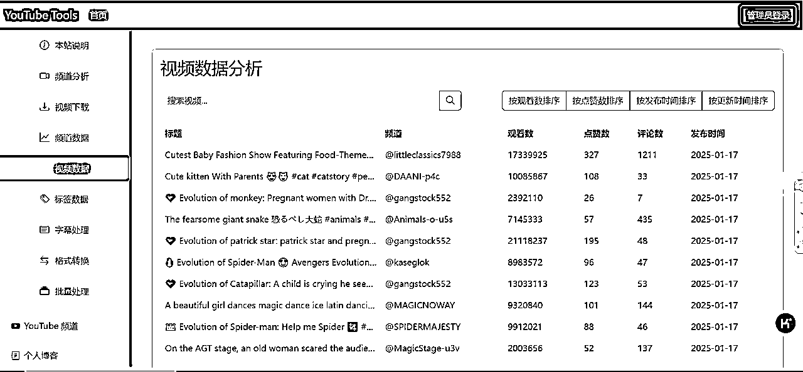
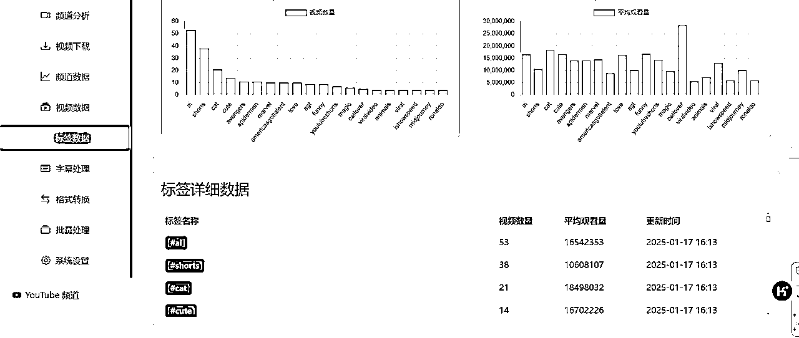
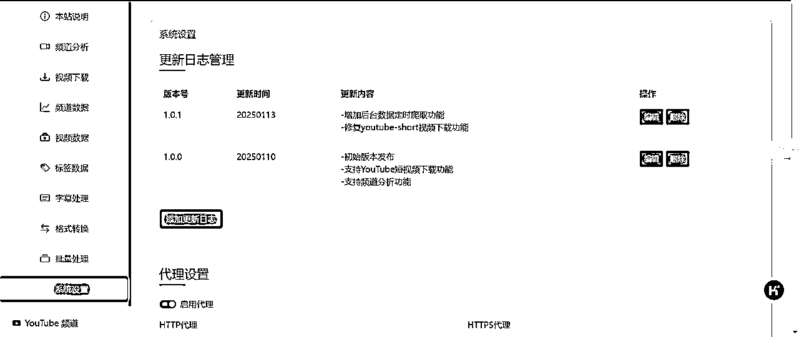
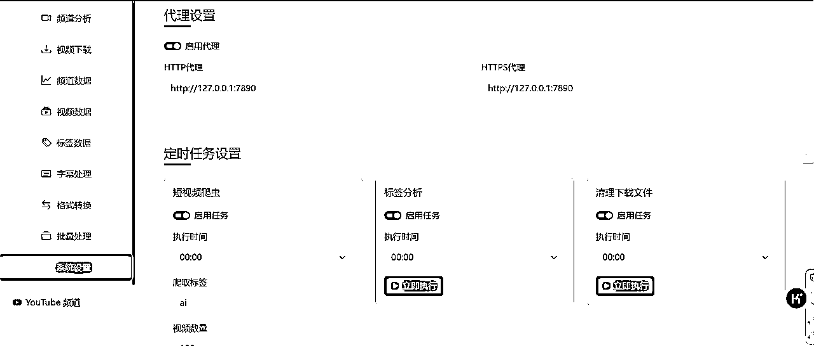

# cursor-youtube-short工具网站制作

> 来源：[https://v3m0vzf1tz.feishu.cn/docx/OaVSdVCIDoRew1xxKE5cbn2Enmd](https://v3m0vzf1tz.feishu.cn/docx/OaVSdVCIDoRew1xxKE5cbn2Enmd)

# 前言

大家好，我是骥哥，一周前使用cursor制作youtube短视频对标分析脚本的制作，并完成文章发表，请见本人文章 ，当时的脚本处理比较粗糙，获取数据有限，而且个别功能依赖youtube data api，需要解决每日限额10000次的限制（看着数量很大，实则消耗很大）。针对上述存在的问题，通过cursor强大的辅助编程能力，本人最终形成了一版youtube-short工具集并作为网站发布，网站主要功能如下，网址为www.lworld.top,编写仓促，可能还有很多潜在的问题，如有发现，请联系我留言。

# 本站说明

主要罗列出网站主要功能，各功能使用方法，网站更新日志

# 频道分析

根据输入的频道连列/视频链接，分析出对应频道订阅量，发布视频量，观看数，创建时间等信息，且用户分析过的频道数据会入库保存

# 视频下载

根据输入的视频链接，自动解析视频数据展示，用户可选择下载视频数据，通过视频下载功能的视频信息会入库保存

# 频道数据

列出网站分析/爬取过的频道信息一览，目前用户可做筛选查询，排序等操作，后期可添加数据解析功能

# 视频数据

列出网站分析/爬取过的频道信息一览，用户可做筛选选择，后期可添加数据解析功能。视频数据会通过每日定时任务进行爬取，目前仅支持针对特定标签下短视频信息爬取

# 标签数据

列出网站分析/爬取过的视频中，所归属的标签信息，可在本站范围内分析热门标签数量等信息，标签数据会通过定时任务每日分析一次本地数据库。

# 系统设置

可设置是否启用代理服务（国内服务器），更新内容维护，定时任务设置，权限需要管理员账户登录方可看到

# 其他

cursor在生成网站前端展示时，自动添加了其他一些功能，可能是youtube制作者确实存在的使用需求，后续可根据自身需要进行更新补充。