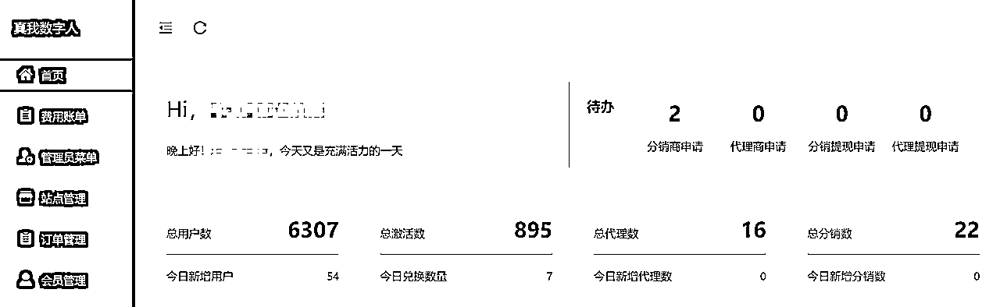
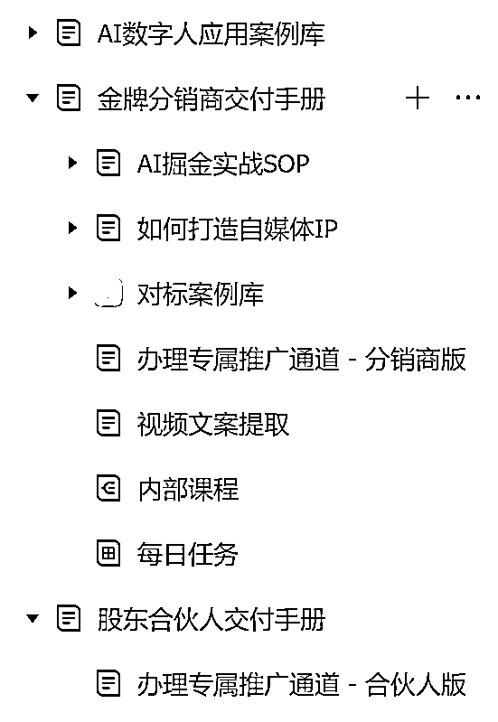
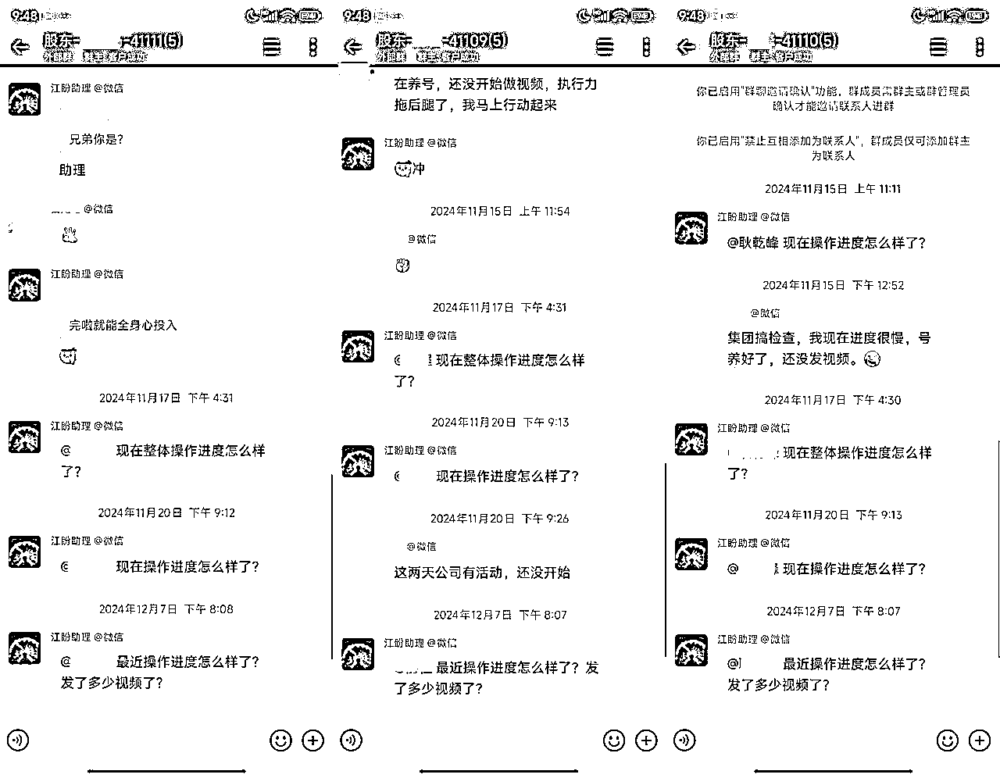
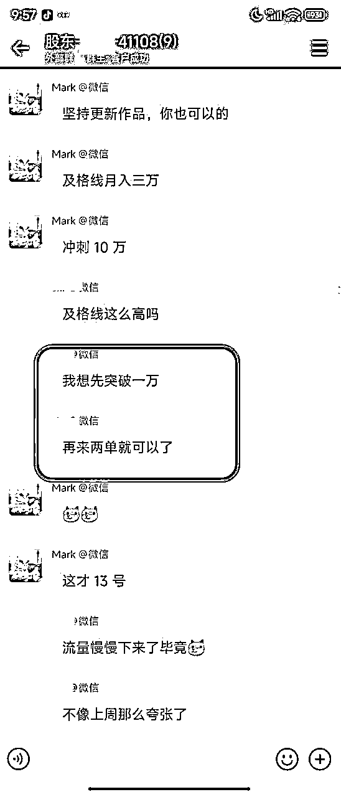
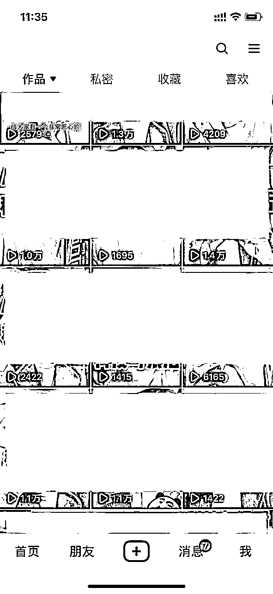
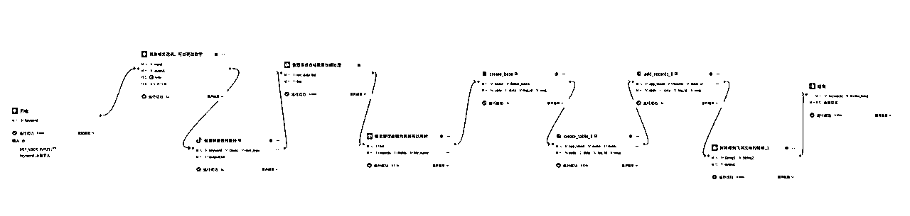
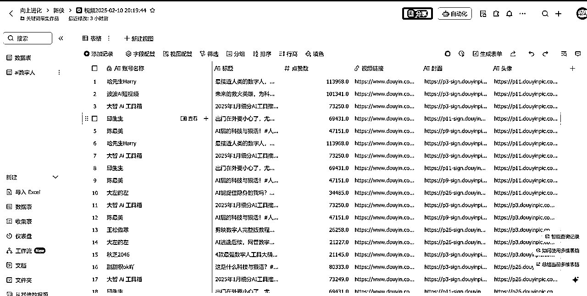
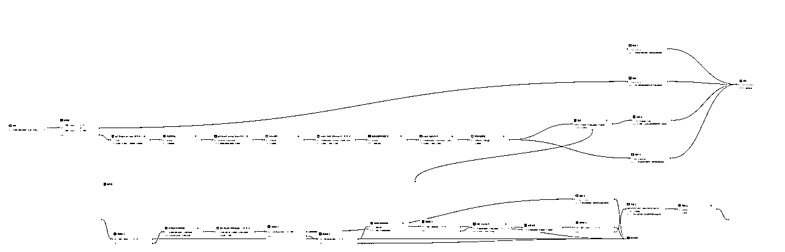
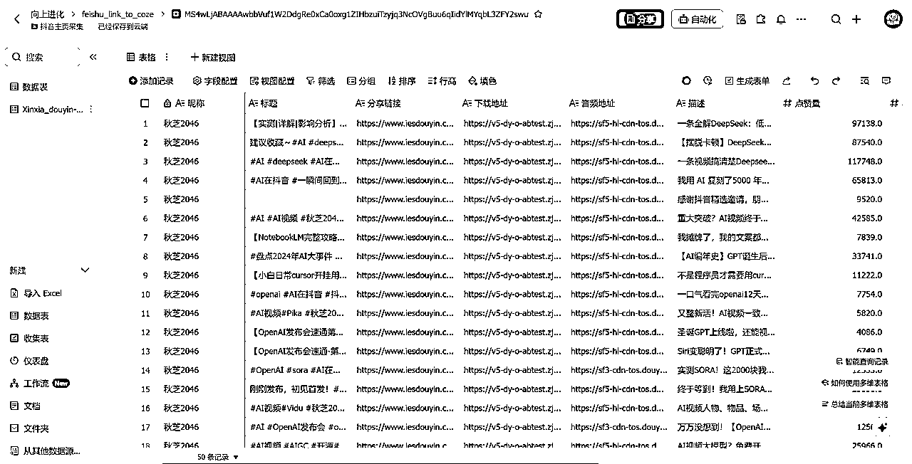
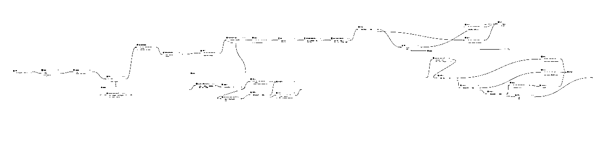

# 复盘：数字人项目从0终于跑到了0.5...

> 来源：[https://jinhuaclub.feishu.cn/docx/IhUGdkzILo4fl8xORjPcsvccnme](https://jinhuaclub.feishu.cn/docx/IhUGdkzILo4fl8xORjPcsvccnme)

在24年10月份发现“对口型数字人”这个异常值，然后1个月时间完成工具搭建，并初步跑通成交闭环，我对数字人这个项目进行了第一次复盘。

还没看过的小伙伴可以先看一下前传，哈哈。

Reference：

到现在已过去了快4个月，今天看了一下后台数据，目前总激活会员数量在895，除掉其中体验会员外，正式会员数量大概在200人左右，勉勉强强算是跑通了0.5，距离我对从0到1的彻底跑通的期望，还差了不少。



这其中又是踩了N多个坑，让我原本以为搭上风口就能一飞冲天的想法，也慢慢回归了理性。

本想着完全跑通从0到1再来复盘，过完年，本是难得给自己放松一下，但对于这个项目的一些思考和规划却一个又一个往外蹦，索性还是写一写，既是复盘总结，也算是25年的工作规划吧。

# 一、踩坑反思

## 1.无基数，不裂变

在我自己初步把整个项目从流量到成交在一周内跑通之后，我陷入了一种对所谓风口的盲目追捧。

认为在那个阶段，就是抢时间，抢流量。

因此我犯下了一个致命的决策错误：重心放在先招募代理，并培养代理做流量和成交。

理想和丰满，结局很惨淡，我花了几天时间招募了20多个代理，但在正式启动后的一周，我就发现了一个严重的问题：只有一个代理在每天执行。

我一开始以为是交付的问题，于是立马开始撰写交付手册，甚至安排了每天的任务以及直播答疑。



结果依旧还是只有一个代理在每天坚持，其他人毫无音讯。

我又安排了一个助理，三不五时的对代理进行跟进，提醒他们。

但结果依旧令人绝望...



而唯一坚持的那个代理，一个月时间做到一万的业绩



一个项目是不太可能在没有流量基数的前提下，就能靠代理来裂变扩大的。

更何况你永远叫不醒一个装睡的人，一个项目99%的人赚不到钱，绝大部分原因是执行。

当我踩了这个坑，我才理解到“无基数，不裂变”的含义...

## 2.无SOP，不投流

我犯的第二个错误，则是自己停止了做流量，反而把希望寄托于付费投放上。

我找了一个做代投放的服务，开始了AD投放。

在投了5W后，我发现了两个绝望的问题：

a.投放人群不精准

我期望的是C端用户，投来的都是B端用户

我的产品是数字人视频，更投来的大部分是咨询数字人直播

b.转化跟不上

5W的付费投放，最终成交惨不忍睹。除了人群不精准外，我的转化也没跟上。

我一直擅长的是自然流，别人添加我微信是因为“钩子”而来，因此我迟一点通过好友，且回复的随意一些，朋友圈发的并不勤快，也能保证一定的转化率。

但对于付费流量，这一套完全行不通。

*   必须要第一时间电话沟通，然后主动添加对方微信

*   要强转化：即需要隔三差五的发“骚扰信息”

*   朋友圈也要足够的数量和曝光

免费流量和付费流量的内容、转化上都完全不一样，而我根本没有太多的投流经验，贸然把宝压在投流上，实在是不理智。

当然，如果你预算足够，烧钱烧出一套SOP，那也许能行。

# 二、回归正轨

对于0-1来说，很多的坑还是来自于流量端。

在流量上白白浪费了近两个月时间，我终于意识到这样不行，还是需要先自己按已经跑通的方式去做流量。

先有基础的流量增长，再来考虑裂变和扩大才对！

于是我按之前的方法开始做视频，流量还是比较稳定，几乎每个作品都有大几千上万的播放，甚至还爆过800W+的播放，评论区意向也不错。



但我突然发现，微信进人数和作品流量完全不匹配。

我之前对于文案完全是找到对标账号去进行二创，带着这个问题，我又把对标作品的文案细扒了一下。

好在我对于这方面还算有一些经验，我很快意识到问题。

对于视频数据来说，这一套文案没什么太大问题，甚至还算不错。

但对于微信进人这个指标来说，很明显，这一套文案缺少了一个核心：钩子

于是我很快优化了一下文案，微信进人数明显的改善了。

总算是又把这个项目从偏离的轨道上拉回了正轨，算是从0跑通了0.5

# 三、项目规划

## 1.自建矩阵

高手都在拼概率，新手总想一盘赢。

忘了从哪里看到这句话，但我深以为然。

矩阵最好的方法是跑通标准化流程，并借助工具完成重复性工作。

而在我的工作过程中，对标账号/作品的采集，文案的改写润色，数字人的生成都是这样类型的工作。

我花了一周时间，自学了Coze工作流，实现了几个自动化流程。

### a.抖音关键词搜索热门视频

基本流程：



最终自动输出数据到飞书多维表格



### b.抖音主页数据批量采集

基本流程：



最终自动输出数据到飞书多维表格



### c.自动生成数字人

这个工作流还是比较复杂的：自动润色文案，文案自动分段，自动语音克隆，根据音频生成数字人，调用阿里云智能剪辑进行拼接混剪



最终实现了输入一段文案自动润色返回混剪好的数字人视频

有了以上三个工作流，基本矩阵就成功了一大半，计划到2月底完成10个账号的搭建。

Coze工作流这块研究了一下，也大有搞头，后面有空再详细分享一下

我把基本工作流实现的流程列出来，有兴趣大家可以去尝试

## 2.裂变体系

对，还是绕不过裂变。但这次我不会把全部希望都放在裂变上。

我研究了一下两个竞争对手，其中一个是龚文祥。

他也做了一个数字人口播分身的工具（可见这个项目前景还是不错的），工具本身没什么新奇，但他的裂变体系让我眼前一亮。

坦白讲，之前我对于裂变，无非就是代理+分销那套。

但龚文祥的体系，他称之为“师徒传承”，我花时间仔细的研究了一下，是所谓的“链动2+1”

介绍起来有点麻烦，帮你问了一下deepseek，供参考

```
链动2+1模式是一种基于社交裂变的分销策略，通过激励机制快速吸引用户参与并实现团队裂变，广泛应用于电商、零售、服务等行业。其核心是通过身份晋升和层级奖励，推动用户主动推广产品并发展团队，形成可持续的销售网络。以下是该模式的核心机制与特点：
一、模式核心机制
身份体系
用户分为代理和老板两种身份：
代理：用户通过购买指定产品（如499元礼包）成为代理，获得推荐资格；
老板：当代理成功直推两人购买产品后，晋升为老板，脱离原上级团队，独立发展自己的团队。
奖励机制
直推奖：代理每推荐一名新人购买产品，可获得固定奖励（如100元/单）；
见点奖：老板每推荐一名新人，除直推奖外，还可额外获得见点奖（如200元/单），激励团队裂变；
平级奖：当下级代理晋升为老板时，上级老板可提取下级收益的一定比例作为奖励；
帮扶基金：老板的部分收益（如20%）被冻结，需完成帮扶任务（如帮助下级晋升或团队达标）后才能解锁，确保团队持续发展。
裂变规则
走人机制：代理晋升为老板后，其前两名直推的代理归属原上级团队，后续推荐的新人则进入自己的团队；
留人机制：保证上级团队的稳定性，避免因裂变导致资源流失。
二、合规性与法律边界
链动2+1模式通过二级分销设计规避法律风险：
分销层级严格控制在两级以内（代理直接推荐的下级和下级的下级），符合《反不正当竞争法》要求；
以实际产品销售为核心，避免传销嫌疑；
通过第三方合作（如灵活用工平台）解决税务问题，确保合法纳税。
三、模式优势
快速裂变：用户仅需推荐两人即可回本（如499元礼包推荐3人回本），后续享受无限裂变收益。
低成本引流：依靠用户社交关系传播，替代传统广告，降低营销成本。
高用户黏性：通过晋升机制和持续奖励，激励用户长期参与团队发展。
灵活适用：适用于高毛利、高复购行业（如化妆品、酒类、医美），支持多行业定制化调整。
四、适用行业与场景
快消品：化妆品、健康食品等，依赖口碑传播和高利润空间；
酒类与食品：通过社交推荐快速占领市场；
服务行业：教育、旅游等，利用用户信任链拓展客源；
初创企业：快速起盘，积累种子用户并建立销售渠道。
五、潜在风险与解决方案
团队断层风险：若下级代理无法晋升，可能导致裂变停滞。通过帮扶机制强制上级协助下级完成任务，确保裂变延续9。
法律合规争议：需严格把控层级，避免变相多级分销。建议与专业法律团队合作设计模式框架。
链动2+1模式通过简洁的规则和强激励，在合法合规的前提下实现用户与销量的指数级增长。企业在应用时需结合自身产品特点，优化奖励机制与裂变路径，同时注重长期用户运营与合规管理。
```

我基于这套模式，重新架构了我的裂变体系和用户系统，期望能带来一些收获。

总体来说，数字人项目目前为止带给我收益上的结果并不算太高，但这是我第一次尝试从“知识付费”转变为“AI工具”的业务，带来的挑战和艰辛不足为外人道也。

期望这篇的一些踩坑反思能对你在类似业务的道路上有一些启发和帮助，也欢迎大家多交流。