# 躬身入局，把手弄脏 | 福州见面会分享

> 来源：[https://shengcaiyoushu01.feishu.cn/docx/P8ZWds59Yo64HXxSLbLcwTcGnwc](https://shengcaiyoushu01.feishu.cn/docx/P8ZWds59Yo64HXxSLbLcwTcGnwc)

大家好，我是坤汀，亦仁的合伙人。也是25年福州见面会的组局官。

25年一开场，在福州全国见面会，做了第一次生财的线下分享。也是我人生第一次做200人场的分享。

分享的主题是，躬身入局，把手弄脏

分享原因是我认为这是创业路上非常重要的心法，重要且容易忽视容易做错；另外24年我设计了一款“把手弄脏”的T恤，也算是一个呼应。

到场的圈友背景差异很大，行业、阶段、人生状态各不相同。最后通过分享了3个故事去表达自己的理念，这样大家从故事里都会有属于自己的收获。

*   1个是100年前大航海的故事

*   1个是生财团队内部的故事

*   1个是生财一位航海家的故事

以下是分享的逐字稿

（第一次分享，准备了100页PPT，后来缩掉了30页左右，相关内容有大幅删减，有机会可以再跟大家分享）

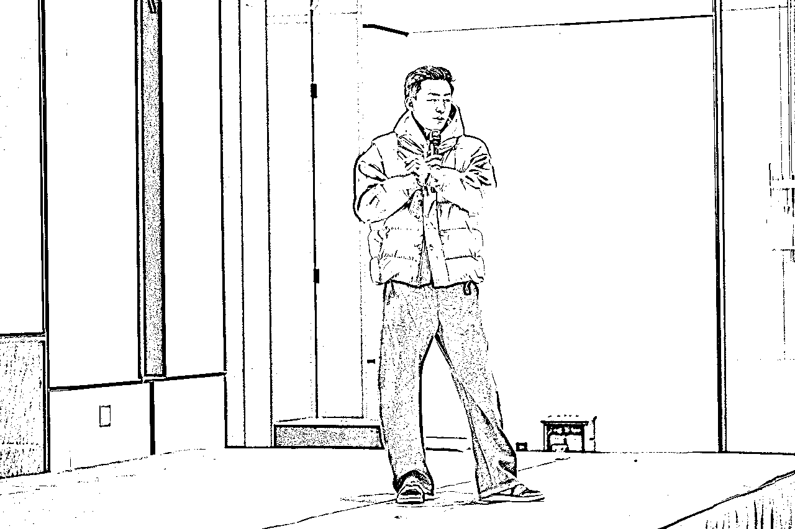

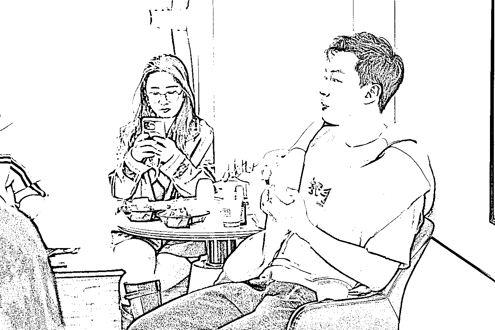

# 1：冲击南极点的故事

第一个故事是 100 年前，真正的【大航海时代】发生在最伟大航路的冒险。当时南极的最中心点，也就是南极点并没有被征服。大航海时代这种有个特点，就是历史其实总会只会记住第一名。我们知道哥伦布发现了美洲大陆，知道阿姆斯特朗，但没人记得第二名是谁。而当时地球的其他大陆、北极点其实已经被征服了，所以南极点是非常宝贵，争夺也非常激烈，算是当年最伟大的探险家们争先恐后竞逐的地点。

图中标注的是南极点，行军路线会从南部的罗斯海Ross Sea进入，记住这个海域。全程大概 2, 200 公里的路程。

故事发生在这两个团队之间，两位团队队长过往都有丰富的航海探险经验，并且取得过一定的成绩。

一个是来自挪威的阿蒙森团队，阿莫斯的团队一共是 5个人，

一个是来自英国的斯科特。大英帝国当时国力在全球是最强盛的，大家其实从他们的穿着也能看得出来，斯科特当时是上校，装配会更豪华。斯科特团队一行40人，1910.11.25号从新西兰出发，比阿蒙森早出发2个月。

大家凭直觉你们觉得哪个团队会获得胜利呢？

答案是挪威的阿蒙森团队获得了胜利，但这并不是一个以少胜多，以弱胜强的故事。

在熬过了5个月的南极冬季后，两个团队差不多一共出发，阿蒙森团队5人，1911 年的 10 月 19 号出发，在 12 月 14 号到达了南极点，成为全球首位登录南极点的团队。在1912年1月25 号，也就是在一个月之后，他们就从南极点回到了营地。反观斯科特团队，一开始20人出发，后来减少到10人，5人，最终在阿蒙森到达南极点后的一个月才到达南极点。

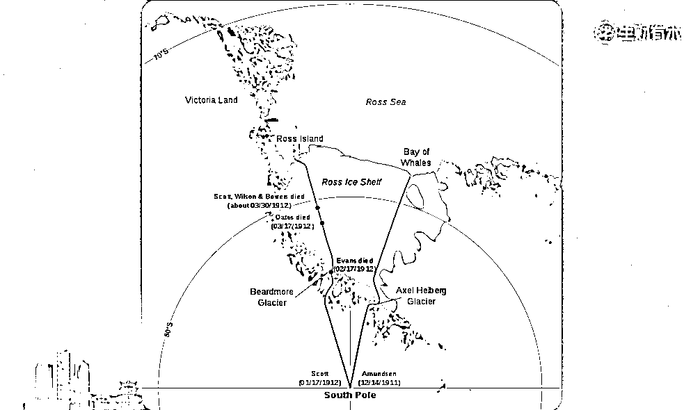

这不仅是成功失败的区别，更是生与死的区别。斯科特的团队晚到的代价是回程路途中遇到了巨大的暴风雪，使得团队不得不扎营搭帐篷，团队成员忍着饥饿、冻伤，成员不断死亡，所带物资又不足，最后精疲力尽，包括斯科特的那个三人死在了离补给点17 公里的位置。

17 公里啊... 放在现代社会是不远的，开车也就是20来分钟的路程。但没有人有能力再往前一步了。斯科特有写日记的习惯，他最后愿望是：“请把这本日记送到我的妻子手中！”随后划掉了“我的妻子”，在上面写上“我的遗孀”。自己生命也走到了尽头。

在那个时代其实创业是非常凶险的。不是你赚钱亏钱的问题，这是生与死之间的问题。那事后复盘一下，为什么阿蒙森取得了胜利呢？大家觉得为什么？

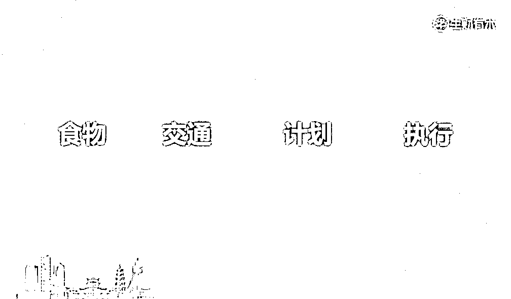

我们从这几个方面看

食物，阿蒙森团队是备了 3 吨的食物的，他们只有 5 个人，但是斯科特只背了1吨的食物，所以其实大家会发现最后他们是被饿死的。1吨没有估算这段行程会遇到的各种不确定性。

交通，阿蒙森的团队是用狗在拉物资，而斯科特的团队是用矮脚马，这有什么区别呢？狗是用舌头在排汗，抗冻。但马是用身体在排汗，一旦出汗冷却容易冻死。所以斯科特去程马死光了，导致他们用人拉物资，体力消耗很大。

目标，阿蒙斯团队目标有且只有一个，夺得南极点头筹。但斯科特目标非常多元，他们不仅要第一名拿下南极点，还要采集很多岩石样本搞科研，甚至有一个任务要拿下一颗帝企鹅的蛋。

所以其实当一个团队目标太多的时候，是不是会不聚焦呢？

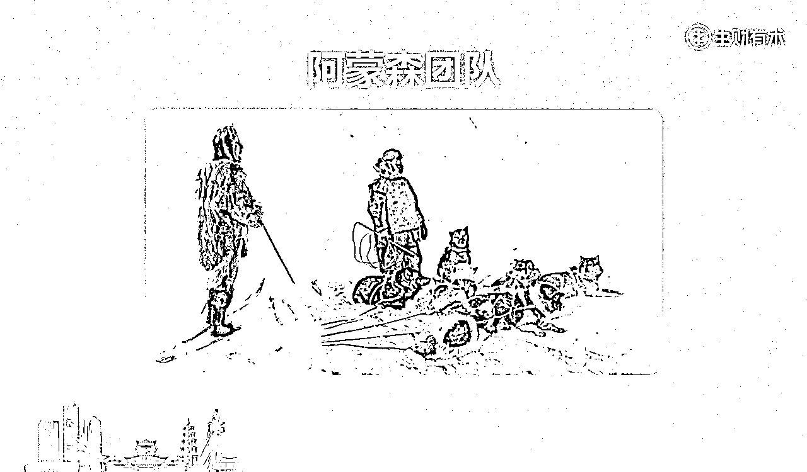

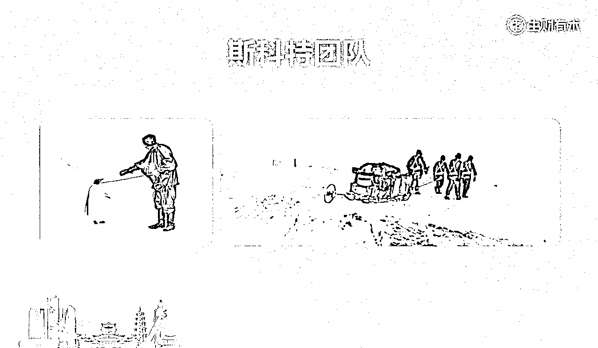

执行，而其实这里边儿在我看来最重要，是发生在执行计划上的。阿蒙森团队有个铁律每天前进 30 公里，雷打不动，他们不会因为任何的困难影响到团队前进的速度。但斯科特的团队不是这样，天气好的时候每天会前进60、70公里，天气差的时候会扎营休息。计划随时随意地调整。比如最后从南纬87度往南极点冲刺的路上，斯科特临时把小组从4人变成了5人，但物资是按照4人准备的。

阿蒙森在冲刺南极点的三年前，在日记上写的话，我们将在 1 月 25 号极点点返回基地，三年后，他们真的达到这个目标！他们在 1912 年 1 月25号返回了南极基地！

这种计划缜密性、预测推演能力、坚决执行力，我认为是阿蒙森获胜的关键。

这就好比我们圈友航海、做业务、创业的过程，市场环境变化波动、未来的不确定性就像南极的暴风雪一样，有几十个同行同时在做，竞争非常激烈，而且你也并不是处于领先者的位置。有的时候有运气在，我们的业务可能特别好做，有的时候又会变得极度艰难。

我们特别容易放过自己。去外部归因，去抱怨大环境不好，但当你遇到了糟糕的南极天气，其实所有人都遇到了，为什么有人能杀出来，获得胜利？

你是选择怨天尤人、歇菜休息，把自己命运交给“天气”，还是选择夺回控制权，遇到问题迅速调整，每天前进 30 公里，坚定不移，雷打不动。

# 2：生财团队新业务

第二个故事，是生财内的故事，满足一下大家对于生财团队的窥探欲。也是我最近的一个故事和一点儿心里的感受吧，分享给大家。

最近一个月我一直在加班，因为我在忙一个新的业务，也是生财今年的战略，往垂直化、往深度业务去做。

因为用户一直有这个需求在。在参与完航海后，拿到了正反馈，期待在一个垂直赛道项目继续做深做透。而教练本身也有继续深耕，和用户形成更深度的交付关系的预期。所以趁12月航海结束这个节点，我们开始了这次业务探索。从0到1去产出一个能够服务好大家的新产品。

而从0到1我认为一直要做一个事情，要做PMF，product marketing fit，我们要看看，新的产品能被多少比例用户接受和认可。

所以我们做了几轮尝试，说实话是困难重重的。从产品定位、商业模式、产品设计、服务设计、合作方案、卖点设计有无数个要考虑设计和测试的细节。这个过程我不赘述。

我想分享的是在一个周末的晚上，我们完成了一轮小范围的售卖测试后又不达预期，当时已经过去半个月。因为一轮又一轮的失败，当时团队的信心是很受挫的。以及想放弃的，

大家认为这个假设可能就是不成立的，以及没有信心，非常的犹豫下一步该怎么做？要不要做？以及会认为转化不达预期是不是因为要过年(因为有用户提到过)，他们想放在年后再做这个事儿，当时面临这么一个情况，问题甩到了我这边，我该怎么去处理呢？这个时候该怎么办？

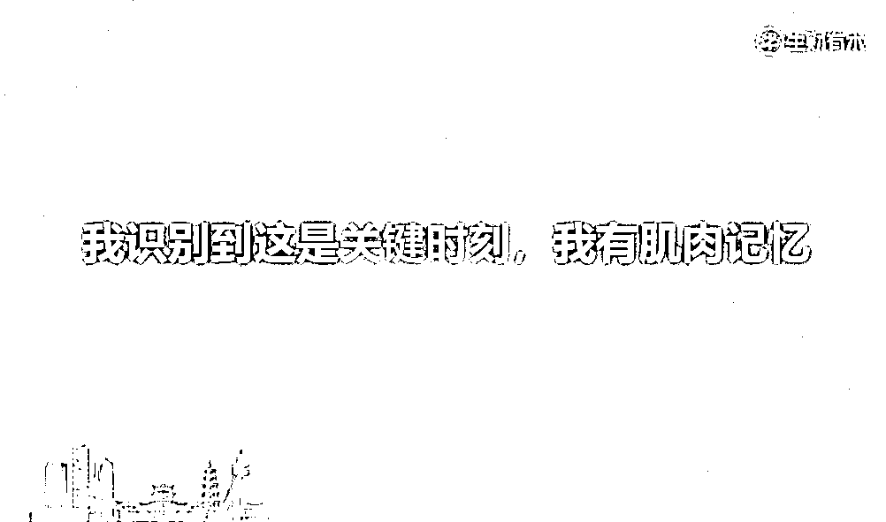

我当时识别到这其实是一个关键时刻，我有肌肉记忆。

在我的记忆里我经历过很多这样的时候，这种时候一旦你退缩，你的团队就会退缩，这件事情会止步不前。但是如果你前进的话，你的团队就会前进，这件事情就会被坚定的执行。所以我的脑海里浮现一句话，不能犹豫，犹豫就会败北。我告诉团队，“当下不做，过完年，1个月后也不会做。以后我们也不会做。1个犹豫1周就没了，往下传递是无数个犹豫，团队就会止步不前。”

大家可以回想一下自己的业务是不是这个样子，有没有很多犹豫，导致很多业务两三个月都没有任何问题？很多的决策，很多的策略到现在还没有执行。

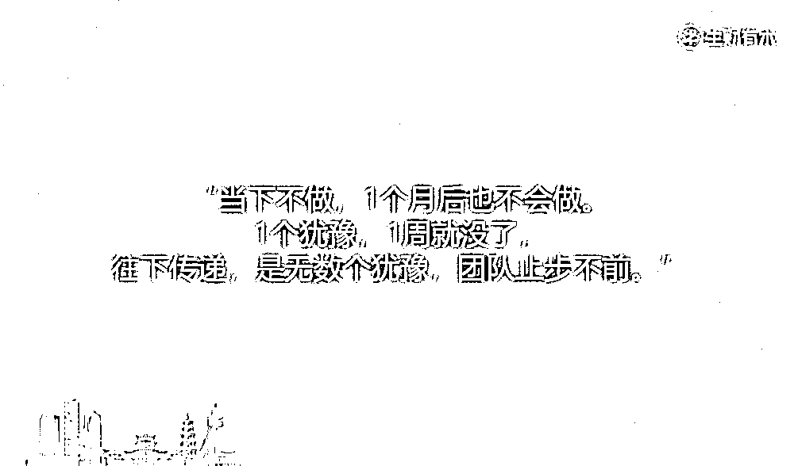

所以这个时候作为 1 号位，我们需要给团队传递的是坚定，我们需要给团队传递的是信心，我说这个方向肯定没有问题，我们一定能做出来。我有大概 9 分的信心可以搞定。当然我们喊口号是不行的，接下来该怎么做？当时我们大概制定了一系列的策略，在那天晚上就开始落地。

一句话，趴在地上认真看。当然我们之前做了很多复盘，就是那天我又做了个复盘，去回溯整个过程，看看问题出在什么地方。去回溯所有之前的用户聊天记录，看里面有什么样的一些问题。然后我开始和各方聊，和执行的同事、和亦仁、和教练、和用户。

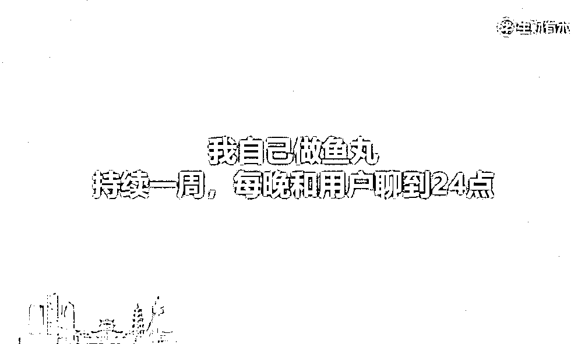

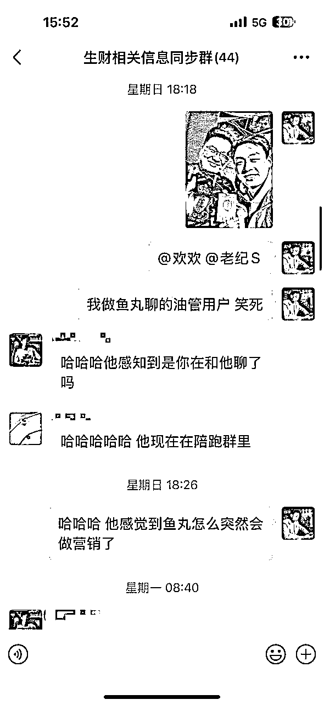

我自己下场做，我自己做鱼丸，持续了一周，当然我白天很忙，所以每天大概从晚上18、19点开始跟用户去聊，聊到23点、24点。去分析用户的预期，去做假设、做实践，一步一步验证。

福州见面会，还碰到了我当时聊的圈友-华仔，晚上我们一起喝了酒。

当然过程中我也发现了关键假设，调整了产品定位，后来再下一个周四，我们顺利达到了PMF的目标。现在进入了产品交付期，用户反馈也不错，后验了确实找对了路子。

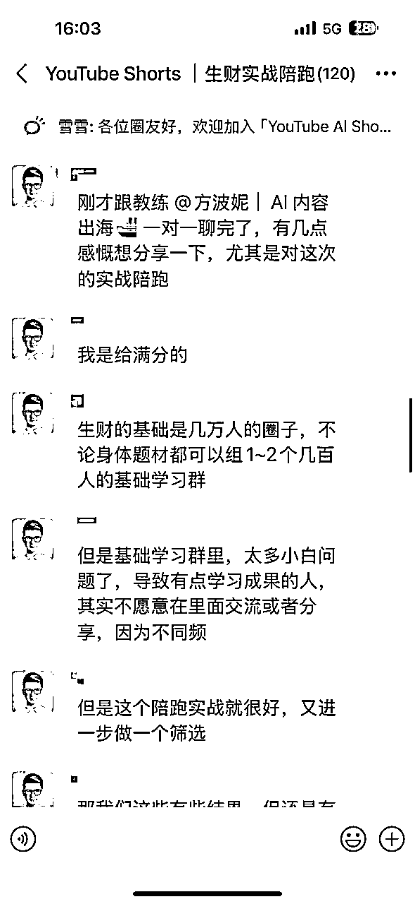

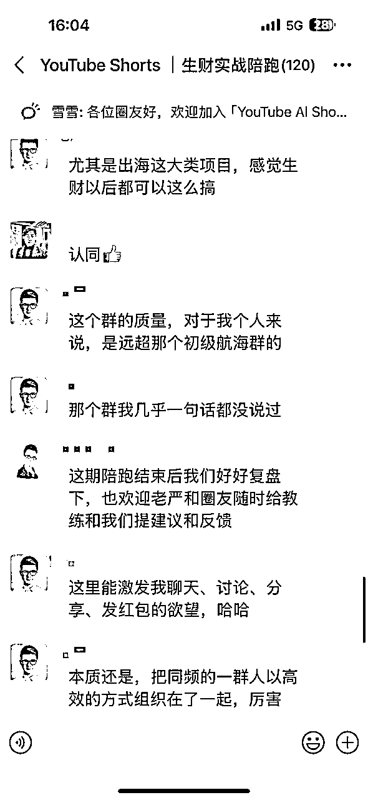

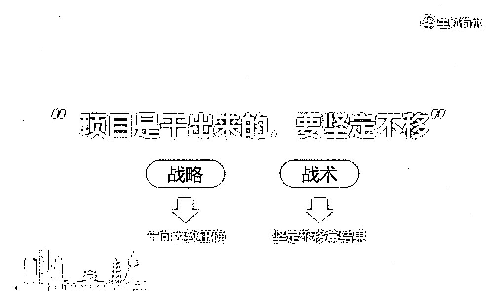

我想表达的是项目是干出来的，这个过程中你要坚定不移，很多时候我们的战略其实只能做到方向大致正确。但其实过程中你的战术是在不断的调整，你要不断的试错，不断的去试方向，甚至说你试着试着整体战略都会改变。

当然过程中更重要的是你要有勇气，你要在看不见的时候相信大方向，你要在大家迷茫犹豫的时候坚定果断，发大勇猛心，破一切障碍。现在大家喜欢聊创始人模式，我是这么理解创始人模式的，创始人无路可退，因为你是第一责任人，如果你这个公司挂掉，那确实你就挂掉了一些，你一切都没有，所以你能不能切换到创始人模式，你能不能抱着一个必死的决心去做事情，我认为结果会非常不一样。

# 3：一个关于选择的故事

请问大家会如何选择？这个大V是你关注多年的。

如果再补一个条件呢？

我相信大多数人会选择副业兼职，如果在财经圈有所建树和发展，才会选择全职去做。这是一个非常科学的，也是相对来说不确定性会降低的一个选择，

那这个故事的主人公做了匪夷所思的选择，他把自己创业的业务完全切割掉退出了，然后他去了这个大V的城市，一直做了2-3年的助理。他叫保彪，也是生财的圈友，是航海家。当然彪哥现在也成为了一名全网知名的财经博主，200万的粉丝，个人每年的收入也远远的超过了当时创业年利润。

为什么会跟大家分享这个故事呢？这是关于选择的故事，但背后我认为是这是一个关于勇气的故事，也就是我们刚说的方向大致正确。你需要有一头扎进去的勇气，保镖做的是基于「助贷服务：帮助外地炒房客解决贷款加杠杆问题」业务，19 年房产还在增长，但明显这是一个基于信息差，或者资源差的业务，它是不长久的；做公众号、做博主做IP，整体的天花板和收益空间是更高的。

意味着你的战略要发生翻天覆地的变化，你要放弃了你现有业务，投身到一个陌生、但天花板更高的领域里，你还可能会失败。

这个取舍节点，我认为靠算账是算不出来的，这是大账不是小账，只能做到战略大致正确——做财经博主，和我一个喜欢的博主贴身学了几年，可能让我有一个天花板更高的未来，

这个时候能够支撑你的，我认为最重要的是勇气，是勇往直前。

当然他那几年也并非一帆风顺，小挫折不断，甚至遇到几次大的变动和波折，后来也和那位博主分开。我们从结果上来看，当然他是成功了。但支撑他能成功的是什么？我觉得大家可以认真思考下。我认为不是那个选择本身，就算当时选择继续创业，甚至选择了其他事情，他依然会在人生的其他道路上拿到结果，反馈到自身的感受和财富的积累，应该会是相似的。

珍贵的是敢于做取舍的勇气，敢于去放弃，敢于去冒险去失败，敢于从0到1的勇气。

“勇气”是一直存在的，方向的对错是后验的。

# 4：南极的故事还没完

最后我们call back一下，南极的故事。

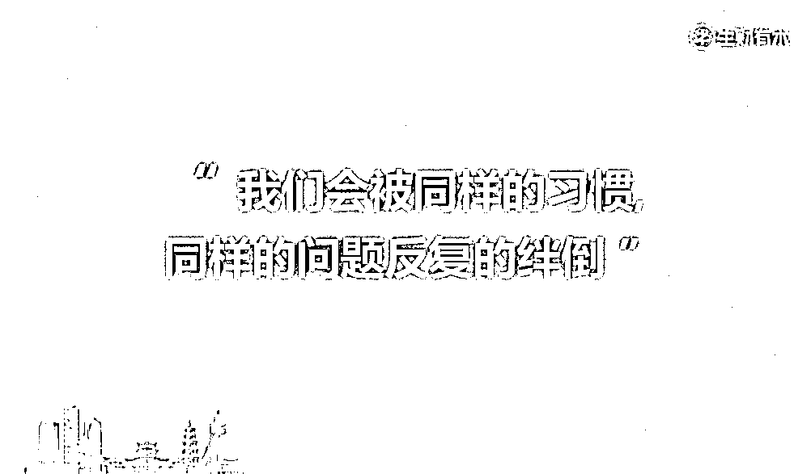

其实斯科特他不是第一次冲击南极点，他 10 年前是来过一次的，但他失败了，那次也是因为食物准备不足，所以导致了他得了败血症，最后放弃掉了。大家记得他们团队死因就是因为食物不足。所以同一个错误连续犯了两次，同一个致命的错误。

我们会被同样的习惯，同样的问题，反复的绊倒，大家扪心自问一下，是不是这个样子？

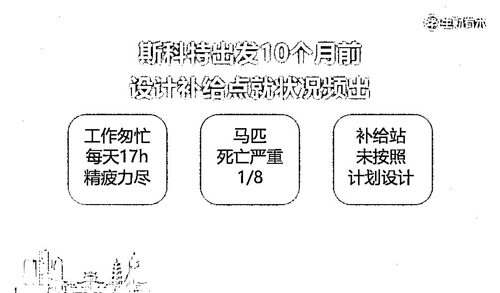

1、出发前的10 个月，两个团队已经抵达了南极。这个时候他们需要出发数次设置补给点，最远设置在380公里的位置。这几次补给点设置，我们可以理解为是团队的预演，有点我们现在提的MVP的感觉。阿蒙森团队都非常的顺利，但斯科特团队状况频出。

2、团队人员安排不科学，导致大家又匆忙又累；这次补给，其实已经冻死了不少马匹，而且当时他们是牵着狗和马一起出现，导致狗饿了会咬死马。但我不理解为什么最后出发还是带着马。

3、是它的突击点，其实没有按照计划设计最后一个点位，如果按照计划设计的位置的，会再往前 70 多公里的位置。大家记得他最后是倒在了离补给点17 公里的地方。也就是说如果他按照计划执行，他不会死掉。

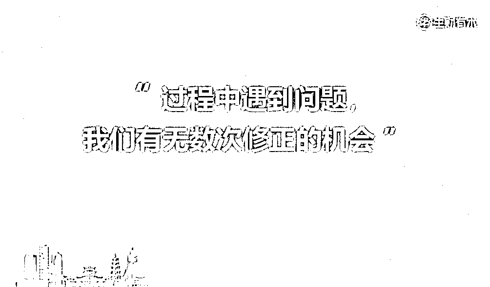

所以过程中其实你遇到问题，我们是有无数次修正的机会。

大家日常在做业务的过程中，我相信是相同的，其实相关的问题、相应的迹象已经反复出现了，你会不会视而不见？大家有没有重视？有没有趴在地上看，问题到底出在哪里？有没有识别清楚什么是关键的问题？

无数次的机会是给了斯科特的，他作为 1 号位没有去解决这些问题，这个是导致他们团队全军覆没的最大原因。

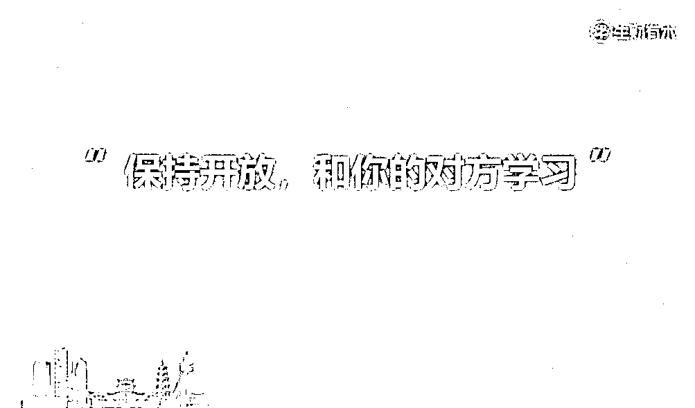

沙克尔顿

是位英国人，这个男人是这次南极点冒险前，地球上最了解南极的男人，大家还记得开场我提到的罗斯海。沙克尔顿发现了罗斯海，罗斯冰架的南海岸，证明不是群岛是大陆。但当时他没有能力直接去到达南极点，他返回了英国，被授予了上尉的勋章（高于斯科特的职位）。

其实沙克尔顿当时请求加入这支探险队。至少允许他来访。他认为，自己在南极的失败教训，有助于斯科特的成功。

那我们就很好奇，那这个英国团队不带着他呢？

因为这个人曾经是斯科特的下属，还被斯科特开除过。但后来人家探险屡创佳绩，做的职位又比斯科特高。所以斯科特拒绝了，甚至不愿意见到这位老部下。

这实在是让人遗憾的。试想一下如果这个人加入的话会怎么样？或者至少他俩聊过一次会怎么样？

我认为这支英国团队至少不会死，而且极有可能在南极点争夺中获胜。

所以我认为保持开放真的太重要了，降低你的ego，保持开放、谦虚低调去学习，甚至去和你的对手学习。

所以这也是我们的价值观，利他、真诚、开放，我们相信发声赚钱会比闷声赚钱走得更远，因为当你发声，你会吸引更多同频的人。好的赚钱机会、好的项目机会一定是28原则的，强者越强。越会赚钱的人机会越多，越会做项目的人项目越多。而对于我们普通人来讲，我们能做的应该被这些人看见，应该吸引这些人的合作。

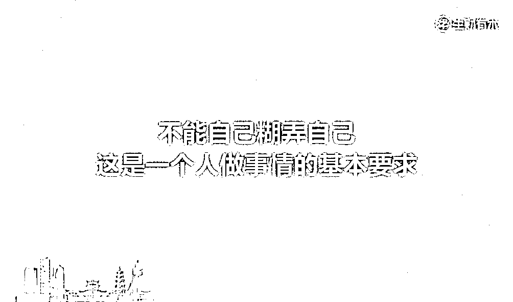

最后，希望大家问问自己。你真的行动了吗？你自己的各个环节摸清楚了吗？你听了别人说的你就信了吗？听了你的下属、你的市场、你的用户、你的竞品讲的，你真的信了吗？你自己有没有趴在地上把业务搞清楚？

我认为不能让别人糊弄自己，但更重要的是不能自己糊弄自己，这是一个人做事情的基本要求。

最后祝愿大家【躬身入局，把手弄脏】，2025一起生财有术！