# 结合本地知识库，让Deepseek帮你出题

> 来源：[https://jye96fr7e2.feishu.cn/docx/PYA9dAudcody2Sx8Uk8cJKqlnXe](https://jye96fr7e2.feishu.cn/docx/PYA9dAudcody2Sx8Uk8cJKqlnXe)

对于教师来说，出题是工作中比较费时间的事情，我问了一些教师朋友，他们平时出一份试卷都是要几个老师分工也要几天的时间。我探索了一下如何用deepseek出试卷，现在把方法分享给大家，做为参考。

教程内容包括四个部分：

1.  Cherry Studio的安装和DK的关联

1.  知识库的设置

1.  目前的不足和解决方法

1.  知识库使用方法

已经知道如何在部署deepseek和使用cherry studio的朋友，可以直接跳转到使用方法的部分。

* * *

# 一、Cherry Studio的安装和Deepseek的关联

## 下载并安装cherry Studio

*   下载网址：https://cherry-ai.com/

*   点击【下载客户端】，跳转之后点下载，如果觉得速度慢也可以选择网盘下载

*   打开下载好的文件（不要安装在系统盘就可以了）

## 获取API_KEY（以派欧云为例）

*   打开并注册硅基流动

*   https://ppinfra.com/user/register

*   新注册用户送5元的代金券体验，大约500万tokens的DK额度

*   输入邀请码：【2OD5AF】，可以额外获得15元的代金券

*   完成实名认证

*   登陆之后，在右上角点击头像，找到【账号管理】

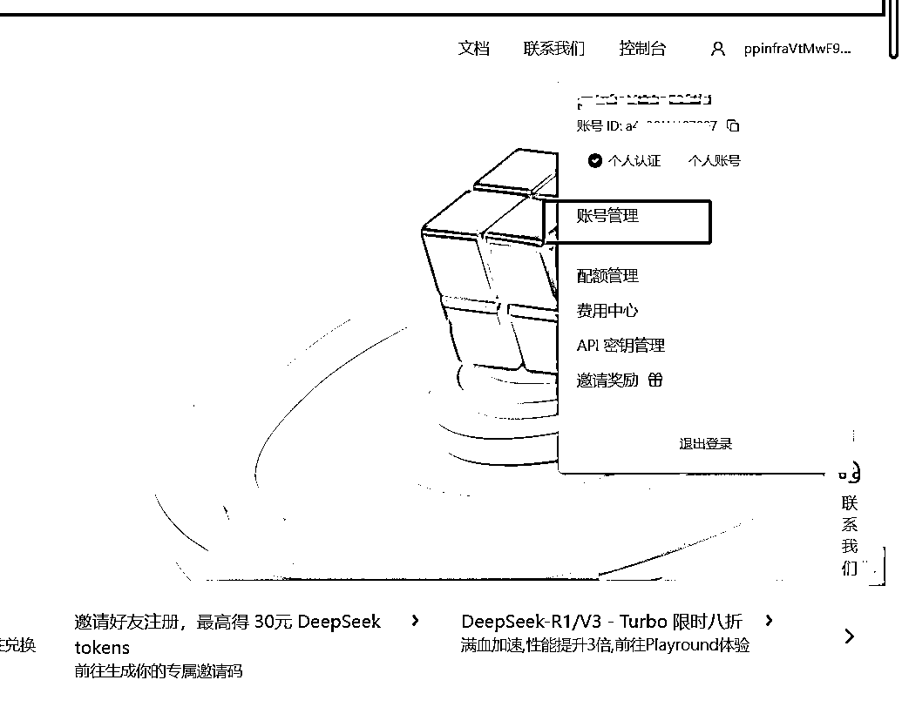

*   进入【账号管理后】，在左侧菜单栏找到【实名认证】，按照指导步骤进行认证

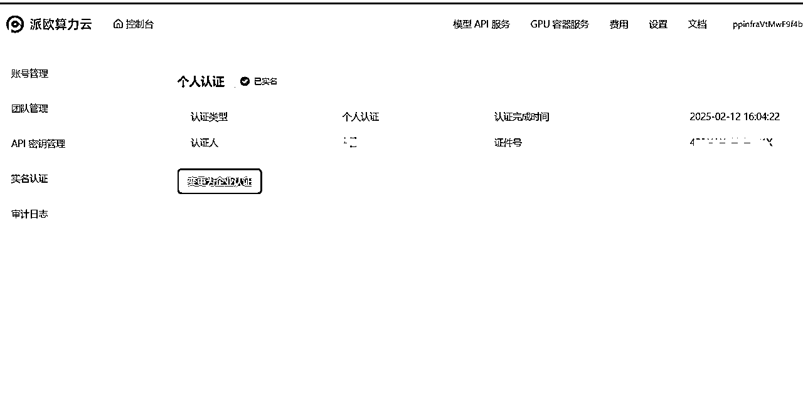

*   获取API_KEY

*   在【账号管理】的左侧的菜单栏中，点击【API密匙管理】→【创建】

*   在弹出的窗口中，随便输入一个名称，确认。

*   确认之后会弹出一个新的窗口，点击【复制】（非常重要，因为密钥出现之后就不会显示完整的，忘记复制就只能删除重新创建），点击【我已保存】关闭窗口

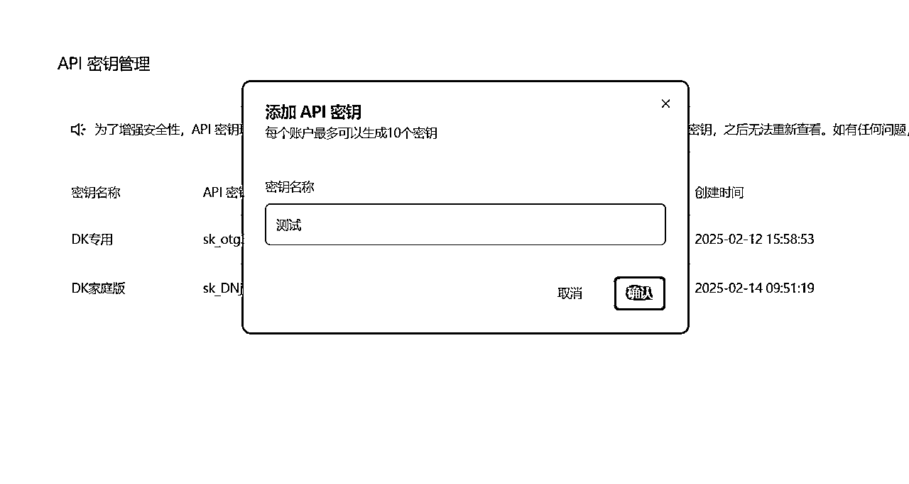

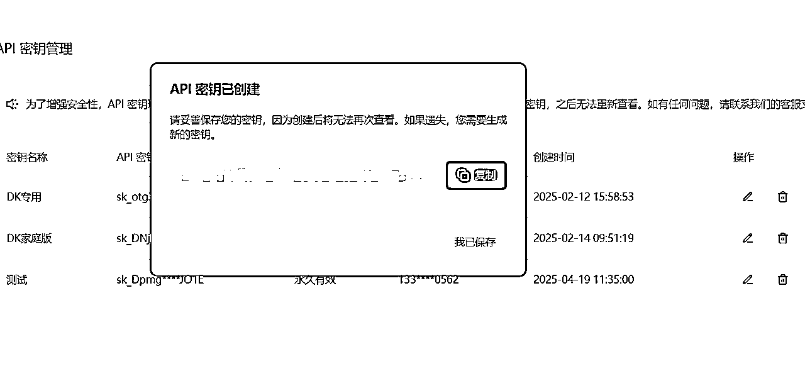

## 配置Cherry Studio

*   添加派欧云服务

*   打开Cherry Studio→设置→模型服务→添加→提供服务商名称：派欧云→确认

*   配置模型

*   先输入第二步复制的API_KEY

*   再粘贴API网址：https://api.ppinfra.com/v3/openai

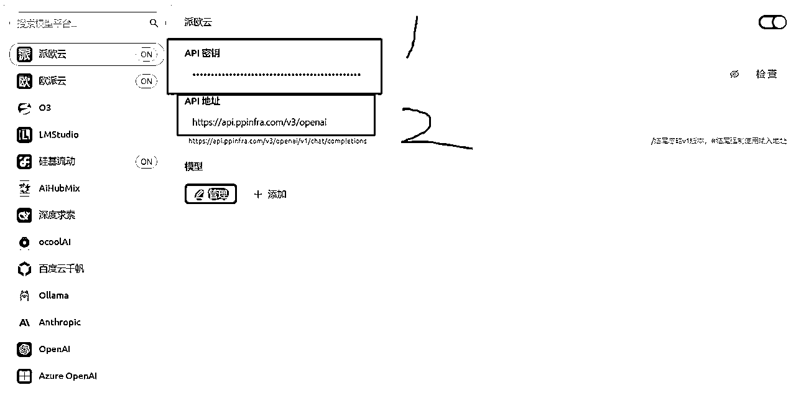

*   添加模型

*   点击管理，然后添加deepseek-r1模型

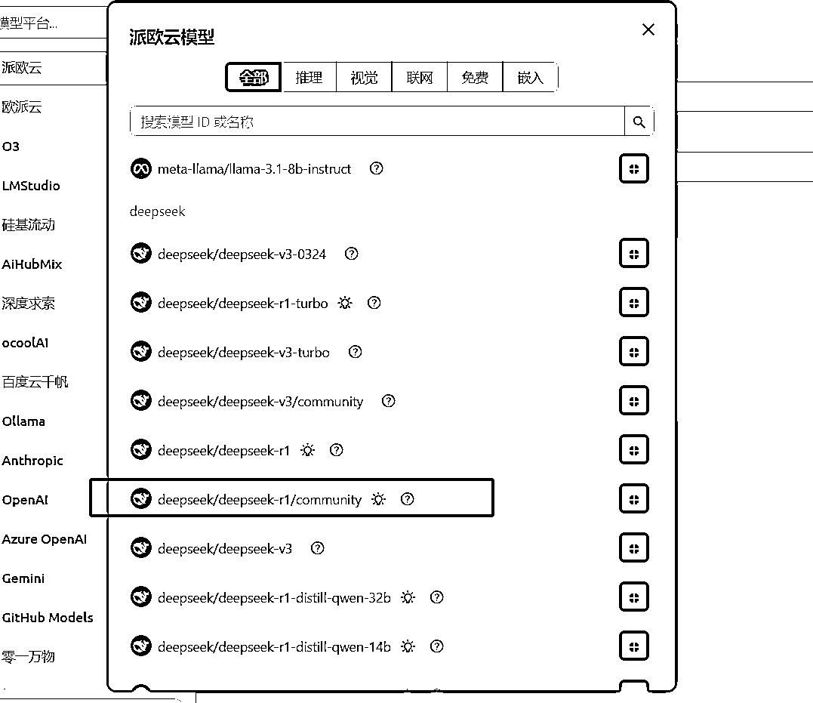

到这一步，前期的设置工作就已经完成了，Cherry Studio还支持很多其他平台，方法大致相同，大家可以自己试一下。

# 二、知识库的设置

## （1）配置教程：

### 打开Cherry Studio→知识库→添加

### 输入名称→选择嵌入模型

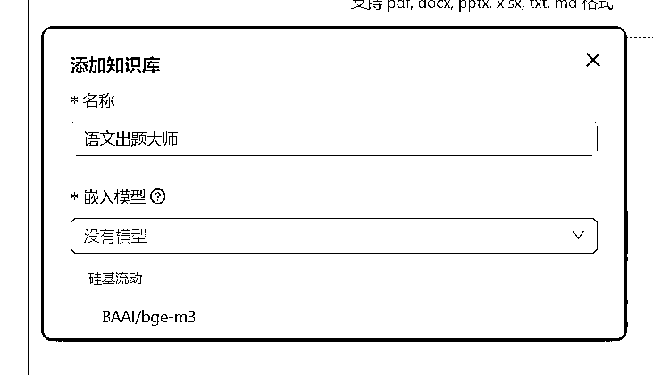

#### 嵌入模型可以理解为是专门用来处理文件的模型，把我们上传的文件处理成数据储存起来，以便后期其他的聊天模型调用。

#### 派欧云没有嵌入模型，所以需要再申请一个平台的API，这里推荐硅基流动，申请方法跟上面的一样。

#### 不同的平台提供的嵌入模型不同，有些平台没有的话，也可以同时开启几个平台的服务。

### 上传资料

Cherry Studio的知识库中，可以上传文件、目录、网址、网站、笔记；这次用到的是前两项，就只介绍前两项，其他的大家可以自己测试是什么效果。

*   文件：上传单个文件，可以选择添加，也可以拖拽，文件内容有修改，点击刷新会更新数据库

*   目录：上传文件夹中的所有文件，文件夹中的文件有修改或增减，点击刷新会更新数据库

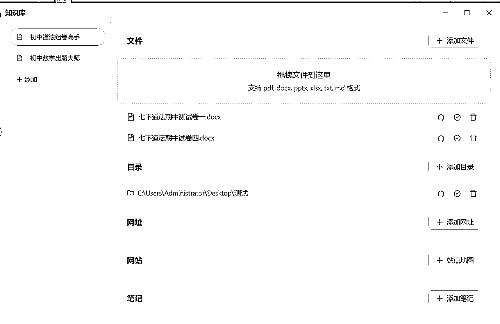

## （2）使用教程

### 打开cherry studio→助手→添加助手→默认助手

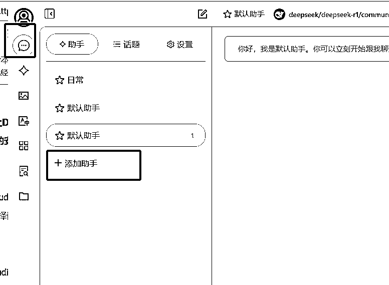

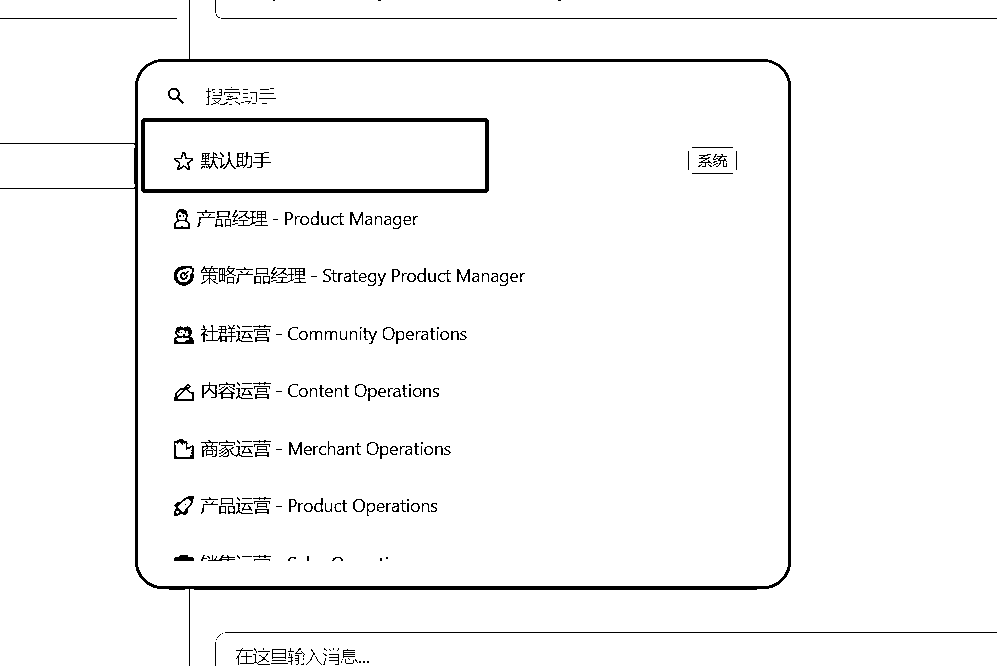

### 右键→编辑助手

进入编辑助手，修改助手的名称（提示词可填可不填），然后选择知识库设置，选择相应的知识库

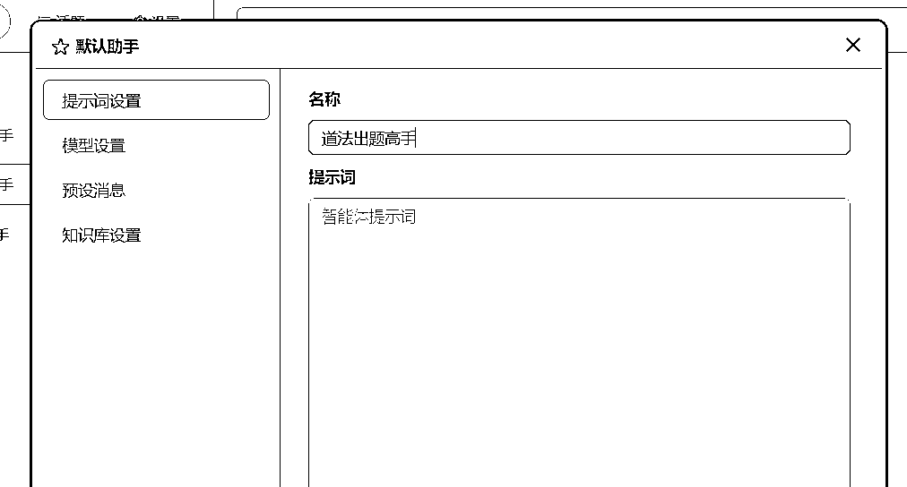

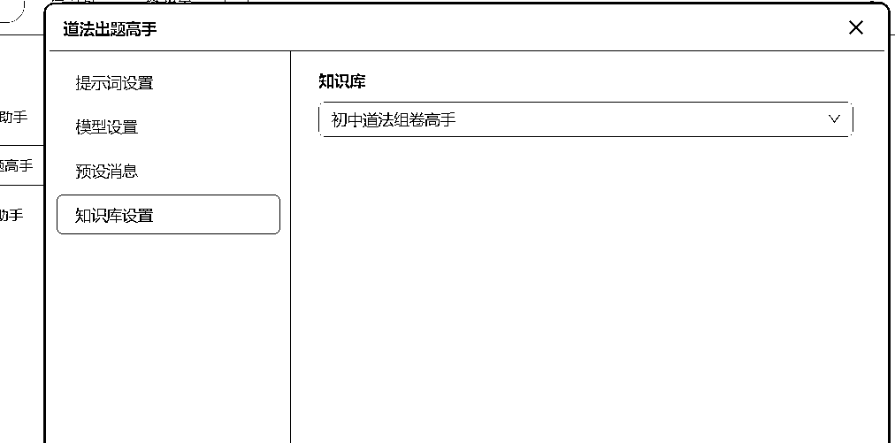

### 对话框正常聊天

上面已经设置好了知识库，出题的过程就很简单了，说清楚你的需求就可以了。你的需求表达得越清楚，DK给出的答案就越准确。

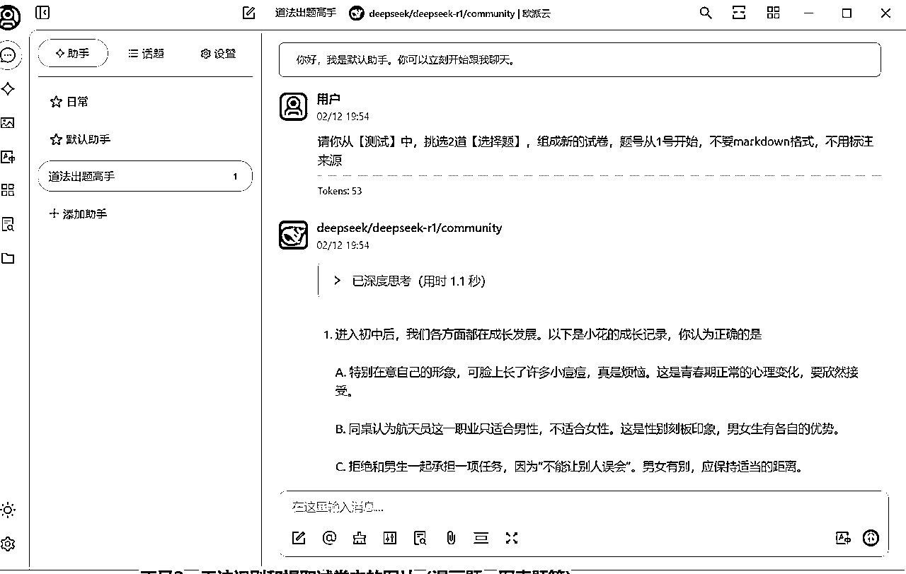

# 三、目前的不足和解决方法

### 不足1：只能对纯文字内容进行处理并储存到知识库，扫描件、图片无法处理

解决方案：先用kimi对文件进行处理，保存成word文档之后再上传到知识库（Cherry Studio可以直接唤起kimi，不用另外打开网页）

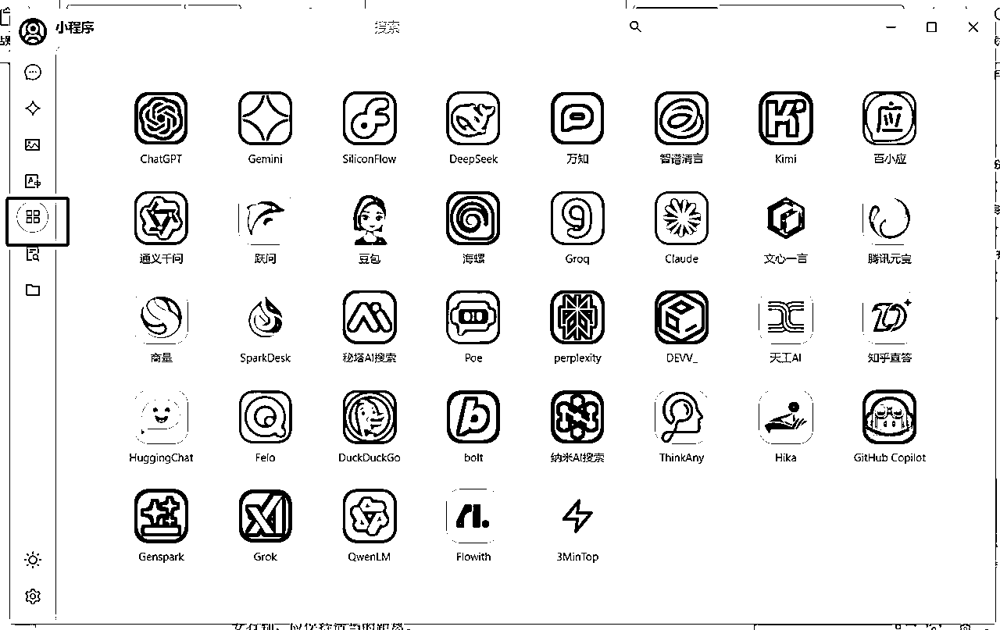

#### 参考提示词：

请你把文件中的内容完整的转换成文字，顺序不变，不要markdown格式

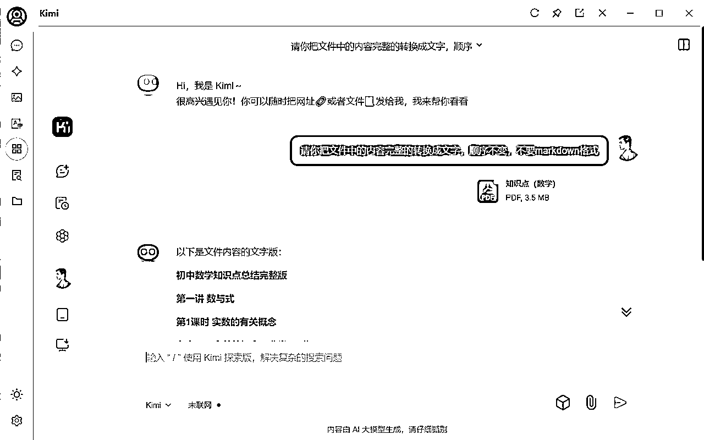

### 不足2：无法识别和提取试卷中的图片（漫画题、图表题等）

解决方案：排版的时候，自己找到原文截图排版；可以通过助手快速定位到原文

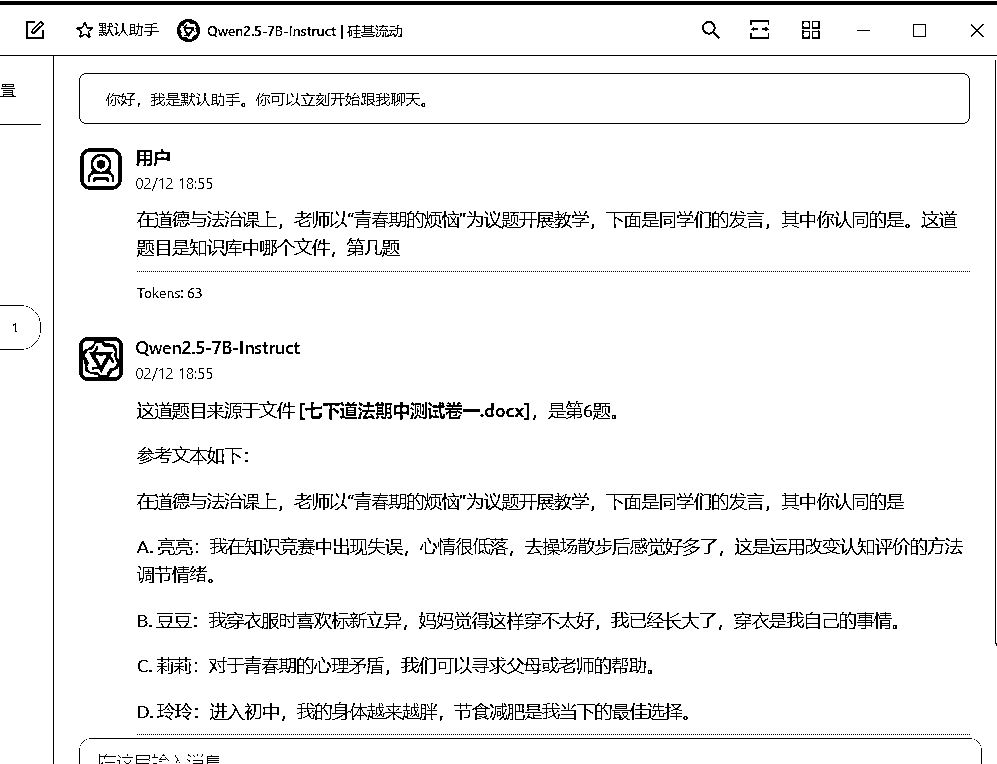

# 四、知识库使用方法

我按照DK的工作方式，分成了两种使用方法：组卷高手和出题大师

## 组卷高手

说明：DK扮演的角色是一个组卷的老师，按照用户的要求，从知识库中挑选题目，组成一份新的试卷，并不需要它原创题目。

优点：迅速、对知识库整理要求低、大模型回答内容质量较高

缺点：灵活度不够，原创度不够

适用：重要程度不高的考试，比如单元测试、月考、模拟考等

### 参考提示词：

请你从【XXXX（文件夹名称）】中，挑选XXX道【题型】，组成新的试卷。题号从X号开始，不要markdown格式，不要标注来源。

（提示词不固定，只是给大家一个思路。前半部分是限定选题的范围，后半部分是为了后期排版方便。大家可以根据自己的实际测试出更适合自己的提示词）

这个用法就很简单，只要上传足够多的试卷，然后限定DK的选择范围就可以了，这里其实也可以用DK-V3模型或者是其他的大模型，因为不涉及到思考和推理。

## 出题高手

说明：DK扮演的角色是一个出题的老师，按照用户的要求，根据知识库中的出题规范和考察的知识点，进行原创出题。

优点：充分利用DK的推理能力，题目原创度高

缺点：对知识库内容质量要求比较高

适用：对题目原创度有要求的考试

### 参考提示词：

请你出XX道【题型】，主要考察【知识点1】、【知识点2】。。。，出题要求要符合【出题规范】中的要求，题号从X号开始，不要markdown格式，不要标注来源。

要让DK原创题目，两个必不可少的资料：知识点、出题规范。

这两个资料的作用，是限制DK的发挥，让它在限定的范围内去思考。因为DK的推理能力是非常强的，考虑的面是非常广的。如果不做限制的话，它给出的答案很有可能就不是我们想要的。

没有限制条件，你的DK就是一个什么都懂，但是说出来的东西就是不符合你要求的助手。

知识点和出题规范，就要根据不同的学科，自己的实际情况去整理了。

* * *

# 结语

Ai带给我们的，是工作方式的改变，我们应该主动拥抱变化，让Ai赋能我们，放大自身的独特的一面。

我是宁十七，在职场搞副业

专注分享个人成长丨Ai提效丨副业赚钱