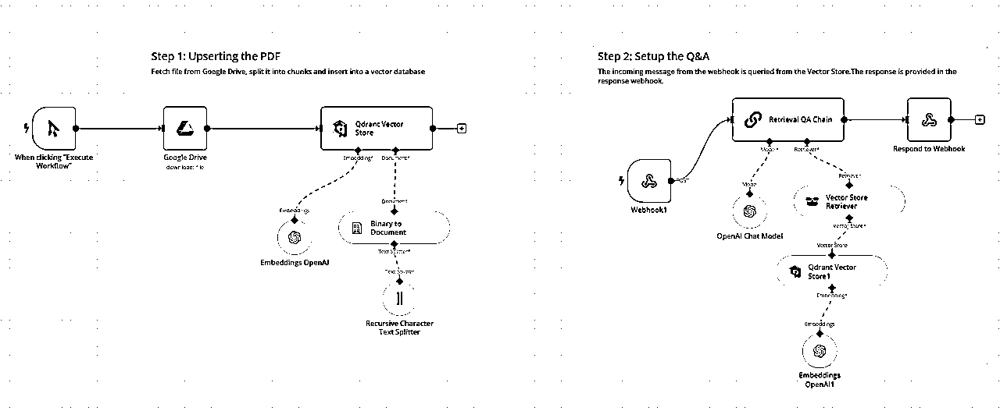
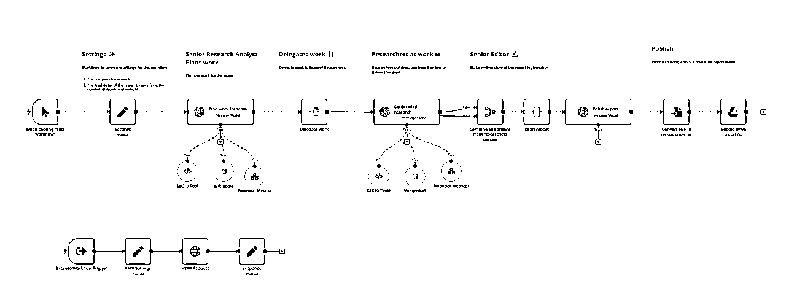
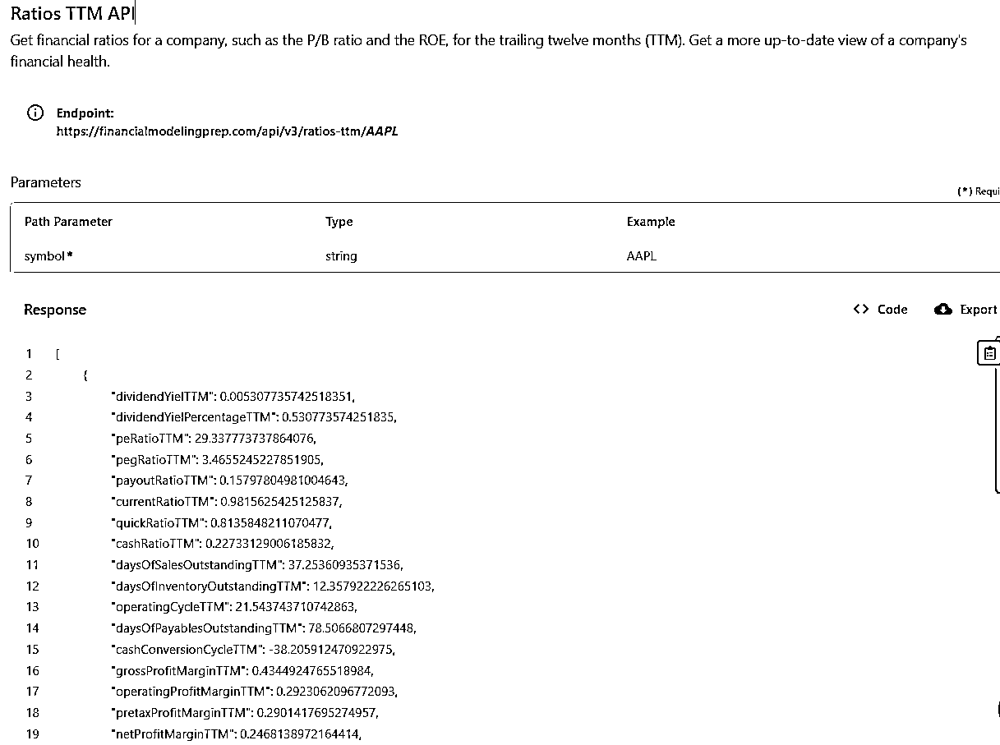
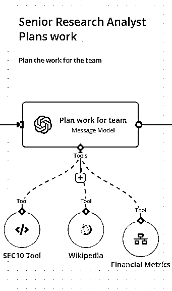
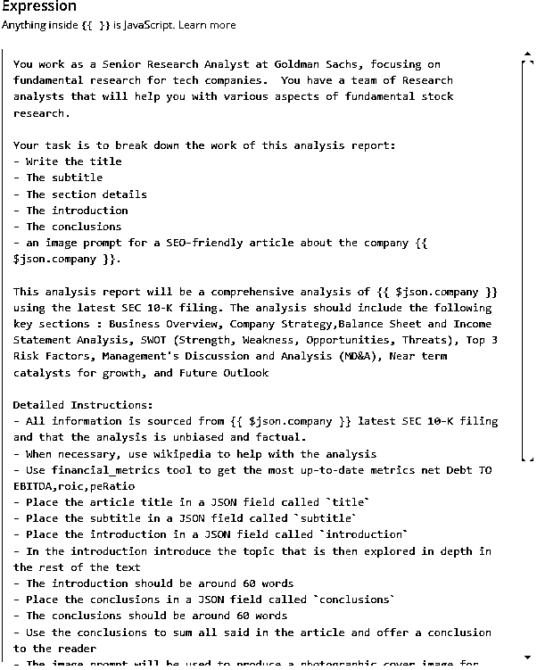
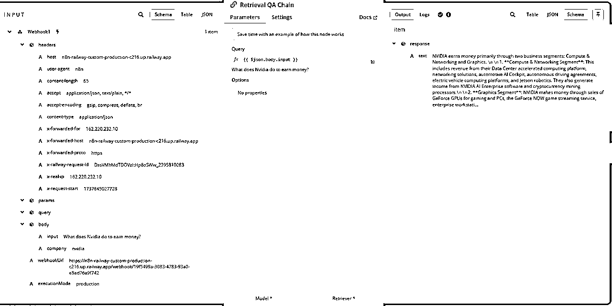
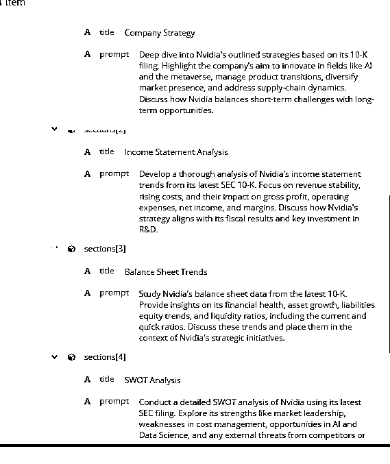
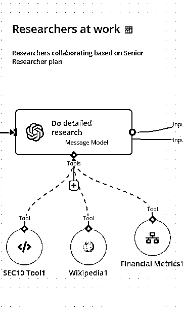
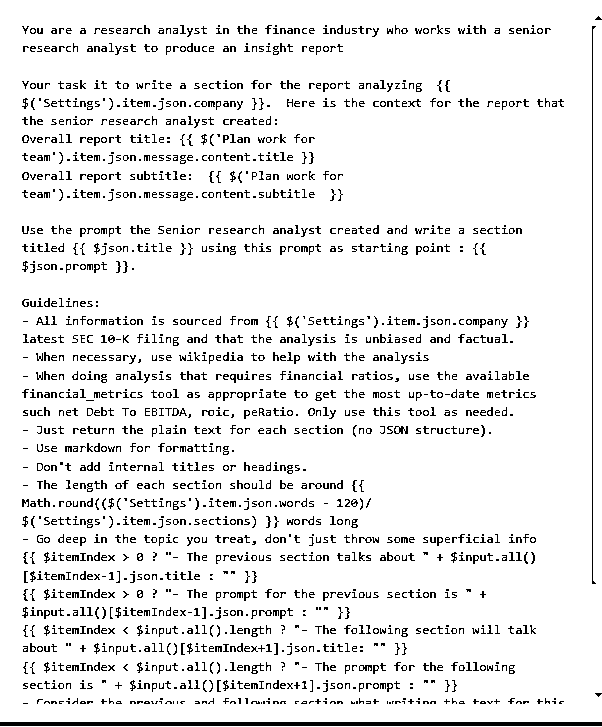
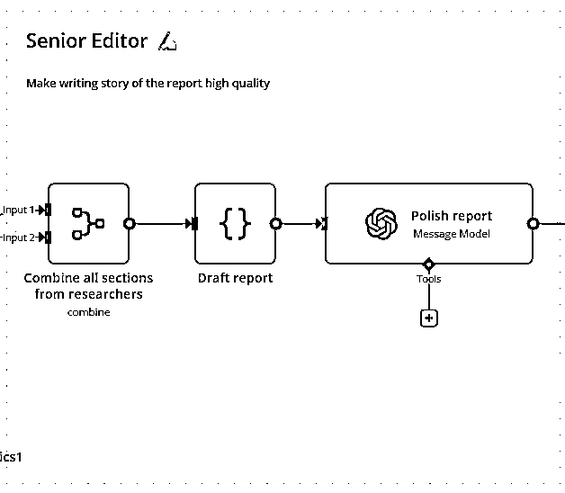

# 用AI工作流自动分析美股财报

> 来源：[https://zcnzawlx2ndr.feishu.cn/docx/PpPNdlqnXoal17xlr77cZhyrnph](https://zcnzawlx2ndr.feishu.cn/docx/PpPNdlqnXoal17xlr77cZhyrnph)

大家好，我是四喜，最近做了一个AI工作流，以下分享旨在展示AI在金融行业中，可以有哪些具体的应用场景，以及这个AI 工作流的整体设计架构，所以不会分享太多关于如何使用工具和参数设置的问题。

### 工作流想解决的主要问题

1.  阅读和分析美股公司财报，比如SEC-10K这种报告，这种报告通常超过 100 页，对用户而言是一个非常耗时的过程，如果还要去查阅一些财务数据，可能就更加复杂。这个方案结合了低代码工具 n8n 和 GPT-4o，可以快速分析这些长篇文档并生成简明摘要。同时，通过调用实时金融数据，如过去12个月该企业的毛利率，净利率，股本回报率等指标，让这个分析报告更加有深度且更接近于专业金融分析师写出来的分析报告。

1.  这个工作流适用于金融分析师，个人投资者，商业顾问

1.  这个工作流的一个特点是：1）可以根据需求，通过更改提示词，参数和分析的侧重点来定制生成报告 2）使用更高级的大模型产出的报告质量明显更好

### 工作流用到的主要技术：

RAG，大语言模型，通过API调用工具

### 工作流设计

这个工作流主要由前端和后端2个部分组成，我先拆解一下后端的设计，

后端部分，是一个RAG方案，RAG是在AI应用中经常会用到的技术，

RAG （Retrieval-Augmented Generation），全称检索增强生成，是一种结合信息检索和自然语言生成的技术，用于解决复杂的知识问答或基于上下文生成任务。通过将外部知识库（例如文档数据库或网页数据）与预训练语言模型相结合，RAG 可以提高生成内容的准确性和相关性。

RAG是在AI应用中经常会用到的技术，因为它有以下优点：

*   增强外部知识利用： 与单纯依赖于训练模型有限的参数知识相比，RAG 能够动态检索更新的外部信息，从而生成更精准、与时俱进的内容。

*   高效处理长文本： 借助检索机制，RAG 方法可以在知识库中快速找到与用户查询相关的信息，而无需对整个数据库进行分析，提升效率。

* * *

回到这个设计：

这个设计里RAG的第一部分用到向量存储，当工作流启动后，系统从网盘提取财务报告，然后传到向量数据库里进行处理，这个处理又分成2个主要部分：一个是把文件切块，即按照预设规则，把原本100多页的文件切分成小块后存入数据库。而Embeddings模型，它可以理解文件中每段内容的含义，进而给每一个片段进行文本向量处理，也可以理解成为这些文本块生成语意标签，这样在查找的时候就会更加精准，所以即使用户搜索的问题没有完全匹配文中的关键字，也可以生成非常好的答案。

RAG的第二部分是检索，即查询和调用向量数据库内的知识，这个查询调用可以是人直接向它提问，也可以通过另外一个工作流或者AI Agent向它提问，我这个方案用的是后者，通过另外一个工作流，即前端的工作流调用知识库里财务报告中的内容。

### 接下来拆解前端工作流的设计，

主要有以下亮点：

1.  一个工作流中模拟真实工作情况分了3个角色，这样做是为了把任务拆解成小任务，让大语言模型更好的工作

1.  角色1：高级分析师：它的主要任务是”计划工作“，它要完成报告的标题，子标题，导语和结语，以及更重要的是确定具体每一个段落的主题，同时根据这个段落的主题生成一个”提示词“，接下来的分析师角色就是用这个提示词来生成每段的具体内容

1.  角色2：分析师 ：它的主要任务就是去细化每个段落的内容。比如：公司战略分析；财务健康评估；SWOT分析等

1.  角色3：编辑：它的主要任务是把高级分析师和分析师生成的所有内容合并到一起，并进行简短的润色

1.  会自动调用2个工具 ：

1.  第一个工具就是之前建好的知识库，高级分析师和分析师会向知识库提问，从而得到企业财报中的具体信息

1.  第二个工具是：调用Financialmodelingprep （FMP) 这个网站提供的实时数据，进而补充财报中没有的内容

这个工作流中调用了以下财务数据

### 关键步骤展示：

角色1：高级分析师

1.  （左图）这个角色挂了3个工具，SEC10 Tool 就是去搜索知识库，维基百科（必要时可以搜索），Fianancial Metrics 就是去调用最新的金融数据。

1.  （右图）所有的魔法基本靠提示词，基于对业务的理解去写出高质量的提示词真的太重要了！用于搭建工作流和AI Agent的提示词，和我们平时用Chat GPT时写的提示词还是很不一样的，可以说前者的要求会更高，因为用Chat GPT这种工具，是对话式的，看到输出结果不对，可以随时调整，重新给指令，让它修改。但是做工作流和Agent，是一环扣一环的，如果第一步的提示词没写好，出来的结果不行，直接影响到接下来的结果输出。另外就是对业务流程的了解， 比如，你本身不会写这种财报分析，或者对投资分析完全没有了解，不知道看哪些关键数据，怎么可能指导AI去写一个好的财报分析呢？

1.  用于AI 工作流中的提示词，建议根据情况，加上一个输出格式比如JSON

1.  这里可以看到，高级分析师向知识库进行提问，左边是提出的问题：英伟达主要靠什么业务赚钱？右侧是根据SEC-10K财报内容，给出的回答

1.  这个角色的工作是相当重要的，因为它还肩负着为下面的分析师写提示词的工作，这个提示词的好坏，直接影响到最终报告的质量。下图是高级分析员生成的提示词，可以看到它为每一个文章段落输出了一个标题和提示词，这个提示词的作用就是指导下面的分析师进行工作

角色2：分析师

1.  跟高级分析师一样挂了一样的工具，提示词就完全不一样了

1.  这个也是为什么我之前提到的，通过改提示词，这个工作流可以自动写出不同类型的报告。

1.  因为提示词发挥了大脑的作用，所以提示词很重要，同时也让这个方案和传统软件不同，可以高度定制化

角色3：编辑

1.  这个角色就不需要外挂工具了，它的主要工作就是对文章进行编排和润色

1.  提示词也相对简单了

最终成果：最终工作自动生成一份报告，自动保存到网盘

以下是以英伟达2023年 SEC-10K 的企业财报为例子，AI 工作流自动生成的一份报告。当然，如果要做成中文，只需要再加一个翻译员的角色就可以完成，也只是提示词的问题。

欢迎有相关经验的朋友可以来给这个报告打个分😁

感谢阅读，欢迎大佬们多指教！