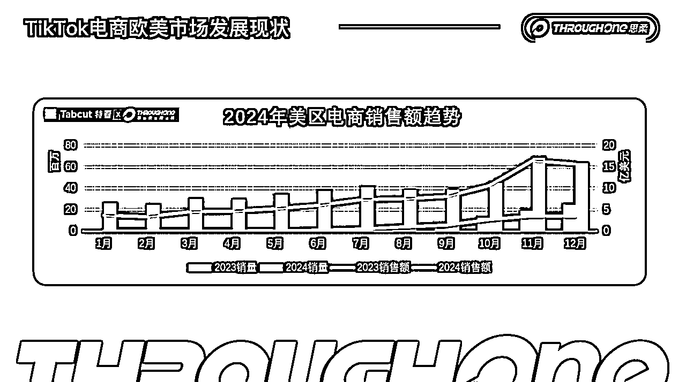
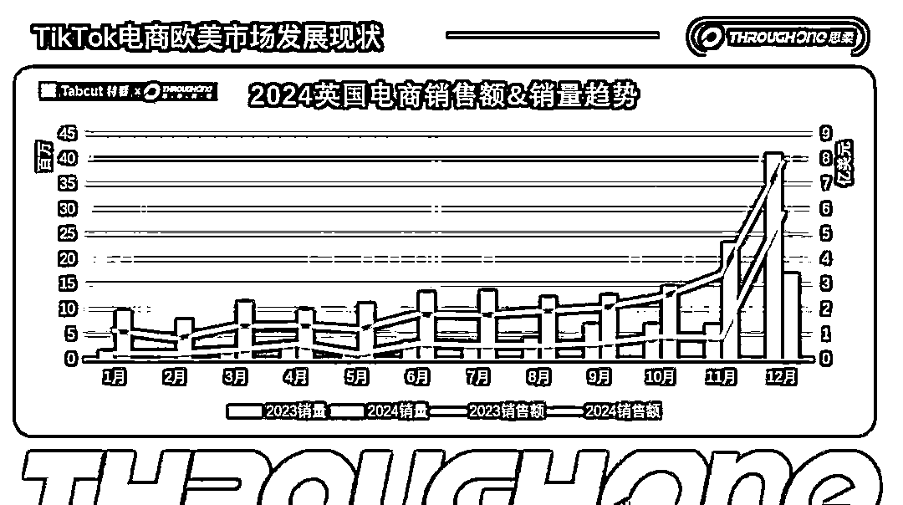

# 2025年TikTok欧美有哪些切入机会

> 来源：[https://throughone.feishu.cn/docx/Q1ezdaoUSo4zyrxe3q4cVFOvnEr](https://throughone.feishu.cn/docx/Q1ezdaoUSo4zyrxe3q4cVFOvnEr)

朋友们新年快乐，开工大吉。这篇文章给大家分享一下TikTok欧洲与美洲市场在2025年的切入机会，期待在新年伊始可以帮助大家梳理一下整体的业务思路。（全文6000字，阅读约12-15分钟）

对TikTok欧美市场不熟悉不了解的小伙伴可以从头开始读，对市场有一定认知的小伙伴可以从第二部分开始读。

### 一、TikTok欧美电商：市场现状分析

TikTok自从2017年推出以来，不仅在社交平台上占据了显著的份额，而且在电商领域也表现出了巨大的增长潜力。TikTok通过独特的短视频内容和创作者生态，极大地推动了电商业务的创新和发展。

#### 美国市场

我们先来看美国市场。

2024年美区电商销售额趋势（来源：Tabcut特看）

上图青色的线是2023年销售额的走势，红色的线是2024年销售额的走势。可以看出TikTok在美国市场的销售表现呈现出一定的增长趋势。

2023年下半年，7月份至年底，市场出现了明显的增长趋势，在短短几个月的时间，单日销售额增长了几十倍，这也是大量卖家在2023年底与2024年初涌入TikTok美区电商的原因。

而2024年，尽管全年曲线是在线性增长的，但与市场（平台、商家、机构、达人等）对其的增长预期相比，远远没有达到目标。事实上，TikTok美区在2024年的整体增速仍然较为缓慢，没有出现预想中的指数级增长，也没有看到非常明显的拐点。

从增长空间来看，TikTok目前在美区的市场体量与主流电商平台（如：亚马逊）相比差距巨大，亚马逊在美国的电商体量在千亿美元级别，而TikTok仅在100亿级别，同时TikTok依然是公认的流量洼地，其流量价格非常便宜。这意味着其仍有巨大的发展潜力。

#### 英国市场

接下来看一下英国市场。

2024年英国电商销售额趋势（来源：Tabcut特看）

从上图可以看出，相比于美国，TikTok英国市场表现出了相对强劲的增长。英国市场在2024年初单日销售额可以到200万美元左右，但到了年底则增长至600万美元每天，约为初期的3倍。

对于欧洲市场，TikTok仍持有较高的预期。在2025年，德国、意大利、法国等市场将开放，西班牙和爱尔兰市场已在2025年初进入TikTok电商的视野。通过这些市场的开放，TikTok希望在欧洲地区进一步扩大其电商市场份额。

但这里还是需要给大家提个醒，尽管西班牙市场已经开放了两个月，但从基础建设和数据表现来看，该市场仍处于冷启动阶段，目前表现一般，还不是最好的入场时机。如果现在入场，则需要投入更多的资源和时间才能做到理想的业绩。换言之就是，这些欧洲市场的窗口期还没到，可以再等等。

#### 墨西哥市场

我们再来看一下墨西哥市场，这是在2025年非常有潜力的一个市场。

目前墨西哥市场整体规模在450亿美元左右，为 TikTok 内容电商提供了充足的发展空间。

同时墨西哥接近1.3亿人口中，有三分之二都是 TikTok 用户，这意味着 TikTok 拥有庞大的潜在消费群体。更值得一提的是，这些用户中有接近一半的用户具备较强购买力，消费力也有一定的保障。

再从Shein和Temu在当地的表现来看，增长速度非常迅猛，说明墨西哥市场对中国供应链的接受程度是非常高的。TikTok可借助这一优势，引入丰富的中国商品，满足墨西哥消费者的需求。

此外，墨西哥达人表现极为积极，相比美国达人，他们更渴望通过 TikTok 卖货增加收入。这将促使达人积极创作内容，推广商品，推动 TikTok 电商业务蓬勃发展。

当然，墨西哥市场的物流基建是一个相对较高的门槛，好在TikTok平台目前承接了尾程物流配送，大大降低了商家履约成本，也为许多新进入墨西哥市场的商家扫除了一大障碍。

因此，TikTok在墨西哥电商市场有非常大的机遇。

### 二、TikTok电商的短期与长期机会

接下来我们来看一下2025年有哪些短期机会与长期机会。

这里讲的短期机会通常是指商家能够在短期内通过平台的流量红利和补贴政策迅速获得利润，换言之就是从现在开始做3-6个月就有可能赚钱的业务，但可能并不会有太强的复利效应，有可能随着时间的推移和市场的变化，红利会逐渐衰减甚至消失。

长期机会则是随着时间的推移，核心竞争力会越来越强，业务规模也会越来越大的机会，但很有可能短期内有较大的现金流压力和生存压力。这一类业务是一种做时间的朋友的业务。

#### 短期机会

我们先来看短期机会，这些机会在TikTok电商中表现得尤为明显，尤其是在新市场的开放、平台补贴政策以及短视频流量的激增时，商家能够迅速获取流量并实现盈利。

##### l 新市场的开放

在短期机会方面，我们可以看到，随着新市场的不断开放，商家可以迅速抓住这些机会。例如，墨西哥市场作为TikTok的新兴市场，虽然其市场体量相对较小，但其TikTok的渗透率却非常高。调查数据显示，约2/3的墨西哥人使用TikTok，其中半数以上具有电商购买倾向。因此，墨西哥市场无疑是一个潜力巨大的短期机会。

而西班牙等欧洲市场的电商发展表现相对平稳。西班牙市场已开放两个月，但市场增速并未达到预期。尽管如此，西班牙依然具有一定的潜力，尤其是在本地物流和产品供给方面。相较于欧美其他市场，西班牙的竞争较小，对于中小商家而言，仍然是一个值得考虑的机会。

新市场的机会通常持续三到六个月，平台提供的红利期给商家带来了低成本进入、快速获客的机会。商家如果能够在这个阶段迅速入局，抢占市场份额，将为后续的长期发展积累大量的流量和客户资源。

##### l 自孵化账号

在美区TikTok的电商生态中，最具稳定性的盈利模式并非商家或平台，而是达人。

这些达人通过创作和分享内容（主要是短视频），带动产品销售，并从中获得销售佣金。商家虽然能够通过TikTok获得一定的曝光，但流量和广告费用的高昂常常使得短期内无法盈利。

相比之下，达人通过平台提供的流量和佣金体系，实现了更加稳定的收入来源。商家虽然在初期可能面临亏损，但达人通过平台的推广机制，能够稳定地赚取佣金。达人通过创造与商品相关的优质内容吸引消费者，并将观众引导至商家的产品页面或直播间，这使得他们的收入更加稳定和可预期。

另外对于商家来说，如果没有合适的达人资源，也可以尝试自孵化账号，自己创作内容，通过短视频吸引平台流量，从而实现带货的效果。

##### l TAP机构

TAP机构类似于国内的“团长”模式，其核心作用是为商家寻找达人并达成合作。具体而言，TAP机构为商家提供达人资源，通过搭建联系并撮合达人的合作，获取中介佣金。

对于商家而言，如果没有丰富的达人资源，往往需要依赖第三方机构来帮助他们找到合适的达人进行合作。TAP机构的主要工作就是帮助商家挖掘符合其产品定位的达人资源，并通过达成合作，帮助商家扩大产品的曝光度和销量。

不过，TAP机构的利润空间相对较低。因为TAP机构通常通过在商家给达人佣金中赚取一定比例的中介费用来获利。即便如此，TAP机构在短期内依然有巨大的市场需求，尤其是在新市场和内容供给紧张的情况下，TAP机构可以作为一种非常有效的桥梁，帮助商家迅速拓展市场。

TAP机构的一个关键优势是其低门槛。任何具有一定达人资源或者能够获取达人资源的团队，都可以进入这一领域。

因此，TAP机构适合那些有一定资源积累，但并不具备大规模运营能力的团队，卖家可以根据自身情况，分析自身是否适合开展TAP业务。

然而，从长期来看，TAP机构难以积累长期的达人资源，这也是其面临的最大挑战。因为商家始终在变化，不同商家对达人资源的需求不同，这使得TAP机构无法持续为同一批达人提供稳定的合作机会。

##### l 闭环短视频+投放

最后一个短期机会是TikTok闭环短视频+广告投放。这个模式是TikTok美区在2024年迭代和发展过程中，特别适用于内容电商平台的业务。

TikTok平台的流量来源主要包括短视频和直播，其中，短视频一直是TikTok美区单量的主力来源。然而，单纯依赖自然流量的短视频很难满足商家大规模获利的需求。为了提高效率，短视频+广告投放成为了商家非常推荐的战略。

通过短视频加广告投放，商家能够快速提高短视频的曝光度，进而加速产品的销量。在短视频的基础上，广告投放能够带来更为精准的流量，提升转化率。

利用这一组合策略，商家可以在一个月内从零开始，迅速推动一个单品的销售，有些卖家甚至可以实现冷启动一个月后单日一万美元的收入目标（例如我们，hh）。

这种短时起量的模式，不仅仅能够快速实现销量目标，而且其成功率也非常高。这使得短视频和广告投放的组合成为商家在2024年乃至未来几年不可忽视的战略之一。

#### 长期机会

接下来我们来看更具有长期价值以及资本价值的业务机会。

##### l 生态MCN

首先，针对TikTok 生态中的MCN，我们知道它和之前提到的TAP机构是有些相似的，但本质上两者之间存在显著的区别。TAP机构主要服务商家，充当商家和达人之间的桥梁。商家会来找TAP机构，告诉他们需要找到合适的达人来推广自己的产品，TAP机构会根据商家的需求找到达人并撮合合作，从中赚取一定的佣金。

而MCN的运作模式略有不同，MCN手中拥有一批固定的达人资源，先有达人后有商家，MCN机构则是通过帮助这些达人去寻找合适的商家，为达人提供接单的机会。也就是说，MCN机构服务的是达人，而不是商家。

这其中的一个重要区别在于，TAP机构的核心功能是为商家寻找合适的达人，而MCN机构则是通过手上拥有一批稳定的达人，帮助这些达人去找到商家，从而在长期的合作中为商家带来持续的内容创作和流量。

MCN与达人之间的关系更为深度绑定，这使得MCN机构能够在长期中积累出稳定的达人资源，并且通过达人和商家的深度合作，推动商业化变现。

对于商家而言，TAP机构虽然能够迅速提供达人资源，但其效果往往是短期的、依赖于达人的即刻反应。而MCN则能够通过长期合作，帮助商家在内容创作和流量积累上获得可持续性，这种稳定性和长期效益是TAP机构所无法比拟的。

从TikTok平台的角度来看，其拥有两个非常重要的生态位。一个是供应链生态位，另一个是内容生态位。

TikTok作为一个内容电商平台，除了依赖供应链上的品牌和货物外，更多的是依靠内容生产者——这些内容生产者即为达人。MCN机构通过手中拥有的达人资源，能够直接控制和利用这些达人创造的内容，从而获得平台流量，进而产生盈利。

因此，MCN不仅仅是一个帮助商家和达人撮合的平台，它也是一个能够深度嵌入TikTok生态中的角色，能够通过掌控内容生产的能力，直接影响流量分配和商业变现。流量与内容是不可分割的，而流量本身就是金钱，所以拥有内容能力的MCN机构，无疑是掌握了流量的钥匙，意味着它能够持续获得平台上的商业收益。

然而，尽管MCN在内容生态中占据重要位置，构建一个稳定的MCN机构并非一蹴而就的事。MCN的成功并非一朝一夕，签约达人、维护达人关系、扩展达人池是一个长期的过程。

为了建立强大的达人库，MCN机构必须要投入大量的时间和精力。你可能今天签下一个达人，明天签两个，接下来签五个，直到逐渐将达人库扩展到一定规模。

值得注意的是，很多达人往往没有时间管理他们的工作和生活，尤其是在美国市场，很多达人忙于处理不同的带货邀约邮件，甚至连回应都很困难。

而MCN机构的价值就在于它可以为达人提供这些服务，解决达人在工作中的问题，例如帮助他们管理邮件、处理商业合作、提供平台上的运营支持等。

因此，MCN机构不仅是一个达人和商家之间的中介，它还承担着维护达人工作效率和内容产出的角色，保证内容生产的持续性和质量。

MCN的业务虽然简单，但它非常依赖时间积累。如果没有足够的时间去签约和服务达人，就无法建立起足够的达人资源。

而这一点，是商家和达人合作中非常重要的环节。稳定的达人库才是长期有效的MCN机构得以生存的基础。

##### l 私域电商+独立站

其次，私域电商和独立站的机会是长期发展的另一种方向。私域电商不同于传统的电商，它强调通过积累和运营自己的客户群体，实现长期稳定的盈利。

私域电商的最大特点是，商家可以通过建立自己的私域流量池，直接与消费者建立联系，实施更加精细化的营销。这种方式的好处在于，商家可以通过精细化管理，逐步提升复购率，从而带动品牌的长期增长。

TikTok本身并没有私域的概念，因为其平台流量完全由平台算法控制，商家无法直接控制自己粉丝的曝光。然而，私域电商的核心思想是能够掌控自己的客户数据和联系渠道，而不是依赖于平台的流量推荐。

例如你有100万粉丝，并发布了一条视频，是否能够触及100万粉丝的屏幕完全由平台决定，而非商家本身。也就是说，即使商家拥有大量粉丝，也并不意味着他们的内容会被直接推送给所有粉丝，这一切都是由平台的算法来决定。

因此，若要通过TikTok进行私域电商，商家必须将流量引导到其他平台，如Telegram、Discord、Facebook等，这些平台能提供商家更高的私密性和控制性。商家可以通过这些平台直接与粉丝互动、建立联系，实施更加个性化和精准的营销。通过将客户数据从TikTok引导到私域，商家可以逐步建立自己的粉丝社群，实现更高的转化率。

此外，在私域电商中，商家还需要选择合适的品类进行运营。刚需类产品、有一定擦边属性的产品、复购率高的产品是最适合私域电商的。通过精细化的客户管理和长期的互动，商家可以不断提升复购率和客户忠诚度，从而实现更长久的商业盈利。

综上，TikTok电商在2025年仍然有非常多的赛道和机会，有短期的、长期的，甚至是长短结合的业务模式，如果你不知道怎么选，记住这个原则：适合自己的就是最好的。可以从自身的资金、资源、技术等几个方面来对自己进行剖析，从而找到最适合自己的切入点。