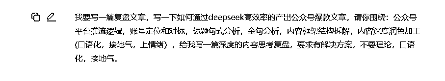
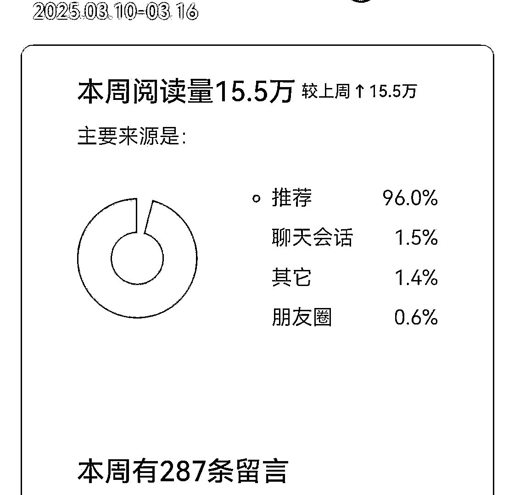

# 如何通过deepseek快速产出公众号内容爆款，深度复盘与AI介入

> 来源：[https://k874t2qh8w.feishu.cn/docx/QEACdGklJoeBNVx03Z3c44clnud](https://k874t2qh8w.feishu.cn/docx/QEACdGklJoeBNVx03Z3c44clnud)

大家好，我是辰风，深耕自媒体写作5年，创作字数几百万，几十篇10w爆款，多篇百万加爆款。此内容由我，chat4.0，deepseek共同参与，和各位交流学习。

在今天的深度复盘中，我会聊聊如何通过DeepSeek高效地产出公众号爆款文章，并结合AI技术的应用，提升创作效率与内容质量，目标是大爆款，深度解读做内容的本质。

以下内容包括公众号平台推流逻辑、账号定位与差异化、标题句式分析与金句、内容框架结构拆解与深度加工等多个角度，为大家提供具体可行的操作方案，帮助你打造出高质量、高曝光度的公众号内容。

## 1.公众号平台推流逻辑：搞懂平台规则，高效推流

当你发了一篇文章，看到阅读量没有预期的那么高，你会不会开始怀疑：“为什么平台不给我推呢？”其实，平台的推流逻辑很简单：内容原创性和互动率才是关键。平台喜欢原创且有深度的内容，而不是简单的复制粘贴或者同质化的洗稿。

### 实际操作：如何提升文章的推送概率？

*   原创性：平台偏爱原创性强的内容，不是简单的洗稿、搬运或者堆砌信息，特别是行业深度内容，比如养老金赛道的深度解读，分析未来5年政策变化对普通人生活的影响，这类原创内容能引起更多讨论，获得平台推送。

*   深度内容：不仅仅是表面上的内容堆砌，而是要有真正的干货与洞察。

比如写房地产相关的文章，光说“房价涨了”并没有价值，但如果能从政策角度、金融影响、购房者心理等多维度切入，平台推送的可能性会大大提高。

只有深度的了解平台，把他当成你的爱人，你才能搞到平台的流量！

### 如何利用平台推流逻辑？

*   多次互动：在文章内设计互动点，比如问答、调查、评论互动等，鼓励读者参与讨论。

*   高质量内容：确保你的文章真正能引发用户的思考和讨论，例如对民生、房地产等领域的深度分析，这类内容非常适合引发“读后感”，从而提高用户的互动。

*   激发情绪：一定要有你的立场和观点，讲普通人不敢讲的，有矛盾，有冲突，有话题，才有看点和讨论热度。

#### AI如何介入推流逻辑？

*   数据分析：AI可以帮助我们通过对过往数据的分析，预测哪些内容更可能获得平台推送。通过DeepSeek，AI能根据文章的互动情况，分析出高效推流的内容类型。

#### 实际操作：

*   利用AI分析数据：通过AI工具分析平台热门文章的数据（互动量、话题选择等），优化你的内容策略。例如，通过AI提取养老金或房地产等领域的热门话题，生成相关的深度分析内容，增加推送几率。

#### AI提示词参考：

*   "根据过去一周内热门文章的数据，帮我总结一下推流的规律，提供针对性标题建议"。

*   "根据近期的趋势，给出适合公众号平台推送的内容方向和热点话题，我做的是xx领域"。

### 解决方案：

*   关注互动率和内容质量：确保你的内容具备深度，结合AI的分析，及时抓住平台的推流逻辑，避免同质化内容，创造独特的、高质量的文章。分析文章的爆款因子：是否有矛盾点，话题点。

## 2\. 账号定位与差异化：精准选择赛道，做精品账号

当你打开你的公众号，看着成堆的文章和泛泛的内容，或许会觉得自己做得不够好，或者有点不知所措。其实，做好公众号的关键在于定位。明确自己的账号定位，选择正确的领域，才能够获得长远的成功。

我建立了自己的各行业的爆款账号对标库，就是解决这个问题。

大家也可以在平时搜罗内容，去整理各个赛道的账号对标爆款。

### 如何选择赛道与账号定位？

选择账号定位时，要深刻理解目标受众的需求和痛点。例如，如果你的目标是宝妈群体，你可以聚焦于育儿、家庭教育等内容，从实用性、情感化角度去写，而不是简单的“育儿技巧”，因为这类内容已经非常多，你需要做的就是从情感共鸣、个性化分享去构建内容。

情绪是痛点，更是刚需！

### 细分赛道：

*   民生赛道：如养老金、医疗改革等话题，适合分析社会政策、趋势变化。这类话题具有深度，同时又能引起广泛的关注。（60岁以上老人，有福了）

*   房地产赛道：针对房产投资、城市规划、房地产市场的长期变化进行分析，给读者提供长期价值和见解。（房地产完了）

*   宝妈赛道：深度分享育儿知识、妈妈生活、情感共鸣等内容。你不仅是一个信息的传递者，更是一个陪伴者。（宝妈需要理解和被共情）

### 实际操作：差异化输出

在你定位的领域内，避免做“大家都在做的事”。

你可以从深度内容、情感链接和个人经验出发，给读者带来价值。例如，你可以根据民生赛道，结合当前养老金政策的变化，进行深入分析，提供未来5年的趋势预测，告诉你的读者养老金制度对他们的影响，让内容具有高度的实用价值。

最直接的办法，是深度思考，讲故事，讲别人没讲过的，说别人没听过的。

### 差异化定位与内容设计：

*   细分与聚焦：例如，选择“新一线城市房产投资”作为赛道，而不是写“房产投资”。通过细分你能打造更加精准的内容，吸引高粘性的用户群体。（人群标签，话题标签）

*   输出精品内容：做深度内容输出，避免“泛泛而谈”。通过案例分析、行业趋势预测等方式，进行独特的内容构建。

思考，思考，还是他妈的思考！

#### AI如何帮助账号定位与赛道选择？

*   用户画像分析：AI能够通过分析现有粉丝群体的兴趣、性别、年龄等特征，为你提供精准的受众画像，帮助你确认最适合的赛道。例如，针对民生赛道，AI可以分析出当前最热门的养老金政策变化，帮助你制定相关内容计划。

一句话：他们是什么身份，解决什么问题，有什么兴趣偏好。

#### 实际操作：

*   对标分析：AI可以帮助你分析同领域的成功账号，理解他们是如何通过定位和内容创作吸引读者的，从而帮助你找到差异化的内容创作方向。

不过，我不用ai，我也不用次幂，大道至简，手刷，不影响出10w+。

#### AI提示词参考：

*   "帮我分析我现有的粉丝群体，给出具体的受众画像，包括性别、年龄、兴趣等"。

*   "分析市场上10个同类账号，给出我的差异化定位建议，并提供内容创作思路"。

解决方案：

精准定位受众：通过AI对用户群体的深度分析，你可以快速找出目标受众的痛点，进而在选定的领域内提供高价值内容。

差异化输出：避免跟风，创造有差异化的内容。例如，如果你在民生赛道做养老金相关内容，要避免单纯的“政策解读”，而是加入更多的深度分析和趋势预测，提供行业中未被关注的细节。

## 3\. 标题句式分析：吸引眼球的标题，快速提升点击率

### 如何写出吸引眼球的标题

一个好的标题直接决定了文章的点击率。通过结合不同的句式，你可以提高标题的吸引力，进而获得更多点击。标题要简洁明了，又能激发好奇心，让读者有点击的欲望。

记住了，句式，关键词，话题！

### 常见的高效标题句式：

*   数字+关键词：如“5个简单步骤，轻松搞定养老金规划”或“2024年，你必须知道的10个房产投资法则”。

*   情感共鸣型：如“为什么我们都在害怕养老金的未来？你需要知道的真相”。

*   紧迫感式：如“抓住2024年唯一的房地产投资机会，别错过！”

### 实际操作：如何写出吸引人的标题？

*   结合数据：数字可以快速传递信息的有效性，比如“3个改变你未来的养老金新政策”。

*   引发情感共鸣：通过标题激发读者的情感，尤其是在民生类文章中，通过问答式、情感化的语句调动读者情绪。

*   提高点击欲望：通过紧迫感和好奇心，刺激读者想要点击的欲望。比如：“2024年房地产市场将如何变革？这3个问题你必须知道！”

AI如何帮助生成标题？

*   标题生成工具：利用AI，输入文章的核心内容，快速生成多个标题选项。例如，AI可以通过自然语言处理（NLP）生成带有紧迫感、数字化、情感共鸣等特点的标题。

#### 具体操作：

*   利用AI生成标题：输入你文章的核心内容，利用AI生成一系列符合平台推送逻辑的标题，并根据数据反馈调整标题，选择最具吸引力的方案。

#### AI提示词参考：

*   "请根据以下内容生成5个吸引眼球的标题，要求包含数字并引发好奇心"。

*   "根据《养老金政策改革》的内容，生成10个引发情绪的标题，确保包含疑问式或紧迫感"。

### 解决方案：

*   生成并筛选：AI可以帮助我们快速生成多个标题，然后根据实际情况，筛选出最适合的标题，提升文章的点击率。

发现了吗，你要有自我判断，不然你玩不过ai。

## 4\. 金句分析：提升文章深度，增强情感共鸣

### 金句的作用

金句是文章中那些能打动人心、留下深刻印象的句子，它们往往是文章的灵魂，能够让读者记住你，甚至促使他们分享文章。

用户可以不记得你的文章，但是要记得：你说过什么！

### 金句的应用：

*   情感共鸣：例如在谈到养老金时，你可以写道：“不为自己规划未来，等着看养老金制度的变化给你带来的冲击，未来的你一定会后悔。”（ai写的，差点意思）

*   情绪调动：例如在房地产投资时，“错过了这些机会，你可能会发现自己无法再赶上这波潮流。”（一般）

最常见的：我命由我不由天！（哪吒里的，记得吗）

### 实际操作：

*   精准定位读者情绪：通过金句来切入目标读者的痛点，激发他们的情感反应。

*   反复打磨金句：金句往往是短小精悍的，因此在写作时要专门花时间打磨，确保每个句子都能精准击中读者的核心需求。

#### AI如何帮助提炼金句？

AI可以通过情感分析技术，从文章中自动提取出具有情感冲击力的句子，帮助我们快速生成金句。例如，在处理养老金等民生内容时，AI能够根据情感分析生成那些更能触动读者的句子。

#### 具体操作：

*   情感分析：AI通过情感分析从文章中提炼出具有情感张力的金句，帮助文章提升情感感染力。

#### AI提示词参考：

*   "请根据文章《养老金的未来：我们该如何规划》的内容，提取5个最有力量的金句"。

*   "结合当前养老政策的变化，给出3个能打动人心的金句，情感化表达养老金的未来"。

### 解决方案：

*   生成金句：AI不仅帮助我们提炼出最能打动读者的金句，还能增强文章的情感化表达，让读者更容易产生共鸣。

## 5\. 内容框架拆解：拆解成功文章，构建自己的框架

有了内容框架，文章的结构就有了方向，避免了内容杂乱无章的问题。通过拆解成功文章的框架，我们能更高效地构建自己的内容。

### 如何拆解其他爆款文章：

*   案例分析：比如分析《2024年房地产市场趋势》，可以先拆解一下这些爆款文章的结构，一般来说，爆款文章多采用“背景—数据分析—政策解读—解决方案”的结构。

*   框架拆解方法：首先拆解文章的大致结构，看看每个部分的逻辑性如何，是否有层次感，并且尽量用简洁明了的小标题来分割每一部分。

### 如何构建自己的文章框架：

1.  引入背景和痛点：例如在养老金赛道上，开篇讲述大家对养老金不安的情绪，再结合一些数据和案例。

1.  提供独特见解：接着给出你的观点、分析，打破传统的解决方案，提供与众不同的深度分析。

1.  总结解决方案：最终给读者提供解决方案，最好能配合一些实际可操作的内容，如“如何在2024年进行养老金合理规划”的具体方法。

#### AI如何参与内容框架拆解？

AI可以根据成功案例自动生成文章框架，提取成功文章中的核心结构，帮助我们迅速搭建内容框架。

#### 具体操作：

*   分析成功文章框架：通过AI工具分析同行文章的框架，提炼出成功的结构模式，进而创建自己的文章框架。

#### AI提示词参考：

*   "根据《2024年房地产市场预测》内容，生成一个完整的框架结构，适用于推送文章"。

*   "分析《养老金政策改革》成功文章的结构，给我一个框架建议，适合公众号推送"。

### 解决方案：

*   框架构建：AI可以帮助我们借鉴成功文章的结构，通过拆解分析，优化自己的文章框架，使文章逻辑更加清晰，结构层次更加分明。

## 6\. 内容深度润色：AI帮助提升文章可读性与情感化

### 什么叫润色文章

AI在润色时，能够根据内容的情感、语气以及结构，帮助我们优化文章的流畅度和感染力，使其更加贴合受众。

### 如何润色文章？

*   用更简单、接地气的语言：避免过多的术语或学术化表达，让文章的语言更接近读者的日常语言。

*   加强情绪调动：根据内容的主题，适当加入情感词汇，让读者能感同身受。例如，“今天的养老金政策变化，可能是你未来十年生活质量的转折点。”这种方式会让读者更有紧迫感。

### 实际操作：

*   口语化调整：通过短句、简洁表达，让文章更加易读。

*   加入情感化元素：根据内容的受众群体，加入情感化元素，让文章更加生动和贴近读者。

说白了，有人味，有情绪~

#### AI如何帮助润色加工？

AI通过情感分析和语言模型，能将文章转化为更口语化、更接地气的语言，同时加入更多情感元素，增强文章的吸引力和亲和力。

#### 具体操作：

*   润色调整：通过AI调整文章的语气、简化复杂的句子，使其更加口语化、贴合读者的阅读习惯。

#### AI提示词参考：

*   "请将以下文章段落转换为更口语化、接地气的风格，并保持原有的信息量和情感"。

*   "请润色这篇关于养老金未来的文章，使其更具情感化和可读性"。

### 解决方案：

*   语言口语化与情感化润色：AI能够帮助将文章润色成更符合受众阅读习惯的语言风格，让文章更加具备感染力和可读性。

* * *

写这篇内容的过程中，我有一种深刻的感受：做爆款文章，不是一天两天的事，它需要时间的积累、持续的打磨和不断的调整。在如今这个信息更新极快的时代，很多人都在追逐短期的点击量，但真正能走得远的，还是那些能够坚持长期主义的人。

每一篇爆款文章背后，都有不为人知的努力。你可能看到一个文章爆发的瞬间，但在背后，有多少次的推敲、修改、重构？有多少次灵感枯竭时，仍坚持把文章重新捡起来，做最后一次优化？这份坚持，才是你最终能够突破流量瓶颈的关键。

我想说，“爆款并不是一蹴而就，而是时间和坚持的累积。” 每一次的创作，不管它是否爆发，都在让你成长，让你更了解读者的需求、平台的规则、内容的深度。每一次的积累，都是为下一次更高的飞跃铺路。

而且，“时间从来不会辜负那些坚持下来的努力。”

走长期主义的路，不是轻松的，很多时候你会怀疑自己、怀疑写的内容能不能被看到，但记住，只有坚持和不断积累，才会在某个时刻碰到爆发点。就像写公众号的过程一样，你做的每一篇内容，都是在构建自己的商业IP，都是在做价值输出，虽然现在看不见，未来一定能看到。

成功的秘诀往往藏在那些看似普通的日常里，每一次内容的更新，每一次与粉丝的互动，都是你未来成功的种子。所以，不要小看这一步步的积累，因为你每天都在为时间的价值而努力。

“用时间换取实力，用坚持换取爆发。” 当你真正意识到这个道理的时候，你就会发现，做公众号，做任何事情，最重要的不是一时的爆发，而是长远的坚持和不断的自我超越。

最后，我想对所有正在做内容的你们说：如果今天你的文章没火，没关系，明天你会变得更好。只要你不放弃，坚持写下去，积累一定会带来回报。所以，保持热情，继续创造，时间会给你最好的答案。

“成功不是从一开始就能看到的，但坚持下去的人，最终会站在属于自己的地方。”

最后，感谢你看到这里，欢迎点赞，评论，交流，共同学习。

让我们日拱一卒，日复一日!