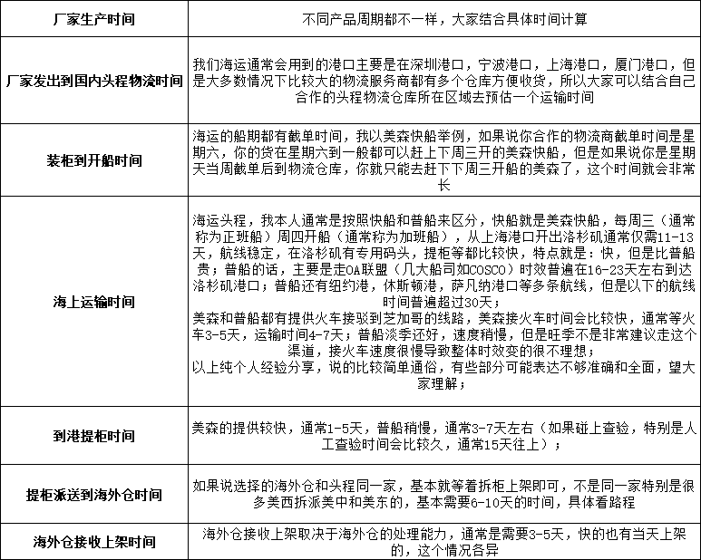
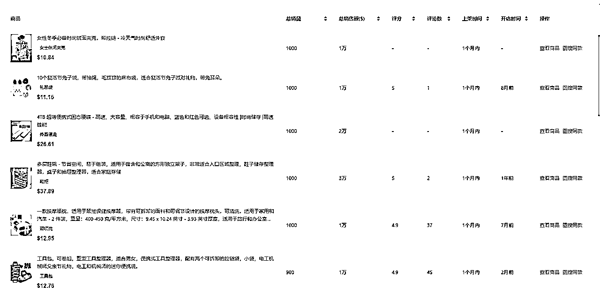
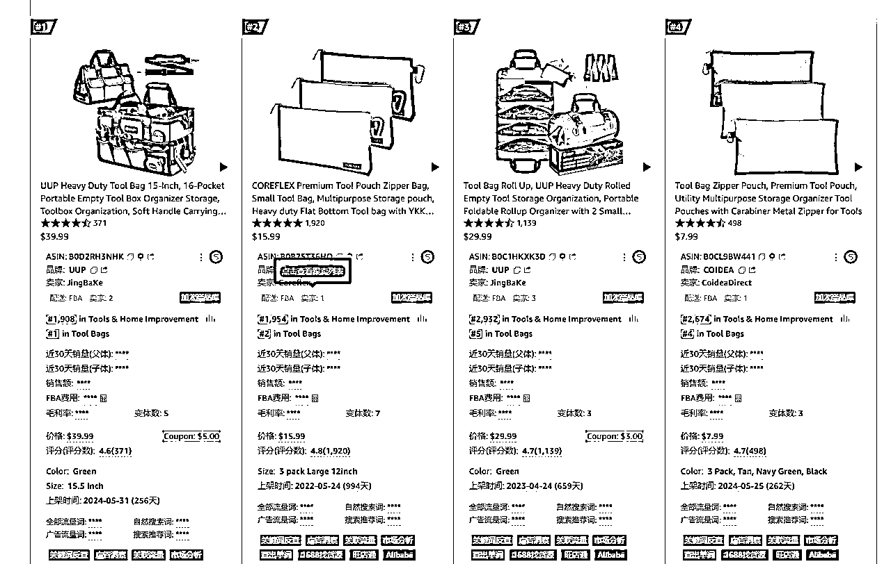

# 一文带你了解Temu半托管业务

> 来源：[https://ecnc60ezdxic.feishu.cn/docx/QaugdaxQOoT6XexwWi2cuqFGned](https://ecnc60ezdxic.feishu.cn/docx/QaugdaxQOoT6XexwWi2cuqFGned)

Hello,生财的圈友们大家新年好呀！我是Darren，这两年Temu平台都挺火的，今天给大家分享一下关于Temu半托管模式的一些自己的见解，希望可以给有兴趣的圈友一些帮助！

## 一、为什么选择Temu半托管项目？

以我们自己举例吧：

我们是一家以亚马逊为主的跨境电商公司，截至2023年11月，我们的业务布局主要集中在亚马逊平台。那么，为什么我们会选择Temu半托管项目呢？

2023年，Temu全托管模式在全球范围内迅速走红，几乎成为跨境电商行业的焦点。当时，我们的策略是专注于自己熟悉的领域，深耕亚马逊，避免盲目跟风。然而，随着我们部分产品在Temu上被其他卖家上架并爆单，加上身边的朋友在Temu上日订单量突破万单，利润率也很不错，我们开始重新审视这一平台，并意识到新的竞争环境下必须打破固有思维，从单一的亚马逊运营公司转型为多元化的跨境电商公司。

那我们为什么不做Temu全托管。因为我们认为Temu全托管模式操作简单——卖家主要负责选品、上架和发货到国内仓库及其余少部分的运营工作，其核心竞争力在于选品能力，供应链是否有优势和进入时机的把握。对于我们来说，布局的时间点太迟了，早就过了全托管模式的红利期，并且，我们并不是工贸一体型卖家，我们一贯的思维是产品质量优先而非价格优先，我们的价格对比工厂型卖家来说没有任何优势。全托管模式简单并非传统意义上的跨境电商，从本质上看和国内电商平台区别不大，启动门槛低进来掘金的人就多，竞争大，且全托管模式核价大头是产品采购成本+运费+售后等，费用低核价自然就低，走的是薄利多销路径，利润空间有限。因此，我们评估后认为，全托管模式并不符合我们的长期业务规划。

直到2023年底，我们了解到Temu即将推出半托管项目，意识到这是一个绝佳的机会。半托管模式的门槛更高，要求卖家具备更强的选品能力、稳定的头程物流服务商、可靠的海外仓合作方，并且资金回笼周期较长。对于滞销商品的处理，半托管模式也更具挑战性——滞销商品不仅涉及采购成本，还需承担头程运输、海外仓上架及弃置费用，成本远高于全托管模式。

并且，我们的其中一款产品重量重，全托管模式下的物流成本较高，而半托管模式则更适合我们。此外，我们拥有稳定的供应链和在美国的销售渠道，能够通过亚马逊销售滞销商品，降低损失。因此，我们迅速布局，成为Temu半托管项目的第一批卖家。

## 二、日销w刀的大爆款链接拆解分享

以下数据来源于我们自己调研剖析某品类日出W刀大爆款链接，为了更加直观，方便大家理解，数据有经过部分处理，可能会有稍许出入，仅供大家参考；

设定：Temu平台前台平均客单价29.99刀（非核价），采购价约：90元，平均产品重量：3.3kg，SKU:10个，每天的订单数为334单；

需要的有多少货：按照工厂出货时间7天，通过普船运输到美中时间30天，海外仓上架到可售3天，预留10天的安全库存，在仓数量仅按照20天销量（计入的比较少），所以我们整体按照比较理想状态70天的日销来分配在仓+在途+在生产，你需要备货数据为：23380个，整体备货货值约：210w；

运费预估：备货分仓预估按照美东:美中:美西=3:5:2=7014：11690：4676；国内工厂到头程物流仓库0.5元/kg, 头程费用到美东按10元/kg,美中按9.5元/kg,美西7元/kg，总运费约为：24.3w+38.6w+11.6w=74.5w;

总货值：284.5w；

当然实际运营所需要资本不需要要这么多，毕竟每天都会回款（T+7的回款策略），按照资金流转来看，基本上200w左右的周转资金是需要的（但是如果你是成熟的供应链，工厂有足够长的账期，物流也有账期的话，整体需要占用的资金就很少了，这个另当别论）；

利润率如何？

经过我们的测算过后，该产品的利润率应该约为人民币核价（活动后）5-8%（该链接用市场最低的价格去跑量，然后卡住30刀以内，赚取2.99刀运费补贴）；

运营玩法简单剖析：

该卖家本来就是亚马逊大卖（排名BSR榜单前3，通过Temu品牌蓝标查询得知），它们属于看到Temu半托有机会，第二梯队进场掘金的卖家，因为有成熟的跨境电商经验且产品是亚马逊爆款，信心满满，前期货量就备的很充足（预估首批备货5000件+，货值+运费预估要到60w, 分仓大概是美中:美西=7:3，从配送时效上猜测）。

运营策略上，前期疯狂上链接铺开，形成由一条主力链接和多条子链接的结构，主力链接通过活动达到同类产品最低价，其它子链接价格较高，用来填补利润，但是现在平台对于铺货是有出台规定，不太能复制该操作；前面半个月整个店铺的日均单量预估在10-30单，已经有起量的趋势，根据我们的观察结合补货的到仓时间判断，这个阶段该卖家进行了补备货操作，同时在运营上通过周末活动更低价冲刺，迅速完成50-100单的突破，并且在周一周二上了秒杀价格维持低价保证单量和转化率，平台都是会优先给低价高转化的链接推流，在链接上架快1个月的时候，突然有天爆单了，一下子从日均约100单，突破到350单，完成了从0-300单的突破（当然后面肯定是断货了），不过这条链接在经过几次起伏之后（当然过程很坎坷），又恢复到了300+订单；

特点分析：利用自己本身的亚马逊爆款产品（该产品需求量大且稳定，亚马逊最好的链接日均销量超过1000单），不冒进，拿到竞品数据后入场，入场时机把握的很好，团队运营经验成熟，供应链稳定（货物滞销有处理能力），产品重不适合Temu全托管运营（产品重量重，全托管运营成本高，必然会把流量倾斜到半托管产品），售价相较于亚马逊BSR产品便宜10-25刀（有明显的价格优势）；

综合分析：

通过上面这个爆款，我们知道，这样的大爆款它需要有优秀的运营团队，成熟的供应链（稳定的供应链可以保证品质稳定，通过账期降低运营资金成本），足够的备货（没有充足备货，无法支撑持续爆单，一旦断货，订单恢复就会面临严重挑战，但是庞大的备货同样意味着风险），需要有存量竞争市场上最有竞争力的价格（Temu不是价格低就一定卖的好，但是价格高是一定爆不了，所以它将会面临利润率持续下滑的风险，平台流量永远都会往最有竞争力的价格产品倾斜，只要有竞品以足够低的价格并稳定运营一段时间，自己不跟进的话，订单迟早被抢走），所以不是很建议大家去做大爆款（跨境大卖除外，新手玩家还是尽可能避开）

## 三、关于选品层面的想法分享

对于电商来说最重要的就是产品，千人千面，每个人对于选品的策略都有不同的见解，每个人的情况和阶段都不一样，所以我这边就不做思路的详细展开（仅针对新手卖家给2个建议），重点给大家讲讲有哪些选品坑要注意吧；

给新手的两个选品建议：

1\. 借力打力：亚马逊选品课程助力快速入门

虽然目前Temu半托选品课程资源有限，但亚马逊选品课程已经非常成熟，资源丰富。建议新手卖家可以学习亚马逊选品课程，快速掌握选品逻辑和技巧，为Temu选品打下坚实基础。

2\. 实践出真知：竞品跟踪表格助力精准选品

建议选择几个熟悉的类目，针对新品和老品建立竞品跟踪表格。通过跟踪竞品链接的单量波动、运营手法等数据，可以验证自己的选品判断，积累选品经验，逐步形成自己的选品方法论（花别人的钱验证自己的逻辑）。

那选品需要注意哪些坑呢？

我总结了10条小建议，分享给大家：

(1)侵权产品不要碰：大家一定要避免选到侵权产品（上架前多花时间去排查是否存在侵权风险，不论新手还是老卖家都一样），否则一旦被侵权被起诉，TRO整个店铺的资金都将被冻结，处理起来异常麻烦，损失会很大；

(2)利润测算要准确：很多新手卖家不会算利润（例如产品实重和泡重搞不清楚，产品重量只有1磅，利润表一算利润率不错呀，但是没有测算产品体积重，体积重可能是5磅，瞬间赚的变成亏的），所以得把利润表用好用对(后面有提供)；

(3)产品品质管控不严：很多卖家选好产品后（不是自己熟悉的产品线，没有稳定供应链的情况），通常都是1688进行采购，货比三家然后选了个最便宜的，对品质没有做好把关（前期量小货不多，一定要做好质检），很容易导致退货率过高质量得分过低（被按规则罚款），导致产生比较大的损失；

(4)拒绝盲目跟风，理性分析市场信息：做过Temu的应该都知道，买手或者招商经常会推荐你做一些产品，有的已经是爆款或者下一阶段的爆款，这个资讯可以参考，但一定要有主观判断，要思考自己能不能接的住这个款式，买手很多产品推荐都是做成图片分享给很多卖家，所以有可能当你入场的时候很多卖家都跟进了，那就竞争很大了，所以要有选择性的去听取建议，不能推荐什么就做什么；

(5)业务初期远离大爆款: 大爆款的成功离不开成熟的供应链、专业的运营团队以及充足的资金支持，而这些资源往往是业务初期的短板；其次大爆款竞争激烈，价格战频发，稍有不慎就会导致库存积压、资金链断裂等风险，对初创团队打击巨大；

(6)客单价区间不能太低：低客单的产品很多会和全托管产品重合，价格上很难有优势，并且低客单产品的海外仓操作费加上运费，可能比亚马逊更贵，留有的操作空间非常小，运营需要很精细化，不太适合业务初期；

(7)多SKU产品建议谨慎：例如鞋服SKU巨多，很多海外仓都不喜欢这样的客户，其次对自己来说补备货压力巨大，不适合业务初期展开；

(8)红海类目不要碰：例如蓝牙耳机，运动裤这些，红海产品是大卖的角斗场，神仙打架不是普通卖家可以插手的，很容易变成炮灰；

(9)高退货率的产品不要碰：高退货率首先容易影响到产品的质量得分，质量得分太低可能会导致处理，评价差链接的可持续性就没了，备货难度也会很高，再者，海外仓处理退货成本非常高，如果卖家选择退回则需要支付退货运费（很贵），海外仓处理也需要支付费用，如果选择不退回（可能会有更多薅羊毛的消费者），那么退货损失也低不了；

(10)不要选择太冷门的产品：产品最理想状态下，在美国要有足够的需求，如果一个产品亚马逊卖的最好的也就30单，那你指望Temu一天卖多少单是很不现实的，所以避开冷门产品；

选品有太多的学问了，还有很多内容，我就不一一赘述，大家可以自行去研究，形成自己的一套选品逻辑；

那我们该如何测算一个产品的利润呢？

为大家提供了一个利润测算表格式，大家可以参考一下：

部分字段解释：

头程运费：工厂-头程物流服务仓库+海运到海外仓仓库，两段费用；

尾程运费：这个大家可以自行注册一个Temu半托平台-里面有工具可以测算；

其它成本：通常我们是设置3个点，主要包含海外仓仓储费，提现服务费，运营过程中资质费用等等其它费用；

备注：Temu后台现在工具很多，可以测算尾程物流运费，可以测算如何分仓库备货更好降低成本和优化配送时效，也有对接合作的头程物流商，有对接海外仓等各种资源，基本上可以满足大家的需求（我个人觉得官方推荐的主要是靠谱，可以让新手卖家一开始少踩雷，等业务成熟稳定之后，可以多对比一些服务商，以便降低成本）

## 四、海外库存是如何管理的？

1、物流仓储选择建议

我们正常会把美国按照0-9邮编来分区，分成美东，美中，美西（详细看下图），Temu后台在24年年中也上线了仓网规划这个功能，非常贴心，可以解决很多新手卖家的备货困惑，只需要把自己产品和需要几个仓库填入即可，很好用，下图是我结合订单数据和经验给大家更具体的例子：

库存周转方案

库存周转这个取决于大家对于产品的定位（我们对于这个产品的规划，不同的规划会有不同的备货方案），可以借助ERP或者表格来管理库存，这个都比较简单，重要的是每周测算2次补备货，确保库存水位比较安全，尽量避免断货和过分超备；

接下来给大家介绍一下货从下单到海外仓上架，它需要经历什么流程，拆分的成时间点，大概是以下：厂家生产时间，厂家发出到国内头程物流时间，装柜到开船时间，海上运输时间，到港提柜时间，提柜派送到海外仓时间，海外仓接收上架时间，详细看下图说明：

通过上面的具体介绍，大家可以知道自己的货从下单到海外仓具体需要多久的时间，库存管理就是尽可能保证库存稳定不断货，通常我的建议是根据自己的运营计划走（例如：要冲刺更高的销量那么就拉高日销量预估，多备些活动冲刺库存），但理想状态下是保证热销SKU不断货（淡季10-15天的安全库存），旺季保证（15-30天的安全库存），非热销SKU偶尔断货影响也不会非常大；

## 五、给新手朋友的一些建议

### 1、Temu半托管业务还能不能做？

我的回答是肯定可以做，2025年将会有更多的卖家涌入Temu半托管平台，不置可否，平台的竞争在不断加大，25年2月，美国取消了T86，但根据最新的政策变动，美国已经暂时撤销了对中国低成本包裹（价值800美元以下）的免税运输禁令，并恢复了T86清关模式。这一决定是为了解决因政策变动导致的大量包裹滞留和机场积压问题；但是我个人判断关税成本上涨是必然的，所以半托是趋势这个是不会变的。

### 2、最低启动资金建议

关于这个最低启动资金，有很多朋友都问过我，我也一直在思考到底要怎么去界定，想来想去，我觉得这个取决于自己的规划。对于新手朋友来说，如果想要试试跑跑流程的话，我觉得1w也可以启动，首先开店是0成本的，Temu半托店铺门槛很低，不过稳定之后建议注册香港公司，可以用第三方收款；其次，在于你选什么产品，首批计划采购多少数量；再者需要找到一家靠谱的海外仓，海外仓大多数是预充值模式；再之后就是找一家头程物流服务商，市面上非常多，通常都有月结账期；最后，产生动销后就是后续补货的问题。所以没有大家结合自己的情况去铺排即可。

### 3、新手如何从0到1跑通流程

以下内容以数据为例，旨在帮助新手梳理流程。

Step 1: 开店和选品

开店

半托管店铺的开设目前非常简单，您可以直接通过官网或联系招商团队完成。这一步没有太大难度。

选品

目前，Temu平台上的选品工具相对有限，因此我们推荐使用广为人知的特卖选品助手（https://www.Temushuju.com/）。需要注意的是，选品工具只能作为参考，需要自行充分验证，切勿盲目依赖工具。

对于新手选品，建议避免选择SKU过多、竞争激烈或季节性明显的产品。这类产品容易因备货和去化不当导致库存积压。因此，我们建议选择上图中最后一个工具包（需特别注意产品是否侵权，这一点非常重要）。

数据检查

查看平台的销售和卖家情况：从销量来看，需求没有问题。前8名中有3个类似款式，全托卖家表现最好，第6名是半托卖家。该产品目前没有品牌，因此无法判断是否为亚马逊大卖的链接。接着查看亚马逊同款售价，目前优惠后为26.99美元。虽然核价最高可达亚马逊的85折，但需满足亚马逊同款链接且近6个月销售额达180万美元或近3个月有1个月超过30万美元的条件。目前半托的最终售价为12.76美元，因此您很可能只能按此价格销售（白牌产品很难核到高价）。

测算利润：将同款链接放到1688上以图搜图，优中选优。可以先咨询数据进行测算，确认有利润后再安排采购。样品到货后，检查品质和包装方式，确定包装规格尺寸，确保利润符合预期。

备注：此处不详细展开，你可以使用提供的利润表填写数据。由于每个人的海外仓操作费用、头程运费等因服务商不同而有所差异，但建议尾程运费采用Temu平台面单测算（Temu后台有测试尾程运费的工具，目前Temu的平台面单价格通常比海外仓尾程便宜）。

根据利润表的价格上传链接核价（前台售价通常有平台加价率，加价率存在波动，建议按1.1左右进行预估）。如果核价达到利润预期，即可进行采购。采购数量不宜过多，前几个产品可作为测试，重点是跑通流程，做好亏损准备，即使滞销也不会亏损太多。

Step 2: 物流与仓储

由于新手卖家可能对海外仓和头程海运服务不熟悉，建议您先咨询Temu后台推荐的海外仓服务商（多咨询几家，选择价格较优惠的）。头程服务商可以通过各种跨境群找到，这里不做具体推荐（小型海运服务商价格可能更便宜，大型服务商则更稳定）。后期稳定运营后，可以深入了解相关资源，以降低成本。

样品采购回来后，检查是否有外包装。如果没有，需自行打包（避免让海外仓打包，海外人工费用高）。然后贴标、装箱，并打印头程物流的货件标签和海外仓入库标签，具体要求根据您选择的服务商而定。

Step 3: 产品上架与运营

产品到海外仓上架前，需做好以下准备工作：

链接优化：图片尽量自己制作，包括视频等，避免直接使用他人图片，以免因侵权被投诉下架。

物流跟进：及时跟进货物状态，若货物未按时到达，多与物流沟通。货物到达海外仓后，催促尽快上架。

运营准备：在货物到达前，跟进竞品情况（竞品单量、是否有新竞品、价格是否持续内卷等），并制定运营计划。前期推广计划应包括如何通过活动推广产品。如果产品长时间无动销，考虑是否通过高折扣刺激销售。如果开始动销，需及时补货，并制定应对各种情况的计划。

通过以上步骤，你可以逐步跑通流程，积累经验，为后续的运营打下坚实基础。

### 4、新手容易踩的坑

选品的坑，已经在前面给大家分享了，这边主要就分享海外仓及头程物流，以及运营过程中一些需要避免的问题；

#### （1）关于海外仓部分

找海外仓就一个宗旨，大家一定要找靠谱的；没有资源的话，前期建议可以联系平台提供的服务商，平台对接了几十个服务商，对比报价和优惠，然后自己可以先选一个服务商（避免踩坑，后续单量稳定之后再做成本优化优化），

我罗列几个海外仓常见的坑：

①海外仓包裹处理能力不行：淡季订单量不大看不出什么问题，一旦旺季开始爆单，处理能力不行的海外仓，会给卖家带来毁灭性打击，比如仓库最大日处理量为5000单，但是旺季每天10000的订单量，导致货无法及时发出产生罚款将非常严重，是我们利润绝对覆盖不了的；

②海外仓太小经营不善倒闭：这种情况的话，可能就钱货两失了；

③海外仓是合作仓（协调能力不行）：一个海外仓的搭建和经营成本是很高的，所以很多海外仓都有彼此间的合作，但是一旦到拥堵的旺季，人员不足，运转不畅，这个时候很多海外仓都会优先处理自己的客户的货，很多合作海外仓的客户，他们的货有可能10天半个月，甚至于1个月都没办法上架，完美错过旺季，留下一堆库存，简直拍大腿，损失严重（当然不是合作仓不能用，市面上很多这样的海外仓服务商，但是大家要根据自己的业务发展去优化流程降低此类风险）；

④海外仓尾端运输服务不正规：提前要海外仓自营物流报价，查看报价是否合理（例如1-9区一个价，那大家就需要注意了，这肯定是有问题的），丢件风险增大和存在违规风险等隐患；

⑤首批建议选择美中的海外仓：美中到美东和美西的距离都不算太远，所以是最理想的测款时的仓库，可以在测款的时候，尽量避免延迟到货罚款；

当然海外仓要注意的点还有很多，我就不一一赘述，前期什么都不懂的话，尽可能找大的靠谱的海外仓；

#### （2）头程物流

头程物流常见的几个坑：

①选择的跨境物流服务商规模太小：最近这两年，物流商倒下的新闻经常听说，所以不建议大家选太小的物流商；

②选择A渠道走了B渠道：前几年老是有这样的事情发生，我们付了快船的钱，但是它给我走的是慢船，这个可以从时效判断出来；

③计费重没复核:大家要提前测量好自己的产品重量，方便和物流那边核对，有些机器过得数据偏大可以要求人工重新测量；

以上都可以通过选择业内比较大的物流服务商来避免；

#### （3）运营过程中容易踩的坑

#### 

这个的话，我就随便罗列几个，大家实操的时候可以，可以看看平台的课程，都介绍的很详细了；

①遵守平台规则：Temu是一个平台，我们运营店铺都是签署了协议（协议签的时候自己要看清楚条款做好解读，比如什么是延迟到货罚款，虚假发货罚款等等全部都有介绍），大家要遵守好平台的规则，不要去违反规则（例如去年那波国内虚拟仓发货被封店罚款事件），合规经营才能做的长久；

②注意店铺的IP隔离：现在Temu引入了关联的这个规则，大家可能需要借助云服务器去做店铺隔离；

③订单发货：距离较远或离需要到货时间较近，计算“要选的运费”+“延迟到货罚款”费用总和用是否大于选择“最快空运物流”价格，如果大于可直接选择“最快空运物流”，从而减少损失；

④库存回退设置：建议选择关闭，避免清仓/有断货风险sku，消费者取消订单导致库存回退，再次被新消费者订购，导致没有货发；

⑤消费者未收到包裹：先引导消费者查找包裹，不要直接给协商退款。如消费者还是找不到包裹，可引导申请售后“未收到包裹”，由平台进行判定；

⑥时刻警惕侵权风险：listing文案要检查是不是存在侵权，图片是否有侵权风险等；

### 5、一个新的风险点考虑

Temu平台的是一个变化很快的平台，因为它很年轻并不像亚马逊一样，已经很成熟了，所以平台经常会根据运营情况更新一些新的政策，比如说玩法的改变，举例：半托管上线的前面3个月，平台处于极度缺品的状态，这个时候铺货平台就会给流量，但是一旦产品丰富度达到，平台很快就出台规则去限制重复铺货（本质上重复铺货不利于平台健康发展），那么之前靠铺货的卖家可能单量就会暴跌，平台要发展就一定会变革，所以新手玩家需要入场的时候需要考虑到平台政策的波动性。

以上就是我的分享啦，文章有点长，希望可以对大家有帮助，欢迎大家在评论区多多交流！