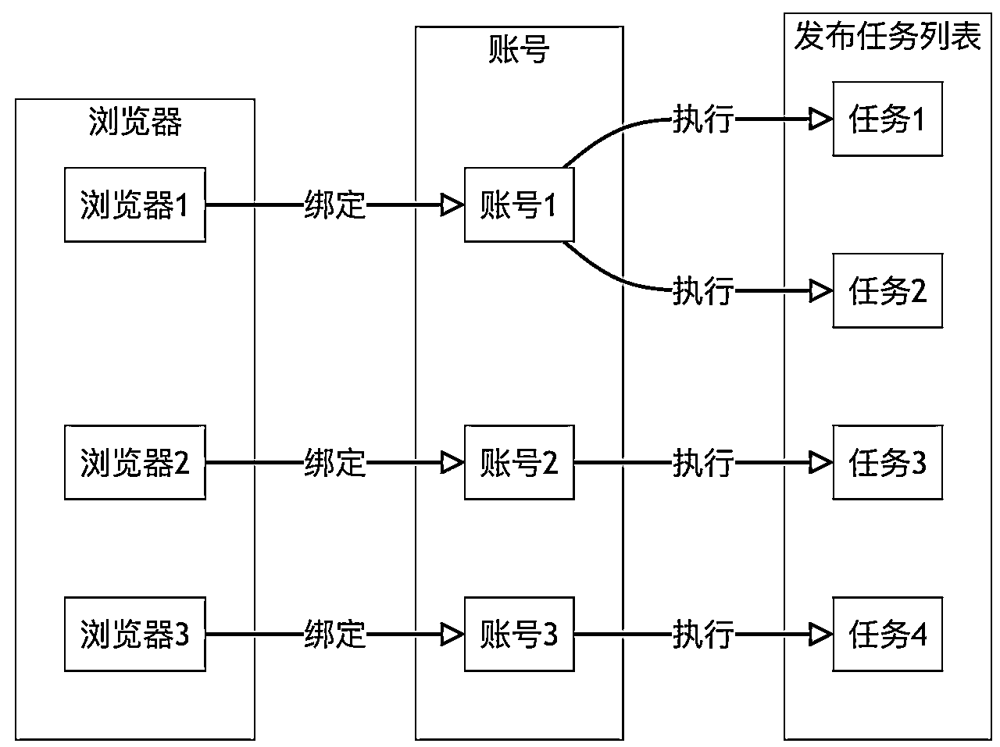
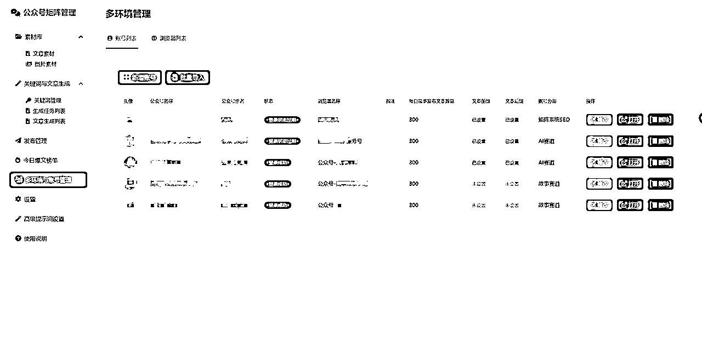
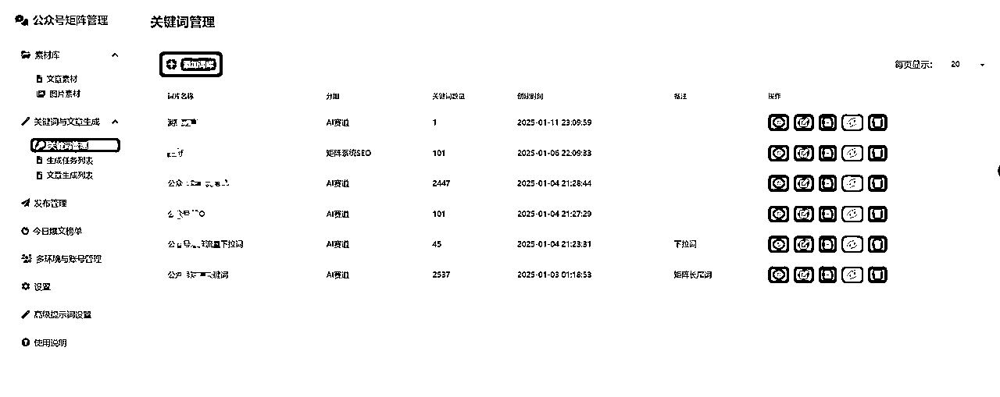
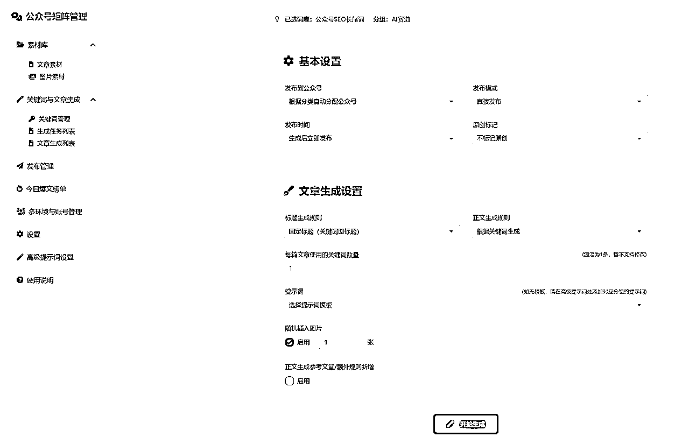
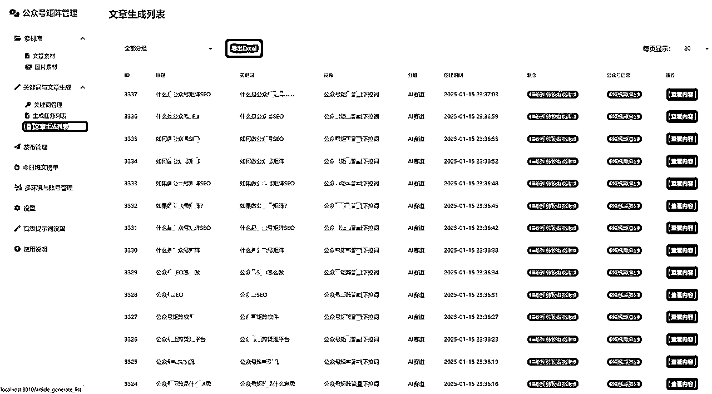
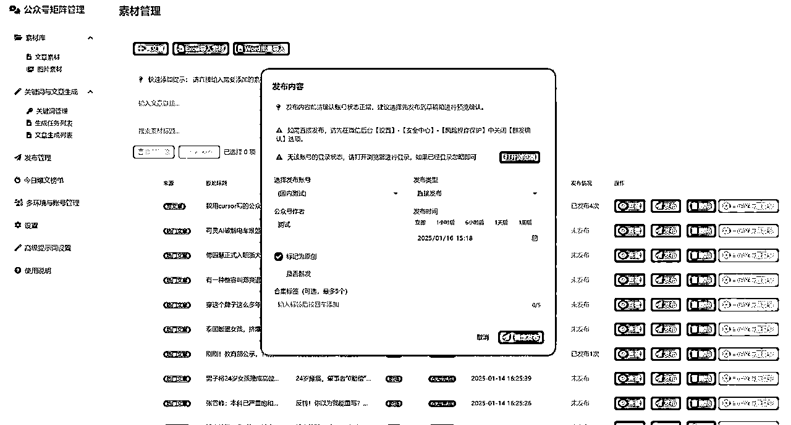
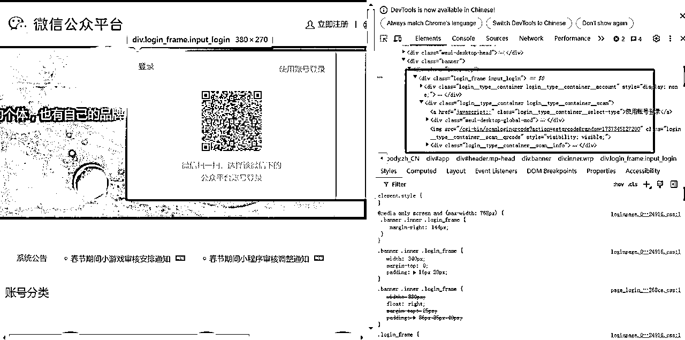
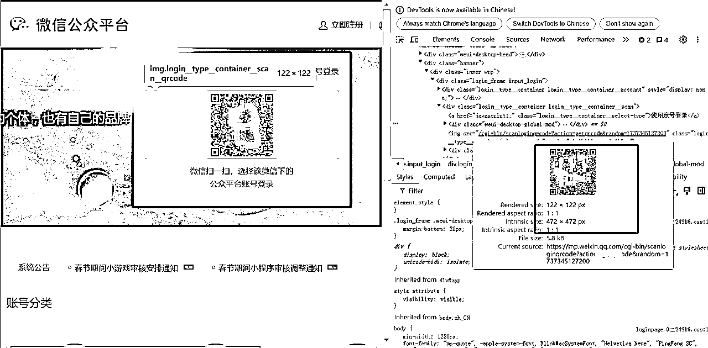

# 使用cursor开发公众号自用工具到意外创收总结

> 来源：[https://ia0969wpr2.feishu.cn/docx/Qeu0d51rnocPWwx9bZcco8IPn5f](https://ia0969wpr2.feishu.cn/docx/Qeu0d51rnocPWwx9bZcco8IPn5f)

前段时间发了一篇教程：https://t.zsxq.com/XzT7l ，文章中分享了我如何在一个周末基于自己的需求开发了一套自用的公众号账号管理系统，做系统初衷是因为我自己的账号变得越来越多不好管理，现有的coze/dify工作流+影刀执行效率慢，自动化程度低难以实现稳定的无人值守运行，为了解决这个痛点所以我做了一个初版的系统，当然核心目标还是围绕流量主方案展开。

后来我把整个过程又整理为了一篇文章，先后发布在公众号和小红书等几个平台，但是出乎意料的是都小爆了一下，加进了几百好友，我这才意识到原来这么多人对公众号矩阵这么感兴趣，在沟通的过程中又逐渐发现大多数人对公众号的SEO有非常强的需求，随后抛弃了流量主逻辑，开始转向SEO式的文章批量生成和矩阵分发。前期首先定制了几个大客户，随后又根据用户的实际共性需求对系统进行优化迭代，逐步积累了稳定的客户群体，一个半月成功实现了过万收入。这次经历让我感受到准确了解用户需求并且快速响应的重要性，也让我对cursor结合用户需求快速开发交付的潜力有了更深刻的认识。

系统的第一版就是上篇文章提到的，一个周末的时间完成的MVP，所以cursor在提效和开发商业化软件这块完全不是问题，实际结果证明了Cursor足以胜任开发一个中等复杂程度的商业化产品。因此，大家可以完全放心地使用Cursor，它的能力和效率提升绝对不会让你失望。

本文不会粘贴过多的Cursor对话内容，只会贴出来核心的流程设计和代码实现。因为Cursor的基本使用方法生财中有大量教程可供参考，官方的航海手册也非常完善。在今天，我们实际上已经迈入了一个功能即代码的全新时代。什么意思呢？这意味着，只要我们能看到一个工具的界面和工作流程，就可以借助AI和Cursor轻松复刻，改造成为我们的个性化系统。不需要深究怎么实现的，甚至不需要复杂的技术背景，核心的可能是对系统工作流和设计思路的理解与掌控。换句话说，工具本身已经不再是关键，关键在于我们如何构建逻辑、设计流程，接下来的细节的功能模块实现直接交给Cursor就能完成。AI时代的便利，就是让创意和执行之间的距离无限缩短。

我们都知道，从对话到 Agent，再到工作流，最终走向产品化解决方案，是许多工具发展的必然路径。而产品的核心价值就在于，串联起所有的流程，形成一个可控的闭环。

以公众号矩阵为例，第一阶段我们可以借助 Coze 或 Dify 来搭建一个简单的工作流，通过 RPA进行粘合，但问题在于，这种方式缺少系统化的管理能力。比如：如何高效地管理多账号？如何排版？如何人工介入修改？如何调度任务、安排发布时间，以及如何集成不同的工作流？这些问题都需要一个更加可视化、功能完备的产品来解决，帮助我们将整个流程串联起来，实现全流程的可控与高效。

解决这些痛点的关键在于多个智能体协作和工作流产品化。简单来说，就是让 AI 专注于擅长的部分，专注在内容生成，比如文字和图片等。把固定化下来的工作流解耦，我们通过系统化的产品，来掌控其他环节，比如从多账号管理到任务调度，从内容分发到数据监控，打造一个完整的闭环。

以前，这样的系统化解决方案可能难度很大，开发成本也极高。但随着AI编程工具，比如 Cursor 的出现和完善，这些问题已经不再是难题。Cursor 让我们能够快速构建一个完整的产品。

以下就是整体的系统功能设计和结构图，是近一个月对系统设计的完善过程中的总结。

## 账号管理

在多平台运营中，为了实现不同浏览器管理不同账号、发布不同内容的目标，我们需要建立清晰的关联关系：浏览器-账号-发布任务列表。通过这种结构化的管理方式，我们能够更高效地完成账号的登录、内容的发布以及任务的调度。

浏览器-账号-发布任务列表，浏览器可以登录不同平台，但是同一个账号要只在一个浏览器进行登录，一个账号可以发布不同文章

我们要在同一个浏览器登录一个账号，也就是说我们需要绑定浏览器和账号的关系。我们在新增账号的时候关联浏览器ID，这样就可以从浏览器维度和账号维度进行管理了。

## 账号与发布任务列表的关联

*   多对多关系：一个账号可以有多个待发布的任务（文章），这些任务可以按计划定时发布。

*   任务管理：通过发布任务列表，可以对账号的发布内容进行集中管理和调度。

## 整体关系

*   浏览器-账号-发布任务列表：浏览器作为账号的运行环境，账号负责执行发布任务列表中的任务，实现内容的生成和发布。




可视化界面如下所示，首先我们管理起目前所有的指纹浏览器


新增账号的时候维护账号和浏览器的关系，同时添加首尾段、分组和其他字段信息用于整合内容或者逻辑判断。



## 文章批量生成

在SEO内容运营中，文章的批量生成是提升效率、覆盖长尾关键词的核心环节。通过系统化的关键词管理和AI生成技术，我们可以快速完成大批量内容的生产与分发，为账号运营提供充足的素材支持。

因为是做SEO，所以批量生成逻辑整体比较简单，就是长尾词+AI内容生成，在发布的时候根据账号维度补全文章首尾段，AI生成内容的要求其实并不高，主要目的是覆盖关键词，比如我们可以让AI生成关键词密度较高的段落进行命中关键词，通过首尾段进行引流即可。

SEO文章批量生成流程

1.  获取长尾关键词 从第三方工具（如5118）下载目标长尾词，并导入系统，同时设置提示词规则。规则的设定可以包括关键词的分布、密度等，确保生成的内容符合SEO优化要求。

1.  设置发布模式 根据运营需求，选择适合的发布模式：

*   自动分配：系统根据规则自动为各账号分配生成的文章。

*   指定公众号：手动将生成的文章分配到特定账号，满足特定账号的个性化运营。

通过提前规划发布模式，可以为账号运营提前准备好充足的内容素材，确保发布节奏的持续和稳定。

1.  生成任务列表 根据导入的关键词和规则，生成对应的文章任务列表。任务列表作为内容生成的核心调度工具，将关键词与生成任务一一对应，为后续的内容生产提供支持。

#### 数据结构与关联关系

1.  关键词-任务列表-生成内容的关系

*   关键词或者主题输入：作为内容生成的核心输入，决定文章的主题和生成关键词。

*   任务列表：根据关键词生成的任务列表，用于调度和管理文章生成过程。

*   生成内容：基于任务列表，利用AI完成文章的批量生成，方便后续的批量化发布。

1.  词库管理

*   词库表：维护所有长尾关键词的基础信息，便于集中管理和调用。

*   关联表：建立词库与关键词的关联关系，确保关键词的分组和规则设置更加灵活。

E-R关系图：


在实际实现过程中，首先需要维护一个完整的词库表，记录所有的长尾关键词和相关的信息。同时，通过词库与关键词的关联表，实现关键词的分组和规则绑定，确保整个内容生产过程高效和灵活。

可视化如下：



我们可以设置批量生成文章规则：





## 任务分配机制

这部分算是一个重点，我们生成了文章之后如何进行账号的发布任务分配，为了实现账号资源的均匀分布与任务调度的高效，我们可以使用循环双队列的方案，并结合持久化机制，确保系统在大规模账号管理场景下的稳定和恢复能力。

#### 核心逻辑：循环双队列的设计与实现

1.  赛道与账号的关联

*   每个账号根据业务需求划分到不同的赛道（通过赛道ID标识），赛道作为账号分配的逻辑分组单位。

*   在每个赛道内，我们维护一个循环队列，用于存储该赛道下的所有账号。循环队列的特点是：当队列头部的账号被取出后，重新插入队尾，形成一个循环结构。

1.  双队列的调度机制

*   外部队列：存储所有赛道的队列引用，用于快速定位赛道。

*   内部队列：每个赛道对应一个循环队列，存储赛道中的账号。

*   调度流程：守护线程从外部队列中按顺序选择赛道ID，然后从对应的内部循环队列中取出一个账号进行任务分配。分配完成后，该账号被重新插入队尾，保证所有账号被均匀进行文章分配。

1.  守护线程的任务分配逻辑

*   守护线程定时轮询赛道队列，按顺序取出赛道ID，进入赛道对应的循环队列。

*   从循环队列中取出最新的账号，分配任务（如改写的文章）后，将账号重新插入队尾。

*   通过这种方式，确保同一赛道内的多个账号能够实现任务的均匀分布。

#### 持久化机制：恢复与一致性保障

1.  为什么需要持久化循环队列？

*   在小规模账号管理场景（如只有几个账号）中，队列状态的恢复问题可以忽略。但在大规模场景（几十甚至上百上千个账号）下，系统重启后如果无法恢复原有的队列顺序，会导致账号与任务之间的分配关系错乱，影响任务的均匀性和权重控制。

*   为了避免这种问题，我们需要为循环队列设计持久化机制，在系统重启后能够快速准确地还原队列状态。

1.  持久化方案设计

为了解决这一问题，我们可以使用Redis 缓存队列数据并且进行数据持久化，把队列的状态存储到 Redis 中，确保系统可以进行故障恢复：从 Redis 中快速恢复循环队列的状态，减少任务中断的影响。

#### Redis 的持久化实现

1.  队列状态存储：将每个赛道的循环队列（账号列表）以 Redis 的列表（List）结构存储，外部队列则以有序集合（Sorted Set）存储赛道ID及优先级。

1.  任务分配更新：守护线程在完成一次任务分配后，实时将更新后的队列状态同步到 Redis 中。

v1版本建议可以直接使用o1或者o1 pro mode 实现，后面基于我们的设计对初版代码进行修改和迭代，这样整体的实现完整度会相对单纯通过cursor生成更高一些。


以下为核心逻辑代码示例

```
import redis

class TrackAccountQueue:
    def __init__(self, redis_host='localhost', redis_port=6379, db=0):
        """
        初始化 Redis 连接
        """
        self.client = redis.Redis(host=redis_host, port=redis_port, db=db, decode_responses=True)

    def get_next_account(self, track_id: str) -> str:
        """
        获取赛道 track_id 下的下一个可用账号，并将其重新放回队尾。
        如果队列为空，返回 None。
        """
        key = f"track:{track_id}:accounts"
        # 从头部弹出一个账号
        account = self.client.lpop(key)
        if account is None:
            # 队列为空的情况
            return None
        # 将这个账号放回队列尾部
        self.client.rpush(key, account)
        return account

    def init_track_accounts(self, track_id: str, account_ids: list):
        """
        初始化/更新赛道 track_id 下的账号列表（会先删除原有列表）。
        常用于第一次设置或需要重置账号列表的场景。
        """
        key = f"track:{track_id}:accounts"
        # 先删除旧的列表
        self.client.delete(key)
        # 再插入新的账号列表，注意这里使用 rpush 一次性推入
        if account_ids:
            self.client.rpush(key, *account_ids)

    def add_account(self, track_id: str, account_id: str):
        """
        在赛道 track_id 下添加一个新的账号到队尾
        """
        key = f"track:{track_id}:accounts"
        self.client.rpush(key, account_id)

    def remove_account(self, track_id: str, account_id: str):
        """
        在赛道 track_id 下移除一个账号
        """
        key = f"track:{track_id}:accounts"
        # lrem key count value, count=0 表示移除所有匹配的元素
        self.client.lrem(key, 0, account_id)

    def get_all_accounts(self, track_id: str) -> list:
        """
        获取赛道 track_id 下当前所有账号列表，用于查看或调试
        """
        key = f"track:{track_id}:accounts"
        return self.client.lrange(key, 0, -1)

# ==== 以下为示例用法 ====
if __name__ == "__main__":
    # 实例化
    queue = TrackAccountQueue(redis_host="localhost", redis_port=6379, db=0)

    # 初始化赛道 track_1 下的账号列表
    queue.init_track_accounts("track_1", ["account_a", "account_b", "account_c"])

    # 获取当前列表
    print("初始列表:", queue.get_all_accounts("track_1"))

    # 获取下一个分配的账号（模拟任务分配）
    next_acct = queue.get_next_account("track_1")
    print("取到账号:", next_acct)
    print("取完后列表:", queue.get_all_accounts("track_1"))

    # 再取一次
    next_acct = queue.get_next_account("track_1")
    print("取到账号:", next_acct)
    print("取完后列表:", queue.get_all_accounts("track_1"))

    # 添加新账号
    queue.add_account("track_1", "account_d")
    print("添加新账号后列表:", queue.get_all_accounts("track_1"))

    # 移除账号
    queue.remove_account("track_1", "account_b")
    print("移除账号后列表:", queue.get_all_accounts("track_1"))

```

发布或者自动化分配入口如下，业务流程主要为batch代码，参考上面。



## 过期提醒

公众号的后台机制导致每隔几天就会过期，那发布过程中我们如何判断是否需要登录并及时通知呢？

我们可以基于 飞书 Webhook 和 扫码检测 的自动化过期提醒机制。

比如下方我们可以卡看到有一个login_form，我们可以基于这个元素判断是否有二维码信息。



```
async def check_login_status(self) -> bool:
        try:
            # 等待页面加载完成
            await self.page.wait_for_load_state('networkidle')

            # 检查是否存在登录框
            login_frame = await self.page.locator('.login_frame.input_login').count()

            if login_frame > 0:
                print("检测到登录框，需要登录")

                return False
            else:
                print("已经登录")
                return True

        except Exception as e:
            print(f"检查登录状态时出错: {str(e)}")
            return False
```

当系统检测到账号过期时，会通过飞书 Webhook 向指定的飞书群或用户发送过期通知。通知内容包括过期账号的名称、所属赛道ID，以及重新登录所需的扫码链接等信息。例如，通知中可能会写明：“账号过期提醒。账号：XXX，赛道：YYY，状态：登录已过期，请尽快扫码登录。”

如果需要更灵活的通知方式，还可以接入微信推送，通过企业微信或个人微信发送提醒。

当然，如果我们有专门人员和账号负责运营的话，也可以直接拿到登录二维码，发送给指定人直接扫码登录。




## 批量发布

在批量发布场景中，我们可以通过调度指纹浏览器来实现高效的并行发布操作。这一过程可以借助自动化工具如 Playwright、Selenium 或 DrissionPage 等进行控制。这些工具能够模拟人类操作，实现账号登录、文章发布等全流程的自动化。

其中，Playwright 提供了一个非常强大的 Codegen 工具，可以极大地降低脚本开发的门槛。通过 Codegen 工具，用户只需手动操作一次，Playwright 就会记录整个操作流程并生成对应的脚本代码。这样不仅减少了开发成本，还能确保脚本的准确性和可复用性。

为了进一步提升批量发布的效率，我们可以采用异步方式执行任务。与传统的串行操作不同，异步任务允许多个发布任务同时进行，可以显著提高了整体效率。相比影刀，Playwright 的单任务执行效率至少是其3倍，再加上并行任务的支持，每分钟最多可以实现20篇文章的发布。根据设备性能和并发设置， 多账号下甚至可以做到每分钟发布100篇文章。对比影刀平均两到三分钟发布一篇的速度，多账号下发布效率是影刀的至少200倍以上。核心发布代码如下：

```
import time
import random
import traceback
import logging
from urllib.parse import urlparse, parse_qs

from drissionpage import Drission, DrissionPage

def random_sleep(min_sec=0.5, max_sec=1.5):
    """模拟人工操作的随机等待"""
    time.sleep(random.uniform(min_sec, max_sec))

class DrissionWeChatClient:
    def __init__(self):
        self.logger = logging.getLogger(self.__class__.__name__)
        self.drission = None
        self.page = None

    def initialize(self):
        try:
            self.logger.info("初始化 Drission...")
            self.drission = Drission()  # 这里不传参即使用默认配置，会自动寻找 chromedriver
            self.page = DrissionPage(self.drission, mode='d')
            self.logger.info("初始化完成，已创建webdriver模式页面。")
        except Exception as e:
            error_msg = f"初始化失败：{e}\n{traceback.format_exc()}"
            self.logger.error(error_msg)
            raise

    def close(self):
        """关闭浏览器和 Drission 相关资源。"""
        try:
            if self.page:
                self.page.close()
                self.page = None
            if self.drission:
                self.drission.close()
                self.drission = None
            self.logger.info("已关闭 DrissionPage 及相关资源。")
        except Exception as e:
            self.logger.error("关闭资源时出错: %s", e)

    def go_to_wechat_mp(self):
        self.page.get("https://mp.weixin.qq.com/")
        random_sleep()

    def check_login_status(self) -> bool:
        if self.page.ele('.login_frame.input_login'):
            self.logger.warning("检测到登录框，当前为未登录状态")
            return False
        return True

    def open_new_article_page(self, token: str, lang: str):

        caogao_url = (f"https://mp.weixin.qq.com/cgi-bin/appmsg?"
                      f"t=media/appmsg_edit_v2&action=edit&isNew=1&type=77&token={token}&lang={lang}")
        self.page.get(caogao_url)

    def fill_article_info(self, title: str, author: str):
        """
        填写文章标题、作者等信息
        """
        # 等标题、作者输入框可用
        self.page.ele_wait('#title', timeout=10)
        self.page.ele('#title').input(title, mode='replace')
        self.logger.info("成功输入文章标题：%s", title)

        self.page.ele_wait('#author', timeout=10)
        self.page.ele('#author').input(author, mode='replace')
        self.logger.info("成功输入作者：%s", author)

    def fill_content_by_paste(self, content: str):

        try:
            self.page.ele_wait('#ueditor_0', timeout=10)
        except Exception as e:
            self.logger.warning("无法找到正文 iframe：%s", e)
            return

        js_code = f"""
         let doc = iframe.contentDocument || iframe.contentWindow.document;
         doc.body.innerHTML = `{content.replace('`', '\\`')}`;
        """
        self.page.run_js(js_code)

    def select_cover_from_content(self):

        try:
            # 点击“从正文中选择封面”按钮的逻辑
            # 先等待按钮出现
            self.page.ele_wait('.select-cover__btn', timeout=10)
            cover_btn = self.page.ele('.select-cover__btn')
            cover_btn.click()
            time.sleep(1)

            # 继续等待并点击“从正文选择”选项
            self.page.ele_wait('#js_cover_null .js_selectCoverFromContent', timeout=5)
            from_content_btn = self.page.ele('#js_cover_null .js_selectCoverFromContent')
            from_content_btn.click()
            self.logger.info("已点击从正文选择封面。")
            time.sleep(2)

            # 选择正文中的第一张图片
            self.page.ele_wait('.appmsg_content_img_item', timeout=10)
            first_img = self.page.eles('.appmsg_content_img_item')[0]  # 拿到第一个
            first_img.click()
            time.sleep(1)

            # 点击下一步
            next_btn = self.page.ele('button.weui-desktop-btn.weui-desktop-btn_primary:hasText("下一步")')
            if next_btn:
                next_btn.click()
                time.sleep(1)

            # 点击完成
            finish_btn = self.page.ele('button.weui-desktop-btn.weui-desktop-btn_primary:hasText("完成")')
            if finish_btn:
                finish_btn.click()
                time.sleep(1)

        except Exception as e:
            self.logger.warning("从正文选择封面失败：%s", e)

    def set_digest(self, digest: str):
        """
        填写摘要
        """
        try:
            digest_ele = self.page.ele_wait('#js_description', timeout=5)
            digest_ele.input(digest, mode='replace')
            self.logger.info("成功填写摘要：%s", digest)
        except Exception as e:
            self.logger.warning("填写摘要失败：%s", e)

    def save_draft(self):

        try:
            # 等“保存为草稿”按钮出现并点击
            btn = self.page.ele_wait('button:hasText("保存为草稿")', timeout=5)
            btn.click()
            time.sleep(1)
            self.logger.info("已点击保存为草稿按钮")
        except Exception as e:
            self.logger.error("保存草稿失败：%s", e)
            raise

    def publish_article(self, is_qunfa: bool):

        try:
            pub_btn = self.page.ele_wait('button.mass_send:hasText("发表")', timeout=5)
            pub_btn.click()
            self.logger.info("已点击发表按钮")
            time.sleep(1)
        except Exception as e:
            self.logger.error("点击发表按钮失败：%s", e)
            return

        # 处理群发开关逻辑
        try:
            label = self.page.ele_wait('label.weui-desktop-form__label:hasText("群发通知")', timeout=3)
            # 拿到父节点
            control_group = label.parent()
            # 在父节点中找开关容器
            switch_container = control_group.ele('.weui-desktop-form__controls .weui-desktop-switch')
            switch_input = switch_container.ele('input.weui-desktop-switch__input')
            checked_attr = switch_input.get_attribute('checked')  # None 或者 'true'

            # 当前 checked_attr 为 'true' 表示已勾选
            currently_checked = bool(checked_attr)
            if is_qunfa and not currently_checked:
                switch_container.click()
                self.logger.info("已开启群发通知")
            elif not is_qunfa and currently_checked:
                switch_container.click()
                self.logger.info("已关闭群发通知")
        except Exception as e:
            self.logger.warning("设置群发开关状态失败：%s", e)

        # 再次点击弹窗中的“发表”按钮
        try:
            final_pub_btn = self.page.ele_wait(
                '.weui-desktop-dialog button.weui-desktop-btn.weui-desktop-btn_primary:hasText("发表")', 
                timeout=5
            )
            final_pub_btn.click()
            self.logger.info("已点击弹窗最终发表按钮")
            time.sleep(2)

            # 如果出现“继续发表”按钮，也点一下
            cont_btn = self.page.ele('button.weui-desktop-btn.weui-desktop-btn_primary:hasText("继续发表")')
            if cont_btn:
                cont_btn.click()
                self.logger.info("已点击 继续发表 按钮")
                time.sleep(3)

        except Exception as e:
            self.logger.warning("最终发表按钮或继续发表按钮处理时出错：%s", e)

async def process_process_browser_get_channel_info_dsync(
    is_original: int,
    account_id: int,
    title: str, 
    author: str, 
    content: str,
    digest: str,
    tags: str,
    publish_type: str,   # '1' => 直接发布；否则只保存草稿
    is_qunfa: str,       # '1' => 开启群发；'0' => 不开启
    wx_template_name: str
) -> None:

    client = DrissionWeChatClient()
    try:
        client.initialize()

        # 打开微信公众平台首页
        client.go_to_wechat_mp()

        # 检查是否登录
        if not client.check_login_status():
            # 登录过期 - 更新数据库状态，并通知
            await update_account_status(account_id, "登录状态过期")
            await notify_user_account_status(account_id)
            raise Exception("未登录微信公众平台，请先登录。")

        # 如果已登录，更新状态
        await update_account_status(account_id, "登录成功")

        # 拿到当前 URL，用来取 token & lang
        current_url = client.page.url
        parsed = urlparse(current_url)
        params = parse_qs(parsed.query)
        token = params.get('token', [''])[0]
        lang = params.get('lang', [''])[0]

        # 前往新建图文页
        client.open_new_article_page(token, lang)

        # 填写标题、作者
        client.fill_article_info(title, author)

        # 将正文 content 写入富文本编辑器
        client.fill_content_by_paste(content)

        # 滚动到页面底部
        client.page.run_js("window.scrollTo(0, document.body.scrollHeight)")
        time.sleep(1)

        # 如果 is_original == 1，尝试声明原创
        if is_original == 1:
            try:
                # 点击“未声明”按钮 -> 勾选协议 -> 确定
                unset_btn = client.page.ele('.js_unset_original_title:hasText("未声明")')
                if unset_btn:
                    unset_btn.click()
                    time.sleep(1)
                    # 勾选协议
                    agree_box = client.page.ele('.original_agreement input.weui-desktop-form__checkbox')
                    if agree_box and not agree_box.is_selected():

                        agree_box.click()
                else:
                    print("找不到原创声明按钮，可能已声明或页面结构有变。")
            except Exception as e:
                print(f"声明原创时出错：{e}")

        # 从正文中选择封面
        client.select_cover_from_content()

        # 填写摘要
        if not digest or digest.lower() == 'null':
            digest = title
        client.set_digest(digest)

        # 保存为草稿
        client.save_draft()

        # 如果 publish_type == '1'，则直接发表
        if publish_type == '1':
            # is_qunfa: '1' => True, '0' => False
            is_qunfa_bool = (is_qunfa == '1')
            client.publish_article(is_qunfa_bool)

    except Exception as e:
        print(f"处理过程中出错: {e}")
        raise e
    finally:
        client.close()
        print("发布流程结束。")
```

在多账号的 SEO 场景下，这种批量发布方案能够肉眼可见地提升任务完成效率，降低人工干预成本，同时为大规模内容分发提供了强有力的技术支持。结合 Playwright 的高效自动化能力和指纹浏览器的多账号隔离特性，这种方案不仅能够完全替代影刀，还能在任务执行速度和并发能力上实现全面超越，为多账号运营场景提供了更优的解决方案。

## 总结

总结以上内容，我们可以清晰地看到核心实现的逻辑和流程。整个系统的搭建并不复杂，只需要通过代码将每个节点进行粘合和串联，就可以实现完整的自动化工作流。同时，结合 Coze 或 Dify 的写作 Agent，可以根据不同场景需求生成高质量内容，满足多样化的创作需求。

整个工作流的流转过程可以简化为以下两种路径：第一种是将文章内容或链接导入系统，经过 AI 改写或写作 Agent（如 Coze、Dify）的处理后，自动匹配账号进行预发布，最后完成正式发布；第二种是从长尾关键词出发，由 AI 根据主题生成符合 SEO 要求的文章，再通过指定或自动分配账号的方式完成批量发布。这样的流程设计不仅高效，还能满足多账号、多场景的内容生产需求。

在实现过程中，我对 AI Agent 和工作流产品化也有了一些新的理解。尽管 AI 在内容生产方面的能力已经非常强大，但在自动化管理、任务分发等环节，仍然无法完全依赖 Agent 实现全流程闭环。即使有像 MCP 或 browseuse 这样的原生协议或框架，但目前的工具大多还停留在玩具阶段，难以真正用于大规模生产场景。因此，在当前阶段，结合 Agent 的能力，通过手动封装工作流，可能仍然是最为稳妥和高效的解决方案。

在写作本文过程中，还有一个有趣的小插曲值得分享。在测试 AI 自动改写和小红书发布的功能时，自动生成并发布了一条测试消息，意外地在两天之内获得了1.8万次阅读。由于是测试场景，文章中没有留下任何联系方式，Prompt 也非常基础，图文质量较低。然而，即使在这样的情况下，用户还是通过公众号的其他文章找到了我的联系方式，文章的转发量接近一千次，并且涨粉加了微信的用户接近80人。虽然加微率并不高，只有为1/230，但因为文章完全由 AI 生成并发布，没有刻意设置钩子或引导，用户能够主动找到微信，说明这些用户非常精准，最终的成交率也体现了这一点。这次经历让我更加深刻地认识到，很多时候成功往往源于一些阴差阳错的尝试。我们需要多去尝试、多去分享、多去发现机会。

新的一年，希望大家都能抓住更多的可能性，一起生财！