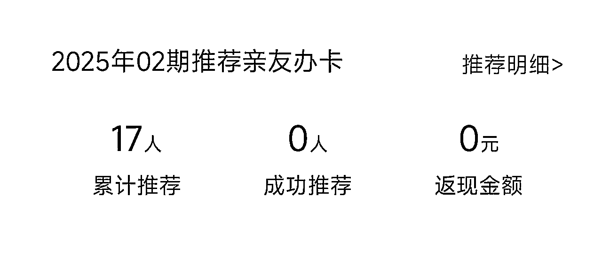
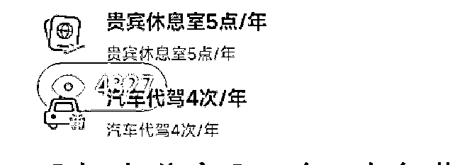
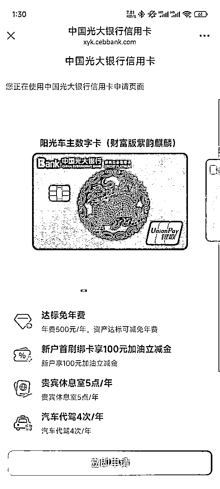
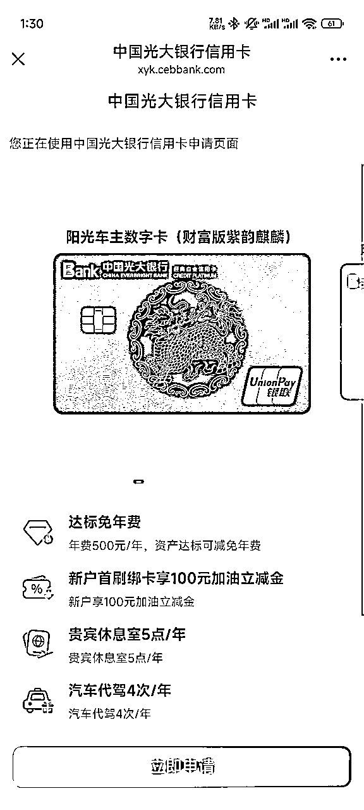
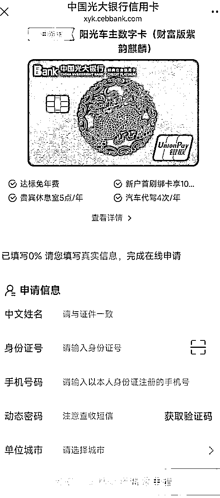
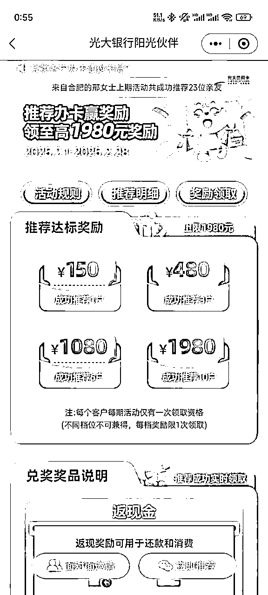
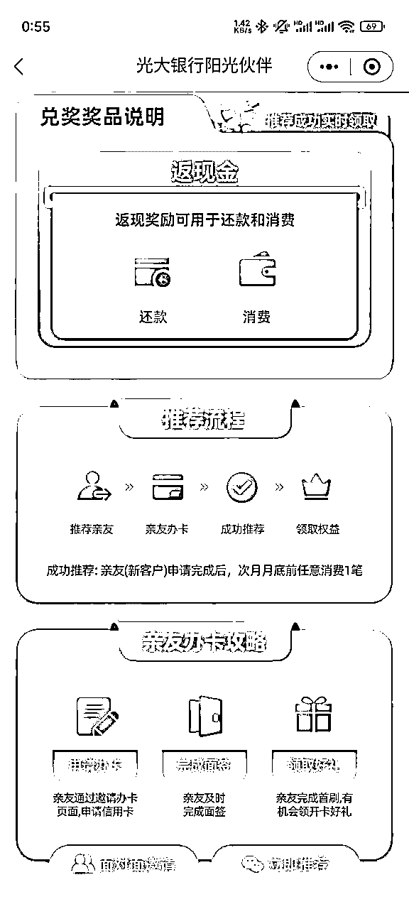
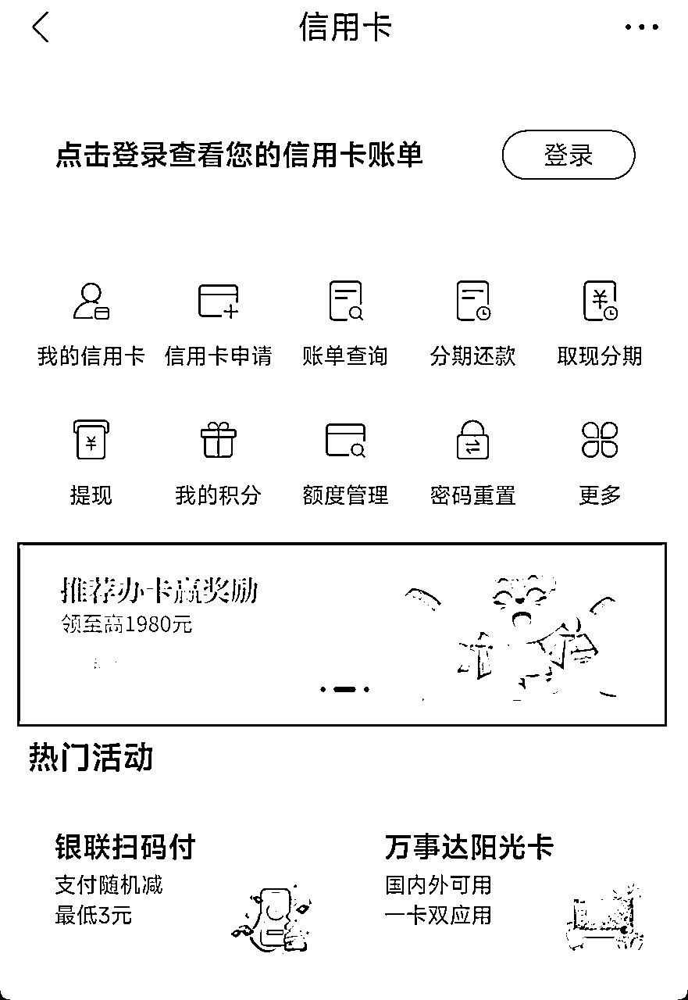
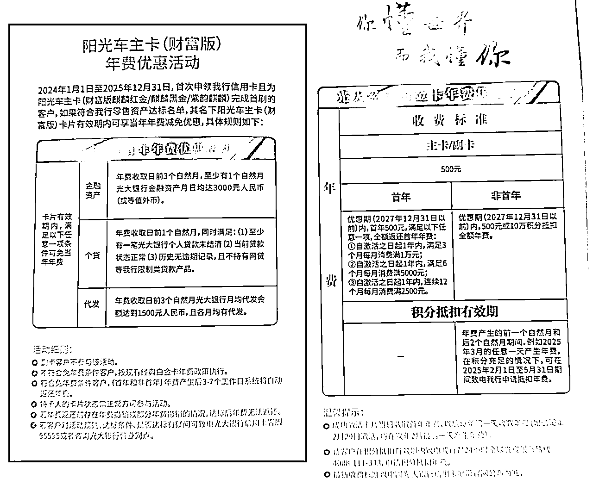

# 【实战项目】银行隐藏神卡拉新：单笔记直链转化申请17人，合规闭环最高可月入1980（附完整实操）

> 来源：[https://f6l9wzs559.feishu.cn/docx/QqUFdVmyAo4YF7xiBtecs4gWnQg](https://f6l9wzs559.feishu.cn/docx/QqUFdVmyAo4YF7xiBtecs4gWnQg)

核心逻辑

“平台直链+高权益冷门卡”轻量化变现：绕过私域跳转，直接通过小红书私信发送官方邀请链接，利用「好权益 + 低成本持卡」吸引精准用户，吃透银行阶梯奖励。

实操数据

自己2月12日晚上7点多发了一条小红书，单条笔记6小时曝光4000+ → 赞藏100+ → 42人私聊我 → 直发邀请链接转化17提交申请（咨询申请转化率40%），用户需求大，数据持续增长中。

关键词：公域直链转化 | 冷门爆品信用卡 | 银行活动杠杆 | 信息差

目录：

1、项目三大核心优势：含卡介绍

2、银行奖励规则，拉新链路介绍

3、小红书实操及用户常见问题

4、风险提示

截止2月13日凌晨2点数据，次月有多少人能首次刷卡消费，决定最终能获得多少还款金。

光大惠生活 APP 推荐人数，小红书曝光数。

数据转化漏斗：

注：转化率计算基准为「私信咨询→申请」，核心提升点在于缩短用户操作路径。

#### 一、项目三大核心优势：卡片介绍

❶ 渠道壁垒护城河

*   卡片官方公众号可查但APP无申请入口，仅支持「线下网点+老用户邀请链接」申请 → 信息差极大

*   这张卡之前是受邀用户才可办理，询问了两个网点业务员对这张卡了解的不多，往往政策需随自己一起问线上客服。

❷ 高价值权益驱动

*   贵宾厅：5点/年，最多可带3人（商旅人群刚需，补充其他白金自营贵宾厅不能带人缺陷）

*   代驾权益：每年4次代驾

*   新用户礼：新用户送100元加油立减金

*   低成本持卡：年费500元，但光大储蓄卡资产达到3k年费即可先付后返 → 用户决策门槛低

❸ 平台流量红利

*   小红书对内容审核宽松，关键词未被限流，还在不断有推荐

*   真实用户需求旺盛（评论区42人主动私聊）

#### 二、银行奖励规则，拉新链路介绍

| 阶梯奖励（按成功户数） | 推荐流程 |
| 1户，共150元 | 需要自己是光大信用卡用户 |

实际页面请以阳光惠生活，光大银行 APP 为准

扫码后的页面，选紫麒麟

用户需前置填写信息

APP-推荐有礼

APP-推荐有礼

关于拉新奖励最新的官方公众号说明：https://mp.weixin.qq.com/s/avUPoBRcE_Tdw48JJ9RurQ

#### 三、小红书实操及用户常见问题

前置准备：准备好自己的申请海报

1.  通过阳光惠生活 APP申请：推荐有礼 -> 立即推荐 -> 分享邀请海报

1.  通过光大银行 APP申请：首页 -> 信用卡 -> 中间 banner -> 立即推荐 -> 分享邀请海报

| 内容 | 标题：突出5次免费贵宾厅权益 |
| 留钩子 | 针对问怎么办理的用户：线下网点或私我给你发链接 |
| 私聊回复模板 | 保存微信扫就行，右滑到紫麒麟，有两个紫色的比较像别选错了。 |
| 基础办理条件 | 有社保 + 征信无逾期 |
| 用户问题回答 | 没有储蓄卡：先开储蓄卡，存一个月-月日均3000，再办信用卡 |
| 风控规避 | 链路合规： |

*   仅使用银行生成的带渠道ID的官方海报

*   用户必须自行点击链接申请，不可代填资料

*   禁用词：包过、必下卡、额度保障

*   禁用虚假场景：如“刷卡套现攻略”“虚假消费教程”

*   保存所有用户申请时间戳及私信记录（应对银行审核抽查）

#### 风险提示

1.  项目利弊：坏处是有人数限制，且获得奖励链路较长。好处是容易且赚钱效率相对高。

1.  奖励发放需用户次月内完成「面签+首刷」，存在流失率

1.  阶梯奖励「有时间限制，且有阶梯限制」（例：邀请2人仅按1人档计算）

1.  1，3，6，10四个人数档位，但邀请2个人的时候就只能领1个人档位的

1.  1个人是150元，3个人是480元，6个人是1080元，10个人是1980元，奖励可用于信用卡还款和消费。

1.  银行政策可能随时调整，需每月核实权益

注：卡片权益、银行活动权益请以银行官方为准。不要诱导用户办卡，不要提供虚假信息或诱导欺诈，不要侵犯个人信息安全。

网传物料：请以官方客服95595，线下网点为准。

