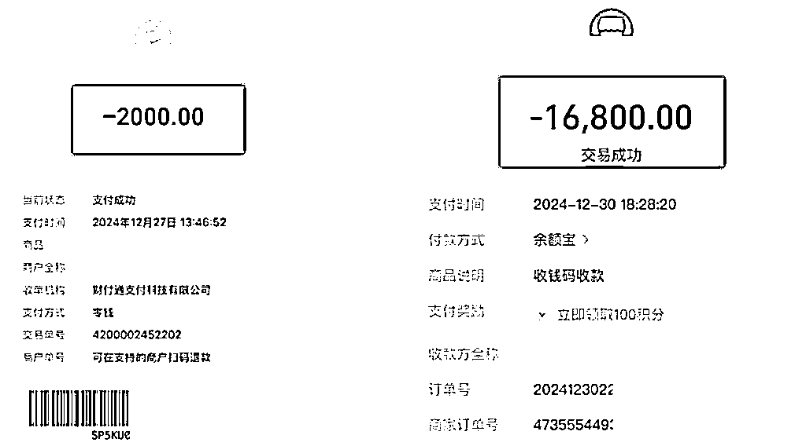
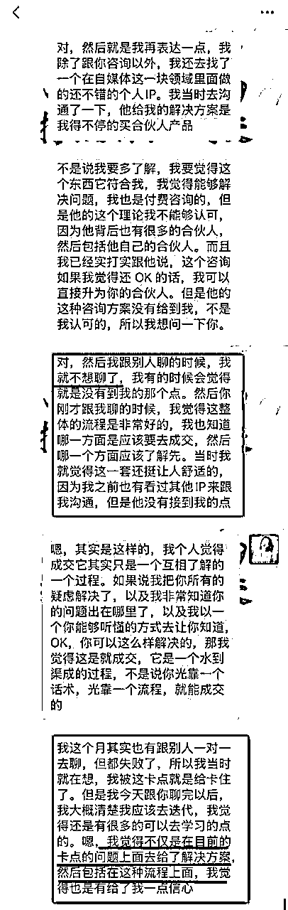
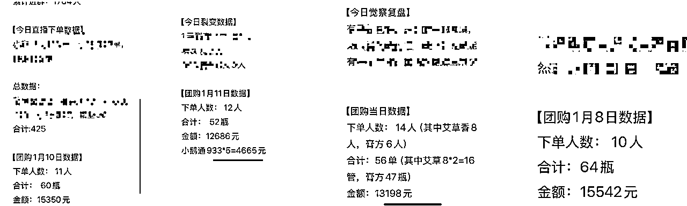
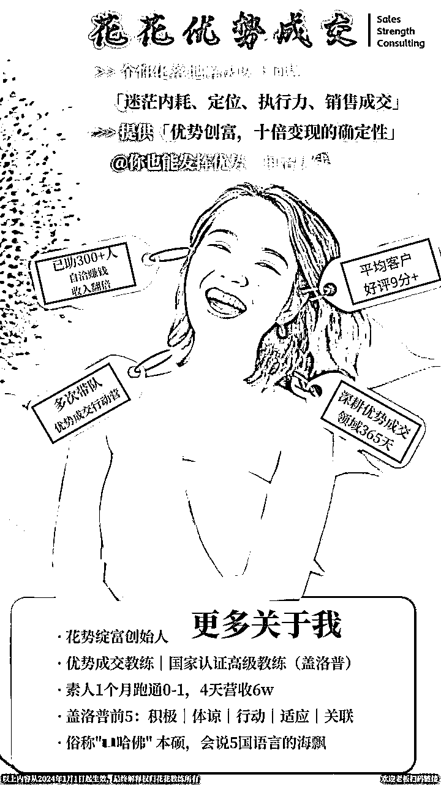

# 咨询师如何靠专家式成交，实现十倍变现？

> 来源：[https://lxfgt1wpdnk.feishu.cn/docx/GPaqdwufyoxmSfxzvi9cuQFmn2d](https://lxfgt1wpdnk.feishu.cn/docx/GPaqdwufyoxmSfxzvi9cuQFmn2d)

哈喽哈喽，你好呀！我是花花教练

这不，我是24年1月才开始系统学习一门独立赚钱的技能的，到现在也1年多了，时间过的真快啊！

这期间我通过不断的付费学习，加上多位老师的辅导

快速成为了一名专业的优势成交教练，并且在还是素人的期间就突破了4天6万的营收

要知道，过往我可从来没有过什么正经销售培训，除了大学做兼职店员做了一段时间

这不，前几天又成交了一个5位数的单子，并且还是一位完全的陌生客户，看了我的文章来链接的我

然后约了一次免费咨询，就立刻给我付费了一笔2000元的审核金

3天后通过了审核就又立刻给我付费了16800元，也就是从加上微信第一次正式交流到成交，我只用了1天时间

这是我以往从来没有过的节奏，以前的大额成交期至少是这次的20多倍

也就是从用户加到我的微信到成交4-5位数的单子都至少要1个月左右

而且他们也都不是完全陌生的用户，都是有共同高质量社群的

所以你知道，想做个人IP，高质量的内容沉淀是真的很重要啊

另外这位学员还狠狠的当面夸了我，说在我之前ta已经免费咨询过很多老师，但得到的答案都不满意，就都没有给他们付费

但是到了我这，ta觉得我的免费咨询都很有价值了，所以跟我付费学习一定能学到更多

我说：你说的对！哈哈哈

这是当时ta跟我的部分聊天记录

有了这么大的突破，我就立刻来给你掏家底儿了，哈哈哈哈

今天我就来给你分享《咨询师如何靠专家式成交，实现十倍变现》

其实不管你是不是咨询师，只要你想卖出高客单，4位数以上的产品，那你一定要好好听

那我究竟是用了哪三招，分别是怎么落地运用的呢？

我一定毫无保留的分享给你（也欢迎你提问哦）

# 我是谁

老规矩，分享前先简单说说我是谁，我的人生剧本是个干啥的😁

我是花花教练，“花花”象征着“绽放如花”的美好寓意，我渴望自己的生命能像向日葵一样绚烂开放，同时也希望我的文字能够为你带去力量与温暖

你也可以叫我靓姐

我是一名成交教练，专注于内容成交和顾问式成交，我的风格主打懂人性但不恶意利用人性。另外，我也是一名国家认证的高级优势教练

#强擅长: 做私域，挖天赋，强成交，活通透

#打造最能发挥你优势的专属成交体系

好啦，寒暄结束，接下来我们进入正餐吧😎

虽然这次质的成交突破的影响因素有很多，但我总结出了三大要素，是让我的转化率和成交期提升了20多倍的

那具体都有哪三点你拿回去就能马上用的小妙招呢？我来跟你一个一个细说哈

不过在这之前我要跟你做一个小小加餐：你知道怎么才能成为人见人爱的群红，到哪都很受欢迎吗？

受欢迎，就代表你的财源一定不会差

我跟你说，就是当你看到别人受邀在群里做分享，或者平时你喜欢的人（包括群主）在群里说话的时候

你可以跟他多互动，如果你不知道说什么好，哪怕就在群里拍拍ta，ta都会很开心的，ta会记住你的

因为其实每个人都有被看见的需求，你明白嘛～

所以这次你可以借我的分享场先练习起来，多多跟我互动留言，哪怕只是点个赞哦[Doge]

好，我们正式进入分享主题

# 第一点#成交的关键并非产品本身

你知道为什么有人发5条朋友圈就能收钱，有人每天群发8遍“亲在吗”还被拉黑？

成交其实跟产品没关系，它跟客户的信任感和需求匹配度有强关联

你家产品效果再好，客户不信任你，能成交吗？

客户花钱是来解决问题的，不是来要便宜的

很多时候，你无法成交，本质是你的客户“不认可”你所展现的价值——需通过专家视角重塑认知。

你如果想丝滑成交，一定要扮演问题解决者的角色，而非产品推销者

通过建立信任和专业性，让你的客户感到“非你不可”

那如何快速建立信任呢？

我经常用的一个小妙招就是利用好行业认知

比如用价格不等于价值等观点来给你的客户做行业科普

比如用数据对比，告诉你的客户，你所处的行业均价，来帮你快速塑造专业感和权威感

所以刚刚我问你的问题：

你知道为什么有人发5条朋友圈就能收钱，有人每天群发8遍“亲在吗”还被拉黑？

关键就三个字：像专家，但不像搞传销的！

好了，大道理不多说了，举几个例子让你更好的理解这一点吧

## 你有没有观察过你家附近卖榴莲的阿姨？

有一次一位卖榴莲的阿姨居然教会了我什么是专家人设哈哈

上周末我去菜市场，两个阿姨摊前冷热两重天

A阿姨喊：“榴莲特价28一斤！”

B阿姨问我：“美女，买榴莲是送人还是自己尝鲜？”（假装扶眼镜）

我说自己吃，她立刻掏出一副白手套，敲着榴莲说：

“听听这声儿，这是干包黄肉！你家几个人？人少的话我给你挑个小点果型圆的

开出来当场吃不完还能冻榴莲冰淇淋…哎对了我朋友圈还发过榴莲鸡汤教程，扫码送你！

第二天我就收到她私信：“美女，我这周刚到一批树熟金枕，要不要预留？”

（敲黑板了！）

看到没？阿姨B做对了哪些专家成交的关键动作？

*   第一，角色从“卖货的/卖课的”变成“你家xx问题顾问”

*   第二，张口不提价格，先了解客户需求

*   第三，专业动作配朋友圈干货，建立连接

## 再给你举一个例子

12月我参与了一位老师的年终铁粉福利，纯自然流300多人，每天1万营业额，全自发性原价下单，3天61万营业额

具体战绩👇

1️⃣2024年12月中旬，仅用1天时间扫码了8个群，做了一场年终铁粉福利——古法养生膏方团购

2️⃣ 没直播卖，没发朋友圈卖，没拉粉丝群和视频号宣发，甚至很多人都不知道这个活动，全靠社群文字输出卖货

3️⃣ 首发仅10分钟，售出1000瓶，爆单20万

4️⃣ 2天团购活动，累积售出4500瓶+养生膏方，总金额突破61万，成交人数超过500人，其中购买6瓶以上的超过200人，12瓶以上破百人

截止目前1-2个月刚过，该社群未搞任何活动，未做任何成交

全靠每天用户问诊答疑，每日都在1万流水以上，一个月自然流破30w➕年终公益答疑

每日仅靠问诊答疑，只要有人问，都是多瓶买

其他人看到别人的答疑提问，也会自动下单

所以你看，用户问诊答疑，医患关系就是最最经典的专家式成交

你说你头疼脑热浑身没劲儿，我说这很好解决，你的问题是因为你着凉+脾胃问题引起的

你吃了这个xxx产品/药周末前就能好，可以开开心心的陪你对象去约会了

但只有我这里有得卖，你找不找我买？

只要你信我的专业，还有成功案例，你急迫的想解决你的问题，你就大概率会追着我买，对吧？

好，我们再来说第二点

跟你透露一个顶级玩家的阴……啊不，是价值升华大法！[Happy]

# 第二点#“专家式价值塑造”的3大核心能力

其实这第二点是第一点的一个延展哈

记住这句话：专家卖的不是课，是亲手给你点的阿拉丁神灯！

一个合格的销冠必须熟记这三点，并且用的炉火纯青：

## 2.1 需求分析与反向提问

反向提问是什么意思？

简单说就是报价前你要判断客户对你是否信任。你得分析他的家庭背景啊、工作环境啊、消费习惯啊——这才是报价的前提

## 2.2 价值转移：从“价格”到“收益”

很多人都不知道怎么报价，别人你问你，xxx多少钱，你就甩一张海报过去，只要4999元

其实你可以这样说

“xx，我们这个行业价位有三五千、三四万、十几万，但价格不重要，细节、避坑能力、安全靠谱才是核心，价格不匹配需求，解决不了你的问题，再低都没用，对吧？”

所以你可以用行业标杆案例（比如“我的客户小王花了8888元跟我学习一段时间后收益x3倍了）

这样你就能转移客户注意力至长期收益上，就不用去跟你的同行打价格战了，比谁卖的价格低了，对吧？

## 2.3 二次跟单：解决客户决策卡点

其实80%的成交都需多次跟进的，也就是“成交进度条”

那如果你的客户总是犹豫不决，不肯做决定怎么办？

你可以这么说

“xx，我这两天没睡好，因为担心您选错产品得不偿失。我们这个行业鱼龙混杂，必须满足细节、案例、安全这几个条件，否则一定吃亏”

适当的用“危机感+解决方案”的跟进话术，来表示你是真的站在他的立场上为他发言的，也就是“利他”

## 再给你举个例子

我有一位宝妈学员，我们叫她小A好了，以前想卖她的课，都是这么喊的

“报我的家长训练营送10本电子书！《正面管教》《如何说孩子才会听》…”

然后客户默默截图去淘宝搜盗版

后来我就跟她说，你这样不行的，你下次试试跟你的意向客户用专家顾问的方式聊

结果她试了3招，第一次就成交了4位数的产品

我们来具体看看她怎么做到的哈

### 第一招：深夜刷客户朋友圈挖痛点

小A问客户B：看您上周晒了孩子英语作业被老师批评的emo表情包[Chuckle]，是不是每天盯听写到十点血压都高了？

（从晒娃日常发现辅导困境，而不是直接问“你孩子成绩差吗”）

### 第二招：偷偷踩竞品立专业

B说：“之前买过XX老师的沟通课…”

小A接话：“哦 我知道这个课程，它主要教主动倾听，但您家娃正值青春期，是不是您刚开口说‘我们来聊聊’，孩子就摔门？”

（不用急着否定同行，而是点出方法vs阶段不匹配的真相）

### 第三招：用家属职业勾专属方案

听说客户老公是程序员，小A补刀：“我有个学员爸爸也是工程师，他还开发了个‘发脾气代码自查表’呢

比如孩子尖叫 = 系统bug是‘被同学嘲笑穿假AJ’，解决方案不是讲道理，而是带他实操怼人金句…

哈哈 类似这种的，还挺有趣

（把专业知识包装成客户熟悉领域的“黑话”）

结果客户当场转钱：

报过三四个课都没用，原来根本不是我的问题，是没遇到懂程序媛家庭的老师！[Salute]

当然，这些例子被我简化过了，但重要的步骤并没有确实

重要的是你要记得这三个成交关键点：

✓ 晒娃朋友圈=家庭教育的伤痛文学

✓ 点评竞品要像老中医把脉：“药是好药，但您这体质得换方子”

✓ 家属职业是隐藏金矿——律师家庭聊“亲子辩论赛规则”，医生家庭谈“作业拖延病理分析”…

下次客户再说“我回去和孩子商量”，你就捂住胸口说

“千万别！您先试试我这招‘反向沉默战术’

孩子吼‘别管我’时，您打开手机录音放他最爱听的《孤勇者》…具体原理？扫码私聊发您完整脑科学报告！”[Tongue]

其实专家提问的潜规则就像是：

*   跟闺蜜聊天一样扒客户底裤…啊不，是背景（战术挠头）

*   用行业黑话+客户私人线索=“你比我自己还懂我”幻觉

*   全程避开价格，等客户再三主动问价时已经完成80%信任充值

# 第三点#训练式实战教学模式

很多时候，你与其给客户讲太多道理，你不如创造个机会让他实战

人真的当着你的面上手练了，将自己的弱点展示出来了，你即时的帮他改正优化，他对你的信任就总会比对别人强

不管你是做咨询的，还是教人写朋友圈文案的，还是教人用AI的，其实都能用“训练式教学”

当然，很多其他行业和定位也都能用

一个简单的教学框架就是：

①线上成交的重要性

②微信成交5步，追单5步

③大量成交案例，未成交案例拆解(围绕用户视角和情绪价值)

④答疑解惑

⑤现场实战启动“开卖”活动

你可以做线上，也可以做线下

理论讲完，最后一步现场制定“开卖”活动方案，从预热到启动，再到现场聊单成交，每个人完不成目标不许走

只要你能让用户亲自感受到，拿来就用，用了就有效的即时效果

他们在现场有了最强的体感，那在最后你的成交环节，大部分人是基本毫无犹豫就会下单，争着抢着就把卡刷了的😁

为什么？因为人不会因为知识而付费，他们只会因为改变和好处付费

你们今天听完分享之后，如果有机会用了我分享给你的哪招，有用了，记得私信我报喜哦！我会很开心的

# 结语

如果把成交比做打怪通关的话，那么成交这一下，就是最后那1%！

而往往很多人都会卡在这1%上，千万别小瞧最后这样一脚，用好了直接提升3倍成交率！！

那作为销冠的你，要做的是什么？

就是把最后临门一脚变得比德芙还丝滑 哈哈

哎呀呀，感谢你们听我无厘头的叽叽喳喳到现在

（实际上我是E人中的I人，为了避免紧张搞笑一点平衡我的紧张情绪）

今天给你带来的3点成交小妙招，你学会了吗？

第一点#成交的关键并非产品本身

第二点#“专家式价值塑造”的3大核心能力

第三点#训练式实战教学模式

当然，今天分享的专家式成交并不是靠简单的几句话术就能完成的，背后是一个成交系统，包括你的营销物料，朋友圈怎么发，平时的内容输出等等等等，但今天的分享内容是一个很好的启发～

如果我的分享能对你有一点点的收获，请给我个回应好吗？老规矩，花式复盘走起！

001 你的感受

002 你的新知

003 你的行动

写满50字的复盘发在评论区，记得@我，让我知道你看见我了哦～🎁

最后感谢你的聆听，爱你哦❤️～

